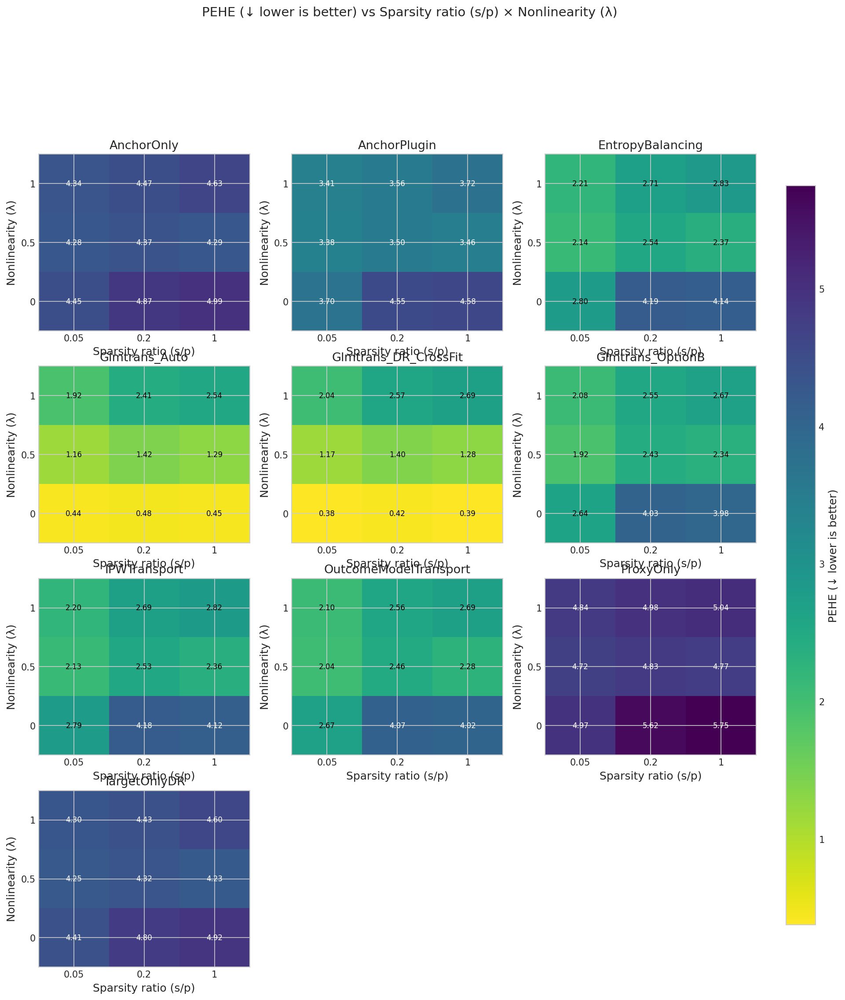

# A5 Assumption Violation: Sparsity × Nonlinearity heatmap

**Benchmark ID:** `a5_violation_sweep`

**Generated:** 2026-02-06 16:43

---

## 1. Motivation

**Research Question:** How does our method degrade when Assumption A5 (sparse linear correction) is violated?

**Why This Matters:**
A5 states that the site-specific deviation δ(x) = x^T β is sparse and linear.
This 2D grid tests violations along two axes:

1. **Sparsity violation (s/p):** β has more non-zero entries
   - s/p = 0.05: Sparse (A5 holds) - 5% of features have non-zero coefficients
   - s/p = 0.20: Moderate violation - 20% non-zero
   - s/p = 1.0: Dense (A5 violated) - all features contribute

2. **Nonlinearity violation (λ):** Deviation becomes nonlinear
   - λ = 0: δ(x) = x^T β (linear, A5 holds)
   - λ = 0.5: δ(x) = 0.5·x^T β + 0.5·g(x) (mixture)
   - λ = 1.0: δ(x) = g(x) (fully nonlinear, A5 violated)
   
Where g(x) = Σ_j tanh(x_j) is a smooth additive nonlinearity.

**Key Control:** Var(δ(X)) is held constant across all settings.
This ensures we're testing structural misspecification, not signal strength.

**Expected Outcome:**
- Strong performance at (0.05, 0): A5 holds
- Graceful degradation as we move away from origin
- Convergence toward TargetOnlyDR at (1.0, 1.0)

**Grid:** 3 × 3 = 9 scenarios

---

## 2. Simulation Setup

**A5 Violation DGP:**

Uses FairSyntheticRCTConfig with controlled A5 violations:
- **Sparsity control:** `a5_sparsity_ratio` = s/p
- **Nonlinearity control:** `a5_nonlin_lambda` = λ
- **Nonlinear function:** g(x) = Σ tanh(x_j) (smooth additive)
- **Variance normalized:** Var(δ(X)) ≡ 1 regardless of (s/p, λ)

All other assumptions (A1-A4, A6) are held at fair values:
- SNR ≈ 3-4 (good cross-arm transfer)
- Overlap AUC ≈ 0.7-0.8 (moderate overlap)
- Intercept drift SD = 0.5 (controlled)

### Swept Parameters (Varied Across Scenarios)

| Parameter | Values | Description |
|-----------|--------|-------------|
| **a5_sparsity_ratio** | `[0.05, 0.2, 1.0]` | Parameter: a5_sparsity_ratio |
| **a5_nonlin_lambda** | `[0.0, 0.5, 1.0]` | Parameter: a5_nonlin_lambda |

### Fixed Parameters (Held Constant)

| Parameter | Value | Description |
|-----------|-------|-------------|
| m0 | `550` | Target placebo/control sample size (n₀) |
| m1 | `500` | Target treated sample size (n₁). If 0, only Option B methods are feasible. |
| n_proxy_total | `20000` | Total source/proxy observations across all sites |
| C_sources | `10` | Number of source sites (K) |
| p_dim | `50` | Covariate dimension (d). Higher d = harder estimation. |
| nontransfer_scale | `0.1` | Scale of non-transferable component (σᵥ). Higher = less transfer benefit. |
| use_fair_dgp | `True` | Parameter: use_fair_dgp |
| overlap_lambda | `0.25` | Covariate distribution divergence (0=identical, 1=disjoint) |
| intercept_drift_scale | `0.5` | Scale of arm-specific intercept drift across sites |
| a5_decay_alpha | `2.0` | Parameter: a5_decay_alpha |
| a5_violation_eta | `0.0` | Parameter: a5_violation_eta |
| a5_nonlin_type | `additive` | Parameter: a5_nonlin_type |

### Experimental Design Summary

- **Sweep type:** `2d`
- **Number of swept parameters:** 2
- **Number of fixed parameters:** 12
- **Total unique scenarios:** 9

---

## 3. Metrics & Interpretation

| Metric | Direction | Description |
|--------|-----------|-------------|
| **PEHE (Precision in Estimating Heterogeneous Effects)** | ↓ lower is better | Root mean squared error of CATE predictions. Measures how accurately the estimat... |
| **ATE Absolute Error** | ↓ lower is better | Absolute difference between estimated and true average treatment effect.... |
| **ATE Bias (Signed)** | ↑ closer to 0 is better | Signed bias in ATE estimate. Positive = overestimate, negative = underestimate.... |
| **Spearman Rank Correlation** | ↑ higher is better | Rank correlation between predicted and true treatment effects.... |
| **Kendall Rank Correlation** | ↑ higher is better | Kendall tau-b correlation. More robust to ties than Spearman.... |
| **Qini AUC (Oracle)** | ↑ higher is better | Area under the Qini curve. Measures ranking quality for treatment targeting.... |
| **Top-10% Uplift Capture Ratio** | ↑ higher is better | Fraction of maximum uplift captured when treating top 10% by predicted CATE.... |
| **Top-20% Uplift Capture Ratio** | ↑ higher is better | Fraction of maximum uplift captured when treating top 20% by predicted CATE.... |
| **Top-30% Uplift Capture Ratio** | ↑ higher is better | Fraction of maximum uplift captured when treating top 30%.... |
| **Calibration Slope** | ↑ closer to 1 is better | Slope of regression of true τ on predicted τ̂. Ideal = 1.0.... |
| **Calibration R²** | ↑ higher is better | Variance explained by predictions. Measures calibration quality.... |
| **CATE ECE (Expected Calibration Error)** | ↓ lower is better | Expected calibration error for CATE. Binned average miscalibration.... |
| **Policy Value (Treat if τ̂ > 0)** | ↑ higher is better | Expected outcome under threshold-based treatment policy.... |
| **Policy Regret vs Oracle** | ↓ lower is better | Gap between oracle policy value and estimated policy value.... |
| **Policy Value (Treat Top 20%)** | ↑ higher is better | Expected outcome when treating top 20% by predicted CATE.... |
| **Policy Regret (Top 20% Budget)** | ↓ lower is better | Regret compared to oracle top-20% policy.... |
| **μ₀ RMSE (Control Outcome)** | ↓ lower is better | RMSE of predicted control outcomes. Measures nuisance estimation quality.... |

### Detailed Metric Definitions

**PEHE (Precision in Estimating Heterogeneous Effects)**

- Formula: $\sqrt{\frac{1}{n}\sum_i (\hat{\tau}(x_i) - \tau(x_i))^2}$
- Direction: **lower is better**
- A PEHE of 0.5 means predictions are off by 0.5 units on average.

**ATE Absolute Error**

- Formula: $|\hat{\text{ATE}} - \text{ATE}|$
- Direction: **lower is better**
- Important for policy decisions about whether to adopt treatment broadly.

**ATE Bias (Signed)**

- Formula: $\hat{\text{ATE}} - \text{ATE}$
- Direction: **closer to 0 is better**
- Shows systematic over/under-estimation tendencies.

**Spearman Rank Correlation**

- Formula: $\rho(\text{rank}(\hat{\tau}), \text{rank}(\tau))$
- Direction: **higher is better**
- 1.0 = perfect ranking, 0.0 = random. Critical for targeting interventions.

**Kendall Rank Correlation**

- Formula: $\tau_K(\hat{\tau}, \tau)$
- Direction: **higher is better**
- Alternative ranking metric; useful when ties are common.

**Qini AUC (Oracle)**

- Formula: Normalized AUC of cumulative uplift curve
- Direction: **higher is better**
- 1.0 = oracle ranking, 0.0 = random. Simulation-only metric using true τ.

**Top-10% Uplift Capture Ratio**

- Formula: $\frac{\bar{\tau}_{top10\%\ by\ \hat{\tau}}}{\bar{\tau}_{top10\%\ by\ \tau}}$
- Direction: **higher is better**
- 1.0 = oracle selection. Measures targeting efficiency for top patients.

**Top-20% Uplift Capture Ratio**

- Formula: $\frac{\bar{\tau}_{top20\%\ by\ \hat{\tau}}}{\bar{\tau}_{top20\%\ by\ \tau}}$
- Direction: **higher is better**
- 1.0 = oracle selection. Less stringent than top-10%.

**Top-30% Uplift Capture Ratio**

- Formula: $\frac{\bar{\tau}_{top30\%\ by\ \hat{\tau}}}{\bar{\tau}_{top30\%\ by\ \tau}}$
- Direction: **higher is better**
- Less stringent targeting metric.

**Calibration Slope**

- Formula: $\beta$ in $\tau = \alpha + \beta \hat{\tau}$
- Direction: **closer to 1 is better**
- <1 = overconfident predictions, >1 = underconfident.

**Calibration R²**

- Formula: $R^2$ of calibration regression
- Direction: **higher is better**
- Higher R² means predictions track true effects well.

**CATE ECE (Expected Calibration Error)**

- Formula: $\sum_b \frac{n_b}{n} |E[\tau | \hat{\tau} \in b] - E[\hat{\tau} | \hat{\tau} \in b]|$
- Direction: **lower is better**
- Lower ECE means better calibration across prediction ranges.

**Policy Value (Treat if τ̂ > 0)**

- Formula: $E[\mu_0 + \pi(\hat{\tau}) \cdot \tau]$ where $\pi(\hat{\tau}) = 1\{\hat{\tau} > 0\}$
- Direction: **higher is better**
- Higher value = better treatment decisions based on predictions.

**Policy Regret vs Oracle**

- Formula: $V(\pi^*) - V(\hat{\pi})$
- Direction: **lower is better**
- Lower regret = closer to optimal treatment decisions.

**Policy Value (Treat Top 20%)**

- Formula: $E[\mu_0 + \pi_{top20\%}(\hat{\tau}) \cdot \tau]$
- Direction: **higher is better**
- Budget-constrained policy evaluation.

**Policy Regret (Top 20% Budget)**

- Formula: $V(\pi^*_{top20\%}) - V(\hat{\pi}_{top20\%})$
- Direction: **lower is better**
- Budget-constrained regret.

**μ₀ RMSE (Control Outcome)**

- Formula: $\sqrt{\frac{1}{n}\sum_i (\hat{\mu}_0(x_i) - \mu_0(x_i))^2}$
- Direction: **lower is better**
- Important diagnostic; poor μ₀ estimation can propagate to CATE errors.

---

## 4. Methods Compared

### 4.1 Method Summary Table

| Method | Category | Target Placebo | Target Treated | Source | Description |
|--------|----------|----------------|----------------|--------|-------------|
| **TargetOnlyDR** | Baseline | ✓ | ✓ | ✗ | Target-only DR learner (no transfer) |
| **ProxyOnly** | Baseline | ✗ | ✗ | ✓ | Source-only proxy (no target correction) |
| **Glmtrans_Auto** | Transfer Learning | ✓ | ✓ | ✓ | glmtrans with auto source detection |
| **Glmtrans_DR_CrossFit** | Transfer Learning | ✓ | ✓ | ✓ | glmtrans with CROSS-FITTED DR (RECOMMENDED) |
| **Glmtrans_OptionB** | Transfer Learning | ✓ | ✗ | ✓ | Option B: glmtrans source detection + Source-DR CATE |
| **AnchorOnly** | Anchor | ✓ | ✓ | ✓ | Placebo-anchored with DR (needs target treated) |
| **AnchorPlugin** | Anchor | ✓ | ✗ | ✓ | Placebo-anchored plug-in (no DR) |
| **IPWTransport** | Transport | ✓ | ✗ | ✓ | IPW-weighted outcome models |
| **EntropyBalancing** | Transport | ✓ | ✗ | ✓ | Entropy balancing weights |
| **OutcomeModelTransport** | Transport | ✓ | ✗ | ✓ | Unweighted outcome models |

### 4.2 Method Implementation Details

#### TargetOnlyDR

**Category:** Baseline

**Description:** Target-only DR learner (no transfer)

**Data Requirements:** Target placebo (A=0), Target treated (A=1)

**Pseudo-code:**
```
1. Fit μ̂₀(x) on target controls: (X_target[A=0], Y_target[A=0])
2. Fit μ̂₁(x) on target treated: (X_target[A=1], Y_target[A=1])
3. Compute DR pseudo-outcomes on target:
   Γᵢ = (Aᵢ/ê)(Yᵢ - μ̂₁(Xᵢ)) + μ̂₁(Xᵢ) - ((1-Aᵢ)/(1-ê))(Yᵢ - μ̂₀(Xᵢ)) - μ̂₀(Xᵢ)
4. Fit τ̂(x) on (X_target, Γ) using Lasso
```

**Reference:** Kennedy (2020) - Doubly Robust Learner

---

#### ProxyOnly

**Category:** Baseline

**Description:** Source-only proxy (no target correction)

**Data Requirements:** Source data

**Pseudo-code:**
```
1. Pool all source data by treatment arm
2. Fit μ̂₀^src(x) on source controls
3. Fit μ̂₁^src(x) on source treated
4. Predict: τ̂(x) = μ̂₁^src(x) - μ̂₀^src(x)
```

**Reference:** Naive source pooling baseline

---

#### Glmtrans_Auto

**Category:** Transfer Learning

**Description:** glmtrans with auto source detection

**Data Requirements:** Target placebo (A=0), Target treated (A=1), Source data

**Pseudo-code:**
```
For each outcome model (μ₀ and μ₁):
  1. SOURCE DETECTION: Identify transferable sources
     - Fit target-only model, compute CV loss L_target
     - For each source k: compute loss L_k
     - Source k transferable if L_k ≤ C₀ · L_target
  2. TRANSFER STEP: Pool transferable sources
     - Fit elastic-net on pooled source data → ŵ_A
  3. DEBIAS STEP: Correct on target
     - Compute residuals: r = Y_target - X_target · ŵ_A
     - Fit elastic-net on residuals → δ̂_A
  4. FINAL: β̂ = ŵ_A + δ̂_A

CATE: τ̂(x) = μ̂₁(x) - μ̂₀(x)
```

**Reference:** Tian & Feng (2023) JASA

---

#### Glmtrans_DR_CrossFit

**Category:** Transfer Learning

**Description:** glmtrans with CROSS-FITTED DR (RECOMMENDED)

**Data Requirements:** Target placebo (A=0), Target treated (A=1), Source data

**Pseudo-code:**
```
For k = 1, ..., K folds:
  1. Split target into train (fold ≠ k) and test (fold = k)
  2. Fit glmtrans on train target + ALL sources
  3. Get OUT-OF-FOLD predictions μ̂₀[test], μ̂₁[test]
  4. Fit ridge logistic propensity on train target
  5. Get OUT-OF-FOLD ê[test]

After cross-fitting:
  6. Clip propensities: ê_clipped = clip(ê, 0.05, 0.95)
  7. Compute DR pseudo-outcomes (using OOF estimates):
     Γᵢ = μ̂₁(Xᵢ) - μ̂₀(Xᵢ) + (Aᵢ-ê)/(ê(1-ê)) · residual
  8. Fit τ̂(x) on (X_target, Γ) using Lasso

Diagnostics:
  - Var(Γ) / Var(μ̂₁-μ̂₀): If >> 1, DR is hurting
  - Max inverse weight: If > 20, weights are unstable
```

**Reference:** Advisor-recommended cross-fitted DR construction

---

#### Glmtrans_OptionB

**Category:** Transfer Learning

**Description:** Option B: glmtrans source detection + Source-DR CATE

**Data Requirements:** Target placebo (A=0), Source data

**Pseudo-code:**
```
Stage 0 (Source Detection - Control Arm ONLY):
  # This is the ONLY place glmtrans theory applies
  1. Target placebo: (X_t, Y_t(0))
  2. Source controls: [(X_sk[A=0], Y_sk(0)) for k in 1..K]
  3. Run glmtrans(target, sources, family="gaussian", transfer.source.id="auto")
  4. Return selected sources: Ŝ₀ ⊂ {1,...,K}
  # Uses ONLY Y_target(0) - exactly as glmtrans was designed

Stage 1 (Restrict to Selected Sources - NO WEIGHTING):
  # Simply subset. No soft selection, no importance weighting.
  D_src^good = ∪_{k ∈ Ŝ₀} D_k

Stage 2 (Source-DR CATE):
  # DR learning happens WHERE IDENTIFICATION HOLDS: on sources
  1. Fit μ̂₀^src on X_good[A=0], Y_good[A=0]
  2. Fit μ̂₁^src on X_good[A=1], Y_good[A=1]  
  3. ê = mean(A) on selected sources
  4. DR pseudo-outcomes on SOURCES:
     Γᵢ = μ̂₁(Xᵢ) - μ̂₀(Xᵢ) + (Aᵢ-ê)/(ê(1-ê)) · (Yᵢ - μ̂_{Aᵢ}(Xᵢ))
  5. Fit τ̂^src(x) = E[Γ|X=x] on source pseudo-outcomes

Stage 3 (Transport to Target):
  # Direct transport - relies on structural similarity encoded by Ŝ₀
  τ̂_target(x) := τ̂^src(x)
  # No further correction (we have no target treated data)

VALID FOR: Placebo-only target (m₁=0)
IDENTIFICATION: Via transferable source selection + DR on sources
```

**Reference:** Advisor construction based on Tian & Feng (2023) JASA

---

#### AnchorOnly

**Category:** Anchor

**Description:** Placebo-anchored with DR (needs target treated)

**Data Requirements:** Target placebo (A=0), Target treated (A=1), Source data

**Pseudo-code:**
```
1. Fit source proxy: μ̂₀^src(x) on pooled source controls
2. Compute residuals on target placebo: δ̂₀(x) = Y - μ̂₀^src(X)
3. Fit correction: δ̂₀(x) using Lasso on target placebo residuals
4. Corrected μ̂₀(x) = μ̂₀^src(x) + δ̂₀(x)
5. Fit μ̂₁(x) directly on target treated
6. DR pseudo-outcomes + CATE model
```

**Reference:** Placebo-anchored transfer

---

#### AnchorPlugin

**Category:** Anchor

**Description:** Placebo-anchored plug-in (no DR)

**Data Requirements:** Target placebo (A=0), Source data

**Pseudo-code:**
```
1. Fit source proxy: μ̂₀^src(x), μ̂₁^src(x)
2. Compute residuals on target placebo
3. Fit correction δ̂₀(x) on residuals
4. Plug-in: τ̂(x) = μ̂₁^src(x) - (μ̂₀^src(x) + δ̂₀(x))
   (No DR pseudo-outcomes, no target treated needed)
```

**Reference:** Plug-in variant of anchor

---

#### IPWTransport

**Category:** Transport

**Description:** IPW-weighted outcome models

**Data Requirements:** Target placebo (A=0), Source data

**Pseudo-code:**
```
1. Estimate site membership: P(S=target|X)
2. Compute IPW weights: w(x) = P(S=target|X) / P(S=source|X)
3. Fit weighted outcome models on source:
   μ̂ₐ = argmin Σᵢ wᵢ·(Yᵢ - μ(Xᵢ))²
4. Predict: τ̂(x) = μ̂₁(x) - μ̂₀(x)
```

**Reference:** Hong et al. - IPW transport

---

#### EntropyBalancing

**Category:** Transport

**Description:** Entropy balancing weights

**Data Requirements:** Target placebo (A=0), Source data

**Pseudo-code:**
```
1. Find weights w that balance source to target:
   Σᵢ wᵢ·Xᵢ = X̄_target (moment matching)
   max Σᵢ wᵢ·log(wᵢ) (max entropy)
2. Fit weighted outcome models
3. Predict: τ̂(x) = μ̂₁(x) - μ̂₀(x)
```

**Reference:** Hainmueller (2012)

---

#### OutcomeModelTransport

**Category:** Transport

**Description:** Unweighted outcome models

**Data Requirements:** Target placebo (A=0), Source data

**Pseudo-code:**
```
1. Fit outcome models on source (unweighted):
   μ̂ₐ^src on (X_source[A=a], Y_source[A=a])
2. Predict on target: τ̂(x) = μ̂₁^src(x) - μ̂₀^src(x)
   (Assumes outcome model generalizes across sites)
```

**Reference:** Baseline - no reweighting

---

---

## 5. Experiment Summary

- **Sweep parameter:** `a5_sparsity_ratio` ∈ [0.05, 0.2, 1.0]
- **Monte Carlo replicates:** 100 per scenario
- **Methods evaluated:** 10
- **Total runs:** 9000

---

## 6. Results

### Best Methods (averaged across sweep)

| Metric | Best Method | Value | Direction |
|--------|-------------|-------|----------|
| PEHE | **Glmtrans_DR_CrossFit** | 0.3754 | ↓ lower |
| ATE Error | **Glmtrans_Auto** | 0.0306 | ↓ lower |
| Spearman ρ | **Glmtrans_DR_CrossFit** | 0.9976 | ↑ higher |
| Kendall τ | **Glmtrans_DR_CrossFit** | 0.9624 | ↑ higher |
| Qini AUC | **Glmtrans_DR_CrossFit** | 0.9979 | ↑ higher |
| Top-10% Ratio | **Glmtrans_DR_CrossFit** | 0.9978 | ↑ higher |
| Top-20% Ratio | **Glmtrans_DR_CrossFit** | 0.9980 | ↑ higher |
| Calibration R² | **Glmtrans_DR_CrossFit** | 0.9957 | ↑ higher |
| CATE ECE | **Glmtrans_DR_CrossFit** | 0.0552 | ↓ lower |
| Policy Value | **Glmtrans_DR_CrossFit** | 2.7454 | ↑ higher |
| Policy Regret | **Glmtrans_DR_CrossFit** | 0.0049 | ↓ lower |

### Core Metrics

| a5_sparsity_ratio | Method | PEHE (↓) | ATE Err (↓) | Spearman (↑) | Qini (↑) |
|---|---|---|---|---|
| 0.05 | AnchorOnly | 4.336 ± 0.559 | 0.153 ± 0.116 | 0.660 ± 0.044 | 0.677 ± 0.042 |
| 0.05 | AnchorOnly | 4.451 ± 0.703 | 0.203 ± 0.136 | 0.668 ± 0.042 | 0.686 ± 0.041 |
| 0.05 | AnchorOnly | 4.284 ± 0.529 | 0.186 ± 0.144 | 0.662 ± 0.044 | 0.679 ± 0.042 |
| 0.05 | AnchorPlugin | 3.409 ± 0.528 | 0.708 ± 0.558 | 0.790 ± 0.052 | 0.804 ± 0.050 |
| 0.05 | AnchorPlugin | 3.704 ± 0.923 | 0.763 ± 0.575 | 0.759 ± 0.085 | 0.773 ± 0.083 |
| 0.05 | AnchorPlugin | 3.382 ± 0.675 | 0.690 ± 0.571 | 0.783 ± 0.064 | 0.797 ± 0.062 |
| 0.05 | EntropyBalancing | 2.214 ± 1.109 | 0.606 ± 0.465 | 0.908 ± 0.081 | 0.916 ± 0.075 |
| 0.05 | EntropyBalancing | 2.802 ± 1.254 | 0.802 ± 0.598 | 0.867 ± 0.110 | 0.876 ± 0.105 |
| 0.05 | EntropyBalancing | 2.137 ± 1.024 | 0.653 ± 0.512 | 0.914 ± 0.081 | 0.920 ± 0.076 |
| 0.05 | Glmtrans_Auto | 1.918 ± 1.193 | 0.095 ± 0.074 | 0.918 ± 0.081 | 0.925 ± 0.075 |
| 0.05 | Glmtrans_Auto | 0.437 ± 0.109 | 0.036 ± 0.026 | 0.997 ± 0.002 | 0.997 ± 0.002 |
| 0.05 | Glmtrans_Auto | 1.160 ± 0.679 | 0.069 ± 0.067 | 0.970 ± 0.030 | 0.973 ± 0.027 |
| 0.05 | Glmtrans_DR_CrossFit | 2.043 ± 1.247 | 0.097 ± 0.083 | 0.906 ± 0.091 | 0.914 ± 0.085 |
| 0.05 | Glmtrans_DR_CrossFit | 0.375 ± 0.115 | 0.035 ± 0.027 | 0.997 ± 0.002 | 0.998 ± 0.002 |
| 0.05 | Glmtrans_DR_CrossFit | 1.166 ± 0.688 | 0.071 ± 0.068 | 0.969 ± 0.030 | 0.972 ± 0.028 |
| 0.05 | Glmtrans_OptionB | 2.079 ± 1.132 | 0.574 ± 0.435 | 0.917 ± 0.080 | 0.924 ± 0.074 |
| 0.05 | Glmtrans_OptionB | 2.637 ± 1.206 | 0.827 ± 0.616 | 0.883 ± 0.104 | 0.891 ± 0.099 |
| 0.05 | Glmtrans_OptionB | 1.921 ± 0.873 | 0.601 ± 0.439 | 0.932 ± 0.062 | 0.937 ± 0.058 |
| 0.05 | IPWTransport | 2.203 ± 1.114 | 0.611 ± 0.468 | 0.909 ± 0.081 | 0.917 ± 0.075 |
| 0.05 | IPWTransport | 2.786 ± 1.251 | 0.801 ± 0.602 | 0.868 ± 0.109 | 0.878 ± 0.104 |
| 0.05 | IPWTransport | 2.126 ± 1.024 | 0.655 ± 0.514 | 0.915 ± 0.080 | 0.921 ± 0.076 |
| 0.05 | OutcomeModelTransport | 2.096 ± 1.127 | 0.598 ± 0.466 | 0.917 ± 0.079 | 0.924 ± 0.073 |
| 0.05 | OutcomeModelTransport | 2.673 ± 1.259 | 0.794 ± 0.575 | 0.878 ± 0.106 | 0.886 ± 0.101 |
| 0.05 | OutcomeModelTransport | 2.038 ± 1.027 | 0.646 ± 0.499 | 0.921 ± 0.078 | 0.927 ± 0.073 |
| 0.05 | ProxyOnly | 4.841 ± 0.722 | 0.984 ± 0.794 | 0.549 ± 0.082 | 0.566 ± 0.081 |
| 0.05 | ProxyOnly | 4.969 ± 0.891 | 0.915 ± 0.750 | 0.541 ± 0.090 | 0.558 ± 0.091 |
| 0.05 | ProxyOnly | 4.725 ± 0.684 | 0.914 ± 0.740 | 0.553 ± 0.075 | 0.570 ± 0.075 |
| 0.05 | TargetOnlyDR | 4.301 ± 0.566 | 0.164 ± 0.117 | 0.669 ± 0.042 | 0.686 ± 0.041 |
| 0.05 | TargetOnlyDR | 4.409 ± 0.700 | 0.216 ± 0.139 | 0.677 ± 0.039 | 0.694 ± 0.037 |
| 0.05 | TargetOnlyDR | 4.246 ± 0.525 | 0.210 ± 0.166 | 0.673 ± 0.041 | 0.690 ± 0.039 |
| 0.2 | AnchorOnly | 4.466 ± 0.620 | 0.164 ± 0.149 | 0.639 ± 0.047 | 0.656 ± 0.047 |
| 0.2 | AnchorOnly | 4.368 ± 0.566 | 0.217 ± 0.146 | 0.656 ± 0.039 | 0.674 ± 0.038 |
| 0.2 | AnchorOnly | 4.868 ± 0.769 | 0.206 ± 0.168 | 0.672 ± 0.043 | 0.689 ± 0.042 |
| 0.2 | AnchorPlugin | 3.558 ± 0.533 | 0.728 ± 0.524 | 0.772 ± 0.063 | 0.786 ± 0.061 |
| 0.2 | AnchorPlugin | 3.503 ± 0.678 | 0.728 ± 0.568 | 0.775 ± 0.059 | 0.789 ± 0.057 |
| 0.2 | AnchorPlugin | 4.545 ± 1.063 | 0.915 ± 0.724 | 0.681 ± 0.116 | 0.697 ± 0.114 |
| 0.2 | EntropyBalancing | 2.710 ± 1.012 | 0.635 ± 0.422 | 0.869 ± 0.083 | 0.879 ± 0.078 |
| 0.2 | EntropyBalancing | 2.538 ± 0.896 | 0.744 ± 0.592 | 0.890 ± 0.067 | 0.898 ± 0.063 |
| 0.2 | EntropyBalancing | 4.185 ± 1.293 | 1.072 ± 0.741 | 0.744 ± 0.127 | 0.759 ± 0.124 |
| 0.2 | Glmtrans_Auto | 2.412 ± 1.183 | 0.120 ± 0.107 | 0.882 ± 0.086 | 0.891 ± 0.081 |
| 0.2 | Glmtrans_Auto | 1.417 ± 0.644 | 0.085 ± 0.064 | 0.960 ± 0.029 | 0.964 ± 0.027 |
| 0.2 | Glmtrans_Auto | 0.479 ± 0.147 | 0.031 ± 0.026 | 0.997 ± 0.003 | 0.997 ± 0.002 |
| 0.2 | Glmtrans_DR_CrossFit | 2.571 ± 1.225 | 0.114 ± 0.108 | 0.865 ± 0.095 | 0.875 ± 0.090 |
| 0.2 | Glmtrans_DR_CrossFit | 1.403 ± 0.645 | 0.085 ± 0.067 | 0.960 ± 0.029 | 0.964 ± 0.027 |
| 0.2 | Glmtrans_DR_CrossFit | 0.420 ± 0.149 | 0.032 ± 0.024 | 0.997 ± 0.003 | 0.997 ± 0.002 |
| 0.2 | Glmtrans_OptionB | 2.549 ± 1.061 | 0.542 ± 0.403 | 0.881 ± 0.082 | 0.890 ± 0.077 |
| 0.2 | Glmtrans_OptionB | 2.430 ± 0.951 | 0.711 ± 0.581 | 0.896 ± 0.071 | 0.903 ± 0.067 |
| 0.2 | Glmtrans_OptionB | 4.031 ± 1.345 | 1.063 ± 0.739 | 0.762 ± 0.127 | 0.775 ± 0.123 |
| 0.2 | IPWTransport | 2.694 ± 1.018 | 0.638 ± 0.424 | 0.871 ± 0.083 | 0.880 ± 0.078 |
| 0.2 | IPWTransport | 2.534 ± 0.895 | 0.749 ± 0.590 | 0.890 ± 0.066 | 0.898 ± 0.063 |
| 0.2 | IPWTransport | 4.175 ± 1.291 | 1.075 ± 0.740 | 0.746 ± 0.127 | 0.760 ± 0.124 |
| 0.2 | OutcomeModelTransport | 2.559 ± 1.061 | 0.598 ± 0.412 | 0.881 ± 0.082 | 0.890 ± 0.077 |
| 0.2 | OutcomeModelTransport | 2.465 ± 0.908 | 0.743 ± 0.599 | 0.896 ± 0.064 | 0.904 ± 0.061 |
| 0.2 | OutcomeModelTransport | 4.073 ± 1.306 | 1.079 ± 0.747 | 0.759 ± 0.125 | 0.772 ± 0.122 |
| 0.2 | ProxyOnly | 4.983 ± 0.725 | 0.975 ± 0.795 | 0.517 ± 0.079 | 0.533 ± 0.079 |
| 0.2 | ProxyOnly | 4.828 ± 0.677 | 0.936 ± 0.792 | 0.553 ± 0.068 | 0.570 ± 0.070 |
| 0.2 | ProxyOnly | 5.618 ± 0.971 | 1.141 ± 0.765 | 0.479 ± 0.099 | 0.495 ± 0.100 |
| 0.2 | TargetOnlyDR | 4.426 ± 0.601 | 0.183 ± 0.142 | 0.651 ± 0.045 | 0.668 ± 0.044 |
| 0.2 | TargetOnlyDR | 4.324 ± 0.552 | 0.230 ± 0.159 | 0.666 ± 0.037 | 0.684 ± 0.037 |
| 0.2 | TargetOnlyDR | 4.801 ± 0.748 | 0.202 ± 0.153 | 0.680 ± 0.041 | 0.698 ± 0.040 |
| 1.0 | AnchorOnly | 4.989 ± 0.942 | 0.242 ± 0.215 | 0.667 ± 0.042 | 0.684 ± 0.040 |
| 1.0 | AnchorOnly | 4.287 ± 0.599 | 0.178 ± 0.133 | 0.657 ± 0.046 | 0.675 ± 0.045 |
| 1.0 | AnchorOnly | 4.634 ± 0.842 | 0.204 ± 0.156 | 0.634 ± 0.049 | 0.652 ± 0.049 |
| 1.0 | AnchorPlugin | 4.581 ± 1.355 | 0.979 ± 0.722 | 0.691 ± 0.128 | 0.707 ± 0.126 |
| 1.0 | AnchorPlugin | 3.457 ± 0.745 | 0.803 ± 0.617 | 0.773 ± 0.071 | 0.787 ± 0.069 |
| 1.0 | AnchorPlugin | 3.719 ± 0.891 | 0.628 ± 0.493 | 0.758 ± 0.064 | 0.773 ± 0.063 |
| 1.0 | EntropyBalancing | 4.136 ± 1.678 | 0.984 ± 0.838 | 0.753 ± 0.166 | 0.766 ± 0.163 |
| 1.0 | EntropyBalancing | 2.370 ± 0.910 | 0.761 ± 0.607 | 0.902 ± 0.067 | 0.910 ± 0.063 |
| 1.0 | EntropyBalancing | 2.834 ± 1.207 | 0.642 ± 0.486 | 0.864 ± 0.091 | 0.873 ± 0.086 |
| 1.0 | Glmtrans_Auto | 0.449 ± 0.130 | 0.036 ± 0.027 | 0.997 ± 0.002 | 0.998 ± 0.002 |
| 1.0 | Glmtrans_Auto | 1.289 ± 0.639 | 0.068 ± 0.048 | 0.966 ± 0.028 | 0.969 ± 0.026 |
| 1.0 | Glmtrans_Auto | 2.538 ± 1.348 | 0.131 ± 0.145 | 0.876 ± 0.093 | 0.885 ± 0.088 |
| 1.0 | Glmtrans_DR_CrossFit | 0.389 ± 0.134 | 0.036 ± 0.028 | 0.998 ± 0.002 | 0.998 ± 0.002 |
| 1.0 | Glmtrans_DR_CrossFit | 1.281 ± 0.645 | 0.070 ± 0.051 | 0.965 ± 0.028 | 0.968 ± 0.026 |
| 1.0 | Glmtrans_DR_CrossFit | 2.686 ± 1.379 | 0.136 ± 0.144 | 0.861 ± 0.101 | 0.870 ± 0.096 |
| 1.0 | Glmtrans_OptionB | 3.984 ± 1.735 | 0.957 ± 0.803 | 0.766 ± 0.169 | 0.779 ± 0.165 |
| 1.0 | Glmtrans_OptionB | 2.337 ± 1.050 | 0.771 ± 0.608 | 0.902 ± 0.077 | 0.910 ± 0.073 |
| 1.0 | Glmtrans_OptionB | 2.673 ± 1.252 | 0.564 ± 0.435 | 0.875 ± 0.090 | 0.884 ± 0.085 |
| 1.0 | IPWTransport | 4.121 ± 1.681 | 0.988 ± 0.841 | 0.755 ± 0.166 | 0.768 ± 0.163 |
| 1.0 | IPWTransport | 2.358 ± 0.908 | 0.760 ± 0.608 | 0.903 ± 0.066 | 0.911 ± 0.062 |
| 1.0 | IPWTransport | 2.823 ± 1.211 | 0.647 ± 0.491 | 0.865 ± 0.091 | 0.874 ± 0.086 |
| 1.0 | OutcomeModelTransport | 4.015 ± 1.712 | 0.971 ± 0.806 | 0.764 ± 0.168 | 0.777 ± 0.164 |
| 1.0 | OutcomeModelTransport | 2.275 ± 0.912 | 0.754 ± 0.601 | 0.909 ± 0.064 | 0.917 ± 0.060 |
| 1.0 | OutcomeModelTransport | 2.690 ± 1.243 | 0.627 ± 0.455 | 0.875 ± 0.090 | 0.884 ± 0.085 |
| 1.0 | ProxyOnly | 5.748 ± 1.213 | 1.260 ± 0.908 | 0.483 ± 0.106 | 0.500 ± 0.107 |
| 1.0 | ProxyOnly | 4.774 ± 0.707 | 1.096 ± 0.726 | 0.545 ± 0.075 | 0.563 ± 0.074 |
| 1.0 | ProxyOnly | 5.043 ± 0.937 | 0.882 ± 0.767 | 0.532 ± 0.074 | 0.550 ± 0.075 |
| 1.0 | TargetOnlyDR | 4.916 ± 0.915 | 0.231 ± 0.198 | 0.679 ± 0.040 | 0.696 ± 0.038 |
| 1.0 | TargetOnlyDR | 4.235 ± 0.585 | 0.180 ± 0.141 | 0.673 ± 0.042 | 0.690 ± 0.041 |
| 1.0 | TargetOnlyDR | 4.599 ± 0.844 | 0.199 ± 0.158 | 0.643 ± 0.049 | 0.661 ± 0.049 |

### Targeting / Ranking Metrics

| a5_sparsity_ratio | Method | Top-10% (↑) | Top-20% (↑) | Kendall (↑) |
|---|---|---|---|---|
| 0.05 | AnchorOnly | 0.672 ± 0.078 | 0.662 ± 0.095 | 0.475 ± 0.037 |
| 0.05 | AnchorOnly | 0.700 ± 0.070 | 0.689 ± 0.077 | 0.483 ± 0.036 |
| 0.05 | AnchorOnly | 0.698 ± 0.068 | 0.688 ± 0.075 | 0.477 ± 0.037 |
| 0.05 | AnchorPlugin | 0.795 ± 0.067 | 0.795 ± 0.071 | 0.597 ± 0.053 |
| 0.05 | AnchorPlugin | 0.769 ± 0.090 | 0.772 ± 0.089 | 0.569 ± 0.079 |
| 0.05 | AnchorPlugin | 0.797 ± 0.071 | 0.799 ± 0.075 | 0.592 ± 0.064 |
| 0.05 | EntropyBalancing | 0.915 ± 0.077 | 0.913 ± 0.077 | 0.759 ± 0.112 |
| 0.05 | EntropyBalancing | 0.880 ± 0.099 | 0.879 ± 0.100 | 0.703 ± 0.128 |
| 0.05 | EntropyBalancing | 0.921 ± 0.078 | 0.921 ± 0.077 | 0.769 ± 0.114 |
| 0.05 | Glmtrans_Auto | 0.926 ± 0.075 | 0.923 ± 0.077 | 0.780 ± 0.121 |
| 0.05 | Glmtrans_Auto | 0.998 ± 0.002 | 0.997 ± 0.002 | 0.957 ± 0.010 |
| 0.05 | Glmtrans_Auto | 0.972 ± 0.029 | 0.972 ± 0.029 | 0.867 ± 0.070 |
| 0.05 | Glmtrans_DR_CrossFit | 0.912 ± 0.086 | 0.913 ± 0.087 | 0.763 ± 0.128 |
| 0.05 | Glmtrans_DR_CrossFit | 0.998 ± 0.002 | 0.998 ± 0.001 | 0.960 ± 0.010 |
| 0.05 | Glmtrans_DR_CrossFit | 0.971 ± 0.031 | 0.972 ± 0.030 | 0.865 ± 0.071 |
| 0.05 | Glmtrans_OptionB | 0.924 ± 0.074 | 0.921 ± 0.076 | 0.776 ± 0.117 |
| 0.05 | Glmtrans_OptionB | 0.893 ± 0.093 | 0.894 ± 0.095 | 0.725 ± 0.126 |
| 0.05 | Glmtrans_OptionB | 0.938 ± 0.062 | 0.937 ± 0.061 | 0.794 ± 0.097 |
| 0.05 | IPWTransport | 0.916 ± 0.077 | 0.913 ± 0.078 | 0.761 ± 0.113 |
| 0.05 | IPWTransport | 0.881 ± 0.098 | 0.880 ± 0.100 | 0.705 ± 0.127 |
| 0.05 | IPWTransport | 0.921 ± 0.079 | 0.921 ± 0.078 | 0.771 ± 0.115 |
| 0.05 | OutcomeModelTransport | 0.924 ± 0.074 | 0.921 ± 0.075 | 0.775 ± 0.116 |
| 0.05 | OutcomeModelTransport | 0.888 ± 0.096 | 0.888 ± 0.099 | 0.719 ± 0.130 |
| 0.05 | OutcomeModelTransport | 0.927 ± 0.076 | 0.927 ± 0.076 | 0.782 ± 0.115 |
| 0.05 | ProxyOnly | 0.556 ± 0.116 | 0.546 ± 0.134 | 0.386 ± 0.063 |
| 0.05 | ProxyOnly | 0.562 ± 0.101 | 0.557 ± 0.116 | 0.380 ± 0.069 |
| 0.05 | ProxyOnly | 0.581 ± 0.104 | 0.583 ± 0.112 | 0.389 ± 0.058 |
| 0.05 | TargetOnlyDR | 0.680 ± 0.083 | 0.668 ± 0.101 | 0.483 ± 0.036 |
| 0.05 | TargetOnlyDR | 0.705 ± 0.067 | 0.695 ± 0.074 | 0.490 ± 0.033 |
| 0.05 | TargetOnlyDR | 0.700 ± 0.063 | 0.695 ± 0.070 | 0.486 ± 0.034 |
| 0.2 | AnchorOnly | 0.657 ± 0.091 | 0.651 ± 0.099 | 0.458 ± 0.039 |
| 0.2 | AnchorOnly | 0.676 ± 0.085 | 0.663 ± 0.098 | 0.473 ± 0.033 |
| 0.2 | AnchorOnly | 0.683 ± 0.080 | 0.675 ± 0.094 | 0.486 ± 0.036 |
| 0.2 | AnchorPlugin | 0.780 ± 0.086 | 0.774 ± 0.093 | 0.580 ± 0.062 |
| 0.2 | AnchorPlugin | 0.780 ± 0.075 | 0.777 ± 0.082 | 0.582 ± 0.059 |
| 0.2 | AnchorPlugin | 0.684 ± 0.128 | 0.677 ± 0.137 | 0.499 ± 0.101 |
| 0.2 | EntropyBalancing | 0.879 ± 0.084 | 0.872 ± 0.089 | 0.698 ± 0.103 |
| 0.2 | EntropyBalancing | 0.896 ± 0.070 | 0.891 ± 0.075 | 0.724 ± 0.090 |
| 0.2 | EntropyBalancing | 0.757 ± 0.138 | 0.748 ± 0.136 | 0.562 ± 0.123 |
| 0.2 | Glmtrans_Auto | 0.889 ± 0.087 | 0.886 ± 0.090 | 0.722 ± 0.120 |
| 0.2 | Glmtrans_Auto | 0.963 ± 0.030 | 0.963 ± 0.032 | 0.840 ± 0.063 |
| 0.2 | Glmtrans_Auto | 0.997 ± 0.003 | 0.997 ± 0.003 | 0.956 ± 0.015 |
| 0.2 | Glmtrans_DR_CrossFit | 0.871 ± 0.099 | 0.871 ± 0.100 | 0.700 ± 0.125 |
| 0.2 | Glmtrans_DR_CrossFit | 0.963 ± 0.029 | 0.963 ± 0.031 | 0.840 ± 0.063 |
| 0.2 | Glmtrans_DR_CrossFit | 0.997 ± 0.003 | 0.997 ± 0.003 | 0.959 ± 0.015 |
| 0.2 | Glmtrans_OptionB | 0.889 ± 0.082 | 0.886 ± 0.086 | 0.716 ± 0.108 |
| 0.2 | Glmtrans_OptionB | 0.901 ± 0.071 | 0.898 ± 0.078 | 0.735 ± 0.100 |
| 0.2 | Glmtrans_OptionB | 0.772 ± 0.137 | 0.766 ± 0.137 | 0.581 ± 0.128 |
| 0.2 | IPWTransport | 0.880 ± 0.084 | 0.874 ± 0.088 | 0.700 ± 0.104 |
| 0.2 | IPWTransport | 0.896 ± 0.069 | 0.892 ± 0.076 | 0.724 ± 0.090 |
| 0.2 | IPWTransport | 0.758 ± 0.138 | 0.749 ± 0.136 | 0.563 ± 0.123 |
| 0.2 | OutcomeModelTransport | 0.889 ± 0.083 | 0.886 ± 0.087 | 0.716 ± 0.108 |
| 0.2 | OutcomeModelTransport | 0.901 ± 0.067 | 0.899 ± 0.074 | 0.733 ± 0.090 |
| 0.2 | OutcomeModelTransport | 0.768 ± 0.136 | 0.763 ± 0.136 | 0.577 ± 0.124 |
| 0.2 | ProxyOnly | 0.518 ± 0.127 | 0.520 ± 0.140 | 0.360 ± 0.060 |
| 0.2 | ProxyOnly | 0.556 ± 0.113 | 0.546 ± 0.139 | 0.388 ± 0.053 |
| 0.2 | ProxyOnly | 0.478 ± 0.154 | 0.460 ± 0.179 | 0.333 ± 0.074 |
| 0.2 | TargetOnlyDR | 0.663 ± 0.089 | 0.659 ± 0.103 | 0.467 ± 0.038 |
| 0.2 | TargetOnlyDR | 0.688 ± 0.091 | 0.669 ± 0.106 | 0.481 ± 0.032 |
| 0.2 | TargetOnlyDR | 0.695 ± 0.075 | 0.682 ± 0.094 | 0.493 ± 0.036 |
| 1.0 | AnchorOnly | 0.671 ± 0.073 | 0.664 ± 0.090 | 0.481 ± 0.036 |
| 1.0 | AnchorOnly | 0.667 ± 0.089 | 0.657 ± 0.111 | 0.473 ± 0.039 |
| 1.0 | AnchorOnly | 0.648 ± 0.088 | 0.633 ± 0.100 | 0.454 ± 0.041 |
| 1.0 | AnchorPlugin | 0.699 ± 0.135 | 0.695 ± 0.133 | 0.510 ± 0.111 |
| 1.0 | AnchorPlugin | 0.780 ± 0.081 | 0.772 ± 0.097 | 0.582 ± 0.070 |
| 1.0 | AnchorPlugin | 0.767 ± 0.077 | 0.760 ± 0.086 | 0.566 ± 0.062 |
| 1.0 | EntropyBalancing | 0.762 ± 0.171 | 0.757 ± 0.169 | 0.578 ± 0.157 |
| 1.0 | EntropyBalancing | 0.905 ± 0.079 | 0.904 ± 0.077 | 0.741 ± 0.089 |
| 1.0 | EntropyBalancing | 0.865 ± 0.099 | 0.867 ± 0.094 | 0.694 ± 0.113 |
| 1.0 | Glmtrans_Auto | 0.997 ± 0.003 | 0.998 ± 0.002 | 0.959 ± 0.012 |
| 1.0 | Glmtrans_Auto | 0.968 ± 0.029 | 0.968 ± 0.029 | 0.853 ± 0.062 |
| 1.0 | Glmtrans_Auto | 0.879 ± 0.097 | 0.880 ± 0.094 | 0.716 ± 0.127 |
| 1.0 | Glmtrans_DR_CrossFit | 0.998 ± 0.002 | 0.998 ± 0.002 | 0.962 ± 0.012 |
| 1.0 | Glmtrans_DR_CrossFit | 0.966 ± 0.030 | 0.968 ± 0.030 | 0.852 ± 0.063 |
| 1.0 | Glmtrans_DR_CrossFit | 0.862 ± 0.106 | 0.863 ± 0.106 | 0.696 ± 0.131 |
| 1.0 | Glmtrans_OptionB | 0.774 ± 0.171 | 0.770 ± 0.172 | 0.595 ± 0.165 |
| 1.0 | Glmtrans_OptionB | 0.907 ± 0.077 | 0.906 ± 0.075 | 0.745 ± 0.101 |
| 1.0 | Glmtrans_OptionB | 0.878 ± 0.095 | 0.878 ± 0.092 | 0.711 ± 0.117 |
| 1.0 | IPWTransport | 0.764 ± 0.170 | 0.759 ± 0.168 | 0.580 ± 0.157 |
| 1.0 | IPWTransport | 0.907 ± 0.075 | 0.906 ± 0.073 | 0.742 ± 0.089 |
| 1.0 | IPWTransport | 0.866 ± 0.099 | 0.868 ± 0.094 | 0.695 ± 0.113 |
| 1.0 | OutcomeModelTransport | 0.772 ± 0.170 | 0.769 ± 0.171 | 0.592 ± 0.162 |
| 1.0 | OutcomeModelTransport | 0.914 ± 0.066 | 0.913 ± 0.066 | 0.753 ± 0.088 |
| 1.0 | OutcomeModelTransport | 0.878 ± 0.095 | 0.879 ± 0.092 | 0.712 ± 0.117 |
| 1.0 | ProxyOnly | 0.485 ± 0.133 | 0.468 ± 0.151 | 0.336 ± 0.079 |
| 1.0 | ProxyOnly | 0.543 ± 0.121 | 0.530 ± 0.148 | 0.383 ± 0.059 |
| 1.0 | ProxyOnly | 0.535 ± 0.121 | 0.526 ± 0.125 | 0.372 ± 0.057 |
| 1.0 | TargetOnlyDR | 0.688 ± 0.073 | 0.676 ± 0.091 | 0.492 ± 0.034 |
| 1.0 | TargetOnlyDR | 0.681 ± 0.094 | 0.673 ± 0.102 | 0.486 ± 0.036 |
| 1.0 | TargetOnlyDR | 0.647 ± 0.092 | 0.633 ± 0.103 | 0.461 ± 0.041 |

### ATE Estimation

| a5_sparsity_ratio | Method | ATE Est | ATE Err (↓) | ATE Bias |
|---|---|---|---|---|
| 0.05 | AnchorOnly | -0.091 ± 1.326 | 0.153 ± 0.116 | -0.001 ± 0.192 |
| 0.05 | AnchorOnly | 0.202 ± 1.580 | 0.203 ± 0.136 | 0.035 ± 0.243 |
| 0.05 | AnchorOnly | 0.383 ± 1.472 | 0.186 ± 0.144 | -0.004 ± 0.236 |
| 0.05 | AnchorPlugin | 0.020 ± 1.092 | 0.708 ± 0.558 | 0.110 ± 0.898 |
| 0.05 | AnchorPlugin | 0.072 ± 1.098 | 0.763 ± 0.575 | -0.094 ± 0.954 |
| 0.05 | AnchorPlugin | 0.237 ± 1.102 | 0.690 ± 0.571 | -0.150 ± 0.886 |
| 0.05 | EntropyBalancing | 0.104 ± 1.287 | 0.606 ± 0.465 | 0.194 ± 0.741 |
| 0.05 | EntropyBalancing | 0.230 ± 1.294 | 0.802 ± 0.598 | 0.063 ± 1.002 |
| 0.05 | EntropyBalancing | 0.210 ± 1.323 | 0.653 ± 0.512 | -0.177 ± 0.813 |
| 0.05 | Glmtrans_Auto | -0.089 ± 1.357 | 0.095 ± 0.074 | 0.001 ± 0.121 |
| 0.05 | Glmtrans_Auto | 0.168 ± 1.555 | 0.036 ± 0.026 | 0.002 ± 0.045 |
| 0.05 | Glmtrans_Auto | 0.381 ± 1.485 | 0.069 ± 0.067 | -0.006 ± 0.096 |
| 0.05 | Glmtrans_DR_CrossFit | -0.101 ± 1.355 | 0.097 ± 0.083 | -0.011 ± 0.127 |
| 0.05 | Glmtrans_DR_CrossFit | 0.167 ± 1.557 | 0.035 ± 0.027 | 0.001 ± 0.044 |
| 0.05 | Glmtrans_DR_CrossFit | 0.382 ± 1.489 | 0.071 ± 0.068 | -0.005 ± 0.098 |
| 0.05 | Glmtrans_OptionB | 0.072 ± 1.275 | 0.574 ± 0.435 | 0.162 ± 0.704 |
| 0.05 | Glmtrans_OptionB | 0.162 ± 1.270 | 0.827 ± 0.616 | -0.005 ± 1.034 |
| 0.05 | Glmtrans_OptionB | 0.187 ± 1.359 | 0.601 ± 0.439 | -0.200 ± 0.719 |
| 0.05 | IPWTransport | 0.108 ± 1.291 | 0.611 ± 0.468 | 0.198 ± 0.746 |
| 0.05 | IPWTransport | 0.234 ± 1.296 | 0.801 ± 0.602 | 0.067 ± 1.003 |
| 0.05 | IPWTransport | 0.209 ± 1.325 | 0.655 ± 0.514 | -0.178 ± 0.816 |
| 0.05 | OutcomeModelTransport | 0.085 ± 1.271 | 0.598 ± 0.466 | 0.175 ± 0.740 |
| 0.05 | OutcomeModelTransport | 0.219 ± 1.285 | 0.794 ± 0.575 | 0.053 ± 0.982 |
| 0.05 | OutcomeModelTransport | 0.215 ± 1.312 | 0.646 ± 0.499 | -0.171 ± 0.801 |
| 0.05 | ProxyOnly | 0.050 ± 1.685 | 0.984 ± 0.794 | 0.140 ± 1.260 |
| 0.05 | ProxyOnly | 0.115 ± 1.749 | 0.915 ± 0.750 | -0.051 ± 1.186 |
| 0.05 | ProxyOnly | 0.374 ± 1.769 | 0.914 ± 0.740 | -0.013 ± 1.179 |
| 0.05 | TargetOnlyDR | -0.077 ± 1.325 | 0.164 ± 0.117 | 0.013 ± 0.201 |
| 0.05 | TargetOnlyDR | 0.202 ± 1.595 | 0.216 ± 0.139 | 0.035 ± 0.255 |
| 0.05 | TargetOnlyDR | 0.376 ± 1.471 | 0.210 ± 0.166 | -0.011 ± 0.268 |
| 0.2 | AnchorOnly | 0.107 ± 1.585 | 0.164 ± 0.149 | -0.028 ± 0.220 |
| 0.2 | AnchorOnly | 0.023 ± 1.578 | 0.217 ± 0.146 | 0.031 ± 0.260 |
| 0.2 | AnchorOnly | -0.032 ± 1.700 | 0.206 ± 0.168 | 0.015 ± 0.266 |
| 0.2 | AnchorPlugin | 0.087 ± 1.270 | 0.728 ± 0.524 | -0.048 ± 0.899 |
| 0.2 | AnchorPlugin | -0.112 ± 1.170 | 0.728 ± 0.568 | -0.104 ± 0.920 |
| 0.2 | AnchorPlugin | -0.027 ± 1.187 | 0.915 ± 0.724 | 0.019 ± 1.170 |
| 0.2 | EntropyBalancing | 0.073 ± 1.347 | 0.635 ± 0.422 | -0.062 ± 0.763 |
| 0.2 | EntropyBalancing | -0.007 ± 1.424 | 0.744 ± 0.592 | 0.001 ± 0.954 |
| 0.2 | EntropyBalancing | -0.006 ± 1.367 | 1.072 ± 0.741 | 0.041 ± 1.307 |
| 0.2 | Glmtrans_Auto | 0.094 ± 1.603 | 0.120 ± 0.107 | -0.041 ± 0.156 |
| 0.2 | Glmtrans_Auto | 0.012 ± 1.548 | 0.085 ± 0.064 | 0.020 ± 0.105 |
| 0.2 | Glmtrans_Auto | -0.047 ± 1.708 | 0.031 ± 0.026 | -0.000 ± 0.040 |
| 0.2 | Glmtrans_DR_CrossFit | 0.091 ± 1.606 | 0.114 ± 0.108 | -0.044 ± 0.151 |
| 0.2 | Glmtrans_DR_CrossFit | 0.012 ± 1.549 | 0.085 ± 0.067 | 0.020 ± 0.107 |
| 0.2 | Glmtrans_DR_CrossFit | -0.044 ± 1.710 | 0.032 ± 0.024 | 0.002 ± 0.040 |
| 0.2 | Glmtrans_OptionB | 0.074 ± 1.391 | 0.542 ± 0.403 | -0.061 ± 0.675 |
| 0.2 | Glmtrans_OptionB | -0.025 ± 1.421 | 0.711 ± 0.581 | -0.017 ± 0.921 |
| 0.2 | Glmtrans_OptionB | -0.023 ± 1.383 | 1.063 ± 0.739 | 0.023 ± 1.299 |
| 0.2 | IPWTransport | 0.074 ± 1.350 | 0.638 ± 0.424 | -0.061 ± 0.766 |
| 0.2 | IPWTransport | -0.009 ± 1.427 | 0.749 ± 0.590 | -0.001 ± 0.957 |
| 0.2 | IPWTransport | -0.008 ± 1.374 | 1.075 ± 0.740 | 0.038 ± 1.309 |
| 0.2 | OutcomeModelTransport | 0.079 ± 1.359 | 0.598 ± 0.412 | -0.056 ± 0.726 |
| 0.2 | OutcomeModelTransport | -0.011 ± 1.428 | 0.743 ± 0.599 | -0.003 ± 0.957 |
| 0.2 | OutcomeModelTransport | -0.008 ± 1.349 | 1.079 ± 0.747 | 0.038 ± 1.316 |
| 0.2 | ProxyOnly | 0.152 ± 2.042 | 0.975 ± 0.795 | 0.017 ± 1.262 |
| 0.2 | ProxyOnly | -0.210 ± 1.831 | 0.936 ± 0.792 | -0.202 ± 1.213 |
| 0.2 | ProxyOnly | 0.015 ± 1.878 | 1.141 ± 0.765 | 0.062 ± 1.377 |
| 0.2 | TargetOnlyDR | 0.091 ± 1.585 | 0.183 ± 0.142 | -0.044 ± 0.228 |
| 0.2 | TargetOnlyDR | 0.040 ± 1.579 | 0.230 ± 0.159 | 0.048 ± 0.276 |
| 0.2 | TargetOnlyDR | -0.023 ± 1.707 | 0.202 ± 0.153 | 0.024 ± 0.253 |
| 1.0 | AnchorOnly | -0.224 ± 1.708 | 0.242 ± 0.215 | -0.044 ± 0.322 |
| 1.0 | AnchorOnly | -0.166 ± 1.624 | 0.178 ± 0.133 | -0.017 ± 0.222 |
| 1.0 | AnchorOnly | -0.044 ± 1.520 | 0.204 ± 0.156 | 0.072 ± 0.247 |
| 1.0 | AnchorPlugin | -0.159 ± 1.183 | 0.979 ± 0.722 | 0.021 ± 1.221 |
| 1.0 | AnchorPlugin | -0.079 ± 1.265 | 0.803 ± 0.617 | 0.070 ± 1.013 |
| 1.0 | AnchorPlugin | -0.042 ± 1.206 | 0.628 ± 0.493 | 0.074 ± 0.797 |
| 1.0 | EntropyBalancing | -0.001 ± 1.476 | 0.984 ± 0.838 | 0.179 ± 1.284 |
| 1.0 | EntropyBalancing | -0.218 ± 1.473 | 0.761 ± 0.607 | -0.069 ± 0.974 |
| 1.0 | EntropyBalancing | -0.131 ± 1.240 | 0.642 ± 0.486 | -0.015 ± 0.808 |
| 1.0 | Glmtrans_Auto | -0.185 ± 1.679 | 0.036 ± 0.027 | -0.005 ± 0.045 |
| 1.0 | Glmtrans_Auto | -0.164 ± 1.580 | 0.068 ± 0.048 | -0.015 ± 0.082 |
| 1.0 | Glmtrans_Auto | -0.071 ± 1.513 | 0.131 ± 0.145 | 0.045 ± 0.190 |
| 1.0 | Glmtrans_DR_CrossFit | -0.184 ± 1.683 | 0.036 ± 0.028 | -0.004 ± 0.046 |
| 1.0 | Glmtrans_DR_CrossFit | -0.163 ± 1.581 | 0.070 ± 0.051 | -0.014 ± 0.085 |
| 1.0 | Glmtrans_DR_CrossFit | -0.069 ± 1.518 | 0.136 ± 0.144 | 0.047 ± 0.193 |
| 1.0 | Glmtrans_OptionB | 0.014 ± 1.449 | 0.957 ± 0.803 | 0.194 ± 1.238 |
| 1.0 | Glmtrans_OptionB | -0.221 ± 1.509 | 0.771 ± 0.608 | -0.072 ± 0.982 |
| 1.0 | Glmtrans_OptionB | -0.127 ± 1.239 | 0.564 ± 0.435 | -0.011 ± 0.714 |
| 1.0 | IPWTransport | -0.001 ± 1.479 | 0.988 ± 0.841 | 0.179 ± 1.289 |
| 1.0 | IPWTransport | -0.215 ± 1.473 | 0.760 ± 0.608 | -0.066 ± 0.974 |
| 1.0 | IPWTransport | -0.130 ± 1.241 | 0.647 ± 0.491 | -0.013 ± 0.814 |
| 1.0 | OutcomeModelTransport | 0.000 ± 1.457 | 0.971 ± 0.806 | 0.181 ± 1.253 |
| 1.0 | OutcomeModelTransport | -0.245 ± 1.467 | 0.754 ± 0.601 | -0.096 ± 0.962 |
| 1.0 | OutcomeModelTransport | -0.133 ± 1.227 | 0.627 ± 0.455 | -0.016 ± 0.777 |
| 1.0 | ProxyOnly | -0.416 ± 1.849 | 1.260 ± 0.908 | -0.236 ± 1.540 |
| 1.0 | ProxyOnly | -0.058 ± 1.959 | 1.096 ± 0.726 | 0.091 ± 1.316 |
| 1.0 | ProxyOnly | -0.038 ± 1.949 | 0.882 ± 0.767 | 0.078 ± 1.170 |
| 1.0 | TargetOnlyDR | -0.234 ± 1.691 | 0.231 ± 0.198 | -0.054 ± 0.300 |
| 1.0 | TargetOnlyDR | -0.162 ± 1.620 | 0.180 ± 0.141 | -0.013 ± 0.229 |
| 1.0 | TargetOnlyDR | -0.049 ± 1.514 | 0.199 ± 0.158 | 0.067 ± 0.246 |

### Policy / Decision Metrics

| a5_sparsity_ratio | Method | Policy Value (↑) | Regret (↓) | Value Top20 (↑) | Regret Top20 (↓) |
|---|---|---|---|---|---|
| 0.05 | AnchorOnly | 1.492 ± 0.787 | 0.725 ± 0.150 | 1.029 ± 0.802 | 0.497 ± 0.102 |
| 0.05 | AnchorOnly | 1.685 ± 0.796 | 0.729 ± 0.157 | 1.121 ± 0.854 | 0.490 ± 0.106 |
| 0.05 | AnchorOnly | 1.510 ± 0.735 | 0.708 ± 0.140 | 0.900 ± 0.775 | 0.479 ± 0.097 |
| 0.05 | AnchorPlugin | 1.770 ± 0.810 | 0.447 ± 0.120 | 1.227 ± 0.819 | 0.299 ± 0.080 |
| 0.05 | AnchorPlugin | 1.883 ± 0.840 | 0.531 ± 0.266 | 1.246 ± 0.876 | 0.365 ± 0.175 |
| 0.05 | AnchorPlugin | 1.763 ± 0.724 | 0.455 ± 0.167 | 1.072 ± 0.773 | 0.307 ± 0.109 |
| 0.05 | EntropyBalancing | 1.998 ± 0.810 | 0.220 ± 0.221 | 1.386 ± 0.817 | 0.140 ± 0.150 |
| 0.05 | EntropyBalancing | 2.096 ± 0.854 | 0.318 ± 0.291 | 1.408 ± 0.893 | 0.203 ± 0.191 |
| 0.05 | EntropyBalancing | 2.018 ± 0.724 | 0.200 ± 0.195 | 1.252 ± 0.762 | 0.127 ± 0.135 |
| 0.05 | Glmtrans_Auto | 2.036 ± 0.804 | 0.181 ± 0.213 | 1.400 ± 0.814 | 0.125 ± 0.147 |
| 0.05 | Glmtrans_Auto | 2.408 ± 0.821 | 0.006 ± 0.004 | 1.607 ± 0.859 | 0.004 ± 0.002 |
| 0.05 | Glmtrans_Auto | 2.157 ± 0.741 | 0.061 ± 0.066 | 1.335 ± 0.769 | 0.044 ± 0.050 |
| 0.05 | Glmtrans_DR_CrossFit | 2.013 ± 0.808 | 0.204 ± 0.237 | 1.384 ± 0.816 | 0.142 ± 0.164 |
| 0.05 | Glmtrans_DR_CrossFit | 2.409 ± 0.822 | 0.005 ± 0.004 | 1.608 ± 0.859 | 0.003 ± 0.002 |
| 0.05 | Glmtrans_DR_CrossFit | 2.156 ± 0.742 | 0.062 ± 0.067 | 1.334 ± 0.768 | 0.045 ± 0.052 |
| 0.05 | Glmtrans_OptionB | 2.014 ± 0.807 | 0.203 ± 0.217 | 1.398 ± 0.815 | 0.128 ± 0.148 |
| 0.05 | Glmtrans_OptionB | 2.129 ± 0.850 | 0.285 ± 0.270 | 1.433 ± 0.896 | 0.178 ± 0.181 |
| 0.05 | Glmtrans_OptionB | 2.059 ± 0.752 | 0.159 ± 0.153 | 1.279 ± 0.770 | 0.100 ± 0.105 |
| 0.05 | IPWTransport | 1.998 ± 0.809 | 0.219 ± 0.223 | 1.387 ± 0.817 | 0.139 ± 0.150 |
| 0.05 | IPWTransport | 2.098 ± 0.855 | 0.317 ± 0.290 | 1.411 ± 0.892 | 0.200 ± 0.190 |
| 0.05 | IPWTransport | 2.019 ± 0.724 | 0.199 ± 0.195 | 1.253 ± 0.762 | 0.126 ± 0.136 |
| 0.05 | OutcomeModelTransport | 2.014 ± 0.806 | 0.204 ± 0.216 | 1.397 ± 0.814 | 0.128 ± 0.146 |
| 0.05 | OutcomeModelTransport | 2.119 ± 0.844 | 0.295 ± 0.279 | 1.423 ± 0.889 | 0.188 ± 0.187 |
| 0.05 | OutcomeModelTransport | 2.032 ± 0.725 | 0.185 ± 0.190 | 1.262 ± 0.760 | 0.117 ± 0.134 |
| 0.05 | ProxyOnly | 1.140 ± 0.868 | 1.078 ± 0.305 | 0.856 ± 0.828 | 0.669 ± 0.169 |
| 0.05 | ProxyOnly | 1.301 ± 0.878 | 1.113 ± 0.400 | 0.907 ± 0.866 | 0.704 ± 0.218 |
| 0.05 | ProxyOnly | 1.200 ± 0.754 | 1.018 ± 0.327 | 0.740 ± 0.769 | 0.639 ± 0.155 |
| 0.05 | TargetOnlyDR | 1.520 ± 0.785 | 0.697 ± 0.150 | 1.038 ± 0.803 | 0.487 ± 0.113 |
| 0.05 | TargetOnlyDR | 1.700 ± 0.810 | 0.714 ± 0.153 | 1.131 ± 0.856 | 0.480 ± 0.104 |
| 0.05 | TargetOnlyDR | 1.534 ± 0.732 | 0.684 ± 0.137 | 0.909 ± 0.789 | 0.470 ± 0.095 |
| 0.2 | AnchorOnly | 1.559 ± 0.823 | 0.769 ± 0.163 | 1.001 ± 0.958 | 0.529 ± 0.115 |
| 0.2 | AnchorOnly | 1.659 ± 0.855 | 0.747 ± 0.138 | 1.176 ± 0.922 | 0.494 ± 0.090 |
| 0.2 | AnchorOnly | 1.701 ± 0.855 | 0.804 ± 0.190 | 1.157 ± 0.916 | 0.534 ± 0.129 |
| 0.2 | AnchorPlugin | 1.847 ± 0.856 | 0.481 ± 0.149 | 1.197 ± 0.965 | 0.333 ± 0.096 |
| 0.2 | AnchorPlugin | 1.928 ± 0.843 | 0.478 ± 0.174 | 1.342 ± 0.918 | 0.328 ± 0.106 |
| 0.2 | AnchorPlugin | 1.728 ± 0.893 | 0.777 ± 0.333 | 1.153 ± 0.943 | 0.538 ± 0.230 |
| 0.2 | EntropyBalancing | 2.031 ± 0.822 | 0.297 ± 0.207 | 1.326 ± 0.962 | 0.204 ± 0.155 |
| 0.2 | EntropyBalancing | 2.156 ± 0.859 | 0.250 ± 0.170 | 1.507 ± 0.932 | 0.163 ± 0.111 |
| 0.2 | EntropyBalancing | 1.860 ± 0.900 | 0.645 ± 0.374 | 1.263 ± 0.944 | 0.427 ± 0.253 |
| 0.2 | Glmtrans_Auto | 2.079 ± 0.829 | 0.249 ± 0.214 | 1.347 ± 0.960 | 0.184 ± 0.151 |
| 0.2 | Glmtrans_Auto | 2.327 ± 0.865 | 0.079 ± 0.064 | 1.613 ± 0.933 | 0.057 ± 0.050 |
| 0.2 | Glmtrans_Auto | 2.498 ± 0.883 | 0.007 ± 0.006 | 1.686 ± 0.923 | 0.005 ± 0.004 |
| 0.2 | Glmtrans_DR_CrossFit | 2.044 ± 0.831 | 0.284 ± 0.239 | 1.322 ± 0.959 | 0.209 ± 0.171 |
| 0.2 | Glmtrans_DR_CrossFit | 2.328 ± 0.864 | 0.078 ± 0.064 | 1.612 ± 0.934 | 0.058 ± 0.047 |
| 0.2 | Glmtrans_DR_CrossFit | 2.499 ± 0.883 | 0.006 ± 0.006 | 1.686 ± 0.923 | 0.004 ± 0.003 |
| 0.2 | Glmtrans_OptionB | 2.061 ± 0.824 | 0.267 ± 0.203 | 1.347 ± 0.962 | 0.184 ± 0.147 |
| 0.2 | Glmtrans_OptionB | 2.170 ± 0.872 | 0.236 ± 0.173 | 1.518 ± 0.939 | 0.152 ± 0.116 |
| 0.2 | Glmtrans_OptionB | 1.898 ± 0.902 | 0.608 ± 0.378 | 1.293 ± 0.942 | 0.397 ± 0.248 |
| 0.2 | IPWTransport | 2.034 ± 0.822 | 0.294 ± 0.208 | 1.329 ± 0.962 | 0.201 ± 0.153 |
| 0.2 | IPWTransport | 2.156 ± 0.858 | 0.250 ± 0.170 | 1.508 ± 0.931 | 0.162 ± 0.111 |
| 0.2 | IPWTransport | 1.863 ± 0.898 | 0.642 ± 0.373 | 1.264 ± 0.946 | 0.426 ± 0.251 |
| 0.2 | OutcomeModelTransport | 2.060 ± 0.823 | 0.268 ± 0.203 | 1.347 ± 0.961 | 0.183 ± 0.148 |
| 0.2 | OutcomeModelTransport | 2.168 ± 0.859 | 0.238 ± 0.163 | 1.519 ± 0.931 | 0.151 ± 0.108 |
| 0.2 | OutcomeModelTransport | 1.890 ± 0.904 | 0.615 ± 0.373 | 1.288 ± 0.942 | 0.402 ± 0.245 |
| 0.2 | ProxyOnly | 1.211 ± 0.864 | 1.117 ± 0.323 | 0.803 ± 0.972 | 0.728 ± 0.178 |
| 0.2 | ProxyOnly | 1.376 ± 0.809 | 1.030 ± 0.286 | 1.003 ± 0.917 | 0.667 ± 0.149 |
| 0.2 | ProxyOnly | 1.187 ± 0.836 | 1.318 ± 0.398 | 0.807 ± 0.918 | 0.884 ± 0.237 |
| 0.2 | TargetOnlyDR | 1.587 ± 0.815 | 0.741 ± 0.145 | 1.017 ± 0.949 | 0.513 ± 0.107 |
| 0.2 | TargetOnlyDR | 1.682 ± 0.850 | 0.724 ± 0.142 | 1.187 ± 0.924 | 0.483 ± 0.097 |
| 0.2 | TargetOnlyDR | 1.728 ± 0.856 | 0.778 ± 0.176 | 1.170 ± 0.913 | 0.520 ± 0.114 |
| 1.0 | AnchorOnly | 1.922 ± 1.024 | 0.829 ± 0.199 | 1.416 ± 0.957 | 0.555 ± 0.135 |
| 1.0 | AnchorOnly | 1.466 ± 0.866 | 0.729 ± 0.143 | 1.025 ± 0.939 | 0.486 ± 0.117 |
| 1.0 | AnchorOnly | 1.502 ± 0.880 | 0.813 ± 0.224 | 1.034 ± 0.990 | 0.561 ± 0.147 |
| 1.0 | AnchorPlugin | 1.969 ± 0.978 | 0.781 ± 0.427 | 1.444 ± 0.953 | 0.526 ± 0.302 |
| 1.0 | AnchorPlugin | 1.711 ± 0.863 | 0.485 ± 0.191 | 1.186 ± 0.946 | 0.324 ± 0.136 |
| 1.0 | AnchorPlugin | 1.786 ± 0.861 | 0.529 ± 0.222 | 1.223 ± 0.981 | 0.372 ± 0.153 |
| 1.0 | EntropyBalancing | 2.097 ± 1.011 | 0.653 ± 0.501 | 1.542 ± 0.974 | 0.428 ± 0.348 |
| 1.0 | EntropyBalancing | 1.964 ± 0.859 | 0.231 ± 0.181 | 1.371 ± 0.940 | 0.140 ± 0.112 |
| 1.0 | EntropyBalancing | 1.989 ± 0.866 | 0.326 ± 0.255 | 1.378 ± 0.973 | 0.217 ± 0.179 |
| 1.0 | Glmtrans_Auto | 2.744 ± 1.046 | 0.006 ± 0.004 | 1.966 ± 0.953 | 0.004 ± 0.003 |
| 1.0 | Glmtrans_Auto | 2.128 ± 0.874 | 0.067 ± 0.065 | 1.462 ± 0.946 | 0.048 ± 0.049 |
| 1.0 | Glmtrans_Auto | 2.039 ± 0.853 | 0.276 ± 0.252 | 1.397 ± 0.972 | 0.198 ± 0.174 |
| 1.0 | Glmtrans_DR_CrossFit | 2.745 ± 1.046 | 0.005 ± 0.004 | 1.967 ± 0.953 | 0.003 ± 0.003 |
| 1.0 | Glmtrans_DR_CrossFit | 2.126 ± 0.874 | 0.069 ± 0.067 | 1.462 ± 0.946 | 0.049 ± 0.051 |
| 1.0 | Glmtrans_DR_CrossFit | 2.011 ± 0.854 | 0.304 ± 0.266 | 1.370 ± 0.972 | 0.226 ± 0.199 |
| 1.0 | Glmtrans_OptionB | 2.134 ± 1.023 | 0.617 ± 0.501 | 1.565 ± 0.982 | 0.406 ± 0.357 |
| 1.0 | Glmtrans_OptionB | 1.965 ± 0.847 | 0.230 ± 0.212 | 1.372 ± 0.937 | 0.139 ± 0.123 |
| 1.0 | Glmtrans_OptionB | 2.018 ± 0.862 | 0.297 ± 0.250 | 1.394 ± 0.975 | 0.202 ± 0.176 |
| 1.0 | IPWTransport | 2.101 ± 1.015 | 0.649 ± 0.499 | 1.547 ± 0.975 | 0.424 ± 0.347 |
| 1.0 | IPWTransport | 1.966 ± 0.859 | 0.230 ± 0.182 | 1.373 ± 0.941 | 0.138 ± 0.111 |
| 1.0 | IPWTransport | 1.992 ± 0.866 | 0.324 ± 0.254 | 1.379 ± 0.974 | 0.216 ± 0.180 |
| 1.0 | OutcomeModelTransport | 2.128 ± 1.017 | 0.623 ± 0.498 | 1.562 ± 0.980 | 0.408 ± 0.355 |
| 1.0 | OutcomeModelTransport | 1.979 ± 0.857 | 0.217 ± 0.179 | 1.382 ± 0.943 | 0.129 ± 0.109 |
| 1.0 | OutcomeModelTransport | 2.015 ± 0.863 | 0.300 ± 0.249 | 1.396 ± 0.975 | 0.199 ± 0.175 |
| 1.0 | ProxyOnly | 1.350 ± 0.922 | 1.401 ± 0.523 | 1.073 ± 0.912 | 0.897 ± 0.328 |
| 1.0 | ProxyOnly | 1.124 ± 0.927 | 1.072 ± 0.313 | 0.849 ± 0.934 | 0.662 ± 0.158 |
| 1.0 | ProxyOnly | 1.180 ± 0.866 | 1.135 ± 0.360 | 0.866 ± 0.956 | 0.729 ± 0.211 |
| 1.0 | TargetOnlyDR | 1.956 ± 1.014 | 0.794 ± 0.192 | 1.439 ± 0.948 | 0.531 ± 0.124 |
| 1.0 | TargetOnlyDR | 1.494 ± 0.869 | 0.701 ± 0.123 | 1.048 ± 0.941 | 0.463 ± 0.105 |
| 1.0 | TargetOnlyDR | 1.521 ± 0.862 | 0.794 ± 0.228 | 1.032 ± 0.981 | 0.563 ± 0.156 |

### Calibration Metrics

| a5_sparsity_ratio | Method | Slope (→1) | Intercept (→0) | R² (↑) | ECE (↓) | MCE (↓) |
|---|---|---|---|---|---|---|
| 0.05 | AnchorOnly | 1.678 ± 0.305 | 0.060 ± 0.941 | 0.453 ± 0.056 | 1.248 ± 0.327 | 3.167 ± 0.784 |
| 0.05 | AnchorOnly | 1.706 ± 0.297 | -0.221 ± 1.275 | 0.466 ± 0.057 | 1.337 ± 0.411 | 3.399 ± 0.945 |
| 0.05 | AnchorOnly | 1.738 ± 0.248 | -0.312 ± 1.325 | 0.457 ± 0.056 | 1.299 ± 0.316 | 3.313 ± 0.739 |
| 0.05 | AnchorPlugin | 1.017 ± 0.147 | -0.087 ± 0.889 | 0.648 ± 0.077 | 0.902 ± 0.505 | 1.766 ± 0.870 |
| 0.05 | AnchorPlugin | 1.052 ± 0.126 | 0.094 ± 0.951 | 0.603 ± 0.119 | 0.877 ± 0.515 | 1.782 ± 0.987 |
| 0.05 | AnchorPlugin | 1.050 ± 0.110 | 0.123 ± 0.868 | 0.638 ± 0.096 | 0.799 ± 0.518 | 1.524 ± 0.779 |
| 0.05 | EntropyBalancing | 0.976 ± 0.031 | -0.187 ± 0.736 | 0.846 ± 0.127 | 0.639 ± 0.440 | 1.039 ± 0.534 |
| 0.05 | EntropyBalancing | 0.948 ± 0.123 | -0.064 ± 0.995 | 0.779 ± 0.164 | 0.927 ± 0.603 | 1.768 ± 1.298 |
| 0.05 | EntropyBalancing | 0.973 ± 0.057 | 0.187 ± 0.824 | 0.853 ± 0.131 | 0.711 ± 0.477 | 1.140 ± 0.655 |
| 0.05 | Glmtrans_Auto | 1.044 ± 0.030 | 0.001 ± 0.151 | 0.862 ± 0.129 | 0.246 ± 0.135 | 0.578 ± 0.316 |
| 0.05 | Glmtrans_Auto | 1.031 ± 0.012 | -0.007 ± 0.067 | 0.995 ± 0.003 | 0.141 ± 0.050 | 0.338 ± 0.120 |
| 0.05 | Glmtrans_Auto | 1.026 ± 0.020 | -0.001 ± 0.112 | 0.946 ± 0.052 | 0.161 ± 0.086 | 0.381 ± 0.211 |
| 0.05 | Glmtrans_DR_CrossFit | 0.993 ± 0.032 | 0.010 ± 0.137 | 0.843 ± 0.144 | 0.204 ± 0.128 | 0.476 ± 0.312 |
| 0.05 | Glmtrans_DR_CrossFit | 1.004 ± 0.008 | 0.001 ± 0.047 | 0.995 ± 0.003 | 0.057 ± 0.026 | 0.129 ± 0.062 |
| 0.05 | Glmtrans_DR_CrossFit | 0.998 ± 0.017 | 0.005 ± 0.100 | 0.945 ± 0.053 | 0.127 ± 0.080 | 0.299 ± 0.185 |
| 0.05 | Glmtrans_OptionB | 0.999 ± 0.023 | -0.163 ± 0.702 | 0.860 ± 0.127 | 0.599 ± 0.414 | 0.905 ± 0.494 |
| 0.05 | Glmtrans_OptionB | 0.974 ± 0.120 | 0.011 ± 1.042 | 0.805 ± 0.156 | 0.934 ± 0.601 | 1.684 ± 1.239 |
| 0.05 | Glmtrans_OptionB | 0.996 ± 0.053 | 0.202 ± 0.715 | 0.882 ± 0.102 | 0.642 ± 0.413 | 1.034 ± 0.568 |
| 0.05 | IPWTransport | 0.978 ± 0.031 | -0.191 ± 0.740 | 0.847 ± 0.128 | 0.643 ± 0.443 | 1.040 ± 0.537 |
| 0.05 | IPWTransport | 0.951 ± 0.122 | -0.069 ± 0.996 | 0.781 ± 0.163 | 0.922 ± 0.604 | 1.739 ± 1.284 |
| 0.05 | IPWTransport | 0.975 ± 0.056 | 0.187 ± 0.827 | 0.854 ± 0.130 | 0.712 ± 0.479 | 1.130 ± 0.652 |
| 0.05 | OutcomeModelTransport | 0.993 ± 0.024 | -0.175 ± 0.738 | 0.860 ± 0.126 | 0.621 ± 0.447 | 0.935 ± 0.515 |
| 0.05 | OutcomeModelTransport | 0.967 ± 0.117 | -0.053 ± 0.979 | 0.796 ± 0.161 | 0.893 ± 0.575 | 1.630 ± 1.228 |
| 0.05 | OutcomeModelTransport | 0.984 ± 0.051 | 0.178 ± 0.812 | 0.865 ± 0.127 | 0.690 ± 0.472 | 1.078 ± 0.621 |
| 0.05 | ProxyOnly | 1.531 ± 0.383 | -0.119 ± 1.930 | 0.322 ± 0.084 | 1.451 ± 0.611 | 3.141 ± 1.231 |
| 0.05 | ProxyOnly | 1.509 ± 0.346 | -0.047 ± 2.014 | 0.316 ± 0.095 | 1.372 ± 0.581 | 3.078 ± 1.192 |
| 0.05 | ProxyOnly | 1.536 ± 0.328 | -0.321 ± 1.986 | 0.326 ± 0.080 | 1.359 ± 0.582 | 3.012 ± 1.096 |
| 0.05 | TargetOnlyDR | 1.681 ± 0.304 | 0.002 ± 0.990 | 0.467 ± 0.057 | 1.258 ± 0.331 | 3.200 ± 0.763 |
| 0.05 | TargetOnlyDR | 1.695 ± 0.282 | -0.210 ± 1.281 | 0.479 ± 0.053 | 1.328 ± 0.384 | 3.408 ± 0.853 |
| 0.05 | TargetOnlyDR | 1.749 ± 0.271 | -0.295 ± 1.303 | 0.473 ± 0.051 | 1.317 ± 0.339 | 3.332 ± 0.766 |
| 0.2 | AnchorOnly | 1.644 ± 0.299 | -0.047 ± 1.073 | 0.425 ± 0.061 | 1.217 ± 0.337 | 3.060 ± 0.754 |
| 0.2 | AnchorOnly | 1.689 ± 0.272 | -0.036 ± 1.245 | 0.449 ± 0.054 | 1.282 ± 0.335 | 3.297 ± 0.787 |
| 0.2 | AnchorOnly | 1.794 ± 0.341 | 0.003 ± 1.556 | 0.470 ± 0.058 | 1.560 ± 0.464 | 3.801 ± 0.927 |
| 0.2 | AnchorPlugin | 1.011 ± 0.141 | 0.042 ± 0.884 | 0.621 ± 0.091 | 0.926 ± 0.433 | 1.736 ± 0.653 |
| 0.2 | AnchorPlugin | 1.047 ± 0.097 | 0.109 ± 0.892 | 0.624 ± 0.088 | 0.828 ± 0.506 | 1.531 ± 0.754 |
| 0.2 | AnchorPlugin | 1.030 ± 0.180 | 0.005 ± 1.168 | 0.499 ± 0.149 | 1.128 ± 0.637 | 2.209 ± 1.025 |
| 0.2 | EntropyBalancing | 0.973 ± 0.039 | 0.071 ± 0.761 | 0.778 ± 0.131 | 0.685 ± 0.375 | 1.175 ± 0.475 |
| 0.2 | EntropyBalancing | 0.967 ± 0.069 | -0.004 ± 0.925 | 0.810 ± 0.109 | 0.822 ± 0.535 | 1.408 ± 0.782 |
| 0.2 | EntropyBalancing | 0.892 ± 0.146 | -0.028 ± 1.271 | 0.591 ± 0.180 | 1.310 ± 0.684 | 2.534 ± 1.289 |
| 0.2 | Glmtrans_Auto | 1.054 ± 0.031 | 0.038 ± 0.195 | 0.801 ± 0.139 | 0.301 ± 0.139 | 0.719 ± 0.330 |
| 0.2 | Glmtrans_Auto | 1.042 ± 0.029 | -0.015 ± 0.139 | 0.930 ± 0.051 | 0.224 ± 0.106 | 0.529 ± 0.252 |
| 0.2 | Glmtrans_Auto | 1.030 ± 0.013 | 0.002 ± 0.063 | 0.994 ± 0.005 | 0.147 ± 0.052 | 0.349 ± 0.129 |
| 0.2 | Glmtrans_DR_CrossFit | 0.990 ± 0.043 | 0.047 ± 0.167 | 0.773 ± 0.151 | 0.266 ± 0.133 | 0.619 ± 0.331 |
| 0.2 | Glmtrans_DR_CrossFit | 1.001 ± 0.018 | -0.021 ± 0.109 | 0.930 ± 0.051 | 0.147 ± 0.065 | 0.322 ± 0.159 |
| 0.2 | Glmtrans_DR_CrossFit | 1.004 ± 0.007 | -0.002 ± 0.040 | 0.994 ± 0.005 | 0.055 ± 0.023 | 0.132 ± 0.070 |
| 0.2 | Glmtrans_OptionB | 0.998 ± 0.030 | 0.063 ± 0.673 | 0.798 ± 0.132 | 0.592 ± 0.362 | 0.937 ± 0.435 |
| 0.2 | Glmtrans_OptionB | 0.971 ± 0.074 | 0.011 ± 0.899 | 0.820 ± 0.117 | 0.781 ± 0.543 | 1.326 ± 0.834 |
| 0.2 | Glmtrans_OptionB | 0.931 ± 0.147 | -0.014 ± 1.271 | 0.617 ± 0.183 | 1.246 ± 0.694 | 2.348 ± 1.215 |
| 0.2 | IPWTransport | 0.976 ± 0.037 | 0.068 ± 0.765 | 0.781 ± 0.132 | 0.685 ± 0.379 | 1.160 ± 0.478 |
| 0.2 | IPWTransport | 0.968 ± 0.069 | -0.003 ± 0.928 | 0.811 ± 0.109 | 0.824 ± 0.536 | 1.410 ± 0.778 |
| 0.2 | IPWTransport | 0.896 ± 0.146 | -0.026 ± 1.272 | 0.593 ± 0.180 | 1.306 ± 0.681 | 2.524 ± 1.296 |
| 0.2 | OutcomeModelTransport | 0.993 ± 0.029 | 0.058 ± 0.725 | 0.799 ± 0.132 | 0.637 ± 0.376 | 1.009 ± 0.446 |
| 0.2 | OutcomeModelTransport | 0.978 ± 0.065 | -0.006 ± 0.931 | 0.821 ± 0.106 | 0.805 ± 0.554 | 1.335 ± 0.768 |
| 0.2 | OutcomeModelTransport | 0.926 ± 0.147 | -0.027 ± 1.287 | 0.612 ± 0.180 | 1.269 ± 0.695 | 2.375 ± 1.220 |
| 0.2 | ProxyOnly | 1.464 ± 0.322 | -0.055 ± 2.048 | 0.285 ± 0.082 | 1.386 ± 0.619 | 2.902 ± 1.097 |
| 0.2 | ProxyOnly | 1.561 ± 0.326 | 0.314 ± 1.845 | 0.327 ± 0.077 | 1.403 ± 0.613 | 3.141 ± 1.101 |
| 0.2 | ProxyOnly | 1.429 ± 0.438 | 0.097 ± 2.224 | 0.254 ± 0.095 | 1.521 ± 0.618 | 3.259 ± 1.226 |
| 0.2 | TargetOnlyDR | 1.668 ± 0.276 | -0.049 ± 1.079 | 0.441 ± 0.057 | 1.242 ± 0.326 | 3.056 ± 0.708 |
| 0.2 | TargetOnlyDR | 1.691 ± 0.249 | -0.100 ± 1.278 | 0.465 ± 0.051 | 1.288 ± 0.323 | 3.368 ± 0.770 |
| 0.2 | TargetOnlyDR | 1.765 ± 0.311 | -0.024 ± 1.461 | 0.486 ± 0.056 | 1.502 ± 0.432 | 3.728 ± 1.011 |
| 1.0 | AnchorOnly | 1.744 ± 0.334 | 0.262 ± 1.448 | 0.459 ± 0.058 | 1.564 ± 0.553 | 3.899 ± 1.252 |
| 1.0 | AnchorOnly | 1.701 ± 0.341 | 0.127 ± 1.327 | 0.449 ± 0.061 | 1.260 ± 0.351 | 3.107 ± 0.776 |
| 1.0 | AnchorOnly | 1.724 ± 0.301 | -0.133 ± 1.208 | 0.421 ± 0.064 | 1.311 ± 0.407 | 3.288 ± 0.993 |
| 1.0 | AnchorPlugin | 1.059 ± 0.204 | -0.021 ± 1.234 | 0.517 ± 0.166 | 1.192 ± 0.673 | 2.380 ± 1.208 |
| 1.0 | AnchorPlugin | 1.040 ± 0.102 | -0.077 ± 1.010 | 0.624 ± 0.104 | 0.894 ± 0.556 | 1.630 ± 0.822 |
| 1.0 | AnchorPlugin | 1.033 ± 0.095 | -0.063 ± 0.802 | 0.601 ± 0.094 | 0.762 ± 0.413 | 1.438 ± 0.582 |
| 1.0 | EntropyBalancing | 0.900 ± 0.188 | -0.181 ± 1.272 | 0.613 ± 0.220 | 1.288 ± 0.859 | 2.502 ± 1.655 |
| 1.0 | EntropyBalancing | 0.970 ± 0.060 | 0.063 ± 0.950 | 0.831 ± 0.108 | 0.817 ± 0.562 | 1.349 ± 0.732 |
| 1.0 | EntropyBalancing | 0.970 ± 0.044 | 0.008 ± 0.803 | 0.769 ± 0.145 | 0.703 ± 0.433 | 1.240 ± 0.540 |
| 1.0 | Glmtrans_Auto | 1.027 ± 0.013 | 0.011 ± 0.060 | 0.995 ± 0.004 | 0.138 ± 0.052 | 0.324 ± 0.122 |
| 1.0 | Glmtrans_Auto | 1.033 ± 0.029 | 0.024 ± 0.109 | 0.939 ± 0.049 | 0.199 ± 0.098 | 0.462 ± 0.235 |
| 1.0 | Glmtrans_Auto | 1.049 ± 0.039 | -0.036 ± 0.219 | 0.790 ± 0.151 | 0.313 ± 0.177 | 0.744 ± 0.451 |
| 1.0 | Glmtrans_DR_CrossFit | 1.003 ± 0.007 | 0.004 ± 0.048 | 0.996 ± 0.004 | 0.056 ± 0.024 | 0.123 ± 0.050 |
| 1.0 | Glmtrans_DR_CrossFit | 0.997 ± 0.021 | 0.017 ± 0.096 | 0.938 ± 0.049 | 0.140 ± 0.072 | 0.322 ± 0.166 |
| 1.0 | Glmtrans_DR_CrossFit | 0.994 ± 0.039 | -0.052 ± 0.214 | 0.765 ± 0.162 | 0.279 ± 0.158 | 0.657 ± 0.361 |
| 1.0 | Glmtrans_OptionB | 0.936 ± 0.193 | -0.196 ± 1.239 | 0.634 ± 0.228 | 1.228 ± 0.824 | 2.392 ± 1.606 |
| 1.0 | Glmtrans_OptionB | 0.967 ± 0.080 | 0.060 ± 0.919 | 0.833 ± 0.124 | 0.830 ± 0.601 | 1.430 ± 1.068 |
| 1.0 | Glmtrans_OptionB | 0.998 ± 0.036 | 0.010 ± 0.714 | 0.788 ± 0.145 | 0.613 ± 0.394 | 1.041 ± 0.494 |
| 1.0 | IPWTransport | 0.902 ± 0.188 | -0.181 ± 1.277 | 0.616 ± 0.221 | 1.286 ± 0.857 | 2.520 ± 1.665 |
| 1.0 | IPWTransport | 0.972 ± 0.059 | 0.063 ± 0.951 | 0.833 ± 0.107 | 0.816 ± 0.563 | 1.348 ± 0.730 |
| 1.0 | IPWTransport | 0.973 ± 0.042 | 0.008 ± 0.810 | 0.771 ± 0.145 | 0.706 ± 0.440 | 1.230 ± 0.549 |
| 1.0 | OutcomeModelTransport | 0.929 ± 0.192 | -0.184 ± 1.251 | 0.630 ± 0.225 | 1.244 ± 0.824 | 2.425 ± 1.608 |
| 1.0 | OutcomeModelTransport | 0.986 ± 0.052 | 0.093 ± 0.941 | 0.844 ± 0.104 | 0.790 ± 0.569 | 1.251 ± 0.720 |
| 1.0 | OutcomeModelTransport | 0.992 ± 0.035 | 0.015 ± 0.777 | 0.789 ± 0.145 | 0.669 ± 0.417 | 1.102 ± 0.506 |
| 1.0 | ProxyOnly | 1.411 ± 0.441 | 0.210 ± 2.289 | 0.259 ± 0.103 | 1.614 ± 0.744 | 3.362 ± 1.352 |
| 1.0 | ProxyOnly | 1.518 ± 0.320 | -0.070 ± 2.269 | 0.319 ± 0.084 | 1.435 ± 0.593 | 3.152 ± 1.101 |
| 1.0 | ProxyOnly | 1.541 ± 0.303 | -0.039 ± 2.072 | 0.303 ± 0.081 | 1.357 ± 0.603 | 3.032 ± 1.167 |
| 1.0 | TargetOnlyDR | 1.742 ± 0.314 | 0.239 ± 1.418 | 0.479 ± 0.051 | 1.554 ± 0.549 | 3.917 ± 1.168 |
| 1.0 | TargetOnlyDR | 1.731 ± 0.305 | 0.149 ± 1.320 | 0.472 ± 0.055 | 1.291 ± 0.362 | 3.145 ± 0.785 |
| 1.0 | TargetOnlyDR | 1.704 ± 0.273 | -0.069 ± 1.139 | 0.431 ± 0.066 | 1.315 ± 0.363 | 3.230 ± 0.903 |

### Extended Targeting Metrics

| a5_sparsity_ratio | Method | Top-10% Captured | Top-20% Captured | Top-30% Ratio (↑) |
|---|---|---|---|---|
| 0.05 | AnchorOnly | 6.499 ± 1.725 | 5.140 ± 1.623 | 0.651 ± 0.129 |
| 0.05 | AnchorOnly | 7.143 ± 1.852 | 5.666 ± 1.724 | 0.679 ± 0.093 |
| 0.05 | AnchorOnly | 6.978 ± 1.894 | 5.572 ± 1.728 | 0.680 ± 0.092 |
| 0.05 | AnchorPlugin | 7.678 ± 1.928 | 6.130 ± 1.717 | 0.791 ± 0.077 |
| 0.05 | AnchorPlugin | 7.802 ± 1.882 | 6.289 ± 1.689 | 0.772 ± 0.096 |
| 0.05 | AnchorPlugin | 7.929 ± 2.000 | 6.432 ± 1.856 | 0.797 ± 0.084 |
| 0.05 | EntropyBalancing | 8.699 ± 1.644 | 6.923 ± 1.549 | 0.913 ± 0.077 |
| 0.05 | EntropyBalancing | 8.859 ± 1.844 | 7.100 ± 1.713 | 0.879 ± 0.101 |
| 0.05 | EntropyBalancing | 9.090 ± 1.950 | 7.334 ± 1.826 | 0.921 ± 0.077 |
| 0.05 | Glmtrans_Auto | 8.804 ± 1.641 | 6.998 ± 1.542 | 0.921 ± 0.077 |
| 0.05 | Glmtrans_Auto | 10.103 ± 2.065 | 8.095 ± 1.871 | 0.997 ± 0.002 |
| 0.05 | Glmtrans_Auto | 9.617 ± 2.003 | 7.748 ± 1.849 | 0.972 ± 0.029 |
| 0.05 | Glmtrans_DR_CrossFit | 8.671 ± 1.648 | 6.914 ± 1.553 | 0.909 ± 0.088 |
| 0.05 | Glmtrans_DR_CrossFit | 10.106 ± 2.064 | 8.097 ± 1.871 | 0.998 ± 0.002 |
| 0.05 | Glmtrans_DR_CrossFit | 9.603 ± 1.998 | 7.742 ± 1.849 | 0.971 ± 0.031 |
| 0.05 | Glmtrans_OptionB | 8.785 ± 1.636 | 6.983 ± 1.537 | 0.921 ± 0.075 |
| 0.05 | Glmtrans_OptionB | 9.005 ± 1.899 | 7.226 ± 1.743 | 0.894 ± 0.095 |
| 0.05 | Glmtrans_OptionB | 9.268 ± 1.994 | 7.468 ± 1.865 | 0.936 ± 0.061 |
| 0.05 | IPWTransport | 8.706 ± 1.644 | 6.929 ± 1.550 | 0.914 ± 0.077 |
| 0.05 | IPWTransport | 8.872 ± 1.840 | 7.112 ± 1.712 | 0.880 ± 0.100 |
| 0.05 | IPWTransport | 9.095 ± 1.955 | 7.337 ± 1.827 | 0.921 ± 0.076 |
| 0.05 | OutcomeModelTransport | 8.785 ± 1.633 | 6.983 ± 1.539 | 0.922 ± 0.074 |
| 0.05 | OutcomeModelTransport | 8.940 ± 1.841 | 7.175 ± 1.710 | 0.888 ± 0.097 |
| 0.05 | OutcomeModelTransport | 9.146 ± 1.946 | 7.380 ± 1.832 | 0.927 ± 0.073 |
| 0.05 | ProxyOnly | 5.408 ± 1.778 | 4.277 ± 1.639 | 0.533 ± 0.156 |
| 0.05 | ProxyOnly | 5.740 ± 1.716 | 4.595 ± 1.632 | 0.549 ± 0.129 |
| 0.05 | ProxyOnly | 5.854 ± 1.946 | 4.770 ± 1.793 | 0.573 ± 0.127 |
| 0.05 | TargetOnlyDR | 6.570 ± 1.722 | 5.185 ± 1.638 | 0.656 ± 0.133 |
| 0.05 | TargetOnlyDR | 7.196 ± 1.873 | 5.715 ± 1.706 | 0.688 ± 0.086 |
| 0.05 | TargetOnlyDR | 6.992 ± 1.840 | 5.616 ± 1.702 | 0.690 ± 0.087 |
| 0.2 | AnchorOnly | 6.590 ± 1.901 | 5.281 ± 1.782 | 0.637 ± 0.127 |
| 0.2 | AnchorOnly | 6.615 ± 1.917 | 5.235 ± 1.776 | 0.640 ± 0.154 |
| 0.2 | AnchorOnly | 7.450 ± 2.179 | 5.910 ± 2.010 | 0.666 ± 0.110 |
| 0.2 | AnchorPlugin | 7.823 ± 2.184 | 6.261 ± 2.003 | 0.771 ± 0.109 |
| 0.2 | AnchorPlugin | 7.576 ± 1.964 | 6.062 ± 1.813 | 0.767 ± 0.120 |
| 0.2 | AnchorPlugin | 7.433 ± 2.380 | 5.891 ± 2.123 | 0.675 ± 0.146 |
| 0.2 | EntropyBalancing | 8.656 ± 1.848 | 6.904 ± 1.771 | 0.872 ± 0.091 |
| 0.2 | EntropyBalancing | 8.642 ± 1.939 | 6.891 ± 1.814 | 0.888 ± 0.095 |
| 0.2 | EntropyBalancing | 8.148 ± 2.410 | 6.443 ± 2.120 | 0.745 ± 0.141 |
| 0.2 | Glmtrans_Auto | 8.750 ± 1.854 | 7.008 ± 1.779 | 0.884 ± 0.096 |
| 0.2 | Glmtrans_Auto | 9.285 ± 1.960 | 7.418 ± 1.816 | 0.960 ± 0.040 |
| 0.2 | Glmtrans_Auto | 10.737 ± 2.455 | 8.555 ± 2.200 | 0.997 ± 0.004 |
| 0.2 | Glmtrans_DR_CrossFit | 8.559 ± 1.849 | 6.882 ± 1.770 | 0.867 ± 0.108 |
| 0.2 | Glmtrans_DR_CrossFit | 9.281 ± 1.949 | 7.415 ± 1.807 | 0.959 ± 0.041 |
| 0.2 | Glmtrans_DR_CrossFit | 10.739 ± 2.455 | 8.558 ± 2.201 | 0.997 ± 0.004 |
| 0.2 | Glmtrans_OptionB | 8.755 ± 1.867 | 7.008 ± 1.780 | 0.883 ± 0.092 |
| 0.2 | Glmtrans_OptionB | 8.701 ± 1.983 | 6.944 ± 1.830 | 0.893 ± 0.102 |
| 0.2 | Glmtrans_OptionB | 8.304 ± 2.411 | 6.593 ± 2.147 | 0.763 ± 0.142 |
| 0.2 | IPWTransport | 8.668 ± 1.851 | 6.919 ± 1.769 | 0.873 ± 0.092 |
| 0.2 | IPWTransport | 8.648 ± 1.945 | 6.895 ± 1.818 | 0.889 ± 0.094 |
| 0.2 | IPWTransport | 8.158 ± 2.422 | 6.449 ± 2.120 | 0.746 ± 0.142 |
| 0.2 | OutcomeModelTransport | 8.754 ± 1.872 | 7.011 ± 1.784 | 0.883 ± 0.092 |
| 0.2 | OutcomeModelTransport | 8.699 ± 1.944 | 6.949 ± 1.824 | 0.893 ± 0.100 |
| 0.2 | OutcomeModelTransport | 8.270 ± 2.409 | 6.570 ± 2.147 | 0.759 ± 0.140 |
| 0.2 | ProxyOnly | 5.252 ± 1.936 | 4.288 ± 1.758 | 0.510 ± 0.173 |
| 0.2 | ProxyOnly | 5.488 ± 1.920 | 4.368 ± 1.783 | 0.530 ± 0.194 |
| 0.2 | ProxyOnly | 5.291 ± 2.267 | 4.161 ± 2.077 | 0.443 ± 0.216 |
| 0.2 | TargetOnlyDR | 6.657 ± 1.932 | 5.359 ± 1.832 | 0.647 ± 0.129 |
| 0.2 | TargetOnlyDR | 6.736 ± 1.977 | 5.287 ± 1.814 | 0.649 ± 0.151 |
| 0.2 | TargetOnlyDR | 7.581 ± 2.206 | 5.977 ± 2.036 | 0.672 ± 0.109 |
| 1.0 | AnchorOnly | 7.379 ± 2.356 | 5.871 ± 2.240 | 0.649 ± 0.118 |
| 1.0 | AnchorOnly | 6.318 ± 1.858 | 4.993 ± 1.733 | 0.639 ± 0.163 |
| 1.0 | AnchorOnly | 6.486 ± 1.764 | 5.089 ± 1.647 | 0.618 ± 0.126 |
| 1.0 | AnchorPlugin | 7.571 ± 2.326 | 6.014 ± 2.082 | 0.685 ± 0.143 |
| 1.0 | AnchorPlugin | 7.326 ± 1.868 | 5.800 ± 1.761 | 0.762 ± 0.129 |
| 1.0 | AnchorPlugin | 7.623 ± 1.771 | 6.035 ± 1.660 | 0.754 ± 0.100 |
| 1.0 | EntropyBalancing | 8.223 ± 2.612 | 6.505 ± 2.265 | 0.750 ± 0.178 |
| 1.0 | EntropyBalancing | 8.460 ± 1.939 | 6.723 ± 1.771 | 0.898 ± 0.093 |
| 1.0 | EntropyBalancing | 8.516 ± 1.754 | 6.809 ± 1.635 | 0.866 ± 0.096 |
| 1.0 | Glmtrans_Auto | 10.858 ± 2.900 | 8.625 ± 2.564 | 0.997 ± 0.002 |
| 1.0 | Glmtrans_Auto | 9.039 ± 1.964 | 7.180 ± 1.820 | 0.966 ± 0.032 |
| 1.0 | Glmtrans_Auto | 8.647 ± 1.722 | 6.905 ± 1.634 | 0.878 ± 0.099 |
| 1.0 | Glmtrans_DR_CrossFit | 10.862 ± 2.901 | 8.628 ± 2.564 | 0.998 ± 0.002 |
| 1.0 | Glmtrans_DR_CrossFit | 9.025 ± 1.956 | 7.177 ± 1.815 | 0.965 ± 0.033 |
| 1.0 | Glmtrans_DR_CrossFit | 8.474 ± 1.724 | 6.767 ± 1.629 | 0.862 ± 0.107 |
| 1.0 | Glmtrans_OptionB | 8.345 ± 2.641 | 6.616 ± 2.310 | 0.763 ± 0.177 |
| 1.0 | Glmtrans_OptionB | 8.469 ± 1.950 | 6.727 ± 1.781 | 0.901 ± 0.086 |
| 1.0 | Glmtrans_OptionB | 8.644 ± 1.736 | 6.887 ± 1.621 | 0.877 ± 0.095 |
| 1.0 | IPWTransport | 8.240 ± 2.622 | 6.526 ± 2.278 | 0.752 ± 0.177 |
| 1.0 | IPWTransport | 8.477 ± 1.930 | 6.732 ± 1.762 | 0.900 ± 0.091 |
| 1.0 | IPWTransport | 8.528 ± 1.751 | 6.813 ± 1.636 | 0.868 ± 0.095 |
| 1.0 | OutcomeModelTransport | 8.326 ± 2.629 | 6.602 ± 2.303 | 0.761 ± 0.176 |
| 1.0 | OutcomeModelTransport | 8.532 ± 1.897 | 6.777 ± 1.755 | 0.908 ± 0.083 |
| 1.0 | OutcomeModelTransport | 8.645 ± 1.742 | 6.898 ± 1.627 | 0.876 ± 0.096 |
| 1.0 | ProxyOnly | 5.343 ± 2.109 | 4.158 ± 1.922 | 0.444 ± 0.186 |
| 1.0 | ProxyOnly | 5.200 ± 1.893 | 4.112 ± 1.790 | 0.508 ± 0.206 |
| 1.0 | ProxyOnly | 5.368 ± 1.801 | 4.247 ± 1.618 | 0.515 ± 0.146 |
| 1.0 | TargetOnlyDR | 7.596 ± 2.516 | 5.989 ± 2.300 | 0.664 ± 0.115 |
| 1.0 | TargetOnlyDR | 6.458 ± 1.849 | 5.108 ± 1.718 | 0.653 ± 0.153 |
| 1.0 | TargetOnlyDR | 6.466 ± 1.706 | 5.077 ± 1.604 | 0.625 ± 0.125 |

---

## 7. Plots

### PEHE vs Sweep Parameter (↓ lower is better)



### ATE Error vs Sweep Parameter (↓ lower is better)


### Spearman Correlation vs Sweep Parameter (↑ higher is better)


---

## 8. Key Findings

1. **Best overall PEHE:** Glmtrans_DR_CrossFit achieves lowest average PEHE (0.375)
2. **Best overall ATE Error:** Glmtrans_Auto achieves lowest average ATE error (0.0306)
3. **Lowest policy regret:** Glmtrans_DR_CrossFit (0.0049)
4. **Scaling:** Glmtrans_Auto maintains stable performance across a5_sparsity_ratio values
5. **Best ranking:** Glmtrans_DR_CrossFit achieves highest Spearman correlation (0.998)

---

## Appendix: Configuration

```python
sweep_param = 'a5_sparsity_ratio'
sweep_values = [0.05, 0.2, 1.0]
base_scenario = {'m0': 550, 'm1': 500, 'n_proxy_total': 20000, 'C_sources': 10, 'p_dim': 50, 'nontransfer_scale': 0.1, 'use_fair_dgp': True, 'overlap_lambda': 0.25, 'intercept_drift_scale': 0.5, 'a5_decay_alpha': 2.0, 'a5_violation_eta': 0.0, 'a5_nonlin_type': 'additive'}
```

