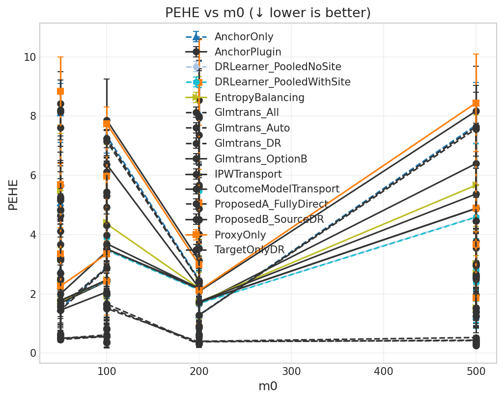
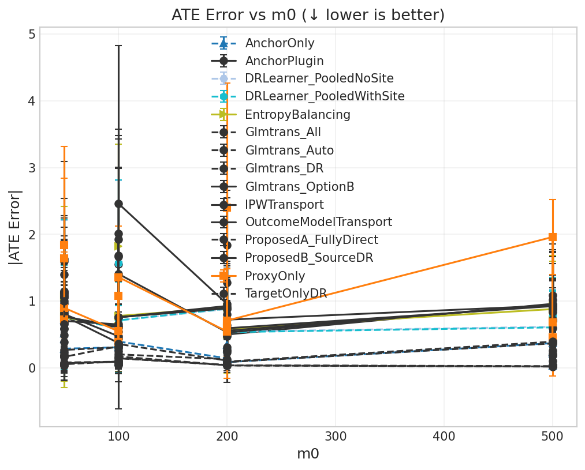
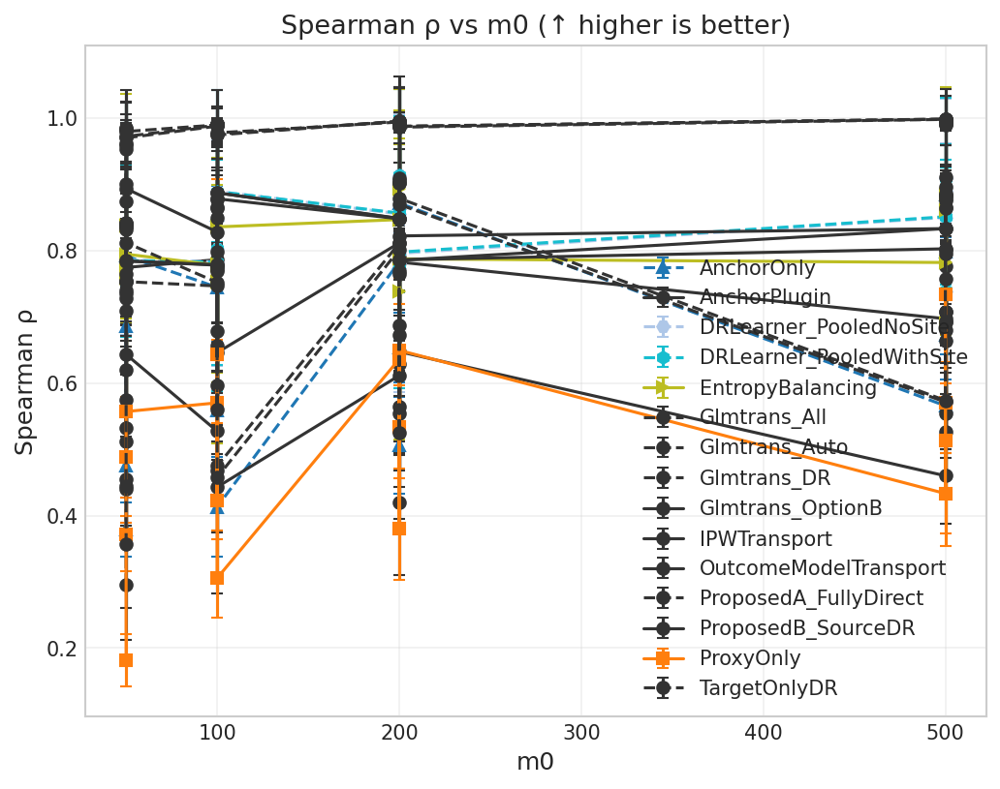

# Fair DGP: Target size × Dimensionality grid (m₀ × p_dim)

**Benchmark ID:** `gold_fair_dim_sweep`

**Generated:** 2026-02-06 04:48

---

## 1. Motivation

**Research Question:** How do target sample size and feature dimensionality jointly affect estimator performance under fair DGP settings?

**Why This Matters:**
This 2D grid explores the interaction between:
1. **Target size (m₀ = m₁):** More target data → less need for transfer
2. **Dimensionality (d):** Higher d → harder estimation, potentially more benefit from source data

**Key Grid:**
- Target: m₀ = m₁ ∈ {50, 100, 200, 500}
- Dimension: d ∈ {10, 20, 50, 100}
- Total: 4 × 4 = 16 scenarios

**Critical Trade-offs:**
- Low d + large m₀: Target-only methods may suffice
- High d + small m₀: Transfer learning becomes essential
- The "break-even" point depends on SNR and overlap

**DGP Settings (Fair):**
- SNR ≈ 3-4 (nontransfer_scale = 0.1)
- Overlap AUC ≈ 0.75 (overlap_lambda = 0.25)
- Controlled intercept drift (scale = 0.5)
- 20,000 source observations across 10 sites

---

## 2. Simulation Setup

**Fair DGP with Variable Dimensionality:**

Uses standard synthetic DGP with fair settings optimized for method comparison:
- **Covariates:** X ~ N(0, I_d) with variable d
- **Treatment:** A ~ Bernoulli(e(X)) with logistic propensity
- **Outcome:** Y = μ_A(X) + ε with heterogeneous effects
- **Transfer:** Controlled nontransfer component (SNR ≈ 3-4)
- **Sites:** 10 source sites with moderate covariate shift

### Swept Parameters (Varied Across Scenarios)

| Parameter | Values | Description |
|-----------|--------|-------------|
| **m0** | `[50, 100, 200, 500]` | Target placebo/control sample size (n₀) |
| **p_dim** | `[10, 20, 50, 100]` | Covariate dimension (d). Higher d = harder estimation. |

### Coupled Parameters (Derived from Swept)

| Parameter | Coupling | Description |
|-----------|----------|-------------|
| **m1** | `= m0` | Target treated sample size (n₁). If 0, only Option B methods are feasible. |

### Fixed Parameters (Held Constant)

| Parameter | Value | Description |
|-----------|-------|-------------|
| n_proxy_total | `20000` | Total source/proxy observations across all sites |
| C_sources | `10` | Number of source sites (K) |
| nontransfer_scale | `0.1` | Scale of non-transferable component (σᵥ). Higher = less transfer benefit. |
| use_fair_dgp | `True` | Parameter: use_fair_dgp |
| overlap_lambda | `0.25` | Covariate distribution divergence (0=identical, 1=disjoint) |
| intercept_drift_scale | `0.5` | Scale of arm-specific intercept drift across sites |

### Experimental Design Summary

- **Sweep type:** `2d`
- **Number of swept parameters:** 2
- **Number of coupled parameters:** 1
- **Number of fixed parameters:** 6
- **Total unique scenarios:** 16

---

## 3. Metrics & Interpretation

| Metric | Direction | Description |
|--------|-----------|-------------|
| **PEHE (Precision in Estimating Heterogeneous Effects)** | ↓ lower is better | Root mean squared error of CATE predictions. Measures how accurately the estimat... |
| **ATE Absolute Error** | ↓ lower is better | Absolute difference between estimated and true average treatment effect.... |
| **ATE Bias (Signed)** | ↑ closer to 0 is better | Signed bias in ATE estimate. Positive = overestimate, negative = underestimate.... |
| **Spearman Rank Correlation** | ↑ higher is better | Rank correlation between predicted and true treatment effects.... |
| **Kendall Rank Correlation** | ↑ higher is better | Kendall tau-b correlation. More robust to ties than Spearman.... |
| **Qini AUC (Oracle)** | ↑ higher is better | Area under the Qini curve. Measures ranking quality for treatment targeting.... |
| **Top-10% Uplift Capture Ratio** | ↑ higher is better | Fraction of maximum uplift captured when treating top 10% by predicted CATE.... |
| **Top-20% Uplift Capture Ratio** | ↑ higher is better | Fraction of maximum uplift captured when treating top 20% by predicted CATE.... |
| **Top-30% Uplift Capture Ratio** | ↑ higher is better | Fraction of maximum uplift captured when treating top 30%.... |
| **Calibration Slope** | ↑ closer to 1 is better | Slope of regression of true τ on predicted τ̂. Ideal = 1.0.... |
| **Calibration R²** | ↑ higher is better | Variance explained by predictions. Measures calibration quality.... |
| **CATE ECE (Expected Calibration Error)** | ↓ lower is better | Expected calibration error for CATE. Binned average miscalibration.... |
| **Policy Value (Treat if τ̂ > 0)** | ↑ higher is better | Expected outcome under threshold-based treatment policy.... |
| **Policy Regret vs Oracle** | ↓ lower is better | Gap between oracle policy value and estimated policy value.... |
| **Policy Value (Treat Top 20%)** | ↑ higher is better | Expected outcome when treating top 20% by predicted CATE.... |
| **Policy Regret (Top 20% Budget)** | ↓ lower is better | Regret compared to oracle top-20% policy.... |
| **μ₀ RMSE (Control Outcome)** | ↓ lower is better | RMSE of predicted control outcomes. Measures nuisance estimation quality.... |

### Detailed Metric Definitions

**PEHE (Precision in Estimating Heterogeneous Effects)**

- Formula: $\sqrt{\frac{1}{n}\sum_i (\hat{\tau}(x_i) - \tau(x_i))^2}$
- Direction: **lower is better**
- A PEHE of 0.5 means predictions are off by 0.5 units on average.

**ATE Absolute Error**

- Formula: $|\hat{\text{ATE}} - \text{ATE}|$
- Direction: **lower is better**
- Important for policy decisions about whether to adopt treatment broadly.

**ATE Bias (Signed)**

- Formula: $\hat{\text{ATE}} - \text{ATE}$
- Direction: **closer to 0 is better**
- Shows systematic over/under-estimation tendencies.

**Spearman Rank Correlation**

- Formula: $\rho(\text{rank}(\hat{\tau}), \text{rank}(\tau))$
- Direction: **higher is better**
- 1.0 = perfect ranking, 0.0 = random. Critical for targeting interventions.

**Kendall Rank Correlation**

- Formula: $\tau_K(\hat{\tau}, \tau)$
- Direction: **higher is better**
- Alternative ranking metric; useful when ties are common.

**Qini AUC (Oracle)**

- Formula: Normalized AUC of cumulative uplift curve
- Direction: **higher is better**
- 1.0 = oracle ranking, 0.0 = random. Simulation-only metric using true τ.

**Top-10% Uplift Capture Ratio**

- Formula: $\frac{\bar{\tau}_{top10\%\ by\ \hat{\tau}}}{\bar{\tau}_{top10\%\ by\ \tau}}$
- Direction: **higher is better**
- 1.0 = oracle selection. Measures targeting efficiency for top patients.

**Top-20% Uplift Capture Ratio**

- Formula: $\frac{\bar{\tau}_{top20\%\ by\ \hat{\tau}}}{\bar{\tau}_{top20\%\ by\ \tau}}$
- Direction: **higher is better**
- 1.0 = oracle selection. Less stringent than top-10%.

**Top-30% Uplift Capture Ratio**

- Formula: $\frac{\bar{\tau}_{top30\%\ by\ \hat{\tau}}}{\bar{\tau}_{top30\%\ by\ \tau}}$
- Direction: **higher is better**
- Less stringent targeting metric.

**Calibration Slope**

- Formula: $\beta$ in $\tau = \alpha + \beta \hat{\tau}$
- Direction: **closer to 1 is better**
- <1 = overconfident predictions, >1 = underconfident.

**Calibration R²**

- Formula: $R^2$ of calibration regression
- Direction: **higher is better**
- Higher R² means predictions track true effects well.

**CATE ECE (Expected Calibration Error)**

- Formula: $\sum_b \frac{n_b}{n} |E[\tau | \hat{\tau} \in b] - E[\hat{\tau} | \hat{\tau} \in b]|$
- Direction: **lower is better**
- Lower ECE means better calibration across prediction ranges.

**Policy Value (Treat if τ̂ > 0)**

- Formula: $E[\mu_0 + \pi(\hat{\tau}) \cdot \tau]$ where $\pi(\hat{\tau}) = 1\{\hat{\tau} > 0\}$
- Direction: **higher is better**
- Higher value = better treatment decisions based on predictions.

**Policy Regret vs Oracle**

- Formula: $V(\pi^*) - V(\hat{\pi})$
- Direction: **lower is better**
- Lower regret = closer to optimal treatment decisions.

**Policy Value (Treat Top 20%)**

- Formula: $E[\mu_0 + \pi_{top20\%}(\hat{\tau}) \cdot \tau]$
- Direction: **higher is better**
- Budget-constrained policy evaluation.

**Policy Regret (Top 20% Budget)**

- Formula: $V(\pi^*_{top20\%}) - V(\hat{\pi}_{top20\%})$
- Direction: **lower is better**
- Budget-constrained regret.

**μ₀ RMSE (Control Outcome)**

- Formula: $\sqrt{\frac{1}{n}\sum_i (\hat{\mu}_0(x_i) - \mu_0(x_i))^2}$
- Direction: **lower is better**
- Important diagnostic; poor μ₀ estimation can propagate to CATE errors.

---

## 4. Methods Compared

### 4.1 Method Summary Table

| Method | Category | Target Placebo | Target Treated | Source | Description |
|--------|----------|----------------|----------------|--------|-------------|
| **TargetOnlyDR** | Baseline | ✓ | ✓ | ✗ | Target-only DR learner (no transfer) |
| **ProxyOnly** | Baseline | ✗ | ✗ | ✓ | Source-only proxy (no target correction) |
| **Glmtrans_Auto** | Transfer Learning | ✓ | ✓ | ✓ | glmtrans with auto source detection |
| **Glmtrans_All** | Transfer Learning | ✓ | ✓ | ✓ | glmtrans using all sources |
| **Glmtrans_DR** | Transfer Learning | ✓ | ✓ | ✓ | glmtrans with DR pseudo-outcomes |
| **Glmtrans_OptionB** | Transfer Learning | ✓ | ✗ | ✓ | Option B: glmtrans source detection + Source-DR CATE |
| **AnchorOnly** | Anchor | ✓ | ✓ | ✓ | Placebo-anchored with DR (needs target treated) |
| **AnchorPlugin** | Anchor | ✓ | ✗ | ✓ | Placebo-anchored plug-in (no DR) |
| **ProposedA_FullyDirect** | Proposed | ✓ | ✓ | ✓ | Proposed: fully joint + direct |
| **ProposedB_SourceDR** | Proposed | ✓ | ✗ | ✓ | Proposed B: source-DR for placebo-only target |
| **IPWTransport** | Transport | ✓ | ✗ | ✓ | IPW-weighted outcome models |
| **EntropyBalancing** | Transport | ✓ | ✗ | ✓ | Entropy balancing weights |
| **OutcomeModelTransport** | Transport | ✓ | ✗ | ✓ | Unweighted outcome models |
| **DRLearner_PooledWithSite** | DR Learner | ✓ | ✓ | ✓ | DR learner on pooled data with site indicator |
| **DRLearner_PooledNoSite** | DR Learner | ✓ | ✓ | ✓ | DR learner on pooled data (no site indicator) |

### 4.2 Method Implementation Details

#### TargetOnlyDR

**Category:** Baseline

**Description:** Target-only DR learner (no transfer)

**Data Requirements:** Target placebo (A=0), Target treated (A=1)

**Pseudo-code:**
```
1. Fit μ̂₀(x) on target controls: (X_target[A=0], Y_target[A=0])
2. Fit μ̂₁(x) on target treated: (X_target[A=1], Y_target[A=1])
3. Compute DR pseudo-outcomes on target:
   Γᵢ = (Aᵢ/ê)(Yᵢ - μ̂₁(Xᵢ)) + μ̂₁(Xᵢ) - ((1-Aᵢ)/(1-ê))(Yᵢ - μ̂₀(Xᵢ)) - μ̂₀(Xᵢ)
4. Fit τ̂(x) on (X_target, Γ) using Lasso
```

**Reference:** Kennedy (2020) - Doubly Robust Learner

---

#### ProxyOnly

**Category:** Baseline

**Description:** Source-only proxy (no target correction)

**Data Requirements:** Source data

**Pseudo-code:**
```
1. Pool all source data by treatment arm
2. Fit μ̂₀^src(x) on source controls
3. Fit μ̂₁^src(x) on source treated
4. Predict: τ̂(x) = μ̂₁^src(x) - μ̂₀^src(x)
```

**Reference:** Naive source pooling baseline

---

#### Glmtrans_Auto

**Category:** Transfer Learning

**Description:** glmtrans with auto source detection

**Data Requirements:** Target placebo (A=0), Target treated (A=1), Source data

**Pseudo-code:**
```
For each outcome model (μ₀ and μ₁):
  1. SOURCE DETECTION: Identify transferable sources
     - Fit target-only model, compute CV loss L_target
     - For each source k: compute loss L_k
     - Source k transferable if L_k ≤ C₀ · L_target
  2. TRANSFER STEP: Pool transferable sources
     - Fit elastic-net on pooled source data → ŵ_A
  3. DEBIAS STEP: Correct on target
     - Compute residuals: r = Y_target - X_target · ŵ_A
     - Fit elastic-net on residuals → δ̂_A
  4. FINAL: β̂ = ŵ_A + δ̂_A

CATE: τ̂(x) = μ̂₁(x) - μ̂₀(x)
```

**Reference:** Tian & Feng (2023) JASA

---

#### Glmtrans_All

**Category:** Transfer Learning

**Description:** glmtrans using all sources

**Data Requirements:** Target placebo (A=0), Target treated (A=1), Source data

**Pseudo-code:**
```
Same as Glmtrans_Auto but skip source detection:
  - Use ALL sources in transfer step
  - No filtering of non-transferable sources
```

**Reference:** Tian & Feng (2023) JASA

---

#### Glmtrans_DR

**Category:** Transfer Learning

**Description:** glmtrans with DR pseudo-outcomes

**Data Requirements:** Target placebo (A=0), Target treated (A=1), Source data

**Pseudo-code:**
```
1. Fit μ̂₀, μ̂₁ using glmtrans (auto detection)
2. Compute DR pseudo-outcomes on target:
   Γᵢ = (Aᵢ/ê)(Yᵢ - μ̂₁) + μ̂₁ - ((1-Aᵢ)/(1-ê))(Yᵢ - μ̂₀) - μ̂₀
3. Fit τ̂(x) on (X_target, Γ) using Lasso
```

**Reference:** glmtrans + DR combination

---

#### Glmtrans_OptionB

**Category:** Transfer Learning

**Description:** Option B: glmtrans source detection + Source-DR CATE

**Data Requirements:** Target placebo (A=0), Source data

**Pseudo-code:**
```
Stage 0 (Source Detection - Control Arm Only):
  - Run glmtrans on control arm: target placebo vs source controls
  - Identify transferable sources: Ŝ₀ = {k : loss_k ≤ C₀ · loss_target}
  - This uses only Y_target(0), NO target treated needed

Step 1 (Restrict to Selected Sources):
  - Form restricted source data: D_src^good = ∪_{k ∈ Ŝ₀} D_k
  - No weighting, just selection (deterministic)

Step 2 (Source-DR CATE):
  - Fit μ̂₀^src, μ̂₁^src on selected sources
  - Estimate ê^src on selected sources
  - Compute DR pseudo-outcomes on SOURCES:
    Γᵢ = μ̂₁(Xᵢ) - μ̂₀(Xᵢ) + (Aᵢ-ê)/(ê(1-ê)) · residual
  - Fit τ̂^src(x) on source pseudo-outcomes

Step 3 (Transport to Target):
  - τ̂_target(x) := τ̂^src(x)  (direct transport)
  - No further correction (no target treated data)

KEY: Theoretically valid for placebo-only target (m₁=0)
```

**Reference:** Advisor construction: glmtrans screening + source-DR transport

---

#### AnchorOnly

**Category:** Anchor

**Description:** Placebo-anchored with DR (needs target treated)

**Data Requirements:** Target placebo (A=0), Target treated (A=1), Source data

**Pseudo-code:**
```
1. Fit source proxy: μ̂₀^src(x) on pooled source controls
2. Compute residuals on target placebo: δ̂₀(x) = Y - μ̂₀^src(X)
3. Fit correction: δ̂₀(x) using Lasso on target placebo residuals
4. Corrected μ̂₀(x) = μ̂₀^src(x) + δ̂₀(x)
5. Fit μ̂₁(x) directly on target treated
6. DR pseudo-outcomes + CATE model
```

**Reference:** Placebo-anchored transfer

---

#### AnchorPlugin

**Category:** Anchor

**Description:** Placebo-anchored plug-in (no DR)

**Data Requirements:** Target placebo (A=0), Source data

**Pseudo-code:**
```
1. Fit source proxy: μ̂₀^src(x), μ̂₁^src(x)
2. Compute residuals on target placebo
3. Fit correction δ̂₀(x) on residuals
4. Plug-in: τ̂(x) = μ̂₁^src(x) - (μ̂₀^src(x) + δ̂₀(x))
   (No DR pseudo-outcomes, no target treated needed)
```

**Reference:** Plug-in variant of anchor

---

#### ProposedA_FullyDirect

**Category:** Proposed

**Description:** Proposed: fully joint + direct

**Data Requirements:** Target placebo (A=0), Target treated (A=1), Source data

**Pseudo-code:**
```
Stage 1: Fit JOINT proxy μ̂^src(X, A) on source
Stage 2 (Direct): Fit JOINT correction directly on target Y
  - Augmented features: [X, A]
  - Warm-started from joint proxy
Stage 3: DR on target

Key: Both proxy and correction use shared (X, A) representation
```

**Reference:** Fully joint + direct variant

---

#### ProposedB_SourceDR

**Category:** Proposed

**Description:** Proposed B: source-DR for placebo-only target

**Data Requirements:** Target placebo (A=0), Source data

**Pseudo-code:**
```
Stage 1 (Proxy): Fit μ̂₀^src, μ̂₁^src on source
Stage 2 (Correction): Fit δ̂₀(x) on target placebo residuals
Step B (Transfer): Learn M from source to transfer δ̂₁ = M·δ̂₀
Stage 3 (Source-DR): 
  - Compute DR pseudo-outcomes on SOURCE data
  - Transfer CATE model to target via learned weights
```

**Reference:** For disconnected target (m₁=0)

---

#### IPWTransport

**Category:** Transport

**Description:** IPW-weighted outcome models

**Data Requirements:** Target placebo (A=0), Source data

**Pseudo-code:**
```
1. Estimate site membership: P(S=target|X)
2. Compute IPW weights: w(x) = P(S=target|X) / P(S=source|X)
3. Fit weighted outcome models on source:
   μ̂ₐ = argmin Σᵢ wᵢ·(Yᵢ - μ(Xᵢ))²
4. Predict: τ̂(x) = μ̂₁(x) - μ̂₀(x)
```

**Reference:** Hong et al. - IPW transport

---

#### EntropyBalancing

**Category:** Transport

**Description:** Entropy balancing weights

**Data Requirements:** Target placebo (A=0), Source data

**Pseudo-code:**
```
1. Find weights w that balance source to target:
   Σᵢ wᵢ·Xᵢ = X̄_target (moment matching)
   max Σᵢ wᵢ·log(wᵢ) (max entropy)
2. Fit weighted outcome models
3. Predict: τ̂(x) = μ̂₁(x) - μ̂₀(x)
```

**Reference:** Hainmueller (2012)

---

#### OutcomeModelTransport

**Category:** Transport

**Description:** Unweighted outcome models

**Data Requirements:** Target placebo (A=0), Source data

**Pseudo-code:**
```
1. Fit outcome models on source (unweighted):
   μ̂ₐ^src on (X_source[A=a], Y_source[A=a])
2. Predict on target: τ̂(x) = μ̂₁^src(x) - μ̂₀^src(x)
   (Assumes outcome model generalizes across sites)
```

**Reference:** Baseline - no reweighting

---

#### DRLearner_PooledWithSite

**Category:** DR Learner

**Description:** DR learner on pooled data with site indicator

**Data Requirements:** Target placebo (A=0), Target treated (A=1), Source data

**Pseudo-code:**
```
1. Pool source + target data
2. Fit nuisance models including site as covariate:
   - μ̂₀(X, S), μ̂₁(X, S), ê(X, S)
3. Compute DR pseudo-outcomes on pooled data
4. Fit τ̂(X, S) including site indicator
5. Predict: τ̂_target(x) = τ̂(x, S=target)
```

**Reference:** DR Learner with site adjustment

---

#### DRLearner_PooledNoSite

**Category:** DR Learner

**Description:** DR learner on pooled data (no site indicator)

**Data Requirements:** Target placebo (A=0), Target treated (A=1), Source data

**Pseudo-code:**
```
1. Pool source + target data (ignore site)
2. Fit nuisance models on pooled X:
   - μ̂₀(X), μ̂₁(X), ê(X)
3. Compute DR pseudo-outcomes on pooled data
4. Fit τ̂(X) on pooled pseudo-outcomes
5. Predict: τ̂(x) for any x
   (Assumes no site-specific effects)
```

**Reference:** Simple pooled DR Learner

---

---

## 5. Experiment Summary

- **Sweep parameter:** `m0` ∈ [50, 100, 200, 500]
- **Monte Carlo replicates:** 5 per scenario
- **Methods evaluated:** 15
- **Total runs:** 1200

---

## 6. Results

### Best Methods (averaged across sweep)

| Metric | Best Method | Value | Direction |
|--------|-------------|-------|----------|
| PEHE | **Glmtrans_All** | 0.2616 | ↓ lower |
| ATE Error | **Glmtrans_All** | 0.0189 | ↓ lower |
| Spearman ρ | **Glmtrans_All** | 0.9987 | ↑ higher |
| Kendall τ | **Glmtrans_All** | 0.9706 | ↑ higher |
| Qini AUC | **Glmtrans_All** | 0.9989 | ↑ higher |
| Top-10% Ratio | **Glmtrans_All** | 0.9993 | ↑ higher |
| Top-20% Ratio | **Glmtrans_DR** | 0.9987 | ↑ higher |
| Calibration R² | **Glmtrans_All** | 0.9978 | ↑ higher |
| CATE ECE | **Glmtrans_DR** | 0.0555 | ↓ lower |
| Policy Value | **Glmtrans_All** | 4.8144 | ↑ higher |
| Policy Regret | **Glmtrans_All** | 0.0024 | ↓ lower |

### Core Metrics

| m0 | m1 | Method | PEHE (↓) | ATE Err (↓) | Spearman (↑) | Qini (↑) |
|---|---|---|---|---|---|
| 50 | 50 | AnchorOnly | 8.111 ± 0.993 | 0.716 ± 0.582 | 0.379 ± 0.041 | 0.394 ± 0.039 |
| 50 | 50 | AnchorOnly | 5.071 ± 0.584 | 0.518 ± 0.356 | 0.476 ± 0.086 | 0.492 ± 0.089 |
| 50 | 50 | AnchorOnly | 2.797 ± 0.658 | 0.430 ± 0.239 | 0.686 ± 0.044 | 0.705 ± 0.043 |
| 50 | 50 | AnchorOnly | 1.500 ± 0.533 | 0.288 ± 0.212 | 0.792 ± 0.022 | 0.801 ± 0.023 |
| 50 | 50 | AnchorPlugin | 7.611 ± 1.294 | 1.401 ± 0.707 | 0.532 ± 0.089 | 0.549 ± 0.089 |
| 50 | 50 | AnchorPlugin | 4.640 ± 0.729 | 0.692 ± 0.769 | 0.620 ± 0.110 | 0.636 ± 0.106 |
| 50 | 50 | AnchorPlugin | 2.508 ± 0.848 | 0.586 ± 0.363 | 0.740 ± 0.094 | 0.757 ± 0.092 |
| 50 | 50 | AnchorPlugin | 1.692 ± 0.794 | 0.776 ± 0.460 | 0.775 ± 0.111 | 0.785 ± 0.106 |
| 50 | 50 | DRLearner_PooledNoSite | 4.794 ± 1.584 | 1.117 ± 1.090 | 0.838 ± 0.090 | 0.849 ± 0.085 |
| 50 | 50 | DRLearner_PooledNoSite | 3.141 ± 1.588 | 1.100 ± 0.789 | 0.842 ± 0.150 | 0.851 ± 0.144 |
| 50 | 50 | DRLearner_PooledNoSite | 2.485 ± 1.985 | 0.848 ± 1.034 | 0.755 ± 0.268 | 0.768 ± 0.264 |
| 50 | 50 | DRLearner_PooledNoSite | 1.764 ± 0.233 | 0.762 ± 0.770 | 0.786 ± 0.113 | 0.798 ± 0.107 |
| 50 | 50 | DRLearner_PooledWithSite | 4.804 ± 1.590 | 1.129 ± 1.093 | 0.837 ± 0.091 | 0.848 ± 0.086 |
| 50 | 50 | DRLearner_PooledWithSite | 3.145 ± 1.595 | 1.095 ± 0.787 | 0.841 ± 0.151 | 0.850 ± 0.146 |
| 50 | 50 | DRLearner_PooledWithSite | 2.482 ± 1.979 | 0.848 ± 1.032 | 0.756 ± 0.267 | 0.769 ± 0.263 |
| 50 | 50 | DRLearner_PooledWithSite | 1.765 ± 0.230 | 0.759 ± 0.774 | 0.785 ± 0.115 | 0.797 ± 0.109 |
| 50 | 50 | EntropyBalancing | 5.484 ± 1.926 | 1.062 ± 1.355 | 0.779 ± 0.124 | 0.792 ± 0.120 |
| 50 | 50 | EntropyBalancing | 3.186 ± 1.525 | 1.083 ± 0.837 | 0.839 ± 0.141 | 0.848 ± 0.136 |
| 50 | 50 | EntropyBalancing | 2.453 ± 2.028 | 0.844 ± 1.041 | 0.760 ± 0.277 | 0.772 ± 0.273 |
| 50 | 50 | EntropyBalancing | 1.748 ± 0.267 | 0.757 ± 0.789 | 0.795 ± 0.104 | 0.806 ± 0.098 |
| 50 | 50 | Glmtrans_All | 4.107 ± 1.130 | 0.491 ± 0.562 | 0.875 ± 0.047 | 0.884 ± 0.045 |
| 50 | 50 | Glmtrans_All | 1.562 ± 0.587 | 0.179 ± 0.147 | 0.959 ± 0.026 | 0.962 ± 0.024 |
| 50 | 50 | Glmtrans_All | 0.574 ± 0.118 | 0.046 ± 0.030 | 0.985 ± 0.007 | 0.987 ± 0.007 |
| 50 | 50 | Glmtrans_All | 0.460 ± 0.056 | 0.069 ± 0.074 | 0.980 ± 0.008 | 0.982 ± 0.007 |
| 50 | 50 | Glmtrans_Auto | 3.664 ± 1.301 | 0.390 ± 0.423 | 0.900 ± 0.052 | 0.908 ± 0.049 |
| 50 | 50 | Glmtrans_Auto | 1.439 ± 0.702 | 0.175 ± 0.128 | 0.962 ± 0.035 | 0.966 ± 0.032 |
| 50 | 50 | Glmtrans_Auto | 0.614 ± 0.158 | 0.037 ± 0.032 | 0.984 ± 0.008 | 0.985 ± 0.008 |
| 50 | 50 | Glmtrans_Auto | 0.497 ± 0.123 | 0.055 ± 0.051 | 0.970 ± 0.036 | 0.972 ± 0.033 |
| 50 | 50 | Glmtrans_DR | 5.662 ± 1.316 | 0.583 ± 0.385 | 0.736 ± 0.123 | 0.751 ± 0.116 |
| 50 | 50 | Glmtrans_DR | 1.658 ± 0.423 | 0.174 ± 0.151 | 0.954 ± 0.019 | 0.958 ± 0.018 |
| 50 | 50 | Glmtrans_DR | 0.650 ± 0.194 | 0.051 ± 0.030 | 0.983 ± 0.009 | 0.984 ± 0.009 |
| 50 | 50 | Glmtrans_DR | 0.498 ± 0.059 | 0.081 ± 0.061 | 0.973 ± 0.017 | 0.974 ± 0.016 |
| 50 | 50 | Glmtrans_OptionB | 4.829 ± 1.598 | 1.142 ± 1.138 | 0.836 ± 0.091 | 0.847 ± 0.087 |
| 50 | 50 | Glmtrans_OptionB | 3.166 ± 1.591 | 1.124 ± 0.801 | 0.840 ± 0.152 | 0.849 ± 0.146 |
| 50 | 50 | Glmtrans_OptionB | 2.468 ± 2.000 | 1.052 ± 0.928 | 0.765 ± 0.278 | 0.777 ± 0.273 |
| 50 | 50 | Glmtrans_OptionB | 1.450 ± 0.439 | 0.806 ± 0.482 | 0.894 ± 0.074 | 0.900 ± 0.071 |
| 50 | 50 | IPWTransport | 4.849 ± 1.651 | 1.059 ± 1.188 | 0.833 ± 0.094 | 0.844 ± 0.089 |
| 50 | 50 | IPWTransport | 3.129 ± 1.606 | 1.083 ± 0.827 | 0.843 ± 0.149 | 0.852 ± 0.143 |
| 50 | 50 | IPWTransport | 2.478 ± 1.981 | 0.820 ± 1.008 | 0.754 ± 0.271 | 0.767 ± 0.267 |
| 50 | 50 | IPWTransport | 1.774 ± 0.239 | 0.769 ± 0.776 | 0.785 ± 0.113 | 0.797 ± 0.106 |
| 50 | 50 | OutcomeModelTransport | 4.828 ± 1.594 | 1.147 ± 1.133 | 0.836 ± 0.091 | 0.847 ± 0.086 |
| 50 | 50 | OutcomeModelTransport | 3.166 ± 1.596 | 1.126 ± 0.803 | 0.841 ± 0.152 | 0.850 ± 0.146 |
| 50 | 50 | OutcomeModelTransport | 2.499 ± 1.994 | 0.859 ± 1.043 | 0.754 ± 0.269 | 0.767 ± 0.265 |
| 50 | 50 | OutcomeModelTransport | 1.776 ± 0.234 | 0.772 ± 0.776 | 0.784 ± 0.113 | 0.796 ± 0.107 |
| 50 | 50 | ProposedA_FullyDirect | 8.412 ± 1.086 | 1.099 ± 0.567 | 0.296 ± 0.083 | 0.305 ± 0.082 |
| 50 | 50 | ProposedA_FullyDirect | 5.210 ± 0.676 | 0.666 ± 0.573 | 0.455 ± 0.027 | 0.474 ± 0.025 |
| 50 | 50 | ProposedA_FullyDirect | 2.693 ± 0.573 | 0.197 ± 0.110 | 0.728 ± 0.039 | 0.745 ± 0.035 |
| 50 | 50 | ProposedA_FullyDirect | 1.452 ± 0.500 | 0.165 ± 0.150 | 0.812 ± 0.015 | 0.819 ± 0.013 |
| 50 | 50 | ProposedB_SourceDR | 8.143 ± 1.360 | 1.599 ± 1.490 | 0.440 ± 0.054 | 0.455 ± 0.058 |
| 50 | 50 | ProposedB_SourceDR | 5.280 ± 0.832 | 1.634 ± 0.905 | 0.512 ± 0.133 | 0.525 ± 0.132 |
| 50 | 50 | ProposedB_SourceDR | 3.242 ± 1.123 | 0.967 ± 0.920 | 0.575 ± 0.126 | 0.597 ± 0.130 |
| 50 | 50 | ProposedB_SourceDR | 2.000 ± 0.497 | 0.703 ± 0.596 | 0.643 ± 0.112 | 0.657 ± 0.110 |
| 50 | 50 | ProxyOnly | 8.838 ± 1.149 | 1.842 ± 1.474 | 0.182 ± 0.039 | 0.187 ± 0.045 |
| 50 | 50 | ProxyOnly | 5.684 ± 0.707 | 1.645 ± 1.196 | 0.372 ± 0.055 | 0.386 ± 0.061 |
| 50 | 50 | ProxyOnly | 3.343 ± 0.884 | 0.725 ± 0.645 | 0.489 ± 0.090 | 0.507 ± 0.092 |
| 50 | 50 | ProxyOnly | 2.265 ± 0.873 | 0.899 ± 0.835 | 0.557 ± 0.168 | 0.568 ± 0.165 |
| 50 | 50 | TargetOnlyDR | 8.205 ± 1.006 | 1.001 ± 0.502 | 0.357 ± 0.096 | 0.367 ± 0.095 |
| 50 | 50 | TargetOnlyDR | 5.149 ± 0.563 | 0.654 ± 0.413 | 0.444 ± 0.076 | 0.463 ± 0.077 |
| 50 | 50 | TargetOnlyDR | 2.699 ± 0.476 | 0.237 ± 0.288 | 0.709 ± 0.054 | 0.727 ± 0.049 |
| 50 | 50 | TargetOnlyDR | 1.583 ± 0.414 | 0.269 ± 0.107 | 0.753 ± 0.065 | 0.764 ± 0.064 |
| 100 | 100 | AnchorOnly | 2.891 ± 0.208 | 0.308 ± 0.276 | 0.745 ± 0.081 | 0.759 ± 0.078 |
| 100 | 100 | AnchorOnly | 5.493 ± 1.170 | 0.361 ± 0.235 | 0.558 ± 0.089 | 0.576 ± 0.087 |
| 100 | 100 | AnchorOnly | 1.722 ± 0.634 | 0.097 ± 0.049 | 0.855 ± 0.044 | 0.863 ± 0.040 |
| 100 | 100 | AnchorOnly | 7.325 ± 0.584 | 0.395 ± 0.268 | 0.413 ± 0.075 | 0.431 ± 0.077 |
| 100 | 100 | AnchorPlugin | 2.421 ± 0.583 | 0.374 ± 0.210 | 0.787 ± 0.096 | 0.799 ± 0.094 |
| 100 | 100 | AnchorPlugin | 4.929 ± 1.672 | 1.556 ± 0.877 | 0.678 ± 0.194 | 0.692 ± 0.192 |
| 100 | 100 | AnchorPlugin | 1.955 ± 1.108 | 0.440 ± 0.400 | 0.776 ± 0.201 | 0.787 ± 0.194 |
| 100 | 100 | AnchorPlugin | 6.367 ± 1.138 | 1.408 ± 2.021 | 0.646 ± 0.028 | 0.664 ± 0.030 |
| 100 | 100 | DRLearner_PooledNoSite | 2.436 ± 0.811 | 0.590 ± 0.339 | 0.783 ± 0.157 | 0.795 ± 0.154 |
| 100 | 100 | DRLearner_PooledNoSite | 3.891 ± 2.448 | 1.570 ± 1.235 | 0.803 ± 0.240 | 0.814 ± 0.233 |
| 100 | 100 | DRLearner_PooledNoSite | 1.970 ± 1.010 | 0.329 ± 0.406 | 0.775 ± 0.185 | 0.787 ± 0.177 |
| 100 | 100 | DRLearner_PooledNoSite | 3.463 ± 1.417 | 0.712 ± 0.577 | 0.890 ± 0.076 | 0.898 ± 0.073 |
| 100 | 100 | DRLearner_PooledWithSite | 2.442 ± 0.802 | 0.592 ± 0.342 | 0.783 ± 0.155 | 0.795 ± 0.152 |
| 100 | 100 | DRLearner_PooledWithSite | 3.896 ± 2.450 | 1.573 ± 1.245 | 0.803 ± 0.240 | 0.813 ± 0.233 |
| 100 | 100 | DRLearner_PooledWithSite | 1.967 ± 1.013 | 0.327 ± 0.409 | 0.775 ± 0.187 | 0.787 ± 0.178 |
| 100 | 100 | DRLearner_PooledWithSite | 3.476 ± 1.397 | 0.711 ± 0.579 | 0.889 ± 0.076 | 0.898 ± 0.072 |
| 100 | 100 | EntropyBalancing | 2.470 ± 0.823 | 0.623 ± 0.329 | 0.778 ± 0.163 | 0.790 ± 0.160 |
| 100 | 100 | EntropyBalancing | 4.415 ± 2.625 | 1.824 ± 1.529 | 0.753 ± 0.244 | 0.766 ± 0.238 |
| 100 | 100 | EntropyBalancing | 1.975 ± 0.997 | 0.357 ± 0.407 | 0.780 ± 0.179 | 0.792 ± 0.170 |
| 100 | 100 | EntropyBalancing | 4.357 ± 0.966 | 0.778 ± 0.640 | 0.836 ± 0.064 | 0.848 ± 0.061 |
| 100 | 100 | Glmtrans_All | 0.555 ± 0.113 | 0.093 ± 0.047 | 0.990 ± 0.005 | 0.991 ± 0.004 |
| 100 | 100 | Glmtrans_All | 0.833 ± 0.252 | 0.075 ± 0.080 | 0.990 ± 0.005 | 0.991 ± 0.005 |
| 100 | 100 | Glmtrans_All | 0.360 ± 0.187 | 0.044 ± 0.060 | 0.992 ± 0.008 | 0.992 ± 0.007 |
| 100 | 100 | Glmtrans_All | 1.569 ± 0.684 | 0.170 ± 0.110 | 0.976 ± 0.019 | 0.979 ± 0.017 |
| 100 | 100 | Glmtrans_Auto | 0.612 ± 0.175 | 0.095 ± 0.042 | 0.988 ± 0.006 | 0.989 ± 0.005 |
| 100 | 100 | Glmtrans_Auto | 0.808 ± 0.149 | 0.078 ± 0.079 | 0.991 ± 0.004 | 0.992 ± 0.004 |
| 100 | 100 | Glmtrans_Auto | 0.381 ± 0.181 | 0.049 ± 0.056 | 0.992 ± 0.007 | 0.992 ± 0.006 |
| 100 | 100 | Glmtrans_Auto | 1.504 ± 0.650 | 0.147 ± 0.082 | 0.978 ± 0.016 | 0.981 ± 0.014 |
| 100 | 100 | Glmtrans_DR | 0.566 ± 0.109 | 0.093 ± 0.048 | 0.990 ± 0.005 | 0.991 ± 0.004 |
| 100 | 100 | Glmtrans_DR | 0.822 ± 0.174 | 0.068 ± 0.077 | 0.990 ± 0.005 | 0.991 ± 0.005 |
| 100 | 100 | Glmtrans_DR | 0.358 ± 0.178 | 0.050 ± 0.049 | 0.992 ± 0.007 | 0.992 ± 0.007 |
| 100 | 100 | Glmtrans_DR | 1.654 ± 0.476 | 0.143 ± 0.135 | 0.975 ± 0.013 | 0.978 ± 0.011 |
| 100 | 100 | Glmtrans_OptionB | 2.061 ± 1.053 | 0.474 ± 0.313 | 0.828 ± 0.187 | 0.838 ± 0.182 |
| 100 | 100 | Glmtrans_OptionB | 3.644 ± 1.580 | 1.680 ± 1.328 | 0.864 ± 0.062 | 0.874 ± 0.058 |
| 100 | 100 | Glmtrans_OptionB | 1.515 ± 0.725 | 0.247 ± 0.227 | 0.850 ± 0.169 | 0.858 ± 0.161 |
| 100 | 100 | Glmtrans_OptionB | 3.515 ± 1.420 | 0.760 ± 0.633 | 0.887 ± 0.078 | 0.896 ± 0.074 |
| 100 | 100 | IPWTransport | 2.468 ± 0.815 | 0.617 ± 0.345 | 0.778 ± 0.161 | 0.790 ± 0.158 |
| 100 | 100 | IPWTransport | 4.304 ± 2.620 | 1.926 ± 1.653 | 0.777 ± 0.241 | 0.789 ± 0.234 |
| 100 | 100 | IPWTransport | 1.989 ± 1.024 | 0.361 ± 0.422 | 0.772 ± 0.187 | 0.784 ± 0.178 |
| 100 | 100 | IPWTransport | 3.690 ± 1.274 | 0.758 ± 0.616 | 0.878 ± 0.072 | 0.888 ± 0.069 |
| 100 | 100 | OutcomeModelTransport | 2.462 ± 0.816 | 0.604 ± 0.345 | 0.779 ± 0.160 | 0.791 ± 0.157 |
| 100 | 100 | OutcomeModelTransport | 3.984 ± 2.486 | 1.664 ± 1.324 | 0.798 ± 0.244 | 0.809 ± 0.238 |
| 100 | 100 | OutcomeModelTransport | 1.994 ± 1.029 | 0.338 ± 0.424 | 0.769 ± 0.189 | 0.781 ± 0.181 |
| 100 | 100 | OutcomeModelTransport | 3.512 ± 1.418 | 0.757 ± 0.620 | 0.887 ± 0.078 | 0.896 ± 0.074 |
| 100 | 100 | ProposedA_FullyDirect | 2.853 ± 0.141 | 0.324 ± 0.211 | 0.752 ± 0.060 | 0.766 ± 0.060 |
| 100 | 100 | ProposedA_FullyDirect | 5.314 ± 1.048 | 0.290 ± 0.247 | 0.597 ± 0.065 | 0.612 ± 0.066 |
| 100 | 100 | ProposedA_FullyDirect | 1.645 ± 0.548 | 0.102 ± 0.060 | 0.877 ± 0.036 | 0.884 ± 0.033 |
| 100 | 100 | ProposedA_FullyDirect | 7.144 ± 0.566 | 0.357 ± 0.092 | 0.475 ± 0.057 | 0.496 ± 0.056 |
| 100 | 100 | ProposedB_SourceDR | 3.433 ± 0.528 | 0.652 ± 0.425 | 0.528 ± 0.150 | 0.542 ± 0.155 |
| 100 | 100 | ProposedB_SourceDR | 6.115 ± 1.421 | 2.014 ± 1.469 | 0.467 ± 0.184 | 0.482 ± 0.185 |
| 100 | 100 | ProposedB_SourceDR | 2.472 ± 1.249 | 0.546 ± 0.751 | 0.656 ± 0.224 | 0.669 ± 0.218 |
| 100 | 100 | ProposedB_SourceDR | 7.861 ± 1.387 | 2.462 ± 2.368 | 0.443 ± 0.069 | 0.462 ± 0.070 |
| 100 | 100 | ProxyOnly | 3.349 ± 0.439 | 0.549 ± 0.495 | 0.570 ± 0.095 | 0.589 ± 0.091 |
| 100 | 100 | ProxyOnly | 5.967 ± 1.139 | 1.078 ± 1.042 | 0.423 ± 0.117 | 0.437 ± 0.114 |
| 100 | 100 | ProxyOnly | 2.431 ± 1.145 | 0.391 ± 0.171 | 0.643 ± 0.265 | 0.654 ± 0.263 |
| 100 | 100 | ProxyOnly | 7.737 ± 0.562 | 1.360 ± 0.643 | 0.306 ± 0.059 | 0.319 ± 0.057 |
| 100 | 100 | TargetOnlyDR | 2.882 ± 0.201 | 0.309 ± 0.308 | 0.747 ± 0.096 | 0.760 ± 0.091 |
| 100 | 100 | TargetOnlyDR | 5.446 ± 1.167 | 0.358 ± 0.160 | 0.560 ± 0.083 | 0.576 ± 0.087 |
| 100 | 100 | TargetOnlyDR | 1.639 ± 0.509 | 0.105 ± 0.067 | 0.866 ± 0.055 | 0.873 ± 0.050 |
| 100 | 100 | TargetOnlyDR | 7.242 ± 0.575 | 0.202 ± 0.191 | 0.458 ± 0.036 | 0.476 ± 0.034 |
| 200 | 200 | AnchorOnly | 2.480 ± 0.596 | 0.144 ± 0.103 | 0.783 ± 0.045 | 0.797 ± 0.040 |
| 200 | 200 | AnchorOnly | 4.547 ± 0.982 | 0.348 ± 0.107 | 0.654 ± 0.053 | 0.669 ± 0.048 |
| 200 | 200 | AnchorOnly | 8.100 ± 1.743 | 0.293 ± 0.190 | 0.506 ± 0.073 | 0.523 ± 0.073 |
| 200 | 200 | AnchorOnly | 1.284 ± 0.563 | 0.086 ± 0.044 | 0.872 ± 0.013 | 0.880 ± 0.010 |
| 200 | 200 | AnchorPlugin | 2.199 ± 0.922 | 0.534 ± 0.443 | 0.812 ± 0.121 | 0.823 ± 0.116 |
| 200 | 200 | AnchorPlugin | 3.540 ± 1.014 | 0.566 ± 0.273 | 0.789 ± 0.049 | 0.803 ± 0.046 |
| 200 | 200 | AnchorPlugin | 7.362 ± 2.520 | 1.835 ± 0.827 | 0.628 ± 0.185 | 0.642 ± 0.184 |
| 200 | 200 | AnchorPlugin | 1.665 ± 1.112 | 0.500 ± 0.448 | 0.783 ± 0.171 | 0.794 ± 0.167 |
| 200 | 200 | DRLearner_PooledNoSite | 2.133 ± 1.068 | 0.881 ± 0.607 | 0.856 ± 0.189 | 0.864 ± 0.181 |
| 200 | 200 | DRLearner_PooledNoSite | 2.204 ± 1.431 | 0.497 ± 0.325 | 0.914 ± 0.074 | 0.921 ± 0.068 |
| 200 | 200 | DRLearner_PooledNoSite | 5.468 ± 3.481 | 0.794 ± 0.586 | 0.780 ± 0.218 | 0.791 ± 0.213 |
| 200 | 200 | DRLearner_PooledNoSite | 1.682 ± 1.130 | 0.542 ± 0.313 | 0.796 ± 0.210 | 0.806 ± 0.206 |
| 200 | 200 | DRLearner_PooledWithSite | 2.131 ± 1.064 | 0.887 ± 0.607 | 0.857 ± 0.187 | 0.865 ± 0.179 |
| 200 | 200 | DRLearner_PooledWithSite | 2.199 ± 1.427 | 0.498 ± 0.324 | 0.914 ± 0.073 | 0.921 ± 0.068 |
| 200 | 200 | DRLearner_PooledWithSite | 5.476 ± 3.488 | 0.794 ± 0.585 | 0.780 ± 0.219 | 0.790 ± 0.213 |
| 200 | 200 | DRLearner_PooledWithSite | 1.675 ± 1.126 | 0.536 ± 0.306 | 0.798 ± 0.205 | 0.808 ± 0.202 |
| 200 | 200 | EntropyBalancing | 2.188 ± 1.089 | 0.905 ± 0.624 | 0.847 ± 0.197 | 0.856 ± 0.190 |
| 200 | 200 | EntropyBalancing | 2.489 ± 1.360 | 0.499 ± 0.365 | 0.894 ± 0.076 | 0.902 ± 0.072 |
| 200 | 200 | EntropyBalancing | 6.031 ± 3.304 | 0.611 ± 0.693 | 0.738 ± 0.223 | 0.750 ± 0.220 |
| 200 | 200 | EntropyBalancing | 1.723 ± 1.132 | 0.586 ± 0.317 | 0.788 ± 0.224 | 0.798 ± 0.221 |
| 200 | 200 | Glmtrans_All | 0.305 ± 0.112 | 0.041 ± 0.039 | 0.996 ± 0.003 | 0.996 ± 0.003 |
| 200 | 200 | Glmtrans_All | 0.528 ± 0.151 | 0.039 ± 0.031 | 0.995 ± 0.002 | 0.996 ± 0.002 |
| 200 | 200 | Glmtrans_All | 0.855 ± 0.202 | 0.070 ± 0.042 | 0.995 ± 0.001 | 0.996 ± 0.001 |
| 200 | 200 | Glmtrans_All | 0.382 ± 0.181 | 0.038 ± 0.023 | 0.988 ± 0.004 | 0.989 ± 0.003 |
| 200 | 200 | Glmtrans_Auto | 0.373 ± 0.099 | 0.042 ± 0.031 | 0.994 ± 0.003 | 0.995 ± 0.003 |
| 200 | 200 | Glmtrans_Auto | 0.638 ± 0.195 | 0.049 ± 0.051 | 0.994 ± 0.003 | 0.994 ± 0.002 |
| 200 | 200 | Glmtrans_Auto | 0.906 ± 0.169 | 0.061 ± 0.031 | 0.995 ± 0.002 | 0.995 ± 0.002 |
| 200 | 200 | Glmtrans_Auto | 0.398 ± 0.182 | 0.038 ± 0.018 | 0.987 ± 0.005 | 0.988 ± 0.004 |
| 200 | 200 | Glmtrans_DR | 0.319 ± 0.090 | 0.040 ± 0.035 | 0.995 ± 0.003 | 0.996 ± 0.003 |
| 200 | 200 | Glmtrans_DR | 0.598 ± 0.186 | 0.043 ± 0.048 | 0.994 ± 0.003 | 0.994 ± 0.003 |
| 200 | 200 | Glmtrans_DR | 0.914 ± 0.100 | 0.059 ± 0.036 | 0.994 ± 0.002 | 0.995 ± 0.002 |
| 200 | 200 | Glmtrans_DR | 0.387 ± 0.182 | 0.035 ± 0.023 | 0.988 ± 0.003 | 0.989 ± 0.003 |
| 200 | 200 | Glmtrans_OptionB | 2.165 ± 1.100 | 0.891 ± 0.603 | 0.848 ± 0.199 | 0.857 ± 0.191 |
| 200 | 200 | Glmtrans_OptionB | 2.387 ± 1.421 | 0.471 ± 0.300 | 0.906 ± 0.077 | 0.913 ± 0.071 |
| 200 | 200 | Glmtrans_OptionB | 4.014 ± 1.910 | 0.643 ± 0.352 | 0.903 ± 0.060 | 0.911 ± 0.055 |
| 200 | 200 | Glmtrans_OptionB | 1.709 ± 1.174 | 0.722 ± 0.762 | 0.822 ± 0.241 | 0.830 ± 0.236 |
| 200 | 200 | IPWTransport | 2.184 ± 1.080 | 0.900 ± 0.628 | 0.848 ± 0.197 | 0.857 ± 0.189 |
| 200 | 200 | IPWTransport | 2.363 ± 1.409 | 0.483 ± 0.340 | 0.902 ± 0.077 | 0.910 ± 0.072 |
| 200 | 200 | IPWTransport | 5.669 ± 3.493 | 0.569 ± 0.783 | 0.765 ± 0.229 | 0.775 ± 0.225 |
| 200 | 200 | IPWTransport | 1.730 ± 1.129 | 0.593 ± 0.306 | 0.786 ± 0.222 | 0.797 ± 0.219 |
| 200 | 200 | OutcomeModelTransport | 2.196 ± 1.080 | 0.927 ± 0.640 | 0.849 ± 0.199 | 0.857 ± 0.191 |
| 200 | 200 | OutcomeModelTransport | 2.254 ± 1.467 | 0.538 ± 0.351 | 0.910 ± 0.077 | 0.917 ± 0.072 |
| 200 | 200 | OutcomeModelTransport | 5.612 ± 3.546 | 0.879 ± 0.657 | 0.769 ± 0.230 | 0.780 ± 0.225 |
| 200 | 200 | OutcomeModelTransport | 1.716 ± 1.148 | 0.557 ± 0.325 | 0.786 ± 0.223 | 0.796 ± 0.220 |
| 200 | 200 | ProposedA_FullyDirect | 2.441 ± 0.521 | 0.109 ± 0.038 | 0.811 ± 0.032 | 0.823 ± 0.029 |
| 200 | 200 | ProposedA_FullyDirect | 4.488 ± 0.963 | 0.264 ± 0.258 | 0.688 ± 0.024 | 0.704 ± 0.018 |
| 200 | 200 | ProposedA_FullyDirect | 7.937 ± 1.598 | 0.259 ± 0.329 | 0.565 ± 0.053 | 0.581 ± 0.052 |
| 200 | 200 | ProposedA_FullyDirect | 1.278 ± 0.549 | 0.086 ± 0.067 | 0.870 ± 0.006 | 0.878 ± 0.007 |
| 200 | 200 | ProposedB_SourceDR | 3.118 ± 0.858 | 0.959 ± 0.634 | 0.611 ± 0.144 | 0.628 ± 0.143 |
| 200 | 200 | ProposedB_SourceDR | 4.869 ± 1.118 | 0.802 ± 0.525 | 0.555 ± 0.061 | 0.573 ± 0.061 |
| 200 | 200 | ProposedB_SourceDR | 8.529 ± 2.078 | 1.279 ± 1.272 | 0.420 ± 0.109 | 0.434 ± 0.109 |
| 200 | 200 | ProposedB_SourceDR | 2.079 ± 1.196 | 0.530 ± 0.419 | 0.648 ± 0.252 | 0.660 ± 0.254 |
| 200 | 200 | ProxyOnly | 2.979 ± 0.705 | 0.546 ± 0.380 | 0.636 ± 0.083 | 0.652 ± 0.079 |
| 200 | 200 | ProxyOnly | 5.073 ± 1.130 | 0.665 ± 0.820 | 0.534 ± 0.063 | 0.552 ± 0.062 |
| 200 | 200 | ProxyOnly | 9.135 ± 1.445 | 2.402 ± 1.867 | 0.380 ± 0.077 | 0.395 ± 0.082 |
| 200 | 200 | ProxyOnly | 2.111 ± 1.103 | 0.709 ± 0.580 | 0.650 ± 0.109 | 0.668 ± 0.103 |
| 200 | 200 | TargetOnlyDR | 2.442 ± 0.538 | 0.129 ± 0.085 | 0.801 ± 0.032 | 0.814 ± 0.029 |
| 200 | 200 | TargetOnlyDR | 4.507 ± 0.990 | 0.314 ± 0.127 | 0.672 ± 0.030 | 0.689 ± 0.029 |
| 200 | 200 | TargetOnlyDR | 7.993 ± 1.605 | 0.234 ± 0.188 | 0.525 ± 0.034 | 0.542 ± 0.035 |
| 200 | 200 | TargetOnlyDR | 1.279 ± 0.596 | 0.095 ± 0.045 | 0.879 ± 0.006 | 0.886 ± 0.005 |
| 500 | 500 | AnchorOnly | 7.689 ± 1.439 | 0.370 ± 0.328 | 0.566 ± 0.040 | 0.584 ± 0.043 |
| 500 | 500 | AnchorOnly | 4.529 ± 0.841 | 0.240 ± 0.208 | 0.673 ± 0.029 | 0.686 ± 0.028 |
| 500 | 500 | AnchorOnly | 1.248 ± 0.321 | 0.035 ± 0.025 | 0.885 ± 0.026 | 0.894 ± 0.022 |
| 500 | 500 | AnchorOnly | 2.620 ± 0.501 | 0.217 ± 0.134 | 0.799 ± 0.022 | 0.814 ± 0.021 |
| 500 | 500 | AnchorPlugin | 6.393 ± 2.112 | 0.959 ± 0.428 | 0.697 ± 0.114 | 0.714 ± 0.109 |
| 500 | 500 | AnchorPlugin | 3.549 ± 0.821 | 0.379 ± 0.313 | 0.776 ± 0.101 | 0.790 ± 0.097 |
| 500 | 500 | AnchorPlugin | 1.421 ± 0.426 | 0.406 ± 0.179 | 0.866 ± 0.050 | 0.876 ± 0.046 |
| 500 | 500 | AnchorPlugin | 3.033 ± 1.031 | 0.259 ± 0.164 | 0.664 ± 0.159 | 0.679 ± 0.157 |
| 500 | 500 | DRLearner_PooledNoSite | 4.598 ± 2.490 | 0.615 ± 0.548 | 0.850 ± 0.112 | 0.860 ± 0.109 |
| 500 | 500 | DRLearner_PooledNoSite | 2.395 ± 1.348 | 0.785 ± 0.573 | 0.891 ± 0.138 | 0.897 ± 0.133 |
| 500 | 500 | DRLearner_PooledNoSite | 1.440 ± 0.601 | 0.646 ± 0.321 | 0.910 ± 0.028 | 0.918 ± 0.025 |
| 500 | 500 | DRLearner_PooledNoSite | 2.809 ± 1.051 | 0.784 ± 0.387 | 0.739 ± 0.187 | 0.753 ± 0.179 |
| 500 | 500 | DRLearner_PooledWithSite | 4.585 ± 2.472 | 0.606 ± 0.538 | 0.851 ± 0.110 | 0.860 ± 0.107 |
| 500 | 500 | DRLearner_PooledWithSite | 2.393 ± 1.367 | 0.784 ± 0.573 | 0.890 ± 0.141 | 0.896 ± 0.135 |
| 500 | 500 | DRLearner_PooledWithSite | 1.448 ± 0.613 | 0.654 ± 0.331 | 0.909 ± 0.028 | 0.917 ± 0.025 |
| 500 | 500 | DRLearner_PooledWithSite | 2.802 ± 1.056 | 0.785 ± 0.384 | 0.741 ± 0.185 | 0.755 ± 0.177 |
| 500 | 500 | EntropyBalancing | 5.664 ± 2.372 | 0.881 ± 0.800 | 0.782 ± 0.110 | 0.794 ± 0.108 |
| 500 | 500 | EntropyBalancing | 2.688 ± 1.593 | 0.919 ± 0.675 | 0.861 ± 0.186 | 0.867 ± 0.180 |
| 500 | 500 | EntropyBalancing | 1.536 ± 0.658 | 0.710 ± 0.361 | 0.885 ± 0.045 | 0.895 ± 0.041 |
| 500 | 500 | EntropyBalancing | 3.014 ± 1.183 | 0.886 ± 0.446 | 0.690 ± 0.232 | 0.705 ± 0.225 |
| 500 | 500 | Glmtrans_All | 0.435 ± 0.071 | 0.019 ± 0.015 | 0.999 ± 0.000 | 0.999 ± 0.000 |
| 500 | 500 | Glmtrans_All | 0.402 ± 0.076 | 0.023 ± 0.012 | 0.997 ± 0.003 | 0.997 ± 0.002 |
| 500 | 500 | Glmtrans_All | 0.326 ± 0.130 | 0.034 ± 0.029 | 0.991 ± 0.009 | 0.992 ± 0.009 |
| 500 | 500 | Glmtrans_All | 0.262 ± 0.069 | 0.030 ± 0.015 | 0.998 ± 0.001 | 0.998 ± 0.001 |
| 500 | 500 | Glmtrans_Auto | 0.524 ± 0.058 | 0.026 ± 0.017 | 0.998 ± 0.001 | 0.998 ± 0.001 |
| 500 | 500 | Glmtrans_Auto | 0.448 ± 0.079 | 0.023 ± 0.011 | 0.996 ± 0.003 | 0.997 ± 0.002 |
| 500 | 500 | Glmtrans_Auto | 0.336 ± 0.129 | 0.033 ± 0.028 | 0.991 ± 0.009 | 0.991 ± 0.008 |
| 500 | 500 | Glmtrans_Auto | 0.289 ± 0.059 | 0.035 ± 0.022 | 0.997 ± 0.001 | 0.998 ± 0.001 |
| 500 | 500 | Glmtrans_DR | 0.421 ± 0.017 | 0.021 ± 0.012 | 0.999 ± 0.000 | 0.999 ± 0.000 |
| 500 | 500 | Glmtrans_DR | 0.412 ± 0.082 | 0.023 ± 0.016 | 0.997 ± 0.003 | 0.997 ± 0.002 |
| 500 | 500 | Glmtrans_DR | 0.322 ± 0.132 | 0.037 ± 0.028 | 0.991 ± 0.009 | 0.992 ± 0.009 |
| 500 | 500 | Glmtrans_DR | 0.262 ± 0.063 | 0.033 ± 0.019 | 0.998 ± 0.001 | 0.998 ± 0.001 |
| 500 | 500 | Glmtrans_OptionB | 4.876 ± 2.647 | 0.934 ± 0.797 | 0.833 ± 0.126 | 0.843 ± 0.123 |
| 500 | 500 | Glmtrans_OptionB | 2.483 ± 1.634 | 1.016 ± 0.750 | 0.877 ± 0.158 | 0.883 ± 0.152 |
| 500 | 500 | Glmtrans_OptionB | 1.374 ± 0.698 | 0.595 ± 0.403 | 0.911 ± 0.048 | 0.919 ± 0.043 |
| 500 | 500 | Glmtrans_OptionB | 2.961 ± 1.101 | 0.882 ± 0.428 | 0.708 ± 0.207 | 0.723 ± 0.200 |
| 500 | 500 | IPWTransport | 5.366 ± 2.390 | 0.925 ± 0.821 | 0.803 ± 0.108 | 0.814 ± 0.105 |
| 500 | 500 | IPWTransport | 2.659 ± 1.556 | 0.914 ± 0.649 | 0.865 ± 0.179 | 0.872 ± 0.173 |
| 500 | 500 | IPWTransport | 1.537 ± 0.659 | 0.711 ± 0.361 | 0.886 ± 0.045 | 0.896 ± 0.040 |
| 500 | 500 | IPWTransport | 3.009 ± 1.174 | 0.888 ± 0.453 | 0.692 ± 0.229 | 0.707 ± 0.222 |
| 500 | 500 | OutcomeModelTransport | 4.881 ± 2.650 | 0.938 ± 0.806 | 0.833 ± 0.126 | 0.843 ± 0.123 |
| 500 | 500 | OutcomeModelTransport | 2.575 ± 1.456 | 0.945 ± 0.725 | 0.879 ± 0.154 | 0.886 ± 0.149 |
| 500 | 500 | OutcomeModelTransport | 1.520 ± 0.645 | 0.705 ± 0.356 | 0.896 ± 0.032 | 0.905 ± 0.028 |
| 500 | 500 | OutcomeModelTransport | 2.959 ± 1.103 | 0.880 ± 0.424 | 0.708 ± 0.207 | 0.723 ± 0.200 |
| 500 | 500 | ProposedA_FullyDirect | 7.564 ± 1.232 | 0.366 ± 0.236 | 0.572 ± 0.052 | 0.589 ± 0.051 |
| 500 | 500 | ProposedA_FullyDirect | 4.463 ± 0.795 | 0.189 ± 0.125 | 0.680 ± 0.020 | 0.694 ± 0.023 |
| 500 | 500 | ProposedA_FullyDirect | 1.252 ± 0.334 | 0.042 ± 0.031 | 0.883 ± 0.026 | 0.892 ± 0.023 |
| 500 | 500 | ProposedA_FullyDirect | 2.593 ± 0.508 | 0.102 ± 0.050 | 0.795 ± 0.018 | 0.811 ± 0.016 |
| 500 | 500 | ProposedB_SourceDR | 8.165 ± 1.512 | 0.952 ± 0.972 | 0.460 ± 0.027 | 0.479 ± 0.031 |
| 500 | 500 | ProposedB_SourceDR | 4.916 ± 0.742 | 0.721 ± 0.607 | 0.555 ± 0.061 | 0.571 ± 0.061 |
| 500 | 500 | ProposedB_SourceDR | 1.959 ± 0.643 | 0.840 ± 0.359 | 0.758 ± 0.101 | 0.777 ± 0.091 |
| 500 | 500 | ProposedB_SourceDR | 3.762 ± 0.828 | 1.089 ± 0.772 | 0.527 ± 0.140 | 0.543 ± 0.139 |
| 500 | 500 | ProxyOnly | 8.440 ± 1.649 | 1.960 ± 0.563 | 0.433 ± 0.061 | 0.445 ± 0.060 |
| 500 | 500 | ProxyOnly | 4.895 ± 0.792 | 0.459 ± 0.344 | 0.571 ± 0.061 | 0.588 ± 0.060 |
| 500 | 500 | ProxyOnly | 1.863 ± 0.432 | 0.455 ± 0.579 | 0.734 ± 0.134 | 0.747 ± 0.129 |
| 500 | 500 | ProxyOnly | 3.665 ± 0.936 | 0.682 ± 0.323 | 0.514 ± 0.160 | 0.532 ± 0.161 |
| 500 | 500 | TargetOnlyDR | 7.633 ± 1.401 | 0.392 ± 0.163 | 0.574 ± 0.056 | 0.592 ± 0.056 |
| 500 | 500 | TargetOnlyDR | 4.458 ± 0.805 | 0.212 ± 0.208 | 0.693 ± 0.034 | 0.707 ± 0.034 |
| 500 | 500 | TargetOnlyDR | 1.252 ± 0.336 | 0.045 ± 0.041 | 0.884 ± 0.033 | 0.893 ± 0.028 |
| 500 | 500 | TargetOnlyDR | 2.583 ± 0.484 | 0.190 ± 0.092 | 0.802 ± 0.008 | 0.818 ± 0.008 |

### Targeting / Ranking Metrics

| m0 | m1 | Method | Top-10% (↑) | Top-20% (↑) | Kendall (↑) |
|---|---|---|---|---|---|
| 50 | 50 | AnchorOnly | 0.392 ± 0.201 | 0.384 ± 0.219 | 0.258 ± 0.028 |
| 50 | 50 | AnchorOnly | 0.423 ± 0.263 | 0.438 ± 0.246 | 0.330 ± 0.063 |
| 50 | 50 | AnchorOnly | 0.633 ± 0.183 | 0.617 ± 0.188 | 0.499 ± 0.039 |
| 50 | 50 | AnchorOnly | 0.813 ± 0.046 | 0.808 ± 0.043 | 0.598 ± 0.025 |
| 50 | 50 | AnchorPlugin | 0.531 ± 0.167 | 0.543 ± 0.185 | 0.373 ± 0.068 |
| 50 | 50 | AnchorPlugin | 0.619 ± 0.169 | 0.613 ± 0.161 | 0.443 ± 0.089 |
| 50 | 50 | AnchorPlugin | 0.717 ± 0.140 | 0.693 ± 0.175 | 0.552 ± 0.086 |
| 50 | 50 | AnchorPlugin | 0.800 ± 0.123 | 0.782 ± 0.143 | 0.592 ± 0.127 |
| 50 | 50 | DRLearner_PooledNoSite | 0.805 ± 0.161 | 0.827 ± 0.136 | 0.655 ± 0.099 |
| 50 | 50 | DRLearner_PooledNoSite | 0.848 ± 0.160 | 0.831 ± 0.185 | 0.679 ± 0.170 |
| 50 | 50 | DRLearner_PooledNoSite | 0.727 ± 0.397 | 0.667 ± 0.496 | 0.603 ± 0.247 |
| 50 | 50 | DRLearner_PooledNoSite | 0.816 ± 0.094 | 0.815 ± 0.110 | 0.604 ± 0.130 |
| 50 | 50 | DRLearner_PooledWithSite | 0.807 ± 0.157 | 0.829 ± 0.135 | 0.654 ± 0.100 |
| 50 | 50 | DRLearner_PooledWithSite | 0.846 ± 0.164 | 0.832 ± 0.186 | 0.678 ± 0.171 |
| 50 | 50 | DRLearner_PooledWithSite | 0.728 ± 0.397 | 0.669 ± 0.489 | 0.603 ± 0.246 |
| 50 | 50 | DRLearner_PooledWithSite | 0.814 ± 0.094 | 0.816 ± 0.110 | 0.603 ± 0.131 |
| 50 | 50 | EntropyBalancing | 0.765 ± 0.169 | 0.766 ± 0.201 | 0.596 ± 0.127 |
| 50 | 50 | EntropyBalancing | 0.834 ± 0.163 | 0.838 ± 0.169 | 0.671 ± 0.159 |
| 50 | 50 | EntropyBalancing | 0.705 ± 0.434 | 0.671 ± 0.501 | 0.609 ± 0.255 |
| 50 | 50 | EntropyBalancing | 0.823 ± 0.081 | 0.822 ± 0.098 | 0.612 ± 0.124 |
| 50 | 50 | Glmtrans_All | 0.885 ± 0.062 | 0.865 ± 0.071 | 0.693 ± 0.061 |
| 50 | 50 | Glmtrans_All | 0.955 ± 0.030 | 0.957 ± 0.039 | 0.831 ± 0.053 |
| 50 | 50 | Glmtrans_All | 0.986 ± 0.005 | 0.986 ± 0.006 | 0.901 ± 0.023 |
| 50 | 50 | Glmtrans_All | 0.980 ± 0.005 | 0.978 ± 0.005 | 0.882 ± 0.025 |
| 50 | 50 | Glmtrans_Auto | 0.902 ± 0.050 | 0.899 ± 0.059 | 0.733 ± 0.080 |
| 50 | 50 | Glmtrans_Auto | 0.964 ± 0.036 | 0.958 ± 0.052 | 0.845 ± 0.069 |
| 50 | 50 | Glmtrans_Auto | 0.984 ± 0.005 | 0.984 ± 0.008 | 0.895 ± 0.027 |
| 50 | 50 | Glmtrans_Auto | 0.970 ± 0.025 | 0.973 ± 0.024 | 0.869 ± 0.075 |
| 50 | 50 | Glmtrans_DR | 0.731 ± 0.112 | 0.738 ± 0.112 | 0.551 ± 0.120 |
| 50 | 50 | Glmtrans_DR | 0.955 ± 0.027 | 0.950 ± 0.034 | 0.818 ± 0.038 |
| 50 | 50 | Glmtrans_DR | 0.980 ± 0.006 | 0.981 ± 0.007 | 0.891 ± 0.026 |
| 50 | 50 | Glmtrans_DR | 0.975 ± 0.012 | 0.975 ± 0.013 | 0.865 ± 0.047 |
| 50 | 50 | Glmtrans_OptionB | 0.805 ± 0.157 | 0.826 ± 0.135 | 0.653 ± 0.100 |
| 50 | 50 | Glmtrans_OptionB | 0.846 ± 0.160 | 0.830 ± 0.190 | 0.677 ± 0.171 |
| 50 | 50 | Glmtrans_OptionB | 0.728 ± 0.392 | 0.673 ± 0.508 | 0.623 ± 0.269 |
| 50 | 50 | Glmtrans_OptionB | 0.897 ± 0.084 | 0.899 ± 0.078 | 0.728 ± 0.104 |
| 50 | 50 | IPWTransport | 0.810 ± 0.156 | 0.820 ± 0.140 | 0.649 ± 0.102 |
| 50 | 50 | IPWTransport | 0.852 ± 0.154 | 0.836 ± 0.184 | 0.680 ± 0.169 |
| 50 | 50 | IPWTransport | 0.723 ± 0.405 | 0.666 ± 0.499 | 0.602 ± 0.249 |
| 50 | 50 | IPWTransport | 0.816 ± 0.094 | 0.814 ± 0.107 | 0.602 ± 0.129 |
| 50 | 50 | OutcomeModelTransport | 0.806 ± 0.159 | 0.827 ± 0.137 | 0.653 ± 0.100 |
| 50 | 50 | OutcomeModelTransport | 0.845 ± 0.163 | 0.829 ± 0.190 | 0.677 ± 0.171 |
| 50 | 50 | OutcomeModelTransport | 0.723 ± 0.402 | 0.663 ± 0.501 | 0.601 ± 0.247 |
| 50 | 50 | OutcomeModelTransport | 0.814 ± 0.095 | 0.814 ± 0.110 | 0.602 ± 0.129 |
| 50 | 50 | ProposedA_FullyDirect | 0.326 ± 0.152 | 0.306 ± 0.202 | 0.201 ± 0.058 |
| 50 | 50 | ProposedA_FullyDirect | 0.463 ± 0.093 | 0.449 ± 0.138 | 0.314 ± 0.020 |
| 50 | 50 | ProposedA_FullyDirect | 0.670 ± 0.108 | 0.655 ± 0.154 | 0.536 ± 0.036 |
| 50 | 50 | ProposedA_FullyDirect | 0.805 ± 0.051 | 0.830 ± 0.059 | 0.616 ± 0.015 |
| 50 | 50 | ProposedB_SourceDR | 0.471 ± 0.193 | 0.438 ± 0.203 | 0.302 ± 0.040 |
| 50 | 50 | ProposedB_SourceDR | 0.508 ± 0.175 | 0.504 ± 0.199 | 0.358 ± 0.100 |
| 50 | 50 | ProposedB_SourceDR | 0.506 ± 0.198 | 0.493 ± 0.268 | 0.410 ± 0.098 |
| 50 | 50 | ProposedB_SourceDR | 0.674 ± 0.161 | 0.646 ± 0.193 | 0.465 ± 0.103 |
| 50 | 50 | ProxyOnly | 0.196 ± 0.118 | 0.179 ± 0.152 | 0.122 ± 0.027 |
| 50 | 50 | ProxyOnly | 0.369 ± 0.143 | 0.369 ± 0.160 | 0.253 ± 0.039 |
| 50 | 50 | ProxyOnly | 0.390 ± 0.201 | 0.361 ± 0.238 | 0.341 ± 0.070 |
| 50 | 50 | ProxyOnly | 0.539 ± 0.159 | 0.554 ± 0.211 | 0.399 ± 0.143 |
| 50 | 50 | TargetOnlyDR | 0.378 ± 0.167 | 0.370 ± 0.218 | 0.243 ± 0.069 |
| 50 | 50 | TargetOnlyDR | 0.441 ± 0.194 | 0.423 ± 0.245 | 0.307 ± 0.055 |
| 50 | 50 | TargetOnlyDR | 0.696 ± 0.078 | 0.678 ± 0.100 | 0.519 ± 0.048 |
| 50 | 50 | TargetOnlyDR | 0.780 ± 0.057 | 0.788 ± 0.038 | 0.560 ± 0.060 |
| 100 | 100 | AnchorOnly | 0.749 ± 0.105 | 0.771 ± 0.112 | 0.554 ± 0.075 |
| 100 | 100 | AnchorOnly | 0.541 ± 0.145 | 0.566 ± 0.108 | 0.394 ± 0.072 |
| 100 | 100 | AnchorOnly | 0.815 ± 0.143 | 0.836 ± 0.090 | 0.671 ± 0.051 |
| 100 | 100 | AnchorOnly | 0.521 ± 0.086 | 0.506 ± 0.102 | 0.284 ± 0.055 |
| 100 | 100 | AnchorPlugin | 0.806 ± 0.108 | 0.812 ± 0.092 | 0.598 ± 0.094 |
| 100 | 100 | AnchorPlugin | 0.670 ± 0.207 | 0.654 ± 0.213 | 0.501 ± 0.158 |
| 100 | 100 | AnchorPlugin | 0.739 ± 0.273 | 0.708 ± 0.370 | 0.610 ± 0.195 |
| 100 | 100 | AnchorPlugin | 0.693 ± 0.079 | 0.692 ± 0.095 | 0.462 ± 0.025 |
| 100 | 100 | DRLearner_PooledNoSite | 0.821 ± 0.129 | 0.815 ± 0.136 | 0.605 ± 0.151 |
| 100 | 100 | DRLearner_PooledNoSite | 0.812 ± 0.236 | 0.808 ± 0.229 | 0.649 ± 0.227 |
| 100 | 100 | DRLearner_PooledNoSite | 0.736 ± 0.243 | 0.718 ± 0.286 | 0.615 ± 0.209 |
| 100 | 100 | DRLearner_PooledNoSite | 0.909 ± 0.062 | 0.906 ± 0.061 | 0.729 ± 0.119 |
| 100 | 100 | DRLearner_PooledWithSite | 0.820 ± 0.129 | 0.814 ± 0.136 | 0.604 ± 0.150 |
| 100 | 100 | DRLearner_PooledWithSite | 0.814 ± 0.233 | 0.805 ± 0.232 | 0.649 ± 0.227 |
| 100 | 100 | DRLearner_PooledWithSite | 0.739 ± 0.244 | 0.716 ± 0.292 | 0.616 ± 0.210 |
| 100 | 100 | DRLearner_PooledWithSite | 0.908 ± 0.063 | 0.904 ± 0.061 | 0.728 ± 0.117 |
| 100 | 100 | EntropyBalancing | 0.813 ± 0.136 | 0.807 ± 0.144 | 0.600 ± 0.154 |
| 100 | 100 | EntropyBalancing | 0.771 ± 0.247 | 0.759 ± 0.244 | 0.593 ± 0.226 |
| 100 | 100 | EntropyBalancing | 0.737 ± 0.244 | 0.724 ± 0.264 | 0.618 ± 0.203 |
| 100 | 100 | EntropyBalancing | 0.856 ± 0.056 | 0.853 ± 0.055 | 0.650 ± 0.078 |
| 100 | 100 | Glmtrans_All | 0.994 ± 0.003 | 0.993 ± 0.002 | 0.920 ± 0.016 |
| 100 | 100 | Glmtrans_All | 0.990 ± 0.010 | 0.986 ± 0.014 | 0.919 ± 0.024 |
| 100 | 100 | Glmtrans_All | 0.992 ± 0.008 | 0.991 ± 0.008 | 0.935 ± 0.035 |
| 100 | 100 | Glmtrans_All | 0.984 ± 0.007 | 0.983 ± 0.009 | 0.876 ± 0.048 |
| 100 | 100 | Glmtrans_Auto | 0.991 ± 0.007 | 0.990 ± 0.005 | 0.912 ± 0.022 |
| 100 | 100 | Glmtrans_Auto | 0.991 ± 0.006 | 0.989 ± 0.008 | 0.923 ± 0.020 |
| 100 | 100 | Glmtrans_Auto | 0.991 ± 0.008 | 0.991 ± 0.008 | 0.931 ± 0.030 |
| 100 | 100 | Glmtrans_Auto | 0.985 ± 0.008 | 0.984 ± 0.011 | 0.881 ± 0.046 |
| 100 | 100 | Glmtrans_DR | 0.994 ± 0.004 | 0.992 ± 0.003 | 0.919 ± 0.019 |
| 100 | 100 | Glmtrans_DR | 0.989 ± 0.010 | 0.986 ± 0.013 | 0.918 ± 0.023 |
| 100 | 100 | Glmtrans_DR | 0.990 ± 0.010 | 0.991 ± 0.007 | 0.934 ± 0.033 |
| 100 | 100 | Glmtrans_DR | 0.981 ± 0.005 | 0.980 ± 0.009 | 0.868 ± 0.031 |
| 100 | 100 | Glmtrans_OptionB | 0.855 ± 0.151 | 0.852 ± 0.164 | 0.668 ± 0.191 |
| 100 | 100 | Glmtrans_OptionB | 0.887 ± 0.042 | 0.871 ± 0.039 | 0.687 ± 0.087 |
| 100 | 100 | Glmtrans_OptionB | 0.848 ± 0.177 | 0.850 ± 0.172 | 0.704 ± 0.202 |
| 100 | 100 | Glmtrans_OptionB | 0.909 ± 0.063 | 0.904 ± 0.062 | 0.726 ± 0.120 |
| 100 | 100 | IPWTransport | 0.817 ± 0.131 | 0.810 ± 0.142 | 0.600 ± 0.154 |
| 100 | 100 | IPWTransport | 0.802 ± 0.237 | 0.778 ± 0.242 | 0.619 ± 0.226 |
| 100 | 100 | IPWTransport | 0.739 ± 0.243 | 0.712 ± 0.290 | 0.612 ± 0.210 |
| 100 | 100 | IPWTransport | 0.899 ± 0.056 | 0.891 ± 0.062 | 0.710 ± 0.109 |
| 100 | 100 | OutcomeModelTransport | 0.819 ± 0.133 | 0.812 ± 0.139 | 0.601 ± 0.153 |
| 100 | 100 | OutcomeModelTransport | 0.805 ± 0.247 | 0.801 ± 0.239 | 0.644 ± 0.229 |
| 100 | 100 | OutcomeModelTransport | 0.734 ± 0.242 | 0.710 ± 0.293 | 0.610 ± 0.212 |
| 100 | 100 | OutcomeModelTransport | 0.909 ± 0.062 | 0.904 ± 0.063 | 0.726 ± 0.120 |
| 100 | 100 | ProposedA_FullyDirect | 0.790 ± 0.103 | 0.769 ± 0.117 | 0.561 ± 0.055 |
| 100 | 100 | ProposedA_FullyDirect | 0.621 ± 0.077 | 0.597 ± 0.113 | 0.423 ± 0.052 |
| 100 | 100 | ProposedA_FullyDirect | 0.850 ± 0.053 | 0.853 ± 0.067 | 0.697 ± 0.045 |
| 100 | 100 | ProposedA_FullyDirect | 0.543 ± 0.074 | 0.532 ± 0.101 | 0.329 ± 0.043 |
| 100 | 100 | ProposedB_SourceDR | 0.569 ± 0.156 | 0.615 ± 0.143 | 0.371 ± 0.113 |
| 100 | 100 | ProposedB_SourceDR | 0.485 ± 0.161 | 0.431 ± 0.203 | 0.327 ± 0.133 |
| 100 | 100 | ProposedB_SourceDR | 0.611 ± 0.297 | 0.564 ± 0.365 | 0.490 ± 0.196 |
| 100 | 100 | ProposedB_SourceDR | 0.518 ± 0.150 | 0.514 ± 0.151 | 0.305 ± 0.051 |
| 100 | 100 | ProxyOnly | 0.649 ± 0.094 | 0.658 ± 0.089 | 0.404 ± 0.075 |
| 100 | 100 | ProxyOnly | 0.364 ± 0.221 | 0.348 ± 0.259 | 0.290 ± 0.084 |
| 100 | 100 | ProxyOnly | 0.565 ± 0.442 | 0.518 ± 0.532 | 0.479 ± 0.211 |
| 100 | 100 | ProxyOnly | 0.334 ± 0.153 | 0.376 ± 0.123 | 0.207 ± 0.041 |
| 100 | 100 | TargetOnlyDR | 0.744 ± 0.108 | 0.771 ± 0.098 | 0.556 ± 0.088 |
| 100 | 100 | TargetOnlyDR | 0.550 ± 0.096 | 0.540 ± 0.111 | 0.395 ± 0.064 |
| 100 | 100 | TargetOnlyDR | 0.829 ± 0.052 | 0.852 ± 0.046 | 0.686 ± 0.064 |
| 100 | 100 | TargetOnlyDR | 0.494 ± 0.123 | 0.516 ± 0.114 | 0.315 ± 0.026 |
| 200 | 200 | AnchorOnly | 0.773 ± 0.131 | 0.754 ± 0.197 | 0.589 ± 0.044 |
| 200 | 200 | AnchorOnly | 0.642 ± 0.116 | 0.640 ± 0.108 | 0.470 ± 0.044 |
| 200 | 200 | AnchorOnly | 0.546 ± 0.078 | 0.534 ± 0.111 | 0.353 ± 0.054 |
| 200 | 200 | AnchorOnly | 0.884 ± 0.039 | 0.892 ± 0.041 | 0.689 ± 0.015 |
| 200 | 200 | AnchorPlugin | 0.810 ± 0.118 | 0.772 ± 0.177 | 0.630 ± 0.119 |
| 200 | 200 | AnchorPlugin | 0.774 ± 0.046 | 0.778 ± 0.049 | 0.594 ± 0.049 |
| 200 | 200 | AnchorPlugin | 0.688 ± 0.153 | 0.678 ± 0.152 | 0.457 ± 0.151 |
| 200 | 200 | AnchorPlugin | 0.838 ± 0.137 | 0.821 ± 0.151 | 0.612 ± 0.170 |
| 200 | 200 | DRLearner_PooledNoSite | 0.864 ± 0.133 | 0.875 ± 0.125 | 0.705 ± 0.197 |
| 200 | 200 | DRLearner_PooledNoSite | 0.912 ± 0.071 | 0.913 ± 0.071 | 0.770 ± 0.125 |
| 200 | 200 | DRLearner_PooledNoSite | 0.830 ± 0.149 | 0.808 ± 0.180 | 0.622 ± 0.220 |
| 200 | 200 | DRLearner_PooledNoSite | 0.831 ± 0.185 | 0.834 ± 0.182 | 0.630 ± 0.194 |
| 200 | 200 | DRLearner_PooledWithSite | 0.864 ± 0.130 | 0.876 ± 0.125 | 0.707 ± 0.196 |
| 200 | 200 | DRLearner_PooledWithSite | 0.913 ± 0.071 | 0.913 ± 0.070 | 0.770 ± 0.124 |
| 200 | 200 | DRLearner_PooledWithSite | 0.829 ± 0.148 | 0.808 ± 0.178 | 0.621 ± 0.221 |
| 200 | 200 | DRLearner_PooledWithSite | 0.832 ± 0.184 | 0.837 ± 0.177 | 0.631 ± 0.190 |
| 200 | 200 | EntropyBalancing | 0.858 ± 0.137 | 0.861 ± 0.137 | 0.694 ± 0.199 |
| 200 | 200 | EntropyBalancing | 0.901 ± 0.072 | 0.896 ± 0.072 | 0.734 ± 0.113 |
| 200 | 200 | EntropyBalancing | 0.785 ± 0.169 | 0.781 ± 0.165 | 0.570 ± 0.203 |
| 200 | 200 | EntropyBalancing | 0.823 ± 0.199 | 0.826 ± 0.192 | 0.623 ± 0.203 |
| 200 | 200 | Glmtrans_All | 0.996 ± 0.005 | 0.995 ± 0.004 | 0.948 ± 0.021 |
| 200 | 200 | Glmtrans_All | 0.995 ± 0.004 | 0.994 ± 0.003 | 0.943 ± 0.013 |
| 200 | 200 | Glmtrans_All | 0.995 ± 0.003 | 0.996 ± 0.001 | 0.944 ± 0.004 |
| 200 | 200 | Glmtrans_All | 0.989 ± 0.005 | 0.990 ± 0.005 | 0.915 ± 0.016 |
| 200 | 200 | Glmtrans_Auto | 0.993 ± 0.005 | 0.994 ± 0.006 | 0.940 ± 0.021 |
| 200 | 200 | Glmtrans_Auto | 0.994 ± 0.006 | 0.993 ± 0.004 | 0.934 ± 0.014 |
| 200 | 200 | Glmtrans_Auto | 0.994 ± 0.003 | 0.995 ± 0.002 | 0.939 ± 0.013 |
| 200 | 200 | Glmtrans_Auto | 0.989 ± 0.004 | 0.990 ± 0.005 | 0.910 ± 0.019 |
| 200 | 200 | Glmtrans_DR | 0.995 ± 0.004 | 0.994 ± 0.006 | 0.946 ± 0.018 |
| 200 | 200 | Glmtrans_DR | 0.993 ± 0.006 | 0.993 ± 0.003 | 0.935 ± 0.017 |
| 200 | 200 | Glmtrans_DR | 0.993 ± 0.003 | 0.994 ± 0.003 | 0.936 ± 0.012 |
| 200 | 200 | Glmtrans_DR | 0.990 ± 0.005 | 0.990 ± 0.005 | 0.914 ± 0.015 |
| 200 | 200 | Glmtrans_OptionB | 0.861 ± 0.137 | 0.866 ± 0.134 | 0.698 ± 0.203 |
| 200 | 200 | Glmtrans_OptionB | 0.902 ± 0.066 | 0.908 ± 0.074 | 0.754 ± 0.117 |
| 200 | 200 | Glmtrans_OptionB | 0.920 ± 0.039 | 0.925 ± 0.032 | 0.738 ± 0.083 |
| 200 | 200 | Glmtrans_OptionB | 0.849 ± 0.210 | 0.852 ± 0.201 | 0.674 ± 0.230 |
| 200 | 200 | IPWTransport | 0.861 ± 0.132 | 0.865 ± 0.136 | 0.696 ± 0.200 |
| 200 | 200 | IPWTransport | 0.909 ± 0.069 | 0.902 ± 0.073 | 0.749 ± 0.120 |
| 200 | 200 | IPWTransport | 0.807 ± 0.171 | 0.808 ± 0.173 | 0.604 ± 0.221 |
| 200 | 200 | IPWTransport | 0.823 ± 0.198 | 0.828 ± 0.190 | 0.621 ± 0.201 |
| 200 | 200 | OutcomeModelTransport | 0.861 ± 0.137 | 0.865 ± 0.135 | 0.698 ± 0.203 |
| 200 | 200 | OutcomeModelTransport | 0.909 ± 0.075 | 0.907 ± 0.077 | 0.765 ± 0.128 |
| 200 | 200 | OutcomeModelTransport | 0.816 ± 0.160 | 0.801 ± 0.187 | 0.612 ± 0.228 |
| 200 | 200 | OutcomeModelTransport | 0.822 ± 0.197 | 0.826 ± 0.191 | 0.620 ± 0.202 |
| 200 | 200 | ProposedA_FullyDirect | 0.788 ± 0.146 | 0.745 ± 0.256 | 0.619 ± 0.034 |
| 200 | 200 | ProposedA_FullyDirect | 0.681 ± 0.086 | 0.688 ± 0.065 | 0.498 ± 0.019 |
| 200 | 200 | ProposedA_FullyDirect | 0.589 ± 0.082 | 0.587 ± 0.102 | 0.398 ± 0.044 |
| 200 | 200 | ProposedA_FullyDirect | 0.900 ± 0.029 | 0.894 ± 0.025 | 0.685 ± 0.007 |
| 200 | 200 | ProposedB_SourceDR | 0.568 ± 0.219 | 0.524 ± 0.326 | 0.438 ± 0.113 |
| 200 | 200 | ProposedB_SourceDR | 0.533 ± 0.112 | 0.501 ± 0.135 | 0.389 ± 0.048 |
| 200 | 200 | ProposedB_SourceDR | 0.478 ± 0.054 | 0.495 ± 0.077 | 0.289 ± 0.077 |
| 200 | 200 | ProposedB_SourceDR | 0.697 ± 0.238 | 0.712 ± 0.218 | 0.481 ± 0.198 |
| 200 | 200 | ProxyOnly | 0.544 ± 0.297 | 0.483 ± 0.511 | 0.456 ± 0.071 |
| 200 | 200 | ProxyOnly | 0.518 ± 0.121 | 0.521 ± 0.104 | 0.373 ± 0.049 |
| 200 | 200 | ProxyOnly | 0.428 ± 0.035 | 0.442 ± 0.047 | 0.259 ± 0.055 |
| 200 | 200 | ProxyOnly | 0.725 ± 0.115 | 0.709 ± 0.107 | 0.471 ± 0.090 |
| 200 | 200 | TargetOnlyDR | 0.780 ± 0.143 | 0.734 ± 0.236 | 0.608 ± 0.033 |
| 200 | 200 | TargetOnlyDR | 0.666 ± 0.077 | 0.660 ± 0.076 | 0.485 ± 0.027 |
| 200 | 200 | TargetOnlyDR | 0.575 ± 0.070 | 0.560 ± 0.085 | 0.366 ± 0.025 |
| 200 | 200 | TargetOnlyDR | 0.907 ± 0.025 | 0.906 ± 0.024 | 0.696 ± 0.008 |
| 500 | 500 | AnchorOnly | 0.600 ± 0.099 | 0.584 ± 0.156 | 0.398 ± 0.031 |
| 500 | 500 | AnchorOnly | 0.651 ± 0.059 | 0.631 ± 0.080 | 0.485 ± 0.025 |
| 500 | 500 | AnchorOnly | 0.881 ± 0.023 | 0.891 ± 0.043 | 0.706 ± 0.035 |
| 500 | 500 | AnchorOnly | 0.795 ± 0.050 | 0.787 ± 0.083 | 0.606 ± 0.022 |
| 500 | 500 | AnchorPlugin | 0.707 ± 0.128 | 0.715 ± 0.124 | 0.511 ± 0.095 |
| 500 | 500 | AnchorPlugin | 0.784 ± 0.091 | 0.782 ± 0.091 | 0.586 ± 0.093 |
| 500 | 500 | AnchorPlugin | 0.889 ± 0.033 | 0.873 ± 0.039 | 0.685 ± 0.065 |
| 500 | 500 | AnchorPlugin | 0.672 ± 0.123 | 0.660 ± 0.135 | 0.487 ± 0.136 |
| 500 | 500 | DRLearner_PooledNoSite | 0.853 ± 0.119 | 0.851 ± 0.121 | 0.673 ± 0.118 |
| 500 | 500 | DRLearner_PooledNoSite | 0.884 ± 0.152 | 0.890 ± 0.141 | 0.747 ± 0.167 |
| 500 | 500 | DRLearner_PooledNoSite | 0.913 ± 0.045 | 0.907 ± 0.066 | 0.744 ± 0.038 |
| 500 | 500 | DRLearner_PooledNoSite | 0.772 ± 0.155 | 0.759 ± 0.125 | 0.565 ± 0.173 |
| 500 | 500 | DRLearner_PooledWithSite | 0.854 ± 0.118 | 0.853 ± 0.122 | 0.674 ± 0.117 |
| 500 | 500 | DRLearner_PooledWithSite | 0.883 ± 0.157 | 0.889 ± 0.145 | 0.747 ± 0.170 |
| 500 | 500 | DRLearner_PooledWithSite | 0.913 ± 0.045 | 0.907 ± 0.063 | 0.742 ± 0.039 |
| 500 | 500 | DRLearner_PooledWithSite | 0.772 ± 0.152 | 0.760 ± 0.125 | 0.567 ± 0.172 |
| 500 | 500 | EntropyBalancing | 0.779 ± 0.132 | 0.784 ± 0.119 | 0.593 ± 0.103 |
| 500 | 500 | EntropyBalancing | 0.851 ± 0.193 | 0.860 ± 0.184 | 0.715 ± 0.201 |
| 500 | 500 | EntropyBalancing | 0.896 ± 0.054 | 0.884 ± 0.064 | 0.711 ± 0.058 |
| 500 | 500 | EntropyBalancing | 0.725 ± 0.189 | 0.700 ± 0.165 | 0.524 ± 0.205 |
| 500 | 500 | Glmtrans_All | 0.999 ± 0.000 | 0.999 ± 0.001 | 0.971 ± 0.003 |
| 500 | 500 | Glmtrans_All | 0.997 ± 0.002 | 0.996 ± 0.004 | 0.958 ± 0.013 |
| 500 | 500 | Glmtrans_All | 0.993 ± 0.005 | 0.993 ± 0.005 | 0.932 ± 0.029 |
| 500 | 500 | Glmtrans_All | 0.998 ± 0.002 | 0.998 ± 0.001 | 0.965 ± 0.005 |
| 500 | 500 | Glmtrans_Auto | 0.999 ± 0.001 | 0.998 ± 0.001 | 0.966 ± 0.007 |
| 500 | 500 | Glmtrans_Auto | 0.997 ± 0.003 | 0.997 ± 0.002 | 0.955 ± 0.014 |
| 500 | 500 | Glmtrans_Auto | 0.993 ± 0.005 | 0.991 ± 0.006 | 0.929 ± 0.028 |
| 500 | 500 | Glmtrans_Auto | 0.998 ± 0.001 | 0.997 ± 0.001 | 0.961 ± 0.005 |
| 500 | 500 | Glmtrans_DR | 0.999 ± 0.000 | 0.999 ± 0.001 | 0.970 ± 0.006 |
| 500 | 500 | Glmtrans_DR | 0.997 ± 0.003 | 0.997 ± 0.002 | 0.956 ± 0.014 |
| 500 | 500 | Glmtrans_DR | 0.993 ± 0.006 | 0.993 ± 0.005 | 0.934 ± 0.030 |
| 500 | 500 | Glmtrans_DR | 0.998 ± 0.001 | 0.998 ± 0.001 | 0.964 ± 0.004 |
| 500 | 500 | Glmtrans_OptionB | 0.839 ± 0.130 | 0.834 ± 0.140 | 0.655 ± 0.127 |
| 500 | 500 | Glmtrans_OptionB | 0.864 ± 0.177 | 0.877 ± 0.159 | 0.741 ± 0.199 |
| 500 | 500 | Glmtrans_OptionB | 0.920 ± 0.042 | 0.922 ± 0.037 | 0.751 ± 0.074 |
| 500 | 500 | Glmtrans_OptionB | 0.737 ± 0.172 | 0.725 ± 0.144 | 0.537 ± 0.186 |
| 500 | 500 | IPWTransport | 0.808 ± 0.132 | 0.796 ± 0.113 | 0.616 ± 0.104 |
| 500 | 500 | IPWTransport | 0.855 ± 0.191 | 0.862 ± 0.180 | 0.719 ± 0.196 |
| 500 | 500 | IPWTransport | 0.896 ± 0.054 | 0.884 ± 0.064 | 0.712 ± 0.058 |
| 500 | 500 | IPWTransport | 0.728 ± 0.184 | 0.701 ± 0.163 | 0.525 ± 0.202 |
| 500 | 500 | OutcomeModelTransport | 0.841 ± 0.129 | 0.834 ± 0.140 | 0.655 ± 0.127 |
| 500 | 500 | OutcomeModelTransport | 0.871 ± 0.174 | 0.880 ± 0.152 | 0.733 ± 0.179 |
| 500 | 500 | OutcomeModelTransport | 0.904 ± 0.051 | 0.887 ± 0.080 | 0.725 ± 0.043 |
| 500 | 500 | OutcomeModelTransport | 0.737 ± 0.171 | 0.726 ± 0.143 | 0.537 ± 0.186 |
| 500 | 500 | ProposedA_FullyDirect | 0.601 ± 0.064 | 0.578 ± 0.112 | 0.402 ± 0.041 |
| 500 | 500 | ProposedA_FullyDirect | 0.675 ± 0.053 | 0.670 ± 0.048 | 0.491 ± 0.018 |
| 500 | 500 | ProposedA_FullyDirect | 0.873 ± 0.025 | 0.880 ± 0.041 | 0.704 ± 0.035 |
| 500 | 500 | ProposedA_FullyDirect | 0.798 ± 0.033 | 0.778 ± 0.061 | 0.602 ± 0.017 |
| 500 | 500 | ProposedB_SourceDR | 0.471 ± 0.100 | 0.444 ± 0.148 | 0.317 ± 0.020 |
| 500 | 500 | ProposedB_SourceDR | 0.514 ± 0.102 | 0.529 ± 0.079 | 0.388 ± 0.047 |
| 500 | 500 | ProposedB_SourceDR | 0.792 ± 0.075 | 0.786 ± 0.095 | 0.573 ± 0.096 |
| 500 | 500 | ProposedB_SourceDR | 0.517 ± 0.099 | 0.507 ± 0.164 | 0.372 ± 0.108 |
| 500 | 500 | ProxyOnly | 0.440 ± 0.142 | 0.420 ± 0.134 | 0.298 ± 0.044 |
| 500 | 500 | ProxyOnly | 0.591 ± 0.081 | 0.581 ± 0.083 | 0.402 ± 0.048 |
| 500 | 500 | ProxyOnly | 0.746 ± 0.103 | 0.741 ± 0.108 | 0.550 ± 0.129 |
| 500 | 500 | ProxyOnly | 0.538 ± 0.182 | 0.506 ± 0.234 | 0.362 ± 0.121 |
| 500 | 500 | TargetOnlyDR | 0.617 ± 0.083 | 0.567 ± 0.133 | 0.403 ± 0.045 |
| 500 | 500 | TargetOnlyDR | 0.685 ± 0.065 | 0.679 ± 0.078 | 0.503 ± 0.030 |
| 500 | 500 | TargetOnlyDR | 0.895 ± 0.014 | 0.892 ± 0.042 | 0.706 ± 0.043 |
| 500 | 500 | TargetOnlyDR | 0.810 ± 0.054 | 0.793 ± 0.066 | 0.610 ± 0.007 |

### ATE Estimation

| m0 | m1 | Method | ATE Est | ATE Err (↓) | ATE Bias |
|---|---|---|---|---|---|
| 50 | 50 | AnchorOnly | 0.696 ± 2.947 | 0.716 ± 0.582 | 0.659 ± 0.662 |
| 50 | 50 | AnchorOnly | 0.164 ± 2.411 | 0.518 ± 0.356 | 0.100 ± 0.671 |
| 50 | 50 | AnchorOnly | -0.437 ± 0.946 | 0.430 ± 0.239 | 0.366 ± 0.347 |
| 50 | 50 | AnchorOnly | 0.400 ± 0.755 | 0.288 ± 0.212 | 0.288 ± 0.212 |
| 50 | 50 | AnchorPlugin | -0.192 ± 1.662 | 1.401 ± 0.707 | -0.229 ± 1.700 |
| 50 | 50 | AnchorPlugin | -0.032 ± 1.244 | 0.692 ± 0.769 | -0.095 ± 1.086 |
| 50 | 50 | AnchorPlugin | -0.680 ± 0.494 | 0.586 ± 0.363 | 0.123 ± 0.736 |
| 50 | 50 | AnchorPlugin | 0.184 ± 0.425 | 0.776 ± 0.460 | 0.072 ± 0.979 |
| 50 | 50 | DRLearner_PooledNoSite | 0.207 ± 1.644 | 1.117 ± 1.090 | 0.169 ± 1.647 |
| 50 | 50 | DRLearner_PooledNoSite | -0.134 ± 1.334 | 1.100 ± 0.789 | -0.198 ± 1.444 |
| 50 | 50 | DRLearner_PooledNoSite | -0.240 ± 0.458 | 0.848 ± 1.034 | 0.563 ± 1.254 |
| 50 | 50 | DRLearner_PooledNoSite | -0.472 ± 0.276 | 0.762 ± 0.770 | -0.584 ± 0.945 |
| 50 | 50 | DRLearner_PooledWithSite | 0.213 ± 1.650 | 1.129 ± 1.093 | 0.176 ± 1.658 |
| 50 | 50 | DRLearner_PooledWithSite | -0.133 ± 1.337 | 1.095 ± 0.787 | -0.196 ± 1.438 |
| 50 | 50 | DRLearner_PooledWithSite | -0.240 ± 0.466 | 0.848 ± 1.032 | 0.563 ± 1.252 |
| 50 | 50 | DRLearner_PooledWithSite | -0.474 ± 0.281 | 0.759 ± 0.774 | -0.586 ± 0.944 |
| 50 | 50 | EntropyBalancing | 0.114 ± 1.338 | 1.062 ± 1.355 | 0.076 ± 1.800 |
| 50 | 50 | EntropyBalancing | -0.088 ± 1.442 | 1.083 ± 0.837 | -0.152 ± 1.462 |
| 50 | 50 | EntropyBalancing | -0.239 ± 0.464 | 0.844 ± 1.041 | 0.564 ± 1.255 |
| 50 | 50 | EntropyBalancing | -0.472 ± 0.296 | 0.757 ± 0.789 | -0.584 ± 0.955 |
| 50 | 50 | Glmtrans_All | 0.041 ± 3.018 | 0.491 ± 0.562 | 0.003 ± 0.786 |
| 50 | 50 | Glmtrans_All | 0.129 ± 2.048 | 0.179 ± 0.147 | 0.065 ± 0.237 |
| 50 | 50 | Glmtrans_All | -0.795 ± 1.097 | 0.046 ± 0.030 | 0.009 ± 0.059 |
| 50 | 50 | Glmtrans_All | 0.147 ± 0.900 | 0.069 ± 0.074 | 0.036 ± 0.100 |
| 50 | 50 | Glmtrans_Auto | 0.081 ± 2.808 | 0.390 ± 0.423 | 0.044 ± 0.606 |
| 50 | 50 | Glmtrans_Auto | 0.114 ± 2.056 | 0.175 ± 0.128 | 0.050 ± 0.227 |
| 50 | 50 | Glmtrans_Auto | -0.781 ± 1.121 | 0.037 ± 0.032 | 0.023 ± 0.046 |
| 50 | 50 | Glmtrans_Auto | 0.167 ± 0.872 | 0.055 ± 0.051 | 0.055 ± 0.051 |
| 50 | 50 | Glmtrans_DR | 0.208 ± 3.078 | 0.583 ± 0.385 | 0.171 ± 0.732 |
| 50 | 50 | Glmtrans_DR | 0.155 ± 1.995 | 0.174 ± 0.151 | 0.091 ± 0.224 |
| 50 | 50 | Glmtrans_DR | -0.785 ± 1.113 | 0.051 ± 0.030 | 0.018 ± 0.061 |
| 50 | 50 | Glmtrans_DR | 0.153 ± 0.885 | 0.081 ± 0.061 | 0.042 ± 0.099 |
| 50 | 50 | Glmtrans_OptionB | 0.202 ± 1.620 | 1.142 ± 1.138 | 0.165 ± 1.700 |
| 50 | 50 | Glmtrans_OptionB | -0.144 ± 1.330 | 1.124 ± 0.801 | -0.208 ± 1.472 |
| 50 | 50 | Glmtrans_OptionB | -0.378 ± 0.503 | 1.052 ± 0.928 | 0.426 ± 1.420 |
| 50 | 50 | Glmtrans_OptionB | 0.038 ± 0.776 | 0.806 ± 0.482 | -0.074 ± 1.018 |
| 50 | 50 | IPWTransport | 0.193 ± 1.479 | 1.059 ± 1.188 | 0.156 ± 1.668 |
| 50 | 50 | IPWTransport | -0.087 ± 1.367 | 1.083 ± 0.827 | -0.151 ± 1.456 |
| 50 | 50 | IPWTransport | -0.275 ± 0.453 | 0.820 ± 1.008 | 0.528 ± 1.227 |
| 50 | 50 | IPWTransport | -0.474 ± 0.279 | 0.769 ± 0.776 | -0.585 ± 0.956 |
| 50 | 50 | OutcomeModelTransport | 0.206 ± 1.630 | 1.147 ± 1.133 | 0.169 ± 1.700 |
| 50 | 50 | OutcomeModelTransport | -0.140 ± 1.332 | 1.126 ± 0.803 | -0.204 ± 1.475 |
| 50 | 50 | OutcomeModelTransport | -0.236 ± 0.466 | 0.859 ± 1.043 | 0.568 ± 1.268 |
| 50 | 50 | OutcomeModelTransport | -0.480 ± 0.279 | 0.772 ± 0.776 | -0.592 ± 0.953 |
| 50 | 50 | ProposedA_FullyDirect | 0.638 ± 3.478 | 1.099 ± 0.567 | 0.600 ± 1.175 |
| 50 | 50 | ProposedA_FullyDirect | 0.062 ± 2.583 | 0.666 ± 0.573 | -0.002 ± 0.940 |
| 50 | 50 | ProposedA_FullyDirect | -0.745 ± 1.102 | 0.197 ± 0.110 | 0.058 ± 0.238 |
| 50 | 50 | ProposedA_FullyDirect | 0.270 ± 0.741 | 0.165 ± 0.150 | 0.159 ± 0.159 |
| 50 | 50 | ProposedB_SourceDR | 0.067 ± 0.209 | 1.599 ± 1.490 | 0.029 ± 2.327 |
| 50 | 50 | ProposedB_SourceDR | -0.284 ± 0.547 | 1.634 ± 0.905 | -0.348 ± 2.001 |
| 50 | 50 | ProposedB_SourceDR | -0.041 ± 0.205 | 0.967 ± 0.920 | 0.762 ± 1.136 |
| 50 | 50 | ProposedB_SourceDR | -0.225 ± 0.166 | 0.703 ± 0.596 | -0.336 ± 0.912 |
| 50 | 50 | ProxyOnly | -0.356 ± 3.511 | 1.842 ± 1.474 | -0.394 ± 2.494 |
| 50 | 50 | ProxyOnly | -0.036 ± 3.222 | 1.645 ± 1.196 | -0.100 ± 2.191 |
| 50 | 50 | ProxyOnly | -1.433 ± 1.282 | 0.725 ± 0.645 | -0.630 ± 0.759 |
| 50 | 50 | ProxyOnly | 0.807 ± 0.792 | 0.899 ± 0.835 | 0.695 ± 1.050 |
| 50 | 50 | TargetOnlyDR | 0.586 ± 3.407 | 1.001 ± 0.502 | 0.549 ± 1.062 |
| 50 | 50 | TargetOnlyDR | 0.201 ± 2.589 | 0.654 ± 0.413 | 0.138 ± 0.826 |
| 50 | 50 | TargetOnlyDR | -0.567 ± 1.084 | 0.237 ± 0.288 | 0.237 ± 0.288 |
| 50 | 50 | TargetOnlyDR | 0.381 ± 0.775 | 0.269 ± 0.107 | 0.269 ± 0.107 |
| 100 | 100 | AnchorOnly | 0.971 ± 0.635 | 0.308 ± 0.276 | 0.120 ± 0.421 |
| 100 | 100 | AnchorOnly | -0.188 ± 3.122 | 0.361 ± 0.235 | -0.256 ± 0.369 |
| 100 | 100 | AnchorOnly | -0.599 ± 1.071 | 0.097 ± 0.049 | 0.031 ± 0.114 |
| 100 | 100 | AnchorOnly | 1.608 ± 3.514 | 0.395 ± 0.268 | -0.254 ± 0.432 |
| 100 | 100 | AnchorPlugin | 0.620 ± 0.654 | 0.374 ± 0.210 | -0.231 ± 0.390 |
| 100 | 100 | AnchorPlugin | -0.414 ± 1.212 | 1.556 ± 0.877 | -0.482 ± 1.872 |
| 100 | 100 | AnchorPlugin | -0.385 ± 0.558 | 0.440 ± 0.400 | 0.245 ± 0.571 |
| 100 | 100 | AnchorPlugin | 0.656 ± 2.078 | 1.408 ± 2.021 | -1.205 ± 2.178 |
| 100 | 100 | DRLearner_PooledNoSite | 0.321 ± 0.687 | 0.590 ± 0.339 | -0.530 ± 0.445 |
| 100 | 100 | DRLearner_PooledNoSite | -0.681 ± 1.321 | 1.570 ± 1.235 | -0.748 ± 1.976 |
| 100 | 100 | DRLearner_PooledNoSite | -0.304 ± 0.583 | 0.329 ± 0.406 | 0.326 ± 0.409 |
| 100 | 100 | DRLearner_PooledNoSite | 1.257 ± 3.337 | 0.712 ± 0.577 | -0.605 ± 0.714 |
| 100 | 100 | DRLearner_PooledWithSite | 0.320 ± 0.693 | 0.592 ± 0.342 | -0.531 ± 0.450 |
| 100 | 100 | DRLearner_PooledWithSite | -0.680 ± 1.323 | 1.573 ± 1.245 | -0.748 ± 1.986 |
| 100 | 100 | DRLearner_PooledWithSite | -0.307 ± 0.578 | 0.327 ± 0.409 | 0.323 ± 0.413 |
| 100 | 100 | DRLearner_PooledWithSite | 1.257 ± 3.336 | 0.711 ± 0.579 | -0.604 ± 0.715 |
| 100 | 100 | EntropyBalancing | 0.315 ± 0.709 | 0.623 ± 0.329 | -0.537 ± 0.482 |
| 100 | 100 | EntropyBalancing | -0.792 ± 1.147 | 1.824 ± 1.529 | -0.860 ± 2.360 |
| 100 | 100 | EntropyBalancing | -0.277 ± 0.594 | 0.357 ± 0.407 | 0.353 ± 0.411 |
| 100 | 100 | EntropyBalancing | 1.110 ± 3.321 | 0.778 ± 0.640 | -0.752 ± 0.678 |
| 100 | 100 | Glmtrans_All | 0.868 ± 0.399 | 0.093 ± 0.047 | 0.017 ± 0.112 |
| 100 | 100 | Glmtrans_All | 0.076 ± 2.806 | 0.075 ± 0.080 | 0.009 ± 0.116 |
| 100 | 100 | Glmtrans_All | -0.615 ± 0.999 | 0.044 ± 0.060 | 0.015 ± 0.076 |
| 100 | 100 | Glmtrans_All | 1.885 ± 3.609 | 0.170 ± 0.110 | 0.023 ± 0.219 |
| 100 | 100 | Glmtrans_Auto | 0.885 ± 0.406 | 0.095 ± 0.042 | 0.034 ± 0.108 |
| 100 | 100 | Glmtrans_Auto | 0.074 ± 2.800 | 0.078 ± 0.079 | 0.006 ± 0.117 |
| 100 | 100 | Glmtrans_Auto | -0.620 ± 0.997 | 0.049 ± 0.056 | 0.010 ± 0.078 |
| 100 | 100 | Glmtrans_Auto | 1.885 ± 3.633 | 0.147 ± 0.082 | 0.023 ± 0.182 |
| 100 | 100 | Glmtrans_DR | 0.885 ± 0.387 | 0.093 ± 0.048 | 0.034 ± 0.108 |
| 100 | 100 | Glmtrans_DR | 0.063 ± 2.808 | 0.068 ± 0.077 | -0.005 ± 0.108 |
| 100 | 100 | Glmtrans_DR | -0.626 ± 0.993 | 0.050 ± 0.049 | 0.004 ± 0.073 |
| 100 | 100 | Glmtrans_DR | 1.826 ± 3.615 | 0.143 ± 0.135 | -0.036 ± 0.206 |
| 100 | 100 | Glmtrans_OptionB | 0.604 ± 0.830 | 0.474 ± 0.313 | -0.248 ± 0.549 |
| 100 | 100 | Glmtrans_OptionB | -0.703 ± 1.294 | 1.680 ± 1.328 | -0.770 ± 2.133 |
| 100 | 100 | Glmtrans_OptionB | -0.387 ± 0.767 | 0.247 ± 0.227 | 0.243 ± 0.232 |
| 100 | 100 | Glmtrans_OptionB | 1.208 ± 3.290 | 0.760 ± 0.633 | -0.654 ± 0.768 |
| 100 | 100 | IPWTransport | 0.304 ± 0.702 | 0.617 ± 0.345 | -0.547 ± 0.470 |
| 100 | 100 | IPWTransport | -0.891 ± 1.102 | 1.926 ± 1.653 | -0.959 ± 2.495 |
| 100 | 100 | IPWTransport | -0.272 ± 0.580 | 0.361 ± 0.422 | 0.358 ± 0.425 |
| 100 | 100 | IPWTransport | 1.194 ± 3.289 | 0.758 ± 0.616 | -0.668 ± 0.735 |
| 100 | 100 | OutcomeModelTransport | 0.308 ± 0.694 | 0.604 ± 0.345 | -0.544 ± 0.454 |
| 100 | 100 | OutcomeModelTransport | -0.734 ± 1.264 | 1.664 ± 1.324 | -0.802 ± 2.100 |
| 100 | 100 | OutcomeModelTransport | -0.296 ± 0.564 | 0.338 ± 0.424 | 0.334 ± 0.428 |
| 100 | 100 | OutcomeModelTransport | 1.215 ± 3.308 | 0.757 ± 0.620 | -0.647 ± 0.760 |
| 100 | 100 | ProposedA_FullyDirect | 0.879 ± 0.677 | 0.324 ± 0.211 | 0.028 ± 0.418 |
| 100 | 100 | ProposedA_FullyDirect | 0.060 ± 3.083 | 0.290 ± 0.247 | -0.007 ± 0.407 |
| 100 | 100 | ProposedA_FullyDirect | -0.626 ± 1.062 | 0.102 ± 0.060 | 0.005 ± 0.129 |
| 100 | 100 | ProposedA_FullyDirect | 1.675 ± 3.742 | 0.357 ± 0.092 | -0.187 ± 0.353 |
| 100 | 100 | ProposedB_SourceDR | 0.200 ± 0.617 | 0.652 ± 0.425 | -0.652 ± 0.425 |
| 100 | 100 | ProposedB_SourceDR | -0.089 ± 0.526 | 2.014 ± 1.469 | -0.157 ± 2.683 |
| 100 | 100 | ProposedB_SourceDR | -0.084 ± 0.301 | 0.546 ± 0.751 | 0.546 ± 0.751 |
| 100 | 100 | ProposedB_SourceDR | 0.323 ± 0.912 | 2.462 ± 2.368 | -1.538 ± 3.198 |
| 100 | 100 | ProxyOnly | 0.888 ± 1.029 | 0.549 ± 0.495 | 0.037 ± 0.787 |
| 100 | 100 | ProxyOnly | -0.380 ± 2.402 | 1.078 ± 1.042 | -0.448 ± 1.513 |
| 100 | 100 | ProxyOnly | -0.611 ± 0.869 | 0.391 ± 0.171 | 0.019 ± 0.469 |
| 100 | 100 | ProxyOnly | 1.435 ± 3.780 | 1.360 ± 0.643 | -0.427 ± 1.580 |
| 100 | 100 | TargetOnlyDR | 0.847 ± 0.675 | 0.309 ± 0.308 | -0.005 ± 0.462 |
| 100 | 100 | TargetOnlyDR | -0.065 ± 3.121 | 0.358 ± 0.160 | -0.133 ± 0.405 |
| 100 | 100 | TargetOnlyDR | -0.628 ± 1.091 | 0.105 ± 0.067 | 0.002 ± 0.135 |
| 100 | 100 | TargetOnlyDR | 1.659 ± 3.908 | 0.202 ± 0.191 | -0.202 ± 0.191 |
| 200 | 200 | AnchorOnly | -0.031 ± 1.644 | 0.144 ± 0.103 | -0.068 ± 0.175 |
| 200 | 200 | AnchorOnly | -0.446 ± 1.040 | 0.348 ± 0.107 | 0.266 ± 0.273 |
| 200 | 200 | AnchorOnly | 1.333 ± 2.051 | 0.293 ± 0.190 | -0.100 ± 0.362 |
| 200 | 200 | AnchorOnly | 0.642 ± 0.537 | 0.086 ± 0.044 | -0.045 ± 0.092 |
| 200 | 200 | AnchorPlugin | -0.146 ± 1.169 | 0.534 ± 0.443 | -0.184 ± 0.715 |
| 200 | 200 | AnchorPlugin | -0.562 ± 0.627 | 0.566 ± 0.273 | 0.149 ± 0.668 |
| 200 | 200 | AnchorPlugin | -0.402 ± 2.135 | 1.835 ± 0.827 | -1.835 ± 0.827 |
| 200 | 200 | AnchorPlugin | 0.224 ± 0.323 | 0.500 ± 0.448 | -0.463 ± 0.494 |
| 200 | 200 | DRLearner_PooledNoSite | -0.104 ± 1.173 | 0.881 ± 0.607 | -0.141 ± 1.146 |
| 200 | 200 | DRLearner_PooledNoSite | -0.758 ± 1.509 | 0.497 ± 0.325 | -0.046 ± 0.642 |
| 200 | 200 | DRLearner_PooledNoSite | 0.779 ± 2.002 | 0.794 ± 0.586 | -0.654 ± 0.772 |
| 200 | 200 | DRLearner_PooledNoSite | 0.199 ± 0.657 | 0.542 ± 0.313 | -0.488 ± 0.411 |
| 200 | 200 | DRLearner_PooledWithSite | -0.101 ± 1.170 | 0.887 ± 0.607 | -0.139 ± 1.152 |
| 200 | 200 | DRLearner_PooledWithSite | -0.753 ± 1.509 | 0.498 ± 0.324 | -0.042 ± 0.642 |
| 200 | 200 | DRLearner_PooledWithSite | 0.777 ± 2.003 | 0.794 ± 0.585 | -0.656 ± 0.769 |
| 200 | 200 | DRLearner_PooledWithSite | 0.207 ± 0.655 | 0.536 ± 0.306 | -0.480 ± 0.406 |
| 200 | 200 | EntropyBalancing | -0.112 ± 1.182 | 0.905 ± 0.624 | -0.149 ± 1.177 |
| 200 | 200 | EntropyBalancing | -0.818 ± 1.506 | 0.499 ± 0.365 | -0.107 ± 0.656 |
| 200 | 200 | EntropyBalancing | 0.944 ± 1.766 | 0.611 ± 0.693 | -0.489 ± 0.806 |
| 200 | 200 | EntropyBalancing | 0.156 ± 0.675 | 0.586 ± 0.317 | -0.531 ± 0.420 |
| 200 | 200 | Glmtrans_All | 0.062 ± 1.782 | 0.041 ± 0.039 | 0.024 ± 0.054 |
| 200 | 200 | Glmtrans_All | -0.676 ± 0.963 | 0.039 ± 0.031 | 0.036 ± 0.036 |
| 200 | 200 | Glmtrans_All | 1.446 ± 1.756 | 0.070 ± 0.042 | 0.013 ± 0.087 |
| 200 | 200 | Glmtrans_All | 0.698 ± 0.580 | 0.038 ± 0.023 | 0.011 ± 0.047 |
| 200 | 200 | Glmtrans_Auto | 0.051 ± 1.778 | 0.042 ± 0.031 | 0.014 ± 0.054 |
| 200 | 200 | Glmtrans_Auto | -0.663 ± 0.970 | 0.049 ± 0.051 | 0.049 ± 0.051 |
| 200 | 200 | Glmtrans_Auto | 1.456 ± 1.744 | 0.061 ± 0.031 | 0.024 ± 0.071 |
| 200 | 200 | Glmtrans_Auto | 0.693 ± 0.576 | 0.038 ± 0.018 | 0.006 ± 0.046 |
| 200 | 200 | Glmtrans_DR | 0.055 ± 1.785 | 0.040 ± 0.035 | 0.018 ± 0.053 |
| 200 | 200 | Glmtrans_DR | -0.676 ± 0.981 | 0.043 ± 0.048 | 0.035 ± 0.056 |
| 200 | 200 | Glmtrans_DR | 1.460 ± 1.752 | 0.059 ± 0.036 | 0.027 ± 0.069 |
| 200 | 200 | Glmtrans_DR | 0.697 ± 0.579 | 0.035 ± 0.023 | 0.010 ± 0.045 |
| 200 | 200 | Glmtrans_OptionB | -0.072 ± 1.152 | 0.891 ± 0.603 | -0.109 ± 1.158 |
| 200 | 200 | Glmtrans_OptionB | -0.414 ± 1.385 | 0.471 ± 0.300 | 0.298 ± 0.506 |
| 200 | 200 | Glmtrans_OptionB | 0.917 ± 1.971 | 0.643 ± 0.352 | -0.516 ± 0.554 |
| 200 | 200 | Glmtrans_OptionB | 0.703 ± 0.959 | 0.722 ± 0.762 | 0.016 ± 1.110 |
| 200 | 200 | IPWTransport | -0.103 ± 1.199 | 0.900 ± 0.628 | -0.140 ± 1.176 |
| 200 | 200 | IPWTransport | -0.821 ± 1.484 | 0.483 ± 0.340 | -0.110 ± 0.626 |
| 200 | 200 | IPWTransport | 0.966 ± 1.825 | 0.569 ± 0.783 | -0.466 ± 0.864 |
| 200 | 200 | IPWTransport | 0.155 ± 0.686 | 0.593 ± 0.306 | -0.532 ± 0.425 |
| 200 | 200 | OutcomeModelTransport | -0.108 ± 1.160 | 0.927 ± 0.640 | -0.145 ± 1.208 |
| 200 | 200 | OutcomeModelTransport | -0.765 ± 1.558 | 0.538 ± 0.351 | -0.053 ± 0.694 |
| 200 | 200 | OutcomeModelTransport | 0.717 ± 2.079 | 0.879 ± 0.657 | -0.716 ± 0.870 |
| 200 | 200 | OutcomeModelTransport | 0.182 ± 0.659 | 0.557 ± 0.325 | -0.505 ± 0.418 |
| 200 | 200 | ProposedA_FullyDirect | -0.003 ± 1.687 | 0.109 ± 0.038 | -0.040 ± 0.120 |
| 200 | 200 | ProposedA_FullyDirect | -0.568 ± 0.997 | 0.264 ± 0.258 | 0.144 ± 0.358 |
| 200 | 200 | ProposedA_FullyDirect | 1.609 ± 2.004 | 0.259 ± 0.329 | 0.176 ± 0.392 |
| 200 | 200 | ProposedA_FullyDirect | 0.683 ± 0.595 | 0.086 ± 0.067 | -0.004 ± 0.117 |
| 200 | 200 | ProposedB_SourceDR | -0.286 ± 0.767 | 0.959 ± 0.634 | -0.323 ± 1.192 |
| 200 | 200 | ProposedB_SourceDR | 0.091 ± 0.695 | 0.802 ± 0.525 | 0.802 ± 0.525 |
| 200 | 200 | ProposedB_SourceDR | 0.158 ± 0.657 | 1.279 ± 1.272 | -1.274 ± 1.278 |
| 200 | 200 | ProposedB_SourceDR | 0.189 ± 0.570 | 0.530 ± 0.419 | -0.498 ± 0.466 |
| 200 | 200 | ProxyOnly | -0.136 ± 1.514 | 0.546 ± 0.380 | -0.173 ± 0.693 |
| 200 | 200 | ProxyOnly | -1.056 ± 0.877 | 0.665 ± 0.820 | -0.345 ± 1.038 |
| 200 | 200 | ProxyOnly | -0.722 ± 3.637 | 2.402 ± 1.867 | -2.155 ± 2.213 |
| 200 | 200 | ProxyOnly | 0.230 ± 0.422 | 0.709 ± 0.580 | -0.457 ± 0.838 |
| 200 | 200 | TargetOnlyDR | -0.020 ± 1.715 | 0.129 ± 0.085 | -0.057 ± 0.155 |
| 200 | 200 | TargetOnlyDR | -0.577 ± 1.118 | 0.314 ± 0.127 | 0.134 ± 0.342 |
| 200 | 200 | TargetOnlyDR | 1.414 ± 1.956 | 0.234 ± 0.188 | -0.019 ± 0.321 |
| 200 | 200 | TargetOnlyDR | 0.649 ± 0.518 | 0.095 ± 0.045 | -0.038 ± 0.107 |
| 500 | 500 | AnchorOnly | -0.596 ± 2.357 | 0.370 ± 0.328 | -0.370 ± 0.328 |
| 500 | 500 | AnchorOnly | -0.687 ± 1.013 | 0.240 ± 0.208 | 0.109 ± 0.317 |
| 500 | 500 | AnchorOnly | 0.124 ± 1.309 | 0.035 ± 0.025 | 0.013 ± 0.044 |
| 500 | 500 | AnchorOnly | -0.066 ± 1.589 | 0.217 ± 0.134 | 0.047 ± 0.272 |
| 500 | 500 | AnchorPlugin | -0.274 ± 2.279 | 0.959 ± 0.428 | -0.048 ± 1.154 |
| 500 | 500 | AnchorPlugin | -0.636 ± 0.554 | 0.379 ± 0.313 | 0.160 ± 0.495 |
| 500 | 500 | AnchorPlugin | 0.258 ± 1.104 | 0.406 ± 0.179 | 0.148 ± 0.459 |
| 500 | 500 | AnchorPlugin | -0.133 ± 1.272 | 0.259 ± 0.164 | -0.021 ± 0.332 |
| 500 | 500 | DRLearner_PooledNoSite | -0.247 ± 2.629 | 0.615 ± 0.548 | -0.021 ± 0.879 |
| 500 | 500 | DRLearner_PooledNoSite | -0.215 ± 1.248 | 0.785 ± 0.573 | 0.582 ± 0.821 |
| 500 | 500 | DRLearner_PooledNoSite | -0.014 ± 0.608 | 0.646 ± 0.321 | -0.125 ± 0.778 |
| 500 | 500 | DRLearner_PooledNoSite | -0.115 ± 0.495 | 0.784 ± 0.387 | -0.003 ± 0.958 |
| 500 | 500 | DRLearner_PooledWithSite | -0.246 ± 2.621 | 0.606 ± 0.538 | -0.020 ± 0.865 |
| 500 | 500 | DRLearner_PooledWithSite | -0.217 ± 1.246 | 0.784 ± 0.573 | 0.580 ± 0.823 |
| 500 | 500 | DRLearner_PooledWithSite | -0.022 ± 0.605 | 0.654 ± 0.331 | -0.133 ± 0.789 |
| 500 | 500 | DRLearner_PooledWithSite | -0.120 ± 0.496 | 0.785 ± 0.384 | -0.008 ± 0.957 |
| 500 | 500 | EntropyBalancing | -0.237 ± 2.907 | 0.881 ± 0.800 | -0.011 ± 1.269 |
| 500 | 500 | EntropyBalancing | -0.152 ± 1.380 | 0.919 ± 0.675 | 0.645 ± 0.997 |
| 500 | 500 | EntropyBalancing | -0.037 ± 0.563 | 0.710 ± 0.361 | -0.148 ± 0.857 |
| 500 | 500 | EntropyBalancing | -0.102 ± 0.411 | 0.886 ± 0.446 | 0.011 ± 1.086 |
| 500 | 500 | Glmtrans_All | -0.207 ± 2.363 | 0.019 ± 0.015 | 0.019 ± 0.015 |
| 500 | 500 | Glmtrans_All | -0.799 ± 0.805 | 0.023 ± 0.012 | -0.003 ± 0.028 |
| 500 | 500 | Glmtrans_All | 0.118 ± 1.319 | 0.034 ± 0.029 | 0.007 ± 0.047 |
| 500 | 500 | Glmtrans_All | -0.115 ± 1.408 | 0.030 ± 0.015 | -0.002 ± 0.037 |
| 500 | 500 | Glmtrans_Auto | -0.209 ± 2.362 | 0.026 ± 0.017 | 0.017 ± 0.028 |
| 500 | 500 | Glmtrans_Auto | -0.800 ± 0.806 | 0.023 ± 0.011 | -0.004 ± 0.028 |
| 500 | 500 | Glmtrans_Auto | 0.117 ± 1.318 | 0.033 ± 0.028 | 0.006 ± 0.045 |
| 500 | 500 | Glmtrans_Auto | -0.112 ± 1.413 | 0.035 ± 0.022 | 0.000 ± 0.045 |
| 500 | 500 | Glmtrans_DR | -0.207 ± 2.363 | 0.021 ± 0.012 | 0.019 ± 0.016 |
| 500 | 500 | Glmtrans_DR | -0.803 ± 0.803 | 0.023 ± 0.016 | -0.007 ± 0.029 |
| 500 | 500 | Glmtrans_DR | 0.116 ± 1.322 | 0.037 ± 0.028 | 0.006 ± 0.049 |
| 500 | 500 | Glmtrans_DR | -0.115 ± 1.410 | 0.033 ± 0.019 | -0.002 ± 0.042 |
| 500 | 500 | Glmtrans_OptionB | -0.272 ± 2.799 | 0.934 ± 0.797 | -0.046 ± 1.312 |
| 500 | 500 | Glmtrans_OptionB | -0.181 ± 1.653 | 1.016 ± 0.750 | 0.615 ± 1.175 |
| 500 | 500 | Glmtrans_OptionB | -0.027 ± 0.720 | 0.595 ± 0.403 | -0.138 ± 0.762 |
| 500 | 500 | Glmtrans_OptionB | -0.108 ± 0.408 | 0.882 ± 0.428 | 0.005 ± 1.074 |
| 500 | 500 | IPWTransport | -0.232 ± 2.871 | 0.925 ± 0.821 | -0.006 ± 1.320 |
| 500 | 500 | IPWTransport | -0.175 ± 1.364 | 0.914 ± 0.649 | 0.621 ± 0.991 |
| 500 | 500 | IPWTransport | -0.038 ± 0.564 | 0.711 ± 0.361 | -0.149 ± 0.857 |
| 500 | 500 | IPWTransport | -0.100 ± 0.412 | 0.888 ± 0.453 | 0.013 ± 1.092 |
| 500 | 500 | OutcomeModelTransport | -0.268 ± 2.815 | 0.938 ± 0.806 | -0.042 ± 1.322 |
| 500 | 500 | OutcomeModelTransport | -0.068 ± 1.382 | 0.945 ± 0.725 | 0.729 ± 0.989 |
| 500 | 500 | OutcomeModelTransport | -0.032 ± 0.567 | 0.705 ± 0.356 | -0.143 ± 0.850 |
| 500 | 500 | OutcomeModelTransport | -0.109 ± 0.411 | 0.880 ± 0.424 | 0.003 ± 1.071 |
| 500 | 500 | ProposedA_FullyDirect | -0.499 ± 2.326 | 0.366 ± 0.236 | -0.273 ± 0.361 |
| 500 | 500 | ProposedA_FullyDirect | -0.684 ± 0.933 | 0.189 ± 0.125 | 0.113 ± 0.210 |
| 500 | 500 | ProposedA_FullyDirect | 0.085 ± 1.301 | 0.042 ± 0.031 | -0.026 ± 0.048 |
| 500 | 500 | ProposedA_FullyDirect | -0.083 ± 1.469 | 0.102 ± 0.050 | 0.030 ± 0.120 |
| 500 | 500 | ProposedB_SourceDR | -0.130 ± 0.993 | 0.952 ± 0.972 | 0.096 ± 1.438 |
| 500 | 500 | ProposedB_SourceDR | -0.075 ± 0.621 | 0.721 ± 0.607 | 0.721 ± 0.607 |
| 500 | 500 | ProposedB_SourceDR | -0.000 ± 0.470 | 0.840 ± 0.359 | -0.111 ± 0.997 |
| 500 | 500 | ProposedB_SourceDR | 0.131 ± 0.147 | 1.089 ± 0.772 | 0.244 ± 1.415 |
| 500 | 500 | ProxyOnly | -0.681 ± 3.534 | 1.960 ± 0.563 | -0.455 ± 2.205 |
| 500 | 500 | ProxyOnly | -0.987 ± 0.663 | 0.459 ± 0.344 | -0.191 ± 0.580 |
| 500 | 500 | ProxyOnly | 0.458 ± 1.727 | 0.455 ± 0.579 | 0.347 ± 0.666 |
| 500 | 500 | ProxyOnly | -0.167 ± 2.142 | 0.682 ± 0.323 | -0.054 ± 0.825 |
| 500 | 500 | TargetOnlyDR | -0.496 ± 2.525 | 0.392 ± 0.163 | -0.270 ± 0.358 |
| 500 | 500 | TargetOnlyDR | -0.695 ± 0.949 | 0.212 ± 0.208 | 0.101 ± 0.294 |
| 500 | 500 | TargetOnlyDR | 0.082 ± 1.326 | 0.045 ± 0.041 | -0.029 ± 0.056 |
| 500 | 500 | TargetOnlyDR | -0.126 ± 1.493 | 0.190 ± 0.092 | -0.013 ± 0.231 |

### Policy / Decision Metrics

| m0 | m1 | Method | Policy Value (↑) | Regret (↓) | Value Top20 (↑) | Regret Top20 (↓) |
|---|---|---|---|---|---|---|
| 50 | 50 | AnchorOnly | 1.237 ± 1.246 | 2.100 ± 0.209 | 0.726 ± 1.358 | 1.441 ± 0.290 |
| 50 | 50 | AnchorOnly | 1.219 ± 0.818 | 1.198 ± 0.297 | 0.732 ± 0.938 | 0.844 ± 0.228 |
| 50 | 50 | AnchorOnly | 1.410 ± 0.554 | 0.411 ± 0.100 | 1.242 ± 0.469 | 0.308 ± 0.113 |
| 50 | 50 | AnchorOnly | 0.401 ± 0.522 | 0.179 ± 0.070 | 0.077 ± 0.459 | 0.129 ± 0.040 |
| 50 | 50 | AnchorPlugin | 1.753 ± 1.326 | 1.584 ± 0.385 | 1.092 ± 1.420 | 1.075 ± 0.318 |
| 50 | 50 | AnchorPlugin | 1.559 ± 0.642 | 0.857 ± 0.315 | 0.964 ± 0.824 | 0.612 ± 0.250 |
| 50 | 50 | AnchorPlugin | 1.442 ± 0.517 | 0.380 ± 0.207 | 1.296 ± 0.451 | 0.254 ± 0.123 |
| 50 | 50 | AnchorPlugin | 0.293 ± 0.594 | 0.287 ± 0.200 | 0.060 ± 0.425 | 0.146 ± 0.106 |
| 50 | 50 | DRLearner_PooledNoSite | 2.787 ± 1.128 | 0.551 ± 0.290 | 1.777 ± 1.357 | 0.391 ± 0.240 |
| 50 | 50 | DRLearner_PooledNoSite | 2.012 ± 0.610 | 0.405 ± 0.343 | 1.305 ± 0.828 | 0.271 ± 0.291 |
| 50 | 50 | DRLearner_PooledNoSite | 1.364 ± 0.665 | 0.457 ± 0.590 | 1.285 ± 0.422 | 0.265 ± 0.360 |
| 50 | 50 | DRLearner_PooledNoSite | 0.296 ± 0.507 | 0.284 ± 0.131 | 0.091 ± 0.437 | 0.115 ± 0.059 |
| 50 | 50 | DRLearner_PooledWithSite | 2.783 ± 1.122 | 0.554 ± 0.287 | 1.781 ± 1.358 | 0.386 ± 0.239 |
| 50 | 50 | DRLearner_PooledWithSite | 2.013 ± 0.608 | 0.404 ± 0.346 | 1.306 ± 0.828 | 0.271 ± 0.293 |
| 50 | 50 | DRLearner_PooledWithSite | 1.362 ± 0.667 | 0.459 ± 0.589 | 1.286 ± 0.420 | 0.264 ± 0.354 |
| 50 | 50 | DRLearner_PooledWithSite | 0.295 ± 0.505 | 0.285 ± 0.134 | 0.092 ± 0.437 | 0.115 ± 0.058 |
| 50 | 50 | EntropyBalancing | 2.569 ± 1.284 | 0.769 ± 0.486 | 1.642 ± 1.389 | 0.525 ± 0.367 |
| 50 | 50 | EntropyBalancing | 2.005 ± 0.626 | 0.412 ± 0.341 | 1.316 ± 0.851 | 0.260 ± 0.266 |
| 50 | 50 | EntropyBalancing | 1.369 ± 0.687 | 0.452 ± 0.616 | 1.288 ± 0.423 | 0.261 ± 0.363 |
| 50 | 50 | EntropyBalancing | 0.299 ± 0.508 | 0.281 ± 0.137 | 0.095 ± 0.440 | 0.111 ± 0.054 |
| 50 | 50 | Glmtrans_All | 2.949 ± 1.050 | 0.389 ± 0.158 | 1.850 ± 1.377 | 0.317 ± 0.136 |
| 50 | 50 | Glmtrans_All | 2.333 ± 0.839 | 0.084 ± 0.066 | 1.510 ± 1.021 | 0.066 ± 0.060 |
| 50 | 50 | Glmtrans_All | 1.805 ± 0.621 | 0.017 ± 0.006 | 1.538 ± 0.538 | 0.012 ± 0.006 |
| 50 | 50 | Glmtrans_All | 0.564 ± 0.549 | 0.016 ± 0.004 | 0.192 ± 0.466 | 0.014 ± 0.002 |
| 50 | 50 | Glmtrans_Auto | 3.018 ± 1.125 | 0.320 ± 0.189 | 1.925 ± 1.400 | 0.243 ± 0.137 |
| 50 | 50 | Glmtrans_Auto | 2.341 ± 0.841 | 0.076 ± 0.086 | 1.512 ± 1.022 | 0.065 ± 0.078 |
| 50 | 50 | Glmtrans_Auto | 1.802 ± 0.617 | 0.019 ± 0.008 | 1.535 ± 0.538 | 0.014 ± 0.008 |
| 50 | 50 | Glmtrans_Auto | 0.562 ± 0.545 | 0.018 ± 0.014 | 0.189 ± 0.463 | 0.017 ± 0.014 |
| 50 | 50 | Glmtrans_DR | 2.491 ± 1.178 | 0.846 ± 0.401 | 1.549 ± 1.458 | 0.619 ± 0.250 |
| 50 | 50 | Glmtrans_DR | 2.328 ± 0.862 | 0.088 ± 0.047 | 1.501 ± 1.039 | 0.076 ± 0.048 |
| 50 | 50 | Glmtrans_DR | 1.800 ± 0.613 | 0.022 ± 0.011 | 1.533 ± 0.532 | 0.017 ± 0.008 |
| 50 | 50 | Glmtrans_DR | 0.562 ± 0.551 | 0.018 ± 0.008 | 0.190 ± 0.467 | 0.016 ± 0.005 |
| 50 | 50 | Glmtrans_OptionB | 2.771 ± 1.129 | 0.566 ± 0.302 | 1.774 ± 1.356 | 0.393 ± 0.238 |
| 50 | 50 | Glmtrans_OptionB | 2.009 ± 0.609 | 0.408 ± 0.346 | 1.303 ± 0.824 | 0.273 ± 0.299 |
| 50 | 50 | Glmtrans_OptionB | 1.370 ± 0.676 | 0.452 ± 0.599 | 1.294 ± 0.423 | 0.256 ± 0.370 |
| 50 | 50 | Glmtrans_OptionB | 0.412 ± 0.596 | 0.168 ± 0.093 | 0.144 ± 0.476 | 0.062 ± 0.042 |
| 50 | 50 | IPWTransport | 2.753 ± 1.145 | 0.584 ± 0.345 | 1.758 ± 1.383 | 0.409 ± 0.256 |
| 50 | 50 | IPWTransport | 2.007 ± 0.611 | 0.409 ± 0.353 | 1.313 ± 0.829 | 0.263 ± 0.290 |
| 50 | 50 | IPWTransport | 1.366 ± 0.667 | 0.455 ± 0.591 | 1.284 ± 0.420 | 0.266 ± 0.362 |
| 50 | 50 | IPWTransport | 0.292 ± 0.504 | 0.288 ± 0.132 | 0.090 ± 0.436 | 0.116 ± 0.059 |
| 50 | 50 | OutcomeModelTransport | 2.770 ± 1.132 | 0.567 ± 0.303 | 1.777 ± 1.352 | 0.390 ± 0.241 |
| 50 | 50 | OutcomeModelTransport | 2.011 ± 0.610 | 0.406 ± 0.342 | 1.302 ± 0.824 | 0.274 ± 0.299 |
| 50 | 50 | OutcomeModelTransport | 1.359 ± 0.668 | 0.462 ± 0.594 | 1.281 ± 0.420 | 0.268 ± 0.363 |
| 50 | 50 | OutcomeModelTransport | 0.291 ± 0.505 | 0.289 ± 0.132 | 0.090 ± 0.435 | 0.116 ± 0.060 |
| 50 | 50 | ProposedA_FullyDirect | 1.035 ± 1.344 | 2.303 ± 0.337 | 0.527 ± 1.476 | 1.640 ± 0.319 |
| 50 | 50 | ProposedA_FullyDirect | 1.288 ± 0.773 | 1.129 ± 0.320 | 0.720 ± 0.974 | 0.856 ± 0.102 |
| 50 | 50 | ProposedA_FullyDirect | 1.435 ± 0.580 | 0.387 ± 0.078 | 1.279 ± 0.547 | 0.271 ± 0.078 |
| 50 | 50 | ProposedA_FullyDirect | 0.420 ± 0.542 | 0.160 ± 0.069 | 0.093 ± 0.470 | 0.113 ± 0.040 |
| 50 | 50 | ProposedB_SourceDR | 1.355 ± 1.292 | 1.982 ± 0.441 | 0.844 ± 1.440 | 1.323 ± 0.324 |
| 50 | 50 | ProposedB_SourceDR | 1.148 ± 0.451 | 1.269 ± 0.453 | 0.797 ± 0.822 | 0.780 ± 0.298 |
| 50 | 50 | ProposedB_SourceDR | 1.121 ± 0.509 | 0.700 ± 0.375 | 1.123 ± 0.352 | 0.427 ± 0.210 |
| 50 | 50 | ProposedB_SourceDR | 0.165 ± 0.518 | 0.415 ± 0.122 | -0.020 ± 0.452 | 0.226 ± 0.112 |
| 50 | 50 | ProxyOnly | 0.506 ± 1.531 | 2.832 ± 0.628 | 0.209 ± 1.562 | 1.959 ± 0.273 |
| 50 | 50 | ProxyOnly | 0.778 ± 1.132 | 1.639 ± 0.558 | 0.584 ± 0.876 | 0.992 ± 0.206 |
| 50 | 50 | ProxyOnly | 1.117 ± 0.380 | 0.705 ± 0.279 | 1.033 ± 0.463 | 0.517 ± 0.120 |
| 50 | 50 | ProxyOnly | -0.030 ± 0.831 | 0.610 ± 0.456 | -0.102 ± 0.459 | 0.309 ± 0.155 |
| 50 | 50 | TargetOnlyDR | 1.144 ± 1.404 | 2.193 ± 0.400 | 0.690 ± 1.388 | 1.477 ± 0.311 |
| 50 | 50 | TargetOnlyDR | 1.222 ± 0.849 | 1.194 ± 0.248 | 0.709 ± 0.974 | 0.867 ± 0.188 |
| 50 | 50 | TargetOnlyDR | 1.414 ± 0.589 | 0.408 ± 0.053 | 1.289 ± 0.542 | 0.261 ± 0.027 |
| 50 | 50 | TargetOnlyDR | 0.388 ± 0.545 | 0.192 ± 0.043 | 0.066 ± 0.459 | 0.140 ± 0.029 |
| 100 | 100 | AnchorOnly | 1.229 ± 0.312 | 0.392 ± 0.128 | 0.554 ± 0.369 | 0.284 ± 0.114 |
| 100 | 100 | AnchorOnly | 1.796 ± 1.022 | 1.161 ± 0.377 | 1.221 ± 0.521 | 0.753 ± 0.305 |
| 100 | 100 | AnchorOnly | 1.074 ± 0.205 | 0.197 ± 0.108 | 0.905 ± 0.215 | 0.119 ± 0.062 |
| 100 | 100 | AnchorOnly | 2.399 ± 1.918 | 1.501 ± 0.414 | 0.839 ± 1.013 | 1.223 ± 0.149 |
| 100 | 100 | AnchorPlugin | 1.304 ± 0.353 | 0.317 ± 0.158 | 0.592 ± 0.494 | 0.246 ± 0.143 |
| 100 | 100 | AnchorPlugin | 2.073 ± 0.989 | 0.884 ± 0.683 | 1.347 ± 0.445 | 0.627 ± 0.541 |
| 100 | 100 | AnchorPlugin | 1.001 ± 0.314 | 0.269 ± 0.282 | 0.827 ± 0.187 | 0.197 ± 0.239 |
| 100 | 100 | AnchorPlugin | 2.856 ± 1.487 | 1.045 ± 0.278 | 1.313 ± 0.957 | 0.749 ± 0.113 |
| 100 | 100 | DRLearner_PooledNoSite | 1.272 ± 0.445 | 0.349 ± 0.252 | 0.592 ± 0.547 | 0.247 ± 0.203 |
| 100 | 100 | DRLearner_PooledNoSite | 2.310 ± 0.965 | 0.647 ± 0.821 | 1.578 ± 0.416 | 0.395 ± 0.540 |
| 100 | 100 | DRLearner_PooledNoSite | 1.004 ± 0.304 | 0.267 ± 0.220 | 0.836 ± 0.216 | 0.187 ± 0.174 |
| 100 | 100 | DRLearner_PooledNoSite | 3.590 ± 1.541 | 0.311 ± 0.184 | 1.812 ± 0.957 | 0.250 ± 0.203 |
| 100 | 100 | DRLearner_PooledWithSite | 1.273 ± 0.443 | 0.348 ± 0.250 | 0.590 ± 0.547 | 0.248 ± 0.203 |
| 100 | 100 | DRLearner_PooledWithSite | 2.310 ± 0.966 | 0.647 ± 0.827 | 1.572 ± 0.419 | 0.401 ± 0.548 |
| 100 | 100 | DRLearner_PooledWithSite | 1.004 ± 0.305 | 0.267 ± 0.219 | 0.835 ± 0.215 | 0.189 ± 0.178 |
| 100 | 100 | DRLearner_PooledWithSite | 3.590 ± 1.539 | 0.311 ± 0.178 | 1.808 ± 0.953 | 0.254 ± 0.202 |
| 100 | 100 | EntropyBalancing | 1.258 ± 0.454 | 0.362 ± 0.262 | 0.581 ± 0.556 | 0.257 ± 0.215 |
| 100 | 100 | EntropyBalancing | 2.091 ± 0.788 | 0.866 ± 0.886 | 1.464 ± 0.488 | 0.509 ± 0.594 |
| 100 | 100 | EntropyBalancing | 1.018 ± 0.310 | 0.252 ± 0.211 | 0.837 ± 0.213 | 0.186 ± 0.160 |
| 100 | 100 | EntropyBalancing | 3.460 ± 1.552 | 0.441 ± 0.130 | 1.690 ± 0.945 | 0.372 ± 0.167 |
| 100 | 100 | Glmtrans_All | 1.605 ± 0.242 | 0.015 ± 0.006 | 0.829 ± 0.399 | 0.009 ± 0.003 |
| 100 | 100 | Glmtrans_All | 2.940 ± 1.111 | 0.018 ± 0.009 | 1.955 ± 0.608 | 0.018 ± 0.011 |
| 100 | 100 | Glmtrans_All | 1.262 ± 0.246 | 0.009 ± 0.008 | 1.017 ± 0.265 | 0.006 ± 0.007 |
| 100 | 100 | Glmtrans_All | 3.839 ± 1.615 | 0.062 ± 0.040 | 2.016 ± 1.029 | 0.045 ± 0.037 |
| 100 | 100 | Glmtrans_Auto | 1.603 ± 0.243 | 0.017 ± 0.008 | 0.826 ± 0.399 | 0.013 ± 0.006 |
| 100 | 100 | Glmtrans_Auto | 2.939 ± 1.109 | 0.018 ± 0.006 | 1.957 ± 0.606 | 0.016 ± 0.009 |
| 100 | 100 | Glmtrans_Auto | 1.261 ± 0.246 | 0.009 ± 0.009 | 1.017 ± 0.264 | 0.007 ± 0.007 |
| 100 | 100 | Glmtrans_Auto | 3.847 ± 1.628 | 0.054 ± 0.039 | 2.019 ± 1.026 | 0.043 ± 0.039 |
| 100 | 100 | Glmtrans_DR | 1.605 ± 0.241 | 0.015 ± 0.005 | 0.828 ± 0.400 | 0.010 ± 0.005 |
| 100 | 100 | Glmtrans_DR | 2.936 ± 1.111 | 0.021 ± 0.009 | 1.955 ± 0.611 | 0.018 ± 0.008 |
| 100 | 100 | Glmtrans_DR | 1.262 ± 0.245 | 0.009 ± 0.008 | 1.017 ± 0.265 | 0.006 ± 0.006 |
| 100 | 100 | Glmtrans_DR | 3.843 ± 1.628 | 0.058 ± 0.028 | 2.009 ± 1.026 | 0.053 ± 0.034 |
| 100 | 100 | Glmtrans_OptionB | 1.349 ± 0.461 | 0.272 ± 0.296 | 0.638 ± 0.546 | 0.200 ± 0.237 |
| 100 | 100 | Glmtrans_OptionB | 2.492 ± 0.890 | 0.465 ± 0.344 | 1.728 ± 0.626 | 0.245 ± 0.141 |
| 100 | 100 | Glmtrans_OptionB | 1.111 ± 0.319 | 0.159 ± 0.136 | 0.922 ± 0.321 | 0.102 ± 0.090 |
| 100 | 100 | Glmtrans_OptionB | 3.583 ± 1.541 | 0.318 ± 0.186 | 1.808 ± 0.958 | 0.254 ± 0.208 |
| 100 | 100 | IPWTransport | 1.267 ± 0.444 | 0.354 ± 0.252 | 0.585 ± 0.555 | 0.253 ± 0.212 |
| 100 | 100 | IPWTransport | 2.131 ± 0.808 | 0.826 ± 0.891 | 1.505 ± 0.462 | 0.468 ± 0.579 |
| 100 | 100 | IPWTransport | 1.002 ± 0.307 | 0.268 ± 0.222 | 0.831 ± 0.214 | 0.193 ± 0.177 |
| 100 | 100 | IPWTransport | 3.562 ± 1.538 | 0.338 ± 0.166 | 1.781 ± 0.938 | 0.281 ± 0.197 |
| 100 | 100 | OutcomeModelTransport | 1.266 ± 0.446 | 0.354 ± 0.253 | 0.588 ± 0.550 | 0.250 ± 0.208 |
| 100 | 100 | OutcomeModelTransport | 2.278 ± 0.945 | 0.679 ± 0.838 | 1.564 ± 0.422 | 0.409 ± 0.565 |
| 100 | 100 | OutcomeModelTransport | 0.993 ± 0.308 | 0.278 ± 0.232 | 0.830 ± 0.213 | 0.194 ± 0.179 |
| 100 | 100 | OutcomeModelTransport | 3.586 ± 1.540 | 0.315 ± 0.187 | 1.808 ± 0.956 | 0.254 ± 0.208 |
| 100 | 100 | ProposedA_FullyDirect | 1.223 ± 0.280 | 0.397 ± 0.093 | 0.554 ± 0.352 | 0.285 ± 0.104 |
| 100 | 100 | ProposedA_FullyDirect | 1.945 ± 0.983 | 1.012 ± 0.292 | 1.305 ± 0.540 | 0.669 ± 0.203 |
| 100 | 100 | ProposedA_FullyDirect | 1.117 ± 0.197 | 0.154 ± 0.076 | 0.915 ± 0.226 | 0.108 ± 0.052 |
| 100 | 100 | ProposedA_FullyDirect | 2.515 ± 1.909 | 1.386 ± 0.326 | 0.908 ± 1.107 | 1.154 ± 0.105 |
| 100 | 100 | ProposedB_SourceDR | 0.871 ± 0.378 | 0.750 ± 0.273 | 0.338 ± 0.523 | 0.500 ± 0.224 |
| 100 | 100 | ProposedB_SourceDR | 1.409 ± 0.989 | 1.548 ± 0.687 | 1.005 ± 0.494 | 0.968 ± 0.488 |
| 100 | 100 | ProposedB_SourceDR | 0.818 ± 0.363 | 0.453 ± 0.399 | 0.716 ± 0.158 | 0.307 ± 0.238 |
| 100 | 100 | ProposedB_SourceDR | 2.243 ± 1.550 | 1.658 ± 0.430 | 0.875 ± 0.900 | 1.186 ± 0.209 |
| 100 | 100 | ProxyOnly | 0.952 ± 0.268 | 0.668 ± 0.180 | 0.398 ± 0.431 | 0.440 ± 0.138 |
| 100 | 100 | ProxyOnly | 1.505 ± 1.041 | 1.452 ± 0.580 | 0.934 ± 0.583 | 1.039 ± 0.304 |
| 100 | 100 | ProxyOnly | 0.833 ± 0.334 | 0.437 ± 0.298 | 0.689 ± 0.235 | 0.334 ± 0.341 |
| 100 | 100 | ProxyOnly | 2.147 ± 2.080 | 1.754 ± 0.695 | 0.518 ± 1.069 | 1.544 ± 0.142 |
| 100 | 100 | TargetOnlyDR | 1.232 ± 0.295 | 0.388 ± 0.120 | 0.551 ± 0.393 | 0.287 ± 0.107 |
| 100 | 100 | TargetOnlyDR | 1.833 ± 0.999 | 1.124 ± 0.407 | 1.210 ± 0.510 | 0.764 ± 0.201 |
| 100 | 100 | TargetOnlyDR | 1.103 ± 0.201 | 0.168 ± 0.091 | 0.915 ± 0.246 | 0.108 ± 0.038 |
| 100 | 100 | TargetOnlyDR | 2.401 ± 1.930 | 1.500 ± 0.379 | 0.875 ± 1.015 | 1.187 ± 0.077 |
| 200 | 200 | AnchorOnly | 1.358 ± 0.574 | 0.276 ± 0.092 | 0.848 ± 0.513 | 0.183 ± 0.032 |
| 200 | 200 | AnchorOnly | 1.598 ± 0.614 | 0.791 ± 0.153 | 1.373 ± 0.618 | 0.502 ± 0.125 |
| 200 | 200 | AnchorOnly | 2.987 ± 1.310 | 1.842 ± 0.524 | 1.930 ± 1.590 | 1.304 ± 0.383 |
| 200 | 200 | AnchorOnly | 1.123 ± 0.670 | 0.121 ± 0.060 | 0.592 ± 0.415 | 0.088 ± 0.054 |
| 200 | 200 | AnchorPlugin | 1.386 ± 0.505 | 0.248 ± 0.174 | 0.826 ± 0.522 | 0.206 ± 0.194 |
| 200 | 200 | AnchorPlugin | 1.929 ± 0.621 | 0.460 ± 0.155 | 1.541 ± 0.670 | 0.334 ± 0.162 |
| 200 | 200 | AnchorPlugin | 3.339 ± 1.481 | 1.490 ± 0.861 | 2.222 ± 1.969 | 1.013 ± 0.737 |
| 200 | 200 | AnchorPlugin | 0.984 ± 0.582 | 0.261 ± 0.306 | 0.511 ± 0.387 | 0.170 ± 0.211 |
| 200 | 200 | DRLearner_PooledNoSite | 1.361 ± 0.472 | 0.273 ± 0.263 | 0.863 ± 0.566 | 0.169 ± 0.255 |
| 200 | 200 | DRLearner_PooledNoSite | 2.183 ± 0.659 | 0.206 ± 0.207 | 1.733 ± 0.671 | 0.142 ± 0.143 |
| 200 | 200 | DRLearner_PooledNoSite | 3.972 ± 1.587 | 0.857 ± 0.832 | 2.573 ± 2.080 | 0.661 ± 0.722 |
| 200 | 200 | DRLearner_PooledNoSite | 0.985 ± 0.572 | 0.259 ± 0.317 | 0.499 ± 0.365 | 0.181 ± 0.253 |
| 200 | 200 | DRLearner_PooledWithSite | 1.364 ± 0.475 | 0.270 ± 0.253 | 0.864 ± 0.567 | 0.167 ± 0.254 |
| 200 | 200 | DRLearner_PooledWithSite | 2.182 ± 0.660 | 0.207 ± 0.208 | 1.733 ± 0.671 | 0.142 ± 0.143 |
| 200 | 200 | DRLearner_PooledWithSite | 3.969 ± 1.585 | 0.860 ± 0.830 | 2.575 ± 2.071 | 0.659 ± 0.715 |
| 200 | 200 | DRLearner_PooledWithSite | 0.989 ± 0.571 | 0.256 ± 0.312 | 0.503 ± 0.363 | 0.177 ± 0.246 |
| 200 | 200 | EntropyBalancing | 1.350 ± 0.465 | 0.284 ± 0.271 | 0.846 ± 0.574 | 0.185 ± 0.280 |
| 200 | 200 | EntropyBalancing | 2.144 ± 0.670 | 0.245 ± 0.206 | 1.712 ± 0.671 | 0.163 ± 0.138 |
| 200 | 200 | EntropyBalancing | 3.883 ± 1.633 | 0.946 ± 0.851 | 2.513 ± 2.082 | 0.722 ± 0.695 |
| 200 | 200 | EntropyBalancing | 0.963 ± 0.564 | 0.282 ± 0.350 | 0.490 ± 0.363 | 0.190 ± 0.266 |
| 200 | 200 | Glmtrans_All | 1.629 ± 0.631 | 0.005 ± 0.004 | 1.028 ± 0.508 | 0.004 ± 0.003 |
| 200 | 200 | Glmtrans_All | 2.380 ± 0.573 | 0.009 ± 0.002 | 1.867 ± 0.549 | 0.008 ± 0.004 |
| 200 | 200 | Glmtrans_All | 4.814 ± 0.913 | 0.015 ± 0.005 | 3.225 ± 1.408 | 0.010 ± 0.002 |
| 200 | 200 | Glmtrans_All | 1.235 ± 0.722 | 0.009 ± 0.006 | 0.672 ± 0.458 | 0.009 ± 0.006 |
| 200 | 200 | Glmtrans_Auto | 1.628 ± 0.630 | 0.006 ± 0.003 | 1.028 ± 0.506 | 0.004 ± 0.002 |
| 200 | 200 | Glmtrans_Auto | 2.377 ± 0.571 | 0.012 ± 0.004 | 1.866 ± 0.550 | 0.009 ± 0.006 |
| 200 | 200 | Glmtrans_Auto | 4.813 ± 0.905 | 0.016 ± 0.006 | 3.220 ± 1.406 | 0.014 ± 0.004 |
| 200 | 200 | Glmtrans_Auto | 1.233 ± 0.722 | 0.011 ± 0.007 | 0.672 ± 0.459 | 0.008 ± 0.006 |
| 200 | 200 | Glmtrans_DR | 1.629 ± 0.629 | 0.005 ± 0.003 | 1.027 ± 0.507 | 0.004 ± 0.002 |
| 200 | 200 | Glmtrans_DR | 2.376 ± 0.570 | 0.013 ± 0.006 | 1.865 ± 0.550 | 0.010 ± 0.004 |
| 200 | 200 | Glmtrans_DR | 4.810 ± 0.904 | 0.019 ± 0.007 | 3.220 ± 1.403 | 0.015 ± 0.006 |
| 200 | 200 | Glmtrans_DR | 1.235 ± 0.722 | 0.010 ± 0.006 | 0.672 ± 0.459 | 0.009 ± 0.006 |
| 200 | 200 | Glmtrans_OptionB | 1.352 ± 0.474 | 0.282 ± 0.269 | 0.853 ± 0.574 | 0.179 ± 0.272 |
| 200 | 200 | Glmtrans_OptionB | 2.172 ± 0.592 | 0.217 ± 0.221 | 1.717 ± 0.632 | 0.158 ± 0.162 |
| 200 | 200 | Glmtrans_OptionB | 4.474 ± 1.103 | 0.355 ± 0.242 | 3.001 ± 1.546 | 0.233 ± 0.156 |
| 200 | 200 | Glmtrans_OptionB | 0.995 ± 0.628 | 0.250 ± 0.356 | 0.521 ± 0.423 | 0.160 ± 0.272 |
| 200 | 200 | IPWTransport | 1.352 ± 0.470 | 0.282 ± 0.266 | 0.850 ± 0.575 | 0.182 ± 0.277 |
| 200 | 200 | IPWTransport | 2.161 ± 0.669 | 0.228 ± 0.214 | 1.719 ± 0.675 | 0.156 ± 0.144 |
| 200 | 200 | IPWTransport | 3.952 ± 1.621 | 0.877 ± 0.851 | 2.580 ± 2.078 | 0.654 ± 0.700 |
| 200 | 200 | IPWTransport | 0.963 ± 0.563 | 0.281 ± 0.348 | 0.492 ± 0.362 | 0.189 ± 0.264 |
| 200 | 200 | OutcomeModelTransport | 1.350 ± 0.475 | 0.284 ± 0.261 | 0.851 ± 0.576 | 0.181 ± 0.275 |
| 200 | 200 | OutcomeModelTransport | 2.170 ± 0.666 | 0.219 ± 0.219 | 1.722 ± 0.683 | 0.153 ± 0.159 |
| 200 | 200 | OutcomeModelTransport | 3.938 ± 1.608 | 0.891 ± 0.860 | 2.549 ± 2.108 | 0.685 ± 0.751 |
| 200 | 200 | OutcomeModelTransport | 0.971 ± 0.567 | 0.274 ± 0.341 | 0.491 ± 0.363 | 0.190 ± 0.265 |
| 200 | 200 | ProposedA_FullyDirect | 1.368 ± 0.602 | 0.265 ± 0.061 | 0.858 ± 0.499 | 0.174 ± 0.030 |
| 200 | 200 | ProposedA_FullyDirect | 1.660 ± 0.650 | 0.729 ± 0.207 | 1.436 ± 0.602 | 0.439 ± 0.068 |
| 200 | 200 | ProposedA_FullyDirect | 3.195 ± 1.319 | 1.634 ± 0.427 | 2.092 ± 1.546 | 1.143 ± 0.259 |
| 200 | 200 | ProposedA_FullyDirect | 1.134 ± 0.695 | 0.110 ± 0.036 | 0.596 ± 0.433 | 0.085 ± 0.035 |
| 200 | 200 | ProposedB_SourceDR | 1.071 ± 0.433 | 0.563 ± 0.242 | 0.624 ± 0.534 | 0.408 ± 0.254 |
| 200 | 200 | ProposedB_SourceDR | 1.348 ± 0.689 | 1.041 ± 0.260 | 1.161 ± 0.684 | 0.714 ± 0.232 |
| 200 | 200 | ProposedB_SourceDR | 2.754 ± 1.544 | 2.075 ± 0.697 | 1.759 ± 1.970 | 1.475 ± 0.595 |
| 200 | 200 | ProposedB_SourceDR | 0.819 ± 0.491 | 0.426 ± 0.402 | 0.387 ± 0.331 | 0.293 ± 0.331 |
| 200 | 200 | ProxyOnly | 1.182 ± 0.610 | 0.452 ± 0.123 | 0.666 ± 0.491 | 0.366 ± 0.119 |
| 200 | 200 | ProxyOnly | 1.220 ± 0.441 | 1.169 ± 0.308 | 1.188 ± 0.684 | 0.687 ± 0.187 |
| 200 | 200 | ProxyOnly | 2.074 ± 0.766 | 2.755 ± 0.218 | 1.626 ± 1.844 | 1.608 ± 0.532 |
| 200 | 200 | ProxyOnly | 0.808 ± 0.504 | 0.437 ± 0.342 | 0.417 ± 0.288 | 0.263 ± 0.196 |
| 200 | 200 | TargetOnlyDR | 1.385 ± 0.586 | 0.249 ± 0.057 | 0.842 ± 0.506 | 0.189 ± 0.020 |
| 200 | 200 | TargetOnlyDR | 1.651 ± 0.626 | 0.738 ± 0.201 | 1.399 ± 0.560 | 0.476 ± 0.092 |
| 200 | 200 | TargetOnlyDR | 3.077 ± 1.211 | 1.752 ± 0.361 | 2.012 ± 1.503 | 1.223 ± 0.290 |
| 200 | 200 | TargetOnlyDR | 1.129 ± 0.672 | 0.115 ± 0.058 | 0.604 ± 0.429 | 0.077 ± 0.036 |
| 500 | 500 | AnchorOnly | 2.432 ± 1.082 | 1.533 ± 0.340 | 1.874 ± 1.095 | 0.953 ± 0.141 |
| 500 | 500 | AnchorOnly | 1.890 ± 0.516 | 0.714 ± 0.199 | 1.567 ± 0.535 | 0.527 ± 0.134 |
| 500 | 500 | AnchorOnly | 0.802 ± 0.754 | 0.096 ± 0.038 | 0.400 ± 0.885 | 0.073 ± 0.025 |
| 500 | 500 | AnchorOnly | 1.625 ± 0.505 | 0.319 ± 0.080 | 1.187 ± 0.810 | 0.215 ± 0.030 |
| 500 | 500 | AnchorPlugin | 2.881 ± 1.150 | 1.084 ± 0.703 | 2.114 ± 1.262 | 0.713 ± 0.460 |
| 500 | 500 | AnchorPlugin | 2.110 ± 0.482 | 0.494 ± 0.224 | 1.773 ± 0.539 | 0.320 ± 0.159 |
| 500 | 500 | AnchorPlugin | 0.778 ± 0.771 | 0.120 ± 0.057 | 0.385 ± 0.898 | 0.088 ± 0.030 |
| 500 | 500 | AnchorPlugin | 1.403 ± 0.669 | 0.541 ± 0.343 | 1.020 ± 0.950 | 0.382 ± 0.224 |
| 500 | 500 | DRLearner_PooledNoSite | 3.447 ± 1.045 | 0.517 ± 0.541 | 2.430 ± 1.262 | 0.397 ± 0.422 |
| 500 | 500 | DRLearner_PooledNoSite | 2.339 ± 0.519 | 0.265 ± 0.327 | 1.930 ± 0.500 | 0.164 ± 0.209 |
| 500 | 500 | DRLearner_PooledNoSite | 0.787 ± 0.750 | 0.111 ± 0.052 | 0.416 ± 0.885 | 0.057 ± 0.023 |
| 500 | 500 | DRLearner_PooledNoSite | 1.484 ± 0.704 | 0.460 ± 0.315 | 1.114 ± 0.983 | 0.288 ± 0.212 |
| 500 | 500 | DRLearner_PooledWithSite | 3.447 ± 1.045 | 0.518 ± 0.542 | 2.432 ± 1.263 | 0.395 ± 0.424 |
| 500 | 500 | DRLearner_PooledWithSite | 2.339 ± 0.522 | 0.265 ± 0.332 | 1.928 ± 0.500 | 0.166 ± 0.214 |
| 500 | 500 | DRLearner_PooledWithSite | 0.782 ± 0.747 | 0.116 ± 0.056 | 0.416 ± 0.886 | 0.058 ± 0.023 |
| 500 | 500 | DRLearner_PooledWithSite | 1.491 ± 0.696 | 0.453 ± 0.311 | 1.116 ± 0.983 | 0.287 ± 0.211 |
| 500 | 500 | EntropyBalancing | 3.181 ± 1.071 | 0.784 ± 0.620 | 2.274 ± 1.249 | 0.553 ± 0.435 |
| 500 | 500 | EntropyBalancing | 2.283 ± 0.540 | 0.321 ± 0.389 | 1.888 ± 0.510 | 0.206 ± 0.273 |
| 500 | 500 | EntropyBalancing | 0.750 ± 0.710 | 0.148 ± 0.097 | 0.395 ± 0.875 | 0.078 ± 0.039 |
| 500 | 500 | EntropyBalancing | 1.378 ± 0.782 | 0.566 ± 0.429 | 1.037 ± 1.045 | 0.365 ± 0.285 |
| 500 | 500 | Glmtrans_All | 3.962 ± 0.886 | 0.002 ± 0.001 | 2.824 ± 1.132 | 0.003 ± 0.001 |
| 500 | 500 | Glmtrans_All | 2.597 ± 0.573 | 0.007 ± 0.004 | 2.089 ± 0.541 | 0.004 ± 0.004 |
| 500 | 500 | Glmtrans_All | 0.890 ± 0.764 | 0.007 ± 0.007 | 0.468 ± 0.896 | 0.005 ± 0.005 |
| 500 | 500 | Glmtrans_All | 1.941 ± 0.500 | 0.003 ± 0.001 | 1.400 ± 0.811 | 0.002 ± 0.001 |
| 500 | 500 | Glmtrans_Auto | 3.960 ± 0.885 | 0.005 ± 0.002 | 2.823 ± 1.132 | 0.004 ± 0.002 |
| 500 | 500 | Glmtrans_Auto | 2.596 ± 0.573 | 0.009 ± 0.005 | 2.089 ± 0.542 | 0.005 ± 0.002 |
| 500 | 500 | Glmtrans_Auto | 0.890 ± 0.763 | 0.008 ± 0.006 | 0.468 ± 0.894 | 0.006 ± 0.004 |
| 500 | 500 | Glmtrans_Auto | 1.940 ± 0.501 | 0.004 ± 0.001 | 1.399 ± 0.811 | 0.003 ± 0.001 |
| 500 | 500 | Glmtrans_DR | 3.961 ± 0.885 | 0.003 ± 0.002 | 2.824 ± 1.132 | 0.003 ± 0.002 |
| 500 | 500 | Glmtrans_DR | 2.597 ± 0.573 | 0.007 ± 0.005 | 2.090 ± 0.540 | 0.004 ± 0.002 |
| 500 | 500 | Glmtrans_DR | 0.890 ± 0.764 | 0.007 ± 0.007 | 0.468 ± 0.896 | 0.005 ± 0.005 |
| 500 | 500 | Glmtrans_DR | 1.941 ± 0.500 | 0.003 ± 0.001 | 1.400 ± 0.811 | 0.002 ± 0.001 |
| 500 | 500 | Glmtrans_OptionB | 3.339 ± 1.102 | 0.625 ± 0.636 | 2.382 ± 1.287 | 0.445 ± 0.485 |
| 500 | 500 | Glmtrans_OptionB | 2.288 ± 0.577 | 0.316 ± 0.377 | 1.915 ± 0.521 | 0.179 ± 0.234 |
| 500 | 500 | Glmtrans_OptionB | 0.761 ± 0.724 | 0.137 ± 0.081 | 0.414 ± 0.894 | 0.059 ± 0.037 |
| 500 | 500 | Glmtrans_OptionB | 1.417 ± 0.741 | 0.528 ± 0.376 | 1.074 ± 1.008 | 0.328 ± 0.243 |
| 500 | 500 | IPWTransport | 3.263 ± 1.070 | 0.702 ± 0.555 | 2.301 ± 1.269 | 0.526 ± 0.419 |
| 500 | 500 | IPWTransport | 2.290 ± 0.536 | 0.314 ± 0.386 | 1.890 ± 0.510 | 0.203 ± 0.267 |
| 500 | 500 | IPWTransport | 0.749 ± 0.710 | 0.149 ± 0.098 | 0.396 ± 0.875 | 0.078 ± 0.038 |
| 500 | 500 | IPWTransport | 1.379 ± 0.782 | 0.565 ± 0.429 | 1.039 ± 1.040 | 0.363 ± 0.280 |
| 500 | 500 | OutcomeModelTransport | 3.339 ± 1.104 | 0.625 ± 0.645 | 2.383 ± 1.287 | 0.444 ± 0.485 |
| 500 | 500 | OutcomeModelTransport | 2.302 ± 0.523 | 0.302 ± 0.367 | 1.916 ± 0.502 | 0.178 ± 0.225 |
| 500 | 500 | OutcomeModelTransport | 0.760 ± 0.725 | 0.138 ± 0.079 | 0.403 ± 0.877 | 0.070 ± 0.030 |
| 500 | 500 | OutcomeModelTransport | 1.416 ± 0.743 | 0.528 ± 0.377 | 1.075 ± 1.007 | 0.327 ± 0.242 |
| 500 | 500 | ProposedA_FullyDirect | 2.527 ± 1.088 | 1.437 ± 0.261 | 1.844 ± 1.170 | 0.983 ± 0.104 |
| 500 | 500 | ProposedA_FullyDirect | 1.912 ± 0.475 | 0.692 ± 0.185 | 1.610 ± 0.570 | 0.484 ± 0.160 |
| 500 | 500 | ProposedA_FullyDirect | 0.801 ± 0.756 | 0.097 ± 0.033 | 0.389 ± 0.884 | 0.084 ± 0.034 |
| 500 | 500 | ProposedA_FullyDirect | 1.641 ± 0.501 | 0.303 ± 0.089 | 1.167 ± 0.831 | 0.235 ± 0.063 |
| 500 | 500 | ProposedB_SourceDR | 2.140 ± 1.169 | 1.824 ± 0.449 | 1.516 ± 1.197 | 1.310 ± 0.285 |
| 500 | 500 | ProposedB_SourceDR | 1.592 ± 0.397 | 1.012 ± 0.207 | 1.404 ± 0.523 | 0.689 ± 0.220 |
| 500 | 500 | ProposedB_SourceDR | 0.614 ± 0.674 | 0.284 ± 0.189 | 0.319 ± 0.860 | 0.155 ± 0.095 |
| 500 | 500 | ProposedB_SourceDR | 1.094 ± 0.548 | 0.850 ± 0.314 | 0.859 ± 0.963 | 0.543 ± 0.261 |
| 500 | 500 | ProxyOnly | 1.673 ± 1.287 | 2.291 ± 0.618 | 1.419 ± 1.285 | 1.408 ± 0.504 |
| 500 | 500 | ProxyOnly | 1.681 ± 0.370 | 0.923 ± 0.260 | 1.506 ± 0.490 | 0.588 ± 0.096 |
| 500 | 500 | ProxyOnly | 0.628 ± 0.821 | 0.270 ± 0.147 | 0.290 ± 0.893 | 0.183 ± 0.091 |
| 500 | 500 | ProxyOnly | 1.178 ± 0.620 | 0.766 ± 0.360 | 0.866 ± 0.949 | 0.536 ± 0.309 |
| 500 | 500 | TargetOnlyDR | 2.479 ± 1.094 | 1.485 ± 0.361 | 1.819 ± 1.129 | 1.008 ± 0.180 |
| 500 | 500 | TargetOnlyDR | 1.919 ± 0.546 | 0.685 ± 0.208 | 1.636 ± 0.575 | 0.458 ± 0.115 |
| 500 | 500 | TargetOnlyDR | 0.803 ± 0.755 | 0.095 ± 0.041 | 0.401 ± 0.888 | 0.073 ± 0.023 |
| 500 | 500 | TargetOnlyDR | 1.634 ± 0.495 | 0.310 ± 0.096 | 1.189 ± 0.827 | 0.213 ± 0.028 |

### Calibration Metrics

| m0 | m1 | Method | Slope (→1) | Intercept (→0) | R² (↑) | ECE (↓) | MCE (↓) |
|---|---|---|---|---|---|---|---|
| 50 | 50 | AnchorOnly | 1.345 ± 0.256 | -1.156 ± 1.697 | 0.151 ± 0.033 | 1.262 ± 0.540 | 2.519 ± 0.790 |
| 50 | 50 | AnchorOnly | 1.185 ± 0.118 | -0.320 ± 1.134 | 0.237 ± 0.088 | 0.870 ± 0.182 | 2.047 ± 0.215 |
| 50 | 50 | AnchorOnly | 1.304 ± 0.126 | -0.310 ± 0.375 | 0.473 ± 0.056 | 0.722 ± 0.330 | 1.939 ± 0.516 |
| 50 | 50 | AnchorOnly | 1.132 ± 0.253 | -0.216 ± 0.219 | 0.625 ± 0.043 | 0.432 ± 0.277 | 0.910 ± 0.606 |
| 50 | 50 | AnchorPlugin | 1.445 ± 0.508 | -0.150 ± 2.068 | 0.305 ± 0.098 | 1.983 ± 0.520 | 4.106 ± 1.484 |
| 50 | 50 | AnchorPlugin | 1.105 ± 0.340 | 0.094 ± 1.069 | 0.412 ± 0.131 | 1.043 ± 0.598 | 2.205 ± 1.321 |
| 50 | 50 | AnchorPlugin | 1.046 ± 0.149 | -0.150 ± 0.858 | 0.580 ± 0.134 | 0.637 ± 0.351 | 1.292 ± 0.534 |
| 50 | 50 | AnchorPlugin | 1.017 ± 0.289 | -0.132 ± 1.035 | 0.625 ± 0.171 | 0.799 ± 0.444 | 1.534 ± 0.862 |
| 50 | 50 | DRLearner_PooledNoSite | 1.013 ± 0.061 | -0.187 ± 1.645 | 0.724 ± 0.140 | 1.273 ± 0.938 | 2.085 ± 1.007 |
| 50 | 50 | DRLearner_PooledNoSite | 0.948 ± 0.129 | 0.185 ± 1.472 | 0.741 ± 0.230 | 1.282 ± 0.638 | 1.970 ± 0.919 |
| 50 | 50 | DRLearner_PooledNoSite | 0.863 ± 0.309 | -0.577 ± 1.231 | 0.651 ± 0.338 | 1.040 ± 1.228 | 2.246 ± 3.010 |
| 50 | 50 | DRLearner_PooledNoSite | 0.967 ± 0.265 | 0.592 ± 0.858 | 0.640 ± 0.178 | 0.887 ± 0.668 | 1.359 ± 0.768 |
| 50 | 50 | DRLearner_PooledWithSite | 1.012 ± 0.061 | -0.194 ± 1.656 | 0.723 ± 0.141 | 1.288 ± 0.940 | 2.164 ± 1.092 |
| 50 | 50 | DRLearner_PooledWithSite | 0.947 ± 0.131 | 0.182 ± 1.467 | 0.740 ± 0.231 | 1.274 ± 0.637 | 1.999 ± 0.942 |
| 50 | 50 | DRLearner_PooledWithSite | 0.863 ± 0.307 | -0.577 ± 1.230 | 0.651 ± 0.336 | 1.023 ± 1.218 | 2.240 ± 3.006 |
| 50 | 50 | DRLearner_PooledWithSite | 0.967 ± 0.267 | 0.597 ± 0.856 | 0.639 ± 0.181 | 0.888 ± 0.670 | 1.363 ± 0.763 |
| 50 | 50 | EntropyBalancing | 0.907 ± 0.093 | -0.085 ± 1.800 | 0.638 ± 0.184 | 1.493 ± 0.990 | 2.864 ± 1.390 |
| 50 | 50 | EntropyBalancing | 0.935 ± 0.114 | 0.137 ± 1.459 | 0.733 ± 0.219 | 1.258 ± 0.665 | 1.945 ± 1.030 |
| 50 | 50 | EntropyBalancing | 0.876 ± 0.322 | -0.568 ± 1.237 | 0.659 ± 0.344 | 1.022 ± 1.250 | 2.244 ± 3.272 |
| 50 | 50 | EntropyBalancing | 0.980 ± 0.249 | 0.599 ± 0.870 | 0.652 ± 0.166 | 0.871 ± 0.696 | 1.309 ± 0.765 |
| 50 | 50 | Glmtrans_All | 0.989 ± 0.054 | -0.108 ± 0.689 | 0.782 ± 0.080 | 0.630 ± 0.478 | 1.418 ± 1.014 |
| 50 | 50 | Glmtrans_All | 1.019 ± 0.047 | -0.078 ± 0.262 | 0.927 ± 0.045 | 0.265 ± 0.089 | 0.674 ± 0.191 |
| 50 | 50 | Glmtrans_All | 1.005 ± 0.022 | -0.012 ± 0.061 | 0.973 ± 0.014 | 0.073 ± 0.032 | 0.151 ± 0.083 |
| 50 | 50 | Glmtrans_All | 1.061 ± 0.046 | -0.044 ± 0.159 | 0.962 ± 0.014 | 0.130 ± 0.059 | 0.284 ± 0.142 |
| 50 | 50 | Glmtrans_Auto | 1.018 ± 0.057 | -0.061 ± 0.690 | 0.823 ± 0.091 | 0.567 ± 0.294 | 1.241 ± 0.717 |
| 50 | 50 | Glmtrans_Auto | 1.024 ± 0.023 | -0.056 ± 0.250 | 0.934 ± 0.059 | 0.237 ± 0.077 | 0.523 ± 0.132 |
| 50 | 50 | Glmtrans_Auto | 1.029 ± 0.039 | -0.024 ± 0.054 | 0.970 ± 0.016 | 0.111 ± 0.074 | 0.246 ± 0.168 |
| 50 | 50 | Glmtrans_Auto | 1.094 ± 0.072 | -0.050 ± 0.139 | 0.944 ± 0.065 | 0.170 ± 0.092 | 0.363 ± 0.237 |
| 50 | 50 | Glmtrans_DR | 0.956 ± 0.136 | -0.091 ± 0.860 | 0.572 ± 0.177 | 0.913 ± 0.469 | 2.236 ± 1.132 |
| 50 | 50 | Glmtrans_DR | 1.005 ± 0.057 | -0.088 ± 0.238 | 0.918 ± 0.034 | 0.278 ± 0.126 | 0.596 ± 0.315 |
| 50 | 50 | Glmtrans_DR | 0.999 ± 0.027 | -0.006 ± 0.059 | 0.967 ± 0.020 | 0.093 ± 0.013 | 0.211 ± 0.042 |
| 50 | 50 | Glmtrans_DR | 1.042 ± 0.049 | -0.024 ± 0.121 | 0.948 ± 0.032 | 0.135 ± 0.057 | 0.296 ± 0.159 |
| 50 | 50 | Glmtrans_OptionB | 1.016 ± 0.061 | -0.183 ± 1.698 | 0.722 ± 0.142 | 1.304 ± 0.989 | 2.057 ± 1.068 |
| 50 | 50 | Glmtrans_OptionB | 0.951 ± 0.132 | 0.196 ± 1.500 | 0.738 ± 0.231 | 1.300 ± 0.647 | 1.977 ± 0.900 |
| 50 | 50 | Glmtrans_OptionB | 0.865 ± 0.311 | -0.422 ± 1.420 | 0.666 ± 0.354 | 1.174 ± 1.173 | 2.410 ± 2.895 |
| 50 | 50 | Glmtrans_OptionB | 0.935 ± 0.265 | 0.208 ± 0.820 | 0.811 ± 0.126 | 0.863 ± 0.444 | 1.599 ± 0.731 |
| 50 | 50 | IPWTransport | 1.010 ± 0.062 | -0.163 ± 1.662 | 0.717 ± 0.145 | 1.269 ± 0.987 | 2.001 ± 1.019 |
| 50 | 50 | IPWTransport | 0.947 ± 0.128 | 0.136 ± 1.471 | 0.742 ± 0.229 | 1.277 ± 0.669 | 1.956 ± 0.899 |
| 50 | 50 | IPWTransport | 0.863 ± 0.312 | -0.552 ± 1.228 | 0.650 ± 0.340 | 1.016 ± 1.211 | 2.238 ± 3.027 |
| 50 | 50 | IPWTransport | 0.966 ± 0.265 | 0.592 ± 0.868 | 0.638 ± 0.177 | 0.896 ± 0.670 | 1.361 ± 0.782 |
| 50 | 50 | OutcomeModelTransport | 1.011 ± 0.060 | -0.186 ± 1.699 | 0.722 ± 0.142 | 1.306 ± 0.982 | 2.092 ± 1.039 |
| 50 | 50 | OutcomeModelTransport | 0.946 ± 0.132 | 0.192 ± 1.503 | 0.738 ± 0.231 | 1.305 ± 0.651 | 1.989 ± 0.932 |
| 50 | 50 | OutcomeModelTransport | 0.861 ± 0.311 | -0.578 ± 1.236 | 0.648 ± 0.338 | 1.049 ± 1.242 | 2.274 ± 3.057 |
| 50 | 50 | OutcomeModelTransport | 0.964 ± 0.266 | 0.597 ± 0.866 | 0.637 ± 0.178 | 0.899 ± 0.671 | 1.368 ± 0.778 |
| 50 | 50 | ProposedA_FullyDirect | 0.986 ± 0.410 | -0.500 ± 1.459 | 0.096 ± 0.055 | 1.457 ± 0.261 | 3.180 ± 1.166 |
| 50 | 50 | ProposedA_FullyDirect | 1.092 ± 0.284 | 0.271 ± 1.101 | 0.214 ± 0.035 | 0.982 ± 0.434 | 2.502 ± 1.040 |
| 50 | 50 | ProposedA_FullyDirect | 1.526 ± 0.214 | 0.419 ± 0.778 | 0.537 ± 0.045 | 0.905 ± 0.352 | 2.010 ± 0.715 |
| 50 | 50 | ProposedA_FullyDirect | 1.242 ± 0.178 | -0.213 ± 0.118 | 0.652 ± 0.018 | 0.403 ± 0.212 | 0.993 ± 0.512 |
| 50 | 50 | ProposedB_SourceDR | 1.711 ± 0.222 | -0.094 ± 2.244 | 0.210 ± 0.052 | 2.107 ± 1.115 | 5.225 ± 1.451 |
| 50 | 50 | ProposedB_SourceDR | 1.384 ± 0.242 | 0.461 ± 2.054 | 0.287 ± 0.129 | 1.757 ± 0.815 | 3.191 ± 1.058 |
| 50 | 50 | ProposedB_SourceDR | 1.139 ± 0.303 | -0.752 ± 1.197 | 0.369 ± 0.145 | 1.093 ± 0.811 | 2.011 ± 0.973 |
| 50 | 50 | ProposedB_SourceDR | 1.063 ± 0.301 | 0.344 ± 0.865 | 0.441 ± 0.154 | 0.793 ± 0.496 | 1.300 ± 0.515 |
| 50 | 50 | ProxyOnly | 0.783 ± 0.273 | 0.657 ± 2.218 | 0.036 ± 0.016 | 2.063 ± 1.248 | 3.739 ± 1.156 |
| 50 | 50 | ProxyOnly | 1.181 ± 0.397 | 0.192 ± 2.819 | 0.150 ± 0.046 | 1.716 ± 1.121 | 2.731 ± 1.199 |
| 50 | 50 | ProxyOnly | 1.039 ± 0.291 | 0.647 ± 1.027 | 0.255 ± 0.091 | 0.831 ± 0.582 | 2.087 ± 1.515 |
| 50 | 50 | ProxyOnly | 0.998 ± 0.410 | -0.772 ± 1.380 | 0.316 ± 0.188 | 1.051 ± 0.682 | 1.988 ± 1.065 |
| 50 | 50 | TargetOnlyDR | 1.255 ± 0.433 | -0.570 ± 2.246 | 0.140 ± 0.077 | 1.407 ± 0.481 | 2.855 ± 0.971 |
| 50 | 50 | TargetOnlyDR | 1.063 ± 0.176 | -0.484 ± 1.094 | 0.216 ± 0.072 | 0.849 ± 0.237 | 1.861 ± 0.664 |
| 50 | 50 | TargetOnlyDR | 1.419 ± 0.241 | 0.184 ± 0.927 | 0.519 ± 0.070 | 0.776 ± 0.364 | 1.831 ± 0.752 |
| 50 | 50 | TargetOnlyDR | 1.134 ± 0.261 | -0.201 ± 0.234 | 0.560 ± 0.094 | 0.432 ± 0.158 | 1.098 ± 0.419 |
| 100 | 100 | AnchorOnly | 1.588 ± 0.274 | -0.686 ± 0.776 | 0.564 ± 0.120 | 1.020 ± 0.318 | 2.554 ± 0.652 |
| 100 | 100 | AnchorOnly | 1.630 ± 0.569 | 1.238 ± 3.430 | 0.325 ± 0.106 | 1.216 ± 0.416 | 3.250 ± 1.429 |
| 100 | 100 | AnchorOnly | 1.235 ± 0.096 | 0.144 ± 0.419 | 0.727 ± 0.066 | 0.523 ± 0.253 | 1.169 ± 0.487 |
| 100 | 100 | AnchorOnly | 1.508 ± 0.432 | 0.304 ± 1.583 | 0.184 ± 0.071 | 1.306 ± 0.505 | 3.248 ± 0.655 |
| 100 | 100 | AnchorPlugin | 1.030 ± 0.073 | 0.223 ± 0.363 | 0.645 ± 0.140 | 0.440 ± 0.118 | 0.892 ± 0.163 |
| 100 | 100 | AnchorPlugin | 1.064 ± 0.207 | 0.456 ± 1.655 | 0.506 ± 0.230 | 1.670 ± 0.707 | 2.876 ± 1.357 |
| 100 | 100 | AnchorPlugin | 1.068 ± 0.294 | -0.335 ± 0.672 | 0.649 ± 0.270 | 0.644 ± 0.378 | 1.402 ± 0.764 |
| 100 | 100 | AnchorPlugin | 1.140 ± 0.147 | 1.312 ± 1.990 | 0.442 ± 0.038 | 1.744 ± 1.828 | 2.782 ± 1.774 |
| 100 | 100 | DRLearner_PooledNoSite | 0.944 ± 0.123 | 0.580 ± 0.440 | 0.653 ± 0.220 | 0.708 ± 0.299 | 1.107 ± 0.358 |
| 100 | 100 | DRLearner_PooledNoSite | 0.943 ± 0.155 | 0.613 ± 1.877 | 0.708 ± 0.310 | 1.619 ± 1.210 | 2.374 ± 1.754 |
| 100 | 100 | DRLearner_PooledNoSite | 1.073 ± 0.453 | -0.391 ± 0.500 | 0.645 ± 0.272 | 0.724 ± 0.294 | 1.642 ± 0.513 |
| 100 | 100 | DRLearner_PooledNoSite | 1.009 ± 0.042 | 0.660 ± 0.774 | 0.814 ± 0.129 | 0.774 ± 0.504 | 1.361 ± 0.648 |
| 100 | 100 | DRLearner_PooledWithSite | 0.944 ± 0.122 | 0.581 ± 0.444 | 0.652 ± 0.218 | 0.716 ± 0.297 | 1.116 ± 0.361 |
| 100 | 100 | DRLearner_PooledWithSite | 0.943 ± 0.155 | 0.613 ± 1.887 | 0.707 ± 0.310 | 1.619 ± 1.215 | 2.396 ± 1.747 |
| 100 | 100 | DRLearner_PooledWithSite | 1.075 ± 0.456 | -0.387 ± 0.505 | 0.645 ± 0.274 | 0.725 ± 0.296 | 1.639 ± 0.521 |
| 100 | 100 | DRLearner_PooledWithSite | 1.009 ± 0.043 | 0.660 ± 0.774 | 0.813 ± 0.128 | 0.780 ± 0.499 | 1.360 ± 0.638 |
| 100 | 100 | EntropyBalancing | 0.932 ± 0.130 | 0.596 ± 0.462 | 0.647 ± 0.225 | 0.740 ± 0.297 | 1.198 ± 0.331 |
| 100 | 100 | EntropyBalancing | 0.882 ± 0.146 | 0.699 ± 2.294 | 0.636 ± 0.312 | 1.925 ± 1.480 | 2.864 ± 1.961 |
| 100 | 100 | EntropyBalancing | 1.096 ± 0.460 | -0.430 ± 0.493 | 0.650 ± 0.263 | 0.767 ± 0.302 | 1.781 ± 0.610 |
| 100 | 100 | EntropyBalancing | 0.925 ± 0.072 | 0.848 ± 0.884 | 0.724 ± 0.102 | 0.993 ± 0.493 | 1.923 ± 0.746 |
| 100 | 100 | Glmtrans_All | 1.003 ± 0.036 | -0.029 ± 0.131 | 0.982 ± 0.007 | 0.125 ± 0.058 | 0.312 ± 0.088 |
| 100 | 100 | Glmtrans_All | 1.021 ± 0.020 | -0.014 ± 0.136 | 0.982 ± 0.010 | 0.185 ± 0.091 | 0.392 ± 0.211 |
| 100 | 100 | Glmtrans_All | 0.973 ± 0.044 | -0.018 ± 0.076 | 0.984 ± 0.016 | 0.101 ± 0.064 | 0.207 ± 0.157 |
| 100 | 100 | Glmtrans_All | 1.005 ± 0.019 | 0.002 ± 0.255 | 0.959 ± 0.032 | 0.209 ± 0.095 | 0.527 ± 0.326 |
| 100 | 100 | Glmtrans_Auto | 1.046 ± 0.037 | -0.076 ± 0.131 | 0.979 ± 0.010 | 0.161 ± 0.090 | 0.395 ± 0.211 |
| 100 | 100 | Glmtrans_Auto | 1.034 ± 0.007 | -0.017 ± 0.174 | 0.984 ± 0.008 | 0.190 ± 0.041 | 0.497 ± 0.146 |
| 100 | 100 | Glmtrans_Auto | 1.012 ± 0.039 | -0.012 ± 0.081 | 0.983 ± 0.014 | 0.080 ± 0.081 | 0.194 ± 0.209 |
| 100 | 100 | Glmtrans_Auto | 1.020 ± 0.020 | -0.019 ± 0.196 | 0.963 ± 0.027 | 0.217 ± 0.048 | 0.586 ± 0.175 |
| 100 | 100 | Glmtrans_DR | 0.996 ± 0.039 | -0.040 ± 0.122 | 0.982 ± 0.008 | 0.134 ± 0.046 | 0.345 ± 0.097 |
| 100 | 100 | Glmtrans_DR | 0.998 ± 0.007 | 0.005 ± 0.102 | 0.982 ± 0.010 | 0.101 ± 0.050 | 0.231 ± 0.090 |
| 100 | 100 | Glmtrans_DR | 0.985 ± 0.028 | -0.003 ± 0.074 | 0.983 ± 0.015 | 0.078 ± 0.049 | 0.165 ± 0.106 |
| 100 | 100 | Glmtrans_DR | 0.998 ± 0.016 | 0.049 ± 0.267 | 0.957 ± 0.020 | 0.200 ± 0.123 | 0.480 ± 0.224 |
| 100 | 100 | Glmtrans_OptionB | 0.951 ± 0.124 | 0.296 ± 0.543 | 0.730 ± 0.266 | 0.575 ± 0.319 | 0.987 ± 0.492 |
| 100 | 100 | Glmtrans_OptionB | 1.030 ± 0.187 | 0.823 ± 2.230 | 0.771 ± 0.101 | 1.790 ± 1.297 | 2.978 ± 1.589 |
| 100 | 100 | Glmtrans_OptionB | 1.133 ± 0.431 | -0.232 ± 0.170 | 0.755 ± 0.256 | 0.629 ± 0.268 | 1.400 ± 0.604 |
| 100 | 100 | Glmtrans_OptionB | 1.013 ± 0.041 | 0.705 ± 0.821 | 0.810 ± 0.132 | 0.830 ± 0.551 | 1.356 ± 0.528 |
| 100 | 100 | IPWTransport | 0.936 ± 0.128 | 0.601 ± 0.459 | 0.647 ± 0.223 | 0.737 ± 0.308 | 1.160 ± 0.385 |
| 100 | 100 | IPWTransport | 0.918 ± 0.149 | 0.812 ± 2.432 | 0.669 ± 0.309 | 1.991 ± 1.624 | 2.863 ± 2.133 |
| 100 | 100 | IPWTransport | 1.077 ± 0.457 | -0.435 ± 0.513 | 0.641 ± 0.273 | 0.743 ± 0.296 | 1.696 ± 0.550 |
| 100 | 100 | IPWTransport | 0.992 ± 0.048 | 0.722 ± 0.810 | 0.795 ± 0.121 | 0.831 ± 0.532 | 1.484 ± 0.616 |
| 100 | 100 | OutcomeModelTransport | 0.939 ± 0.128 | 0.595 ± 0.447 | 0.648 ± 0.222 | 0.727 ± 0.301 | 1.166 ± 0.400 |
| 100 | 100 | OutcomeModelTransport | 0.935 ± 0.166 | 0.654 ± 2.004 | 0.702 ± 0.314 | 1.728 ± 1.306 | 2.578 ± 1.980 |
| 100 | 100 | OutcomeModelTransport | 1.067 ± 0.456 | -0.402 ± 0.526 | 0.637 ± 0.276 | 0.736 ± 0.299 | 1.642 ± 0.511 |
| 100 | 100 | OutcomeModelTransport | 1.007 ± 0.042 | 0.705 ± 0.825 | 0.810 ± 0.132 | 0.815 ± 0.550 | 1.375 ± 0.628 |
| 100 | 100 | ProposedA_FullyDirect | 1.557 ± 0.362 | -0.495 ± 0.749 | 0.575 ± 0.097 | 1.000 ± 0.368 | 2.421 ± 0.758 |
| 100 | 100 | ProposedA_FullyDirect | 1.713 ± 0.473 | 0.809 ± 2.739 | 0.380 ± 0.083 | 1.290 ± 0.314 | 3.531 ± 0.453 |
| 100 | 100 | ProposedA_FullyDirect | 1.275 ± 0.133 | 0.192 ± 0.426 | 0.761 ± 0.042 | 0.523 ± 0.140 | 1.363 ± 0.595 |
| 100 | 100 | ProposedA_FullyDirect | 1.755 ± 0.358 | -0.509 ± 2.754 | 0.246 ± 0.060 | 1.543 ± 0.475 | 3.811 ± 1.258 |
| 100 | 100 | ProposedB_SourceDR | 1.075 ± 0.248 | 0.711 ± 0.476 | 0.310 ± 0.149 | 0.771 ± 0.357 | 1.676 ± 0.590 |
| 100 | 100 | ProposedB_SourceDR | 1.325 ± 0.306 | 0.074 ± 2.624 | 0.260 ± 0.141 | 2.153 ± 1.335 | 3.753 ± 1.809 |
| 100 | 100 | ProposedB_SourceDR | 1.231 ± 0.611 | -0.622 ± 0.826 | 0.485 ± 0.279 | 0.884 ± 0.667 | 1.748 ± 1.046 |
| 100 | 100 | ProposedB_SourceDR | 1.748 ± 0.257 | 1.232 ± 2.724 | 0.217 ± 0.063 | 2.725 ± 2.151 | 5.695 ± 3.089 |
| 100 | 100 | ProxyOnly | 1.120 ± 0.251 | -0.160 ± 0.824 | 0.344 ± 0.114 | 0.840 ± 0.256 | 1.739 ± 0.231 |
| 100 | 100 | ProxyOnly | 1.321 ± 0.323 | 0.564 ± 1.763 | 0.198 ± 0.094 | 1.470 ± 0.713 | 2.902 ± 0.449 |
| 100 | 100 | ProxyOnly | 1.036 ± 0.494 | -0.203 ± 0.875 | 0.472 ± 0.267 | 0.799 ± 0.329 | 1.699 ± 0.884 |
| 100 | 100 | ProxyOnly | 1.276 ± 0.376 | 1.039 ± 1.546 | 0.100 ± 0.034 | 1.514 ± 0.466 | 3.106 ± 0.517 |
| 100 | 100 | TargetOnlyDR | 1.583 ± 0.256 | -0.480 ± 0.861 | 0.568 ± 0.130 | 1.030 ± 0.416 | 2.354 ± 0.746 |
| 100 | 100 | TargetOnlyDR | 1.544 ± 0.592 | 1.025 ± 3.089 | 0.331 ± 0.101 | 1.207 ± 0.418 | 2.713 ± 0.913 |
| 100 | 100 | TargetOnlyDR | 1.205 ± 0.117 | 0.181 ± 0.468 | 0.744 ± 0.068 | 0.498 ± 0.241 | 1.122 ± 0.583 |
| 100 | 100 | TargetOnlyDR | 1.676 ± 0.264 | -0.486 ± 2.914 | 0.211 ± 0.040 | 1.471 ± 0.463 | 3.204 ± 0.613 |
| 200 | 200 | AnchorOnly | 1.551 ± 0.101 | 0.191 ± 0.782 | 0.630 ± 0.063 | 0.874 ± 0.265 | 2.317 ± 0.690 |
| 200 | 200 | AnchorOnly | 1.596 ± 0.311 | -0.210 ± 0.841 | 0.436 ± 0.071 | 1.353 ± 0.603 | 3.321 ± 1.211 |
| 200 | 200 | AnchorOnly | 1.540 ± 0.420 | -0.901 ± 1.756 | 0.266 ± 0.076 | 1.777 ± 0.598 | 3.958 ± 1.158 |
| 200 | 200 | AnchorOnly | 1.142 ± 0.071 | -0.070 ± 0.122 | 0.758 ± 0.013 | 0.368 ± 0.234 | 0.840 ± 0.495 |
| 200 | 200 | AnchorPlugin | 1.074 ± 0.137 | 0.124 ± 0.730 | 0.689 ± 0.174 | 0.656 ± 0.334 | 1.204 ± 0.548 |
| 200 | 200 | AnchorPlugin | 1.093 ± 0.092 | -0.115 ± 0.679 | 0.645 ± 0.072 | 0.747 ± 0.131 | 1.502 ± 0.290 |
| 200 | 200 | AnchorPlugin | 1.027 ± 0.094 | 1.962 ± 0.764 | 0.438 ± 0.220 | 1.883 ± 0.769 | 3.060 ± 0.641 |
| 200 | 200 | AnchorPlugin | 0.904 ± 0.227 | 0.456 ± 0.525 | 0.656 ± 0.236 | 0.586 ± 0.384 | 1.302 ± 0.518 |
| 200 | 200 | DRLearner_PooledNoSite | 1.022 ± 0.092 | 0.189 ± 1.170 | 0.772 ± 0.269 | 0.924 ± 0.563 | 1.409 ± 0.444 |
| 200 | 200 | DRLearner_PooledNoSite | 1.007 ± 0.079 | 0.028 ± 0.727 | 0.852 ± 0.123 | 0.562 ± 0.288 | 1.113 ± 0.597 |
| 200 | 200 | DRLearner_PooledNoSite | 0.977 ± 0.187 | 0.899 ± 0.528 | 0.663 ± 0.309 | 1.250 ± 0.689 | 2.608 ± 1.534 |
| 200 | 200 | DRLearner_PooledNoSite | 1.031 ± 0.244 | 0.363 ± 0.608 | 0.687 ± 0.276 | 0.663 ± 0.215 | 1.203 ± 0.482 |
| 200 | 200 | DRLearner_PooledWithSite | 1.024 ± 0.091 | 0.184 ± 1.176 | 0.773 ± 0.268 | 0.929 ± 0.566 | 1.429 ± 0.412 |
| 200 | 200 | DRLearner_PooledWithSite | 1.007 ± 0.079 | 0.023 ± 0.730 | 0.853 ± 0.122 | 0.563 ± 0.288 | 1.095 ± 0.606 |
| 200 | 200 | DRLearner_PooledWithSite | 0.976 ± 0.187 | 0.903 ± 0.527 | 0.662 ± 0.309 | 1.273 ± 0.721 | 2.601 ± 1.449 |
| 200 | 200 | DRLearner_PooledWithSite | 1.035 ± 0.243 | 0.357 ± 0.602 | 0.688 ± 0.272 | 0.654 ± 0.210 | 1.225 ± 0.501 |
| 200 | 200 | EntropyBalancing | 0.992 ± 0.103 | 0.227 ± 1.219 | 0.760 ± 0.277 | 0.954 ± 0.576 | 1.446 ± 0.332 |
| 200 | 200 | EntropyBalancing | 0.962 ± 0.080 | 0.060 ± 0.678 | 0.819 ± 0.127 | 0.604 ± 0.326 | 1.073 ± 0.576 |
| 200 | 200 | EntropyBalancing | 0.897 ± 0.210 | 0.799 ± 0.871 | 0.603 ± 0.294 | 1.374 ± 1.164 | 2.972 ± 2.470 |
| 200 | 200 | EntropyBalancing | 1.002 ± 0.232 | 0.415 ± 0.608 | 0.678 ± 0.287 | 0.697 ± 0.189 | 1.327 ± 0.384 |
| 200 | 200 | Glmtrans_All | 1.005 ± 0.012 | -0.035 ± 0.065 | 0.992 ± 0.006 | 0.057 ± 0.033 | 0.110 ± 0.053 |
| 200 | 200 | Glmtrans_All | 1.007 ± 0.011 | -0.036 ± 0.032 | 0.991 ± 0.004 | 0.079 ± 0.037 | 0.170 ± 0.086 |
| 200 | 200 | Glmtrans_All | 1.018 ± 0.009 | -0.043 ± 0.108 | 0.992 ± 0.001 | 0.166 ± 0.042 | 0.381 ± 0.129 |
| 200 | 200 | Glmtrans_All | 1.002 ± 0.027 | -0.012 ± 0.068 | 0.977 ± 0.007 | 0.065 ± 0.043 | 0.162 ± 0.096 |
| 200 | 200 | Glmtrans_Auto | 1.037 ± 0.019 | -0.020 ± 0.067 | 0.989 ± 0.007 | 0.116 ± 0.042 | 0.259 ± 0.092 |
| 200 | 200 | Glmtrans_Auto | 1.032 ± 0.017 | -0.021 ± 0.066 | 0.988 ± 0.005 | 0.174 ± 0.053 | 0.387 ± 0.150 |
| 200 | 200 | Glmtrans_Auto | 1.023 ± 0.018 | -0.050 ± 0.082 | 0.990 ± 0.004 | 0.193 ± 0.092 | 0.450 ± 0.234 |
| 200 | 200 | Glmtrans_Auto | 0.999 ± 0.029 | -0.000 ± 0.065 | 0.975 ± 0.009 | 0.062 ± 0.031 | 0.159 ± 0.085 |
| 200 | 200 | Glmtrans_DR | 0.994 ± 0.014 | -0.029 ± 0.072 | 0.991 ± 0.006 | 0.064 ± 0.018 | 0.118 ± 0.022 |
| 200 | 200 | Glmtrans_DR | 0.996 ± 0.018 | -0.033 ± 0.054 | 0.988 ± 0.005 | 0.079 ± 0.057 | 0.176 ± 0.145 |
| 200 | 200 | Glmtrans_DR | 1.005 ± 0.006 | -0.039 ± 0.080 | 0.989 ± 0.004 | 0.098 ± 0.012 | 0.240 ± 0.077 |
| 200 | 200 | Glmtrans_DR | 1.000 ± 0.024 | -0.009 ± 0.063 | 0.976 ± 0.007 | 0.063 ± 0.038 | 0.153 ± 0.092 |
| 200 | 200 | Glmtrans_OptionB | 1.013 ± 0.097 | 0.173 ± 1.187 | 0.762 ± 0.279 | 0.931 ± 0.565 | 1.490 ± 0.302 |
| 200 | 200 | Glmtrans_OptionB | 0.955 ± 0.093 | -0.345 ± 0.504 | 0.837 ± 0.128 | 0.606 ± 0.267 | 1.352 ± 0.769 |
| 200 | 200 | Glmtrans_OptionB | 1.089 ± 0.144 | 0.397 ± 0.735 | 0.832 ± 0.097 | 1.037 ± 0.684 | 2.306 ± 1.943 |
| 200 | 200 | Glmtrans_OptionB | 0.934 ± 0.212 | 0.050 ± 0.887 | 0.733 ± 0.315 | 0.884 ± 0.593 | 1.589 ± 1.030 |
| 200 | 200 | IPWTransport | 1.000 ± 0.101 | 0.214 ± 1.211 | 0.761 ± 0.277 | 0.952 ± 0.578 | 1.489 ± 0.324 |
| 200 | 200 | IPWTransport | 0.985 ± 0.077 | 0.079 ± 0.675 | 0.833 ± 0.128 | 0.569 ± 0.297 | 1.042 ± 0.521 |
| 200 | 200 | IPWTransport | 0.954 ± 0.219 | 0.741 ± 0.853 | 0.643 ± 0.313 | 1.253 ± 0.988 | 2.875 ± 2.108 |
| 200 | 200 | IPWTransport | 1.006 ± 0.242 | 0.409 ± 0.629 | 0.675 ± 0.285 | 0.706 ± 0.178 | 1.331 ± 0.407 |
| 200 | 200 | OutcomeModelTransport | 1.011 ± 0.098 | 0.210 ± 1.238 | 0.763 ± 0.279 | 0.968 ± 0.599 | 1.530 ± 0.348 |
| 200 | 200 | OutcomeModelTransport | 1.003 ± 0.079 | 0.036 ± 0.775 | 0.846 ± 0.129 | 0.606 ± 0.315 | 1.176 ± 0.655 |
| 200 | 200 | OutcomeModelTransport | 0.960 ± 0.193 | 1.006 ± 0.607 | 0.650 ± 0.320 | 1.330 ± 0.813 | 2.582 ± 1.512 |
| 200 | 200 | OutcomeModelTransport | 1.013 ± 0.246 | 0.383 ± 0.617 | 0.675 ± 0.287 | 0.678 ± 0.217 | 1.220 ± 0.475 |
| 200 | 200 | ProposedA_FullyDirect | 1.710 ± 0.219 | 0.166 ± 1.377 | 0.673 ± 0.048 | 1.005 ± 0.330 | 2.606 ± 0.807 |
| 200 | 200 | ProposedA_FullyDirect | 1.816 ± 0.274 | 0.391 ± 1.228 | 0.484 ± 0.023 | 1.569 ± 0.481 | 3.665 ± 1.090 |
| 200 | 200 | ProposedA_FullyDirect | 1.889 ± 0.455 | -2.007 ± 2.579 | 0.329 ± 0.073 | 2.209 ± 0.775 | 5.212 ± 1.029 |
| 200 | 200 | ProposedA_FullyDirect | 1.162 ± 0.069 | -0.133 ± 0.212 | 0.761 ± 0.015 | 0.323 ± 0.193 | 0.942 ± 0.571 |
| 200 | 200 | ProposedB_SourceDR | 1.206 ± 0.154 | 0.467 ± 1.105 | 0.408 ± 0.163 | 1.107 ± 0.427 | 1.926 ± 0.581 |
| 200 | 200 | ProposedB_SourceDR | 1.300 ± 0.277 | -0.905 ± 0.464 | 0.330 ± 0.065 | 1.175 ± 0.366 | 2.346 ± 0.697 |
| 200 | 200 | ProposedB_SourceDR | 1.380 ± 0.355 | 1.209 ± 1.266 | 0.198 ± 0.081 | 1.876 ± 0.948 | 3.878 ± 1.143 |
| 200 | 200 | ProposedB_SourceDR | 1.047 ± 0.345 | 0.403 ± 0.708 | 0.484 ± 0.261 | 0.676 ± 0.353 | 1.206 ± 0.570 |
| 200 | 200 | ProxyOnly | 1.391 ± 0.305 | 0.058 ± 0.704 | 0.417 ± 0.100 | 0.906 ± 0.375 | 1.940 ± 0.937 |
| 200 | 200 | ProxyOnly | 1.609 ± 0.314 | 1.127 ± 1.752 | 0.300 ± 0.073 | 1.258 ± 0.565 | 3.074 ± 1.355 |
| 200 | 200 | ProxyOnly | 1.552 ± 0.287 | 2.770 ± 3.724 | 0.157 ± 0.059 | 2.755 ± 1.414 | 4.661 ± 1.765 |
| 200 | 200 | ProxyOnly | 0.900 ± 0.211 | 0.485 ± 0.774 | 0.452 ± 0.126 | 0.757 ± 0.553 | 1.409 ± 0.568 |
| 200 | 200 | TargetOnlyDR | 1.613 ± 0.108 | 0.025 ± 1.037 | 0.657 ± 0.047 | 0.949 ± 0.300 | 2.391 ± 0.889 |
| 200 | 200 | TargetOnlyDR | 1.710 ± 0.323 | 0.301 ± 1.313 | 0.461 ± 0.046 | 1.495 ± 0.566 | 3.203 ± 1.342 |
| 200 | 200 | TargetOnlyDR | 1.616 ± 0.350 | -1.158 ± 2.205 | 0.287 ± 0.034 | 1.716 ± 0.570 | 4.625 ± 1.325 |
| 200 | 200 | TargetOnlyDR | 1.204 ± 0.113 | -0.133 ± 0.176 | 0.776 ± 0.006 | 0.371 ± 0.281 | 0.878 ± 0.583 |
| 500 | 500 | AnchorOnly | 1.770 ± 0.462 | 0.208 ± 1.998 | 0.325 ± 0.059 | 2.128 ± 0.566 | 5.203 ± 1.475 |
| 500 | 500 | AnchorOnly | 1.644 ± 0.198 | 0.257 ± 0.719 | 0.460 ± 0.032 | 1.362 ± 0.306 | 2.988 ± 0.578 |
| 500 | 500 | AnchorOnly | 1.205 ± 0.137 | -0.055 ± 0.216 | 0.788 ± 0.039 | 0.342 ± 0.180 | 0.817 ± 0.366 |
| 500 | 500 | AnchorOnly | 1.427 ± 0.051 | 0.020 ± 0.925 | 0.658 ± 0.028 | 0.835 ± 0.213 | 2.303 ± 0.649 |
| 500 | 500 | AnchorPlugin | 1.134 ± 0.039 | 0.119 ± 1.292 | 0.520 ± 0.141 | 1.154 ± 0.289 | 2.651 ± 0.612 |
| 500 | 500 | AnchorPlugin | 1.094 ± 0.103 | -0.118 ± 0.501 | 0.632 ± 0.140 | 0.666 ± 0.263 | 1.238 ± 0.547 |
| 500 | 500 | AnchorPlugin | 1.168 ± 0.473 | -0.173 ± 0.296 | 0.766 ± 0.079 | 0.592 ± 0.342 | 1.332 ± 0.968 |
| 500 | 500 | AnchorPlugin | 1.022 ± 0.153 | -0.044 ± 0.541 | 0.482 ± 0.204 | 0.410 ± 0.269 | 0.982 ± 0.563 |
| 500 | 500 | DRLearner_PooledNoSite | 0.981 ± 0.026 | 0.028 ± 0.881 | 0.744 ± 0.176 | 0.696 ± 0.490 | 1.456 ± 0.841 |
| 500 | 500 | DRLearner_PooledNoSite | 0.971 ± 0.101 | -0.521 ± 0.796 | 0.817 ± 0.218 | 0.800 ± 0.592 | 1.505 ± 1.221 |
| 500 | 500 | DRLearner_PooledNoSite | 1.424 ± 0.688 | 0.205 ± 0.596 | 0.842 ± 0.045 | 0.797 ± 0.558 | 1.787 ± 1.464 |
| 500 | 500 | DRLearner_PooledNoSite | 1.073 ± 0.213 | -0.019 ± 0.982 | 0.591 ± 0.252 | 0.881 ± 0.314 | 1.764 ± 0.456 |
| 500 | 500 | DRLearner_PooledWithSite | 0.982 ± 0.027 | 0.025 ± 0.869 | 0.746 ± 0.174 | 0.688 ± 0.480 | 1.448 ± 0.805 |
| 500 | 500 | DRLearner_PooledWithSite | 0.969 ± 0.103 | -0.518 ± 0.795 | 0.816 ± 0.221 | 0.799 ± 0.594 | 1.522 ± 1.275 |
| 500 | 500 | DRLearner_PooledWithSite | 1.432 ± 0.707 | 0.223 ± 0.622 | 0.841 ± 0.045 | 0.800 ± 0.560 | 1.802 ± 1.509 |
| 500 | 500 | DRLearner_PooledWithSite | 1.073 ± 0.207 | -0.013 ± 0.981 | 0.593 ± 0.251 | 0.878 ± 0.314 | 1.760 ± 0.456 |
| 500 | 500 | EntropyBalancing | 0.858 ± 0.037 | 0.060 ± 1.082 | 0.635 ± 0.163 | 1.303 ± 0.574 | 2.916 ± 1.386 |
| 500 | 500 | EntropyBalancing | 0.913 ± 0.172 | -0.522 ± 0.896 | 0.777 ± 0.272 | 1.004 ± 0.797 | 2.023 ± 2.014 |
| 500 | 500 | EntropyBalancing | 1.402 ± 0.650 | 0.274 ± 0.729 | 0.803 ± 0.070 | 0.814 ± 0.512 | 1.846 ± 1.451 |
| 500 | 500 | EntropyBalancing | 0.992 ± 0.239 | -0.011 ± 1.135 | 0.534 ± 0.297 | 1.012 ± 0.342 | 1.779 ± 0.360 |
| 500 | 500 | Glmtrans_All | 1.013 ± 0.011 | -0.024 ± 0.034 | 0.998 ± 0.000 | 0.103 ± 0.091 | 0.250 ± 0.240 |
| 500 | 500 | Glmtrans_All | 1.003 ± 0.016 | 0.005 ± 0.038 | 0.994 ± 0.005 | 0.073 ± 0.025 | 0.166 ± 0.061 |
| 500 | 500 | Glmtrans_All | 1.016 ± 0.011 | -0.009 ± 0.071 | 0.982 ± 0.018 | 0.063 ± 0.020 | 0.155 ± 0.063 |
| 500 | 500 | Glmtrans_All | 1.017 ± 0.007 | 0.011 ± 0.039 | 0.996 ± 0.001 | 0.068 ± 0.014 | 0.142 ± 0.033 |
| 500 | 500 | Glmtrans_Auto | 1.028 ± 0.011 | -0.017 ± 0.089 | 0.997 ± 0.001 | 0.189 ± 0.053 | 0.439 ± 0.113 |
| 500 | 500 | Glmtrans_Auto | 1.025 ± 0.007 | 0.022 ± 0.040 | 0.994 ± 0.005 | 0.127 ± 0.038 | 0.304 ± 0.117 |
| 500 | 500 | Glmtrans_Auto | 1.011 ± 0.011 | -0.012 ± 0.058 | 0.981 ± 0.018 | 0.060 ± 0.021 | 0.142 ± 0.077 |
| 500 | 500 | Glmtrans_Auto | 1.021 ± 0.010 | 0.010 ± 0.057 | 0.996 ± 0.001 | 0.080 ± 0.013 | 0.164 ± 0.043 |
| 500 | 500 | Glmtrans_DR | 1.008 ± 0.004 | -0.020 ± 0.028 | 0.998 ± 0.001 | 0.066 ± 0.032 | 0.157 ± 0.079 |
| 500 | 500 | Glmtrans_DR | 0.998 ± 0.012 | 0.005 ± 0.033 | 0.994 ± 0.005 | 0.055 ± 0.028 | 0.140 ± 0.056 |
| 500 | 500 | Glmtrans_DR | 1.009 ± 0.008 | -0.013 ± 0.055 | 0.982 ± 0.018 | 0.060 ± 0.018 | 0.120 ± 0.043 |
| 500 | 500 | Glmtrans_DR | 1.010 ± 0.011 | 0.011 ± 0.043 | 0.996 ± 0.001 | 0.058 ± 0.012 | 0.109 ± 0.033 |
| 500 | 500 | Glmtrans_OptionB | 0.964 ± 0.023 | 0.065 ± 1.265 | 0.719 ± 0.192 | 0.992 ± 0.722 | 1.726 ± 0.977 |
| 500 | 500 | Glmtrans_OptionB | 0.930 ± 0.123 | -0.513 ± 1.064 | 0.796 ± 0.245 | 1.040 ± 0.778 | 1.919 ± 1.763 |
| 500 | 500 | Glmtrans_OptionB | 1.323 ± 0.793 | 0.125 ± 0.849 | 0.845 ± 0.077 | 0.736 ± 0.587 | 1.642 ± 1.594 |
| 500 | 500 | Glmtrans_OptionB | 1.033 ± 0.223 | -0.017 ± 1.114 | 0.551 ± 0.271 | 0.974 ± 0.355 | 1.776 ± 0.448 |
| 500 | 500 | IPWTransport | 0.904 ± 0.037 | 0.049 ± 1.218 | 0.668 ± 0.163 | 1.181 ± 0.656 | 2.505 ± 1.236 |
| 500 | 500 | IPWTransport | 0.918 ± 0.164 | -0.507 ± 0.904 | 0.782 ± 0.265 | 0.981 ± 0.742 | 1.988 ± 1.963 |
| 500 | 500 | IPWTransport | 1.406 ± 0.659 | 0.277 ± 0.730 | 0.804 ± 0.069 | 0.816 ± 0.514 | 1.850 ± 1.455 |
| 500 | 500 | IPWTransport | 0.996 ± 0.233 | -0.014 ± 1.141 | 0.536 ± 0.294 | 1.014 ± 0.346 | 1.736 ± 0.364 |
| 500 | 500 | OutcomeModelTransport | 0.958 ± 0.023 | 0.061 ± 1.264 | 0.719 ± 0.193 | 1.001 ± 0.731 | 1.793 ± 1.043 |
| 500 | 500 | OutcomeModelTransport | 0.954 ± 0.126 | -0.633 ± 0.922 | 0.800 ± 0.237 | 0.966 ± 0.755 | 1.817 ± 1.649 |
| 500 | 500 | OutcomeModelTransport | 1.449 ± 0.741 | 0.263 ± 0.728 | 0.820 ± 0.050 | 0.838 ± 0.563 | 1.906 ± 1.530 |
| 500 | 500 | OutcomeModelTransport | 1.027 ± 0.222 | -0.016 ± 1.112 | 0.552 ± 0.271 | 0.972 ± 0.352 | 1.769 ± 0.447 |
| 500 | 500 | ProposedA_FullyDirect | 1.777 ± 0.393 | 0.062 ± 2.077 | 0.346 ± 0.055 | 1.873 ± 0.574 | 5.048 ± 1.198 |
| 500 | 500 | ProposedA_FullyDirect | 1.662 ± 0.138 | 0.266 ± 0.630 | 0.481 ± 0.031 | 1.303 ± 0.250 | 3.428 ± 0.534 |
| 500 | 500 | ProposedA_FullyDirect | 1.198 ± 0.148 | -0.012 ± 0.191 | 0.787 ± 0.036 | 0.335 ± 0.168 | 0.860 ± 0.581 |
| 500 | 500 | ProposedA_FullyDirect | 1.391 ± 0.078 | 0.067 ± 0.667 | 0.657 ± 0.022 | 0.715 ± 0.063 | 2.101 ± 0.512 |
| 500 | 500 | ProposedB_SourceDR | 1.756 ± 0.377 | -0.043 ± 0.883 | 0.230 ± 0.027 | 1.874 ± 0.565 | 4.314 ± 1.289 |
| 500 | 500 | ProposedB_SourceDR | 1.334 ± 0.089 | -0.700 ± 0.659 | 0.326 ± 0.070 | 1.100 ± 0.348 | 2.497 ± 0.540 |
| 500 | 500 | ProposedB_SourceDR | 1.546 ± 0.695 | 0.251 ± 0.843 | 0.611 ± 0.125 | 0.921 ± 0.454 | 1.969 ± 1.334 |
| 500 | 500 | ProposedB_SourceDR | 1.396 ± 0.342 | -0.289 ± 1.425 | 0.310 ± 0.152 | 1.269 ± 0.620 | 2.410 ± 0.626 |
| 500 | 500 | ProxyOnly | 1.745 ± 0.222 | 1.449 ± 4.941 | 0.200 ± 0.049 | 2.308 ± 0.663 | 5.427 ± 1.936 |
| 500 | 500 | ProxyOnly | 1.694 ± 0.425 | 0.743 ± 1.003 | 0.351 ± 0.069 | 1.284 ± 0.549 | 3.122 ± 1.495 |
| 500 | 500 | ProxyOnly | 0.996 ± 0.309 | -0.413 ± 0.756 | 0.562 ± 0.189 | 0.690 ± 0.438 | 1.414 ± 0.605 |
| 500 | 500 | ProxyOnly | 1.123 ± 0.424 | -0.319 ± 1.205 | 0.294 ± 0.146 | 0.941 ± 0.334 | 2.290 ± 1.041 |
| 500 | 500 | TargetOnlyDR | 1.818 ± 0.559 | -0.208 ± 2.598 | 0.343 ± 0.070 | 2.009 ± 0.546 | 5.351 ± 0.873 |
| 500 | 500 | TargetOnlyDR | 1.720 ± 0.278 | 0.360 ± 0.701 | 0.496 ± 0.048 | 1.370 ± 0.319 | 3.412 ± 0.680 |
| 500 | 500 | TargetOnlyDR | 1.212 ± 0.140 | -0.024 ± 0.263 | 0.787 ± 0.048 | 0.352 ± 0.181 | 0.945 ± 0.623 |
| 500 | 500 | TargetOnlyDR | 1.408 ± 0.104 | 0.135 ± 0.786 | 0.667 ± 0.011 | 0.794 ± 0.192 | 2.332 ± 0.649 |

### Extended Targeting Metrics

| m0 | m1 | Method | Top-10% Captured | Top-20% Captured | Top-30% Ratio (↑) |
|---|---|---|---|---|---|
| 50 | 50 | AnchorOnly | 6.030 ± 3.023 | 4.934 ± 2.805 | 0.365 ± 0.274 |
| 50 | 50 | AnchorOnly | 4.644 ± 3.302 | 3.898 ± 2.773 | 0.443 ± 0.241 |
| 50 | 50 | AnchorOnly | 3.705 ± 1.852 | 2.825 ± 1.583 | 0.599 ± 0.202 |
| 50 | 50 | AnchorOnly | 3.397 ± 0.881 | 2.728 ± 0.714 | 0.808 ± 0.054 |
| 50 | 50 | AnchorPlugin | 8.069 ± 2.571 | 6.765 ± 2.589 | 0.517 ± 0.233 |
| 50 | 50 | AnchorPlugin | 6.293 ± 2.353 | 5.059 ± 2.178 | 0.608 ± 0.185 |
| 50 | 50 | AnchorPlugin | 4.134 ± 1.705 | 3.098 ± 1.502 | 0.647 ± 0.244 |
| 50 | 50 | AnchorPlugin | 3.306 ± 0.825 | 2.644 ± 0.876 | 0.780 ± 0.149 |
| 50 | 50 | DRLearner_PooledNoSite | 12.283 ± 3.043 | 10.188 ± 2.714 | 0.825 ± 0.158 |
| 50 | 50 | DRLearner_PooledNoSite | 8.548 ± 2.296 | 6.764 ± 2.331 | 0.836 ± 0.181 |
| 50 | 50 | DRLearner_PooledNoSite | 4.197 ± 2.695 | 3.042 ± 2.450 | 0.617 ± 0.583 |
| 50 | 50 | DRLearner_PooledNoSite | 3.443 ± 1.043 | 2.799 ± 0.940 | 0.804 ± 0.110 |
| 50 | 50 | DRLearner_PooledWithSite | 12.302 ± 2.989 | 10.209 ± 2.705 | 0.823 ± 0.157 |
| 50 | 50 | DRLearner_PooledWithSite | 8.531 ± 2.321 | 6.765 ± 2.335 | 0.836 ± 0.182 |
| 50 | 50 | DRLearner_PooledWithSite | 4.204 ± 2.699 | 3.046 ± 2.419 | 0.620 ± 0.578 |
| 50 | 50 | DRLearner_PooledWithSite | 3.438 ± 1.046 | 2.802 ± 0.941 | 0.805 ± 0.109 |
| 50 | 50 | EntropyBalancing | 11.669 ± 3.102 | 9.514 ± 3.236 | 0.753 ± 0.210 |
| 50 | 50 | EntropyBalancing | 8.420 ± 2.367 | 6.816 ± 2.247 | 0.839 ± 0.160 |
| 50 | 50 | EntropyBalancing | 4.079 ± 2.857 | 3.058 ± 2.465 | 0.617 ± 0.601 |
| 50 | 50 | EntropyBalancing | 3.467 ± 1.013 | 2.818 ± 0.927 | 0.808 ± 0.105 |
| 50 | 50 | Glmtrans_All | 13.430 ± 2.144 | 10.557 ± 2.181 | 0.865 ± 0.096 |
| 50 | 50 | Glmtrans_All | 9.671 ± 1.930 | 7.787 ± 1.918 | 0.958 ± 0.032 |
| 50 | 50 | Glmtrans_All | 5.599 ± 1.582 | 4.306 ± 1.397 | 0.983 ± 0.007 |
| 50 | 50 | Glmtrans_All | 4.092 ± 1.003 | 3.305 ± 0.843 | 0.982 ± 0.008 |
| 50 | 50 | Glmtrans_Auto | 13.646 ± 1.763 | 10.928 ± 2.001 | 0.903 ± 0.058 |
| 50 | 50 | Glmtrans_Auto | 9.746 ± 1.884 | 7.795 ± 1.922 | 0.962 ± 0.042 |
| 50 | 50 | Glmtrans_Auto | 5.588 ± 1.576 | 4.294 ± 1.385 | 0.982 ± 0.008 |
| 50 | 50 | Glmtrans_Auto | 4.062 ± 1.042 | 3.290 ± 0.869 | 0.976 ± 0.020 |
| 50 | 50 | Glmtrans_DR | 11.145 ± 2.555 | 9.048 ± 2.423 | 0.752 ± 0.103 |
| 50 | 50 | Glmtrans_DR | 9.682 ± 1.970 | 7.740 ± 1.931 | 0.950 ± 0.031 |
| 50 | 50 | Glmtrans_DR | 5.560 ± 1.553 | 4.283 ± 1.377 | 0.980 ± 0.008 |
| 50 | 50 | Glmtrans_DR | 4.079 ± 1.018 | 3.296 ± 0.859 | 0.973 ± 0.019 |
| 50 | 50 | Glmtrans_OptionB | 12.274 ± 2.988 | 10.174 ± 2.708 | 0.823 ± 0.156 |
| 50 | 50 | Glmtrans_OptionB | 8.528 ± 2.300 | 6.752 ± 2.358 | 0.834 ± 0.181 |
| 50 | 50 | Glmtrans_OptionB | 4.219 ± 2.727 | 3.085 ± 2.535 | 0.622 ± 0.581 |
| 50 | 50 | Glmtrans_OptionB | 3.769 ± 1.076 | 3.065 ± 0.925 | 0.885 ± 0.103 |
| 50 | 50 | IPWTransport | 12.354 ± 3.019 | 10.094 ± 2.688 | 0.823 ± 0.161 |
| 50 | 50 | IPWTransport | 8.594 ± 2.284 | 6.802 ± 2.345 | 0.838 ± 0.175 |
| 50 | 50 | IPWTransport | 4.175 ± 2.733 | 3.035 ± 2.454 | 0.616 ± 0.582 |
| 50 | 50 | IPWTransport | 3.443 ± 1.043 | 2.794 ± 0.931 | 0.801 ± 0.109 |
| 50 | 50 | OutcomeModelTransport | 12.299 ± 3.020 | 10.189 ± 2.725 | 0.823 ± 0.156 |
| 50 | 50 | OutcomeModelTransport | 8.518 ± 2.314 | 6.747 ± 2.359 | 0.836 ± 0.181 |
| 50 | 50 | OutcomeModelTransport | 4.177 ± 2.721 | 3.024 ± 2.457 | 0.617 ± 0.583 |
| 50 | 50 | OutcomeModelTransport | 3.436 ± 1.038 | 2.792 ± 0.934 | 0.800 ± 0.110 |
| 50 | 50 | ProposedA_FullyDirect | 5.030 ± 2.374 | 3.939 ± 2.487 | 0.293 ± 0.243 |
| 50 | 50 | ProposedA_FullyDirect | 4.791 ± 1.747 | 3.838 ± 1.992 | 0.439 ± 0.160 |
| 50 | 50 | ProposedA_FullyDirect | 3.922 ± 1.746 | 3.010 ± 1.668 | 0.638 ± 0.162 |
| 50 | 50 | ProposedA_FullyDirect | 3.366 ± 0.908 | 2.811 ± 0.794 | 0.835 ± 0.068 |
| 50 | 50 | ProposedB_SourceDR | 7.300 ± 3.177 | 5.524 ± 2.648 | 0.421 ± 0.247 |
| 50 | 50 | ProposedB_SourceDR | 5.221 ± 2.432 | 4.220 ± 2.349 | 0.508 ± 0.209 |
| 50 | 50 | ProposedB_SourceDR | 2.911 ± 1.452 | 2.230 ± 1.436 | 0.454 ± 0.364 |
| 50 | 50 | ProposedB_SourceDR | 2.871 ± 1.125 | 2.246 ± 1.018 | 0.652 ± 0.183 |
| 50 | 50 | ProxyOnly | 3.028 ± 1.826 | 2.348 ± 1.832 | 0.174 ± 0.229 |
| 50 | 50 | ProxyOnly | 3.862 ± 2.122 | 3.159 ± 2.013 | 0.363 ± 0.181 |
| 50 | 50 | ProxyOnly | 2.460 ± 1.906 | 1.782 ± 1.600 | 0.343 ± 0.302 |
| 50 | 50 | ProxyOnly | 2.216 ± 0.779 | 1.832 ± 0.728 | 0.569 ± 0.224 |
| 50 | 50 | TargetOnlyDR | 5.835 ± 2.679 | 4.756 ± 2.787 | 0.363 ± 0.264 |
| 50 | 50 | TargetOnlyDR | 4.722 ± 2.648 | 3.783 ± 2.675 | 0.426 ± 0.239 |
| 50 | 50 | TargetOnlyDR | 4.040 ± 1.594 | 3.061 ± 1.401 | 0.648 ± 0.121 |
| 50 | 50 | TargetOnlyDR | 3.280 ± 0.967 | 2.673 ± 0.760 | 0.777 ± 0.045 |
| 100 | 100 | AnchorOnly | 5.888 ± 1.297 | 5.001 ± 1.181 | 0.795 ± 0.080 |
| 100 | 100 | AnchorOnly | 6.054 ± 3.070 | 5.237 ± 2.936 | 0.530 ± 0.151 |
| 100 | 100 | AnchorOnly | 3.908 ± 1.331 | 3.124 ± 1.002 | 0.827 ± 0.093 |
| 100 | 100 | AnchorOnly | 8.440 ± 3.461 | 6.877 ± 3.577 | 0.496 ± 0.122 |
| 100 | 100 | AnchorPlugin | 6.237 ± 0.676 | 5.191 ± 0.627 | 0.818 ± 0.087 |
| 100 | 100 | AnchorPlugin | 7.425 ± 3.946 | 5.867 ± 3.663 | 0.652 ± 0.209 |
| 100 | 100 | AnchorPlugin | 3.576 ± 1.762 | 2.734 ± 1.738 | 0.677 ± 0.422 |
| 100 | 100 | AnchorPlugin | 11.109 ± 3.942 | 9.246 ± 4.011 | 0.686 ± 0.103 |
| 100 | 100 | DRLearner_PooledNoSite | 6.344 ± 0.869 | 5.188 ± 0.790 | 0.818 ± 0.138 |
| 100 | 100 | DRLearner_PooledNoSite | 8.781 ± 3.840 | 7.024 ± 3.596 | 0.806 ± 0.241 |
| 100 | 100 | DRLearner_PooledNoSite | 3.600 ± 1.665 | 2.783 ± 1.533 | 0.687 ± 0.333 |
| 100 | 100 | DRLearner_PooledNoSite | 14.281 ± 3.493 | 11.743 ± 3.572 | 0.910 ± 0.059 |
| 100 | 100 | DRLearner_PooledWithSite | 6.343 ± 0.869 | 5.181 ± 0.789 | 0.816 ± 0.140 |
| 100 | 100 | DRLearner_PooledWithSite | 8.809 ± 3.820 | 6.997 ± 3.613 | 0.805 ± 0.238 |
| 100 | 100 | DRLearner_PooledWithSite | 3.617 ± 1.679 | 2.775 ± 1.550 | 0.687 ± 0.335 |
| 100 | 100 | DRLearner_PooledWithSite | 14.272 ± 3.515 | 11.722 ± 3.588 | 0.908 ± 0.057 |
| 100 | 100 | EntropyBalancing | 6.281 ± 0.914 | 5.137 ± 0.835 | 0.812 ± 0.146 |
| 100 | 100 | EntropyBalancing | 8.180 ± 3.237 | 6.454 ± 3.058 | 0.768 ± 0.235 |
| 100 | 100 | EntropyBalancing | 3.606 ± 1.679 | 2.787 ± 1.440 | 0.694 ± 0.317 |
| 100 | 100 | EntropyBalancing | 13.568 ± 3.974 | 11.132 ± 3.689 | 0.863 ± 0.055 |
| 100 | 100 | Glmtrans_All | 7.740 ± 0.754 | 6.378 ± 0.710 | 0.993 ± 0.002 |
| 100 | 100 | Glmtrans_All | 11.152 ± 4.145 | 8.911 ± 3.861 | 0.988 ± 0.012 |
| 100 | 100 | Glmtrans_All | 4.753 ± 1.250 | 3.687 ± 1.029 | 0.992 ± 0.007 |
| 100 | 100 | Glmtrans_All | 15.519 ± 4.076 | 12.763 ± 3.944 | 0.982 ± 0.010 |
| 100 | 100 | Glmtrans_Auto | 7.722 ± 0.762 | 6.359 ± 0.699 | 0.992 ± 0.003 |
| 100 | 100 | Glmtrans_Auto | 11.154 ± 4.134 | 8.919 ± 3.837 | 0.990 ± 0.006 |
| 100 | 100 | Glmtrans_Auto | 4.747 ± 1.248 | 3.684 ± 1.023 | 0.992 ± 0.007 |
| 100 | 100 | Glmtrans_Auto | 15.525 ± 4.059 | 12.778 ± 3.958 | 0.983 ± 0.009 |
| 100 | 100 | Glmtrans_DR | 7.741 ± 0.754 | 6.372 ± 0.705 | 0.993 ± 0.002 |
| 100 | 100 | Glmtrans_DR | 11.146 ± 4.156 | 8.910 ± 3.857 | 0.987 ± 0.013 |
| 100 | 100 | Glmtrans_DR | 4.743 ± 1.253 | 3.688 ± 1.036 | 0.992 ± 0.006 |
| 100 | 100 | Glmtrans_DR | 15.479 ± 4.115 | 12.727 ± 3.974 | 0.981 ± 0.005 |
| 100 | 100 | Glmtrans_OptionB | 6.617 ± 1.109 | 5.421 ± 0.979 | 0.852 ± 0.167 |
| 100 | 100 | Glmtrans_OptionB | 9.910 ± 3.513 | 7.773 ± 3.172 | 0.870 ± 0.049 |
| 100 | 100 | Glmtrans_OptionB | 4.130 ± 1.405 | 3.211 ± 1.133 | 0.839 ± 0.179 |
| 100 | 100 | Glmtrans_OptionB | 14.271 ± 3.470 | 11.720 ± 3.550 | 0.906 ± 0.060 |
| 100 | 100 | IPWTransport | 6.313 ± 0.889 | 5.156 ± 0.825 | 0.810 ± 0.144 |
| 100 | 100 | IPWTransport | 8.617 ± 3.601 | 6.661 ± 3.258 | 0.789 ± 0.241 |
| 100 | 100 | IPWTransport | 3.616 ± 1.677 | 2.755 ± 1.527 | 0.685 ± 0.331 |
| 100 | 100 | IPWTransport | 14.153 ± 3.611 | 11.584 ± 3.647 | 0.897 ± 0.056 |
| 100 | 100 | OutcomeModelTransport | 6.331 ± 0.892 | 5.172 ± 0.808 | 0.813 ± 0.143 |
| 100 | 100 | OutcomeModelTransport | 8.691 ± 3.926 | 6.955 ± 3.632 | 0.801 ± 0.241 |
| 100 | 100 | OutcomeModelTransport | 3.589 ± 1.653 | 2.749 ± 1.535 | 0.680 ± 0.342 |
| 100 | 100 | OutcomeModelTransport | 14.284 ± 3.522 | 11.720 ± 3.553 | 0.908 ± 0.059 |
| 100 | 100 | ProposedA_FullyDirect | 6.214 ± 1.302 | 4.999 ± 1.173 | 0.797 ± 0.092 |
| 100 | 100 | ProposedA_FullyDirect | 7.158 ± 3.189 | 5.657 ± 3.141 | 0.569 ± 0.141 |
| 100 | 100 | ProposedA_FullyDirect | 4.068 ± 1.128 | 3.178 ± 0.951 | 0.851 ± 0.066 |
| 100 | 100 | ProposedA_FullyDirect | 8.713 ± 3.121 | 7.219 ± 3.691 | 0.552 ± 0.120 |
| 100 | 100 | ProposedB_SourceDR | 4.411 ± 1.287 | 3.922 ± 0.962 | 0.615 ± 0.144 |
| 100 | 100 | ProposedB_SourceDR | 5.517 ± 3.241 | 4.159 ± 3.211 | 0.417 ± 0.254 |
| 100 | 100 | ProposedB_SourceDR | 2.967 ± 1.691 | 2.183 ± 1.555 | 0.521 ± 0.482 |
| 100 | 100 | ProposedB_SourceDR | 8.496 ± 4.254 | 7.058 ± 4.005 | 0.495 ± 0.180 |
| 100 | 100 | ProxyOnly | 5.054 ± 0.883 | 4.220 ± 0.740 | 0.645 ± 0.083 |
| 100 | 100 | ProxyOnly | 4.612 ± 3.814 | 3.804 ± 3.546 | 0.307 ± 0.351 |
| 100 | 100 | ProxyOnly | 2.728 ± 2.316 | 2.047 ± 2.098 | 0.440 ± 0.671 |
| 100 | 100 | ProxyOnly | 5.754 ± 4.180 | 5.269 ± 3.399 | 0.414 ± 0.137 |
| 100 | 100 | TargetOnlyDR | 5.857 ± 1.351 | 4.985 ± 1.064 | 0.788 ± 0.078 |
| 100 | 100 | TargetOnlyDR | 6.400 ± 3.278 | 5.182 ± 3.066 | 0.519 ± 0.159 |
| 100 | 100 | TargetOnlyDR | 4.002 ± 1.216 | 3.178 ± 0.934 | 0.845 ± 0.060 |
| 100 | 100 | TargetOnlyDR | 8.147 ± 4.094 | 7.055 ± 3.814 | 0.531 ± 0.134 |
| 200 | 200 | AnchorOnly | 5.276 ± 2.897 | 4.293 ± 2.612 | 0.634 ± 0.474 |
| 200 | 200 | AnchorOnly | 6.037 ± 2.375 | 4.776 ± 2.037 | 0.605 ± 0.151 |
| 200 | 200 | AnchorOnly | 9.615 ± 3.061 | 7.811 ± 3.119 | 0.542 ± 0.134 |
| 200 | 200 | AnchorOnly | 4.572 ± 2.183 | 3.769 ± 1.787 | 0.903 ± 0.036 |
| 200 | 200 | AnchorPlugin | 5.245 ± 2.186 | 4.178 ± 2.119 | 0.688 ± 0.351 |
| 200 | 200 | AnchorPlugin | 7.152 ± 1.557 | 5.616 ± 1.331 | 0.786 ± 0.043 |
| 200 | 200 | AnchorPlugin | 11.476 ± 1.117 | 9.269 ± 1.400 | 0.684 ± 0.151 |
| 200 | 200 | AnchorPlugin | 4.179 ± 1.747 | 3.362 ± 1.436 | 0.826 ± 0.151 |
| 200 | 200 | DRLearner_PooledNoSite | 5.372 ± 1.936 | 4.364 ± 1.866 | 0.860 ± 0.118 |
| 200 | 200 | DRLearner_PooledNoSite | 8.410 ± 1.769 | 6.578 ± 1.499 | 0.910 ± 0.066 |
| 200 | 200 | DRLearner_PooledNoSite | 14.007 ± 1.957 | 11.027 ± 1.383 | 0.824 ± 0.168 |
| 200 | 200 | DRLearner_PooledNoSite | 4.003 ± 1.531 | 3.305 ± 1.287 | 0.832 ± 0.160 |
| 200 | 200 | DRLearner_PooledWithSite | 5.386 ± 1.953 | 4.373 ± 1.874 | 0.862 ± 0.117 |
| 200 | 200 | DRLearner_PooledWithSite | 8.418 ± 1.771 | 6.578 ± 1.500 | 0.913 ± 0.063 |
| 200 | 200 | DRLearner_PooledWithSite | 13.987 ± 1.983 | 11.036 ± 1.365 | 0.824 ± 0.169 |
| 200 | 200 | DRLearner_PooledWithSite | 4.009 ± 1.528 | 3.325 ± 1.284 | 0.834 ± 0.157 |
| 200 | 200 | EntropyBalancing | 5.318 ± 1.885 | 4.283 ± 1.810 | 0.847 ± 0.128 |
| 200 | 200 | EntropyBalancing | 8.320 ± 1.842 | 6.471 ± 1.563 | 0.896 ± 0.067 |
| 200 | 200 | EntropyBalancing | 13.195 ± 2.390 | 10.724 ± 1.776 | 0.778 ± 0.174 |
| 200 | 200 | EntropyBalancing | 3.937 ± 1.525 | 3.258 ± 1.268 | 0.829 ± 0.175 |
| 200 | 200 | Glmtrans_All | 6.451 ± 3.003 | 5.191 ± 2.748 | 0.994 ± 0.007 |
| 200 | 200 | Glmtrans_All | 9.276 ± 2.488 | 7.246 ± 2.081 | 0.996 ± 0.002 |
| 200 | 200 | Glmtrans_All | 17.429 ± 4.930 | 14.285 ± 4.133 | 0.996 ± 0.001 |
| 200 | 200 | Glmtrans_All | 5.077 ± 2.373 | 4.167 ± 1.949 | 0.991 ± 0.003 |
| 200 | 200 | Glmtrans_Auto | 6.441 ± 3.004 | 5.188 ± 2.748 | 0.990 ± 0.014 |
| 200 | 200 | Glmtrans_Auto | 9.261 ± 2.484 | 7.239 ± 2.071 | 0.994 ± 0.003 |
| 200 | 200 | Glmtrans_Auto | 17.421 ± 4.947 | 14.264 ± 4.134 | 0.995 ± 0.002 |
| 200 | 200 | Glmtrans_Auto | 5.077 ± 2.374 | 4.169 ± 1.954 | 0.989 ± 0.003 |
| 200 | 200 | Glmtrans_DR | 6.449 ± 3.001 | 5.188 ± 2.747 | 0.993 ± 0.008 |
| 200 | 200 | Glmtrans_DR | 9.255 ± 2.490 | 7.237 ± 2.079 | 0.994 ± 0.003 |
| 200 | 200 | Glmtrans_DR | 17.417 ± 4.954 | 14.260 ± 4.148 | 0.995 ± 0.002 |
| 200 | 200 | Glmtrans_DR | 5.080 ± 2.376 | 4.168 ± 1.952 | 0.990 ± 0.002 |
| 200 | 200 | Glmtrans_OptionB | 5.347 ± 1.914 | 4.316 ± 1.839 | 0.853 ± 0.125 |
| 200 | 200 | Glmtrans_OptionB | 8.295 ± 1.666 | 6.496 ± 1.273 | 0.910 ± 0.070 |
| 200 | 200 | Glmtrans_OptionB | 15.984 ± 3.936 | 13.167 ± 3.421 | 0.926 ± 0.041 |
| 200 | 200 | Glmtrans_OptionB | 4.134 ± 1.923 | 3.412 ± 1.542 | 0.858 ± 0.191 |
| 200 | 200 | IPWTransport | 5.349 ± 1.918 | 4.299 ± 1.818 | 0.848 ± 0.125 |
| 200 | 200 | IPWTransport | 8.384 ± 1.772 | 6.507 ± 1.522 | 0.902 ± 0.070 |
| 200 | 200 | IPWTransport | 13.553 ± 2.221 | 11.062 ± 1.616 | 0.804 ± 0.181 |
| 200 | 200 | IPWTransport | 3.940 ± 1.526 | 3.268 ± 1.264 | 0.827 ± 0.176 |
| 200 | 200 | OutcomeModelTransport | 5.345 ± 1.912 | 4.303 ± 1.826 | 0.853 ± 0.123 |
| 200 | 200 | OutcomeModelTransport | 8.371 ± 1.712 | 6.522 ± 1.431 | 0.907 ± 0.069 |
| 200 | 200 | OutcomeModelTransport | 13.720 ± 1.749 | 10.906 ± 1.354 | 0.812 ± 0.183 |
| 200 | 200 | OutcomeModelTransport | 3.943 ± 1.532 | 3.263 ± 1.270 | 0.822 ± 0.175 |
| 200 | 200 | ProposedA_FullyDirect | 5.395 ± 2.939 | 4.340 ± 2.699 | 0.661 ± 0.439 |
| 200 | 200 | ProposedA_FullyDirect | 6.368 ± 2.092 | 5.094 ± 1.882 | 0.677 ± 0.052 |
| 200 | 200 | ProposedA_FullyDirect | 10.481 ± 3.699 | 8.620 ± 3.417 | 0.604 ± 0.120 |
| 200 | 200 | ProposedA_FullyDirect | 4.634 ± 2.192 | 3.788 ± 1.813 | 0.907 ± 0.022 |
| 200 | 200 | ProposedB_SourceDR | 3.851 ± 1.872 | 3.169 ± 1.872 | 0.368 ± 0.707 |
| 200 | 200 | ProposedB_SourceDR | 4.990 ± 1.841 | 3.715 ± 1.771 | 0.513 ± 0.128 |
| 200 | 200 | ProposedB_SourceDR | 8.244 ± 1.953 | 6.957 ± 1.658 | 0.485 ± 0.086 |
| 200 | 200 | ProposedB_SourceDR | 3.226 ± 1.303 | 2.745 ± 1.105 | 0.725 ± 0.199 |
| 200 | 200 | ProxyOnly | 4.031 ± 2.576 | 3.381 ± 2.485 | 0.318 ± 0.904 |
| 200 | 200 | ProxyOnly | 4.852 ± 1.819 | 3.853 ± 1.552 | 0.494 ± 0.114 |
| 200 | 200 | ProxyOnly | 7.394 ± 1.663 | 6.291 ± 1.656 | 0.458 ± 0.057 |
| 200 | 200 | ProxyOnly | 3.627 ± 1.429 | 2.896 ± 1.106 | 0.728 ± 0.090 |
| 200 | 200 | TargetOnlyDR | 5.351 ± 2.954 | 4.263 ± 2.686 | 0.623 ± 0.488 |
| 200 | 200 | TargetOnlyDR | 6.319 ± 2.430 | 4.908 ± 2.006 | 0.661 ± 0.077 |
| 200 | 200 | TargetOnlyDR | 10.163 ± 3.551 | 8.219 ± 3.279 | 0.556 ± 0.103 |
| 200 | 200 | TargetOnlyDR | 4.672 ± 2.224 | 3.827 ± 1.809 | 0.904 ± 0.033 |
| 500 | 500 | AnchorOnly | 9.353 ± 2.989 | 7.408 ± 3.163 | 0.553 ± 0.225 |
| 500 | 500 | AnchorOnly | 6.037 ± 1.495 | 4.587 ± 1.307 | 0.628 ± 0.080 |
| 500 | 500 | AnchorOnly | 4.097 ± 1.246 | 3.355 ± 1.376 | 0.887 ± 0.055 |
| 500 | 500 | AnchorOnly | 5.722 ± 2.071 | 4.552 ± 2.004 | 0.780 ± 0.098 |
| 500 | 500 | AnchorPlugin | 10.611 ± 2.101 | 8.605 ± 2.153 | 0.686 ± 0.155 |
| 500 | 500 | AnchorPlugin | 7.191 ± 1.592 | 5.620 ± 1.364 | 0.760 ± 0.106 |
| 500 | 500 | AnchorPlugin | 4.151 ± 1.364 | 3.280 ± 1.373 | 0.862 ± 0.047 |
| 500 | 500 | AnchorPlugin | 4.663 ± 1.159 | 3.719 ± 1.366 | 0.646 ± 0.151 |
| 500 | 500 | DRLearner_PooledNoSite | 12.797 ± 1.824 | 10.184 ± 1.920 | 0.849 ± 0.118 |
| 500 | 500 | DRLearner_PooledNoSite | 8.118 ± 2.141 | 6.403 ± 1.790 | 0.888 ± 0.137 |
| 500 | 500 | DRLearner_PooledNoSite | 4.299 ± 1.463 | 3.435 ± 1.455 | 0.898 ± 0.080 |
| 500 | 500 | DRLearner_PooledNoSite | 5.353 ± 1.530 | 4.189 ± 1.423 | 0.740 ± 0.141 |
| 500 | 500 | DRLearner_PooledWithSite | 12.814 ± 1.846 | 10.197 ± 1.928 | 0.850 ± 0.118 |
| 500 | 500 | DRLearner_PooledWithSite | 8.108 ± 2.176 | 6.394 ± 1.802 | 0.887 ± 0.140 |
| 500 | 500 | DRLearner_PooledWithSite | 4.299 ± 1.470 | 3.433 ± 1.450 | 0.895 ± 0.079 |
| 500 | 500 | DRLearner_PooledWithSite | 5.358 ± 1.525 | 4.197 ± 1.431 | 0.742 ± 0.138 |
| 500 | 500 | EntropyBalancing | 11.712 ± 2.176 | 9.404 ± 2.000 | 0.778 ± 0.113 |
| 500 | 500 | EntropyBalancing | 7.840 ± 2.503 | 6.194 ± 2.015 | 0.849 ± 0.192 |
| 500 | 500 | EntropyBalancing | 4.209 ± 1.400 | 3.332 ± 1.359 | 0.869 ± 0.086 |
| 500 | 500 | EntropyBalancing | 4.962 ± 1.407 | 3.803 ± 1.246 | 0.712 ± 0.158 |
| 500 | 500 | Glmtrans_All | 15.269 ± 3.237 | 12.154 ± 2.852 | 0.999 ± 0.000 |
| 500 | 500 | Glmtrans_All | 9.211 ± 2.027 | 7.200 ± 1.692 | 0.997 ± 0.004 |
| 500 | 500 | Glmtrans_All | 4.648 ± 1.504 | 3.695 ± 1.442 | 0.993 ± 0.005 |
| 500 | 500 | Glmtrans_All | 7.091 ± 2.267 | 5.620 ± 2.086 | 0.998 ± 0.003 |
| 500 | 500 | Glmtrans_Auto | 15.261 ± 3.238 | 12.150 ± 2.859 | 0.999 ± 0.001 |
| 500 | 500 | Glmtrans_Auto | 9.214 ± 2.029 | 7.199 ± 1.680 | 0.997 ± 0.004 |
| 500 | 500 | Glmtrans_Auto | 4.645 ± 1.500 | 3.693 ± 1.448 | 0.991 ± 0.007 |
| 500 | 500 | Glmtrans_Auto | 7.091 ± 2.269 | 5.616 ± 2.088 | 0.997 ± 0.002 |
| 500 | 500 | Glmtrans_DR | 15.266 ± 3.235 | 12.157 ± 2.857 | 0.999 ± 0.000 |
| 500 | 500 | Glmtrans_DR | 9.209 ± 2.031 | 7.205 ± 1.684 | 0.996 ± 0.005 |
| 500 | 500 | Glmtrans_DR | 4.646 ± 1.499 | 3.695 ± 1.442 | 0.992 ± 0.006 |
| 500 | 500 | Glmtrans_DR | 7.093 ± 2.266 | 5.619 ± 2.087 | 0.998 ± 0.003 |
| 500 | 500 | Glmtrans_OptionB | 12.562 ± 1.843 | 9.945 ± 1.953 | 0.829 ± 0.139 |
| 500 | 500 | Glmtrans_OptionB | 7.971 ± 2.477 | 6.329 ± 1.936 | 0.875 ± 0.151 |
| 500 | 500 | Glmtrans_OptionB | 4.295 ± 1.381 | 3.425 ± 1.332 | 0.925 ± 0.038 |
| 500 | 500 | Glmtrans_OptionB | 5.068 ± 1.383 | 3.988 ± 1.367 | 0.717 ± 0.150 |
| 500 | 500 | IPWTransport | 12.094 ± 1.941 | 9.542 ± 1.878 | 0.796 ± 0.116 |
| 500 | 500 | IPWTransport | 7.864 ± 2.477 | 6.206 ± 1.981 | 0.858 ± 0.180 |
| 500 | 500 | IPWTransport | 4.209 ± 1.400 | 3.334 ± 1.362 | 0.869 ± 0.086 |
| 500 | 500 | IPWTransport | 4.985 ± 1.376 | 3.815 ± 1.262 | 0.711 ± 0.156 |
| 500 | 500 | OutcomeModelTransport | 12.588 ± 1.801 | 9.949 ± 1.955 | 0.830 ± 0.137 |
| 500 | 500 | OutcomeModelTransport | 7.998 ± 2.268 | 6.333 ± 1.821 | 0.877 ± 0.149 |
| 500 | 500 | OutcomeModelTransport | 4.260 ± 1.462 | 3.370 ± 1.434 | 0.880 ± 0.099 |
| 500 | 500 | OutcomeModelTransport | 5.066 ± 1.382 | 3.993 ± 1.363 | 0.716 ± 0.151 |
| 500 | 500 | ProposedA_FullyDirect | 9.316 ± 2.691 | 7.256 ± 2.757 | 0.550 ± 0.175 |
| 500 | 500 | ProposedA_FullyDirect | 6.189 ± 1.198 | 4.804 ± 0.954 | 0.636 ± 0.066 |
| 500 | 500 | ProposedA_FullyDirect | 4.107 ± 1.404 | 3.301 ± 1.321 | 0.884 ± 0.055 |
| 500 | 500 | ProposedA_FullyDirect | 5.701 ± 1.917 | 4.454 ± 1.838 | 0.754 ± 0.120 |
| 500 | 500 | ProposedB_SourceDR | 7.286 ± 2.281 | 5.618 ± 2.510 | 0.422 ± 0.197 |
| 500 | 500 | ProposedB_SourceDR | 4.641 ± 0.830 | 3.777 ± 0.862 | 0.511 ± 0.086 |
| 500 | 500 | ProposedB_SourceDR | 3.721 ± 1.254 | 2.948 ± 1.196 | 0.764 ± 0.123 |
| 500 | 500 | ProposedB_SourceDR | 3.669 ± 1.203 | 2.914 ± 1.246 | 0.472 ± 0.203 |
| 500 | 500 | ProxyOnly | 6.680 ± 2.312 | 5.131 ± 2.004 | 0.379 ± 0.184 |
| 500 | 500 | ProxyOnly | 5.543 ± 1.852 | 4.283 ± 1.556 | 0.546 ± 0.093 |
| 500 | 500 | ProxyOnly | 3.515 ± 1.391 | 2.806 ± 1.318 | 0.726 ± 0.124 |
| 500 | 500 | ProxyOnly | 3.812 ± 1.403 | 2.948 ± 1.417 | 0.469 ± 0.295 |
| 500 | 500 | TargetOnlyDR | 9.504 ± 2.528 | 7.128 ± 2.767 | 0.539 ± 0.206 |
| 500 | 500 | TargetOnlyDR | 6.334 ± 1.490 | 4.933 ± 1.346 | 0.670 ± 0.078 |
| 500 | 500 | TargetOnlyDR | 4.198 ± 1.400 | 3.358 ± 1.396 | 0.888 ± 0.046 |
| 500 | 500 | TargetOnlyDR | 5.819 ± 2.091 | 4.566 ± 1.993 | 0.787 ± 0.079 |

---

## 7. Plots

### PEHE vs Sweep Parameter (↓ lower is better)



### ATE Error vs Sweep Parameter (↓ lower is better)



### Spearman Correlation vs Sweep Parameter (↑ higher is better)



---

## 8. Key Findings

1. **Best overall PEHE:** Glmtrans_All achieves lowest average PEHE (0.262)
2. **Best overall ATE Error:** Glmtrans_All achieves lowest average ATE error (0.0189)
3. **Proposed vs ProxyOnly:** Proposed reduces PEHE by 8.3% on average
4. **Lowest policy regret:** Glmtrans_All (0.0024)
5. **Scaling:** Glmtrans_Auto ATE error decreases with higher m0
6. **Best ranking:** Glmtrans_All achieves highest Spearman correlation (0.999)

---

## Appendix: Configuration

```python
sweep_param = 'm0'
sweep_values = [50, 100, 200, 500]
base_scenario = {'n_proxy_total': 20000, 'C_sources': 10, 'nontransfer_scale': 0.1, 'use_fair_dgp': True, 'overlap_lambda': 0.25, 'intercept_drift_scale': 0.5}
```

