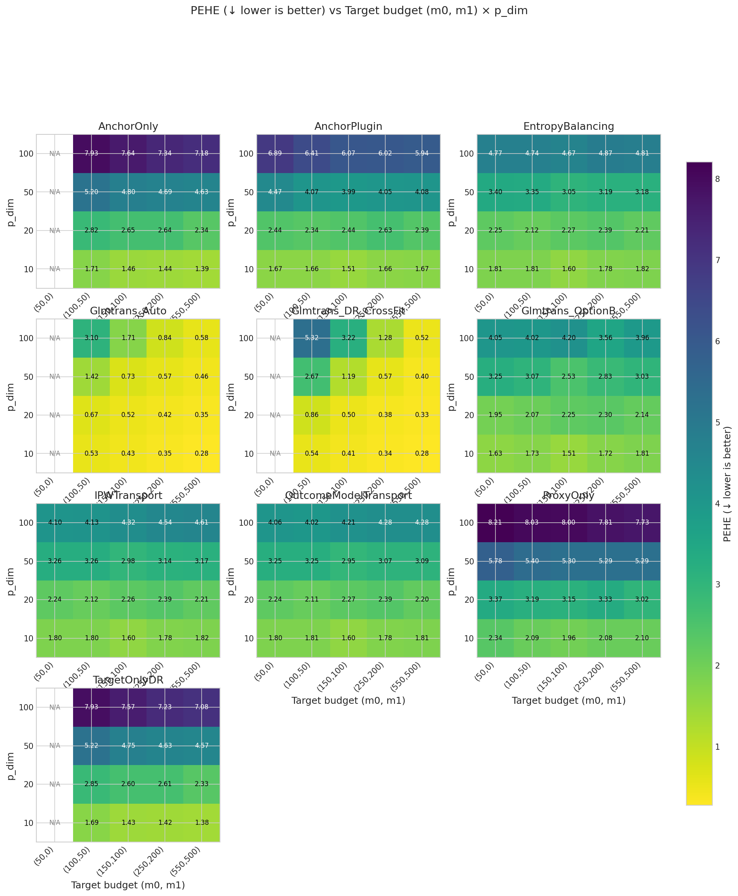

# Fair DGP: Target budget (m₀,m₁) × Dimensionality grid

**Benchmark ID:** `gold_fair_dim_sweep`

**Generated:** 2026-02-06 09:07

---

## 1. Motivation

**Research Question:** How do target sample size and feature dimensionality jointly affect estimator performance under fair DGP settings?

**Why This Matters:**
This 2D grid explores the interaction between:
1. **Target budget (m₀, m₁):** More target data → less need for transfer
   - m₀ = m₁ + 50 (staggered: always 50 more placebo than treated)
   - Includes m₁=0 case (placebo-only target) to test Option B methods
2. **Dimensionality (d):** Higher d → harder estimation, potentially more benefit from source data

**Key Grid:**
- Target budgets: (50,0), (100,50), (150,100), (250,200), (550,500)
- Dimension: d ∈ {10, 20, 50, 100}
- Total: 4 × 4 = 16 scenarios

**Critical Trade-offs:**
- Low d + large m₀: Target-only methods may suffice
- High d + small m₀: Transfer learning becomes essential
- The "break-even" point depends on SNR and overlap

**DGP Settings (Fair):**
- SNR ≈ 3-4 (nontransfer_scale = 0.1)
- Overlap AUC ≈ 0.75 (overlap_lambda = 0.25)
- Controlled intercept drift (scale = 0.5)
- 20,000 source observations across 10 sites

---

## 2. Simulation Setup

**Fair DGP with Variable Dimensionality:**

Uses standard synthetic DGP with fair settings optimized for method comparison:
- **Covariates:** X ~ N(0, I_d) with variable d
- **Treatment:** A ~ Bernoulli(e(X)) with logistic propensity
- **Outcome:** Y = μ_A(X) + ε with heterogeneous effects
- **Transfer:** Controlled nontransfer component (SNR ≈ 3-4)
- **Sites:** 10 source sites with moderate covariate shift

### Swept Parameters (Varied Across Scenarios)

| Parameter | Values | Description |
|-----------|--------|-------------|
| **m1** | `[0, 50, 100, 200, 500]` | Target treated sample size (n₁). If 0, only Option B methods are feasible. |
| **p_dim** | `[10, 20, 50, 100]` | Covariate dimension (d). Higher d = harder estimation. |

### Coupled Parameters (Derived from Swept)

| Parameter | Coupling | Description |
|-----------|----------|-------------|
| **m0** | `= ('m1', 50)` | Target placebo/control sample size (n₀) |

### Fixed Parameters (Held Constant)

| Parameter | Value | Description |
|-----------|-------|-------------|
| n_proxy_total | `20000` | Total source/proxy observations across all sites |
| C_sources | `10` | Number of source sites (K) |
| nontransfer_scale | `0.1` | Scale of non-transferable component (σᵥ). Higher = less transfer benefit. |
| use_fair_dgp | `True` | Parameter: use_fair_dgp |
| overlap_lambda | `0.25` | Covariate distribution divergence (0=identical, 1=disjoint) |
| intercept_drift_scale | `0.5` | Scale of arm-specific intercept drift across sites |

### Experimental Design Summary

- **Sweep type:** `2d`
- **Number of swept parameters:** 2
- **Number of coupled parameters:** 1
- **Number of fixed parameters:** 6
- **Total unique scenarios:** 20

---

## 3. Metrics & Interpretation

| Metric | Direction | Description |
|--------|-----------|-------------|
| **PEHE (Precision in Estimating Heterogeneous Effects)** | ↓ lower is better | Root mean squared error of CATE predictions. Measures how accurately the estimat... |
| **ATE Absolute Error** | ↓ lower is better | Absolute difference between estimated and true average treatment effect.... |
| **ATE Bias (Signed)** | ↑ closer to 0 is better | Signed bias in ATE estimate. Positive = overestimate, negative = underestimate.... |
| **Spearman Rank Correlation** | ↑ higher is better | Rank correlation between predicted and true treatment effects.... |
| **Kendall Rank Correlation** | ↑ higher is better | Kendall tau-b correlation. More robust to ties than Spearman.... |
| **Qini AUC (Oracle)** | ↑ higher is better | Area under the Qini curve. Measures ranking quality for treatment targeting.... |
| **Top-10% Uplift Capture Ratio** | ↑ higher is better | Fraction of maximum uplift captured when treating top 10% by predicted CATE.... |
| **Top-20% Uplift Capture Ratio** | ↑ higher is better | Fraction of maximum uplift captured when treating top 20% by predicted CATE.... |
| **Top-30% Uplift Capture Ratio** | ↑ higher is better | Fraction of maximum uplift captured when treating top 30%.... |
| **Calibration Slope** | ↑ closer to 1 is better | Slope of regression of true τ on predicted τ̂. Ideal = 1.0.... |
| **Calibration R²** | ↑ higher is better | Variance explained by predictions. Measures calibration quality.... |
| **CATE ECE (Expected Calibration Error)** | ↓ lower is better | Expected calibration error for CATE. Binned average miscalibration.... |
| **Policy Value (Treat if τ̂ > 0)** | ↑ higher is better | Expected outcome under threshold-based treatment policy.... |
| **Policy Regret vs Oracle** | ↓ lower is better | Gap between oracle policy value and estimated policy value.... |
| **Policy Value (Treat Top 20%)** | ↑ higher is better | Expected outcome when treating top 20% by predicted CATE.... |
| **Policy Regret (Top 20% Budget)** | ↓ lower is better | Regret compared to oracle top-20% policy.... |
| **μ₀ RMSE (Control Outcome)** | ↓ lower is better | RMSE of predicted control outcomes. Measures nuisance estimation quality.... |

### Detailed Metric Definitions

**PEHE (Precision in Estimating Heterogeneous Effects)**

- Formula: $\sqrt{\frac{1}{n}\sum_i (\hat{\tau}(x_i) - \tau(x_i))^2}$
- Direction: **lower is better**
- A PEHE of 0.5 means predictions are off by 0.5 units on average.

**ATE Absolute Error**

- Formula: $|\hat{\text{ATE}} - \text{ATE}|$
- Direction: **lower is better**
- Important for policy decisions about whether to adopt treatment broadly.

**ATE Bias (Signed)**

- Formula: $\hat{\text{ATE}} - \text{ATE}$
- Direction: **closer to 0 is better**
- Shows systematic over/under-estimation tendencies.

**Spearman Rank Correlation**

- Formula: $\rho(\text{rank}(\hat{\tau}), \text{rank}(\tau))$
- Direction: **higher is better**
- 1.0 = perfect ranking, 0.0 = random. Critical for targeting interventions.

**Kendall Rank Correlation**

- Formula: $\tau_K(\hat{\tau}, \tau)$
- Direction: **higher is better**
- Alternative ranking metric; useful when ties are common.

**Qini AUC (Oracle)**

- Formula: Normalized AUC of cumulative uplift curve
- Direction: **higher is better**
- 1.0 = oracle ranking, 0.0 = random. Simulation-only metric using true τ.

**Top-10% Uplift Capture Ratio**

- Formula: $\frac{\bar{\tau}_{top10\%\ by\ \hat{\tau}}}{\bar{\tau}_{top10\%\ by\ \tau}}$
- Direction: **higher is better**
- 1.0 = oracle selection. Measures targeting efficiency for top patients.

**Top-20% Uplift Capture Ratio**

- Formula: $\frac{\bar{\tau}_{top20\%\ by\ \hat{\tau}}}{\bar{\tau}_{top20\%\ by\ \tau}}$
- Direction: **higher is better**
- 1.0 = oracle selection. Less stringent than top-10%.

**Top-30% Uplift Capture Ratio**

- Formula: $\frac{\bar{\tau}_{top30\%\ by\ \hat{\tau}}}{\bar{\tau}_{top30\%\ by\ \tau}}$
- Direction: **higher is better**
- Less stringent targeting metric.

**Calibration Slope**

- Formula: $\beta$ in $\tau = \alpha + \beta \hat{\tau}$
- Direction: **closer to 1 is better**
- <1 = overconfident predictions, >1 = underconfident.

**Calibration R²**

- Formula: $R^2$ of calibration regression
- Direction: **higher is better**
- Higher R² means predictions track true effects well.

**CATE ECE (Expected Calibration Error)**

- Formula: $\sum_b \frac{n_b}{n} |E[\tau | \hat{\tau} \in b] - E[\hat{\tau} | \hat{\tau} \in b]|$
- Direction: **lower is better**
- Lower ECE means better calibration across prediction ranges.

**Policy Value (Treat if τ̂ > 0)**

- Formula: $E[\mu_0 + \pi(\hat{\tau}) \cdot \tau]$ where $\pi(\hat{\tau}) = 1\{\hat{\tau} > 0\}$
- Direction: **higher is better**
- Higher value = better treatment decisions based on predictions.

**Policy Regret vs Oracle**

- Formula: $V(\pi^*) - V(\hat{\pi})$
- Direction: **lower is better**
- Lower regret = closer to optimal treatment decisions.

**Policy Value (Treat Top 20%)**

- Formula: $E[\mu_0 + \pi_{top20\%}(\hat{\tau}) \cdot \tau]$
- Direction: **higher is better**
- Budget-constrained policy evaluation.

**Policy Regret (Top 20% Budget)**

- Formula: $V(\pi^*_{top20\%}) - V(\hat{\pi}_{top20\%})$
- Direction: **lower is better**
- Budget-constrained regret.

**μ₀ RMSE (Control Outcome)**

- Formula: $\sqrt{\frac{1}{n}\sum_i (\hat{\mu}_0(x_i) - \mu_0(x_i))^2}$
- Direction: **lower is better**
- Important diagnostic; poor μ₀ estimation can propagate to CATE errors.

---

## 4. Methods Compared

### 4.1 Method Summary Table

| Method | Category | Target Placebo | Target Treated | Source | Description |
|--------|----------|----------------|----------------|--------|-------------|
| **TargetOnlyDR** | Baseline | ✓ | ✓ | ✗ | Target-only DR learner (no transfer) |
| **ProxyOnly** | Baseline | ✗ | ✗ | ✓ | Source-only proxy (no target correction) |
| **Glmtrans_Auto** | Transfer Learning | ✓ | ✓ | ✓ | glmtrans with auto source detection |
| **Glmtrans_DR_CrossFit** | Transfer Learning | ✓ | ✓ | ✓ | glmtrans with CROSS-FITTED DR (RECOMMENDED) |
| **Glmtrans_OptionB** | Transfer Learning | ✓ | ✗ | ✓ | Option B: glmtrans source detection + Source-DR CATE |
| **AnchorOnly** | Anchor | ✓ | ✓ | ✓ | Placebo-anchored with DR (needs target treated) |
| **AnchorPlugin** | Anchor | ✓ | ✗ | ✓ | Placebo-anchored plug-in (no DR) |
| **IPWTransport** | Transport | ✓ | ✗ | ✓ | IPW-weighted outcome models |
| **EntropyBalancing** | Transport | ✓ | ✗ | ✓ | Entropy balancing weights |
| **OutcomeModelTransport** | Transport | ✓ | ✗ | ✓ | Unweighted outcome models |

### 4.2 Method Implementation Details

#### TargetOnlyDR

**Category:** Baseline

**Description:** Target-only DR learner (no transfer)

**Data Requirements:** Target placebo (A=0), Target treated (A=1)

**Pseudo-code:**
```
1. Fit μ̂₀(x) on target controls: (X_target[A=0], Y_target[A=0])
2. Fit μ̂₁(x) on target treated: (X_target[A=1], Y_target[A=1])
3. Compute DR pseudo-outcomes on target:
   Γᵢ = (Aᵢ/ê)(Yᵢ - μ̂₁(Xᵢ)) + μ̂₁(Xᵢ) - ((1-Aᵢ)/(1-ê))(Yᵢ - μ̂₀(Xᵢ)) - μ̂₀(Xᵢ)
4. Fit τ̂(x) on (X_target, Γ) using Lasso
```

**Reference:** Kennedy (2020) - Doubly Robust Learner

---

#### ProxyOnly

**Category:** Baseline

**Description:** Source-only proxy (no target correction)

**Data Requirements:** Source data

**Pseudo-code:**
```
1. Pool all source data by treatment arm
2. Fit μ̂₀^src(x) on source controls
3. Fit μ̂₁^src(x) on source treated
4. Predict: τ̂(x) = μ̂₁^src(x) - μ̂₀^src(x)
```

**Reference:** Naive source pooling baseline

---

#### Glmtrans_Auto

**Category:** Transfer Learning

**Description:** glmtrans with auto source detection

**Data Requirements:** Target placebo (A=0), Target treated (A=1), Source data

**Pseudo-code:**
```
For each outcome model (μ₀ and μ₁):
  1. SOURCE DETECTION: Identify transferable sources
     - Fit target-only model, compute CV loss L_target
     - For each source k: compute loss L_k
     - Source k transferable if L_k ≤ C₀ · L_target
  2. TRANSFER STEP: Pool transferable sources
     - Fit elastic-net on pooled source data → ŵ_A
  3. DEBIAS STEP: Correct on target
     - Compute residuals: r = Y_target - X_target · ŵ_A
     - Fit elastic-net on residuals → δ̂_A
  4. FINAL: β̂ = ŵ_A + δ̂_A

CATE: τ̂(x) = μ̂₁(x) - μ̂₀(x)
```

**Reference:** Tian & Feng (2023) JASA

---

#### Glmtrans_DR_CrossFit

**Category:** Transfer Learning

**Description:** glmtrans with CROSS-FITTED DR (RECOMMENDED)

**Data Requirements:** Target placebo (A=0), Target treated (A=1), Source data

**Pseudo-code:**
```
For k = 1, ..., K folds:
  1. Split target into train (fold ≠ k) and test (fold = k)
  2. Fit glmtrans on train target + ALL sources
  3. Get OUT-OF-FOLD predictions μ̂₀[test], μ̂₁[test]
  4. Fit ridge logistic propensity on train target
  5. Get OUT-OF-FOLD ê[test]

After cross-fitting:
  6. Clip propensities: ê_clipped = clip(ê, 0.05, 0.95)
  7. Compute DR pseudo-outcomes (using OOF estimates):
     Γᵢ = μ̂₁(Xᵢ) - μ̂₀(Xᵢ) + (Aᵢ-ê)/(ê(1-ê)) · residual
  8. Fit τ̂(x) on (X_target, Γ) using Lasso

Diagnostics:
  - Var(Γ) / Var(μ̂₁-μ̂₀): If >> 1, DR is hurting
  - Max inverse weight: If > 20, weights are unstable
```

**Reference:** Advisor-recommended cross-fitted DR construction

---

#### Glmtrans_OptionB

**Category:** Transfer Learning

**Description:** Option B: glmtrans source detection + Source-DR CATE

**Data Requirements:** Target placebo (A=0), Source data

**Pseudo-code:**
```
Stage 0 (Source Detection - Control Arm ONLY):
  # This is the ONLY place glmtrans theory applies
  1. Target placebo: (X_t, Y_t(0))
  2. Source controls: [(X_sk[A=0], Y_sk(0)) for k in 1..K]
  3. Run glmtrans(target, sources, family="gaussian", transfer.source.id="auto")
  4. Return selected sources: Ŝ₀ ⊂ {1,...,K}
  # Uses ONLY Y_target(0) - exactly as glmtrans was designed

Stage 1 (Restrict to Selected Sources - NO WEIGHTING):
  # Simply subset. No soft selection, no importance weighting.
  D_src^good = ∪_{k ∈ Ŝ₀} D_k

Stage 2 (Source-DR CATE):
  # DR learning happens WHERE IDENTIFICATION HOLDS: on sources
  1. Fit μ̂₀^src on X_good[A=0], Y_good[A=0]
  2. Fit μ̂₁^src on X_good[A=1], Y_good[A=1]  
  3. ê = mean(A) on selected sources
  4. DR pseudo-outcomes on SOURCES:
     Γᵢ = μ̂₁(Xᵢ) - μ̂₀(Xᵢ) + (Aᵢ-ê)/(ê(1-ê)) · (Yᵢ - μ̂_{Aᵢ}(Xᵢ))
  5. Fit τ̂^src(x) = E[Γ|X=x] on source pseudo-outcomes

Stage 3 (Transport to Target):
  # Direct transport - relies on structural similarity encoded by Ŝ₀
  τ̂_target(x) := τ̂^src(x)
  # No further correction (we have no target treated data)

VALID FOR: Placebo-only target (m₁=0)
IDENTIFICATION: Via transferable source selection + DR on sources
```

**Reference:** Advisor construction based on Tian & Feng (2023) JASA

---

#### AnchorOnly

**Category:** Anchor

**Description:** Placebo-anchored with DR (needs target treated)

**Data Requirements:** Target placebo (A=0), Target treated (A=1), Source data

**Pseudo-code:**
```
1. Fit source proxy: μ̂₀^src(x) on pooled source controls
2. Compute residuals on target placebo: δ̂₀(x) = Y - μ̂₀^src(X)
3. Fit correction: δ̂₀(x) using Lasso on target placebo residuals
4. Corrected μ̂₀(x) = μ̂₀^src(x) + δ̂₀(x)
5. Fit μ̂₁(x) directly on target treated
6. DR pseudo-outcomes + CATE model
```

**Reference:** Placebo-anchored transfer

---

#### AnchorPlugin

**Category:** Anchor

**Description:** Placebo-anchored plug-in (no DR)

**Data Requirements:** Target placebo (A=0), Source data

**Pseudo-code:**
```
1. Fit source proxy: μ̂₀^src(x), μ̂₁^src(x)
2. Compute residuals on target placebo
3. Fit correction δ̂₀(x) on residuals
4. Plug-in: τ̂(x) = μ̂₁^src(x) - (μ̂₀^src(x) + δ̂₀(x))
   (No DR pseudo-outcomes, no target treated needed)
```

**Reference:** Plug-in variant of anchor

---

#### IPWTransport

**Category:** Transport

**Description:** IPW-weighted outcome models

**Data Requirements:** Target placebo (A=0), Source data

**Pseudo-code:**
```
1. Estimate site membership: P(S=target|X)
2. Compute IPW weights: w(x) = P(S=target|X) / P(S=source|X)
3. Fit weighted outcome models on source:
   μ̂ₐ = argmin Σᵢ wᵢ·(Yᵢ - μ(Xᵢ))²
4. Predict: τ̂(x) = μ̂₁(x) - μ̂₀(x)
```

**Reference:** Hong et al. - IPW transport

---

#### EntropyBalancing

**Category:** Transport

**Description:** Entropy balancing weights

**Data Requirements:** Target placebo (A=0), Source data

**Pseudo-code:**
```
1. Find weights w that balance source to target:
   Σᵢ wᵢ·Xᵢ = X̄_target (moment matching)
   max Σᵢ wᵢ·log(wᵢ) (max entropy)
2. Fit weighted outcome models
3. Predict: τ̂(x) = μ̂₁(x) - μ̂₀(x)
```

**Reference:** Hainmueller (2012)

---

#### OutcomeModelTransport

**Category:** Transport

**Description:** Unweighted outcome models

**Data Requirements:** Target placebo (A=0), Source data

**Pseudo-code:**
```
1. Fit outcome models on source (unweighted):
   μ̂ₐ^src on (X_source[A=a], Y_source[A=a])
2. Predict on target: τ̂(x) = μ̂₁^src(x) - μ̂₀^src(x)
   (Assumes outcome model generalizes across sites)
```

**Reference:** Baseline - no reweighting

---

---

## 5. Experiment Summary

- **Sweep parameter:** `m1` ∈ [0, 50, 100, 200, 500]
- **Monte Carlo replicates:** 100 per scenario
- **Methods evaluated:** 10
- **Total runs:** 20000

---

## 6. Results

### Best Methods (averaged across sweep)

| Metric | Best Method | Value | Direction |
|--------|-------------|-------|----------|
| PEHE | **Glmtrans_DR_CrossFit** | 0.2785 | ↓ lower |
| ATE Error | **Glmtrans_Auto** | 0.0271 | ↓ lower |
| Spearman ρ | **Glmtrans_DR_CrossFit** | 0.9975 | ↑ higher |
| Kendall τ | **Glmtrans_DR_CrossFit** | 0.9600 | ↑ higher |
| Qini AUC | **Glmtrans_DR_CrossFit** | 0.9978 | ↑ higher |
| Top-10% Ratio | **Glmtrans_DR_CrossFit** | 0.9978 | ↑ higher |
| Top-20% Ratio | **Glmtrans_DR_CrossFit** | 0.9977 | ↑ higher |
| Calibration R² | **Glmtrans_DR_CrossFit** | 0.9956 | ↑ higher |
| CATE ECE | **Glmtrans_DR_CrossFit** | 0.0518 | ↓ lower |
| Policy Value | **Glmtrans_DR_CrossFit** | 3.3570 | ↑ higher |
| Policy Regret | **Glmtrans_DR_CrossFit** | 0.0056 | ↓ lower |

### Core Metrics

| m0 | m1 | Method | PEHE (↓) | ATE Err (↓) | Spearman (↑) | Qini (↑) |
|---|---|---|---|---|---|
| 50 | 0 | AnchorOnly | N/A | N/A | N/A | N/A |
| 50 | 0 | AnchorOnly | N/A | N/A | N/A | N/A |
| 50 | 0 | AnchorOnly | N/A | N/A | N/A | N/A |
| 50 | 0 | AnchorOnly | N/A | N/A | N/A | N/A |
| 50 | 0 | AnchorPlugin | 1.670 ± 0.714 | 0.539 ± 0.475 | 0.823 ± 0.130 | 0.833 ± 0.127 |
| 50 | 0 | AnchorPlugin | 6.891 ± 1.230 | 1.301 ± 0.989 | 0.536 ± 0.098 | 0.554 ± 0.099 |
| 50 | 0 | AnchorPlugin | 4.471 ± 1.388 | 0.862 ± 0.708 | 0.659 ± 0.132 | 0.675 ± 0.132 |
| 50 | 0 | AnchorPlugin | 2.436 ± 0.931 | 0.604 ± 0.452 | 0.763 ± 0.135 | 0.775 ± 0.132 |
| 50 | 0 | EntropyBalancing | 1.813 ± 0.829 | 0.767 ± 0.564 | 0.806 ± 0.167 | 0.816 ± 0.164 |
| 50 | 0 | EntropyBalancing | 4.769 ± 1.928 | 0.983 ± 0.873 | 0.800 ± 0.142 | 0.811 ± 0.139 |
| 50 | 0 | EntropyBalancing | 3.398 ± 1.785 | 0.757 ± 0.578 | 0.807 ± 0.161 | 0.818 ± 0.157 |
| 50 | 0 | EntropyBalancing | 2.249 ± 1.100 | 0.793 ± 0.593 | 0.812 ± 0.161 | 0.823 ± 0.158 |
| 50 | 0 | Glmtrans_Auto | N/A | N/A | N/A | N/A |
| 50 | 0 | Glmtrans_Auto | N/A | N/A | N/A | N/A |
| 50 | 0 | Glmtrans_Auto | N/A | N/A | N/A | N/A |
| 50 | 0 | Glmtrans_Auto | N/A | N/A | N/A | N/A |
| 50 | 0 | Glmtrans_DR_CrossFit | N/A | N/A | N/A | N/A |
| 50 | 0 | Glmtrans_DR_CrossFit | N/A | N/A | N/A | N/A |
| 50 | 0 | Glmtrans_DR_CrossFit | N/A | N/A | N/A | N/A |
| 50 | 0 | Glmtrans_DR_CrossFit | N/A | N/A | N/A | N/A |
| 50 | 0 | Glmtrans_OptionB | 1.625 ± 0.745 | 0.722 ± 0.537 | 0.849 ± 0.143 | 0.857 ± 0.139 |
| 50 | 0 | Glmtrans_OptionB | 4.055 ± 2.057 | 0.988 ± 0.874 | 0.846 ± 0.139 | 0.855 ± 0.135 |
| 50 | 0 | Glmtrans_OptionB | 3.249 ± 1.820 | 0.743 ± 0.545 | 0.820 ± 0.161 | 0.830 ± 0.158 |
| 50 | 0 | Glmtrans_OptionB | 1.947 ± 0.917 | 0.727 ± 0.558 | 0.863 ± 0.128 | 0.871 ± 0.123 |
| 50 | 0 | IPWTransport | 1.805 ± 0.830 | 0.766 ± 0.560 | 0.807 ± 0.168 | 0.817 ± 0.165 |
| 50 | 0 | IPWTransport | 4.101 ± 2.049 | 0.996 ± 0.888 | 0.843 ± 0.139 | 0.853 ± 0.135 |
| 50 | 0 | IPWTransport | 3.263 ± 1.830 | 0.764 ± 0.587 | 0.820 ± 0.160 | 0.830 ± 0.156 |
| 50 | 0 | IPWTransport | 2.240 ± 1.100 | 0.800 ± 0.597 | 0.813 ± 0.162 | 0.824 ± 0.158 |
| 50 | 0 | OutcomeModelTransport | 1.804 ± 0.831 | 0.766 ± 0.562 | 0.807 ± 0.168 | 0.817 ± 0.165 |
| 50 | 0 | OutcomeModelTransport | 4.058 ± 2.059 | 0.991 ± 0.873 | 0.846 ± 0.139 | 0.855 ± 0.135 |
| 50 | 0 | OutcomeModelTransport | 3.251 ± 1.822 | 0.743 ± 0.547 | 0.820 ± 0.161 | 0.830 ± 0.158 |
| 50 | 0 | OutcomeModelTransport | 2.239 ± 1.101 | 0.798 ± 0.599 | 0.813 ± 0.162 | 0.824 ± 0.158 |
| 50 | 0 | ProxyOnly | 2.339 ± 0.672 | 0.689 ± 0.517 | 0.642 ± 0.152 | 0.654 ± 0.152 |
| 50 | 0 | ProxyOnly | 8.209 ± 1.226 | 1.857 ± 1.598 | 0.201 ± 0.091 | 0.209 ± 0.093 |
| 50 | 0 | ProxyOnly | 5.777 ± 1.223 | 1.334 ± 1.038 | 0.332 ± 0.109 | 0.344 ± 0.112 |
| 50 | 0 | ProxyOnly | 3.372 ± 0.842 | 0.853 ± 0.664 | 0.513 ± 0.131 | 0.527 ± 0.133 |
| 50 | 0 | TargetOnlyDR | N/A | N/A | N/A | N/A |
| 50 | 0 | TargetOnlyDR | N/A | N/A | N/A | N/A |
| 50 | 0 | TargetOnlyDR | N/A | N/A | N/A | N/A |
| 50 | 0 | TargetOnlyDR | N/A | N/A | N/A | N/A |
| 100 | 50 | AnchorOnly | 1.715 ± 0.532 | 0.205 ± 0.162 | 0.798 ± 0.073 | 0.808 ± 0.070 |
| 100 | 50 | AnchorOnly | 5.195 ± 0.978 | 0.549 ± 0.445 | 0.497 ± 0.082 | 0.513 ± 0.082 |
| 100 | 50 | AnchorOnly | 7.935 ± 1.557 | 0.706 ± 0.623 | 0.339 ± 0.086 | 0.353 ± 0.087 |
| 100 | 50 | AnchorOnly | 2.823 ± 0.674 | 0.294 ± 0.223 | 0.705 ± 0.066 | 0.719 ± 0.064 |
| 100 | 50 | AnchorPlugin | 1.659 ± 0.675 | 0.518 ± 0.367 | 0.793 ± 0.168 | 0.803 ± 0.166 |
| 100 | 50 | AnchorPlugin | 4.074 ± 1.131 | 0.892 ± 0.744 | 0.717 ± 0.114 | 0.732 ± 0.112 |
| 100 | 50 | AnchorPlugin | 6.411 ± 1.641 | 1.181 ± 1.033 | 0.639 ± 0.096 | 0.656 ± 0.094 |
| 100 | 50 | AnchorPlugin | 2.343 ± 0.758 | 0.582 ± 0.485 | 0.789 ± 0.116 | 0.801 ± 0.113 |
| 100 | 50 | EntropyBalancing | 1.812 ± 0.748 | 0.739 ± 0.505 | 0.770 ± 0.213 | 0.783 ± 0.197 |
| 100 | 50 | EntropyBalancing | 3.352 ± 1.495 | 0.992 ± 0.921 | 0.820 ± 0.140 | 0.831 ± 0.136 |
| 100 | 50 | EntropyBalancing | 4.741 ± 2.166 | 1.024 ± 0.757 | 0.816 ± 0.131 | 0.827 ± 0.127 |
| 100 | 50 | EntropyBalancing | 2.123 ± 0.963 | 0.657 ± 0.562 | 0.828 ± 0.136 | 0.838 ± 0.131 |
| 100 | 50 | Glmtrans_Auto | 0.530 ± 0.142 | 0.078 ± 0.055 | 0.976 ± 0.019 | 0.978 ± 0.018 |
| 100 | 50 | Glmtrans_Auto | 1.415 ± 0.653 | 0.176 ± 0.194 | 0.964 ± 0.034 | 0.968 ± 0.031 |
| 100 | 50 | Glmtrans_Auto | 3.096 ± 1.814 | 0.358 ± 0.317 | 0.913 ± 0.076 | 0.920 ± 0.071 |
| 100 | 50 | Glmtrans_Auto | 0.666 ± 0.172 | 0.102 ± 0.075 | 0.982 ± 0.014 | 0.983 ± 0.013 |
| 100 | 50 | Glmtrans_DR_CrossFit | 0.545 ± 0.149 | 0.097 ± 0.070 | 0.975 ± 0.019 | 0.977 ± 0.018 |
| 100 | 50 | Glmtrans_DR_CrossFit | 2.670 ± 1.242 | 0.336 ± 0.311 | 0.878 ± 0.094 | 0.887 ± 0.090 |
| 100 | 50 | Glmtrans_DR_CrossFit | 5.324 ± 2.039 | 0.523 ± 0.425 | 0.755 ± 0.136 | 0.754 ± 0.168 |
| 100 | 50 | Glmtrans_DR_CrossFit | 0.863 ± 0.286 | 0.121 ± 0.113 | 0.968 ± 0.029 | 0.971 ± 0.026 |
| 100 | 50 | Glmtrans_OptionB | 1.733 ± 0.744 | 0.726 ± 0.515 | 0.790 ± 0.206 | 0.803 ± 0.190 |
| 100 | 50 | Glmtrans_OptionB | 3.065 ± 1.429 | 0.922 ± 0.835 | 0.849 ± 0.125 | 0.859 ± 0.121 |
| 100 | 50 | Glmtrans_OptionB | 4.019 ± 2.261 | 0.932 ± 0.711 | 0.858 ± 0.124 | 0.867 ± 0.119 |
| 100 | 50 | Glmtrans_OptionB | 2.067 ± 0.917 | 0.695 ± 0.541 | 0.840 ± 0.141 | 0.849 ± 0.136 |
| 100 | 50 | IPWTransport | 1.805 ± 0.749 | 0.739 ± 0.504 | 0.772 ± 0.211 | 0.785 ± 0.195 |
| 100 | 50 | IPWTransport | 3.259 ± 1.530 | 0.990 ± 0.913 | 0.828 ± 0.143 | 0.838 ± 0.138 |
| 100 | 50 | IPWTransport | 4.125 ± 2.225 | 0.981 ± 0.712 | 0.853 ± 0.124 | 0.863 ± 0.119 |
| 100 | 50 | IPWTransport | 2.116 ± 0.959 | 0.660 ± 0.565 | 0.830 ± 0.135 | 0.840 ± 0.130 |
| 100 | 50 | OutcomeModelTransport | 1.805 ± 0.750 | 0.741 ± 0.502 | 0.772 ± 0.211 | 0.785 ± 0.195 |
| 100 | 50 | OutcomeModelTransport | 3.248 ± 1.542 | 1.009 ± 0.919 | 0.829 ± 0.144 | 0.839 ± 0.140 |
| 100 | 50 | OutcomeModelTransport | 4.020 ± 2.263 | 0.932 ± 0.711 | 0.858 ± 0.124 | 0.867 ± 0.119 |
| 100 | 50 | OutcomeModelTransport | 2.109 ± 0.954 | 0.653 ± 0.554 | 0.830 ± 0.135 | 0.840 ± 0.129 |
| 100 | 50 | ProxyOnly | 2.090 ± 0.663 | 0.559 ± 0.450 | 0.683 ± 0.160 | 0.694 ± 0.160 |
| 100 | 50 | ProxyOnly | 5.405 ± 0.970 | 0.937 ± 0.840 | 0.434 ± 0.107 | 0.449 ± 0.109 |
| 100 | 50 | ProxyOnly | 8.025 ± 1.483 | 1.465 ± 1.161 | 0.326 ± 0.077 | 0.339 ± 0.079 |
| 100 | 50 | ProxyOnly | 3.191 ± 0.753 | 0.711 ± 0.569 | 0.600 ± 0.120 | 0.615 ± 0.120 |
| 100 | 50 | TargetOnlyDR | 1.690 ± 0.493 | 0.186 ± 0.148 | 0.803 ± 0.061 | 0.813 ± 0.058 |
| 100 | 50 | TargetOnlyDR | 5.218 ± 0.934 | 0.529 ± 0.452 | 0.482 ± 0.082 | 0.499 ± 0.081 |
| 100 | 50 | TargetOnlyDR | 7.929 ± 1.469 | 0.768 ± 0.606 | 0.335 ± 0.075 | 0.348 ± 0.076 |
| 100 | 50 | TargetOnlyDR | 2.846 ± 0.629 | 0.294 ± 0.256 | 0.686 ± 0.075 | 0.701 ± 0.073 |
| 150 | 100 | AnchorOnly | 7.637 ± 1.671 | 0.608 ± 0.512 | 0.442 ± 0.069 | 0.458 ± 0.069 |
| 150 | 100 | AnchorOnly | 1.459 ± 0.410 | 0.131 ± 0.108 | 0.847 ± 0.049 | 0.856 ± 0.046 |
| 150 | 100 | AnchorOnly | 4.799 ± 0.902 | 0.391 ± 0.316 | 0.599 ± 0.061 | 0.615 ± 0.060 |
| 150 | 100 | AnchorOnly | 2.651 ± 0.709 | 0.224 ± 0.170 | 0.750 ± 0.053 | 0.764 ± 0.051 |
| 150 | 100 | AnchorPlugin | 6.069 ± 1.893 | 1.024 ± 0.969 | 0.686 ± 0.096 | 0.701 ± 0.095 |
| 150 | 100 | AnchorPlugin | 1.513 ± 0.631 | 0.424 ± 0.353 | 0.818 ± 0.148 | 0.828 ± 0.143 |
| 150 | 100 | AnchorPlugin | 3.990 ± 1.122 | 0.956 ± 0.690 | 0.728 ± 0.108 | 0.743 ± 0.106 |
| 150 | 100 | AnchorPlugin | 2.437 ± 0.908 | 0.661 ± 0.464 | 0.775 ± 0.134 | 0.787 ± 0.131 |
| 150 | 100 | EntropyBalancing | 4.666 ± 2.387 | 0.982 ± 0.947 | 0.825 ± 0.128 | 0.836 ± 0.124 |
| 150 | 100 | EntropyBalancing | 1.603 ± 0.703 | 0.522 ± 0.420 | 0.801 ± 0.186 | 0.812 ± 0.183 |
| 150 | 100 | EntropyBalancing | 3.049 ± 1.437 | 0.849 ± 0.675 | 0.842 ± 0.125 | 0.852 ± 0.122 |
| 150 | 100 | EntropyBalancing | 2.271 ± 1.061 | 0.744 ± 0.567 | 0.810 ± 0.156 | 0.821 ± 0.152 |
| 150 | 100 | Glmtrans_Auto | 1.713 ± 0.748 | 0.151 ± 0.138 | 0.975 ± 0.018 | 0.978 ± 0.016 |
| 150 | 100 | Glmtrans_Auto | 0.434 ± 0.156 | 0.051 ± 0.039 | 0.982 ± 0.021 | 0.983 ± 0.021 |
| 150 | 100 | Glmtrans_Auto | 0.731 ± 0.159 | 0.075 ± 0.057 | 0.991 ± 0.005 | 0.992 ± 0.005 |
| 150 | 100 | Glmtrans_Auto | 0.517 ± 0.129 | 0.059 ± 0.044 | 0.989 ± 0.008 | 0.990 ± 0.008 |
| 150 | 100 | Glmtrans_DR_CrossFit | 3.216 ± 1.662 | 0.276 ± 0.254 | 0.916 ± 0.056 | 0.922 ± 0.053 |
| 150 | 100 | Glmtrans_DR_CrossFit | 0.412 ± 0.152 | 0.056 ± 0.046 | 0.983 ± 0.019 | 0.984 ± 0.019 |
| 150 | 100 | Glmtrans_DR_CrossFit | 1.190 ± 0.425 | 0.130 ± 0.127 | 0.975 ± 0.015 | 0.978 ± 0.014 |
| 150 | 100 | Glmtrans_DR_CrossFit | 0.497 ± 0.137 | 0.078 ± 0.061 | 0.989 ± 0.008 | 0.990 ± 0.008 |
| 150 | 100 | Glmtrans_OptionB | 4.200 ± 2.453 | 0.946 ± 0.988 | 0.854 ± 0.123 | 0.864 ± 0.118 |
| 150 | 100 | Glmtrans_OptionB | 1.509 ± 0.658 | 0.503 ± 0.392 | 0.824 ± 0.169 | 0.834 ± 0.165 |
| 150 | 100 | Glmtrans_OptionB | 2.531 ± 1.241 | 0.807 ± 0.583 | 0.894 ± 0.092 | 0.901 ± 0.088 |
| 150 | 100 | Glmtrans_OptionB | 2.253 ± 1.063 | 0.779 ± 0.515 | 0.815 ± 0.159 | 0.825 ± 0.155 |
| 150 | 100 | IPWTransport | 4.321 ± 2.432 | 0.974 ± 0.975 | 0.847 ± 0.124 | 0.857 ± 0.120 |
| 150 | 100 | IPWTransport | 1.602 ± 0.704 | 0.522 ± 0.421 | 0.801 ± 0.186 | 0.812 ± 0.182 |
| 150 | 100 | IPWTransport | 2.985 ± 1.460 | 0.848 ± 0.680 | 0.848 ± 0.126 | 0.857 ± 0.123 |
| 150 | 100 | IPWTransport | 2.264 ± 1.065 | 0.740 ± 0.568 | 0.811 ± 0.156 | 0.822 ± 0.152 |
| 150 | 100 | OutcomeModelTransport | 4.206 ± 2.453 | 0.947 ± 0.988 | 0.854 ± 0.123 | 0.864 ± 0.118 |
| 150 | 100 | OutcomeModelTransport | 1.604 ± 0.704 | 0.525 ± 0.421 | 0.801 ± 0.186 | 0.811 ± 0.182 |
| 150 | 100 | OutcomeModelTransport | 2.951 ± 1.474 | 0.845 ± 0.671 | 0.850 ± 0.125 | 0.860 ± 0.121 |
| 150 | 100 | OutcomeModelTransport | 2.265 ± 1.067 | 0.745 ± 0.563 | 0.811 ± 0.156 | 0.822 ± 0.152 |
| 150 | 100 | ProxyOnly | 8.003 ± 1.696 | 1.354 ± 1.098 | 0.345 ± 0.081 | 0.359 ± 0.083 |
| 150 | 100 | ProxyOnly | 1.957 ± 0.661 | 0.529 ± 0.482 | 0.716 ± 0.152 | 0.728 ± 0.150 |
| 150 | 100 | ProxyOnly | 5.296 ± 1.004 | 1.139 ± 0.886 | 0.471 ± 0.085 | 0.487 ± 0.086 |
| 150 | 100 | ProxyOnly | 3.149 ± 0.856 | 0.737 ± 0.533 | 0.615 ± 0.125 | 0.630 ± 0.124 |
| 150 | 100 | TargetOnlyDR | 7.569 ± 1.583 | 0.568 ± 0.446 | 0.445 ± 0.064 | 0.461 ± 0.064 |
| 150 | 100 | TargetOnlyDR | 1.433 ± 0.389 | 0.138 ± 0.104 | 0.852 ± 0.041 | 0.861 ± 0.038 |
| 150 | 100 | TargetOnlyDR | 4.746 ± 0.862 | 0.387 ± 0.319 | 0.599 ± 0.060 | 0.615 ± 0.059 |
| 150 | 100 | TargetOnlyDR | 2.605 ± 0.636 | 0.199 ± 0.176 | 0.755 ± 0.048 | 0.769 ± 0.046 |
| 250 | 200 | AnchorOnly | 2.637 ± 0.654 | 0.173 ± 0.132 | 0.780 ± 0.043 | 0.793 ± 0.041 |
| 250 | 200 | AnchorOnly | 1.440 ± 0.411 | 0.099 ± 0.085 | 0.862 ± 0.037 | 0.871 ± 0.035 |
| 250 | 200 | AnchorOnly | 4.690 ± 0.935 | 0.270 ± 0.218 | 0.642 ± 0.054 | 0.659 ± 0.054 |
| 250 | 200 | AnchorOnly | 7.335 ± 1.390 | 0.436 ± 0.338 | 0.510 ± 0.057 | 0.527 ± 0.059 |
| 250 | 200 | AnchorPlugin | 2.626 ± 1.090 | 0.642 ± 0.665 | 0.766 ± 0.137 | 0.778 ± 0.135 |
| 250 | 200 | AnchorPlugin | 1.656 ± 0.706 | 0.525 ± 0.403 | 0.810 ± 0.141 | 0.820 ± 0.137 |
| 250 | 200 | AnchorPlugin | 4.053 ± 1.317 | 0.919 ± 0.852 | 0.726 ± 0.115 | 0.742 ± 0.113 |
| 250 | 200 | AnchorPlugin | 6.022 ± 1.842 | 1.229 ± 0.976 | 0.686 ± 0.106 | 0.702 ± 0.105 |
| 250 | 200 | EntropyBalancing | 2.387 ± 1.149 | 0.746 ± 0.685 | 0.811 ± 0.149 | 0.822 ± 0.146 |
| 250 | 200 | EntropyBalancing | 1.780 ± 0.765 | 0.641 ± 0.496 | 0.783 ± 0.191 | 0.795 ± 0.185 |
| 250 | 200 | EntropyBalancing | 3.190 ± 1.602 | 0.894 ± 0.738 | 0.833 ± 0.148 | 0.844 ± 0.143 |
| 250 | 200 | EntropyBalancing | 4.869 ± 2.334 | 1.151 ± 1.018 | 0.807 ± 0.137 | 0.818 ± 0.133 |
| 250 | 200 | Glmtrans_Auto | 0.423 ± 0.118 | 0.051 ± 0.038 | 0.994 ± 0.005 | 0.994 ± 0.004 |
| 250 | 200 | Glmtrans_Auto | 0.351 ± 0.153 | 0.041 ± 0.028 | 0.989 ± 0.012 | 0.990 ± 0.012 |
| 250 | 200 | Glmtrans_Auto | 0.575 ± 0.111 | 0.053 ± 0.036 | 0.995 ± 0.003 | 0.995 ± 0.003 |
| 250 | 200 | Glmtrans_Auto | 0.844 ± 0.198 | 0.074 ± 0.054 | 0.994 ± 0.002 | 0.995 ± 0.002 |
| 250 | 200 | Glmtrans_DR_CrossFit | 0.376 ± 0.126 | 0.051 ± 0.038 | 0.994 ± 0.005 | 0.995 ± 0.004 |
| 250 | 200 | Glmtrans_DR_CrossFit | 0.339 ± 0.158 | 0.041 ± 0.029 | 0.990 ± 0.012 | 0.990 ± 0.011 |
| 250 | 200 | Glmtrans_DR_CrossFit | 0.566 ± 0.111 | 0.057 ± 0.039 | 0.994 ± 0.003 | 0.995 ± 0.003 |
| 250 | 200 | Glmtrans_DR_CrossFit | 1.284 ± 0.396 | 0.113 ± 0.101 | 0.986 ± 0.006 | 0.988 ± 0.006 |
| 250 | 200 | Glmtrans_OptionB | 2.305 ± 1.197 | 0.760 ± 0.685 | 0.820 ± 0.158 | 0.830 ± 0.154 |
| 250 | 200 | Glmtrans_OptionB | 1.720 ± 0.745 | 0.636 ± 0.477 | 0.796 ± 0.190 | 0.808 ± 0.184 |
| 250 | 200 | Glmtrans_OptionB | 2.833 ± 1.522 | 0.832 ± 0.731 | 0.863 ± 0.145 | 0.872 ± 0.139 |
| 250 | 200 | Glmtrans_OptionB | 3.555 ± 2.098 | 0.976 ± 0.834 | 0.895 ± 0.112 | 0.902 ± 0.108 |
| 250 | 200 | IPWTransport | 2.387 ± 1.150 | 0.747 ± 0.682 | 0.812 ± 0.150 | 0.822 ± 0.147 |
| 250 | 200 | IPWTransport | 1.780 ± 0.767 | 0.641 ± 0.496 | 0.782 ± 0.191 | 0.794 ± 0.185 |
| 250 | 200 | IPWTransport | 3.139 ± 1.610 | 0.894 ± 0.743 | 0.838 ± 0.148 | 0.848 ± 0.142 |
| 250 | 200 | IPWTransport | 4.542 ± 2.417 | 1.140 ± 1.021 | 0.828 ± 0.137 | 0.838 ± 0.133 |
| 250 | 200 | OutcomeModelTransport | 2.390 ± 1.160 | 0.738 ± 0.690 | 0.811 ± 0.154 | 0.821 ± 0.150 |
| 250 | 200 | OutcomeModelTransport | 1.782 ± 0.771 | 0.644 ± 0.495 | 0.781 ± 0.192 | 0.793 ± 0.186 |
| 250 | 200 | OutcomeModelTransport | 3.070 ± 1.616 | 0.887 ± 0.731 | 0.843 ± 0.147 | 0.853 ± 0.141 |
| 250 | 200 | OutcomeModelTransport | 4.282 ± 2.487 | 1.079 ± 0.995 | 0.843 ± 0.137 | 0.852 ± 0.133 |
| 250 | 200 | ProxyOnly | 3.327 ± 1.014 | 0.806 ± 0.691 | 0.617 ± 0.129 | 0.631 ± 0.130 |
| 250 | 200 | ProxyOnly | 2.077 ± 0.676 | 0.687 ± 0.477 | 0.706 ± 0.141 | 0.719 ± 0.139 |
| 250 | 200 | ProxyOnly | 5.285 ± 1.185 | 1.123 ± 0.876 | 0.497 ± 0.106 | 0.514 ± 0.107 |
| 250 | 200 | ProxyOnly | 7.808 ± 1.553 | 1.487 ± 1.001 | 0.395 ± 0.081 | 0.410 ± 0.084 |
| 250 | 200 | TargetOnlyDR | 2.613 ± 0.646 | 0.169 ± 0.128 | 0.784 ± 0.039 | 0.797 ± 0.037 |
| 250 | 200 | TargetOnlyDR | 1.422 ± 0.380 | 0.100 ± 0.070 | 0.865 ± 0.032 | 0.874 ± 0.030 |
| 250 | 200 | TargetOnlyDR | 4.634 ± 0.877 | 0.290 ± 0.225 | 0.654 ± 0.048 | 0.671 ± 0.047 |
| 250 | 200 | TargetOnlyDR | 7.232 ± 1.313 | 0.452 ± 0.306 | 0.528 ± 0.055 | 0.545 ± 0.056 |
| 550 | 500 | AnchorOnly | 1.393 ± 0.461 | 0.077 ± 0.063 | 0.875 ± 0.030 | 0.883 ± 0.028 |
| 550 | 500 | AnchorOnly | 7.176 ± 1.058 | 0.299 ± 0.229 | 0.565 ± 0.053 | 0.583 ± 0.052 |
| 550 | 500 | AnchorOnly | 2.338 ± 0.515 | 0.096 ± 0.073 | 0.792 ± 0.031 | 0.805 ± 0.030 |
| 550 | 500 | AnchorOnly | 4.628 ± 0.825 | 0.173 ± 0.139 | 0.669 ± 0.039 | 0.686 ± 0.038 |
| 550 | 500 | AnchorPlugin | 1.673 ± 0.914 | 0.537 ± 0.444 | 0.803 ± 0.209 | 0.816 ± 0.189 |
| 550 | 500 | AnchorPlugin | 5.940 ± 1.529 | 1.247 ± 0.918 | 0.699 ± 0.093 | 0.715 ± 0.092 |
| 550 | 500 | AnchorPlugin | 2.392 ± 0.887 | 0.627 ± 0.520 | 0.765 ± 0.138 | 0.777 ± 0.135 |
| 550 | 500 | AnchorPlugin | 4.075 ± 1.182 | 0.996 ± 0.689 | 0.733 ± 0.113 | 0.747 ± 0.111 |
| 550 | 500 | EntropyBalancing | 1.815 ± 1.060 | 0.703 ± 0.573 | 0.779 ± 0.246 | 0.797 ± 0.212 |
| 550 | 500 | EntropyBalancing | 4.812 ± 1.937 | 1.267 ± 1.083 | 0.816 ± 0.116 | 0.828 ± 0.112 |
| 550 | 500 | EntropyBalancing | 2.213 ± 0.960 | 0.727 ± 0.510 | 0.808 ± 0.152 | 0.819 ± 0.147 |
| 550 | 500 | EntropyBalancing | 3.180 ± 1.521 | 0.920 ± 0.642 | 0.839 ± 0.136 | 0.849 ± 0.131 |
| 550 | 500 | Glmtrans_Auto | 0.281 ± 0.138 | 0.030 ± 0.023 | 0.992 ± 0.011 | 0.993 ± 0.011 |
| 550 | 500 | Glmtrans_Auto | 0.577 ± 0.110 | 0.038 ± 0.027 | 0.997 ± 0.001 | 0.998 ± 0.001 |
| 550 | 500 | Glmtrans_Auto | 0.346 ± 0.163 | 0.031 ± 0.022 | 0.994 ± 0.006 | 0.994 ± 0.006 |
| 550 | 500 | Glmtrans_Auto | 0.455 ± 0.116 | 0.027 ± 0.021 | 0.997 ± 0.002 | 0.997 ± 0.002 |
| 550 | 500 | Glmtrans_DR_CrossFit | 0.279 ± 0.140 | 0.030 ± 0.023 | 0.992 ± 0.011 | 0.993 ± 0.010 |
| 550 | 500 | Glmtrans_DR_CrossFit | 0.525 ± 0.110 | 0.035 ± 0.025 | 0.998 ± 0.001 | 0.998 ± 0.001 |
| 550 | 500 | Glmtrans_DR_CrossFit | 0.329 ± 0.166 | 0.032 ± 0.022 | 0.994 ± 0.006 | 0.995 ± 0.006 |
| 550 | 500 | Glmtrans_DR_CrossFit | 0.397 ± 0.125 | 0.027 ± 0.022 | 0.997 ± 0.002 | 0.997 ± 0.002 |
| 550 | 500 | Glmtrans_OptionB | 1.813 ± 1.057 | 0.707 ± 0.570 | 0.780 ± 0.247 | 0.798 ± 0.212 |
| 550 | 500 | Glmtrans_OptionB | 3.956 ± 2.141 | 1.121 ± 0.974 | 0.866 ± 0.122 | 0.875 ± 0.117 |
| 550 | 500 | Glmtrans_OptionB | 2.144 ± 0.978 | 0.725 ± 0.528 | 0.820 ± 0.152 | 0.831 ± 0.147 |
| 550 | 500 | Glmtrans_OptionB | 3.033 ± 1.554 | 0.922 ± 0.662 | 0.852 ± 0.134 | 0.861 ± 0.129 |
| 550 | 500 | IPWTransport | 1.817 ± 1.059 | 0.703 ± 0.573 | 0.779 ± 0.246 | 0.797 ± 0.212 |
| 550 | 500 | IPWTransport | 4.608 ± 1.936 | 1.260 ± 1.064 | 0.830 ± 0.113 | 0.841 ± 0.109 |
| 550 | 500 | IPWTransport | 2.212 ± 0.959 | 0.727 ± 0.510 | 0.808 ± 0.151 | 0.819 ± 0.147 |
| 550 | 500 | IPWTransport | 3.167 ± 1.525 | 0.923 ± 0.643 | 0.840 ± 0.136 | 0.850 ± 0.131 |
| 550 | 500 | OutcomeModelTransport | 1.810 ± 1.061 | 0.700 ± 0.575 | 0.780 ± 0.247 | 0.797 ± 0.212 |
| 550 | 500 | OutcomeModelTransport | 4.276 ± 1.983 | 1.207 ± 1.006 | 0.851 ± 0.113 | 0.860 ± 0.108 |
| 550 | 500 | OutcomeModelTransport | 2.198 ± 0.960 | 0.729 ± 0.510 | 0.811 ± 0.151 | 0.822 ± 0.146 |
| 550 | 500 | OutcomeModelTransport | 3.090 ± 1.527 | 0.922 ± 0.650 | 0.848 ± 0.133 | 0.857 ± 0.128 |
| 550 | 500 | ProxyOnly | 2.098 ± 0.829 | 0.670 ± 0.484 | 0.706 ± 0.197 | 0.721 ± 0.184 |
| 550 | 500 | ProxyOnly | 7.734 ± 1.302 | 1.451 ± 1.153 | 0.433 ± 0.080 | 0.448 ± 0.083 |
| 550 | 500 | ProxyOnly | 3.021 ± 0.843 | 0.775 ± 0.623 | 0.617 ± 0.146 | 0.632 ± 0.146 |
| 550 | 500 | ProxyOnly | 5.287 ± 1.036 | 1.123 ± 0.871 | 0.511 ± 0.088 | 0.528 ± 0.089 |
| 550 | 500 | TargetOnlyDR | 1.382 ± 0.447 | 0.072 ± 0.056 | 0.876 ± 0.030 | 0.885 ± 0.028 |
| 550 | 500 | TargetOnlyDR | 7.085 ± 1.028 | 0.315 ± 0.230 | 0.584 ± 0.050 | 0.602 ± 0.049 |
| 550 | 500 | TargetOnlyDR | 2.327 ± 0.496 | 0.105 ± 0.065 | 0.794 ± 0.030 | 0.807 ± 0.029 |
| 550 | 500 | TargetOnlyDR | 4.574 ± 0.798 | 0.189 ± 0.152 | 0.685 ± 0.041 | 0.701 ± 0.040 |

### Targeting / Ranking Metrics

| m0 | m1 | Method | Top-10% (↑) | Top-20% (↑) | Kendall (↑) |
|---|---|---|---|---|---|
| 50 | 0 | AnchorOnly | N/A | N/A | N/A |
| 50 | 0 | AnchorOnly | N/A | N/A | N/A |
| 50 | 0 | AnchorOnly | N/A | N/A | N/A |
| 50 | 0 | AnchorOnly | N/A | N/A | N/A |
| 50 | 0 | AnchorPlugin | 0.816 ± 0.150 | 0.803 ± 0.178 | 0.649 ± 0.134 |
| 50 | 0 | AnchorPlugin | 0.543 ± 0.147 | 0.540 ± 0.165 | 0.376 ± 0.074 |
| 50 | 0 | AnchorPlugin | 0.660 ± 0.154 | 0.651 ± 0.169 | 0.480 ± 0.108 |
| 50 | 0 | AnchorPlugin | 0.763 ± 0.151 | 0.758 ± 0.167 | 0.580 ± 0.123 |
| 50 | 0 | EntropyBalancing | 0.799 ± 0.192 | 0.785 ± 0.221 | 0.639 ± 0.168 |
| 50 | 0 | EntropyBalancing | 0.808 ± 0.165 | 0.801 ± 0.173 | 0.624 ± 0.140 |
| 50 | 0 | EntropyBalancing | 0.809 ± 0.174 | 0.806 ± 0.180 | 0.638 ± 0.159 |
| 50 | 0 | EntropyBalancing | 0.813 ± 0.185 | 0.808 ± 0.197 | 0.643 ± 0.160 |
| 50 | 0 | Glmtrans_Auto | N/A | N/A | N/A |
| 50 | 0 | Glmtrans_Auto | N/A | N/A | N/A |
| 50 | 0 | Glmtrans_Auto | N/A | N/A | N/A |
| 50 | 0 | Glmtrans_Auto | N/A | N/A | N/A |
| 50 | 0 | Glmtrans_DR_CrossFit | N/A | N/A | N/A |
| 50 | 0 | Glmtrans_DR_CrossFit | N/A | N/A | N/A |
| 50 | 0 | Glmtrans_DR_CrossFit | N/A | N/A | N/A |
| 50 | 0 | Glmtrans_DR_CrossFit | N/A | N/A | N/A |
| 50 | 0 | Glmtrans_OptionB | 0.841 ± 0.166 | 0.833 ± 0.193 | 0.689 ± 0.157 |
| 50 | 0 | Glmtrans_OptionB | 0.853 ± 0.156 | 0.847 ± 0.169 | 0.684 ± 0.153 |
| 50 | 0 | Glmtrans_OptionB | 0.820 ± 0.177 | 0.818 ± 0.180 | 0.656 ± 0.165 |
| 50 | 0 | Glmtrans_OptionB | 0.863 ± 0.152 | 0.858 ± 0.163 | 0.701 ± 0.140 |
| 50 | 0 | IPWTransport | 0.800 ± 0.193 | 0.787 ± 0.221 | 0.641 ± 0.169 |
| 50 | 0 | IPWTransport | 0.850 ± 0.158 | 0.843 ± 0.169 | 0.680 ± 0.151 |
| 50 | 0 | IPWTransport | 0.821 ± 0.172 | 0.817 ± 0.179 | 0.655 ± 0.164 |
| 50 | 0 | IPWTransport | 0.814 ± 0.192 | 0.808 ± 0.199 | 0.646 ± 0.162 |
| 50 | 0 | OutcomeModelTransport | 0.800 ± 0.192 | 0.786 ± 0.221 | 0.641 ± 0.169 |
| 50 | 0 | OutcomeModelTransport | 0.853 ± 0.156 | 0.847 ± 0.169 | 0.684 ± 0.153 |
| 50 | 0 | OutcomeModelTransport | 0.820 ± 0.177 | 0.817 ± 0.181 | 0.656 ± 0.165 |
| 50 | 0 | OutcomeModelTransport | 0.814 ± 0.192 | 0.808 ± 0.199 | 0.646 ± 0.162 |
| 50 | 0 | ProxyOnly | 0.612 ± 0.210 | 0.577 ± 0.380 | 0.466 ± 0.121 |
| 50 | 0 | ProxyOnly | 0.196 ± 0.165 | 0.182 ± 0.200 | 0.135 ± 0.062 |
| 50 | 0 | ProxyOnly | 0.312 ± 0.181 | 0.296 ± 0.221 | 0.226 ± 0.076 |
| 50 | 0 | ProxyOnly | 0.488 ± 0.190 | 0.483 ± 0.216 | 0.360 ± 0.098 |
| 50 | 0 | TargetOnlyDR | N/A | N/A | N/A |
| 50 | 0 | TargetOnlyDR | N/A | N/A | N/A |
| 50 | 0 | TargetOnlyDR | N/A | N/A | N/A |
| 50 | 0 | TargetOnlyDR | N/A | N/A | N/A |
| 100 | 50 | AnchorOnly | 0.766 ± 0.146 | 0.760 ± 0.241 | 0.610 ± 0.072 |
| 100 | 50 | AnchorOnly | 0.473 ± 0.120 | 0.497 ± 0.120 | 0.346 ± 0.061 |
| 100 | 50 | AnchorOnly | 0.321 ± 0.158 | 0.328 ± 0.178 | 0.231 ± 0.060 |
| 100 | 50 | AnchorOnly | 0.676 ± 0.111 | 0.686 ± 0.125 | 0.516 ± 0.058 |
| 100 | 50 | AnchorPlugin | 0.775 ± 0.230 | 0.752 ± 0.302 | 0.621 ± 0.158 |
| 100 | 50 | AnchorPlugin | 0.728 ± 0.117 | 0.724 ± 0.121 | 0.532 ± 0.101 |
| 100 | 50 | AnchorPlugin | 0.638 ± 0.127 | 0.634 ± 0.140 | 0.459 ± 0.078 |
| 100 | 50 | AnchorPlugin | 0.785 ± 0.133 | 0.783 ± 0.143 | 0.606 ± 0.115 |
| 100 | 50 | EntropyBalancing | 0.749 ± 0.286 | 0.710 ± 0.453 | 0.605 ± 0.194 |
| 100 | 50 | EntropyBalancing | 0.828 ± 0.140 | 0.825 ± 0.143 | 0.650 ± 0.148 |
| 100 | 50 | EntropyBalancing | 0.824 ± 0.137 | 0.821 ± 0.141 | 0.642 ± 0.138 |
| 100 | 50 | EntropyBalancing | 0.832 ± 0.142 | 0.826 ± 0.152 | 0.662 ± 0.153 |
| 100 | 50 | Glmtrans_Auto | 0.974 ± 0.028 | 0.971 ± 0.044 | 0.882 ± 0.046 |
| 100 | 50 | Glmtrans_Auto | 0.967 ± 0.038 | 0.967 ± 0.039 | 0.848 ± 0.059 |
| 100 | 50 | Glmtrans_Auto | 0.918 ± 0.082 | 0.915 ± 0.090 | 0.767 ± 0.111 |
| 100 | 50 | Glmtrans_Auto | 0.982 ± 0.018 | 0.980 ± 0.022 | 0.892 ± 0.037 |
| 100 | 50 | Glmtrans_DR_CrossFit | 0.973 ± 0.031 | 0.971 ± 0.040 | 0.877 ± 0.046 |
| 100 | 50 | Glmtrans_DR_CrossFit | 0.886 ± 0.094 | 0.886 ± 0.097 | 0.713 ± 0.112 |
| 100 | 50 | Glmtrans_DR_CrossFit | 0.740 ± 0.223 | 0.735 ± 0.236 | 0.574 ± 0.131 |
| 100 | 50 | Glmtrans_DR_CrossFit | 0.970 ± 0.027 | 0.969 ± 0.027 | 0.858 ± 0.056 |
| 100 | 50 | Glmtrans_OptionB | 0.772 ± 0.278 | 0.734 ± 0.456 | 0.628 ± 0.193 |
| 100 | 50 | Glmtrans_OptionB | 0.857 ± 0.130 | 0.854 ± 0.136 | 0.684 ± 0.141 |
| 100 | 50 | Glmtrans_OptionB | 0.865 ± 0.128 | 0.862 ± 0.133 | 0.699 ± 0.149 |
| 100 | 50 | Glmtrans_OptionB | 0.842 ± 0.150 | 0.838 ± 0.159 | 0.677 ± 0.155 |
| 100 | 50 | IPWTransport | 0.752 ± 0.286 | 0.714 ± 0.457 | 0.607 ± 0.193 |
| 100 | 50 | IPWTransport | 0.834 ± 0.144 | 0.833 ± 0.146 | 0.661 ± 0.153 |
| 100 | 50 | IPWTransport | 0.860 ± 0.130 | 0.859 ± 0.131 | 0.691 ± 0.145 |
| 100 | 50 | IPWTransport | 0.832 ± 0.142 | 0.829 ± 0.148 | 0.663 ± 0.152 |
| 100 | 50 | OutcomeModelTransport | 0.753 ± 0.285 | 0.713 ± 0.460 | 0.608 ± 0.193 |
| 100 | 50 | OutcomeModelTransport | 0.836 ± 0.146 | 0.835 ± 0.146 | 0.663 ± 0.155 |
| 100 | 50 | OutcomeModelTransport | 0.865 ± 0.128 | 0.862 ± 0.133 | 0.699 ± 0.149 |
| 100 | 50 | OutcomeModelTransport | 0.834 ± 0.142 | 0.828 ± 0.148 | 0.664 ± 0.151 |
| 100 | 50 | ProxyOnly | 0.650 ± 0.262 | 0.610 ± 0.467 | 0.506 ± 0.133 |
| 100 | 50 | ProxyOnly | 0.442 ± 0.141 | 0.435 ± 0.157 | 0.300 ± 0.077 |
| 100 | 50 | ProxyOnly | 0.317 ± 0.133 | 0.316 ± 0.171 | 0.221 ± 0.053 |
| 100 | 50 | ProxyOnly | 0.590 ± 0.161 | 0.577 ± 0.186 | 0.429 ± 0.095 |
| 100 | 50 | TargetOnlyDR | 0.759 ± 0.143 | 0.752 ± 0.242 | 0.614 ± 0.063 |
| 100 | 50 | TargetOnlyDR | 0.475 ± 0.131 | 0.488 ± 0.133 | 0.335 ± 0.061 |
| 100 | 50 | TargetOnlyDR | 0.313 ± 0.160 | 0.322 ± 0.175 | 0.228 ± 0.053 |
| 100 | 50 | TargetOnlyDR | 0.655 ± 0.151 | 0.663 ± 0.155 | 0.500 ± 0.065 |
| 150 | 100 | AnchorOnly | 0.419 ± 0.120 | 0.430 ± 0.148 | 0.305 ± 0.050 |
| 150 | 100 | AnchorOnly | 0.826 ± 0.119 | 0.826 ± 0.162 | 0.662 ± 0.053 |
| 150 | 100 | AnchorOnly | 0.586 ± 0.109 | 0.597 ± 0.115 | 0.425 ± 0.049 |
| 150 | 100 | AnchorOnly | 0.736 ± 0.081 | 0.746 ± 0.078 | 0.558 ± 0.049 |
| 150 | 100 | AnchorPlugin | 0.689 ± 0.124 | 0.689 ± 0.129 | 0.500 ± 0.082 |
| 150 | 100 | AnchorPlugin | 0.815 ± 0.188 | 0.806 ± 0.221 | 0.648 ± 0.147 |
| 150 | 100 | AnchorPlugin | 0.728 ± 0.117 | 0.731 ± 0.121 | 0.541 ± 0.094 |
| 150 | 100 | AnchorPlugin | 0.776 ± 0.146 | 0.778 ± 0.141 | 0.592 ± 0.124 |
| 150 | 100 | EntropyBalancing | 0.824 ± 0.150 | 0.823 ± 0.154 | 0.651 ± 0.135 |
| 150 | 100 | EntropyBalancing | 0.797 ± 0.220 | 0.786 ± 0.257 | 0.638 ± 0.179 |
| 150 | 100 | EntropyBalancing | 0.849 ± 0.123 | 0.846 ± 0.126 | 0.673 ± 0.137 |
| 150 | 100 | EntropyBalancing | 0.819 ± 0.159 | 0.816 ± 0.159 | 0.644 ± 0.163 |
| 150 | 100 | Glmtrans_Auto | 0.977 ± 0.018 | 0.976 ± 0.019 | 0.872 ± 0.043 |
| 150 | 100 | Glmtrans_Auto | 0.981 ± 0.032 | 0.979 ± 0.051 | 0.902 ± 0.048 |
| 150 | 100 | Glmtrans_Auto | 0.991 ± 0.007 | 0.991 ± 0.007 | 0.921 ± 0.019 |
| 150 | 100 | Glmtrans_Auto | 0.990 ± 0.010 | 0.990 ± 0.010 | 0.918 ± 0.027 |
| 150 | 100 | Glmtrans_DR_CrossFit | 0.918 ± 0.061 | 0.916 ± 0.065 | 0.760 ± 0.080 |
| 150 | 100 | Glmtrans_DR_CrossFit | 0.981 ± 0.034 | 0.980 ± 0.042 | 0.906 ± 0.045 |
| 150 | 100 | Glmtrans_DR_CrossFit | 0.977 ± 0.016 | 0.976 ± 0.018 | 0.871 ± 0.036 |
| 150 | 100 | Glmtrans_DR_CrossFit | 0.990 ± 0.009 | 0.990 ± 0.009 | 0.917 ± 0.028 |
| 150 | 100 | Glmtrans_OptionB | 0.856 ± 0.141 | 0.852 ± 0.147 | 0.691 ± 0.142 |
| 150 | 100 | Glmtrans_OptionB | 0.826 ± 0.179 | 0.821 ± 0.188 | 0.663 ± 0.170 |
| 150 | 100 | Glmtrans_OptionB | 0.898 ± 0.097 | 0.895 ± 0.098 | 0.740 ± 0.123 |
| 150 | 100 | Glmtrans_OptionB | 0.821 ± 0.161 | 0.819 ± 0.162 | 0.651 ± 0.169 |
| 150 | 100 | IPWTransport | 0.846 ± 0.142 | 0.845 ± 0.149 | 0.681 ± 0.140 |
| 150 | 100 | IPWTransport | 0.797 ± 0.223 | 0.788 ± 0.248 | 0.638 ± 0.179 |
| 150 | 100 | IPWTransport | 0.853 ± 0.127 | 0.853 ± 0.126 | 0.682 ± 0.141 |
| 150 | 100 | IPWTransport | 0.821 ± 0.157 | 0.815 ± 0.159 | 0.645 ± 0.164 |
| 150 | 100 | OutcomeModelTransport | 0.855 ± 0.141 | 0.852 ± 0.147 | 0.691 ± 0.142 |
| 150 | 100 | OutcomeModelTransport | 0.797 ± 0.222 | 0.786 ± 0.251 | 0.637 ± 0.179 |
| 150 | 100 | OutcomeModelTransport | 0.857 ± 0.128 | 0.855 ± 0.128 | 0.686 ± 0.142 |
| 150 | 100 | OutcomeModelTransport | 0.819 ± 0.158 | 0.815 ± 0.159 | 0.645 ± 0.164 |
| 150 | 100 | ProxyOnly | 0.345 ± 0.147 | 0.330 ± 0.175 | 0.235 ± 0.057 |
| 150 | 100 | ProxyOnly | 0.709 ± 0.208 | 0.699 ± 0.269 | 0.535 ± 0.130 |
| 150 | 100 | ProxyOnly | 0.469 ± 0.128 | 0.467 ± 0.140 | 0.327 ± 0.063 |
| 150 | 100 | ProxyOnly | 0.614 ± 0.145 | 0.606 ± 0.158 | 0.442 ± 0.100 |
| 150 | 100 | TargetOnlyDR | 0.432 ± 0.129 | 0.434 ± 0.148 | 0.307 ± 0.047 |
| 150 | 100 | TargetOnlyDR | 0.838 ± 0.098 | 0.839 ± 0.138 | 0.667 ± 0.047 |
| 150 | 100 | TargetOnlyDR | 0.593 ± 0.107 | 0.592 ± 0.119 | 0.425 ± 0.048 |
| 150 | 100 | TargetOnlyDR | 0.753 ± 0.069 | 0.758 ± 0.074 | 0.562 ± 0.045 |
| 250 | 200 | AnchorOnly | 0.782 ± 0.072 | 0.780 ± 0.077 | 0.587 ± 0.042 |
| 250 | 200 | AnchorOnly | 0.845 ± 0.070 | 0.839 ± 0.100 | 0.679 ± 0.045 |
| 250 | 200 | AnchorOnly | 0.657 ± 0.082 | 0.657 ± 0.095 | 0.461 ± 0.045 |
| 250 | 200 | AnchorOnly | 0.512 ± 0.099 | 0.519 ± 0.122 | 0.355 ± 0.043 |
| 250 | 200 | AnchorPlugin | 0.765 ± 0.144 | 0.760 ± 0.150 | 0.583 ± 0.127 |
| 250 | 200 | AnchorPlugin | 0.798 ± 0.164 | 0.787 ± 0.184 | 0.635 ± 0.140 |
| 250 | 200 | AnchorPlugin | 0.739 ± 0.119 | 0.735 ± 0.130 | 0.540 ± 0.101 |
| 250 | 200 | AnchorPlugin | 0.695 ± 0.127 | 0.689 ± 0.136 | 0.502 ± 0.091 |
| 250 | 200 | EntropyBalancing | 0.811 ± 0.150 | 0.804 ± 0.164 | 0.640 ± 0.151 |
| 250 | 200 | EntropyBalancing | 0.773 ± 0.208 | 0.760 ± 0.224 | 0.616 ± 0.179 |
| 250 | 200 | EntropyBalancing | 0.843 ± 0.145 | 0.840 ± 0.148 | 0.667 ± 0.152 |
| 250 | 200 | EntropyBalancing | 0.812 ± 0.144 | 0.808 ± 0.152 | 0.632 ± 0.140 |
| 250 | 200 | Glmtrans_Auto | 0.993 ± 0.007 | 0.994 ± 0.006 | 0.939 ± 0.021 |
| 250 | 200 | Glmtrans_Auto | 0.987 ± 0.019 | 0.987 ± 0.019 | 0.926 ± 0.036 |
| 250 | 200 | Glmtrans_Auto | 0.995 ± 0.003 | 0.995 ± 0.003 | 0.941 ± 0.014 |
| 250 | 200 | Glmtrans_Auto | 0.995 ± 0.003 | 0.995 ± 0.003 | 0.938 ± 0.013 |
| 250 | 200 | Glmtrans_DR_CrossFit | 0.994 ± 0.006 | 0.995 ± 0.006 | 0.943 ± 0.020 |
| 250 | 200 | Glmtrans_DR_CrossFit | 0.987 ± 0.019 | 0.988 ± 0.019 | 0.928 ± 0.035 |
| 250 | 200 | Glmtrans_DR_CrossFit | 0.995 ± 0.003 | 0.995 ± 0.003 | 0.939 ± 0.015 |
| 250 | 200 | Glmtrans_DR_CrossFit | 0.987 ± 0.008 | 0.987 ± 0.007 | 0.902 ± 0.021 |
| 250 | 200 | Glmtrans_OptionB | 0.820 ± 0.161 | 0.813 ± 0.172 | 0.655 ± 0.164 |
| 250 | 200 | Glmtrans_OptionB | 0.790 ± 0.203 | 0.772 ± 0.230 | 0.632 ± 0.180 |
| 250 | 200 | Glmtrans_OptionB | 0.874 ± 0.136 | 0.870 ± 0.140 | 0.709 ± 0.159 |
| 250 | 200 | Glmtrans_OptionB | 0.897 ± 0.113 | 0.893 ± 0.121 | 0.745 ± 0.135 |
| 250 | 200 | IPWTransport | 0.811 ± 0.151 | 0.804 ± 0.165 | 0.641 ± 0.152 |
| 250 | 200 | IPWTransport | 0.774 ± 0.207 | 0.760 ± 0.225 | 0.616 ± 0.180 |
| 250 | 200 | IPWTransport | 0.848 ± 0.142 | 0.845 ± 0.148 | 0.673 ± 0.154 |
| 250 | 200 | IPWTransport | 0.832 ± 0.144 | 0.827 ± 0.154 | 0.659 ± 0.147 |
| 250 | 200 | OutcomeModelTransport | 0.810 ± 0.156 | 0.804 ± 0.167 | 0.640 ± 0.154 |
| 250 | 200 | OutcomeModelTransport | 0.771 ± 0.209 | 0.755 ± 0.235 | 0.615 ± 0.181 |
| 250 | 200 | OutcomeModelTransport | 0.853 ± 0.143 | 0.851 ± 0.147 | 0.681 ± 0.156 |
| 250 | 200 | OutcomeModelTransport | 0.844 ± 0.143 | 0.843 ± 0.154 | 0.680 ± 0.154 |
| 250 | 200 | ProxyOnly | 0.602 ± 0.170 | 0.602 ± 0.176 | 0.443 ± 0.102 |
| 250 | 200 | ProxyOnly | 0.687 ± 0.182 | 0.669 ± 0.223 | 0.525 ± 0.123 |
| 250 | 200 | ProxyOnly | 0.511 ± 0.148 | 0.504 ± 0.163 | 0.346 ± 0.079 |
| 250 | 200 | ProxyOnly | 0.396 ± 0.134 | 0.396 ± 0.156 | 0.270 ± 0.058 |
| 250 | 200 | TargetOnlyDR | 0.782 ± 0.071 | 0.780 ± 0.076 | 0.590 ± 0.038 |
| 250 | 200 | TargetOnlyDR | 0.852 ± 0.065 | 0.843 ± 0.111 | 0.682 ± 0.040 |
| 250 | 200 | TargetOnlyDR | 0.670 ± 0.078 | 0.665 ± 0.094 | 0.470 ± 0.040 |
| 250 | 200 | TargetOnlyDR | 0.536 ± 0.101 | 0.534 ± 0.108 | 0.369 ± 0.042 |
| 550 | 500 | AnchorOnly | 0.867 ± 0.064 | 0.801 ± 0.747 | 0.694 ± 0.039 |
| 550 | 500 | AnchorOnly | 0.581 ± 0.094 | 0.572 ± 0.111 | 0.398 ± 0.041 |
| 550 | 500 | AnchorOnly | 0.794 ± 0.061 | 0.786 ± 0.072 | 0.599 ± 0.032 |
| 550 | 500 | AnchorOnly | 0.676 ± 0.092 | 0.664 ± 0.100 | 0.483 ± 0.033 |
| 550 | 500 | AnchorPlugin | 0.789 ± 0.271 | 0.725 ± 0.700 | 0.639 ± 0.187 |
| 550 | 500 | AnchorPlugin | 0.705 ± 0.108 | 0.704 ± 0.115 | 0.512 ± 0.080 |
| 550 | 500 | AnchorPlugin | 0.759 ± 0.143 | 0.760 ± 0.140 | 0.583 ± 0.128 |
| 550 | 500 | AnchorPlugin | 0.736 ± 0.124 | 0.731 ± 0.129 | 0.546 ± 0.100 |
| 550 | 500 | EntropyBalancing | 0.764 ± 0.326 | 0.675 ± 0.901 | 0.622 ± 0.218 |
| 550 | 500 | EntropyBalancing | 0.824 ± 0.116 | 0.819 ± 0.123 | 0.638 ± 0.122 |
| 550 | 500 | EntropyBalancing | 0.814 ± 0.141 | 0.809 ± 0.141 | 0.638 ± 0.154 |
| 550 | 500 | EntropyBalancing | 0.847 ± 0.133 | 0.841 ± 0.134 | 0.672 ± 0.145 |
| 550 | 500 | Glmtrans_Auto | 0.990 ± 0.015 | 0.989 ± 0.030 | 0.941 ± 0.033 |
| 550 | 500 | Glmtrans_Auto | 0.998 ± 0.001 | 0.998 ± 0.002 | 0.959 ± 0.009 |
| 550 | 500 | Glmtrans_Auto | 0.994 ± 0.006 | 0.994 ± 0.008 | 0.945 ± 0.026 |
| 550 | 500 | Glmtrans_Auto | 0.997 ± 0.003 | 0.997 ± 0.003 | 0.956 ± 0.012 |
| 550 | 500 | Glmtrans_DR_CrossFit | 0.990 ± 0.015 | 0.989 ± 0.029 | 0.941 ± 0.033 |
| 550 | 500 | Glmtrans_DR_CrossFit | 0.998 ± 0.001 | 0.998 ± 0.002 | 0.960 ± 0.009 |
| 550 | 500 | Glmtrans_DR_CrossFit | 0.994 ± 0.007 | 0.994 ± 0.007 | 0.948 ± 0.026 |
| 550 | 500 | Glmtrans_DR_CrossFit | 0.997 ± 0.003 | 0.997 ± 0.003 | 0.959 ± 0.012 |
| 550 | 500 | Glmtrans_OptionB | 0.767 ± 0.322 | 0.682 ± 0.861 | 0.623 ± 0.219 |
| 550 | 500 | Glmtrans_OptionB | 0.871 ± 0.125 | 0.872 ± 0.123 | 0.708 ± 0.144 |
| 550 | 500 | Glmtrans_OptionB | 0.826 ± 0.141 | 0.823 ± 0.142 | 0.654 ± 0.158 |
| 550 | 500 | Glmtrans_OptionB | 0.858 ± 0.134 | 0.852 ± 0.137 | 0.693 ± 0.152 |
| 550 | 500 | IPWTransport | 0.764 ± 0.325 | 0.675 ± 0.901 | 0.622 ± 0.218 |
| 550 | 500 | IPWTransport | 0.838 ± 0.113 | 0.833 ± 0.119 | 0.655 ± 0.122 |
| 550 | 500 | IPWTransport | 0.814 ± 0.141 | 0.809 ± 0.141 | 0.638 ± 0.154 |
| 550 | 500 | IPWTransport | 0.847 ± 0.134 | 0.842 ± 0.135 | 0.673 ± 0.146 |
| 550 | 500 | OutcomeModelTransport | 0.766 ± 0.322 | 0.683 ± 0.860 | 0.622 ± 0.218 |
| 550 | 500 | OutcomeModelTransport | 0.857 ± 0.116 | 0.855 ± 0.117 | 0.682 ± 0.128 |
| 550 | 500 | OutcomeModelTransport | 0.817 ± 0.140 | 0.812 ± 0.141 | 0.641 ± 0.154 |
| 550 | 500 | OutcomeModelTransport | 0.855 ± 0.131 | 0.849 ± 0.134 | 0.685 ± 0.148 |
| 550 | 500 | ProxyOnly | 0.690 ± 0.275 | 0.468 ± 2.243 | 0.530 ± 0.160 |
| 550 | 500 | ProxyOnly | 0.429 ± 0.134 | 0.425 ± 0.147 | 0.298 ± 0.058 |
| 550 | 500 | ProxyOnly | 0.610 ± 0.166 | 0.599 ± 0.175 | 0.444 ± 0.115 |
| 550 | 500 | ProxyOnly | 0.510 ± 0.139 | 0.495 ± 0.156 | 0.357 ± 0.068 |
| 550 | 500 | TargetOnlyDR | 0.872 ± 0.062 | 0.808 ± 0.685 | 0.696 ± 0.040 |
| 550 | 500 | TargetOnlyDR | 0.603 ± 0.093 | 0.588 ± 0.114 | 0.412 ± 0.039 |
| 550 | 500 | TargetOnlyDR | 0.794 ± 0.061 | 0.788 ± 0.066 | 0.600 ± 0.031 |
| 550 | 500 | TargetOnlyDR | 0.693 ± 0.085 | 0.679 ± 0.095 | 0.497 ± 0.036 |

### ATE Estimation

| m0 | m1 | Method | ATE Est | ATE Err (↓) | ATE Bias |
|---|---|---|---|---|---|
| 50 | 0 | AnchorOnly | N/A | N/A | N/A |
| 50 | 0 | AnchorOnly | N/A | N/A | N/A |
| 50 | 0 | AnchorOnly | N/A | N/A | N/A |
| 50 | 0 | AnchorOnly | N/A | N/A | N/A |
| 50 | 0 | AnchorPlugin | -0.014 ± 0.812 | 0.539 ± 0.475 | 0.056 ± 0.718 |
| 50 | 0 | AnchorPlugin | -0.042 ± 1.518 | 1.301 ± 0.989 | -0.074 ± 1.638 |
| 50 | 0 | AnchorPlugin | -0.079 ± 1.188 | 0.862 ± 0.708 | 0.081 ± 1.116 |
| 50 | 0 | AnchorPlugin | -0.055 ± 0.868 | 0.604 ± 0.452 | -0.008 ± 0.757 |
| 50 | 0 | EntropyBalancing | -0.035 ± 0.711 | 0.767 ± 0.564 | 0.034 ± 0.954 |
| 50 | 0 | EntropyBalancing | -0.142 ± 1.832 | 0.983 ± 0.873 | -0.174 ± 1.307 |
| 50 | 0 | EntropyBalancing | -0.239 ± 1.335 | 0.757 ± 0.578 | -0.079 ± 0.952 |
| 50 | 0 | EntropyBalancing | -0.101 ± 0.783 | 0.793 ± 0.593 | -0.054 ± 0.992 |
| 50 | 0 | Glmtrans_Auto | N/A | N/A | N/A |
| 50 | 0 | Glmtrans_Auto | N/A | N/A | N/A |
| 50 | 0 | Glmtrans_Auto | N/A | N/A | N/A |
| 50 | 0 | Glmtrans_Auto | N/A | N/A | N/A |
| 50 | 0 | Glmtrans_DR_CrossFit | N/A | N/A | N/A |
| 50 | 0 | Glmtrans_DR_CrossFit | N/A | N/A | N/A |
| 50 | 0 | Glmtrans_DR_CrossFit | N/A | N/A | N/A |
| 50 | 0 | Glmtrans_DR_CrossFit | N/A | N/A | N/A |
| 50 | 0 | Glmtrans_OptionB | -0.065 ± 0.825 | 0.722 ± 0.537 | 0.005 ± 0.903 |
| 50 | 0 | Glmtrans_OptionB | -0.134 ± 1.841 | 0.988 ± 0.874 | -0.166 ± 1.312 |
| 50 | 0 | Glmtrans_OptionB | -0.228 ± 1.325 | 0.743 ± 0.545 | -0.068 ± 0.922 |
| 50 | 0 | Glmtrans_OptionB | -0.067 ± 0.841 | 0.727 ± 0.558 | -0.020 ± 0.919 |
| 50 | 0 | IPWTransport | -0.037 ± 0.710 | 0.766 ± 0.560 | 0.033 ± 0.952 |
| 50 | 0 | IPWTransport | -0.166 ± 1.840 | 0.996 ± 0.888 | -0.198 ± 1.324 |
| 50 | 0 | IPWTransport | -0.248 ± 1.362 | 0.764 ± 0.587 | -0.089 ± 0.962 |
| 50 | 0 | IPWTransport | -0.097 ± 0.784 | 0.800 ± 0.597 | -0.050 ± 1.000 |
| 50 | 0 | OutcomeModelTransport | -0.036 ± 0.710 | 0.766 ± 0.562 | 0.033 ± 0.952 |
| 50 | 0 | OutcomeModelTransport | -0.136 ± 1.852 | 0.991 ± 0.873 | -0.168 ± 1.313 |
| 50 | 0 | OutcomeModelTransport | -0.228 ± 1.333 | 0.743 ± 0.547 | -0.069 ± 0.923 |
| 50 | 0 | OutcomeModelTransport | -0.097 ± 0.780 | 0.798 ± 0.599 | -0.050 ± 1.000 |
| 50 | 0 | ProxyOnly | -0.023 ± 1.319 | 0.689 ± 0.517 | 0.046 ± 0.863 |
| 50 | 0 | ProxyOnly | -0.252 ± 2.902 | 1.857 ± 1.598 | -0.284 ± 2.440 |
| 50 | 0 | ProxyOnly | -0.123 ± 2.031 | 1.334 ± 1.038 | 0.036 ± 1.695 |
| 50 | 0 | ProxyOnly | -0.037 ± 1.504 | 0.853 ± 0.664 | 0.010 ± 1.084 |
| 50 | 0 | TargetOnlyDR | N/A | N/A | N/A |
| 50 | 0 | TargetOnlyDR | N/A | N/A | N/A |
| 50 | 0 | TargetOnlyDR | N/A | N/A | N/A |
| 50 | 0 | TargetOnlyDR | N/A | N/A | N/A |
| 100 | 50 | AnchorOnly | -0.131 ± 1.056 | 0.205 ± 0.162 | -0.002 ± 0.262 |
| 100 | 50 | AnchorOnly | 0.189 ± 1.662 | 0.549 ± 0.445 | 0.091 ± 0.703 |
| 100 | 50 | AnchorOnly | -0.132 ± 2.141 | 0.706 ± 0.623 | -0.071 ± 0.942 |
| 100 | 50 | AnchorOnly | -0.002 ± 1.422 | 0.294 ± 0.223 | 0.011 ± 0.370 |
| 100 | 50 | AnchorPlugin | -0.159 ± 0.874 | 0.518 ± 0.367 | -0.030 ± 0.636 |
| 100 | 50 | AnchorPlugin | 0.043 ± 0.943 | 0.892 ± 0.744 | -0.055 ± 1.164 |
| 100 | 50 | AnchorPlugin | 0.077 ± 1.537 | 1.181 ± 1.033 | 0.137 ± 1.568 |
| 100 | 50 | AnchorPlugin | -0.017 ± 1.090 | 0.582 ± 0.485 | -0.003 ± 0.760 |
| 100 | 50 | EntropyBalancing | -0.078 ± 0.657 | 0.739 ± 0.505 | 0.051 ± 0.897 |
| 100 | 50 | EntropyBalancing | 0.110 ± 1.134 | 0.992 ± 0.921 | 0.011 ± 1.357 |
| 100 | 50 | EntropyBalancing | 0.071 ± 1.710 | 1.024 ± 0.757 | 0.131 ± 1.271 |
| 100 | 50 | EntropyBalancing | 0.062 ± 0.939 | 0.657 ± 0.562 | 0.076 ± 0.864 |
| 100 | 50 | Glmtrans_Auto | -0.133 ± 1.006 | 0.078 ± 0.055 | -0.004 ± 0.096 |
| 100 | 50 | Glmtrans_Auto | 0.156 ± 1.604 | 0.176 ± 0.194 | 0.058 ± 0.256 |
| 100 | 50 | Glmtrans_Auto | -0.061 ± 2.015 | 0.358 ± 0.317 | -0.001 ± 0.479 |
| 100 | 50 | Glmtrans_Auto | -0.001 ± 1.316 | 0.102 ± 0.075 | 0.013 ± 0.126 |
| 100 | 50 | Glmtrans_DR_CrossFit | -0.124 ± 1.019 | 0.097 ± 0.070 | 0.006 ± 0.120 |
| 100 | 50 | Glmtrans_DR_CrossFit | 0.142 ± 1.637 | 0.336 ± 0.311 | 0.044 ± 0.458 |
| 100 | 50 | Glmtrans_DR_CrossFit | -0.089 ± 2.077 | 0.523 ± 0.425 | -0.028 ± 0.675 |
| 100 | 50 | Glmtrans_DR_CrossFit | 0.005 ± 1.323 | 0.121 ± 0.113 | 0.019 ± 0.165 |
| 100 | 50 | Glmtrans_OptionB | -0.096 ± 0.662 | 0.726 ± 0.515 | 0.033 ± 0.893 |
| 100 | 50 | Glmtrans_OptionB | 0.093 ± 1.129 | 0.922 ± 0.835 | -0.005 ± 1.247 |
| 100 | 50 | Glmtrans_OptionB | 0.117 ± 1.632 | 0.932 ± 0.711 | 0.177 ± 1.162 |
| 100 | 50 | Glmtrans_OptionB | 0.046 ± 1.080 | 0.695 ± 0.541 | 0.060 ± 0.881 |
| 100 | 50 | IPWTransport | -0.079 ± 0.654 | 0.739 ± 0.504 | 0.051 ± 0.896 |
| 100 | 50 | IPWTransport | 0.105 ± 1.139 | 0.990 ± 0.913 | 0.006 ± 1.351 |
| 100 | 50 | IPWTransport | 0.098 ± 1.652 | 0.981 ± 0.712 | 0.158 ± 1.206 |
| 100 | 50 | IPWTransport | 0.061 ± 0.932 | 0.660 ± 0.565 | 0.074 ± 0.868 |
| 100 | 50 | OutcomeModelTransport | -0.075 ± 0.645 | 0.741 ± 0.502 | 0.054 ± 0.897 |
| 100 | 50 | OutcomeModelTransport | 0.104 ± 1.145 | 1.009 ± 0.919 | 0.006 ± 1.369 |
| 100 | 50 | OutcomeModelTransport | 0.118 ± 1.641 | 0.932 ± 0.711 | 0.178 ± 1.163 |
| 100 | 50 | OutcomeModelTransport | 0.059 ± 0.936 | 0.653 ± 0.554 | 0.072 ± 0.856 |
| 100 | 50 | ProxyOnly | -0.208 ± 1.160 | 0.559 ± 0.450 | -0.079 ± 0.716 |
| 100 | 50 | ProxyOnly | -0.030 ± 1.269 | 0.937 ± 0.840 | -0.129 ± 1.255 |
| 100 | 50 | ProxyOnly | 0.016 ± 2.171 | 1.465 ± 1.161 | 0.077 ± 1.873 |
| 100 | 50 | ProxyOnly | -0.018 ± 1.406 | 0.711 ± 0.569 | -0.004 ± 0.913 |
| 100 | 50 | TargetOnlyDR | -0.134 ± 1.021 | 0.186 ± 0.148 | -0.005 ± 0.238 |
| 100 | 50 | TargetOnlyDR | 0.126 ± 1.598 | 0.529 ± 0.452 | 0.027 ± 0.697 |
| 100 | 50 | TargetOnlyDR | -0.112 ± 2.085 | 0.768 ± 0.606 | -0.052 ± 0.980 |
| 100 | 50 | TargetOnlyDR | 0.001 ± 1.447 | 0.294 ± 0.256 | 0.014 ± 0.390 |
| 150 | 100 | AnchorOnly | -0.190 ± 2.309 | 0.608 ± 0.512 | -0.013 ± 0.797 |
| 150 | 100 | AnchorOnly | 0.063 ± 1.015 | 0.131 ± 0.108 | -0.021 ± 0.169 |
| 150 | 100 | AnchorOnly | -0.088 ± 1.772 | 0.391 ± 0.316 | -0.037 ± 0.503 |
| 150 | 100 | AnchorOnly | -0.079 ± 1.156 | 0.224 ± 0.170 | 0.004 ± 0.282 |
| 150 | 100 | AnchorPlugin | 0.073 ± 1.544 | 1.024 ± 0.969 | 0.250 ± 1.391 |
| 150 | 100 | AnchorPlugin | 0.105 ± 0.786 | 0.424 ± 0.353 | 0.021 ± 0.553 |
| 150 | 100 | AnchorPlugin | -0.037 ± 1.193 | 0.956 ± 0.690 | 0.014 ± 1.183 |
| 150 | 100 | AnchorPlugin | -0.003 ± 0.795 | 0.661 ± 0.464 | 0.079 ± 0.806 |
| 150 | 100 | EntropyBalancing | 0.013 ± 1.823 | 0.982 ± 0.947 | 0.189 ± 1.355 |
| 150 | 100 | EntropyBalancing | 0.090 ± 0.631 | 0.522 ± 0.420 | 0.006 ± 0.672 |
| 150 | 100 | EntropyBalancing | -0.174 ± 1.336 | 0.849 ± 0.675 | -0.122 ± 1.081 |
| 150 | 100 | EntropyBalancing | -0.115 ± 0.744 | 0.744 ± 0.567 | -0.032 ± 0.938 |
| 150 | 100 | Glmtrans_Auto | -0.195 ± 2.139 | 0.151 ± 0.138 | -0.019 ± 0.204 |
| 150 | 100 | Glmtrans_Auto | 0.075 ± 0.971 | 0.051 ± 0.039 | -0.009 ± 0.063 |
| 150 | 100 | Glmtrans_Auto | -0.065 ± 1.707 | 0.075 ± 0.057 | -0.013 ± 0.094 |
| 150 | 100 | Glmtrans_Auto | -0.090 ± 1.109 | 0.059 ± 0.044 | -0.008 ± 0.074 |
| 150 | 100 | Glmtrans_DR_CrossFit | -0.149 ± 2.159 | 0.276 ± 0.254 | 0.027 ± 0.375 |
| 150 | 100 | Glmtrans_DR_CrossFit | 0.075 ± 0.972 | 0.056 ± 0.046 | -0.009 ± 0.072 |
| 150 | 100 | Glmtrans_DR_CrossFit | -0.076 ± 1.725 | 0.130 ± 0.127 | -0.024 ± 0.181 |
| 150 | 100 | Glmtrans_DR_CrossFit | -0.076 ± 1.122 | 0.078 ± 0.061 | 0.006 ± 0.099 |
| 150 | 100 | Glmtrans_OptionB | 0.065 ± 1.733 | 0.946 ± 0.988 | 0.241 ± 1.350 |
| 150 | 100 | Glmtrans_OptionB | 0.107 ± 0.720 | 0.503 ± 0.392 | 0.024 ± 0.640 |
| 150 | 100 | Glmtrans_OptionB | -0.186 ± 1.455 | 0.807 ± 0.583 | -0.134 ± 0.990 |
| 150 | 100 | Glmtrans_OptionB | -0.115 ± 0.789 | 0.779 ± 0.515 | -0.033 ± 0.936 |
| 150 | 100 | IPWTransport | 0.040 ± 1.792 | 0.974 ± 0.975 | 0.217 ± 1.364 |
| 150 | 100 | IPWTransport | 0.091 ± 0.632 | 0.522 ± 0.421 | 0.007 ± 0.673 |
| 150 | 100 | IPWTransport | -0.184 ± 1.332 | 0.848 ± 0.680 | -0.132 ± 1.082 |
| 150 | 100 | IPWTransport | -0.119 ± 0.746 | 0.740 ± 0.568 | -0.036 ± 0.935 |
| 150 | 100 | OutcomeModelTransport | 0.065 ± 1.743 | 0.947 ± 0.988 | 0.241 ± 1.350 |
| 150 | 100 | OutcomeModelTransport | 0.090 ± 0.627 | 0.525 ± 0.421 | 0.006 ± 0.675 |
| 150 | 100 | OutcomeModelTransport | -0.163 ± 1.335 | 0.845 ± 0.671 | -0.111 ± 1.077 |
| 150 | 100 | OutcomeModelTransport | -0.113 ± 0.739 | 0.745 ± 0.563 | -0.030 ± 0.937 |
| 150 | 100 | ProxyOnly | 0.092 ± 2.393 | 1.354 ± 1.098 | 0.269 ± 1.727 |
| 150 | 100 | ProxyOnly | 0.133 ± 1.083 | 0.529 ± 0.482 | 0.049 ± 0.716 |
| 150 | 100 | ProxyOnly | -0.050 ± 1.746 | 1.139 ± 0.886 | 0.002 ± 1.448 |
| 150 | 100 | ProxyOnly | 0.061 ± 1.138 | 0.737 ± 0.533 | 0.143 ± 0.901 |
| 150 | 100 | TargetOnlyDR | -0.217 ± 2.255 | 0.568 ± 0.446 | -0.041 ± 0.723 |
| 150 | 100 | TargetOnlyDR | 0.085 ± 0.988 | 0.138 ± 0.104 | 0.001 ± 0.173 |
| 150 | 100 | TargetOnlyDR | -0.103 ± 1.724 | 0.387 ± 0.319 | -0.051 ± 0.501 |
| 150 | 100 | TargetOnlyDR | -0.088 ± 1.158 | 0.199 ± 0.176 | -0.006 ± 0.267 |
| 250 | 200 | AnchorOnly | -0.165 ± 1.199 | 0.173 ± 0.132 | -0.028 ± 0.217 |
| 250 | 200 | AnchorOnly | -0.153 ± 1.131 | 0.099 ± 0.085 | -0.014 ± 0.130 |
| 250 | 200 | AnchorOnly | 0.219 ± 1.828 | 0.270 ± 0.218 | -0.019 ± 0.348 |
| 250 | 200 | AnchorOnly | 0.006 ± 2.077 | 0.436 ± 0.338 | -0.027 ± 0.553 |
| 250 | 200 | AnchorPlugin | -0.125 ± 0.819 | 0.642 ± 0.665 | 0.012 ± 0.927 |
| 250 | 200 | AnchorPlugin | -0.003 ± 0.859 | 0.525 ± 0.403 | 0.136 ± 0.650 |
| 250 | 200 | AnchorPlugin | 0.104 ± 1.140 | 0.919 ± 0.852 | -0.134 ± 1.249 |
| 250 | 200 | AnchorPlugin | 0.168 ± 1.335 | 1.229 ± 0.976 | 0.135 ± 1.568 |
| 250 | 200 | EntropyBalancing | -0.128 ± 0.776 | 0.746 ± 0.685 | 0.010 ± 1.015 |
| 250 | 200 | EntropyBalancing | -0.037 ± 0.733 | 0.641 ± 0.496 | 0.102 ± 0.807 |
| 250 | 200 | EntropyBalancing | 0.165 ± 1.344 | 0.894 ± 0.738 | -0.073 ± 1.161 |
| 250 | 200 | EntropyBalancing | -0.000 ± 1.660 | 1.151 ± 1.018 | -0.033 ± 1.540 |
| 250 | 200 | Glmtrans_Auto | -0.145 ± 1.206 | 0.051 ± 0.038 | -0.008 ± 0.063 |
| 250 | 200 | Glmtrans_Auto | -0.135 ± 1.134 | 0.041 ± 0.028 | 0.003 ± 0.050 |
| 250 | 200 | Glmtrans_Auto | 0.233 ± 1.855 | 0.053 ± 0.036 | -0.004 ± 0.064 |
| 250 | 200 | Glmtrans_Auto | 0.029 ± 2.060 | 0.074 ± 0.054 | -0.004 ± 0.092 |
| 250 | 200 | Glmtrans_DR_CrossFit | -0.148 ± 1.207 | 0.051 ± 0.038 | -0.011 ± 0.063 |
| 250 | 200 | Glmtrans_DR_CrossFit | -0.134 ± 1.134 | 0.041 ± 0.029 | 0.005 ± 0.050 |
| 250 | 200 | Glmtrans_DR_CrossFit | 0.230 ± 1.858 | 0.057 ± 0.039 | -0.008 ± 0.069 |
| 250 | 200 | Glmtrans_DR_CrossFit | 0.030 ± 2.091 | 0.113 ± 0.101 | -0.003 ± 0.151 |
| 250 | 200 | Glmtrans_OptionB | -0.114 ± 0.813 | 0.760 ± 0.685 | 0.024 ± 1.025 |
| 250 | 200 | Glmtrans_OptionB | -0.080 ± 0.803 | 0.636 ± 0.477 | 0.059 ± 0.795 |
| 250 | 200 | Glmtrans_OptionB | 0.099 ± 1.413 | 0.832 ± 0.731 | -0.139 ± 1.102 |
| 250 | 200 | Glmtrans_OptionB | 0.062 ± 1.643 | 0.976 ± 0.834 | 0.029 ± 1.287 |
| 250 | 200 | IPWTransport | -0.129 ± 0.780 | 0.747 ± 0.682 | 0.009 ± 1.014 |
| 250 | 200 | IPWTransport | -0.037 ± 0.736 | 0.641 ± 0.496 | 0.102 ± 0.807 |
| 250 | 200 | IPWTransport | 0.168 ± 1.337 | 0.894 ± 0.743 | -0.070 ± 1.164 |
| 250 | 200 | IPWTransport | 0.016 ± 1.662 | 1.140 ± 1.021 | -0.017 ± 1.535 |
| 250 | 200 | OutcomeModelTransport | -0.124 ± 0.767 | 0.738 ± 0.690 | 0.014 ± 1.012 |
| 250 | 200 | OutcomeModelTransport | -0.037 ± 0.727 | 0.644 ± 0.495 | 0.102 ± 0.808 |
| 250 | 200 | OutcomeModelTransport | 0.151 ± 1.338 | 0.887 ± 0.731 | -0.087 ± 1.150 |
| 250 | 200 | OutcomeModelTransport | 0.059 ± 1.619 | 1.079 ± 0.995 | 0.026 ± 1.472 |
| 250 | 200 | ProxyOnly | -0.156 ± 1.229 | 0.806 ± 0.691 | -0.018 ± 1.065 |
| 250 | 200 | ProxyOnly | 0.033 ± 1.234 | 0.687 ± 0.477 | 0.171 ± 0.821 |
| 250 | 200 | ProxyOnly | 0.052 ± 1.721 | 1.123 ± 0.876 | -0.186 ± 1.417 |
| 250 | 200 | ProxyOnly | 0.252 ± 2.170 | 1.487 ± 1.001 | 0.219 ± 1.785 |
| 250 | 200 | TargetOnlyDR | -0.169 ± 1.218 | 0.169 ± 0.128 | -0.031 ± 0.210 |
| 250 | 200 | TargetOnlyDR | -0.160 ± 1.129 | 0.100 ± 0.070 | -0.021 ± 0.120 |
| 250 | 200 | TargetOnlyDR | 0.221 ± 1.845 | 0.290 ± 0.225 | -0.017 ± 0.368 |
| 250 | 200 | TargetOnlyDR | -0.005 ± 2.076 | 0.452 ± 0.306 | -0.038 ± 0.546 |
| 550 | 500 | AnchorOnly | 0.047 ± 1.170 | 0.077 ± 0.063 | -0.019 ± 0.098 |
| 550 | 500 | AnchorOnly | -0.046 ± 2.141 | 0.299 ± 0.229 | -0.044 ± 0.375 |
| 550 | 500 | AnchorOnly | -0.082 ± 1.187 | 0.096 ± 0.073 | 0.015 ± 0.120 |
| 550 | 500 | AnchorOnly | -0.149 ± 1.783 | 0.173 ± 0.139 | 0.009 ± 0.223 |
| 550 | 500 | AnchorPlugin | 0.063 ± 0.949 | 0.537 ± 0.444 | -0.003 ± 0.698 |
| 550 | 500 | AnchorPlugin | 0.019 ± 1.451 | 1.247 ± 0.918 | 0.020 ± 1.553 |
| 550 | 500 | AnchorPlugin | -0.173 ± 0.841 | 0.627 ± 0.520 | -0.077 ± 0.813 |
| 550 | 500 | AnchorPlugin | -0.055 ± 1.216 | 0.996 ± 0.689 | 0.103 ± 1.211 |
| 550 | 500 | EntropyBalancing | 0.021 ± 0.750 | 0.703 ± 0.573 | -0.045 ± 0.908 |
| 550 | 500 | EntropyBalancing | -0.007 ± 1.875 | 1.267 ± 1.083 | -0.006 ± 1.672 |
| 550 | 500 | EntropyBalancing | -0.040 ± 0.883 | 0.727 ± 0.510 | 0.057 ± 0.889 |
| 550 | 500 | EntropyBalancing | -0.084 ± 1.431 | 0.920 ± 0.642 | 0.075 ± 1.123 |
| 550 | 500 | Glmtrans_Auto | 0.066 ± 1.178 | 0.030 ± 0.023 | 0.000 ± 0.037 |
| 550 | 500 | Glmtrans_Auto | -0.006 ± 2.153 | 0.038 ± 0.027 | -0.005 ± 0.046 |
| 550 | 500 | Glmtrans_Auto | -0.097 ± 1.173 | 0.031 ± 0.022 | -0.000 ± 0.038 |
| 550 | 500 | Glmtrans_Auto | -0.158 ± 1.774 | 0.027 ± 0.021 | 0.001 ± 0.034 |
| 550 | 500 | Glmtrans_DR_CrossFit | 0.067 ± 1.178 | 0.030 ± 0.023 | 0.001 ± 0.038 |
| 550 | 500 | Glmtrans_DR_CrossFit | -0.004 ± 2.155 | 0.035 ± 0.025 | -0.003 ± 0.043 |
| 550 | 500 | Glmtrans_DR_CrossFit | -0.097 ± 1.172 | 0.032 ± 0.022 | -0.000 ± 0.039 |
| 550 | 500 | Glmtrans_DR_CrossFit | -0.157 ± 1.776 | 0.027 ± 0.022 | 0.001 ± 0.035 |
| 550 | 500 | Glmtrans_OptionB | 0.027 ± 0.734 | 0.707 ± 0.570 | -0.038 ± 0.911 |
| 550 | 500 | Glmtrans_OptionB | -0.106 ± 1.735 | 1.121 ± 0.974 | -0.105 ± 1.486 |
| 550 | 500 | Glmtrans_OptionB | -0.063 ± 0.940 | 0.725 ± 0.528 | 0.034 ± 0.899 |
| 550 | 500 | Glmtrans_OptionB | -0.035 ± 1.432 | 0.922 ± 0.662 | 0.124 ± 1.132 |
| 550 | 500 | IPWTransport | 0.020 ± 0.752 | 0.703 ± 0.573 | -0.045 ± 0.909 |
| 550 | 500 | IPWTransport | -0.003 ± 1.842 | 1.260 ± 1.064 | -0.001 ± 1.654 |
| 550 | 500 | IPWTransport | -0.040 ± 0.882 | 0.727 ± 0.510 | 0.057 ± 0.889 |
| 550 | 500 | IPWTransport | -0.083 ± 1.434 | 0.923 ± 0.643 | 0.076 ± 1.126 |
| 550 | 500 | OutcomeModelTransport | 0.020 ± 0.744 | 0.700 ± 0.575 | -0.045 ± 0.907 |
| 550 | 500 | OutcomeModelTransport | -0.014 ± 1.745 | 1.207 ± 1.006 | -0.012 ± 1.576 |
| 550 | 500 | OutcomeModelTransport | -0.038 ± 0.887 | 0.729 ± 0.510 | 0.059 ± 0.890 |
| 550 | 500 | OutcomeModelTransport | -0.065 ± 1.401 | 0.922 ± 0.650 | 0.094 ± 1.128 |
| 550 | 500 | ProxyOnly | 0.115 ± 1.354 | 0.670 ± 0.484 | 0.049 ± 0.828 |
| 550 | 500 | ProxyOnly | 0.124 ± 2.342 | 1.451 ± 1.153 | 0.125 ± 1.855 |
| 550 | 500 | ProxyOnly | -0.295 ± 1.219 | 0.775 ± 0.623 | -0.199 ± 0.978 |
| 550 | 500 | ProxyOnly | -0.085 ± 1.926 | 1.123 ± 0.871 | 0.074 ± 1.424 |
| 550 | 500 | TargetOnlyDR | 0.055 ± 1.183 | 0.072 ± 0.056 | -0.011 ± 0.091 |
| 550 | 500 | TargetOnlyDR | -0.046 ± 2.128 | 0.315 ± 0.230 | -0.044 ± 0.389 |
| 550 | 500 | TargetOnlyDR | -0.078 ± 1.188 | 0.105 ± 0.065 | 0.018 ± 0.122 |
| 550 | 500 | TargetOnlyDR | -0.150 ± 1.782 | 0.189 ± 0.152 | 0.008 ± 0.243 |

### Policy / Decision Metrics

| m0 | m1 | Method | Policy Value (↑) | Regret (↓) | Value Top20 (↑) | Regret Top20 (↓) |
|---|---|---|---|---|---|---|
| 50 | 0 | AnchorOnly | N/A | N/A | N/A | N/A |
| 50 | 0 | AnchorOnly | N/A | N/A | N/A | N/A |
| 50 | 0 | AnchorOnly | N/A | N/A | N/A | N/A |
| 50 | 0 | AnchorOnly | N/A | N/A | N/A | N/A |
| 50 | 0 | AnchorPlugin | 0.953 ± 0.569 | 0.213 ± 0.176 | 0.637 ± 0.536 | 0.132 ± 0.115 |
| 50 | 0 | AnchorPlugin | 1.863 ± 1.026 | 1.466 ± 0.475 | 1.267 ± 1.071 | 1.001 ± 0.327 |
| 50 | 0 | AnchorPlugin | 1.560 ± 0.879 | 0.808 ± 0.489 | 1.083 ± 0.859 | 0.557 ± 0.364 |
| 50 | 0 | AnchorPlugin | 1.224 ± 0.615 | 0.359 ± 0.267 | 0.847 ± 0.622 | 0.241 ± 0.190 |
| 50 | 0 | EntropyBalancing | 0.896 ± 0.565 | 0.269 ± 0.241 | 0.622 ± 0.535 | 0.148 ± 0.148 |
| 50 | 0 | EntropyBalancing | 2.684 ± 1.076 | 0.644 ± 0.563 | 1.827 ± 1.091 | 0.441 ± 0.385 |
| 50 | 0 | EntropyBalancing | 1.888 ± 0.902 | 0.481 ± 0.545 | 1.310 ± 0.894 | 0.330 ± 0.395 |
| 50 | 0 | EntropyBalancing | 1.260 ± 0.625 | 0.323 ± 0.322 | 0.890 ± 0.639 | 0.198 ± 0.228 |
| 50 | 0 | Glmtrans_Auto | N/A | N/A | N/A | N/A |
| 50 | 0 | Glmtrans_Auto | N/A | N/A | N/A | N/A |
| 50 | 0 | Glmtrans_Auto | N/A | N/A | N/A | N/A |
| 50 | 0 | Glmtrans_Auto | N/A | N/A | N/A | N/A |
| 50 | 0 | Glmtrans_DR_CrossFit | N/A | N/A | N/A | N/A |
| 50 | 0 | Glmtrans_DR_CrossFit | N/A | N/A | N/A | N/A |
| 50 | 0 | Glmtrans_DR_CrossFit | N/A | N/A | N/A | N/A |
| 50 | 0 | Glmtrans_DR_CrossFit | N/A | N/A | N/A | N/A |
| 50 | 0 | Glmtrans_OptionB | 0.951 ± 0.589 | 0.215 ± 0.202 | 0.656 ± 0.552 | 0.113 ± 0.128 |
| 50 | 0 | Glmtrans_OptionB | 2.816 ± 1.069 | 0.513 ± 0.527 | 1.926 ± 1.096 | 0.342 ± 0.365 |
| 50 | 0 | Glmtrans_OptionB | 1.914 ± 0.885 | 0.454 ± 0.527 | 1.328 ± 0.883 | 0.312 ± 0.392 |
| 50 | 0 | Glmtrans_OptionB | 1.353 ± 0.649 | 0.230 ± 0.217 | 0.951 ± 0.631 | 0.137 ± 0.147 |
| 50 | 0 | IPWTransport | 0.897 ± 0.565 | 0.269 ± 0.245 | 0.622 ± 0.535 | 0.147 ± 0.149 |
| 50 | 0 | IPWTransport | 2.809 ± 1.070 | 0.520 ± 0.525 | 1.919 ± 1.098 | 0.349 ± 0.366 |
| 50 | 0 | IPWTransport | 1.913 ± 0.888 | 0.456 ± 0.530 | 1.327 ± 0.886 | 0.314 ± 0.387 |
| 50 | 0 | IPWTransport | 1.260 ± 0.628 | 0.323 ± 0.322 | 0.891 ± 0.640 | 0.197 ± 0.227 |
| 50 | 0 | OutcomeModelTransport | 0.897 ± 0.564 | 0.269 ± 0.246 | 0.622 ± 0.535 | 0.147 ± 0.149 |
| 50 | 0 | OutcomeModelTransport | 2.816 ± 1.069 | 0.513 ± 0.526 | 1.926 ± 1.095 | 0.342 ± 0.365 |
| 50 | 0 | OutcomeModelTransport | 1.914 ± 0.885 | 0.454 ± 0.526 | 1.327 ± 0.884 | 0.313 ± 0.393 |
| 50 | 0 | OutcomeModelTransport | 1.259 ± 0.629 | 0.324 ± 0.323 | 0.891 ± 0.640 | 0.197 ± 0.226 |
| 50 | 0 | ProxyOnly | 0.734 ± 0.601 | 0.432 ± 0.245 | 0.503 ± 0.547 | 0.267 ± 0.149 |
| 50 | 0 | ProxyOnly | 0.844 ± 1.134 | 2.484 ± 0.631 | 0.493 ± 1.106 | 1.775 ± 0.360 |
| 50 | 0 | ProxyOnly | 0.736 ± 1.015 | 1.633 ± 0.569 | 0.549 ± 0.859 | 1.091 ± 0.381 |
| 50 | 0 | ProxyOnly | 0.833 ± 0.668 | 0.750 ± 0.320 | 0.589 ± 0.615 | 0.499 ± 0.194 |
| 50 | 0 | TargetOnlyDR | N/A | N/A | N/A | N/A |
| 50 | 0 | TargetOnlyDR | N/A | N/A | N/A | N/A |
| 50 | 0 | TargetOnlyDR | N/A | N/A | N/A | N/A |
| 50 | 0 | TargetOnlyDR | N/A | N/A | N/A | N/A |
| 100 | 50 | AnchorOnly | 1.026 ± 0.604 | 0.188 ± 0.084 | 0.709 ± 0.676 | 0.144 ± 0.075 |
| 100 | 50 | AnchorOnly | 1.342 ± 0.775 | 1.098 ± 0.318 | 0.826 ± 0.750 | 0.812 ± 0.237 |
| 100 | 50 | AnchorOnly | 1.257 ± 1.183 | 2.022 ± 0.538 | 0.721 ± 1.225 | 1.503 ± 0.410 |
| 100 | 50 | AnchorOnly | 1.197 ± 0.691 | 0.425 ± 0.146 | 0.773 ± 0.774 | 0.307 ± 0.108 |
| 100 | 50 | AnchorPlugin | 0.986 ± 0.616 | 0.228 ± 0.190 | 0.707 ± 0.683 | 0.146 ± 0.133 |
| 100 | 50 | AnchorPlugin | 1.779 ± 0.795 | 0.660 ± 0.356 | 1.188 ± 0.763 | 0.450 ± 0.234 |
| 100 | 50 | AnchorPlugin | 2.092 ± 1.273 | 1.187 ± 0.535 | 1.402 ± 1.255 | 0.823 ± 0.356 |
| 100 | 50 | AnchorPlugin | 1.310 ± 0.712 | 0.311 ± 0.202 | 0.867 ± 0.801 | 0.213 ± 0.131 |
| 100 | 50 | EntropyBalancing | 0.929 ± 0.642 | 0.285 ± 0.246 | 0.691 ± 0.693 | 0.162 ± 0.159 |
| 100 | 50 | EntropyBalancing | 1.979 ± 0.818 | 0.461 ± 0.409 | 1.343 ± 0.773 | 0.294 ± 0.267 |
| 100 | 50 | EntropyBalancing | 2.647 ± 1.311 | 0.633 ± 0.583 | 1.799 ± 1.307 | 0.426 ± 0.397 |
| 100 | 50 | EntropyBalancing | 1.340 ± 0.723 | 0.281 ± 0.248 | 0.903 ± 0.794 | 0.177 ± 0.161 |
| 100 | 50 | Glmtrans_Auto | 1.194 ± 0.610 | 0.020 ± 0.012 | 0.839 ± 0.679 | 0.014 ± 0.010 |
| 100 | 50 | Glmtrans_Auto | 2.364 ± 0.745 | 0.076 ± 0.085 | 1.584 ± 0.729 | 0.054 ± 0.064 |
| 100 | 50 | Glmtrans_Auto | 2.997 ± 1.221 | 0.283 ± 0.300 | 2.021 ± 1.264 | 0.204 ± 0.233 |
| 100 | 50 | Glmtrans_Auto | 1.599 ± 0.744 | 0.022 ± 0.014 | 1.063 ± 0.802 | 0.017 ± 0.011 |
| 100 | 50 | Glmtrans_DR_CrossFit | 1.193 ± 0.610 | 0.021 ± 0.013 | 0.838 ± 0.679 | 0.015 ± 0.010 |
| 100 | 50 | Glmtrans_DR_CrossFit | 2.165 ± 0.751 | 0.274 ± 0.248 | 1.449 ± 0.733 | 0.189 ± 0.172 |
| 100 | 50 | Glmtrans_DR_CrossFit | 2.466 ± 1.295 | 0.814 ± 0.610 | 1.627 ± 1.320 | 0.598 ± 0.466 |
| 100 | 50 | Glmtrans_DR_CrossFit | 1.582 ± 0.748 | 0.039 ± 0.032 | 1.051 ± 0.804 | 0.029 ± 0.021 |
| 100 | 50 | Glmtrans_OptionB | 0.951 ± 0.634 | 0.263 ± 0.234 | 0.707 ± 0.692 | 0.146 ± 0.150 |
| 100 | 50 | Glmtrans_OptionB | 2.050 ± 0.816 | 0.389 ± 0.382 | 1.395 ± 0.747 | 0.243 ± 0.229 |
| 100 | 50 | Glmtrans_OptionB | 2.772 ± 1.277 | 0.508 ± 0.543 | 1.890 ± 1.276 | 0.334 ± 0.357 |
| 100 | 50 | Glmtrans_OptionB | 1.359 ± 0.731 | 0.263 ± 0.240 | 0.917 ± 0.798 | 0.162 ± 0.157 |
| 100 | 50 | IPWTransport | 0.932 ± 0.641 | 0.282 ± 0.244 | 0.694 ± 0.692 | 0.160 ± 0.157 |
| 100 | 50 | IPWTransport | 1.996 ± 0.818 | 0.444 ± 0.411 | 1.354 ± 0.776 | 0.283 ± 0.271 |
| 100 | 50 | IPWTransport | 2.757 ± 1.286 | 0.523 ± 0.550 | 1.882 ± 1.288 | 0.343 ± 0.364 |
| 100 | 50 | IPWTransport | 1.342 ± 0.722 | 0.279 ± 0.245 | 0.905 ± 0.793 | 0.174 ± 0.159 |
| 100 | 50 | OutcomeModelTransport | 0.932 ± 0.640 | 0.282 ± 0.245 | 0.693 ± 0.691 | 0.160 ± 0.157 |
| 100 | 50 | OutcomeModelTransport | 1.992 ± 0.824 | 0.448 ± 0.421 | 1.359 ± 0.776 | 0.279 ± 0.268 |
| 100 | 50 | OutcomeModelTransport | 2.772 ± 1.277 | 0.508 ± 0.544 | 1.890 ± 1.276 | 0.334 ± 0.356 |
| 100 | 50 | OutcomeModelTransport | 1.344 ± 0.721 | 0.278 ± 0.245 | 0.905 ± 0.794 | 0.175 ± 0.160 |
| 100 | 50 | ProxyOnly | 0.854 ± 0.602 | 0.360 ± 0.216 | 0.625 ± 0.674 | 0.228 ± 0.137 |
| 100 | 50 | ProxyOnly | 1.101 ± 0.849 | 1.339 ± 0.446 | 0.737 ± 0.772 | 0.901 ± 0.262 |
| 100 | 50 | ProxyOnly | 0.939 ± 1.363 | 2.341 ± 0.755 | 0.699 ± 1.224 | 1.526 ± 0.395 |
| 100 | 50 | ProxyOnly | 0.996 ± 0.668 | 0.625 ± 0.295 | 0.666 ± 0.773 | 0.413 ± 0.160 |
| 100 | 50 | TargetOnlyDR | 1.019 ± 0.611 | 0.195 ± 0.088 | 0.709 ± 0.679 | 0.145 ± 0.066 |
| 100 | 50 | TargetOnlyDR | 1.296 ± 0.770 | 1.144 ± 0.297 | 0.821 ± 0.748 | 0.816 ± 0.209 |
| 100 | 50 | TargetOnlyDR | 1.237 ± 1.158 | 2.043 ± 0.485 | 0.720 ± 1.225 | 1.505 ± 0.358 |
| 100 | 50 | TargetOnlyDR | 1.165 ± 0.703 | 0.456 ± 0.164 | 0.756 ± 0.787 | 0.324 ± 0.107 |
| 150 | 100 | AnchorOnly | 1.425 ± 0.959 | 1.767 ± 0.492 | 0.875 ± 1.158 | 1.270 ± 0.380 |
| 150 | 100 | AnchorOnly | 0.960 ± 0.545 | 0.138 ± 0.057 | 0.576 ± 0.539 | 0.107 ± 0.045 |
| 150 | 100 | AnchorOnly | 1.432 ± 0.959 | 0.917 ± 0.277 | 0.974 ± 0.936 | 0.617 ± 0.178 |
| 150 | 100 | AnchorOnly | 1.107 ± 0.666 | 0.361 ± 0.142 | 0.723 ± 0.638 | 0.256 ± 0.100 |
| 150 | 100 | AnchorPlugin | 2.152 ± 1.115 | 1.039 ± 0.596 | 1.439 ± 1.174 | 0.705 ± 0.375 |
| 150 | 100 | AnchorPlugin | 0.910 ± 0.555 | 0.189 ± 0.170 | 0.563 ± 0.541 | 0.120 ± 0.100 |
| 150 | 100 | AnchorPlugin | 1.723 ± 0.938 | 0.626 ± 0.339 | 1.168 ± 0.943 | 0.422 ± 0.227 |
| 150 | 100 | AnchorPlugin | 1.116 ± 0.726 | 0.352 ± 0.276 | 0.749 ± 0.668 | 0.231 ± 0.185 |
| 150 | 100 | EntropyBalancing | 2.561 ± 1.124 | 0.630 ± 0.645 | 1.728 ± 1.189 | 0.416 ± 0.432 |
| 150 | 100 | EntropyBalancing | 0.877 ± 0.554 | 0.221 ± 0.201 | 0.546 ± 0.542 | 0.136 ± 0.140 |
| 150 | 100 | EntropyBalancing | 1.966 ± 0.959 | 0.383 ± 0.348 | 1.341 ± 0.949 | 0.249 ± 0.231 |
| 150 | 100 | EntropyBalancing | 1.149 ± 0.717 | 0.320 ± 0.285 | 0.781 ± 0.674 | 0.198 ± 0.197 |
| 150 | 100 | Glmtrans_Auto | 3.117 ± 0.987 | 0.074 ± 0.057 | 2.088 ± 1.140 | 0.056 ± 0.048 |
| 150 | 100 | Glmtrans_Auto | 1.085 ± 0.551 | 0.013 ± 0.010 | 0.672 ± 0.546 | 0.010 ± 0.009 |
| 150 | 100 | Glmtrans_Auto | 2.331 ± 1.005 | 0.018 ± 0.010 | 1.578 ± 0.973 | 0.013 ± 0.007 |
| 150 | 100 | Glmtrans_Auto | 1.455 ± 0.703 | 0.013 ± 0.008 | 0.970 ± 0.660 | 0.009 ± 0.006 |
| 150 | 100 | Glmtrans_DR_CrossFit | 2.923 ± 0.986 | 0.268 ± 0.243 | 1.944 ± 1.148 | 0.200 ± 0.193 |
| 150 | 100 | Glmtrans_DR_CrossFit | 1.086 ± 0.551 | 0.013 ± 0.009 | 0.673 ± 0.546 | 0.010 ± 0.008 |
| 150 | 100 | Glmtrans_DR_CrossFit | 2.298 ± 1.006 | 0.051 ± 0.037 | 1.554 ± 0.975 | 0.037 ± 0.026 |
| 150 | 100 | Glmtrans_DR_CrossFit | 1.455 ± 0.703 | 0.013 ± 0.008 | 0.970 ± 0.660 | 0.009 ± 0.006 |
| 150 | 100 | Glmtrans_OptionB | 2.658 ± 1.104 | 0.533 ± 0.600 | 1.789 ± 1.184 | 0.355 ± 0.411 |
| 150 | 100 | Glmtrans_OptionB | 0.904 ± 0.558 | 0.194 ± 0.177 | 0.563 ± 0.548 | 0.119 ± 0.122 |
| 150 | 100 | Glmtrans_OptionB | 2.088 ± 1.003 | 0.261 ± 0.238 | 1.426 ± 0.969 | 0.165 ± 0.152 |
| 150 | 100 | Glmtrans_OptionB | 1.154 ± 0.722 | 0.314 ± 0.290 | 0.785 ± 0.674 | 0.194 ± 0.201 |
| 150 | 100 | IPWTransport | 2.640 ± 1.110 | 0.552 ± 0.600 | 1.775 ± 1.182 | 0.369 ± 0.409 |
| 150 | 100 | IPWTransport | 0.877 ± 0.555 | 0.221 ± 0.202 | 0.547 ± 0.543 | 0.136 ± 0.139 |
| 150 | 100 | IPWTransport | 1.979 ± 0.966 | 0.370 ± 0.346 | 1.352 ± 0.955 | 0.238 ± 0.228 |
| 150 | 100 | IPWTransport | 1.149 ± 0.718 | 0.320 ± 0.287 | 0.781 ± 0.672 | 0.198 ± 0.198 |
| 150 | 100 | OutcomeModelTransport | 2.656 ± 1.104 | 0.535 ± 0.601 | 1.789 ± 1.184 | 0.355 ± 0.412 |
| 150 | 100 | OutcomeModelTransport | 0.876 ± 0.555 | 0.222 ± 0.204 | 0.546 ± 0.544 | 0.137 ± 0.142 |
| 150 | 100 | OutcomeModelTransport | 1.985 ± 0.972 | 0.363 ± 0.342 | 1.355 ± 0.955 | 0.235 ± 0.227 |
| 150 | 100 | OutcomeModelTransport | 1.148 ± 0.719 | 0.320 ± 0.287 | 0.781 ± 0.673 | 0.198 ± 0.198 |
| 150 | 100 | ProxyOnly | 0.999 ± 1.122 | 2.193 ± 0.715 | 0.654 ± 1.206 | 1.490 ± 0.444 |
| 150 | 100 | ProxyOnly | 0.783 ± 0.567 | 0.316 ± 0.220 | 0.491 ± 0.538 | 0.191 ± 0.110 |
| 150 | 100 | ProxyOnly | 1.040 ± 0.959 | 1.308 ± 0.457 | 0.774 ± 0.937 | 0.817 ± 0.220 |
| 150 | 100 | ProxyOnly | 0.845 ± 0.723 | 0.623 ± 0.317 | 0.581 ± 0.672 | 0.398 ± 0.201 |
| 150 | 100 | TargetOnlyDR | 1.449 ± 0.970 | 1.742 ± 0.440 | 0.893 ± 1.152 | 1.251 ± 0.330 |
| 150 | 100 | TargetOnlyDR | 0.962 ± 0.540 | 0.137 ± 0.054 | 0.584 ± 0.536 | 0.099 ± 0.037 |
| 150 | 100 | TargetOnlyDR | 1.455 ± 0.975 | 0.894 ± 0.251 | 0.969 ± 0.943 | 0.621 ± 0.166 |
| 150 | 100 | TargetOnlyDR | 1.120 ± 0.687 | 0.348 ± 0.119 | 0.739 ± 0.645 | 0.240 ± 0.083 |
| 250 | 200 | AnchorOnly | 1.297 ± 0.766 | 0.332 ± 0.101 | 0.902 ± 0.692 | 0.227 ± 0.078 |
| 250 | 200 | AnchorOnly | 0.934 ± 0.601 | 0.133 ± 0.056 | 0.598 ± 0.628 | 0.101 ± 0.041 |
| 250 | 200 | AnchorOnly | 1.738 ± 0.967 | 0.797 ± 0.210 | 1.119 ± 0.838 | 0.550 ± 0.164 |
| 250 | 200 | AnchorOnly | 1.647 ± 0.949 | 1.572 ± 0.383 | 1.052 ± 1.055 | 1.079 ± 0.285 |
| 250 | 200 | AnchorPlugin | 1.233 ± 0.740 | 0.396 ± 0.315 | 0.870 ± 0.686 | 0.258 ± 0.202 |
| 250 | 200 | AnchorPlugin | 0.848 ± 0.622 | 0.218 ± 0.181 | 0.555 ± 0.640 | 0.144 ± 0.133 |
| 250 | 200 | AnchorPlugin | 1.895 ± 0.962 | 0.639 ± 0.366 | 1.232 ± 0.868 | 0.437 ± 0.271 |
| 250 | 200 | AnchorPlugin | 2.165 ± 1.071 | 1.054 ± 0.596 | 1.413 ± 1.102 | 0.718 ± 0.397 |
| 250 | 200 | EntropyBalancing | 1.292 ± 0.777 | 0.337 ± 0.316 | 0.918 ± 0.696 | 0.210 ± 0.205 |
| 250 | 200 | EntropyBalancing | 0.799 ± 0.626 | 0.267 ± 0.244 | 0.537 ± 0.650 | 0.162 ± 0.169 |
| 250 | 200 | EntropyBalancing | 2.128 ± 0.998 | 0.406 ± 0.399 | 1.393 ± 0.883 | 0.275 ± 0.295 |
| 250 | 200 | EntropyBalancing | 2.538 ± 1.076 | 0.681 ± 0.675 | 1.672 ± 1.097 | 0.459 ± 0.431 |
| 250 | 200 | Glmtrans_Auto | 1.621 ± 0.809 | 0.008 ± 0.006 | 1.123 ± 0.708 | 0.006 ± 0.005 |
| 250 | 200 | Glmtrans_Auto | 1.057 ± 0.612 | 0.009 ± 0.009 | 0.692 ± 0.635 | 0.007 ± 0.007 |
| 250 | 200 | Glmtrans_Auto | 2.524 ± 1.014 | 0.010 ± 0.005 | 1.661 ± 0.855 | 0.007 ± 0.004 |
| 250 | 200 | Glmtrans_Auto | 3.203 ± 1.039 | 0.016 ± 0.007 | 2.120 ± 1.084 | 0.011 ± 0.005 |
| 250 | 200 | Glmtrans_DR_CrossFit | 1.622 ± 0.809 | 0.007 ± 0.006 | 1.124 ± 0.707 | 0.005 ± 0.005 |
| 250 | 200 | Glmtrans_DR_CrossFit | 1.058 ± 0.612 | 0.008 ± 0.008 | 0.692 ± 0.635 | 0.007 ± 0.007 |
| 250 | 200 | Glmtrans_DR_CrossFit | 2.524 ± 1.014 | 0.011 ± 0.005 | 1.661 ± 0.856 | 0.008 ± 0.004 |
| 250 | 200 | Glmtrans_DR_CrossFit | 3.179 ± 1.038 | 0.040 ± 0.021 | 2.103 ± 1.082 | 0.028 ± 0.016 |
| 250 | 200 | Glmtrans_OptionB | 1.308 ± 0.769 | 0.321 ± 0.329 | 0.930 ± 0.687 | 0.199 ± 0.214 |
| 250 | 200 | Glmtrans_OptionB | 0.814 ± 0.628 | 0.252 ± 0.243 | 0.549 ± 0.647 | 0.150 ± 0.167 |
| 250 | 200 | Glmtrans_OptionB | 2.200 ± 1.002 | 0.334 ± 0.376 | 1.448 ± 0.882 | 0.221 ± 0.262 |
| 250 | 200 | Glmtrans_OptionB | 2.837 ± 1.043 | 0.382 ± 0.512 | 1.876 ± 1.090 | 0.255 ± 0.347 |
| 250 | 200 | IPWTransport | 1.292 ± 0.778 | 0.337 ± 0.317 | 0.919 ± 0.696 | 0.210 ± 0.206 |
| 250 | 200 | IPWTransport | 0.799 ± 0.625 | 0.267 ± 0.244 | 0.538 ± 0.650 | 0.161 ± 0.168 |
| 250 | 200 | IPWTransport | 2.137 ± 0.997 | 0.397 ± 0.396 | 1.401 ± 0.881 | 0.268 ± 0.292 |
| 250 | 200 | IPWTransport | 2.598 ± 1.074 | 0.621 ± 0.667 | 1.713 ± 1.097 | 0.418 ± 0.440 |
| 250 | 200 | OutcomeModelTransport | 1.292 ± 0.776 | 0.337 ± 0.322 | 0.918 ± 0.695 | 0.210 ± 0.210 |
| 250 | 200 | OutcomeModelTransport | 0.797 ± 0.624 | 0.269 ± 0.245 | 0.536 ± 0.648 | 0.163 ± 0.168 |
| 250 | 200 | OutcomeModelTransport | 2.146 ± 0.986 | 0.388 ± 0.398 | 1.410 ± 0.879 | 0.259 ± 0.288 |
| 250 | 200 | OutcomeModelTransport | 2.644 ± 1.074 | 0.575 ± 0.666 | 1.745 ± 1.103 | 0.386 ± 0.445 |
| 250 | 200 | ProxyOnly | 0.955 ± 0.714 | 0.674 ± 0.351 | 0.703 ± 0.671 | 0.426 ± 0.237 |
| 250 | 200 | ProxyOnly | 0.721 ± 0.616 | 0.345 ± 0.206 | 0.484 ± 0.637 | 0.215 ± 0.142 |
| 250 | 200 | ProxyOnly | 1.311 ± 1.002 | 1.223 ± 0.470 | 0.869 ± 0.878 | 0.800 ± 0.311 |
| 250 | 200 | ProxyOnly | 1.099 ± 1.118 | 2.120 ± 0.745 | 0.770 ± 1.061 | 1.361 ± 0.404 |
| 250 | 200 | TargetOnlyDR | 1.306 ± 0.762 | 0.323 ± 0.106 | 0.901 ± 0.693 | 0.228 ± 0.080 |
| 250 | 200 | TargetOnlyDR | 0.933 ± 0.601 | 0.133 ± 0.050 | 0.604 ± 0.627 | 0.095 ± 0.035 |
| 250 | 200 | TargetOnlyDR | 1.767 ± 0.976 | 0.768 ± 0.168 | 1.138 ± 0.837 | 0.531 ± 0.135 |
| 250 | 200 | TargetOnlyDR | 1.698 ± 0.944 | 1.521 ± 0.380 | 1.082 ± 1.065 | 1.049 ± 0.265 |
| 550 | 500 | AnchorOnly | 1.063 ± 0.544 | 0.122 ± 0.056 | 0.651 ± 0.622 | 0.091 ± 0.038 |
| 550 | 500 | AnchorOnly | 1.933 ± 1.102 | 1.430 ± 0.305 | 1.333 ± 1.073 | 0.947 ± 0.207 |
| 550 | 500 | AnchorOnly | 1.375 ± 0.714 | 0.286 ± 0.086 | 0.977 ± 0.622 | 0.200 ± 0.058 |
| 550 | 500 | AnchorOnly | 1.642 ± 0.872 | 0.761 ± 0.164 | 1.130 ± 0.867 | 0.516 ± 0.123 |
| 550 | 500 | AnchorPlugin | 0.946 ± 0.570 | 0.239 ± 0.291 | 0.589 ± 0.612 | 0.153 ± 0.197 |
| 550 | 500 | AnchorPlugin | 2.368 ± 1.105 | 0.995 ± 0.465 | 1.604 ± 1.104 | 0.677 ± 0.322 |
| 550 | 500 | AnchorPlugin | 1.303 ± 0.677 | 0.358 ± 0.278 | 0.939 ± 0.617 | 0.238 ± 0.185 |
| 550 | 500 | AnchorPlugin | 1.767 ± 0.860 | 0.636 ± 0.356 | 1.218 ± 0.866 | 0.427 ± 0.248 |
| 550 | 500 | EntropyBalancing | 0.894 ± 0.608 | 0.291 ± 0.374 | 0.564 ± 0.615 | 0.177 ± 0.245 |
| 550 | 500 | EntropyBalancing | 2.720 ± 1.125 | 0.643 ± 0.517 | 1.856 ± 1.118 | 0.424 ± 0.333 |
| 550 | 500 | EntropyBalancing | 1.349 ± 0.690 | 0.311 ± 0.288 | 0.981 ± 0.624 | 0.196 ± 0.189 |
| 550 | 500 | EntropyBalancing | 1.999 ± 0.844 | 0.404 ± 0.380 | 1.380 ± 0.854 | 0.266 ± 0.266 |
| 550 | 500 | Glmtrans_Auto | 1.179 ± 0.560 | 0.006 ± 0.008 | 0.736 ± 0.630 | 0.005 ± 0.007 |
| 550 | 500 | Glmtrans_Auto | 3.356 ± 1.124 | 0.007 ± 0.004 | 2.275 ± 1.081 | 0.005 ± 0.003 |
| 550 | 500 | Glmtrans_Auto | 1.654 ± 0.745 | 0.006 ± 0.006 | 1.171 ± 0.633 | 0.005 ± 0.005 |
| 550 | 500 | Glmtrans_Auto | 2.397 ± 0.904 | 0.006 ± 0.005 | 1.642 ± 0.895 | 0.004 ± 0.004 |
| 550 | 500 | Glmtrans_DR_CrossFit | 1.179 ± 0.560 | 0.006 ± 0.008 | 0.736 ± 0.630 | 0.005 ± 0.007 |
| 550 | 500 | Glmtrans_DR_CrossFit | 3.357 ± 1.124 | 0.006 ± 0.003 | 2.275 ± 1.081 | 0.005 ± 0.003 |
| 550 | 500 | Glmtrans_DR_CrossFit | 1.654 ± 0.745 | 0.006 ± 0.006 | 1.172 ± 0.633 | 0.005 ± 0.005 |
| 550 | 500 | Glmtrans_DR_CrossFit | 2.398 ± 0.903 | 0.006 ± 0.005 | 1.642 ± 0.895 | 0.004 ± 0.004 |
| 550 | 500 | Glmtrans_OptionB | 0.896 ± 0.604 | 0.289 ± 0.371 | 0.565 ± 0.615 | 0.176 ± 0.243 |
| 550 | 500 | Glmtrans_OptionB | 2.889 ± 1.144 | 0.475 ± 0.491 | 1.973 ± 1.126 | 0.307 ± 0.323 |
| 550 | 500 | Glmtrans_OptionB | 1.367 ± 0.687 | 0.293 ± 0.285 | 0.995 ± 0.622 | 0.182 ± 0.187 |
| 550 | 500 | Glmtrans_OptionB | 2.025 ± 0.855 | 0.379 ± 0.376 | 1.400 ± 0.847 | 0.246 ± 0.263 |
| 550 | 500 | IPWTransport | 0.894 ± 0.608 | 0.291 ± 0.375 | 0.564 ± 0.615 | 0.177 ± 0.245 |
| 550 | 500 | IPWTransport | 2.769 ± 1.123 | 0.595 ± 0.488 | 1.889 ± 1.118 | 0.391 ± 0.320 |
| 550 | 500 | IPWTransport | 1.350 ± 0.690 | 0.311 ± 0.288 | 0.981 ± 0.625 | 0.195 ± 0.189 |
| 550 | 500 | IPWTransport | 2.002 ± 0.844 | 0.402 ± 0.378 | 1.381 ± 0.854 | 0.264 ± 0.267 |
| 550 | 500 | OutcomeModelTransport | 0.896 ± 0.604 | 0.289 ± 0.372 | 0.566 ± 0.615 | 0.176 ± 0.243 |
| 550 | 500 | OutcomeModelTransport | 2.836 ± 1.141 | 0.528 ± 0.469 | 1.940 ± 1.119 | 0.340 ± 0.307 |
| 550 | 500 | OutcomeModelTransport | 1.354 ± 0.691 | 0.306 ± 0.284 | 0.984 ± 0.626 | 0.192 ± 0.187 |
| 550 | 500 | OutcomeModelTransport | 2.017 ± 0.844 | 0.386 ± 0.371 | 1.393 ± 0.851 | 0.253 ± 0.262 |
| 550 | 500 | ProxyOnly | 0.839 ± 0.569 | 0.345 ± 0.269 | 0.516 ± 0.608 | 0.225 ± 0.189 |
| 550 | 500 | ProxyOnly | 1.351 ± 1.231 | 2.013 ± 0.653 | 0.996 ± 1.117 | 1.284 ± 0.345 |
| 550 | 500 | ProxyOnly | 1.060 ± 0.649 | 0.601 ± 0.374 | 0.788 ± 0.611 | 0.388 ± 0.232 |
| 550 | 500 | ProxyOnly | 1.199 ± 0.973 | 1.204 ± 0.434 | 0.858 ± 0.859 | 0.788 ± 0.251 |
| 550 | 500 | TargetOnlyDR | 1.064 ± 0.543 | 0.121 ± 0.054 | 0.652 ± 0.622 | 0.090 ± 0.039 |
| 550 | 500 | TargetOnlyDR | 2.003 ± 1.082 | 1.361 ± 0.286 | 1.370 ± 1.073 | 0.910 ± 0.205 |
| 550 | 500 | TargetOnlyDR | 1.381 ± 0.719 | 0.280 ± 0.081 | 0.977 ± 0.623 | 0.199 ± 0.059 |
| 550 | 500 | TargetOnlyDR | 1.678 ± 0.877 | 0.725 ± 0.155 | 1.152 ± 0.875 | 0.493 ± 0.121 |

### Calibration Metrics

| m0 | m1 | Method | Slope (→1) | Intercept (→0) | R² (↑) | ECE (↓) | MCE (↓) |
|---|---|---|---|---|---|---|---|
| 50 | 0 | AnchorOnly | N/A | N/A | N/A | N/A | N/A |
| 50 | 0 | AnchorOnly | N/A | N/A | N/A | N/A | N/A |
| 50 | 0 | AnchorOnly | N/A | N/A | N/A | N/A | N/A |
| 50 | 0 | AnchorOnly | N/A | N/A | N/A | N/A | N/A |
| 50 | 0 | AnchorPlugin | 1.019 ± 0.218 | -0.071 ± 0.754 | 0.706 ± 0.187 | 0.648 ± 0.444 | 1.239 ± 0.762 |
| 50 | 0 | AnchorPlugin | 1.227 ± 0.328 | 0.096 ± 1.834 | 0.316 ± 0.100 | 1.656 ± 0.832 | 3.402 ± 1.559 |
| 50 | 0 | AnchorPlugin | 1.045 ± 0.230 | -0.133 ± 1.107 | 0.472 ± 0.155 | 1.109 ± 0.626 | 2.170 ± 1.161 |
| 50 | 0 | AnchorPlugin | 1.017 ± 0.187 | 0.022 ± 0.791 | 0.616 ± 0.178 | 0.732 ± 0.420 | 1.386 ± 0.716 |
| 50 | 0 | EntropyBalancing | 0.958 ± 0.228 | -0.050 ± 0.942 | 0.690 ± 0.229 | 0.849 ± 0.546 | 1.519 ± 0.910 |
| 50 | 0 | EntropyBalancing | 0.849 ± 0.131 | 0.122 ± 1.311 | 0.677 ± 0.195 | 1.426 ± 0.928 | 3.119 ± 2.131 |
| 50 | 0 | EntropyBalancing | 0.904 ± 0.151 | 0.027 ± 0.900 | 0.693 ± 0.216 | 0.993 ± 0.626 | 2.025 ± 1.436 |
| 50 | 0 | EntropyBalancing | 0.944 ± 0.193 | 0.037 ± 1.006 | 0.700 ± 0.216 | 0.919 ± 0.575 | 1.682 ± 1.068 |
| 50 | 0 | Glmtrans_Auto | N/A | N/A | N/A | N/A | N/A |
| 50 | 0 | Glmtrans_Auto | N/A | N/A | N/A | N/A | N/A |
| 50 | 0 | Glmtrans_Auto | N/A | N/A | N/A | N/A | N/A |
| 50 | 0 | Glmtrans_Auto | N/A | N/A | N/A | N/A | N/A |
| 50 | 0 | Glmtrans_DR_CrossFit | N/A | N/A | N/A | N/A | N/A |
| 50 | 0 | Glmtrans_DR_CrossFit | N/A | N/A | N/A | N/A | N/A |
| 50 | 0 | Glmtrans_DR_CrossFit | N/A | N/A | N/A | N/A | N/A |
| 50 | 0 | Glmtrans_DR_CrossFit | N/A | N/A | N/A | N/A | N/A |
| 50 | 0 | Glmtrans_OptionB | 0.974 ± 0.189 | -0.020 ± 0.897 | 0.752 ± 0.208 | 0.787 ± 0.525 | 1.366 ± 0.856 |
| 50 | 0 | Glmtrans_OptionB | 0.947 ± 0.123 | 0.137 ± 1.356 | 0.749 ± 0.201 | 1.186 ± 0.859 | 2.216 ± 1.740 |
| 50 | 0 | Glmtrans_OptionB | 0.934 ± 0.149 | 0.026 ± 0.879 | 0.714 ± 0.220 | 0.925 ± 0.591 | 1.831 ± 1.374 |
| 50 | 0 | Glmtrans_OptionB | 0.978 ± 0.181 | 0.013 ± 0.899 | 0.774 ± 0.186 | 0.843 ± 0.565 | 1.516 ± 1.116 |
| 50 | 0 | IPWTransport | 0.962 ± 0.227 | -0.047 ± 0.941 | 0.692 ± 0.229 | 0.844 ± 0.546 | 1.512 ± 0.913 |
| 50 | 0 | IPWTransport | 0.937 ± 0.122 | 0.167 ± 1.355 | 0.745 ± 0.201 | 1.190 ± 0.879 | 2.289 ± 1.807 |
| 50 | 0 | IPWTransport | 0.929 ± 0.146 | 0.044 ± 0.886 | 0.712 ± 0.220 | 0.953 ± 0.624 | 1.903 ± 1.409 |
| 50 | 0 | IPWTransport | 0.947 ± 0.194 | 0.031 ± 1.013 | 0.702 ± 0.219 | 0.923 ± 0.576 | 1.680 ± 1.071 |
| 50 | 0 | OutcomeModelTransport | 0.962 ± 0.228 | -0.047 ± 0.941 | 0.693 ± 0.229 | 0.844 ± 0.548 | 1.510 ± 0.918 |
| 50 | 0 | OutcomeModelTransport | 0.942 ± 0.123 | 0.138 ± 1.356 | 0.749 ± 0.201 | 1.191 ± 0.861 | 2.235 ± 1.766 |
| 50 | 0 | OutcomeModelTransport | 0.929 ± 0.148 | 0.026 ± 0.879 | 0.714 ± 0.220 | 0.931 ± 0.594 | 1.852 ± 1.386 |
| 50 | 0 | OutcomeModelTransport | 0.947 ± 0.193 | 0.030 ± 1.013 | 0.702 ± 0.219 | 0.919 ± 0.578 | 1.668 ± 1.061 |
| 50 | 0 | ProxyOnly | 1.129 ± 0.451 | -0.053 ± 1.243 | 0.430 ± 0.167 | 0.931 ± 0.483 | 1.872 ± 0.948 |
| 50 | 0 | ProxyOnly | 0.718 ± 0.376 | 0.342 ± 2.366 | 0.051 ± 0.038 | 2.186 ± 1.429 | 3.998 ± 1.949 |
| 50 | 0 | ProxyOnly | 1.012 ± 0.394 | -0.230 ± 1.922 | 0.127 ± 0.074 | 1.561 ± 0.917 | 2.856 ± 1.255 |
| 50 | 0 | ProxyOnly | 1.125 ± 0.404 | -0.010 ± 1.288 | 0.285 ± 0.122 | 1.065 ± 0.559 | 2.100 ± 0.900 |
| 50 | 0 | TargetOnlyDR | N/A | N/A | N/A | N/A | N/A |
| 50 | 0 | TargetOnlyDR | N/A | N/A | N/A | N/A | N/A |
| 50 | 0 | TargetOnlyDR | N/A | N/A | N/A | N/A | N/A |
| 50 | 0 | TargetOnlyDR | N/A | N/A | N/A | N/A | N/A |
| 100 | 50 | AnchorOnly | 1.066 ± 0.212 | 0.005 ± 0.339 | 0.614 ± 0.125 | 0.505 ± 0.254 | 1.314 ± 0.797 |
| 100 | 50 | AnchorOnly | 1.172 ± 0.383 | -0.031 ± 0.995 | 0.237 ± 0.092 | 1.118 ± 0.461 | 2.749 ± 1.214 |
| 100 | 50 | AnchorOnly | 0.979 ± 0.433 | -0.067 ± 1.264 | 0.114 ± 0.064 | 1.404 ± 0.632 | 3.759 ± 2.219 |
| 100 | 50 | AnchorOnly | 1.236 ± 0.266 | 0.012 ± 0.739 | 0.482 ± 0.103 | 0.769 ± 0.285 | 1.719 ± 0.624 |
| 100 | 50 | AnchorPlugin | 0.965 ± 0.238 | 0.046 ± 0.668 | 0.669 ± 0.213 | 0.629 ± 0.349 | 1.203 ± 0.725 |
| 100 | 50 | AnchorPlugin | 1.050 ± 0.133 | 0.059 ± 1.151 | 0.548 ± 0.152 | 1.041 ± 0.656 | 1.907 ± 0.941 |
| 100 | 50 | AnchorPlugin | 1.065 ± 0.163 | -0.140 ± 1.570 | 0.438 ± 0.114 | 1.373 ± 0.938 | 2.802 ± 1.503 |
| 100 | 50 | AnchorPlugin | 1.029 ± 0.177 | -0.004 ± 0.790 | 0.651 ± 0.168 | 0.701 ± 0.453 | 1.357 ± 0.753 |
| 100 | 50 | EntropyBalancing | 0.934 ± 0.309 | -0.021 ± 0.887 | 0.651 ± 0.242 | 0.853 ± 0.492 | 1.619 ± 0.942 |
| 100 | 50 | EntropyBalancing | 0.924 ± 0.136 | 0.007 ± 1.329 | 0.708 ± 0.203 | 1.176 ± 0.879 | 2.148 ± 1.446 |
| 100 | 50 | EntropyBalancing | 0.884 ± 0.121 | -0.095 ± 1.206 | 0.701 ± 0.191 | 1.392 ± 0.807 | 2.955 ± 1.770 |
| 100 | 50 | EntropyBalancing | 0.968 ± 0.162 | -0.092 ± 0.865 | 0.718 ± 0.203 | 0.771 ± 0.522 | 1.407 ± 0.857 |
| 100 | 50 | Glmtrans_Auto | 1.038 ± 0.058 | 0.002 ± 0.130 | 0.955 ± 0.035 | 0.148 ± 0.077 | 0.345 ± 0.197 |
| 100 | 50 | Glmtrans_Auto | 1.013 ± 0.044 | -0.049 ± 0.257 | 0.937 ± 0.055 | 0.265 ± 0.190 | 0.574 ± 0.374 |
| 100 | 50 | Glmtrans_Auto | 1.025 ± 0.060 | -0.002 ± 0.493 | 0.852 ± 0.124 | 0.550 ± 0.319 | 1.216 ± 0.761 |
| 100 | 50 | Glmtrans_Auto | 1.032 ± 0.045 | -0.025 ± 0.147 | 0.967 ± 0.026 | 0.172 ± 0.093 | 0.390 ± 0.239 |
| 100 | 50 | Glmtrans_DR_CrossFit | 1.003 ± 0.058 | -0.015 ± 0.146 | 0.953 ± 0.035 | 0.145 ± 0.068 | 0.328 ± 0.161 |
| 100 | 50 | Glmtrans_DR_CrossFit | 0.942 ± 0.118 | -0.043 ± 0.421 | 0.794 ± 0.146 | 0.627 ± 0.548 | 1.433 ± 1.362 |
| 100 | 50 | Glmtrans_DR_CrossFit | 0.904 ± 0.203 | -0.074 ± 0.928 | 0.597 ± 0.205 | 1.045 ± 0.722 | 2.393 ± 1.683 |
| 100 | 50 | Glmtrans_DR_CrossFit | 0.997 ± 0.076 | -0.030 ± 0.192 | 0.943 ± 0.050 | 0.221 ± 0.149 | 0.483 ± 0.339 |
| 100 | 50 | Glmtrans_OptionB | 0.951 ± 0.298 | 0.003 ± 0.886 | 0.679 ± 0.239 | 0.840 ± 0.500 | 1.558 ± 0.930 |
| 100 | 50 | Glmtrans_OptionB | 0.966 ± 0.133 | 0.007 ± 1.218 | 0.752 ± 0.186 | 1.081 ± 0.810 | 1.930 ± 1.343 |
| 100 | 50 | Glmtrans_OptionB | 0.980 ± 0.092 | -0.157 ± 1.141 | 0.767 ± 0.190 | 1.090 ± 0.668 | 1.961 ± 1.135 |
| 100 | 50 | Glmtrans_OptionB | 0.962 ± 0.165 | -0.062 ± 0.867 | 0.738 ± 0.207 | 0.807 ± 0.509 | 1.480 ± 0.887 |
| 100 | 50 | IPWTransport | 0.939 ± 0.307 | -0.020 ± 0.887 | 0.654 ± 0.242 | 0.851 ± 0.490 | 1.600 ± 0.945 |
| 100 | 50 | IPWTransport | 0.943 ± 0.139 | 0.010 ± 1.320 | 0.721 ± 0.206 | 1.157 ± 0.869 | 2.053 ± 1.414 |
| 100 | 50 | IPWTransport | 0.963 ± 0.094 | -0.129 ± 1.172 | 0.758 ± 0.188 | 1.136 ± 0.683 | 2.069 ± 1.148 |
| 100 | 50 | IPWTransport | 0.971 ± 0.159 | -0.090 ± 0.868 | 0.720 ± 0.202 | 0.775 ± 0.520 | 1.393 ± 0.825 |
| 100 | 50 | OutcomeModelTransport | 0.940 ± 0.307 | -0.023 ± 0.888 | 0.654 ± 0.242 | 0.854 ± 0.486 | 1.605 ± 0.948 |
| 100 | 50 | OutcomeModelTransport | 0.945 ± 0.139 | 0.010 ± 1.335 | 0.723 ± 0.208 | 1.171 ± 0.873 | 2.076 ± 1.399 |
| 100 | 50 | OutcomeModelTransport | 0.975 ± 0.092 | -0.157 ± 1.141 | 0.767 ± 0.190 | 1.093 ± 0.669 | 1.975 ± 1.147 |
| 100 | 50 | OutcomeModelTransport | 0.972 ± 0.157 | -0.089 ± 0.857 | 0.721 ± 0.201 | 0.767 ± 0.511 | 1.382 ± 0.799 |
| 100 | 50 | ProxyOnly | 1.168 ± 0.384 | 0.093 ± 1.047 | 0.492 ± 0.180 | 0.762 ± 0.382 | 1.651 ± 0.786 |
| 100 | 50 | ProxyOnly | 1.540 ± 0.501 | 0.146 ± 1.684 | 0.208 ± 0.091 | 1.350 ± 0.702 | 2.982 ± 1.329 |
| 100 | 50 | ProxyOnly | 1.572 ± 0.442 | -0.112 ± 2.883 | 0.119 ± 0.052 | 1.846 ± 0.966 | 3.683 ± 1.378 |
| 100 | 50 | ProxyOnly | 1.327 ± 0.365 | -0.015 ± 1.256 | 0.380 ± 0.133 | 1.010 ± 0.493 | 2.218 ± 0.985 |
| 100 | 50 | TargetOnlyDR | 1.093 ± 0.200 | 0.004 ± 0.341 | 0.625 ± 0.104 | 0.487 ± 0.213 | 1.167 ± 0.563 |
| 100 | 50 | TargetOnlyDR | 1.110 ± 0.369 | -0.008 ± 0.999 | 0.228 ± 0.093 | 1.027 ± 0.429 | 2.527 ± 1.299 |
| 100 | 50 | TargetOnlyDR | 0.921 ± 0.368 | -0.071 ± 1.185 | 0.111 ± 0.057 | 1.273 ± 0.564 | 3.410 ± 1.919 |
| 100 | 50 | TargetOnlyDR | 1.180 ± 0.265 | 0.022 ± 0.726 | 0.466 ± 0.109 | 0.709 ± 0.283 | 1.697 ± 0.696 |
| 150 | 100 | AnchorOnly | 1.453 ± 0.428 | 0.047 ± 1.829 | 0.191 ± 0.070 | 1.569 ± 0.460 | 3.640 ± 1.209 |
| 150 | 100 | AnchorOnly | 1.163 ± 0.162 | -0.004 ± 0.298 | 0.710 ± 0.085 | 0.420 ± 0.194 | 1.047 ± 0.469 |
| 150 | 100 | AnchorOnly | 1.605 ± 0.355 | 0.103 ± 1.537 | 0.357 ± 0.083 | 1.314 ± 0.387 | 3.037 ± 0.836 |
| 150 | 100 | AnchorOnly | 1.327 ± 0.249 | 0.012 ± 0.627 | 0.554 ± 0.092 | 0.792 ± 0.306 | 1.892 ± 0.734 |
| 150 | 100 | AnchorPlugin | 1.066 ± 0.116 | -0.262 ± 1.418 | 0.500 ± 0.123 | 1.226 ± 0.888 | 2.401 ± 1.373 |
| 150 | 100 | AnchorPlugin | 0.980 ± 0.226 | -0.019 ± 0.571 | 0.703 ± 0.204 | 0.542 ± 0.352 | 1.129 ± 0.746 |
| 150 | 100 | AnchorPlugin | 1.041 ± 0.167 | -0.011 ± 1.165 | 0.561 ± 0.138 | 1.095 ± 0.626 | 2.078 ± 1.044 |
| 150 | 100 | AnchorPlugin | 1.000 ± 0.200 | -0.071 ± 0.803 | 0.634 ± 0.178 | 0.781 ± 0.432 | 1.471 ± 0.835 |
| 150 | 100 | EntropyBalancing | 0.908 ± 0.117 | -0.215 ± 1.420 | 0.713 ± 0.185 | 1.296 ± 0.951 | 2.689 ± 1.844 |
| 150 | 100 | EntropyBalancing | 0.942 ± 0.261 | 0.014 ± 0.684 | 0.691 ± 0.233 | 0.657 ± 0.422 | 1.266 ± 0.852 |
| 150 | 100 | EntropyBalancing | 0.950 ± 0.134 | 0.132 ± 1.071 | 0.739 ± 0.182 | 0.994 ± 0.651 | 1.839 ± 1.158 |
| 150 | 100 | EntropyBalancing | 0.944 ± 0.187 | 0.025 ± 0.928 | 0.697 ± 0.219 | 0.871 ± 0.545 | 1.619 ± 0.987 |
| 150 | 100 | Glmtrans_Auto | 1.019 ± 0.026 | 0.031 ± 0.207 | 0.956 ± 0.031 | 0.267 ± 0.152 | 0.627 ± 0.403 |
| 150 | 100 | Glmtrans_Auto | 1.032 ± 0.049 | 0.006 ± 0.089 | 0.965 ± 0.043 | 0.107 ± 0.058 | 0.265 ± 0.162 |
| 150 | 100 | Glmtrans_Auto | 1.023 ± 0.023 | 0.013 ± 0.113 | 0.983 ± 0.009 | 0.155 ± 0.078 | 0.355 ± 0.176 |
| 150 | 100 | Glmtrans_Auto | 1.045 ± 0.026 | 0.012 ± 0.082 | 0.980 ± 0.016 | 0.148 ± 0.067 | 0.361 ± 0.175 |
| 150 | 100 | Glmtrans_DR_CrossFit | 0.966 ± 0.068 | -0.025 ± 0.371 | 0.854 ± 0.093 | 0.548 ± 0.473 | 1.317 ± 1.126 |
| 150 | 100 | Glmtrans_DR_CrossFit | 1.002 ± 0.037 | 0.008 ± 0.087 | 0.967 ± 0.040 | 0.090 ± 0.047 | 0.208 ± 0.112 |
| 150 | 100 | Glmtrans_DR_CrossFit | 0.983 ± 0.036 | 0.011 ± 0.174 | 0.956 ± 0.027 | 0.220 ± 0.162 | 0.478 ± 0.346 |
| 150 | 100 | Glmtrans_DR_CrossFit | 0.997 ± 0.027 | -0.007 ± 0.101 | 0.980 ± 0.017 | 0.109 ± 0.058 | 0.241 ± 0.116 |
| 150 | 100 | Glmtrans_OptionB | 0.980 ± 0.105 | -0.266 ± 1.428 | 0.760 ± 0.184 | 1.138 ± 0.940 | 2.073 ± 1.635 |
| 150 | 100 | Glmtrans_OptionB | 0.953 ± 0.235 | 0.006 ± 0.660 | 0.720 ± 0.218 | 0.622 ± 0.380 | 1.180 ± 0.740 |
| 150 | 100 | Glmtrans_OptionB | 1.005 ± 0.127 | 0.143 ± 0.978 | 0.819 ± 0.148 | 0.915 ± 0.575 | 1.708 ± 1.121 |
| 150 | 100 | Glmtrans_OptionB | 0.938 ± 0.187 | 0.020 ± 0.913 | 0.704 ± 0.225 | 0.900 ± 0.487 | 1.657 ± 0.935 |
| 150 | 100 | IPWTransport | 0.958 ± 0.108 | -0.238 ± 1.431 | 0.748 ± 0.184 | 1.184 ± 0.950 | 2.210 ± 1.666 |
| 150 | 100 | IPWTransport | 0.942 ± 0.260 | 0.012 ± 0.684 | 0.691 ± 0.232 | 0.655 ± 0.426 | 1.259 ± 0.850 |
| 150 | 100 | IPWTransport | 0.964 ± 0.135 | 0.145 ± 1.077 | 0.749 ± 0.184 | 0.987 ± 0.662 | 1.791 ± 1.166 |
| 150 | 100 | IPWTransport | 0.946 ± 0.187 | 0.029 ± 0.926 | 0.698 ± 0.219 | 0.866 ± 0.542 | 1.607 ± 0.976 |
| 150 | 100 | OutcomeModelTransport | 0.974 ± 0.104 | -0.266 ± 1.427 | 0.760 ± 0.184 | 1.142 ± 0.939 | 2.096 ± 1.644 |
| 150 | 100 | OutcomeModelTransport | 0.941 ± 0.260 | 0.015 ± 0.686 | 0.690 ± 0.231 | 0.656 ± 0.427 | 1.260 ± 0.860 |
| 150 | 100 | OutcomeModelTransport | 0.971 ± 0.134 | 0.124 ± 1.069 | 0.753 ± 0.185 | 0.976 ± 0.650 | 1.782 ± 1.170 |
| 150 | 100 | OutcomeModelTransport | 0.947 ± 0.187 | 0.023 ± 0.932 | 0.698 ± 0.219 | 0.867 ± 0.537 | 1.592 ± 0.961 |
| 150 | 100 | ProxyOnly | 1.531 ± 0.444 | -0.231 ± 2.923 | 0.133 ± 0.055 | 1.792 ± 0.911 | 3.660 ± 1.451 |
| 150 | 100 | ProxyOnly | 1.129 ± 0.334 | -0.070 ± 0.844 | 0.538 ± 0.184 | 0.731 ± 0.432 | 1.574 ± 0.774 |
| 150 | 100 | ProxyOnly | 1.570 ± 0.409 | 0.031 ± 2.204 | 0.240 ± 0.080 | 1.519 ± 0.708 | 3.127 ± 1.319 |
| 150 | 100 | ProxyOnly | 1.360 ± 0.409 | -0.137 ± 1.169 | 0.403 ± 0.138 | 1.028 ± 0.468 | 2.239 ± 1.058 |
| 150 | 100 | TargetOnlyDR | 1.447 ± 0.376 | 0.100 ± 1.571 | 0.202 ± 0.065 | 1.467 ± 0.545 | 3.395 ± 1.282 |
| 150 | 100 | TargetOnlyDR | 1.182 ± 0.132 | -0.006 ± 0.299 | 0.722 ± 0.071 | 0.402 ± 0.194 | 1.028 ± 0.498 |
| 150 | 100 | TargetOnlyDR | 1.557 ± 0.308 | 0.100 ± 1.359 | 0.368 ± 0.077 | 1.208 ± 0.410 | 2.802 ± 0.873 |
| 150 | 100 | TargetOnlyDR | 1.375 ± 0.246 | 0.026 ± 0.657 | 0.574 ± 0.071 | 0.763 ± 0.281 | 1.913 ± 0.657 |
| 250 | 200 | AnchorOnly | 1.403 ± 0.190 | 0.057 ± 0.532 | 0.617 ± 0.065 | 0.820 ± 0.289 | 2.049 ± 0.706 |
| 250 | 200 | AnchorOnly | 1.211 ± 0.127 | 0.041 ± 0.295 | 0.741 ± 0.063 | 0.432 ± 0.190 | 1.013 ± 0.421 |
| 250 | 200 | AnchorOnly | 1.702 ± 0.339 | -0.020 ± 1.268 | 0.423 ± 0.072 | 1.391 ± 0.399 | 3.357 ± 0.925 |
| 250 | 200 | AnchorOnly | 1.841 ± 0.423 | -0.085 ± 1.855 | 0.262 ± 0.066 | 1.860 ± 0.457 | 4.314 ± 1.106 |
| 250 | 200 | AnchorPlugin | 1.038 ± 0.209 | 0.008 ± 0.890 | 0.621 ± 0.181 | 0.799 ± 0.629 | 1.526 ± 1.016 |
| 250 | 200 | AnchorPlugin | 0.990 ± 0.194 | -0.132 ± 0.658 | 0.688 ± 0.199 | 0.622 ± 0.370 | 1.192 ± 0.720 |
| 250 | 200 | AnchorPlugin | 1.050 ± 0.151 | 0.118 ± 1.199 | 0.562 ± 0.150 | 1.084 ± 0.772 | 2.030 ± 1.165 |
| 250 | 200 | AnchorPlugin | 1.039 ± 0.114 | -0.121 ± 1.580 | 0.503 ± 0.138 | 1.357 ± 0.887 | 2.510 ± 1.455 |
| 250 | 200 | EntropyBalancing | 0.986 ± 0.195 | 0.002 ± 1.007 | 0.695 ± 0.208 | 0.901 ± 0.636 | 1.609 ± 1.040 |
| 250 | 200 | EntropyBalancing | 0.943 ± 0.267 | -0.105 ± 0.820 | 0.663 ± 0.232 | 0.772 ± 0.466 | 1.466 ± 0.895 |
| 250 | 200 | EntropyBalancing | 0.935 ± 0.158 | 0.072 ± 1.146 | 0.732 ± 0.206 | 1.102 ± 0.728 | 2.113 ± 1.393 |
| 250 | 200 | EntropyBalancing | 0.884 ± 0.117 | 0.015 ± 1.518 | 0.687 ± 0.194 | 1.462 ± 0.979 | 2.979 ± 2.138 |
| 250 | 200 | Glmtrans_Auto | 1.038 ± 0.024 | 0.017 ± 0.080 | 0.989 ± 0.009 | 0.135 ± 0.057 | 0.322 ± 0.142 |
| 250 | 200 | Glmtrans_Auto | 1.014 ± 0.031 | -0.005 ± 0.060 | 0.978 ± 0.025 | 0.080 ± 0.042 | 0.192 ± 0.119 |
| 250 | 200 | Glmtrans_Auto | 1.031 ± 0.016 | -0.007 ± 0.087 | 0.990 ± 0.005 | 0.159 ± 0.061 | 0.382 ± 0.158 |
| 250 | 200 | Glmtrans_Auto | 1.029 ± 0.017 | -0.001 ± 0.108 | 0.990 ± 0.004 | 0.215 ± 0.099 | 0.497 ± 0.230 |
| 250 | 200 | Glmtrans_DR_CrossFit | 1.003 ± 0.020 | 0.011 ± 0.068 | 0.990 ± 0.009 | 0.079 ± 0.037 | 0.177 ± 0.091 |
| 250 | 200 | Glmtrans_DR_CrossFit | 1.000 ± 0.025 | -0.007 ± 0.054 | 0.979 ± 0.024 | 0.072 ± 0.038 | 0.168 ± 0.112 |
| 250 | 200 | Glmtrans_DR_CrossFit | 0.999 ± 0.014 | 0.010 ± 0.071 | 0.990 ± 0.006 | 0.089 ± 0.035 | 0.204 ± 0.083 |
| 250 | 200 | Glmtrans_DR_CrossFit | 0.995 ± 0.019 | 0.005 ± 0.156 | 0.975 ± 0.011 | 0.188 ± 0.096 | 0.428 ± 0.221 |
| 250 | 200 | Glmtrans_OptionB | 0.980 ± 0.201 | -0.011 ± 1.015 | 0.712 ± 0.219 | 0.911 ± 0.647 | 1.639 ± 1.070 |
| 250 | 200 | Glmtrans_OptionB | 0.952 ± 0.263 | -0.075 ± 0.814 | 0.684 ± 0.232 | 0.765 ± 0.443 | 1.447 ± 0.851 |
| 250 | 200 | Glmtrans_OptionB | 0.955 ± 0.157 | 0.139 ± 1.087 | 0.779 ± 0.206 | 1.054 ± 0.732 | 2.002 ± 1.398 |
| 250 | 200 | Glmtrans_OptionB | 0.995 ± 0.123 | -0.043 ± 1.275 | 0.824 ± 0.166 | 1.181 ± 0.820 | 2.168 ± 1.695 |
| 250 | 200 | IPWTransport | 0.988 ± 0.198 | 0.005 ± 1.007 | 0.696 ± 0.208 | 0.906 ± 0.635 | 1.617 ± 1.042 |
| 250 | 200 | IPWTransport | 0.945 ± 0.268 | -0.107 ± 0.821 | 0.663 ± 0.232 | 0.771 ± 0.468 | 1.457 ± 0.890 |
| 250 | 200 | IPWTransport | 0.943 ± 0.155 | 0.070 ± 1.151 | 0.740 ± 0.207 | 1.094 ± 0.721 | 2.070 ± 1.339 |
| 250 | 200 | IPWTransport | 0.927 ± 0.113 | -0.004 ± 1.515 | 0.720 ± 0.199 | 1.330 ± 1.001 | 2.521 ± 1.985 |
| 250 | 200 | OutcomeModelTransport | 0.989 ± 0.207 | 0.000 ± 1.004 | 0.695 ± 0.210 | 0.908 ± 0.642 | 1.636 ± 1.072 |
| 250 | 200 | OutcomeModelTransport | 0.947 ± 0.268 | -0.108 ± 0.823 | 0.661 ± 0.234 | 0.774 ± 0.468 | 1.461 ± 0.893 |
| 250 | 200 | OutcomeModelTransport | 0.954 ± 0.151 | 0.085 ± 1.146 | 0.748 ± 0.208 | 1.074 ± 0.702 | 2.009 ± 1.265 |
| 250 | 200 | OutcomeModelTransport | 0.956 ± 0.106 | -0.040 ± 1.464 | 0.743 ± 0.202 | 1.242 ± 0.955 | 2.267 ± 1.779 |
| 250 | 200 | ProxyOnly | 1.266 ± 0.362 | 0.090 ± 1.322 | 0.408 ± 0.139 | 1.055 ± 0.624 | 2.234 ± 1.170 |
| 250 | 200 | ProxyOnly | 1.075 ± 0.280 | -0.130 ± 0.917 | 0.526 ± 0.179 | 0.818 ± 0.402 | 1.593 ± 0.678 |
| 250 | 200 | ProxyOnly | 1.565 ± 0.409 | 0.126 ± 1.989 | 0.270 ± 0.099 | 1.550 ± 0.682 | 3.365 ± 1.315 |
| 250 | 200 | ProxyOnly | 1.685 ± 0.463 | -0.456 ± 3.272 | 0.172 ± 0.063 | 1.931 ± 0.799 | 4.105 ± 1.543 |
| 250 | 200 | TargetOnlyDR | 1.405 ± 0.187 | 0.070 ± 0.562 | 0.626 ± 0.056 | 0.795 ± 0.271 | 1.989 ± 0.686 |
| 250 | 200 | TargetOnlyDR | 1.236 ± 0.135 | 0.055 ± 0.317 | 0.751 ± 0.049 | 0.431 ± 0.190 | 1.052 ± 0.428 |
| 250 | 200 | TargetOnlyDR | 1.722 ± 0.300 | -0.044 ± 1.329 | 0.443 ± 0.063 | 1.407 ± 0.407 | 3.421 ± 1.016 |
| 250 | 200 | TargetOnlyDR | 1.876 ± 0.378 | 0.089 ± 1.972 | 0.292 ± 0.062 | 1.865 ± 0.498 | 4.386 ± 1.090 |
| 550 | 500 | AnchorOnly | 1.201 ± 0.099 | 0.013 ± 0.248 | 0.769 ± 0.049 | 0.377 ± 0.162 | 0.939 ± 0.404 |
| 550 | 500 | AnchorOnly | 2.129 ± 0.450 | -0.071 ± 2.634 | 0.336 ± 0.061 | 2.117 ± 0.584 | 5.084 ± 1.278 |
| 550 | 500 | AnchorOnly | 1.369 ± 0.149 | 0.051 ± 0.467 | 0.641 ± 0.049 | 0.685 ± 0.225 | 1.729 ± 0.571 |
| 550 | 500 | AnchorOnly | 1.739 ± 0.322 | 0.075 ± 1.386 | 0.465 ± 0.052 | 1.438 ± 0.437 | 3.503 ± 1.030 |
| 550 | 500 | AnchorPlugin | 0.982 ± 0.263 | -0.022 ± 0.735 | 0.699 ± 0.224 | 0.652 ± 0.502 | 1.266 ± 1.043 |
| 550 | 500 | AnchorPlugin | 1.068 ± 0.114 | -0.048 ± 1.547 | 0.519 ± 0.123 | 1.394 ± 0.825 | 2.579 ± 1.222 |
| 550 | 500 | AnchorPlugin | 0.990 ± 0.166 | 0.081 ± 0.799 | 0.620 ± 0.184 | 0.730 ± 0.470 | 1.326 ± 0.768 |
| 550 | 500 | AnchorPlugin | 1.062 ± 0.160 | -0.079 ± 1.165 | 0.569 ± 0.150 | 1.147 ± 0.601 | 2.084 ± 1.021 |
| 550 | 500 | EntropyBalancing | 0.960 ± 0.318 | 0.059 ± 0.841 | 0.681 ± 0.243 | 0.826 ± 0.639 | 1.592 ± 1.419 |
| 550 | 500 | EntropyBalancing | 0.898 ± 0.115 | 0.015 ± 1.617 | 0.698 ± 0.173 | 1.545 ± 0.999 | 3.073 ± 1.884 |
| 550 | 500 | EntropyBalancing | 0.936 ± 0.176 | -0.042 ± 0.872 | 0.691 ± 0.210 | 0.844 ± 0.455 | 1.514 ± 0.812 |
| 550 | 500 | EntropyBalancing | 0.958 ± 0.142 | -0.066 ± 1.071 | 0.737 ± 0.195 | 1.062 ± 0.679 | 1.951 ± 1.374 |
| 550 | 500 | Glmtrans_Auto | 1.006 ± 0.018 | -0.001 ± 0.045 | 0.984 ± 0.023 | 0.053 ± 0.024 | 0.129 ± 0.073 |
| 550 | 500 | Glmtrans_Auto | 1.028 ± 0.008 | 0.005 ± 0.068 | 0.996 ± 0.002 | 0.184 ± 0.048 | 0.434 ± 0.117 |
| 550 | 500 | Glmtrans_Auto | 1.016 ± 0.020 | 0.001 ± 0.042 | 0.989 ± 0.013 | 0.072 ± 0.041 | 0.171 ± 0.097 |
| 550 | 500 | Glmtrans_Auto | 1.030 ± 0.011 | 0.006 ± 0.063 | 0.994 ± 0.004 | 0.142 ± 0.047 | 0.326 ± 0.110 |
| 550 | 500 | Glmtrans_DR_CrossFit | 1.006 ± 0.018 | -0.003 ± 0.043 | 0.984 ± 0.023 | 0.052 ± 0.024 | 0.123 ± 0.071 |
| 550 | 500 | Glmtrans_DR_CrossFit | 1.002 ± 0.006 | 0.002 ± 0.044 | 0.996 ± 0.002 | 0.065 ± 0.022 | 0.149 ± 0.058 |
| 550 | 500 | Glmtrans_DR_CrossFit | 1.003 ± 0.012 | -0.001 ± 0.039 | 0.989 ± 0.013 | 0.052 ± 0.022 | 0.120 ± 0.061 |
| 550 | 500 | Glmtrans_DR_CrossFit | 1.003 ± 0.007 | -0.001 ± 0.038 | 0.995 ± 0.004 | 0.052 ± 0.020 | 0.124 ± 0.050 |
| 550 | 500 | Glmtrans_OptionB | 0.964 ± 0.318 | 0.054 ± 0.844 | 0.682 ± 0.244 | 0.827 ± 0.639 | 1.577 ± 1.400 |
| 550 | 500 | Glmtrans_OptionB | 0.972 ± 0.116 | 0.101 ± 1.439 | 0.779 ± 0.187 | 1.285 ± 0.948 | 2.365 ± 1.718 |
| 550 | 500 | Glmtrans_OptionB | 0.942 ± 0.178 | -0.029 ± 0.874 | 0.711 ± 0.212 | 0.841 ± 0.480 | 1.515 ± 0.833 |
| 550 | 500 | Glmtrans_OptionB | 0.975 ± 0.140 | -0.122 ± 1.081 | 0.759 ± 0.197 | 1.062 ± 0.673 | 1.915 ± 1.290 |
| 550 | 500 | IPWTransport | 0.960 ± 0.319 | 0.059 ± 0.842 | 0.681 ± 0.243 | 0.827 ± 0.640 | 1.591 ± 1.418 |
| 550 | 500 | IPWTransport | 0.926 ± 0.111 | 0.011 ± 1.617 | 0.719 ± 0.170 | 1.466 ± 0.993 | 2.770 ± 1.725 |
| 550 | 500 | IPWTransport | 0.936 ± 0.176 | -0.042 ± 0.872 | 0.692 ± 0.209 | 0.844 ± 0.456 | 1.509 ± 0.813 |
| 550 | 500 | IPWTransport | 0.960 ± 0.141 | -0.067 ± 1.072 | 0.739 ± 0.196 | 1.064 ± 0.679 | 1.929 ± 1.386 |
| 550 | 500 | OutcomeModelTransport | 0.962 ± 0.316 | 0.062 ± 0.840 | 0.682 ± 0.243 | 0.821 ± 0.642 | 1.574 ± 1.405 |
| 550 | 500 | OutcomeModelTransport | 0.967 ± 0.113 | 0.017 ± 1.549 | 0.752 ± 0.172 | 1.364 ± 0.962 | 2.486 ± 1.659 |
| 550 | 500 | OutcomeModelTransport | 0.938 ± 0.173 | -0.042 ± 0.868 | 0.696 ± 0.209 | 0.843 ± 0.454 | 1.512 ± 0.795 |
| 550 | 500 | OutcomeModelTransport | 0.978 ± 0.137 | -0.091 ± 1.081 | 0.751 ± 0.194 | 1.055 ± 0.666 | 1.875 ± 1.262 |
| 550 | 500 | ProxyOnly | 1.009 ± 0.346 | -0.091 ± 0.925 | 0.547 ± 0.200 | 0.832 ± 0.449 | 1.708 ± 0.953 |
| 550 | 500 | ProxyOnly | 1.731 ± 0.414 | -0.090 ± 3.221 | 0.205 ± 0.069 | 2.055 ± 0.856 | 4.526 ± 1.433 |
| 550 | 500 | ProxyOnly | 1.157 ± 0.294 | 0.256 ± 1.146 | 0.414 ± 0.157 | 0.961 ± 0.552 | 1.944 ± 0.872 |
| 550 | 500 | ProxyOnly | 1.443 ± 0.349 | -0.026 ± 1.955 | 0.282 ± 0.095 | 1.537 ± 0.633 | 3.180 ± 0.969 |
| 550 | 500 | TargetOnlyDR | 1.216 ± 0.106 | 0.020 ± 0.287 | 0.775 ± 0.047 | 0.375 ± 0.164 | 0.960 ± 0.379 |
| 550 | 500 | TargetOnlyDR | 2.111 ± 0.396 | 0.033 ± 2.436 | 0.360 ± 0.059 | 2.167 ± 0.552 | 5.355 ± 1.218 |
| 550 | 500 | TargetOnlyDR | 1.374 ± 0.157 | 0.046 ± 0.493 | 0.646 ± 0.045 | 0.678 ± 0.222 | 1.755 ± 0.573 |
| 550 | 500 | TargetOnlyDR | 1.778 ± 0.339 | 0.083 ± 1.521 | 0.489 ± 0.055 | 1.457 ± 0.462 | 3.679 ± 1.077 |

### Extended Targeting Metrics

| m0 | m1 | Method | Top-10% Captured | Top-20% Captured | Top-30% Ratio (↑) |
|---|---|---|---|---|---|
| 50 | 0 | AnchorOnly | N/A | N/A | N/A |
| 50 | 0 | AnchorOnly | N/A | N/A | N/A |
| 50 | 0 | AnchorOnly | N/A | N/A | N/A |
| 50 | 0 | AnchorOnly | N/A | N/A | N/A |
| 50 | 0 | AnchorPlugin | 3.954 ± 1.596 | 3.158 ± 1.434 | 0.752 ± 0.495 |
| 50 | 0 | AnchorPlugin | 7.713 ± 2.740 | 6.197 ± 2.506 | 0.531 ± 0.196 |
| 50 | 0 | AnchorPlugin | 6.628 ± 2.211 | 5.241 ± 2.029 | 0.644 ± 0.181 |
| 50 | 0 | AnchorPlugin | 4.945 ± 1.738 | 3.960 ± 1.557 | 0.748 ± 0.202 |
| 50 | 0 | EntropyBalancing | 3.864 ± 1.645 | 3.080 ± 1.465 | 0.709 ± 0.717 |
| 50 | 0 | EntropyBalancing | 11.298 ± 3.000 | 8.995 ± 2.682 | 0.795 ± 0.193 |
| 50 | 0 | EntropyBalancing | 8.028 ± 2.334 | 6.377 ± 2.101 | 0.797 ± 0.188 |
| 50 | 0 | EntropyBalancing | 5.239 ± 1.870 | 4.176 ± 1.648 | 0.799 ± 0.221 |
| 50 | 0 | Glmtrans_Auto | N/A | N/A | N/A |
| 50 | 0 | Glmtrans_Auto | N/A | N/A | N/A |
| 50 | 0 | Glmtrans_Auto | N/A | N/A | N/A |
| 50 | 0 | Glmtrans_Auto | N/A | N/A | N/A |
| 50 | 0 | Glmtrans_DR_CrossFit | N/A | N/A | N/A |
| 50 | 0 | Glmtrans_DR_CrossFit | N/A | N/A | N/A |
| 50 | 0 | Glmtrans_DR_CrossFit | N/A | N/A | N/A |
| 50 | 0 | Glmtrans_DR_CrossFit | N/A | N/A | N/A |
| 50 | 0 | Glmtrans_OptionB | 4.068 ± 1.665 | 3.253 ± 1.472 | 0.769 ± 0.686 |
| 50 | 0 | Glmtrans_OptionB | 11.917 ± 2.896 | 9.490 ± 2.646 | 0.842 ± 0.187 |
| 50 | 0 | Glmtrans_OptionB | 8.135 ± 2.344 | 6.467 ± 2.098 | 0.813 ± 0.187 |
| 50 | 0 | Glmtrans_OptionB | 5.617 ± 2.031 | 4.479 ± 1.787 | 0.852 ± 0.182 |
| 50 | 0 | IPWTransport | 3.866 ± 1.641 | 3.084 ± 1.465 | 0.713 ± 0.715 |
| 50 | 0 | IPWTransport | 11.880 ± 2.930 | 9.455 ± 2.652 | 0.839 ± 0.188 |
| 50 | 0 | IPWTransport | 8.145 ± 2.301 | 6.459 ± 2.082 | 0.813 ± 0.183 |
| 50 | 0 | IPWTransport | 5.246 ± 1.906 | 4.179 ± 1.649 | 0.799 ± 0.222 |
| 50 | 0 | OutcomeModelTransport | 3.868 ± 1.640 | 3.083 ± 1.465 | 0.714 ± 0.713 |
| 50 | 0 | OutcomeModelTransport | 11.918 ± 2.898 | 9.490 ± 2.642 | 0.842 ± 0.188 |
| 50 | 0 | OutcomeModelTransport | 8.132 ± 2.342 | 6.463 ± 2.100 | 0.813 ± 0.187 |
| 50 | 0 | OutcomeModelTransport | 5.247 ± 1.908 | 4.181 ± 1.649 | 0.799 ± 0.223 |
| 50 | 0 | ProxyOnly | 3.086 ± 1.586 | 2.486 ± 1.424 | 0.486 ± 0.978 |
| 50 | 0 | ProxyOnly | 2.933 ± 2.531 | 2.324 ± 2.386 | 0.167 ± 0.242 |
| 50 | 0 | ProxyOnly | 3.279 ± 2.146 | 2.570 ± 1.981 | 0.279 ± 0.265 |
| 50 | 0 | ProxyOnly | 3.298 ± 1.756 | 2.671 ± 1.553 | 0.472 ± 0.267 |
| 50 | 0 | TargetOnlyDR | N/A | N/A | N/A |
| 50 | 0 | TargetOnlyDR | N/A | N/A | N/A |
| 50 | 0 | TargetOnlyDR | N/A | N/A | N/A |
| 50 | 0 | TargetOnlyDR | N/A | N/A | N/A |
| 100 | 50 | AnchorOnly | 3.606 ± 1.425 | 2.918 ± 1.284 | 0.766 ± 0.192 |
| 100 | 50 | AnchorOnly | 4.863 ± 1.605 | 4.144 ± 1.511 | 0.505 ± 0.145 |
| 100 | 50 | AnchorOnly | 4.690 ± 2.442 | 3.919 ± 2.215 | 0.321 ± 0.210 |
| 100 | 50 | AnchorOnly | 4.562 ± 1.651 | 3.750 ± 1.540 | 0.680 ± 0.167 |
| 100 | 50 | AnchorPlugin | 3.667 ± 1.566 | 2.906 ± 1.376 | 0.739 ± 0.345 |
| 100 | 50 | AnchorPlugin | 7.450 ± 1.927 | 5.957 ± 1.776 | 0.721 ± 0.132 |
| 100 | 50 | AnchorPlugin | 9.166 ± 2.571 | 7.323 ± 2.425 | 0.630 ± 0.161 |
| 100 | 50 | AnchorPlugin | 5.253 ± 1.827 | 4.222 ± 1.660 | 0.774 ± 0.162 |
| 100 | 50 | EntropyBalancing | 3.588 ± 1.699 | 2.828 ± 1.469 | 0.718 ± 0.369 |
| 100 | 50 | EntropyBalancing | 8.437 ± 2.092 | 6.732 ± 1.879 | 0.827 ± 0.144 |
| 100 | 50 | EntropyBalancing | 11.679 ± 2.532 | 9.305 ± 2.316 | 0.816 ± 0.147 |
| 100 | 50 | EntropyBalancing | 5.523 ± 1.799 | 4.401 ± 1.643 | 0.817 ± 0.172 |
| 100 | 50 | Glmtrans_Auto | 4.500 ± 1.609 | 3.566 ± 1.410 | 0.971 ± 0.042 |
| 100 | 50 | Glmtrans_Auto | 9.923 ± 2.098 | 7.937 ± 1.910 | 0.966 ± 0.042 |
| 100 | 50 | Glmtrans_Auto | 13.105 ± 2.573 | 10.417 ± 2.331 | 0.913 ± 0.098 |
| 100 | 50 | Glmtrans_Auto | 6.516 ± 1.923 | 5.200 ± 1.740 | 0.981 ± 0.021 |
| 100 | 50 | Glmtrans_DR_CrossFit | 4.494 ± 1.601 | 3.561 ± 1.403 | 0.970 ± 0.047 |
| 100 | 50 | Glmtrans_DR_CrossFit | 9.069 ± 2.022 | 7.259 ± 1.854 | 0.884 ± 0.101 |
| 100 | 50 | Glmtrans_DR_CrossFit | 10.583 ± 3.391 | 8.445 ± 2.923 | 0.730 ± 0.269 |
| 100 | 50 | Glmtrans_DR_CrossFit | 6.438 ± 1.916 | 5.141 ± 1.732 | 0.968 ± 0.030 |
| 100 | 50 | Glmtrans_OptionB | 3.690 ± 1.666 | 2.909 ± 1.435 | 0.747 ± 0.348 |
| 100 | 50 | Glmtrans_OptionB | 8.765 ± 2.159 | 6.992 ± 1.956 | 0.852 ± 0.141 |
| 100 | 50 | Glmtrans_OptionB | 12.272 ± 2.478 | 9.764 ± 2.252 | 0.859 ± 0.139 |
| 100 | 50 | Glmtrans_OptionB | 5.600 ± 1.841 | 4.473 ± 1.677 | 0.831 ± 0.174 |
| 100 | 50 | IPWTransport | 3.598 ± 1.692 | 2.840 ± 1.458 | 0.720 ± 0.368 |
| 100 | 50 | IPWTransport | 8.497 ± 2.126 | 6.788 ± 1.888 | 0.833 ± 0.147 |
| 100 | 50 | IPWTransport | 12.197 ± 2.505 | 9.721 ± 2.243 | 0.854 ± 0.138 |
| 100 | 50 | IPWTransport | 5.525 ± 1.801 | 4.413 ± 1.643 | 0.820 ± 0.168 |
| 100 | 50 | OutcomeModelTransport | 3.602 ± 1.689 | 2.838 ± 1.457 | 0.721 ± 0.366 |
| 100 | 50 | OutcomeModelTransport | 8.513 ± 2.134 | 6.812 ± 1.898 | 0.834 ± 0.147 |
| 100 | 50 | OutcomeModelTransport | 12.272 ± 2.480 | 9.764 ± 2.252 | 0.859 ± 0.139 |
| 100 | 50 | OutcomeModelTransport | 5.530 ± 1.800 | 4.411 ± 1.646 | 0.822 ± 0.162 |
| 100 | 50 | ProxyOnly | 3.129 ± 1.458 | 2.498 ± 1.314 | 0.615 ± 0.398 |
| 100 | 50 | ProxyOnly | 4.602 ± 1.966 | 3.700 ± 1.809 | 0.425 ± 0.186 |
| 100 | 50 | ProxyOnly | 4.686 ± 2.376 | 3.805 ± 2.230 | 0.300 ± 0.202 |
| 100 | 50 | ProxyOnly | 4.045 ± 1.793 | 3.219 ± 1.608 | 0.558 ± 0.234 |
| 100 | 50 | TargetOnlyDR | 3.606 ± 1.510 | 2.915 ± 1.330 | 0.755 ± 0.221 |
| 100 | 50 | TargetOnlyDR | 4.957 ± 1.846 | 4.124 ± 1.676 | 0.485 ± 0.158 |
| 100 | 50 | TargetOnlyDR | 4.653 ± 2.606 | 3.910 ± 2.293 | 0.318 ± 0.205 |
| 100 | 50 | TargetOnlyDR | 4.482 ± 1.838 | 3.666 ± 1.639 | 0.653 ± 0.206 |
| 150 | 100 | AnchorOnly | 6.089 ± 2.338 | 5.056 ± 2.263 | 0.426 ± 0.187 |
| 150 | 100 | AnchorOnly | 4.005 ± 1.543 | 3.252 ± 1.394 | 0.795 ± 0.380 |
| 150 | 100 | AnchorOnly | 5.916 ± 2.006 | 4.852 ± 1.873 | 0.590 ± 0.132 |
| 150 | 100 | AnchorOnly | 4.817 ± 1.565 | 3.913 ± 1.447 | 0.745 ± 0.094 |
| 150 | 100 | AnchorPlugin | 9.833 ± 2.675 | 7.878 ± 2.416 | 0.677 ± 0.155 |
| 150 | 100 | AnchorPlugin | 3.977 ± 1.660 | 3.188 ± 1.422 | 0.765 ± 0.434 |
| 150 | 100 | AnchorPlugin | 7.253 ± 2.087 | 5.826 ± 1.923 | 0.727 ± 0.129 |
| 150 | 100 | AnchorPlugin | 5.062 ± 1.811 | 4.040 ± 1.561 | 0.772 ± 0.150 |
| 150 | 100 | EntropyBalancing | 11.685 ± 2.956 | 9.325 ± 2.614 | 0.814 ± 0.177 |
| 150 | 100 | EntropyBalancing | 3.876 ± 1.710 | 3.105 ± 1.458 | 0.748 ± 0.430 |
| 150 | 100 | EntropyBalancing | 8.391 ± 2.128 | 6.691 ± 1.979 | 0.843 ± 0.132 |
| 150 | 100 | EntropyBalancing | 5.299 ± 1.811 | 4.204 ± 1.575 | 0.812 ± 0.163 |
| 150 | 100 | Glmtrans_Auto | 14.003 ± 3.267 | 11.123 ± 2.805 | 0.976 ± 0.018 |
| 150 | 100 | Glmtrans_Auto | 4.668 ± 1.646 | 3.735 ± 1.421 | 0.970 ± 0.130 |
| 150 | 100 | Glmtrans_Auto | 9.872 ± 2.351 | 7.872 ± 2.129 | 0.991 ± 0.007 |
| 150 | 100 | Glmtrans_Auto | 6.477 ± 1.962 | 5.148 ± 1.707 | 0.989 ± 0.011 |
| 150 | 100 | Glmtrans_DR_CrossFit | 13.104 ± 2.821 | 10.405 ± 2.466 | 0.915 ± 0.067 |
| 150 | 100 | Glmtrans_DR_CrossFit | 4.672 ± 1.646 | 3.738 ± 1.420 | 0.973 ± 0.105 |
| 150 | 100 | Glmtrans_DR_CrossFit | 9.727 ± 2.319 | 7.753 ± 2.112 | 0.975 ± 0.020 |
| 150 | 100 | Glmtrans_DR_CrossFit | 6.477 ± 1.962 | 5.147 ± 1.708 | 0.989 ± 0.011 |
| 150 | 100 | Glmtrans_OptionB | 12.117 ± 2.791 | 9.630 ± 2.551 | 0.847 ± 0.160 |
| 150 | 100 | Glmtrans_OptionB | 3.975 ± 1.697 | 3.189 ± 1.452 | 0.795 ± 0.258 |
| 150 | 100 | Glmtrans_OptionB | 8.950 ± 2.324 | 7.113 ± 2.097 | 0.893 ± 0.102 |
| 150 | 100 | Glmtrans_OptionB | 5.310 ± 1.812 | 4.224 ± 1.595 | 0.816 ± 0.166 |
| 150 | 100 | IPWTransport | 11.989 ± 2.843 | 9.560 ± 2.567 | 0.840 ± 0.167 |
| 150 | 100 | IPWTransport | 3.876 ± 1.707 | 3.108 ± 1.452 | 0.749 ± 0.422 |
| 150 | 100 | IPWTransport | 8.436 ± 2.164 | 6.746 ± 1.992 | 0.848 ± 0.136 |
| 150 | 100 | IPWTransport | 5.306 ± 1.794 | 4.202 ± 1.581 | 0.812 ± 0.163 |
| 150 | 100 | OutcomeModelTransport | 12.106 ± 2.796 | 9.630 ± 2.548 | 0.847 ± 0.160 |
| 150 | 100 | OutcomeModelTransport | 3.876 ± 1.708 | 3.103 ± 1.457 | 0.748 ± 0.417 |
| 150 | 100 | OutcomeModelTransport | 8.473 ± 2.179 | 6.761 ± 2.003 | 0.850 ± 0.136 |
| 150 | 100 | OutcomeModelTransport | 5.294 ± 1.793 | 4.204 ± 1.580 | 0.812 ± 0.164 |
| 150 | 100 | ProxyOnly | 5.089 ± 2.570 | 3.954 ± 2.348 | 0.312 ± 0.217 |
| 150 | 100 | ProxyOnly | 3.490 ± 1.571 | 2.830 ± 1.381 | 0.633 ± 0.677 |
| 150 | 100 | ProxyOnly | 4.779 ± 1.976 | 3.853 ± 1.843 | 0.455 ± 0.166 |
| 150 | 100 | ProxyOnly | 4.036 ± 1.667 | 3.204 ± 1.492 | 0.600 ± 0.179 |
| 150 | 100 | TargetOnlyDR | 6.335 ± 2.540 | 5.150 ± 2.346 | 0.425 ± 0.179 |
| 150 | 100 | TargetOnlyDR | 4.057 ± 1.588 | 3.291 ± 1.397 | 0.804 ± 0.364 |
| 150 | 100 | TargetOnlyDR | 6.006 ± 2.053 | 4.830 ± 1.920 | 0.586 ± 0.143 |
| 150 | 100 | TargetOnlyDR | 4.965 ± 1.683 | 3.993 ± 1.495 | 0.749 ± 0.089 |
| 250 | 200 | AnchorOnly | 5.395 ± 1.791 | 4.306 ± 1.628 | 0.768 ± 0.105 |
| 250 | 200 | AnchorOnly | 3.936 ± 1.594 | 3.134 ± 1.456 | 0.809 ± 0.260 |
| 250 | 200 | AnchorOnly | 6.937 ± 2.422 | 5.604 ± 2.203 | 0.647 ± 0.136 |
| 250 | 200 | AnchorOnly | 7.412 ± 2.182 | 6.087 ± 2.187 | 0.509 ± 0.156 |
| 250 | 200 | AnchorPlugin | 5.221 ± 1.795 | 4.148 ± 1.598 | 0.750 ± 0.163 |
| 250 | 200 | AnchorPlugin | 3.688 ± 1.635 | 2.917 ± 1.461 | 0.751 ± 0.322 |
| 250 | 200 | AnchorPlugin | 7.685 ± 2.496 | 6.169 ± 2.345 | 0.729 ± 0.143 |
| 250 | 200 | AnchorPlugin | 9.910 ± 2.368 | 7.893 ± 2.239 | 0.686 ± 0.149 |
| 250 | 200 | EntropyBalancing | 5.542 ± 1.906 | 4.390 ± 1.724 | 0.799 ± 0.176 |
| 250 | 200 | EntropyBalancing | 3.574 ± 1.735 | 2.829 ± 1.533 | 0.727 ± 0.288 |
| 250 | 200 | EntropyBalancing | 8.699 ± 2.661 | 6.975 ± 2.430 | 0.835 ± 0.163 |
| 250 | 200 | EntropyBalancing | 11.524 ± 2.466 | 9.188 ± 2.318 | 0.804 ± 0.162 |
| 250 | 200 | Glmtrans_Auto | 6.803 ± 2.089 | 5.413 ± 1.828 | 0.994 ± 0.006 |
| 250 | 200 | Glmtrans_Auto | 4.551 ± 1.731 | 3.603 ± 1.531 | 0.985 ± 0.027 |
| 250 | 200 | Glmtrans_Auto | 10.370 ± 2.990 | 8.316 ± 2.691 | 0.995 ± 0.003 |
| 250 | 200 | Glmtrans_Auto | 14.309 ± 3.002 | 11.428 ± 2.660 | 0.995 ± 0.003 |
| 250 | 200 | Glmtrans_DR_CrossFit | 6.809 ± 2.089 | 5.416 ± 1.827 | 0.994 ± 0.005 |
| 250 | 200 | Glmtrans_DR_CrossFit | 4.553 ± 1.729 | 3.604 ± 1.530 | 0.985 ± 0.030 |
| 250 | 200 | Glmtrans_DR_CrossFit | 10.366 ± 2.989 | 8.313 ± 2.692 | 0.994 ± 0.004 |
| 250 | 200 | Glmtrans_DR_CrossFit | 14.195 ± 2.975 | 11.341 ± 2.646 | 0.987 ± 0.007 |
| 250 | 200 | Glmtrans_OptionB | 5.609 ± 1.964 | 4.446 ± 1.768 | 0.807 ± 0.184 |
| 250 | 200 | Glmtrans_OptionB | 3.668 ± 1.764 | 2.885 ± 1.557 | 0.737 ± 0.309 |
| 250 | 200 | Glmtrans_OptionB | 9.057 ± 2.906 | 7.247 ± 2.632 | 0.866 ± 0.145 |
| 250 | 200 | Glmtrans_OptionB | 12.826 ± 2.781 | 10.206 ± 2.514 | 0.892 ± 0.123 |
| 250 | 200 | IPWTransport | 5.540 ± 1.898 | 4.392 ± 1.730 | 0.800 ± 0.177 |
| 250 | 200 | IPWTransport | 3.580 ± 1.729 | 2.831 ± 1.534 | 0.726 ± 0.289 |
| 250 | 200 | IPWTransport | 8.748 ± 2.650 | 7.013 ± 2.438 | 0.839 ± 0.164 |
| 250 | 200 | IPWTransport | 11.790 ± 2.464 | 9.393 ± 2.341 | 0.826 ± 0.159 |
| 250 | 200 | OutcomeModelTransport | 5.533 ± 1.911 | 4.388 ± 1.725 | 0.798 ± 0.180 |
| 250 | 200 | OutcomeModelTransport | 3.578 ± 1.737 | 2.823 ± 1.538 | 0.720 ± 0.311 |
| 250 | 200 | OutcomeModelTransport | 8.792 ± 2.638 | 7.059 ± 2.432 | 0.845 ± 0.162 |
| 250 | 200 | OutcomeModelTransport | 11.961 ± 2.426 | 9.555 ± 2.329 | 0.840 ± 0.158 |
| 250 | 200 | ProxyOnly | 4.110 ± 1.576 | 3.312 ± 1.448 | 0.589 ± 0.193 |
| 250 | 200 | ProxyOnly | 3.249 ± 1.623 | 2.561 ± 1.435 | 0.604 ± 0.515 |
| 250 | 200 | ProxyOnly | 5.409 ± 2.422 | 4.354 ± 2.204 | 0.491 ± 0.201 |
| 250 | 200 | ProxyOnly | 5.760 ± 2.284 | 4.679 ± 2.175 | 0.385 ± 0.189 |
| 250 | 200 | TargetOnlyDR | 5.392 ± 1.788 | 4.301 ± 1.591 | 0.774 ± 0.096 |
| 250 | 200 | TargetOnlyDR | 3.979 ± 1.632 | 3.160 ± 1.485 | 0.801 ± 0.320 |
| 250 | 200 | TargetOnlyDR | 7.084 ± 2.502 | 5.697 ± 2.345 | 0.658 ± 0.127 |
| 250 | 200 | TargetOnlyDR | 7.768 ± 2.289 | 6.238 ± 2.102 | 0.529 ± 0.133 |
| 550 | 500 | AnchorOnly | 4.351 ± 1.763 | 3.493 ± 1.547 | 0.871 ± 0.064 |
| 550 | 500 | AnchorOnly | 8.525 ± 2.838 | 6.775 ± 2.640 | 0.558 ± 0.141 |
| 550 | 500 | AnchorOnly | 5.031 ± 1.755 | 4.010 ± 1.627 | 0.776 ± 0.087 |
| 550 | 500 | AnchorOnly | 6.922 ± 2.091 | 5.461 ± 1.911 | 0.655 ± 0.120 |
| 550 | 500 | AnchorPlugin | 3.964 ± 1.976 | 3.182 ± 1.740 | 0.779 ± 0.338 |
| 550 | 500 | AnchorPlugin | 10.154 ± 2.664 | 8.125 ± 2.459 | 0.698 ± 0.127 |
| 550 | 500 | AnchorPlugin | 4.755 ± 1.708 | 3.819 ± 1.530 | 0.755 ± 0.150 |
| 550 | 500 | AnchorPlugin | 7.412 ± 2.026 | 5.901 ± 1.897 | 0.725 ± 0.135 |
| 550 | 500 | EntropyBalancing | 3.838 ± 2.101 | 3.060 ± 1.850 | 0.746 ± 0.402 |
| 550 | 500 | EntropyBalancing | 11.813 ± 2.820 | 9.389 ± 2.625 | 0.820 ± 0.126 |
| 550 | 500 | EntropyBalancing | 5.060 ± 1.689 | 4.029 ± 1.536 | 0.803 ± 0.149 |
| 550 | 500 | EntropyBalancing | 8.471 ± 2.035 | 6.708 ± 1.876 | 0.836 ± 0.139 |
| 550 | 500 | Glmtrans_Auto | 4.911 ± 1.872 | 3.920 ± 1.629 | 0.992 ± 0.016 |
| 550 | 500 | Glmtrans_Auto | 14.394 ± 3.282 | 11.483 ± 2.974 | 0.998 ± 0.001 |
| 550 | 500 | Glmtrans_Auto | 6.245 ± 1.989 | 4.983 ± 1.785 | 0.994 ± 0.008 |
| 550 | 500 | Glmtrans_Auto | 10.069 ± 2.250 | 8.016 ± 2.047 | 0.997 ± 0.003 |
| 550 | 500 | Glmtrans_DR_CrossFit | 4.911 ± 1.872 | 3.921 ± 1.629 | 0.992 ± 0.016 |
| 550 | 500 | Glmtrans_DR_CrossFit | 14.395 ± 3.283 | 11.484 ± 2.976 | 0.998 ± 0.001 |
| 550 | 500 | Glmtrans_DR_CrossFit | 6.245 ± 1.989 | 4.984 ± 1.784 | 0.994 ± 0.008 |
| 550 | 500 | Glmtrans_DR_CrossFit | 10.072 ± 2.249 | 8.019 ± 2.045 | 0.997 ± 0.003 |
| 550 | 500 | Glmtrans_OptionB | 3.849 ± 2.075 | 3.066 ± 1.837 | 0.746 ± 0.405 |
| 550 | 500 | Glmtrans_OptionB | 12.475 ± 2.949 | 9.973 ± 2.659 | 0.870 ± 0.127 |
| 550 | 500 | Glmtrans_OptionB | 5.136 ± 1.713 | 4.099 ± 1.546 | 0.818 ± 0.147 |
| 550 | 500 | Glmtrans_OptionB | 8.601 ± 2.142 | 6.809 ± 1.960 | 0.848 ± 0.140 |
| 550 | 500 | IPWTransport | 3.839 ± 2.098 | 3.061 ± 1.850 | 0.746 ± 0.402 |
| 550 | 500 | IPWTransport | 12.006 ± 2.804 | 9.552 ± 2.614 | 0.834 ± 0.121 |
| 550 | 500 | IPWTransport | 5.062 ± 1.690 | 4.030 ± 1.534 | 0.804 ± 0.149 |
| 550 | 500 | IPWTransport | 8.474 ± 2.042 | 6.716 ± 1.879 | 0.838 ± 0.138 |
| 550 | 500 | OutcomeModelTransport | 3.846 ± 2.077 | 3.067 ± 1.836 | 0.745 ± 0.403 |
| 550 | 500 | OutcomeModelTransport | 12.295 ± 2.931 | 9.806 ± 2.677 | 0.853 ± 0.123 |
| 550 | 500 | OutcomeModelTransport | 5.080 ± 1.693 | 4.045 ± 1.532 | 0.808 ± 0.147 |
| 550 | 500 | OutcomeModelTransport | 8.561 ± 2.058 | 6.774 ± 1.885 | 0.845 ± 0.138 |
| 550 | 500 | ProxyOnly | 3.540 ± 1.843 | 2.818 ± 1.640 | 0.676 ± 0.312 |
| 550 | 500 | ProxyOnly | 6.320 ± 2.717 | 5.087 ± 2.475 | 0.414 ± 0.183 |
| 550 | 500 | ProxyOnly | 3.868 ± 1.728 | 3.068 ± 1.552 | 0.588 ± 0.198 |
| 550 | 500 | ProxyOnly | 5.195 ± 1.953 | 4.099 ± 1.870 | 0.479 ± 0.186 |
| 550 | 500 | TargetOnlyDR | 4.370 ± 1.756 | 3.498 ± 1.543 | 0.876 ± 0.061 |
| 550 | 500 | TargetOnlyDR | 8.858 ± 2.902 | 6.958 ± 2.609 | 0.576 ± 0.141 |
| 550 | 500 | TargetOnlyDR | 5.039 ± 1.769 | 4.013 ± 1.604 | 0.780 ± 0.078 |
| 550 | 500 | TargetOnlyDR | 7.083 ± 2.100 | 5.571 ± 1.912 | 0.671 ± 0.112 |

---

## 7. Plots

### PEHE vs Sweep Parameter (↓ lower is better)



### ATE Error vs Sweep Parameter (↓ lower is better)


### Spearman Correlation vs Sweep Parameter (↑ higher is better)


---

## 8. Key Findings

1. **Best overall PEHE:** Glmtrans_DR_CrossFit achieves lowest average PEHE (0.279)
2. **Best overall ATE Error:** Glmtrans_Auto achieves lowest average ATE error (0.0271)
3. **Lowest policy regret:** Glmtrans_DR_CrossFit (0.0056)
4. **Best ranking:** Glmtrans_DR_CrossFit achieves highest Spearman correlation (0.998)

---

## Appendix: Configuration

```python
sweep_param = 'm1'
sweep_values = [0, 50, 100, 200, 500]
base_scenario = {'n_proxy_total': 20000, 'C_sources': 10, 'nontransfer_scale': 0.1, 'use_fair_dgp': True, 'overlap_lambda': 0.25, 'intercept_drift_scale': 0.5}
```

