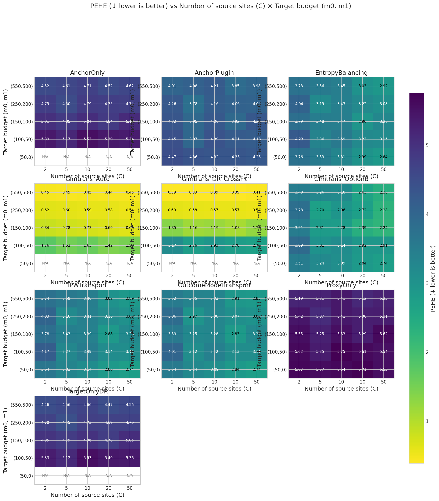

# Fair DGP: Source sites × Target budget heatmap (C × 1000 samples each)

**Benchmark ID:** `gold_fair_sources_sweep`

**Generated:** 2026-02-06 15:50

---

## 1. Motivation

**Research Question:** How do the number of source sites and target sample size jointly affect transfer learning performance?

**Why This Matters:**
This 2D grid explores the interaction between:
1. **Source site count (C):** More sites = more diverse source information
   - Each site contributes 1000 samples (fixed per-site budget)
   - Total source data scales linearly: n_total = C × 1000
2. **Target budget (m₀, m₁):** More target data → less need for transfer
   - m₀ = m₁ + 50 (staggered: always 50 more placebo than treated)
   - Includes m₁=0 case (placebo-only target) to test Option B methods

**Key Question:**
How does the value of adding more source sites change as target data grows?
- With small target: expect large benefit from more sources
- With large target: expect diminishing returns from sources

**Key Grid:**
- C ∈ {2, 5, 10, 20, 50} source sites (each with 1000 samples)
- Target budgets: (50,0), (100,50), (150,100), (250,200), (550,500)
- Dimension: p = 50 (fixed)
- Total: 5 × 5 = 25 scenarios

---

## 2. Simulation Setup

**Fair DGP with Variable Source Sites × Target Budget:**

Uses standard synthetic DGP with fair settings:
- **Covariates:** X ~ N(0, I_50) (p = 50 fixed)
- **Treatment:** A ~ Bernoulli(e(X)) with logistic propensity
- **Outcome:** Y = μ_A(X) + ε with heterogeneous effects
- **Transfer:** Controlled nontransfer component (SNR ≈ 3-4)
- **Sites:** Variable C with 1000 samples each
- **Overlap:** AUC ≈ 0.75 (moderate, not extreme)
- **Target:** Variable budget with m₀ = m₁ + 50 stagger

### Swept Parameters (Varied Across Scenarios)

| Parameter | Values | Description |
|-----------|--------|-------------|
| **C_sources** | `[2, 5, 10, 20, 50]` | Number of source sites (K) |
| **m1** | `[0, 50, 100, 200, 500]` | Target treated sample size (n₁). If 0, only Option B methods are feasible. |

### Coupled Parameters (Derived from Swept)

| Parameter | Coupling | Description |
|-----------|----------|-------------|
| **n_proxy_total** | `= ('C_sources', '*', 1000)` | Total source/proxy observations across all sites |
| **m0** | `= ('m1', 50)` | Target placebo/control sample size (n₀) |

### Fixed Parameters (Held Constant)

| Parameter | Value | Description |
|-----------|-------|-------------|
| p_dim | `50` | Covariate dimension (d). Higher d = harder estimation. |
| nontransfer_scale | `0.1` | Scale of non-transferable component (σᵥ). Higher = less transfer benefit. |
| use_fair_dgp | `True` | Parameter: use_fair_dgp |
| overlap_lambda | `0.25` | Covariate distribution divergence (0=identical, 1=disjoint) |
| intercept_drift_scale | `0.5` | Scale of arm-specific intercept drift across sites |

### Experimental Design Summary

- **Sweep type:** `2d`
- **Number of swept parameters:** 2
- **Number of coupled parameters:** 2
- **Number of fixed parameters:** 5
- **Total unique scenarios:** 25

---

## 3. Metrics & Interpretation

| Metric | Direction | Description |
|--------|-----------|-------------|
| **PEHE (Precision in Estimating Heterogeneous Effects)** | ↓ lower is better | Root mean squared error of CATE predictions. Measures how accurately the estimat... |
| **ATE Absolute Error** | ↓ lower is better | Absolute difference between estimated and true average treatment effect.... |
| **ATE Bias (Signed)** | ↑ closer to 0 is better | Signed bias in ATE estimate. Positive = overestimate, negative = underestimate.... |
| **Spearman Rank Correlation** | ↑ higher is better | Rank correlation between predicted and true treatment effects.... |
| **Kendall Rank Correlation** | ↑ higher is better | Kendall tau-b correlation. More robust to ties than Spearman.... |
| **Qini AUC (Oracle)** | ↑ higher is better | Area under the Qini curve. Measures ranking quality for treatment targeting.... |
| **Top-10% Uplift Capture Ratio** | ↑ higher is better | Fraction of maximum uplift captured when treating top 10% by predicted CATE.... |
| **Top-20% Uplift Capture Ratio** | ↑ higher is better | Fraction of maximum uplift captured when treating top 20% by predicted CATE.... |
| **Top-30% Uplift Capture Ratio** | ↑ higher is better | Fraction of maximum uplift captured when treating top 30%.... |
| **Calibration Slope** | ↑ closer to 1 is better | Slope of regression of true τ on predicted τ̂. Ideal = 1.0.... |
| **Calibration R²** | ↑ higher is better | Variance explained by predictions. Measures calibration quality.... |
| **CATE ECE (Expected Calibration Error)** | ↓ lower is better | Expected calibration error for CATE. Binned average miscalibration.... |
| **Policy Value (Treat if τ̂ > 0)** | ↑ higher is better | Expected outcome under threshold-based treatment policy.... |
| **Policy Regret vs Oracle** | ↓ lower is better | Gap between oracle policy value and estimated policy value.... |
| **Policy Value (Treat Top 20%)** | ↑ higher is better | Expected outcome when treating top 20% by predicted CATE.... |
| **Policy Regret (Top 20% Budget)** | ↓ lower is better | Regret compared to oracle top-20% policy.... |
| **μ₀ RMSE (Control Outcome)** | ↓ lower is better | RMSE of predicted control outcomes. Measures nuisance estimation quality.... |

### Detailed Metric Definitions

**PEHE (Precision in Estimating Heterogeneous Effects)**

- Formula: $\sqrt{\frac{1}{n}\sum_i (\hat{\tau}(x_i) - \tau(x_i))^2}$
- Direction: **lower is better**
- A PEHE of 0.5 means predictions are off by 0.5 units on average.

**ATE Absolute Error**

- Formula: $|\hat{\text{ATE}} - \text{ATE}|$
- Direction: **lower is better**
- Important for policy decisions about whether to adopt treatment broadly.

**ATE Bias (Signed)**

- Formula: $\hat{\text{ATE}} - \text{ATE}$
- Direction: **closer to 0 is better**
- Shows systematic over/under-estimation tendencies.

**Spearman Rank Correlation**

- Formula: $\rho(\text{rank}(\hat{\tau}), \text{rank}(\tau))$
- Direction: **higher is better**
- 1.0 = perfect ranking, 0.0 = random. Critical for targeting interventions.

**Kendall Rank Correlation**

- Formula: $\tau_K(\hat{\tau}, \tau)$
- Direction: **higher is better**
- Alternative ranking metric; useful when ties are common.

**Qini AUC (Oracle)**

- Formula: Normalized AUC of cumulative uplift curve
- Direction: **higher is better**
- 1.0 = oracle ranking, 0.0 = random. Simulation-only metric using true τ.

**Top-10% Uplift Capture Ratio**

- Formula: $\frac{\bar{\tau}_{top10\%\ by\ \hat{\tau}}}{\bar{\tau}_{top10\%\ by\ \tau}}$
- Direction: **higher is better**
- 1.0 = oracle selection. Measures targeting efficiency for top patients.

**Top-20% Uplift Capture Ratio**

- Formula: $\frac{\bar{\tau}_{top20\%\ by\ \hat{\tau}}}{\bar{\tau}_{top20\%\ by\ \tau}}$
- Direction: **higher is better**
- 1.0 = oracle selection. Less stringent than top-10%.

**Top-30% Uplift Capture Ratio**

- Formula: $\frac{\bar{\tau}_{top30\%\ by\ \hat{\tau}}}{\bar{\tau}_{top30\%\ by\ \tau}}$
- Direction: **higher is better**
- Less stringent targeting metric.

**Calibration Slope**

- Formula: $\beta$ in $\tau = \alpha + \beta \hat{\tau}$
- Direction: **closer to 1 is better**
- <1 = overconfident predictions, >1 = underconfident.

**Calibration R²**

- Formula: $R^2$ of calibration regression
- Direction: **higher is better**
- Higher R² means predictions track true effects well.

**CATE ECE (Expected Calibration Error)**

- Formula: $\sum_b \frac{n_b}{n} |E[\tau | \hat{\tau} \in b] - E[\hat{\tau} | \hat{\tau} \in b]|$
- Direction: **lower is better**
- Lower ECE means better calibration across prediction ranges.

**Policy Value (Treat if τ̂ > 0)**

- Formula: $E[\mu_0 + \pi(\hat{\tau}) \cdot \tau]$ where $\pi(\hat{\tau}) = 1\{\hat{\tau} > 0\}$
- Direction: **higher is better**
- Higher value = better treatment decisions based on predictions.

**Policy Regret vs Oracle**

- Formula: $V(\pi^*) - V(\hat{\pi})$
- Direction: **lower is better**
- Lower regret = closer to optimal treatment decisions.

**Policy Value (Treat Top 20%)**

- Formula: $E[\mu_0 + \pi_{top20\%}(\hat{\tau}) \cdot \tau]$
- Direction: **higher is better**
- Budget-constrained policy evaluation.

**Policy Regret (Top 20% Budget)**

- Formula: $V(\pi^*_{top20\%}) - V(\hat{\pi}_{top20\%})$
- Direction: **lower is better**
- Budget-constrained regret.

**μ₀ RMSE (Control Outcome)**

- Formula: $\sqrt{\frac{1}{n}\sum_i (\hat{\mu}_0(x_i) - \mu_0(x_i))^2}$
- Direction: **lower is better**
- Important diagnostic; poor μ₀ estimation can propagate to CATE errors.

---

## 4. Methods Compared

### 4.1 Method Summary Table

| Method | Category | Target Placebo | Target Treated | Source | Description |
|--------|----------|----------------|----------------|--------|-------------|
| **TargetOnlyDR** | Baseline | ✓ | ✓ | ✗ | Target-only DR learner (no transfer) |
| **ProxyOnly** | Baseline | ✗ | ✗ | ✓ | Source-only proxy (no target correction) |
| **Glmtrans_Auto** | Transfer Learning | ✓ | ✓ | ✓ | glmtrans with auto source detection |
| **Glmtrans_DR_CrossFit** | Transfer Learning | ✓ | ✓ | ✓ | glmtrans with CROSS-FITTED DR (RECOMMENDED) |
| **Glmtrans_OptionB** | Transfer Learning | ✓ | ✗ | ✓ | Option B: glmtrans source detection + Source-DR CATE |
| **AnchorOnly** | Anchor | ✓ | ✓ | ✓ | Placebo-anchored with DR (needs target treated) |
| **AnchorPlugin** | Anchor | ✓ | ✗ | ✓ | Placebo-anchored plug-in (no DR) |
| **IPWTransport** | Transport | ✓ | ✗ | ✓ | IPW-weighted outcome models |
| **EntropyBalancing** | Transport | ✓ | ✗ | ✓ | Entropy balancing weights |
| **OutcomeModelTransport** | Transport | ✓ | ✗ | ✓ | Unweighted outcome models |

### 4.2 Method Implementation Details

#### TargetOnlyDR

**Category:** Baseline

**Description:** Target-only DR learner (no transfer)

**Data Requirements:** Target placebo (A=0), Target treated (A=1)

**Pseudo-code:**
```
1. Fit μ̂₀(x) on target controls: (X_target[A=0], Y_target[A=0])
2. Fit μ̂₁(x) on target treated: (X_target[A=1], Y_target[A=1])
3. Compute DR pseudo-outcomes on target:
   Γᵢ = (Aᵢ/ê)(Yᵢ - μ̂₁(Xᵢ)) + μ̂₁(Xᵢ) - ((1-Aᵢ)/(1-ê))(Yᵢ - μ̂₀(Xᵢ)) - μ̂₀(Xᵢ)
4. Fit τ̂(x) on (X_target, Γ) using Lasso
```

**Reference:** Kennedy (2020) - Doubly Robust Learner

---

#### ProxyOnly

**Category:** Baseline

**Description:** Source-only proxy (no target correction)

**Data Requirements:** Source data

**Pseudo-code:**
```
1. Pool all source data by treatment arm
2. Fit μ̂₀^src(x) on source controls
3. Fit μ̂₁^src(x) on source treated
4. Predict: τ̂(x) = μ̂₁^src(x) - μ̂₀^src(x)
```

**Reference:** Naive source pooling baseline

---

#### Glmtrans_Auto

**Category:** Transfer Learning

**Description:** glmtrans with auto source detection

**Data Requirements:** Target placebo (A=0), Target treated (A=1), Source data

**Pseudo-code:**
```
For each outcome model (μ₀ and μ₁):
  1. SOURCE DETECTION: Identify transferable sources
     - Fit target-only model, compute CV loss L_target
     - For each source k: compute loss L_k
     - Source k transferable if L_k ≤ C₀ · L_target
  2. TRANSFER STEP: Pool transferable sources
     - Fit elastic-net on pooled source data → ŵ_A
  3. DEBIAS STEP: Correct on target
     - Compute residuals: r = Y_target - X_target · ŵ_A
     - Fit elastic-net on residuals → δ̂_A
  4. FINAL: β̂ = ŵ_A + δ̂_A

CATE: τ̂(x) = μ̂₁(x) - μ̂₀(x)
```

**Reference:** Tian & Feng (2023) JASA

---

#### Glmtrans_DR_CrossFit

**Category:** Transfer Learning

**Description:** glmtrans with CROSS-FITTED DR (RECOMMENDED)

**Data Requirements:** Target placebo (A=0), Target treated (A=1), Source data

**Pseudo-code:**
```
For k = 1, ..., K folds:
  1. Split target into train (fold ≠ k) and test (fold = k)
  2. Fit glmtrans on train target + ALL sources
  3. Get OUT-OF-FOLD predictions μ̂₀[test], μ̂₁[test]
  4. Fit ridge logistic propensity on train target
  5. Get OUT-OF-FOLD ê[test]

After cross-fitting:
  6. Clip propensities: ê_clipped = clip(ê, 0.05, 0.95)
  7. Compute DR pseudo-outcomes (using OOF estimates):
     Γᵢ = μ̂₁(Xᵢ) - μ̂₀(Xᵢ) + (Aᵢ-ê)/(ê(1-ê)) · residual
  8. Fit τ̂(x) on (X_target, Γ) using Lasso

Diagnostics:
  - Var(Γ) / Var(μ̂₁-μ̂₀): If >> 1, DR is hurting
  - Max inverse weight: If > 20, weights are unstable
```

**Reference:** Advisor-recommended cross-fitted DR construction

---

#### Glmtrans_OptionB

**Category:** Transfer Learning

**Description:** Option B: glmtrans source detection + Source-DR CATE

**Data Requirements:** Target placebo (A=0), Source data

**Pseudo-code:**
```
Stage 0 (Source Detection - Control Arm ONLY):
  # This is the ONLY place glmtrans theory applies
  1. Target placebo: (X_t, Y_t(0))
  2. Source controls: [(X_sk[A=0], Y_sk(0)) for k in 1..K]
  3. Run glmtrans(target, sources, family="gaussian", transfer.source.id="auto")
  4. Return selected sources: Ŝ₀ ⊂ {1,...,K}
  # Uses ONLY Y_target(0) - exactly as glmtrans was designed

Stage 1 (Restrict to Selected Sources - NO WEIGHTING):
  # Simply subset. No soft selection, no importance weighting.
  D_src^good = ∪_{k ∈ Ŝ₀} D_k

Stage 2 (Source-DR CATE):
  # DR learning happens WHERE IDENTIFICATION HOLDS: on sources
  1. Fit μ̂₀^src on X_good[A=0], Y_good[A=0]
  2. Fit μ̂₁^src on X_good[A=1], Y_good[A=1]  
  3. ê = mean(A) on selected sources
  4. DR pseudo-outcomes on SOURCES:
     Γᵢ = μ̂₁(Xᵢ) - μ̂₀(Xᵢ) + (Aᵢ-ê)/(ê(1-ê)) · (Yᵢ - μ̂_{Aᵢ}(Xᵢ))
  5. Fit τ̂^src(x) = E[Γ|X=x] on source pseudo-outcomes

Stage 3 (Transport to Target):
  # Direct transport - relies on structural similarity encoded by Ŝ₀
  τ̂_target(x) := τ̂^src(x)
  # No further correction (we have no target treated data)

VALID FOR: Placebo-only target (m₁=0)
IDENTIFICATION: Via transferable source selection + DR on sources
```

**Reference:** Advisor construction based on Tian & Feng (2023) JASA

---

#### AnchorOnly

**Category:** Anchor

**Description:** Placebo-anchored with DR (needs target treated)

**Data Requirements:** Target placebo (A=0), Target treated (A=1), Source data

**Pseudo-code:**
```
1. Fit source proxy: μ̂₀^src(x) on pooled source controls
2. Compute residuals on target placebo: δ̂₀(x) = Y - μ̂₀^src(X)
3. Fit correction: δ̂₀(x) using Lasso on target placebo residuals
4. Corrected μ̂₀(x) = μ̂₀^src(x) + δ̂₀(x)
5. Fit μ̂₁(x) directly on target treated
6. DR pseudo-outcomes + CATE model
```

**Reference:** Placebo-anchored transfer

---

#### AnchorPlugin

**Category:** Anchor

**Description:** Placebo-anchored plug-in (no DR)

**Data Requirements:** Target placebo (A=0), Source data

**Pseudo-code:**
```
1. Fit source proxy: μ̂₀^src(x), μ̂₁^src(x)
2. Compute residuals on target placebo
3. Fit correction δ̂₀(x) on residuals
4. Plug-in: τ̂(x) = μ̂₁^src(x) - (μ̂₀^src(x) + δ̂₀(x))
   (No DR pseudo-outcomes, no target treated needed)
```

**Reference:** Plug-in variant of anchor

---

#### IPWTransport

**Category:** Transport

**Description:** IPW-weighted outcome models

**Data Requirements:** Target placebo (A=0), Source data

**Pseudo-code:**
```
1. Estimate site membership: P(S=target|X)
2. Compute IPW weights: w(x) = P(S=target|X) / P(S=source|X)
3. Fit weighted outcome models on source:
   μ̂ₐ = argmin Σᵢ wᵢ·(Yᵢ - μ(Xᵢ))²
4. Predict: τ̂(x) = μ̂₁(x) - μ̂₀(x)
```

**Reference:** Hong et al. - IPW transport

---

#### EntropyBalancing

**Category:** Transport

**Description:** Entropy balancing weights

**Data Requirements:** Target placebo (A=0), Source data

**Pseudo-code:**
```
1. Find weights w that balance source to target:
   Σᵢ wᵢ·Xᵢ = X̄_target (moment matching)
   max Σᵢ wᵢ·log(wᵢ) (max entropy)
2. Fit weighted outcome models
3. Predict: τ̂(x) = μ̂₁(x) - μ̂₀(x)
```

**Reference:** Hainmueller (2012)

---

#### OutcomeModelTransport

**Category:** Transport

**Description:** Unweighted outcome models

**Data Requirements:** Target placebo (A=0), Source data

**Pseudo-code:**
```
1. Fit outcome models on source (unweighted):
   μ̂ₐ^src on (X_source[A=a], Y_source[A=a])
2. Predict on target: τ̂(x) = μ̂₁^src(x) - μ̂₀^src(x)
   (Assumes outcome model generalizes across sites)
```

**Reference:** Baseline - no reweighting

---

---

## 5. Experiment Summary

- **Sweep parameter:** `C_sources` ∈ [2, 5, 10, 20, 50]
- **Monte Carlo replicates:** 100 per scenario
- **Methods evaluated:** 10
- **Total runs:** 25000

---

## 6. Results

### Best Methods (averaged across sweep)

| Metric | Best Method | Value | Direction |
|--------|-------------|-------|----------|
| PEHE | **Glmtrans_DR_CrossFit** | 0.3872 | ↓ lower |
| ATE Error | **Glmtrans_Auto** | 0.0274 | ↓ lower |
| Spearman ρ | **Glmtrans_DR_CrossFit** | 0.9971 | ↑ higher |
| Kendall τ | **Glmtrans_DR_CrossFit** | 0.9596 | ↑ higher |
| Qini AUC | **Glmtrans_DR_CrossFit** | 0.9974 | ↑ higher |
| Top-10% Ratio | **Glmtrans_DR_CrossFit** | 0.9974 | ↑ higher |
| Top-20% Ratio | **Glmtrans_DR_CrossFit** | 0.9974 | ↑ higher |
| Calibration R² | **Glmtrans_DR_CrossFit** | 0.9948 | ↑ higher |
| CATE ECE | **Glmtrans_DR_CrossFit** | 0.0543 | ↓ lower |
| Policy Value | **Glmtrans_Auto** | 2.5428 | ↑ higher |
| Policy Regret | **Glmtrans_DR_CrossFit** | 0.0053 | ↓ lower |

### Core Metrics

| m0 | m1 | Method | PEHE (↓) | ATE Err (↓) | Spearman (↑) | Qini (↑) |
|---|---|---|---|---|---|
| 50 | 0 | AnchorOnly | N/A | N/A | N/A | N/A |
| 50 | 0 | AnchorOnly | N/A | N/A | N/A | N/A |
| 50 | 0 | AnchorOnly | N/A | N/A | N/A | N/A |
| 50 | 0 | AnchorOnly | N/A | N/A | N/A | N/A |
| 50 | 0 | AnchorOnly | N/A | N/A | N/A | N/A |
| 50 | 0 | AnchorPlugin | 4.470 ± 1.019 | 0.841 ± 0.657 | 0.647 ± 0.106 | 0.663 ± 0.106 |
| 50 | 0 | AnchorPlugin | 4.325 ± 0.967 | 0.948 ± 0.652 | 0.682 ± 0.089 | 0.699 ± 0.089 |
| 50 | 0 | AnchorPlugin | 4.319 ± 0.962 | 0.886 ± 0.739 | 0.668 ± 0.113 | 0.683 ± 0.112 |
| 50 | 0 | AnchorPlugin | 4.248 ± 0.897 | 0.850 ± 0.703 | 0.672 ± 0.082 | 0.689 ± 0.080 |
| 50 | 0 | AnchorPlugin | 4.356 ± 0.983 | 0.876 ± 0.681 | 0.654 ± 0.112 | 0.670 ± 0.110 |
| 50 | 0 | EntropyBalancing | 3.761 ± 1.452 | 0.817 ± 0.634 | 0.774 ± 0.150 | 0.787 ± 0.147 |
| 50 | 0 | EntropyBalancing | 2.989 ± 1.157 | 0.825 ± 0.635 | 0.858 ± 0.089 | 0.868 ± 0.086 |
| 50 | 0 | EntropyBalancing | 3.314 ± 1.239 | 0.874 ± 0.640 | 0.819 ± 0.115 | 0.831 ± 0.110 |
| 50 | 0 | EntropyBalancing | 2.840 ± 1.161 | 0.778 ± 0.569 | 0.862 ± 0.094 | 0.872 ± 0.090 |
| 50 | 0 | EntropyBalancing | 3.527 ± 1.471 | 0.901 ± 0.692 | 0.790 ± 0.152 | 0.802 ± 0.149 |
| 50 | 0 | Glmtrans_Auto | N/A | N/A | N/A | N/A |
| 50 | 0 | Glmtrans_Auto | N/A | N/A | N/A | N/A |
| 50 | 0 | Glmtrans_Auto | N/A | N/A | N/A | N/A |
| 50 | 0 | Glmtrans_Auto | N/A | N/A | N/A | N/A |
| 50 | 0 | Glmtrans_Auto | N/A | N/A | N/A | N/A |
| 50 | 0 | Glmtrans_DR_CrossFit | N/A | N/A | N/A | N/A |
| 50 | 0 | Glmtrans_DR_CrossFit | N/A | N/A | N/A | N/A |
| 50 | 0 | Glmtrans_DR_CrossFit | N/A | N/A | N/A | N/A |
| 50 | 0 | Glmtrans_DR_CrossFit | N/A | N/A | N/A | N/A |
| 50 | 0 | Glmtrans_DR_CrossFit | N/A | N/A | N/A | N/A |
| 50 | 0 | Glmtrans_OptionB | 3.507 ± 1.469 | 0.790 ± 0.638 | 0.796 ± 0.151 | 0.808 ± 0.147 |
| 50 | 0 | Glmtrans_OptionB | 2.845 ± 1.191 | 0.817 ± 0.631 | 0.872 ± 0.091 | 0.881 ± 0.087 |
| 50 | 0 | Glmtrans_OptionB | 3.092 ± 1.300 | 0.860 ± 0.630 | 0.838 ± 0.115 | 0.849 ± 0.110 |
| 50 | 0 | Glmtrans_OptionB | 2.739 ± 1.172 | 0.770 ± 0.585 | 0.871 ± 0.091 | 0.881 ± 0.086 |
| 50 | 0 | Glmtrans_OptionB | 3.236 ± 1.460 | 0.885 ± 0.665 | 0.816 ± 0.147 | 0.827 ± 0.143 |
| 50 | 0 | IPWTransport | 3.639 ± 1.446 | 0.793 ± 0.630 | 0.785 ± 0.150 | 0.797 ± 0.146 |
| 50 | 0 | IPWTransport | 2.862 ± 1.189 | 0.828 ± 0.643 | 0.870 ± 0.091 | 0.880 ± 0.087 |
| 50 | 0 | IPWTransport | 3.137 ± 1.289 | 0.857 ± 0.647 | 0.835 ± 0.115 | 0.845 ± 0.110 |
| 50 | 0 | IPWTransport | 2.743 ± 1.170 | 0.777 ± 0.579 | 0.871 ± 0.091 | 0.880 ± 0.086 |
| 50 | 0 | IPWTransport | 3.331 ± 1.451 | 0.909 ± 0.695 | 0.808 ± 0.147 | 0.820 ± 0.143 |
| 50 | 0 | OutcomeModelTransport | 3.540 ± 1.448 | 0.791 ± 0.642 | 0.794 ± 0.150 | 0.806 ± 0.146 |
| 50 | 0 | OutcomeModelTransport | 2.845 ± 1.191 | 0.815 ± 0.631 | 0.872 ± 0.091 | 0.881 ± 0.087 |
| 50 | 0 | OutcomeModelTransport | 3.094 ± 1.302 | 0.861 ± 0.632 | 0.838 ± 0.115 | 0.848 ± 0.110 |
| 50 | 0 | OutcomeModelTransport | 2.740 ± 1.171 | 0.770 ± 0.584 | 0.871 ± 0.091 | 0.881 ± 0.086 |
| 50 | 0 | OutcomeModelTransport | 3.244 ± 1.464 | 0.887 ± 0.665 | 0.816 ± 0.147 | 0.827 ± 0.143 |
| 50 | 0 | ProxyOnly | 5.667 ± 1.050 | 1.287 ± 1.045 | 0.335 ± 0.093 | 0.348 ± 0.096 |
| 50 | 0 | ProxyOnly | 5.715 ± 0.959 | 1.325 ± 0.992 | 0.323 ± 0.108 | 0.336 ± 0.112 |
| 50 | 0 | ProxyOnly | 5.637 ± 0.902 | 1.326 ± 1.090 | 0.331 ± 0.111 | 0.343 ± 0.113 |
| 50 | 0 | ProxyOnly | 5.546 ± 0.846 | 1.245 ± 0.892 | 0.328 ± 0.102 | 0.341 ± 0.105 |
| 50 | 0 | ProxyOnly | 5.568 ± 0.875 | 1.288 ± 0.916 | 0.329 ± 0.098 | 0.341 ± 0.100 |
| 50 | 0 | TargetOnlyDR | N/A | N/A | N/A | N/A |
| 50 | 0 | TargetOnlyDR | N/A | N/A | N/A | N/A |
| 50 | 0 | TargetOnlyDR | N/A | N/A | N/A | N/A |
| 50 | 0 | TargetOnlyDR | N/A | N/A | N/A | N/A |
| 50 | 0 | TargetOnlyDR | N/A | N/A | N/A | N/A |
| 100 | 50 | AnchorOnly | 5.390 ± 1.003 | 0.541 ± 0.459 | 0.464 ± 0.083 | 0.481 ± 0.085 |
| 100 | 50 | AnchorOnly | 5.166 ± 1.032 | 0.526 ± 0.360 | 0.487 ± 0.094 | 0.504 ± 0.095 |
| 100 | 50 | AnchorOnly | 5.394 ± 1.038 | 0.579 ± 0.427 | 0.491 ± 0.090 | 0.507 ± 0.091 |
| 100 | 50 | AnchorOnly | 5.336 ± 1.214 | 0.541 ± 0.430 | 0.486 ± 0.094 | 0.502 ± 0.094 |
| 100 | 50 | AnchorOnly | 5.534 ± 1.295 | 0.551 ± 0.413 | 0.478 ± 0.088 | 0.495 ± 0.090 |
| 100 | 50 | AnchorPlugin | 4.449 ± 1.213 | 1.017 ± 0.847 | 0.674 ± 0.114 | 0.691 ± 0.113 |
| 100 | 50 | AnchorPlugin | 3.966 ± 1.040 | 0.866 ± 0.698 | 0.726 ± 0.108 | 0.741 ± 0.106 |
| 100 | 50 | AnchorPlugin | 4.208 ± 1.138 | 0.938 ± 0.732 | 0.717 ± 0.101 | 0.732 ± 0.099 |
| 100 | 50 | AnchorPlugin | 4.180 ± 1.410 | 0.841 ± 0.773 | 0.712 ± 0.115 | 0.727 ± 0.113 |
| 100 | 50 | AnchorPlugin | 4.388 ± 1.417 | 1.007 ± 0.869 | 0.711 ± 0.111 | 0.726 ± 0.110 |
| 100 | 50 | EntropyBalancing | 4.225 ± 1.868 | 1.138 ± 0.958 | 0.732 ± 0.186 | 0.746 ± 0.182 |
| 100 | 50 | EntropyBalancing | 3.360 ± 1.384 | 0.901 ± 0.727 | 0.815 ± 0.129 | 0.827 ± 0.125 |
| 100 | 50 | EntropyBalancing | 3.230 ± 1.409 | 0.799 ± 0.638 | 0.834 ± 0.119 | 0.844 ± 0.115 |
| 100 | 50 | EntropyBalancing | 3.165 ± 1.737 | 0.855 ± 0.769 | 0.839 ± 0.136 | 0.849 ± 0.131 |
| 100 | 50 | EntropyBalancing | 3.586 ± 1.745 | 0.991 ± 0.822 | 0.812 ± 0.140 | 0.824 ± 0.135 |
| 100 | 50 | Glmtrans_Auto | 1.761 ± 0.721 | 0.208 ± 0.173 | 0.944 ± 0.046 | 0.949 ± 0.042 |
| 100 | 50 | Glmtrans_Auto | 1.524 ± 0.698 | 0.178 ± 0.149 | 0.956 ± 0.041 | 0.960 ± 0.038 |
| 100 | 50 | Glmtrans_Auto | 1.424 ± 0.613 | 0.146 ± 0.135 | 0.966 ± 0.030 | 0.969 ± 0.028 |
| 100 | 50 | Glmtrans_Auto | 1.497 ± 0.796 | 0.175 ± 0.139 | 0.962 ± 0.036 | 0.966 ± 0.033 |
| 100 | 50 | Glmtrans_Auto | 1.631 ± 0.837 | 0.242 ± 0.255 | 0.958 ± 0.039 | 0.961 ± 0.037 |
| 100 | 50 | Glmtrans_DR_CrossFit | 3.168 ± 1.250 | 0.400 ± 0.439 | 0.821 ± 0.143 | 0.832 ± 0.140 |
| 100 | 50 | Glmtrans_DR_CrossFit | 2.756 ± 1.113 | 0.368 ± 0.364 | 0.862 ± 0.094 | 0.872 ± 0.090 |
| 100 | 50 | Glmtrans_DR_CrossFit | 2.776 ± 1.364 | 0.293 ± 0.438 | 0.880 ± 0.085 | 0.889 ± 0.081 |
| 100 | 50 | Glmtrans_DR_CrossFit | 2.702 ± 1.397 | 0.294 ± 0.278 | 0.885 ± 0.079 | 0.885 ± 0.116 |
| 100 | 50 | Glmtrans_DR_CrossFit | 2.931 ± 1.419 | 0.354 ± 0.367 | 0.870 ± 0.099 | 0.871 ± 0.128 |
| 100 | 50 | Glmtrans_OptionB | 3.890 ± 1.946 | 1.086 ± 0.915 | 0.761 ± 0.194 | 0.774 ± 0.189 |
| 100 | 50 | Glmtrans_OptionB | 3.013 ± 1.374 | 0.866 ± 0.702 | 0.849 ± 0.121 | 0.858 ± 0.117 |
| 100 | 50 | Glmtrans_OptionB | 2.917 ± 1.278 | 0.771 ± 0.592 | 0.865 ± 0.104 | 0.874 ± 0.100 |
| 100 | 50 | Glmtrans_OptionB | 2.909 ± 1.671 | 0.801 ± 0.738 | 0.866 ± 0.122 | 0.875 ± 0.117 |
| 100 | 50 | Glmtrans_OptionB | 3.144 ± 1.624 | 0.910 ± 0.804 | 0.857 ± 0.117 | 0.866 ± 0.112 |
| 100 | 50 | IPWTransport | 4.170 ± 1.875 | 1.134 ± 0.950 | 0.737 ± 0.186 | 0.750 ± 0.182 |
| 100 | 50 | IPWTransport | 3.271 ± 1.403 | 0.904 ± 0.735 | 0.823 ± 0.129 | 0.834 ± 0.126 |
| 100 | 50 | IPWTransport | 3.143 ± 1.415 | 0.811 ± 0.633 | 0.843 ± 0.117 | 0.853 ± 0.113 |
| 100 | 50 | IPWTransport | 3.114 ± 1.767 | 0.856 ± 0.776 | 0.844 ± 0.139 | 0.854 ± 0.134 |
| 100 | 50 | IPWTransport | 3.490 ± 1.771 | 0.996 ± 0.832 | 0.822 ± 0.139 | 0.833 ± 0.134 |
| 100 | 50 | OutcomeModelTransport | 4.012 ± 1.932 | 1.115 ± 0.933 | 0.751 ± 0.190 | 0.764 ± 0.186 |
| 100 | 50 | OutcomeModelTransport | 3.116 ± 1.444 | 0.891 ± 0.733 | 0.837 ± 0.132 | 0.847 ± 0.129 |
| 100 | 50 | OutcomeModelTransport | 3.128 ± 1.419 | 0.819 ± 0.653 | 0.845 ± 0.116 | 0.855 ± 0.112 |
| 100 | 50 | OutcomeModelTransport | 3.115 ± 1.771 | 0.858 ± 0.784 | 0.844 ± 0.139 | 0.854 ± 0.134 |
| 100 | 50 | OutcomeModelTransport | 3.424 ± 1.749 | 1.007 ± 0.817 | 0.830 ± 0.134 | 0.840 ± 0.130 |
| 100 | 50 | ProxyOnly | 5.618 ± 1.056 | 1.157 ± 0.971 | 0.408 ± 0.100 | 0.424 ± 0.100 |
| 100 | 50 | ProxyOnly | 5.346 ± 0.918 | 0.998 ± 0.721 | 0.432 ± 0.109 | 0.448 ± 0.111 |
| 100 | 50 | ProxyOnly | 5.608 ± 1.060 | 1.052 ± 0.836 | 0.420 ± 0.106 | 0.435 ± 0.108 |
| 100 | 50 | ProxyOnly | 5.542 ± 1.279 | 1.005 ± 0.894 | 0.428 ± 0.105 | 0.445 ± 0.107 |
| 100 | 50 | ProxyOnly | 5.753 ± 1.301 | 1.157 ± 0.924 | 0.431 ± 0.100 | 0.447 ± 0.102 |
| 100 | 50 | TargetOnlyDR | 5.333 ± 0.919 | 0.492 ± 0.409 | 0.472 ± 0.078 | 0.489 ± 0.080 |
| 100 | 50 | TargetOnlyDR | 5.118 ± 0.950 | 0.495 ± 0.396 | 0.489 ± 0.090 | 0.506 ± 0.091 |
| 100 | 50 | TargetOnlyDR | 5.398 ± 1.008 | 0.532 ± 0.408 | 0.473 ± 0.084 | 0.489 ± 0.084 |
| 100 | 50 | TargetOnlyDR | 5.355 ± 1.186 | 0.568 ± 0.445 | 0.469 ± 0.090 | 0.486 ± 0.091 |
| 100 | 50 | TargetOnlyDR | 5.528 ± 1.202 | 0.594 ± 0.424 | 0.470 ± 0.084 | 0.486 ± 0.086 |
| 150 | 100 | AnchorOnly | 5.096 ± 1.245 | 0.380 ± 0.288 | 0.585 ± 0.068 | 0.603 ± 0.068 |
| 150 | 100 | AnchorOnly | 5.014 ± 1.264 | 0.379 ± 0.331 | 0.588 ± 0.062 | 0.605 ± 0.061 |
| 150 | 100 | AnchorOnly | 5.041 ± 0.847 | 0.340 ± 0.290 | 0.590 ± 0.066 | 0.607 ± 0.066 |
| 150 | 100 | AnchorOnly | 4.837 ± 0.805 | 0.367 ± 0.275 | 0.580 ± 0.066 | 0.598 ± 0.064 |
| 150 | 100 | AnchorOnly | 4.847 ± 1.043 | 0.360 ± 0.293 | 0.587 ± 0.070 | 0.604 ± 0.069 |
| 150 | 100 | AnchorPlugin | 4.271 ± 1.618 | 0.883 ± 0.890 | 0.714 ± 0.112 | 0.729 ± 0.111 |
| 150 | 100 | AnchorPlugin | 4.316 ± 1.439 | 0.890 ± 0.800 | 0.700 ± 0.112 | 0.716 ± 0.111 |
| 150 | 100 | AnchorPlugin | 4.263 ± 1.107 | 1.002 ± 0.861 | 0.716 ± 0.105 | 0.731 ± 0.102 |
| 150 | 100 | AnchorPlugin | 3.919 ± 1.079 | 0.799 ± 0.714 | 0.733 ± 0.094 | 0.748 ± 0.092 |
| 150 | 100 | AnchorPlugin | 3.948 ± 1.256 | 0.820 ± 0.711 | 0.728 ± 0.109 | 0.743 ± 0.107 |
| 150 | 100 | EntropyBalancing | 3.276 ± 1.941 | 0.878 ± 0.870 | 0.837 ± 0.129 | 0.848 ± 0.125 |
| 150 | 100 | EntropyBalancing | 3.791 ± 1.848 | 0.881 ± 0.642 | 0.782 ± 0.162 | 0.795 ± 0.159 |
| 150 | 100 | EntropyBalancing | 3.466 ± 1.381 | 1.047 ± 0.766 | 0.817 ± 0.125 | 0.829 ± 0.120 |
| 150 | 100 | EntropyBalancing | 2.964 ± 1.364 | 0.757 ± 0.592 | 0.849 ± 0.111 | 0.859 ± 0.107 |
| 150 | 100 | EntropyBalancing | 3.482 ± 1.518 | 0.936 ± 0.768 | 0.803 ± 0.139 | 0.814 ± 0.135 |
| 150 | 100 | Glmtrans_Auto | 0.656 ± 0.154 | 0.082 ± 0.071 | 0.993 ± 0.003 | 0.994 ± 0.003 |
| 150 | 100 | Glmtrans_Auto | 0.845 ± 0.163 | 0.084 ± 0.073 | 0.989 ± 0.005 | 0.990 ± 0.004 |
| 150 | 100 | Glmtrans_Auto | 0.726 ± 0.178 | 0.079 ± 0.067 | 0.992 ± 0.005 | 0.993 ± 0.005 |
| 150 | 100 | Glmtrans_Auto | 0.694 ± 0.162 | 0.079 ± 0.065 | 0.992 ± 0.005 | 0.992 ± 0.004 |
| 150 | 100 | Glmtrans_Auto | 0.779 ± 0.160 | 0.080 ± 0.059 | 0.989 ± 0.005 | 0.991 ± 0.005 |
| 150 | 100 | Glmtrans_DR_CrossFit | 1.260 ± 0.571 | 0.137 ± 0.115 | 0.976 ± 0.013 | 0.979 ± 0.012 |
| 150 | 100 | Glmtrans_DR_CrossFit | 1.354 ± 0.543 | 0.155 ± 0.136 | 0.970 ± 0.021 | 0.973 ± 0.020 |
| 150 | 100 | Glmtrans_DR_CrossFit | 1.191 ± 0.390 | 0.132 ± 0.103 | 0.978 ± 0.012 | 0.980 ± 0.011 |
| 150 | 100 | Glmtrans_DR_CrossFit | 1.084 ± 0.306 | 0.130 ± 0.104 | 0.979 ± 0.012 | 0.981 ± 0.011 |
| 150 | 100 | Glmtrans_DR_CrossFit | 1.157 ± 0.342 | 0.152 ± 0.122 | 0.977 ± 0.010 | 0.980 ± 0.009 |
| 150 | 100 | Glmtrans_OptionB | 2.244 ± 1.609 | 0.691 ± 0.672 | 0.925 ± 0.095 | 0.930 ± 0.092 |
| 150 | 100 | Glmtrans_OptionB | 3.506 ± 1.892 | 0.914 ± 0.696 | 0.809 ± 0.168 | 0.820 ± 0.165 |
| 150 | 100 | Glmtrans_OptionB | 2.783 ± 1.314 | 0.893 ± 0.633 | 0.880 ± 0.116 | 0.888 ± 0.111 |
| 150 | 100 | Glmtrans_OptionB | 2.391 ± 1.212 | 0.681 ± 0.505 | 0.902 ± 0.090 | 0.909 ± 0.086 |
| 150 | 100 | Glmtrans_OptionB | 2.815 ± 1.433 | 0.815 ± 0.658 | 0.869 ± 0.114 | 0.877 ± 0.110 |
| 150 | 100 | IPWTransport | 3.231 ± 1.970 | 0.883 ± 0.882 | 0.842 ± 0.132 | 0.852 ± 0.127 |
| 150 | 100 | IPWTransport | 3.784 ± 1.851 | 0.881 ± 0.643 | 0.783 ± 0.162 | 0.795 ± 0.160 |
| 150 | 100 | IPWTransport | 3.395 ± 1.388 | 1.048 ± 0.768 | 0.825 ± 0.124 | 0.836 ± 0.119 |
| 150 | 100 | IPWTransport | 2.878 ± 1.383 | 0.757 ± 0.601 | 0.857 ± 0.111 | 0.867 ± 0.106 |
| 150 | 100 | IPWTransport | 3.434 ± 1.524 | 0.942 ± 0.769 | 0.808 ± 0.137 | 0.819 ± 0.133 |
| 150 | 100 | OutcomeModelTransport | 3.224 ± 1.971 | 0.873 ± 0.870 | 0.842 ± 0.132 | 0.852 ± 0.128 |
| 150 | 100 | OutcomeModelTransport | 3.593 ± 1.893 | 0.879 ± 0.658 | 0.801 ± 0.166 | 0.812 ± 0.163 |
| 150 | 100 | OutcomeModelTransport | 3.280 ± 1.418 | 1.017 ± 0.744 | 0.835 ± 0.123 | 0.845 ± 0.118 |
| 150 | 100 | OutcomeModelTransport | 2.832 ± 1.390 | 0.751 ± 0.571 | 0.861 ± 0.110 | 0.870 ± 0.106 |
| 150 | 100 | OutcomeModelTransport | 3.246 ± 1.577 | 0.911 ± 0.736 | 0.824 ± 0.138 | 0.835 ± 0.134 |
| 150 | 100 | ProxyOnly | 5.619 ± 1.503 | 1.157 ± 1.007 | 0.446 ± 0.119 | 0.462 ± 0.120 |
| 150 | 100 | ProxyOnly | 5.549 ± 1.369 | 1.081 ± 0.959 | 0.451 ± 0.103 | 0.467 ± 0.104 |
| 150 | 100 | ProxyOnly | 5.532 ± 0.944 | 1.128 ± 0.913 | 0.467 ± 0.089 | 0.482 ± 0.090 |
| 150 | 100 | ProxyOnly | 5.292 ± 0.966 | 1.040 ± 0.840 | 0.455 ± 0.089 | 0.472 ± 0.090 |
| 150 | 100 | ProxyOnly | 5.251 ± 1.123 | 0.919 ± 0.791 | 0.463 ± 0.087 | 0.479 ± 0.089 |
| 150 | 100 | TargetOnlyDR | 5.048 ± 1.177 | 0.386 ± 0.306 | 0.582 ± 0.055 | 0.600 ± 0.055 |
| 150 | 100 | TargetOnlyDR | 4.948 ± 1.179 | 0.397 ± 0.352 | 0.595 ± 0.061 | 0.612 ± 0.060 |
| 150 | 100 | TargetOnlyDR | 4.963 ± 0.814 | 0.362 ± 0.271 | 0.594 ± 0.059 | 0.610 ± 0.058 |
| 150 | 100 | TargetOnlyDR | 4.782 ± 0.768 | 0.368 ± 0.310 | 0.588 ± 0.060 | 0.606 ± 0.059 |
| 150 | 100 | TargetOnlyDR | 4.790 ± 0.957 | 0.355 ± 0.284 | 0.589 ± 0.059 | 0.606 ± 0.059 |
| 250 | 200 | AnchorOnly | 4.795 ± 0.807 | 0.270 ± 0.199 | 0.647 ± 0.045 | 0.665 ± 0.045 |
| 250 | 200 | AnchorOnly | 4.749 ± 0.906 | 0.265 ± 0.212 | 0.639 ± 0.047 | 0.657 ± 0.046 |
| 250 | 200 | AnchorOnly | 4.497 ± 0.763 | 0.237 ± 0.191 | 0.654 ± 0.055 | 0.671 ± 0.054 |
| 250 | 200 | AnchorOnly | 4.752 ± 0.777 | 0.303 ± 0.230 | 0.647 ± 0.044 | 0.664 ± 0.043 |
| 250 | 200 | AnchorOnly | 4.741 ± 0.923 | 0.268 ± 0.214 | 0.638 ± 0.051 | 0.656 ± 0.051 |
| 250 | 200 | AnchorPlugin | 4.165 ± 1.334 | 0.887 ± 0.818 | 0.718 ± 0.123 | 0.733 ± 0.122 |
| 250 | 200 | AnchorPlugin | 4.062 ± 1.290 | 0.988 ± 0.938 | 0.733 ± 0.100 | 0.748 ± 0.098 |
| 250 | 200 | AnchorPlugin | 3.781 ± 1.019 | 0.860 ± 0.692 | 0.743 ± 0.091 | 0.758 ± 0.090 |
| 250 | 200 | AnchorPlugin | 4.259 ± 1.251 | 0.926 ± 0.929 | 0.701 ± 0.121 | 0.716 ± 0.120 |
| 250 | 200 | AnchorPlugin | 4.039 ± 1.205 | 0.747 ± 0.648 | 0.722 ± 0.097 | 0.737 ± 0.096 |
| 250 | 200 | EntropyBalancing | 3.429 ± 1.706 | 1.007 ± 0.858 | 0.815 ± 0.144 | 0.826 ± 0.140 |
| 250 | 200 | EntropyBalancing | 3.221 ± 1.486 | 0.988 ± 0.827 | 0.838 ± 0.114 | 0.849 ± 0.109 |
| 250 | 200 | EntropyBalancing | 3.185 ± 1.479 | 0.894 ± 0.852 | 0.828 ± 0.130 | 0.838 ± 0.126 |
| 250 | 200 | EntropyBalancing | 4.035 ± 1.943 | 1.126 ± 0.971 | 0.753 ± 0.190 | 0.765 ± 0.187 |
| 250 | 200 | EntropyBalancing | 3.076 ± 1.464 | 0.808 ± 0.587 | 0.843 ± 0.115 | 0.854 ± 0.110 |
| 250 | 200 | Glmtrans_Auto | 0.586 ± 0.122 | 0.046 ± 0.035 | 0.995 ± 0.003 | 0.995 ± 0.003 |
| 250 | 200 | Glmtrans_Auto | 0.583 ± 0.141 | 0.048 ± 0.038 | 0.995 ± 0.003 | 0.995 ± 0.003 |
| 250 | 200 | Glmtrans_Auto | 0.597 ± 0.118 | 0.048 ± 0.039 | 0.994 ± 0.003 | 0.995 ± 0.003 |
| 250 | 200 | Glmtrans_Auto | 0.620 ± 0.123 | 0.046 ± 0.034 | 0.994 ± 0.003 | 0.995 ± 0.003 |
| 250 | 200 | Glmtrans_Auto | 0.540 ± 0.110 | 0.054 ± 0.041 | 0.995 ± 0.003 | 0.996 ± 0.003 |
| 250 | 200 | Glmtrans_DR_CrossFit | 0.574 ± 0.128 | 0.055 ± 0.036 | 0.994 ± 0.004 | 0.995 ± 0.003 |
| 250 | 200 | Glmtrans_DR_CrossFit | 0.567 ± 0.139 | 0.051 ± 0.040 | 0.994 ± 0.004 | 0.995 ± 0.003 |
| 250 | 200 | Glmtrans_DR_CrossFit | 0.576 ± 0.119 | 0.048 ± 0.037 | 0.994 ± 0.003 | 0.994 ± 0.003 |
| 250 | 200 | Glmtrans_DR_CrossFit | 0.597 ± 0.122 | 0.056 ± 0.037 | 0.994 ± 0.003 | 0.995 ± 0.003 |
| 250 | 200 | Glmtrans_DR_CrossFit | 0.535 ± 0.116 | 0.056 ± 0.043 | 0.995 ± 0.003 | 0.995 ± 0.003 |
| 250 | 200 | Glmtrans_OptionB | 2.964 ± 1.712 | 0.949 ± 0.790 | 0.859 ± 0.138 | 0.867 ± 0.134 |
| 250 | 200 | Glmtrans_OptionB | 2.717 ± 1.554 | 0.914 ± 0.848 | 0.883 ± 0.109 | 0.891 ± 0.103 |
| 250 | 200 | Glmtrans_OptionB | 2.703 ± 1.536 | 0.843 ± 0.809 | 0.870 ± 0.129 | 0.878 ± 0.125 |
| 250 | 200 | Glmtrans_OptionB | 3.783 ± 1.888 | 1.129 ± 0.884 | 0.776 ± 0.190 | 0.787 ± 0.186 |
| 250 | 200 | Glmtrans_OptionB | 2.284 ± 1.441 | 0.736 ± 0.561 | 0.910 ± 0.106 | 0.916 ± 0.101 |
| 250 | 200 | IPWTransport | 3.407 ± 1.710 | 1.008 ± 0.867 | 0.817 ± 0.143 | 0.828 ± 0.140 |
| 250 | 200 | IPWTransport | 3.163 ± 1.508 | 0.991 ± 0.829 | 0.843 ± 0.115 | 0.854 ± 0.109 |
| 250 | 200 | IPWTransport | 3.179 ± 1.481 | 0.903 ± 0.849 | 0.829 ± 0.131 | 0.839 ± 0.127 |
| 250 | 200 | IPWTransport | 4.026 ± 1.937 | 1.122 ± 0.968 | 0.754 ± 0.190 | 0.766 ± 0.186 |
| 250 | 200 | IPWTransport | 3.034 ± 1.485 | 0.806 ± 0.589 | 0.847 ± 0.115 | 0.857 ± 0.110 |
| 250 | 200 | OutcomeModelTransport | 3.298 ± 1.709 | 1.003 ± 0.813 | 0.828 ± 0.140 | 0.838 ± 0.136 |
| 250 | 200 | OutcomeModelTransport | 3.071 ± 1.551 | 0.975 ± 0.843 | 0.851 ± 0.117 | 0.861 ± 0.112 |
| 250 | 200 | OutcomeModelTransport | 2.971 ± 1.505 | 0.868 ± 0.857 | 0.846 ± 0.129 | 0.855 ± 0.125 |
| 250 | 200 | OutcomeModelTransport | 3.859 ± 1.933 | 1.120 ± 0.974 | 0.768 ± 0.192 | 0.780 ± 0.189 |
| 250 | 200 | OutcomeModelTransport | 3.026 ± 1.497 | 0.811 ± 0.578 | 0.847 ± 0.116 | 0.858 ± 0.111 |
| 250 | 200 | ProxyOnly | 5.406 ± 1.063 | 1.029 ± 0.819 | 0.487 ± 0.102 | 0.504 ± 0.104 |
| 250 | 200 | ProxyOnly | 5.300 ± 1.182 | 1.076 ± 1.000 | 0.504 ± 0.088 | 0.522 ± 0.089 |
| 250 | 200 | ProxyOnly | 5.068 ± 0.914 | 1.049 ± 0.866 | 0.499 ± 0.093 | 0.516 ± 0.094 |
| 250 | 200 | ProxyOnly | 5.419 ± 1.161 | 1.200 ± 1.196 | 0.486 ± 0.098 | 0.502 ± 0.099 |
| 250 | 200 | ProxyOnly | 5.315 ± 1.088 | 1.021 ± 0.844 | 0.485 ± 0.097 | 0.502 ± 0.099 |
| 250 | 200 | TargetOnlyDR | 4.734 ± 0.778 | 0.262 ± 0.221 | 0.661 ± 0.045 | 0.678 ± 0.045 |
| 250 | 200 | TargetOnlyDR | 4.690 ± 0.862 | 0.260 ± 0.219 | 0.651 ± 0.044 | 0.668 ± 0.044 |
| 250 | 200 | TargetOnlyDR | 4.446 ± 0.699 | 0.269 ± 0.193 | 0.660 ± 0.054 | 0.677 ± 0.052 |
| 250 | 200 | TargetOnlyDR | 4.699 ± 0.750 | 0.310 ± 0.239 | 0.660 ± 0.047 | 0.677 ± 0.046 |
| 250 | 200 | TargetOnlyDR | 4.695 ± 0.890 | 0.272 ± 0.232 | 0.646 ± 0.053 | 0.663 ± 0.052 |
| 550 | 500 | AnchorOnly | 4.521 ± 0.942 | 0.205 ± 0.143 | 0.666 ± 0.047 | 0.684 ± 0.046 |
| 550 | 500 | AnchorOnly | 4.612 ± 0.868 | 0.210 ± 0.148 | 0.659 ± 0.041 | 0.677 ± 0.040 |
| 550 | 500 | AnchorOnly | 4.516 ± 0.835 | 0.152 ± 0.124 | 0.668 ± 0.038 | 0.686 ± 0.038 |
| 550 | 500 | AnchorOnly | 4.619 ± 0.780 | 0.202 ± 0.152 | 0.668 ± 0.041 | 0.685 ± 0.039 |
| 550 | 500 | AnchorOnly | 4.714 ± 0.941 | 0.217 ± 0.189 | 0.664 ± 0.038 | 0.681 ± 0.037 |
| 550 | 500 | AnchorPlugin | 4.009 ± 1.325 | 0.819 ± 0.670 | 0.715 ± 0.136 | 0.730 ± 0.136 |
| 550 | 500 | AnchorPlugin | 4.079 ± 1.273 | 0.930 ± 0.797 | 0.722 ± 0.105 | 0.737 ± 0.104 |
| 550 | 500 | AnchorPlugin | 3.852 ± 1.158 | 0.824 ± 0.587 | 0.743 ± 0.105 | 0.758 ± 0.102 |
| 550 | 500 | AnchorPlugin | 3.977 ± 1.202 | 0.858 ± 0.698 | 0.733 ± 0.127 | 0.748 ± 0.126 |
| 550 | 500 | AnchorPlugin | 4.212 ± 1.564 | 1.008 ± 0.970 | 0.726 ± 0.122 | 0.740 ± 0.120 |
| 550 | 500 | EntropyBalancing | 3.732 ± 1.978 | 0.794 ± 0.658 | 0.769 ± 0.204 | 0.781 ± 0.203 |
| 550 | 500 | EntropyBalancing | 3.562 ± 1.738 | 1.019 ± 1.035 | 0.802 ± 0.151 | 0.814 ± 0.148 |
| 550 | 500 | EntropyBalancing | 3.028 ± 1.554 | 0.799 ± 0.583 | 0.840 ± 0.133 | 0.850 ± 0.129 |
| 550 | 500 | EntropyBalancing | 2.919 ± 1.476 | 0.818 ± 0.627 | 0.857 ± 0.134 | 0.866 ± 0.131 |
| 550 | 500 | EntropyBalancing | 3.454 ± 1.807 | 0.967 ± 0.756 | 0.818 ± 0.144 | 0.828 ± 0.141 |
| 550 | 500 | Glmtrans_Auto | 0.452 ± 0.111 | 0.034 ± 0.026 | 0.997 ± 0.002 | 0.997 ± 0.002 |
| 550 | 500 | Glmtrans_Auto | 0.448 ± 0.122 | 0.037 ± 0.027 | 0.997 ± 0.003 | 0.997 ± 0.002 |
| 550 | 500 | Glmtrans_Auto | 0.435 ± 0.097 | 0.031 ± 0.023 | 0.997 ± 0.002 | 0.997 ± 0.002 |
| 550 | 500 | Glmtrans_Auto | 0.448 ± 0.161 | 0.027 ± 0.025 | 0.996 ± 0.004 | 0.997 ± 0.003 |
| 550 | 500 | Glmtrans_Auto | 0.451 ± 0.144 | 0.031 ± 0.024 | 0.997 ± 0.003 | 0.997 ± 0.003 |
| 550 | 500 | Glmtrans_DR_CrossFit | 0.394 ± 0.117 | 0.037 ± 0.027 | 0.997 ± 0.002 | 0.997 ± 0.002 |
| 550 | 500 | Glmtrans_DR_CrossFit | 0.389 ± 0.129 | 0.037 ± 0.026 | 0.997 ± 0.003 | 0.997 ± 0.002 |
| 550 | 500 | Glmtrans_DR_CrossFit | 0.387 ± 0.106 | 0.031 ± 0.027 | 0.997 ± 0.002 | 0.997 ± 0.002 |
| 550 | 500 | Glmtrans_DR_CrossFit | 0.410 ± 0.164 | 0.029 ± 0.025 | 0.997 ± 0.003 | 0.997 ± 0.003 |
| 550 | 500 | Glmtrans_DR_CrossFit | 0.394 ± 0.152 | 0.033 ± 0.024 | 0.997 ± 0.003 | 0.997 ± 0.003 |
| 550 | 500 | Glmtrans_OptionB | 3.478 ± 2.003 | 0.784 ± 0.670 | 0.787 ± 0.206 | 0.798 ± 0.204 |
| 550 | 500 | Glmtrans_OptionB | 3.263 ± 1.775 | 1.024 ± 0.998 | 0.830 ± 0.153 | 0.840 ± 0.149 |
| 550 | 500 | Glmtrans_OptionB | 2.630 ± 1.530 | 0.749 ± 0.581 | 0.876 ± 0.125 | 0.884 ± 0.122 |
| 550 | 500 | Glmtrans_OptionB | 2.384 ± 1.508 | 0.724 ± 0.604 | 0.898 ± 0.136 | 0.904 ± 0.132 |
| 550 | 500 | Glmtrans_OptionB | 3.179 ± 1.849 | 0.919 ± 0.793 | 0.843 ± 0.148 | 0.852 ± 0.144 |
| 550 | 500 | IPWTransport | 3.744 ± 1.975 | 0.791 ± 0.659 | 0.768 ± 0.203 | 0.780 ± 0.202 |
| 550 | 500 | IPWTransport | 3.587 ± 1.735 | 1.016 ± 1.040 | 0.800 ± 0.151 | 0.811 ± 0.148 |
| 550 | 500 | IPWTransport | 3.020 ± 1.559 | 0.798 ± 0.587 | 0.841 ± 0.133 | 0.850 ± 0.129 |
| 550 | 500 | IPWTransport | 2.893 ± 1.483 | 0.823 ± 0.629 | 0.860 ± 0.134 | 0.869 ± 0.130 |
| 550 | 500 | IPWTransport | 3.455 ± 1.804 | 0.965 ± 0.754 | 0.818 ± 0.144 | 0.828 ± 0.140 |
| 550 | 500 | OutcomeModelTransport | 3.516 ± 1.982 | 0.803 ± 0.669 | 0.786 ± 0.205 | 0.797 ± 0.203 |
| 550 | 500 | OutcomeModelTransport | 3.348 ± 1.753 | 1.021 ± 0.993 | 0.821 ± 0.151 | 0.832 ± 0.147 |
| 550 | 500 | OutcomeModelTransport | 2.913 ± 1.581 | 0.796 ± 0.567 | 0.851 ± 0.131 | 0.860 ± 0.128 |
| 550 | 500 | OutcomeModelTransport | 2.849 ± 1.497 | 0.800 ± 0.625 | 0.863 ± 0.133 | 0.872 ± 0.129 |
| 550 | 500 | OutcomeModelTransport | 3.331 ± 1.868 | 0.988 ± 0.776 | 0.830 ± 0.147 | 0.839 ± 0.144 |
| 550 | 500 | ProxyOnly | 5.191 ± 1.221 | 1.127 ± 0.936 | 0.490 ± 0.119 | 0.507 ± 0.122 |
| 550 | 500 | ProxyOnly | 5.209 ± 1.093 | 1.135 ± 0.770 | 0.517 ± 0.095 | 0.534 ± 0.096 |
| 550 | 500 | ProxyOnly | 5.125 ± 1.003 | 1.087 ± 0.775 | 0.520 ± 0.096 | 0.538 ± 0.097 |
| 550 | 500 | ProxyOnly | 5.253 ± 1.021 | 1.169 ± 0.924 | 0.521 ± 0.120 | 0.538 ± 0.121 |
| 550 | 500 | ProxyOnly | 5.411 ± 1.372 | 1.195 ± 1.021 | 0.513 ± 0.114 | 0.529 ± 0.116 |
| 550 | 500 | TargetOnlyDR | 4.461 ± 0.911 | 0.207 ± 0.145 | 0.681 ± 0.045 | 0.698 ± 0.044 |
| 550 | 500 | TargetOnlyDR | 4.561 ± 0.859 | 0.227 ± 0.163 | 0.673 ± 0.041 | 0.690 ± 0.040 |
| 550 | 500 | TargetOnlyDR | 4.467 ± 0.827 | 0.160 ± 0.133 | 0.679 ± 0.040 | 0.696 ± 0.039 |
| 550 | 500 | TargetOnlyDR | 4.563 ± 0.766 | 0.215 ± 0.165 | 0.681 ± 0.044 | 0.698 ± 0.043 |
| 550 | 500 | TargetOnlyDR | 4.660 ± 0.930 | 0.205 ± 0.166 | 0.675 ± 0.041 | 0.692 ± 0.039 |

### Targeting / Ranking Metrics

| m0 | m1 | Method | Top-10% (↑) | Top-20% (↑) | Kendall (↑) |
|---|---|---|---|---|---|
| 50 | 0 | AnchorOnly | N/A | N/A | N/A |
| 50 | 0 | AnchorOnly | N/A | N/A | N/A |
| 50 | 0 | AnchorOnly | N/A | N/A | N/A |
| 50 | 0 | AnchorOnly | N/A | N/A | N/A |
| 50 | 0 | AnchorOnly | N/A | N/A | N/A |
| 50 | 0 | AnchorPlugin | 0.653 ± 0.117 | 0.648 ± 0.130 | 0.467 ± 0.085 |
| 50 | 0 | AnchorPlugin | 0.685 ± 0.128 | 0.682 ± 0.137 | 0.497 ± 0.077 |
| 50 | 0 | AnchorPlugin | 0.657 ± 0.145 | 0.647 ± 0.153 | 0.487 ± 0.095 |
| 50 | 0 | AnchorPlugin | 0.691 ± 0.103 | 0.684 ± 0.112 | 0.487 ± 0.070 |
| 50 | 0 | AnchorPlugin | 0.656 ± 0.123 | 0.645 ± 0.131 | 0.474 ± 0.093 |
| 50 | 0 | EntropyBalancing | 0.781 ± 0.160 | 0.776 ± 0.159 | 0.597 ± 0.144 |
| 50 | 0 | EntropyBalancing | 0.861 ± 0.095 | 0.858 ± 0.103 | 0.685 ± 0.104 |
| 50 | 0 | EntropyBalancing | 0.812 ± 0.134 | 0.806 ± 0.144 | 0.643 ± 0.126 |
| 50 | 0 | EntropyBalancing | 0.870 ± 0.097 | 0.871 ± 0.099 | 0.692 ± 0.114 |
| 50 | 0 | EntropyBalancing | 0.795 ± 0.154 | 0.788 ± 0.158 | 0.617 ± 0.152 |
| 50 | 0 | Glmtrans_Auto | N/A | N/A | N/A |
| 50 | 0 | Glmtrans_Auto | N/A | N/A | N/A |
| 50 | 0 | Glmtrans_Auto | N/A | N/A | N/A |
| 50 | 0 | Glmtrans_Auto | N/A | N/A | N/A |
| 50 | 0 | Glmtrans_Auto | N/A | N/A | N/A |
| 50 | 0 | Glmtrans_DR_CrossFit | N/A | N/A | N/A |
| 50 | 0 | Glmtrans_DR_CrossFit | N/A | N/A | N/A |
| 50 | 0 | Glmtrans_DR_CrossFit | N/A | N/A | N/A |
| 50 | 0 | Glmtrans_DR_CrossFit | N/A | N/A | N/A |
| 50 | 0 | Glmtrans_DR_CrossFit | N/A | N/A | N/A |
| 50 | 0 | Glmtrans_OptionB | 0.800 ± 0.161 | 0.796 ± 0.160 | 0.622 ± 0.150 |
| 50 | 0 | Glmtrans_OptionB | 0.877 ± 0.093 | 0.872 ± 0.103 | 0.703 ± 0.109 |
| 50 | 0 | Glmtrans_OptionB | 0.832 ± 0.131 | 0.826 ± 0.140 | 0.668 ± 0.134 |
| 50 | 0 | Glmtrans_OptionB | 0.877 ± 0.095 | 0.878 ± 0.099 | 0.705 ± 0.116 |
| 50 | 0 | Glmtrans_OptionB | 0.820 ± 0.149 | 0.816 ± 0.152 | 0.647 ± 0.154 |
| 50 | 0 | IPWTransport | 0.792 ± 0.157 | 0.787 ± 0.158 | 0.609 ± 0.145 |
| 50 | 0 | IPWTransport | 0.875 ± 0.095 | 0.871 ± 0.103 | 0.702 ± 0.109 |
| 50 | 0 | IPWTransport | 0.828 ± 0.133 | 0.822 ± 0.141 | 0.663 ± 0.132 |
| 50 | 0 | IPWTransport | 0.877 ± 0.095 | 0.878 ± 0.098 | 0.705 ± 0.116 |
| 50 | 0 | IPWTransport | 0.815 ± 0.144 | 0.809 ± 0.150 | 0.638 ± 0.152 |
| 50 | 0 | OutcomeModelTransport | 0.798 ± 0.159 | 0.794 ± 0.158 | 0.619 ± 0.148 |
| 50 | 0 | OutcomeModelTransport | 0.877 ± 0.094 | 0.872 ± 0.103 | 0.703 ± 0.109 |
| 50 | 0 | OutcomeModelTransport | 0.832 ± 0.131 | 0.826 ± 0.140 | 0.668 ± 0.134 |
| 50 | 0 | OutcomeModelTransport | 0.877 ± 0.095 | 0.878 ± 0.099 | 0.705 ± 0.116 |
| 50 | 0 | OutcomeModelTransport | 0.820 ± 0.150 | 0.816 ± 0.152 | 0.647 ± 0.154 |
| 50 | 0 | ProxyOnly | 0.324 ± 0.141 | 0.313 ± 0.165 | 0.228 ± 0.065 |
| 50 | 0 | ProxyOnly | 0.305 ± 0.205 | 0.292 ± 0.248 | 0.219 ± 0.076 |
| 50 | 0 | ProxyOnly | 0.290 ± 0.174 | 0.275 ± 0.209 | 0.226 ± 0.078 |
| 50 | 0 | ProxyOnly | 0.349 ± 0.164 | 0.346 ± 0.177 | 0.223 ± 0.071 |
| 50 | 0 | ProxyOnly | 0.316 ± 0.146 | 0.291 ± 0.179 | 0.223 ± 0.068 |
| 50 | 0 | TargetOnlyDR | N/A | N/A | N/A |
| 50 | 0 | TargetOnlyDR | N/A | N/A | N/A |
| 50 | 0 | TargetOnlyDR | N/A | N/A | N/A |
| 50 | 0 | TargetOnlyDR | N/A | N/A | N/A |
| 50 | 0 | TargetOnlyDR | N/A | N/A | N/A |
| 100 | 50 | AnchorOnly | 0.455 ± 0.123 | 0.475 ± 0.122 | 0.322 ± 0.061 |
| 100 | 50 | AnchorOnly | 0.465 ± 0.146 | 0.484 ± 0.154 | 0.340 ± 0.070 |
| 100 | 50 | AnchorOnly | 0.458 ± 0.151 | 0.475 ± 0.155 | 0.342 ± 0.067 |
| 100 | 50 | AnchorOnly | 0.458 ± 0.145 | 0.474 ± 0.148 | 0.338 ± 0.069 |
| 100 | 50 | AnchorOnly | 0.445 ± 0.156 | 0.451 ± 0.258 | 0.332 ± 0.065 |
| 100 | 50 | AnchorPlugin | 0.695 ± 0.122 | 0.697 ± 0.121 | 0.492 ± 0.097 |
| 100 | 50 | AnchorPlugin | 0.732 ± 0.126 | 0.733 ± 0.126 | 0.540 ± 0.097 |
| 100 | 50 | AnchorPlugin | 0.724 ± 0.105 | 0.723 ± 0.107 | 0.530 ± 0.088 |
| 100 | 50 | AnchorPlugin | 0.722 ± 0.121 | 0.717 ± 0.131 | 0.526 ± 0.099 |
| 100 | 50 | AnchorPlugin | 0.711 ± 0.146 | 0.702 ± 0.216 | 0.525 ± 0.094 |
| 100 | 50 | EntropyBalancing | 0.751 ± 0.186 | 0.749 ± 0.186 | 0.563 ± 0.176 |
| 100 | 50 | EntropyBalancing | 0.827 ± 0.131 | 0.824 ± 0.133 | 0.640 ± 0.134 |
| 100 | 50 | EntropyBalancing | 0.841 ± 0.114 | 0.843 ± 0.107 | 0.662 ± 0.131 |
| 100 | 50 | EntropyBalancing | 0.848 ± 0.129 | 0.847 ± 0.129 | 0.674 ± 0.149 |
| 100 | 50 | EntropyBalancing | 0.813 ± 0.161 | 0.803 ± 0.208 | 0.639 ± 0.142 |
| 100 | 50 | Glmtrans_Auto | 0.951 ± 0.039 | 0.949 ± 0.042 | 0.809 ± 0.077 |
| 100 | 50 | Glmtrans_Auto | 0.961 ± 0.037 | 0.961 ± 0.037 | 0.834 ± 0.071 |
| 100 | 50 | Glmtrans_Auto | 0.968 ± 0.028 | 0.969 ± 0.026 | 0.851 ± 0.055 |
| 100 | 50 | Glmtrans_Auto | 0.966 ± 0.031 | 0.964 ± 0.035 | 0.846 ± 0.066 |
| 100 | 50 | Glmtrans_Auto | 0.959 ± 0.042 | 0.958 ± 0.042 | 0.836 ± 0.069 |
| 100 | 50 | Glmtrans_DR_CrossFit | 0.834 ± 0.139 | 0.834 ± 0.138 | 0.649 ± 0.142 |
| 100 | 50 | Glmtrans_DR_CrossFit | 0.874 ± 0.091 | 0.874 ± 0.088 | 0.691 ± 0.110 |
| 100 | 50 | Glmtrans_DR_CrossFit | 0.880 ± 0.097 | 0.882 ± 0.096 | 0.712 ± 0.102 |
| 100 | 50 | Glmtrans_DR_CrossFit | 0.883 ± 0.110 | 0.883 ± 0.113 | 0.719 ± 0.100 |
| 100 | 50 | Glmtrans_DR_CrossFit | 0.868 ± 0.134 | 0.863 ± 0.140 | 0.703 ± 0.113 |
| 100 | 50 | Glmtrans_OptionB | 0.779 ± 0.190 | 0.776 ± 0.194 | 0.599 ± 0.191 |
| 100 | 50 | Glmtrans_OptionB | 0.858 ± 0.124 | 0.861 ± 0.119 | 0.681 ± 0.136 |
| 100 | 50 | Glmtrans_OptionB | 0.872 ± 0.099 | 0.870 ± 0.097 | 0.700 ± 0.124 |
| 100 | 50 | Glmtrans_OptionB | 0.873 ± 0.117 | 0.872 ± 0.118 | 0.707 ± 0.141 |
| 100 | 50 | Glmtrans_OptionB | 0.858 ± 0.128 | 0.851 ± 0.143 | 0.692 ± 0.135 |
| 100 | 50 | IPWTransport | 0.755 ± 0.187 | 0.754 ± 0.187 | 0.568 ± 0.178 |
| 100 | 50 | IPWTransport | 0.832 ± 0.133 | 0.833 ± 0.134 | 0.651 ± 0.137 |
| 100 | 50 | IPWTransport | 0.851 ± 0.109 | 0.851 ± 0.106 | 0.673 ± 0.131 |
| 100 | 50 | IPWTransport | 0.851 ± 0.136 | 0.849 ± 0.133 | 0.682 ± 0.154 |
| 100 | 50 | IPWTransport | 0.823 ± 0.157 | 0.814 ± 0.194 | 0.652 ± 0.145 |
| 100 | 50 | OutcomeModelTransport | 0.771 ± 0.185 | 0.767 ± 0.188 | 0.586 ± 0.187 |
| 100 | 50 | OutcomeModelTransport | 0.844 ± 0.141 | 0.847 ± 0.137 | 0.669 ± 0.144 |
| 100 | 50 | OutcomeModelTransport | 0.854 ± 0.109 | 0.852 ± 0.107 | 0.675 ± 0.131 |
| 100 | 50 | OutcomeModelTransport | 0.852 ± 0.134 | 0.849 ± 0.134 | 0.682 ± 0.155 |
| 100 | 50 | OutcomeModelTransport | 0.833 ± 0.146 | 0.826 ± 0.160 | 0.661 ± 0.145 |
| 100 | 50 | ProxyOnly | 0.427 ± 0.127 | 0.428 ± 0.136 | 0.280 ± 0.071 |
| 100 | 50 | ProxyOnly | 0.443 ± 0.155 | 0.439 ± 0.183 | 0.298 ± 0.079 |
| 100 | 50 | ProxyOnly | 0.425 ± 0.142 | 0.412 ± 0.169 | 0.289 ± 0.076 |
| 100 | 50 | ProxyOnly | 0.431 ± 0.142 | 0.425 ± 0.157 | 0.295 ± 0.076 |
| 100 | 50 | ProxyOnly | 0.424 ± 0.161 | 0.401 ± 0.301 | 0.297 ± 0.072 |
| 100 | 50 | TargetOnlyDR | 0.468 ± 0.115 | 0.487 ± 0.115 | 0.327 ± 0.058 |
| 100 | 50 | TargetOnlyDR | 0.481 ± 0.141 | 0.494 ± 0.144 | 0.340 ± 0.067 |
| 100 | 50 | TargetOnlyDR | 0.440 ± 0.154 | 0.462 ± 0.160 | 0.328 ± 0.062 |
| 100 | 50 | TargetOnlyDR | 0.438 ± 0.148 | 0.452 ± 0.160 | 0.326 ± 0.066 |
| 100 | 50 | TargetOnlyDR | 0.436 ± 0.157 | 0.436 ± 0.284 | 0.326 ± 0.062 |
| 150 | 100 | AnchorOnly | 0.578 ± 0.112 | 0.591 ± 0.129 | 0.414 ± 0.054 |
| 150 | 100 | AnchorOnly | 0.584 ± 0.087 | 0.589 ± 0.100 | 0.416 ± 0.049 |
| 150 | 100 | AnchorOnly | 0.571 ± 0.109 | 0.579 ± 0.118 | 0.418 ± 0.052 |
| 150 | 100 | AnchorOnly | 0.577 ± 0.110 | 0.587 ± 0.116 | 0.410 ± 0.051 |
| 150 | 100 | AnchorOnly | 0.575 ± 0.108 | 0.598 ± 0.114 | 0.416 ± 0.055 |
| 150 | 100 | AnchorPlugin | 0.728 ± 0.119 | 0.724 ± 0.126 | 0.527 ± 0.096 |
| 150 | 100 | AnchorPlugin | 0.706 ± 0.122 | 0.707 ± 0.127 | 0.515 ± 0.096 |
| 150 | 100 | AnchorPlugin | 0.720 ± 0.116 | 0.714 ± 0.127 | 0.529 ± 0.094 |
| 150 | 100 | AnchorPlugin | 0.743 ± 0.113 | 0.739 ± 0.123 | 0.544 ± 0.085 |
| 150 | 100 | AnchorPlugin | 0.745 ± 0.110 | 0.746 ± 0.112 | 0.541 ± 0.096 |
| 150 | 100 | EntropyBalancing | 0.847 ± 0.119 | 0.846 ± 0.127 | 0.670 ± 0.143 |
| 150 | 100 | EntropyBalancing | 0.795 ± 0.165 | 0.791 ± 0.164 | 0.609 ± 0.156 |
| 150 | 100 | EntropyBalancing | 0.822 ± 0.132 | 0.819 ± 0.139 | 0.643 ± 0.134 |
| 150 | 100 | EntropyBalancing | 0.854 ± 0.123 | 0.853 ± 0.129 | 0.680 ± 0.128 |
| 150 | 100 | EntropyBalancing | 0.815 ± 0.137 | 0.814 ± 0.136 | 0.627 ± 0.140 |
| 150 | 100 | Glmtrans_Auto | 0.994 ± 0.004 | 0.994 ± 0.004 | 0.933 ± 0.016 |
| 150 | 100 | Glmtrans_Auto | 0.990 ± 0.006 | 0.990 ± 0.005 | 0.912 ± 0.018 |
| 150 | 100 | Glmtrans_Auto | 0.992 ± 0.005 | 0.992 ± 0.005 | 0.926 ± 0.018 |
| 150 | 100 | Glmtrans_Auto | 0.992 ± 0.005 | 0.992 ± 0.005 | 0.925 ± 0.020 |
| 150 | 100 | Glmtrans_Auto | 0.991 ± 0.006 | 0.990 ± 0.006 | 0.916 ± 0.020 |
| 150 | 100 | Glmtrans_DR_CrossFit | 0.979 ± 0.012 | 0.978 ± 0.013 | 0.873 ± 0.035 |
| 150 | 100 | Glmtrans_DR_CrossFit | 0.974 ± 0.022 | 0.972 ± 0.024 | 0.860 ± 0.045 |
| 150 | 100 | Glmtrans_DR_CrossFit | 0.979 ± 0.014 | 0.979 ± 0.012 | 0.877 ± 0.033 |
| 150 | 100 | Glmtrans_DR_CrossFit | 0.980 ± 0.012 | 0.982 ± 0.010 | 0.881 ± 0.031 |
| 150 | 100 | Glmtrans_DR_CrossFit | 0.979 ± 0.010 | 0.979 ± 0.011 | 0.875 ± 0.029 |
| 150 | 100 | Glmtrans_OptionB | 0.933 ± 0.074 | 0.931 ± 0.077 | 0.788 ± 0.117 |
| 150 | 100 | Glmtrans_OptionB | 0.817 ± 0.173 | 0.813 ± 0.174 | 0.644 ± 0.169 |
| 150 | 100 | Glmtrans_OptionB | 0.885 ± 0.116 | 0.886 ± 0.117 | 0.724 ± 0.135 |
| 150 | 100 | Glmtrans_OptionB | 0.907 ± 0.098 | 0.906 ± 0.099 | 0.750 ± 0.116 |
| 150 | 100 | Glmtrans_OptionB | 0.880 ± 0.106 | 0.880 ± 0.107 | 0.707 ± 0.132 |
| 150 | 100 | IPWTransport | 0.851 ± 0.121 | 0.849 ± 0.130 | 0.676 ± 0.147 |
| 150 | 100 | IPWTransport | 0.794 ± 0.165 | 0.792 ± 0.165 | 0.610 ± 0.156 |
| 150 | 100 | IPWTransport | 0.827 ± 0.131 | 0.826 ± 0.136 | 0.652 ± 0.135 |
| 150 | 100 | IPWTransport | 0.862 ± 0.120 | 0.860 ± 0.128 | 0.691 ± 0.130 |
| 150 | 100 | IPWTransport | 0.820 ± 0.134 | 0.820 ± 0.135 | 0.633 ± 0.141 |
| 150 | 100 | OutcomeModelTransport | 0.850 ± 0.125 | 0.850 ± 0.130 | 0.677 ± 0.147 |
| 150 | 100 | OutcomeModelTransport | 0.811 ± 0.170 | 0.807 ± 0.171 | 0.632 ± 0.165 |
| 150 | 100 | OutcomeModelTransport | 0.841 ± 0.126 | 0.838 ± 0.133 | 0.665 ± 0.139 |
| 150 | 100 | OutcomeModelTransport | 0.867 ± 0.117 | 0.863 ± 0.127 | 0.696 ± 0.131 |
| 150 | 100 | OutcomeModelTransport | 0.832 ± 0.139 | 0.835 ± 0.137 | 0.655 ± 0.148 |
| 150 | 100 | ProxyOnly | 0.458 ± 0.144 | 0.452 ± 0.169 | 0.308 ± 0.085 |
| 150 | 100 | ProxyOnly | 0.463 ± 0.126 | 0.454 ± 0.144 | 0.312 ± 0.074 |
| 150 | 100 | ProxyOnly | 0.464 ± 0.152 | 0.448 ± 0.174 | 0.323 ± 0.066 |
| 150 | 100 | ProxyOnly | 0.465 ± 0.143 | 0.467 ± 0.156 | 0.315 ± 0.065 |
| 150 | 100 | ProxyOnly | 0.485 ± 0.131 | 0.481 ± 0.153 | 0.321 ± 0.064 |
| 150 | 100 | TargetOnlyDR | 0.586 ± 0.107 | 0.589 ± 0.113 | 0.411 ± 0.043 |
| 150 | 100 | TargetOnlyDR | 0.593 ± 0.098 | 0.594 ± 0.100 | 0.422 ± 0.049 |
| 150 | 100 | TargetOnlyDR | 0.586 ± 0.099 | 0.587 ± 0.115 | 0.421 ± 0.047 |
| 150 | 100 | TargetOnlyDR | 0.586 ± 0.104 | 0.595 ± 0.107 | 0.416 ± 0.048 |
| 150 | 100 | TargetOnlyDR | 0.597 ± 0.091 | 0.605 ± 0.100 | 0.417 ± 0.047 |
| 250 | 200 | AnchorOnly | 0.648 ± 0.091 | 0.651 ± 0.093 | 0.465 ± 0.038 |
| 250 | 200 | AnchorOnly | 0.645 ± 0.094 | 0.638 ± 0.118 | 0.458 ± 0.039 |
| 250 | 200 | AnchorOnly | 0.656 ± 0.087 | 0.660 ± 0.091 | 0.471 ± 0.046 |
| 250 | 200 | AnchorOnly | 0.655 ± 0.075 | 0.657 ± 0.090 | 0.465 ± 0.036 |
| 250 | 200 | AnchorOnly | 0.647 ± 0.081 | 0.653 ± 0.091 | 0.457 ± 0.042 |
| 250 | 200 | AnchorPlugin | 0.722 ± 0.141 | 0.719 ± 0.153 | 0.534 ± 0.109 |
| 250 | 200 | AnchorPlugin | 0.744 ± 0.105 | 0.737 ± 0.116 | 0.546 ± 0.092 |
| 250 | 200 | AnchorPlugin | 0.752 ± 0.116 | 0.747 ± 0.113 | 0.554 ± 0.084 |
| 250 | 200 | AnchorPlugin | 0.719 ± 0.114 | 0.722 ± 0.116 | 0.517 ± 0.106 |
| 250 | 200 | AnchorPlugin | 0.738 ± 0.103 | 0.738 ± 0.109 | 0.534 ± 0.087 |
| 250 | 200 | EntropyBalancing | 0.818 ± 0.162 | 0.815 ± 0.169 | 0.646 ± 0.152 |
| 250 | 200 | EntropyBalancing | 0.849 ± 0.111 | 0.846 ± 0.113 | 0.669 ± 0.134 |
| 250 | 200 | EntropyBalancing | 0.838 ± 0.133 | 0.833 ± 0.142 | 0.657 ± 0.140 |
| 250 | 200 | EntropyBalancing | 0.772 ± 0.174 | 0.776 ± 0.172 | 0.584 ± 0.178 |
| 250 | 200 | EntropyBalancing | 0.852 ± 0.115 | 0.853 ± 0.117 | 0.673 ± 0.130 |
| 250 | 200 | Glmtrans_Auto | 0.995 ± 0.004 | 0.995 ± 0.004 | 0.941 ± 0.014 |
| 250 | 200 | Glmtrans_Auto | 0.995 ± 0.004 | 0.995 ± 0.003 | 0.941 ± 0.014 |
| 250 | 200 | Glmtrans_Auto | 0.994 ± 0.004 | 0.994 ± 0.004 | 0.936 ± 0.014 |
| 250 | 200 | Glmtrans_Auto | 0.995 ± 0.004 | 0.995 ± 0.003 | 0.938 ± 0.014 |
| 250 | 200 | Glmtrans_Auto | 0.996 ± 0.003 | 0.996 ± 0.003 | 0.945 ± 0.014 |
| 250 | 200 | Glmtrans_DR_CrossFit | 0.995 ± 0.004 | 0.995 ± 0.004 | 0.939 ± 0.016 |
| 250 | 200 | Glmtrans_DR_CrossFit | 0.995 ± 0.003 | 0.995 ± 0.003 | 0.939 ± 0.015 |
| 250 | 200 | Glmtrans_DR_CrossFit | 0.994 ± 0.004 | 0.994 ± 0.004 | 0.935 ± 0.016 |
| 250 | 200 | Glmtrans_DR_CrossFit | 0.994 ± 0.004 | 0.995 ± 0.004 | 0.937 ± 0.014 |
| 250 | 200 | Glmtrans_DR_CrossFit | 0.995 ± 0.003 | 0.995 ± 0.003 | 0.942 ± 0.016 |
| 250 | 200 | Glmtrans_OptionB | 0.865 ± 0.150 | 0.860 ± 0.161 | 0.703 ± 0.157 |
| 250 | 200 | Glmtrans_OptionB | 0.888 ± 0.103 | 0.888 ± 0.105 | 0.731 ± 0.140 |
| 250 | 200 | Glmtrans_OptionB | 0.876 ± 0.136 | 0.875 ± 0.139 | 0.716 ± 0.149 |
| 250 | 200 | Glmtrans_OptionB | 0.791 ± 0.176 | 0.796 ± 0.176 | 0.611 ± 0.183 |
| 250 | 200 | Glmtrans_OptionB | 0.913 ± 0.108 | 0.914 ± 0.108 | 0.772 ± 0.136 |
| 250 | 200 | IPWTransport | 0.822 ± 0.158 | 0.818 ± 0.167 | 0.649 ± 0.153 |
| 250 | 200 | IPWTransport | 0.854 ± 0.110 | 0.851 ± 0.113 | 0.676 ± 0.137 |
| 250 | 200 | IPWTransport | 0.838 ± 0.137 | 0.834 ± 0.141 | 0.658 ± 0.141 |
| 250 | 200 | IPWTransport | 0.775 ± 0.172 | 0.777 ± 0.172 | 0.585 ± 0.178 |
| 250 | 200 | IPWTransport | 0.855 ± 0.115 | 0.857 ± 0.116 | 0.679 ± 0.132 |
| 250 | 200 | OutcomeModelTransport | 0.835 ± 0.154 | 0.828 ± 0.164 | 0.662 ± 0.154 |
| 250 | 200 | OutcomeModelTransport | 0.859 ± 0.115 | 0.857 ± 0.117 | 0.688 ± 0.143 |
| 250 | 200 | OutcomeModelTransport | 0.854 ± 0.136 | 0.854 ± 0.139 | 0.682 ± 0.146 |
| 250 | 200 | OutcomeModelTransport | 0.785 ± 0.175 | 0.789 ± 0.175 | 0.603 ± 0.184 |
| 250 | 200 | OutcomeModelTransport | 0.856 ± 0.117 | 0.858 ± 0.118 | 0.680 ± 0.134 |
| 250 | 200 | ProxyOnly | 0.492 ± 0.157 | 0.482 ± 0.178 | 0.339 ± 0.076 |
| 250 | 200 | ProxyOnly | 0.503 ± 0.142 | 0.492 ± 0.169 | 0.351 ± 0.065 |
| 250 | 200 | ProxyOnly | 0.508 ± 0.136 | 0.495 ± 0.148 | 0.348 ± 0.069 |
| 250 | 200 | ProxyOnly | 0.503 ± 0.112 | 0.503 ± 0.138 | 0.338 ± 0.072 |
| 250 | 200 | ProxyOnly | 0.493 ± 0.130 | 0.490 ± 0.142 | 0.337 ± 0.072 |
| 250 | 200 | TargetOnlyDR | 0.665 ± 0.101 | 0.664 ± 0.100 | 0.477 ± 0.038 |
| 250 | 200 | TargetOnlyDR | 0.664 ± 0.092 | 0.657 ± 0.102 | 0.468 ± 0.037 |
| 250 | 200 | TargetOnlyDR | 0.659 ± 0.085 | 0.661 ± 0.100 | 0.476 ± 0.046 |
| 250 | 200 | TargetOnlyDR | 0.670 ± 0.075 | 0.671 ± 0.088 | 0.475 ± 0.040 |
| 250 | 200 | TargetOnlyDR | 0.658 ± 0.073 | 0.658 ± 0.088 | 0.464 ± 0.044 |
| 550 | 500 | AnchorOnly | 0.686 ± 0.079 | 0.679 ± 0.090 | 0.481 ± 0.039 |
| 550 | 500 | AnchorOnly | 0.678 ± 0.087 | 0.664 ± 0.137 | 0.475 ± 0.035 |
| 550 | 500 | AnchorOnly | 0.687 ± 0.073 | 0.672 ± 0.084 | 0.482 ± 0.033 |
| 550 | 500 | AnchorOnly | 0.683 ± 0.087 | 0.676 ± 0.095 | 0.482 ± 0.035 |
| 550 | 500 | AnchorOnly | 0.676 ± 0.090 | 0.666 ± 0.107 | 0.479 ± 0.032 |
| 550 | 500 | AnchorPlugin | 0.724 ± 0.142 | 0.726 ± 0.145 | 0.532 ± 0.115 |
| 550 | 500 | AnchorPlugin | 0.731 ± 0.129 | 0.718 ± 0.182 | 0.535 ± 0.093 |
| 550 | 500 | AnchorPlugin | 0.757 ± 0.102 | 0.752 ± 0.110 | 0.556 ± 0.096 |
| 550 | 500 | AnchorPlugin | 0.746 ± 0.130 | 0.735 ± 0.142 | 0.548 ± 0.108 |
| 550 | 500 | AnchorPlugin | 0.721 ± 0.147 | 0.718 ± 0.159 | 0.541 ± 0.108 |
| 550 | 500 | EntropyBalancing | 0.782 ± 0.207 | 0.779 ± 0.209 | 0.603 ± 0.187 |
| 550 | 500 | EntropyBalancing | 0.803 ± 0.187 | 0.793 ± 0.259 | 0.628 ± 0.147 |
| 550 | 500 | EntropyBalancing | 0.850 ± 0.128 | 0.847 ± 0.135 | 0.674 ± 0.146 |
| 550 | 500 | EntropyBalancing | 0.865 ± 0.136 | 0.862 ± 0.135 | 0.694 ± 0.142 |
| 550 | 500 | EntropyBalancing | 0.817 ± 0.159 | 0.815 ± 0.161 | 0.648 ± 0.152 |
| 550 | 500 | Glmtrans_Auto | 0.997 ± 0.002 | 0.997 ± 0.002 | 0.955 ± 0.013 |
| 550 | 500 | Glmtrans_Auto | 0.997 ± 0.003 | 0.997 ± 0.002 | 0.956 ± 0.014 |
| 550 | 500 | Glmtrans_Auto | 0.997 ± 0.003 | 0.997 ± 0.002 | 0.956 ± 0.012 |
| 550 | 500 | Glmtrans_Auto | 0.997 ± 0.003 | 0.997 ± 0.004 | 0.956 ± 0.017 |
| 550 | 500 | Glmtrans_Auto | 0.997 ± 0.003 | 0.997 ± 0.003 | 0.957 ± 0.016 |
| 550 | 500 | Glmtrans_DR_CrossFit | 0.997 ± 0.002 | 0.997 ± 0.002 | 0.958 ± 0.013 |
| 550 | 500 | Glmtrans_DR_CrossFit | 0.997 ± 0.003 | 0.997 ± 0.002 | 0.959 ± 0.013 |
| 550 | 500 | Glmtrans_DR_CrossFit | 0.997 ± 0.003 | 0.997 ± 0.002 | 0.958 ± 0.012 |
| 550 | 500 | Glmtrans_DR_CrossFit | 0.997 ± 0.003 | 0.997 ± 0.004 | 0.957 ± 0.017 |
| 550 | 500 | Glmtrans_DR_CrossFit | 0.997 ± 0.003 | 0.997 ± 0.003 | 0.960 ± 0.015 |
| 550 | 500 | Glmtrans_OptionB | 0.794 ± 0.211 | 0.795 ± 0.210 | 0.628 ± 0.197 |
| 550 | 500 | Glmtrans_OptionB | 0.829 ± 0.183 | 0.824 ± 0.227 | 0.665 ± 0.159 |
| 550 | 500 | Glmtrans_OptionB | 0.884 ± 0.117 | 0.885 ± 0.115 | 0.724 ± 0.148 |
| 550 | 500 | Glmtrans_OptionB | 0.903 ± 0.132 | 0.900 ± 0.134 | 0.759 ± 0.155 |
| 550 | 500 | Glmtrans_OptionB | 0.841 ± 0.160 | 0.842 ± 0.161 | 0.683 ± 0.161 |
| 550 | 500 | IPWTransport | 0.780 ± 0.205 | 0.777 ± 0.209 | 0.602 ± 0.187 |
| 550 | 500 | IPWTransport | 0.802 ± 0.188 | 0.789 ± 0.263 | 0.625 ± 0.146 |
| 550 | 500 | IPWTransport | 0.849 ± 0.129 | 0.848 ± 0.136 | 0.675 ± 0.147 |
| 550 | 500 | IPWTransport | 0.867 ± 0.135 | 0.865 ± 0.135 | 0.698 ± 0.144 |
| 550 | 500 | IPWTransport | 0.817 ± 0.158 | 0.815 ± 0.161 | 0.648 ± 0.152 |
| 550 | 500 | OutcomeModelTransport | 0.794 ± 0.209 | 0.794 ± 0.207 | 0.625 ± 0.193 |
| 550 | 500 | OutcomeModelTransport | 0.823 ± 0.181 | 0.816 ± 0.225 | 0.653 ± 0.154 |
| 550 | 500 | OutcomeModelTransport | 0.860 ± 0.126 | 0.860 ± 0.128 | 0.690 ± 0.150 |
| 550 | 500 | OutcomeModelTransport | 0.871 ± 0.133 | 0.868 ± 0.135 | 0.703 ± 0.145 |
| 550 | 500 | OutcomeModelTransport | 0.827 ± 0.161 | 0.825 ± 0.162 | 0.666 ± 0.159 |
| 550 | 500 | ProxyOnly | 0.501 ± 0.150 | 0.495 ± 0.170 | 0.342 ± 0.088 |
| 550 | 500 | ProxyOnly | 0.512 ± 0.176 | 0.507 ± 0.231 | 0.361 ± 0.071 |
| 550 | 500 | ProxyOnly | 0.536 ± 0.124 | 0.528 ± 0.134 | 0.365 ± 0.073 |
| 550 | 500 | ProxyOnly | 0.536 ± 0.147 | 0.521 ± 0.163 | 0.365 ± 0.090 |
| 550 | 500 | ProxyOnly | 0.508 ± 0.159 | 0.497 ± 0.183 | 0.359 ± 0.086 |
| 550 | 500 | TargetOnlyDR | 0.701 ± 0.069 | 0.689 ± 0.082 | 0.493 ± 0.039 |
| 550 | 500 | TargetOnlyDR | 0.692 ± 0.088 | 0.673 ± 0.145 | 0.486 ± 0.035 |
| 550 | 500 | TargetOnlyDR | 0.699 ± 0.071 | 0.684 ± 0.084 | 0.492 ± 0.034 |
| 550 | 500 | TargetOnlyDR | 0.698 ± 0.086 | 0.687 ± 0.103 | 0.494 ± 0.038 |
| 550 | 500 | TargetOnlyDR | 0.685 ± 0.082 | 0.675 ± 0.097 | 0.488 ± 0.035 |

### ATE Estimation

| m0 | m1 | Method | ATE Est | ATE Err (↓) | ATE Bias |
|---|---|---|---|---|---|
| 50 | 0 | AnchorOnly | N/A | N/A | N/A |
| 50 | 0 | AnchorOnly | N/A | N/A | N/A |
| 50 | 0 | AnchorOnly | N/A | N/A | N/A |
| 50 | 0 | AnchorOnly | N/A | N/A | N/A |
| 50 | 0 | AnchorOnly | N/A | N/A | N/A |
| 50 | 0 | AnchorPlugin | -0.065 ± 1.203 | 0.841 ± 0.657 | 0.028 ± 1.070 |
| 50 | 0 | AnchorPlugin | -0.151 ± 1.409 | 0.948 ± 0.652 | -0.237 ± 1.130 |
| 50 | 0 | AnchorPlugin | -0.239 ± 1.187 | 0.886 ± 0.739 | 0.156 ± 1.146 |
| 50 | 0 | AnchorPlugin | 0.126 ± 1.081 | 0.850 ± 0.703 | -0.177 ± 1.092 |
| 50 | 0 | AnchorPlugin | -0.206 ± 1.133 | 0.876 ± 0.681 | 0.059 ± 1.112 |
| 50 | 0 | EntropyBalancing | -0.039 ± 1.620 | 0.817 ± 0.634 | 0.055 ± 1.036 |
| 50 | 0 | EntropyBalancing | -0.106 ± 1.450 | 0.825 ± 0.635 | -0.191 ± 1.026 |
| 50 | 0 | EntropyBalancing | -0.321 ± 1.373 | 0.874 ± 0.640 | 0.074 ± 1.084 |
| 50 | 0 | EntropyBalancing | 0.225 ± 1.136 | 0.778 ± 0.569 | -0.078 ± 0.964 |
| 50 | 0 | EntropyBalancing | -0.148 ± 1.308 | 0.901 ± 0.692 | 0.117 ± 1.133 |
| 50 | 0 | Glmtrans_Auto | N/A | N/A | N/A |
| 50 | 0 | Glmtrans_Auto | N/A | N/A | N/A |
| 50 | 0 | Glmtrans_Auto | N/A | N/A | N/A |
| 50 | 0 | Glmtrans_Auto | N/A | N/A | N/A |
| 50 | 0 | Glmtrans_Auto | N/A | N/A | N/A |
| 50 | 0 | Glmtrans_DR_CrossFit | N/A | N/A | N/A |
| 50 | 0 | Glmtrans_DR_CrossFit | N/A | N/A | N/A |
| 50 | 0 | Glmtrans_DR_CrossFit | N/A | N/A | N/A |
| 50 | 0 | Glmtrans_DR_CrossFit | N/A | N/A | N/A |
| 50 | 0 | Glmtrans_DR_CrossFit | N/A | N/A | N/A |
| 50 | 0 | Glmtrans_OptionB | -0.094 ± 1.540 | 0.790 ± 0.638 | -0.000 ± 1.018 |
| 50 | 0 | Glmtrans_OptionB | -0.081 ± 1.428 | 0.817 ± 0.631 | -0.167 ± 1.021 |
| 50 | 0 | Glmtrans_OptionB | -0.281 ± 1.339 | 0.860 ± 0.630 | 0.114 ± 1.064 |
| 50 | 0 | Glmtrans_OptionB | 0.214 ± 1.139 | 0.770 ± 0.585 | -0.089 ± 0.965 |
| 50 | 0 | Glmtrans_OptionB | -0.153 ± 1.268 | 0.885 ± 0.665 | 0.112 ± 1.105 |
| 50 | 0 | IPWTransport | -0.062 ± 1.595 | 0.793 ± 0.630 | 0.031 ± 1.015 |
| 50 | 0 | IPWTransport | -0.090 ± 1.451 | 0.828 ± 0.643 | -0.176 ± 1.037 |
| 50 | 0 | IPWTransport | -0.321 ± 1.350 | 0.857 ± 0.647 | 0.074 ± 1.075 |
| 50 | 0 | IPWTransport | 0.214 ± 1.141 | 0.777 ± 0.579 | -0.089 ± 0.968 |
| 50 | 0 | IPWTransport | -0.177 ± 1.334 | 0.909 ± 0.695 | 0.088 ± 1.144 |
| 50 | 0 | OutcomeModelTransport | -0.096 ± 1.551 | 0.791 ± 0.642 | -0.003 ± 1.022 |
| 50 | 0 | OutcomeModelTransport | -0.082 ± 1.435 | 0.815 ± 0.631 | -0.167 ± 1.020 |
| 50 | 0 | OutcomeModelTransport | -0.283 ± 1.345 | 0.861 ± 0.632 | 0.112 ± 1.066 |
| 50 | 0 | OutcomeModelTransport | 0.215 ± 1.144 | 0.770 ± 0.584 | -0.088 ± 0.966 |
| 50 | 0 | OutcomeModelTransport | -0.156 ± 1.275 | 0.887 ± 0.665 | 0.109 ± 1.107 |
| 50 | 0 | ProxyOnly | -0.242 ± 2.139 | 1.287 ± 1.045 | -0.148 ± 1.657 |
| 50 | 0 | ProxyOnly | -0.201 ± 2.301 | 1.325 ± 0.992 | -0.286 ± 1.635 |
| 50 | 0 | ProxyOnly | -0.497 ± 2.137 | 1.326 ± 1.090 | -0.102 ± 1.719 |
| 50 | 0 | ProxyOnly | 0.072 ± 1.752 | 1.245 ± 0.892 | -0.230 ± 1.519 |
| 50 | 0 | ProxyOnly | -0.285 ± 1.963 | 1.288 ± 0.916 | -0.020 ± 1.586 |
| 50 | 0 | TargetOnlyDR | N/A | N/A | N/A |
| 50 | 0 | TargetOnlyDR | N/A | N/A | N/A |
| 50 | 0 | TargetOnlyDR | N/A | N/A | N/A |
| 50 | 0 | TargetOnlyDR | N/A | N/A | N/A |
| 50 | 0 | TargetOnlyDR | N/A | N/A | N/A |
| 100 | 50 | AnchorOnly | 0.321 ± 1.603 | 0.541 ± 0.459 | 0.094 ± 0.705 |
| 100 | 50 | AnchorOnly | 0.243 ± 1.657 | 0.526 ± 0.360 | 0.044 ± 0.638 |
| 100 | 50 | AnchorOnly | -0.195 ± 1.692 | 0.579 ± 0.427 | -0.179 ± 0.699 |
| 100 | 50 | AnchorOnly | -0.039 ± 1.808 | 0.541 ± 0.430 | 0.033 ± 0.693 |
| 100 | 50 | AnchorOnly | 0.110 ± 1.948 | 0.551 ± 0.413 | 0.017 ± 0.690 |
| 100 | 50 | AnchorPlugin | 0.063 ± 1.140 | 1.017 ± 0.847 | -0.165 ± 1.317 |
| 100 | 50 | AnchorPlugin | 0.043 ± 1.044 | 0.866 ± 0.698 | -0.157 ± 1.105 |
| 100 | 50 | AnchorPlugin | -0.173 ± 1.063 | 0.938 ± 0.732 | -0.156 ± 1.183 |
| 100 | 50 | AnchorPlugin | -0.112 ± 1.146 | 0.841 ± 0.773 | -0.039 ± 1.144 |
| 100 | 50 | AnchorPlugin | 0.034 ± 1.160 | 1.007 ± 0.869 | -0.059 ± 1.332 |
| 100 | 50 | EntropyBalancing | -0.124 ± 1.484 | 1.138 ± 0.958 | -0.352 ± 1.449 |
| 100 | 50 | EntropyBalancing | 0.079 ± 1.285 | 0.901 ± 0.727 | -0.121 ± 1.155 |
| 100 | 50 | EntropyBalancing | -0.206 ± 1.295 | 0.799 ± 0.638 | -0.189 ± 1.008 |
| 100 | 50 | EntropyBalancing | -0.090 ± 1.248 | 0.855 ± 0.769 | -0.018 ± 1.154 |
| 100 | 50 | EntropyBalancing | 0.069 ± 1.524 | 0.991 ± 0.822 | -0.023 ± 1.291 |
| 100 | 50 | Glmtrans_Auto | 0.244 ± 1.474 | 0.208 ± 0.173 | 0.016 ± 0.271 |
| 100 | 50 | Glmtrans_Auto | 0.214 ± 1.524 | 0.178 ± 0.149 | 0.014 ± 0.233 |
| 100 | 50 | Glmtrans_Auto | -0.039 ± 1.589 | 0.146 ± 0.135 | -0.023 ± 0.198 |
| 100 | 50 | Glmtrans_Auto | -0.075 ± 1.570 | 0.175 ± 0.139 | -0.003 ± 0.224 |
| 100 | 50 | Glmtrans_Auto | 0.076 ± 1.893 | 0.242 ± 0.255 | -0.016 ± 0.352 |
| 100 | 50 | Glmtrans_DR_CrossFit | 0.215 ± 1.448 | 0.400 ± 0.439 | -0.012 ± 0.595 |
| 100 | 50 | Glmtrans_DR_CrossFit | 0.337 ± 1.591 | 0.368 ± 0.364 | 0.138 ± 0.501 |
| 100 | 50 | Glmtrans_DR_CrossFit | -0.086 ± 1.703 | 0.293 ± 0.438 | -0.089 ± 0.520 |
| 100 | 50 | Glmtrans_DR_CrossFit | -0.134 ± 1.683 | 0.294 ± 0.278 | -0.061 ± 0.401 |
| 100 | 50 | Glmtrans_DR_CrossFit | 0.109 ± 1.953 | 0.354 ± 0.367 | 0.017 ± 0.511 |
| 100 | 50 | Glmtrans_OptionB | -0.098 ± 1.389 | 1.086 ± 0.915 | -0.326 ± 1.386 |
| 100 | 50 | Glmtrans_OptionB | 0.084 ± 1.319 | 0.866 ± 0.702 | -0.115 ± 1.113 |
| 100 | 50 | Glmtrans_OptionB | -0.162 ± 1.284 | 0.771 ± 0.592 | -0.146 ± 0.964 |
| 100 | 50 | Glmtrans_OptionB | -0.113 ± 1.211 | 0.801 ± 0.738 | -0.041 ± 1.092 |
| 100 | 50 | Glmtrans_OptionB | 0.100 ± 1.579 | 0.910 ± 0.804 | 0.007 ± 1.217 |
| 100 | 50 | IPWTransport | -0.119 ± 1.472 | 1.134 ± 0.950 | -0.347 ± 1.442 |
| 100 | 50 | IPWTransport | 0.081 ± 1.290 | 0.904 ± 0.735 | -0.119 ± 1.163 |
| 100 | 50 | IPWTransport | -0.195 ± 1.303 | 0.811 ± 0.633 | -0.178 ± 1.016 |
| 100 | 50 | IPWTransport | -0.099 ± 1.241 | 0.856 ± 0.776 | -0.027 ± 1.158 |
| 100 | 50 | IPWTransport | 0.070 ± 1.532 | 0.996 ± 0.832 | -0.023 ± 1.301 |
| 100 | 50 | OutcomeModelTransport | -0.101 ± 1.423 | 1.115 ± 0.933 | -0.329 ± 1.420 |
| 100 | 50 | OutcomeModelTransport | 0.061 ± 1.282 | 0.891 ± 0.733 | -0.138 ± 1.149 |
| 100 | 50 | OutcomeModelTransport | -0.201 ± 1.285 | 0.819 ± 0.653 | -0.184 ± 1.034 |
| 100 | 50 | OutcomeModelTransport | -0.095 ± 1.236 | 0.858 ± 0.784 | -0.022 ± 1.165 |
| 100 | 50 | OutcomeModelTransport | 0.046 ± 1.512 | 1.007 ± 0.817 | -0.047 ± 1.300 |
| 100 | 50 | ProxyOnly | 0.156 ± 1.560 | 1.157 ± 0.971 | -0.072 ± 1.513 |
| 100 | 50 | ProxyOnly | 0.012 ± 1.442 | 0.998 ± 0.721 | -0.187 ± 1.221 |
| 100 | 50 | ProxyOnly | -0.225 ± 1.441 | 1.052 ± 0.836 | -0.209 ± 1.331 |
| 100 | 50 | ProxyOnly | -0.176 ± 1.499 | 1.005 ± 0.894 | -0.104 ± 1.345 |
| 100 | 50 | ProxyOnly | 0.091 ± 1.550 | 1.157 ± 0.924 | -0.002 ± 1.485 |
| 100 | 50 | TargetOnlyDR | 0.333 ± 1.555 | 0.492 ± 0.409 | 0.105 ± 0.633 |
| 100 | 50 | TargetOnlyDR | 0.170 ± 1.590 | 0.495 ± 0.396 | -0.030 ± 0.635 |
| 100 | 50 | TargetOnlyDR | -0.136 ± 1.620 | 0.532 ± 0.408 | -0.120 ± 0.662 |
| 100 | 50 | TargetOnlyDR | -0.074 ± 1.724 | 0.568 ± 0.445 | -0.002 ± 0.724 |
| 100 | 50 | TargetOnlyDR | 0.122 ± 1.985 | 0.594 ± 0.424 | 0.029 ± 0.732 |
| 150 | 100 | AnchorOnly | 0.196 ± 1.742 | 0.380 ± 0.288 | 0.024 ± 0.478 |
| 150 | 100 | AnchorOnly | -0.018 ± 1.618 | 0.379 ± 0.331 | -0.038 ± 0.503 |
| 150 | 100 | AnchorOnly | -0.132 ± 1.781 | 0.340 ± 0.290 | -0.047 ± 0.445 |
| 150 | 100 | AnchorOnly | 0.235 ± 1.588 | 0.367 ± 0.275 | 0.049 ± 0.458 |
| 150 | 100 | AnchorOnly | 0.325 ± 1.696 | 0.360 ± 0.293 | -0.006 ± 0.465 |
| 150 | 100 | AnchorPlugin | 0.025 ± 1.141 | 0.883 ± 0.890 | -0.148 ± 1.248 |
| 150 | 100 | AnchorPlugin | -0.080 ± 1.195 | 0.890 ± 0.800 | -0.100 ± 1.196 |
| 150 | 100 | AnchorPlugin | -0.035 ± 1.179 | 1.002 ± 0.861 | 0.050 ± 1.324 |
| 150 | 100 | AnchorPlugin | 0.243 ± 1.222 | 0.799 ± 0.714 | 0.057 ± 1.073 |
| 150 | 100 | AnchorPlugin | 0.118 ± 1.163 | 0.820 ± 0.711 | -0.213 ± 1.067 |
| 150 | 100 | EntropyBalancing | 0.063 ± 1.251 | 0.878 ± 0.870 | -0.109 ± 1.235 |
| 150 | 100 | EntropyBalancing | 0.008 ± 1.644 | 0.881 ± 0.642 | -0.012 ± 1.093 |
| 150 | 100 | EntropyBalancing | -0.198 ± 1.502 | 1.047 ± 0.766 | -0.113 ± 1.297 |
| 150 | 100 | EntropyBalancing | 0.225 ± 1.370 | 0.757 ± 0.592 | 0.039 ± 0.963 |
| 150 | 100 | EntropyBalancing | 0.141 ± 1.466 | 0.936 ± 0.768 | -0.189 ± 1.199 |
| 150 | 100 | Glmtrans_Auto | 0.182 ± 1.672 | 0.082 ± 0.071 | 0.010 ± 0.108 |
| 150 | 100 | Glmtrans_Auto | 0.005 ± 1.560 | 0.084 ± 0.073 | -0.014 ± 0.111 |
| 150 | 100 | Glmtrans_Auto | -0.090 ± 1.762 | 0.079 ± 0.067 | -0.005 ± 0.104 |
| 150 | 100 | Glmtrans_Auto | 0.195 ± 1.606 | 0.079 ± 0.065 | 0.009 ± 0.102 |
| 150 | 100 | Glmtrans_Auto | 0.325 ± 1.592 | 0.080 ± 0.059 | -0.006 ± 0.099 |
| 150 | 100 | Glmtrans_DR_CrossFit | 0.207 ± 1.691 | 0.137 ± 0.115 | 0.035 ± 0.176 |
| 150 | 100 | Glmtrans_DR_CrossFit | 0.001 ± 1.617 | 0.155 ± 0.136 | -0.019 ± 0.206 |
| 150 | 100 | Glmtrans_DR_CrossFit | -0.088 ± 1.763 | 0.132 ± 0.103 | -0.003 ± 0.168 |
| 150 | 100 | Glmtrans_DR_CrossFit | 0.215 ± 1.597 | 0.130 ± 0.104 | 0.029 ± 0.165 |
| 150 | 100 | Glmtrans_DR_CrossFit | 0.320 ± 1.625 | 0.152 ± 0.122 | -0.011 ± 0.196 |
| 150 | 100 | Glmtrans_OptionB | 0.123 ± 1.390 | 0.691 ± 0.672 | -0.049 ± 0.965 |
| 150 | 100 | Glmtrans_OptionB | -0.051 ± 1.594 | 0.914 ± 0.696 | -0.071 ± 1.150 |
| 150 | 100 | Glmtrans_OptionB | -0.202 ± 1.562 | 0.893 ± 0.633 | -0.117 ± 1.092 |
| 150 | 100 | Glmtrans_OptionB | 0.116 ± 1.504 | 0.681 ± 0.505 | -0.070 ± 0.847 |
| 150 | 100 | Glmtrans_OptionB | 0.183 ± 1.438 | 0.815 ± 0.658 | -0.148 ± 1.040 |
| 150 | 100 | IPWTransport | 0.060 ± 1.250 | 0.883 ± 0.882 | -0.112 ± 1.246 |
| 150 | 100 | IPWTransport | 0.004 ± 1.644 | 0.881 ± 0.643 | -0.016 ± 1.094 |
| 150 | 100 | IPWTransport | -0.192 ± 1.510 | 1.048 ± 0.768 | -0.107 ± 1.299 |
| 150 | 100 | IPWTransport | 0.229 ± 1.374 | 0.757 ± 0.601 | 0.043 ± 0.968 |
| 150 | 100 | IPWTransport | 0.143 ± 1.467 | 0.942 ± 0.769 | -0.188 ± 1.205 |
| 150 | 100 | OutcomeModelTransport | 0.055 ± 1.261 | 0.873 ± 0.870 | -0.118 ± 1.229 |
| 150 | 100 | OutcomeModelTransport | 0.015 ± 1.628 | 0.879 ± 0.658 | -0.005 ± 1.101 |
| 150 | 100 | OutcomeModelTransport | -0.200 ± 1.478 | 1.017 ± 0.744 | -0.116 ± 1.259 |
| 150 | 100 | OutcomeModelTransport | 0.213 ± 1.355 | 0.751 ± 0.571 | 0.026 ± 0.946 |
| 150 | 100 | OutcomeModelTransport | 0.170 ± 1.406 | 0.911 ± 0.736 | -0.161 ± 1.164 |
| 150 | 100 | ProxyOnly | 0.099 ± 1.676 | 1.157 ± 1.007 | -0.074 ± 1.537 |
| 150 | 100 | ProxyOnly | -0.096 ± 1.544 | 1.081 ± 0.959 | -0.116 ± 1.444 |
| 150 | 100 | ProxyOnly | 0.033 ± 1.682 | 1.128 ± 0.913 | 0.118 ± 1.451 |
| 150 | 100 | ProxyOnly | 0.310 ± 1.754 | 1.040 ± 0.840 | 0.124 ± 1.336 |
| 150 | 100 | ProxyOnly | 0.194 ± 1.628 | 0.919 ± 0.791 | -0.137 ± 1.209 |
| 150 | 100 | TargetOnlyDR | 0.176 ± 1.708 | 0.386 ± 0.306 | 0.003 ± 0.494 |
| 150 | 100 | TargetOnlyDR | 0.021 ± 1.594 | 0.397 ± 0.352 | 0.001 ± 0.532 |
| 150 | 100 | TargetOnlyDR | -0.105 ± 1.772 | 0.362 ± 0.271 | -0.020 ± 0.454 |
| 150 | 100 | TargetOnlyDR | 0.239 ± 1.598 | 0.368 ± 0.310 | 0.053 ± 0.480 |
| 150 | 100 | TargetOnlyDR | 0.300 ± 1.675 | 0.355 ± 0.284 | -0.031 ± 0.455 |
| 250 | 200 | AnchorOnly | -0.020 ± 1.715 | 0.270 ± 0.199 | -0.057 ± 0.331 |
| 250 | 200 | AnchorOnly | 0.012 ± 2.038 | 0.265 ± 0.212 | 0.058 ± 0.335 |
| 250 | 200 | AnchorOnly | 0.029 ± 1.553 | 0.237 ± 0.191 | 0.050 ± 0.301 |
| 250 | 200 | AnchorOnly | 0.316 ± 1.584 | 0.303 ± 0.230 | 0.018 ± 0.381 |
| 250 | 200 | AnchorOnly | 0.151 ± 1.500 | 0.268 ± 0.214 | 0.021 ± 0.343 |
| 250 | 200 | AnchorPlugin | 0.002 ± 1.176 | 0.887 ± 0.818 | -0.035 ± 1.210 |
| 250 | 200 | AnchorPlugin | -0.052 ± 1.167 | 0.988 ± 0.938 | -0.006 ± 1.366 |
| 250 | 200 | AnchorPlugin | 0.035 ± 1.139 | 0.860 ± 0.692 | 0.056 ± 1.106 |
| 250 | 200 | AnchorPlugin | 0.077 ± 1.241 | 0.926 ± 0.929 | -0.221 ± 1.296 |
| 250 | 200 | AnchorPlugin | 0.095 ± 1.114 | 0.747 ± 0.648 | -0.036 ± 0.991 |
| 250 | 200 | EntropyBalancing | 0.007 ± 1.403 | 1.007 ± 0.858 | -0.030 ± 1.327 |
| 250 | 200 | EntropyBalancing | -0.065 ± 1.438 | 0.988 ± 0.827 | -0.019 ± 1.292 |
| 250 | 200 | EntropyBalancing | 0.049 ± 1.312 | 0.894 ± 0.852 | 0.070 ± 1.236 |
| 250 | 200 | EntropyBalancing | 0.091 ± 1.349 | 1.126 ± 0.971 | -0.207 ± 1.476 |
| 250 | 200 | EntropyBalancing | 0.090 ± 1.166 | 0.808 ± 0.587 | -0.041 ± 1.002 |
| 250 | 200 | Glmtrans_Auto | 0.040 ± 1.677 | 0.046 ± 0.035 | 0.004 ± 0.058 |
| 250 | 200 | Glmtrans_Auto | -0.039 ± 2.007 | 0.048 ± 0.038 | 0.007 ± 0.061 |
| 250 | 200 | Glmtrans_Auto | -0.022 ± 1.496 | 0.048 ± 0.039 | -0.001 ± 0.062 |
| 250 | 200 | Glmtrans_Auto | 0.291 ± 1.558 | 0.046 ± 0.034 | -0.007 ± 0.057 |
| 250 | 200 | Glmtrans_Auto | 0.135 ± 1.470 | 0.054 ± 0.041 | 0.004 ± 0.068 |
| 250 | 200 | Glmtrans_DR_CrossFit | 0.040 ± 1.671 | 0.055 ± 0.036 | 0.004 ± 0.066 |
| 250 | 200 | Glmtrans_DR_CrossFit | -0.036 ± 2.007 | 0.051 ± 0.040 | 0.010 ± 0.065 |
| 250 | 200 | Glmtrans_DR_CrossFit | -0.027 ± 1.496 | 0.048 ± 0.037 | -0.006 ± 0.060 |
| 250 | 200 | Glmtrans_DR_CrossFit | 0.288 ± 1.568 | 0.056 ± 0.037 | -0.010 ± 0.066 |
| 250 | 200 | Glmtrans_DR_CrossFit | 0.134 ± 1.470 | 0.056 ± 0.043 | 0.004 ± 0.070 |
| 250 | 200 | Glmtrans_OptionB | 0.006 ± 1.412 | 0.949 ± 0.790 | -0.031 ± 1.238 |
| 250 | 200 | Glmtrans_OptionB | -0.042 ± 1.462 | 0.914 ± 0.848 | 0.003 ± 1.250 |
| 250 | 200 | Glmtrans_OptionB | 0.072 ± 1.337 | 0.843 ± 0.809 | 0.092 ± 1.168 |
| 250 | 200 | Glmtrans_OptionB | 0.109 ± 1.333 | 1.129 ± 0.884 | -0.189 ± 1.425 |
| 250 | 200 | Glmtrans_OptionB | 0.162 ± 1.254 | 0.736 ± 0.561 | 0.032 ± 0.928 |
| 250 | 200 | IPWTransport | 0.008 ± 1.408 | 1.008 ± 0.867 | -0.029 ± 1.333 |
| 250 | 200 | IPWTransport | -0.061 ± 1.436 | 0.991 ± 0.829 | -0.015 ± 1.296 |
| 250 | 200 | IPWTransport | 0.049 ± 1.316 | 0.903 ± 0.849 | 0.070 ± 1.241 |
| 250 | 200 | IPWTransport | 0.096 ± 1.345 | 1.122 ± 0.968 | -0.202 ± 1.472 |
| 250 | 200 | IPWTransport | 0.091 ± 1.168 | 0.806 ± 0.589 | -0.039 ± 1.001 |
| 250 | 200 | OutcomeModelTransport | 0.009 ± 1.367 | 1.003 ± 0.813 | -0.028 ± 1.295 |
| 250 | 200 | OutcomeModelTransport | -0.059 ± 1.454 | 0.975 ± 0.843 | -0.014 ± 1.293 |
| 250 | 200 | OutcomeModelTransport | 0.066 ± 1.305 | 0.868 ± 0.857 | 0.087 ± 1.220 |
| 250 | 200 | OutcomeModelTransport | 0.086 ± 1.321 | 1.120 ± 0.974 | -0.212 ± 1.473 |
| 250 | 200 | OutcomeModelTransport | 0.094 ± 1.165 | 0.811 ± 0.578 | -0.037 ± 0.999 |
| 250 | 200 | ProxyOnly | -0.034 ± 1.732 | 1.029 ± 0.819 | -0.071 ± 1.317 |
| 250 | 200 | ProxyOnly | -0.060 ± 1.685 | 1.076 ± 1.000 | -0.014 ± 1.473 |
| 250 | 200 | ProxyOnly | 0.030 ± 1.747 | 1.049 ± 0.866 | 0.051 ± 1.363 |
| 250 | 200 | ProxyOnly | 0.130 ± 1.923 | 1.200 ± 1.196 | -0.168 ± 1.691 |
| 250 | 200 | ProxyOnly | 0.148 ± 1.764 | 1.021 ± 0.844 | 0.018 ± 1.329 |
| 250 | 200 | TargetOnlyDR | -0.039 ± 1.735 | 0.262 ± 0.221 | -0.076 ± 0.335 |
| 250 | 200 | TargetOnlyDR | -0.012 ± 2.038 | 0.260 ± 0.219 | 0.034 ± 0.340 |
| 250 | 200 | TargetOnlyDR | 0.067 ± 1.568 | 0.269 ± 0.193 | 0.088 ± 0.321 |
| 250 | 200 | TargetOnlyDR | 0.314 ± 1.577 | 0.310 ± 0.239 | 0.016 ± 0.392 |
| 250 | 200 | TargetOnlyDR | 0.157 ± 1.514 | 0.272 ± 0.232 | 0.027 ± 0.358 |
| 550 | 500 | AnchorOnly | 0.082 ± 1.462 | 0.205 ± 0.143 | 0.029 ± 0.249 |
| 550 | 500 | AnchorOnly | 0.144 ± 1.889 | 0.210 ± 0.148 | -0.003 ± 0.258 |
| 550 | 500 | AnchorOnly | -0.020 ± 1.656 | 0.152 ± 0.124 | -0.038 ± 0.193 |
| 550 | 500 | AnchorOnly | -0.023 ± 1.686 | 0.202 ± 0.152 | -0.005 ± 0.254 |
| 550 | 500 | AnchorOnly | -0.108 ± 1.852 | 0.217 ± 0.189 | 0.029 ± 0.287 |
| 550 | 500 | AnchorPlugin | -0.098 ± 1.177 | 0.819 ± 0.670 | -0.151 ± 1.050 |
| 550 | 500 | AnchorPlugin | 0.218 ± 1.281 | 0.930 ± 0.797 | 0.071 ± 1.226 |
| 550 | 500 | AnchorPlugin | -0.073 ± 1.215 | 0.824 ± 0.587 | -0.091 ± 1.011 |
| 550 | 500 | AnchorPlugin | -0.070 ± 1.300 | 0.858 ± 0.698 | -0.052 ± 1.108 |
| 550 | 500 | AnchorPlugin | -0.014 ± 1.089 | 1.008 ± 0.970 | 0.124 ± 1.397 |
| 550 | 500 | EntropyBalancing | 0.072 ± 1.392 | 0.794 ± 0.658 | 0.020 ± 1.035 |
| 550 | 500 | EntropyBalancing | 0.128 ± 1.418 | 1.019 ± 1.035 | -0.019 ± 1.456 |
| 550 | 500 | EntropyBalancing | -0.136 ± 1.299 | 0.799 ± 0.583 | -0.154 ± 0.980 |
| 550 | 500 | EntropyBalancing | -0.046 ± 1.283 | 0.818 ± 0.627 | -0.028 ± 1.033 |
| 550 | 500 | EntropyBalancing | -0.057 ± 1.416 | 0.967 ± 0.756 | 0.081 ± 1.228 |
| 550 | 500 | Glmtrans_Auto | 0.064 ± 1.474 | 0.034 ± 0.026 | 0.011 ± 0.042 |
| 550 | 500 | Glmtrans_Auto | 0.147 ± 1.891 | 0.037 ± 0.027 | 0.000 ± 0.047 |
| 550 | 500 | Glmtrans_Auto | 0.013 ± 1.625 | 0.031 ± 0.023 | -0.004 ± 0.038 |
| 550 | 500 | Glmtrans_Auto | -0.019 ± 1.674 | 0.027 ± 0.025 | -0.002 ± 0.037 |
| 550 | 500 | Glmtrans_Auto | -0.136 ± 1.878 | 0.031 ± 0.024 | 0.001 ± 0.039 |
| 550 | 500 | Glmtrans_DR_CrossFit | 0.064 ± 1.477 | 0.037 ± 0.027 | 0.011 ± 0.044 |
| 550 | 500 | Glmtrans_DR_CrossFit | 0.145 ± 1.892 | 0.037 ± 0.026 | -0.002 ± 0.045 |
| 550 | 500 | Glmtrans_DR_CrossFit | 0.015 ± 1.627 | 0.031 ± 0.027 | -0.002 ± 0.041 |
| 550 | 500 | Glmtrans_DR_CrossFit | -0.019 ± 1.676 | 0.029 ± 0.025 | -0.002 ± 0.039 |
| 550 | 500 | Glmtrans_DR_CrossFit | -0.138 ± 1.880 | 0.033 ± 0.024 | -0.000 ± 0.041 |
| 550 | 500 | Glmtrans_OptionB | 0.025 ± 1.415 | 0.784 ± 0.670 | -0.028 ± 1.034 |
| 550 | 500 | Glmtrans_OptionB | 0.129 ± 1.445 | 1.024 ± 0.998 | -0.018 ± 1.434 |
| 550 | 500 | Glmtrans_OptionB | -0.146 ± 1.395 | 0.749 ± 0.581 | -0.163 ± 0.936 |
| 550 | 500 | Glmtrans_OptionB | -0.038 ± 1.434 | 0.724 ± 0.604 | -0.020 ± 0.945 |
| 550 | 500 | Glmtrans_OptionB | -0.134 ± 1.560 | 0.919 ± 0.793 | 0.004 ± 1.217 |
| 550 | 500 | IPWTransport | 0.073 ± 1.390 | 0.791 ± 0.659 | 0.021 ± 1.033 |
| 550 | 500 | IPWTransport | 0.133 ± 1.417 | 1.016 ± 1.040 | -0.015 ± 1.457 |
| 550 | 500 | IPWTransport | -0.136 ± 1.304 | 0.798 ± 0.587 | -0.154 ± 0.982 |
| 550 | 500 | IPWTransport | -0.052 ± 1.287 | 0.823 ± 0.629 | -0.034 ± 1.038 |
| 550 | 500 | IPWTransport | -0.059 ± 1.419 | 0.965 ± 0.754 | 0.079 ± 1.226 |
| 550 | 500 | OutcomeModelTransport | 0.014 ± 1.399 | 0.803 ± 0.669 | -0.038 ± 1.048 |
| 550 | 500 | OutcomeModelTransport | 0.118 ± 1.418 | 1.021 ± 0.993 | -0.029 ± 1.428 |
| 550 | 500 | OutcomeModelTransport | -0.125 ± 1.280 | 0.796 ± 0.567 | -0.142 ± 0.970 |
| 550 | 500 | OutcomeModelTransport | -0.027 ± 1.276 | 0.800 ± 0.625 | -0.009 ± 1.018 |
| 550 | 500 | OutcomeModelTransport | -0.066 ± 1.406 | 0.988 ± 0.776 | 0.072 ± 1.258 |
| 550 | 500 | ProxyOnly | -0.052 ± 1.879 | 1.127 ± 0.936 | -0.105 ± 1.466 |
| 550 | 500 | ProxyOnly | 0.300 ± 1.953 | 1.135 ± 0.770 | 0.152 ± 1.368 |
| 550 | 500 | ProxyOnly | -0.131 ± 1.986 | 1.087 ± 0.775 | -0.148 ± 1.331 |
| 550 | 500 | ProxyOnly | -0.177 ± 2.042 | 1.169 ± 0.924 | -0.160 ± 1.486 |
| 550 | 500 | ProxyOnly | -0.053 ± 1.697 | 1.195 ± 1.021 | 0.084 ± 1.574 |
| 550 | 500 | TargetOnlyDR | 0.081 ± 1.473 | 0.207 ± 0.145 | 0.029 ± 0.252 |
| 550 | 500 | TargetOnlyDR | 0.139 ± 1.866 | 0.227 ± 0.163 | -0.008 ± 0.281 |
| 550 | 500 | TargetOnlyDR | -0.033 ± 1.663 | 0.160 ± 0.133 | -0.050 ± 0.203 |
| 550 | 500 | TargetOnlyDR | -0.034 ± 1.695 | 0.215 ± 0.165 | -0.017 ± 0.271 |
| 550 | 500 | TargetOnlyDR | -0.128 ± 1.869 | 0.205 ± 0.166 | 0.010 ± 0.265 |

### Policy / Decision Metrics

| m0 | m1 | Method | Policy Value (↑) | Regret (↓) | Value Top20 (↑) | Regret Top20 (↓) |
|---|---|---|---|---|---|---|
| 50 | 0 | AnchorOnly | N/A | N/A | N/A | N/A |
| 50 | 0 | AnchorOnly | N/A | N/A | N/A | N/A |
| 50 | 0 | AnchorOnly | N/A | N/A | N/A | N/A |
| 50 | 0 | AnchorOnly | N/A | N/A | N/A | N/A |
| 50 | 0 | AnchorOnly | N/A | N/A | N/A | N/A |
| 50 | 0 | AnchorPlugin | 1.566 ± 0.884 | 0.809 ± 0.344 | 1.095 ± 0.903 | 0.547 ± 0.238 |
| 50 | 0 | AnchorPlugin | 1.928 ± 0.947 | 0.716 ± 0.275 | 1.320 ± 1.008 | 0.493 ± 0.209 |
| 50 | 0 | AnchorPlugin | 1.585 ± 0.959 | 0.751 ± 0.347 | 1.163 ± 0.941 | 0.520 ± 0.226 |
| 50 | 0 | AnchorPlugin | 1.647 ± 0.928 | 0.740 ± 0.273 | 1.047 ± 0.919 | 0.505 ± 0.177 |
| 50 | 0 | AnchorPlugin | 1.534 ± 0.820 | 0.791 ± 0.358 | 1.114 ± 0.855 | 0.536 ± 0.238 |
| 50 | 0 | EntropyBalancing | 1.850 ± 0.935 | 0.525 ± 0.420 | 1.288 ± 0.929 | 0.354 ± 0.295 |
| 50 | 0 | EntropyBalancing | 2.300 ± 0.943 | 0.344 ± 0.256 | 1.590 ± 1.002 | 0.223 ± 0.177 |
| 50 | 0 | EntropyBalancing | 1.916 ± 0.934 | 0.420 ± 0.308 | 1.398 ± 0.927 | 0.285 ± 0.208 |
| 50 | 0 | EntropyBalancing | 2.061 ± 0.928 | 0.326 ± 0.252 | 1.340 ± 0.917 | 0.213 ± 0.171 |
| 50 | 0 | EntropyBalancing | 1.830 ± 0.873 | 0.496 ± 0.410 | 1.323 ± 0.894 | 0.328 ± 0.284 |
| 50 | 0 | Glmtrans_Auto | N/A | N/A | N/A | N/A |
| 50 | 0 | Glmtrans_Auto | N/A | N/A | N/A | N/A |
| 50 | 0 | Glmtrans_Auto | N/A | N/A | N/A | N/A |
| 50 | 0 | Glmtrans_Auto | N/A | N/A | N/A | N/A |
| 50 | 0 | Glmtrans_Auto | N/A | N/A | N/A | N/A |
| 50 | 0 | Glmtrans_DR_CrossFit | N/A | N/A | N/A | N/A |
| 50 | 0 | Glmtrans_DR_CrossFit | N/A | N/A | N/A | N/A |
| 50 | 0 | Glmtrans_DR_CrossFit | N/A | N/A | N/A | N/A |
| 50 | 0 | Glmtrans_DR_CrossFit | N/A | N/A | N/A | N/A |
| 50 | 0 | Glmtrans_DR_CrossFit | N/A | N/A | N/A | N/A |
| 50 | 0 | Glmtrans_OptionB | 1.900 ± 0.950 | 0.476 ± 0.412 | 1.319 ± 0.938 | 0.323 ± 0.291 |
| 50 | 0 | Glmtrans_OptionB | 2.330 ± 0.941 | 0.314 ± 0.255 | 1.611 ± 1.003 | 0.203 ± 0.178 |
| 50 | 0 | Glmtrans_OptionB | 1.955 ± 0.925 | 0.381 ± 0.307 | 1.426 ± 0.917 | 0.257 ± 0.208 |
| 50 | 0 | Glmtrans_OptionB | 2.080 ± 0.936 | 0.308 ± 0.245 | 1.352 ± 0.921 | 0.201 ± 0.165 |
| 50 | 0 | Glmtrans_OptionB | 1.887 ± 0.855 | 0.438 ± 0.396 | 1.361 ± 0.881 | 0.290 ± 0.277 |
| 50 | 0 | IPWTransport | 1.872 ± 0.939 | 0.503 ± 0.418 | 1.305 ± 0.925 | 0.337 ± 0.292 |
| 50 | 0 | IPWTransport | 2.326 ± 0.941 | 0.318 ± 0.256 | 1.609 ± 1.002 | 0.204 ± 0.179 |
| 50 | 0 | IPWTransport | 1.944 ± 0.931 | 0.392 ± 0.310 | 1.420 ± 0.922 | 0.263 ± 0.206 |
| 50 | 0 | IPWTransport | 2.080 ± 0.936 | 0.308 ± 0.245 | 1.353 ± 0.921 | 0.200 ± 0.164 |
| 50 | 0 | IPWTransport | 1.873 ± 0.862 | 0.452 ± 0.391 | 1.350 ± 0.887 | 0.300 ± 0.276 |
| 50 | 0 | OutcomeModelTransport | 1.895 ± 0.940 | 0.480 ± 0.409 | 1.316 ± 0.930 | 0.326 ± 0.288 |
| 50 | 0 | OutcomeModelTransport | 2.329 ± 0.941 | 0.314 ± 0.255 | 1.610 ± 1.003 | 0.203 ± 0.178 |
| 50 | 0 | OutcomeModelTransport | 1.955 ± 0.924 | 0.381 ± 0.307 | 1.426 ± 0.918 | 0.258 ± 0.208 |
| 50 | 0 | OutcomeModelTransport | 2.080 ± 0.935 | 0.308 ± 0.244 | 1.352 ± 0.921 | 0.200 ± 0.165 |
| 50 | 0 | OutcomeModelTransport | 1.887 ± 0.855 | 0.438 ± 0.396 | 1.361 ± 0.881 | 0.290 ± 0.277 |
| 50 | 0 | ProxyOnly | 0.796 ± 0.851 | 1.579 ± 0.509 | 0.576 ± 0.890 | 1.066 ± 0.285 |
| 50 | 0 | ProxyOnly | 1.127 ± 1.008 | 1.517 ± 0.456 | 0.734 ± 0.996 | 1.079 ± 0.263 |
| 50 | 0 | ProxyOnly | 0.809 ± 0.999 | 1.527 ± 0.453 | 0.624 ± 0.953 | 1.059 ± 0.263 |
| 50 | 0 | ProxyOnly | 0.858 ± 0.947 | 1.529 ± 0.388 | 0.515 ± 0.907 | 1.037 ± 0.234 |
| 50 | 0 | ProxyOnly | 0.800 ± 0.785 | 1.525 ± 0.405 | 0.602 ± 0.844 | 1.048 ± 0.252 |
| 50 | 0 | TargetOnlyDR | N/A | N/A | N/A | N/A |
| 50 | 0 | TargetOnlyDR | N/A | N/A | N/A | N/A |
| 50 | 0 | TargetOnlyDR | N/A | N/A | N/A | N/A |
| 50 | 0 | TargetOnlyDR | N/A | N/A | N/A | N/A |
| 50 | 0 | TargetOnlyDR | N/A | N/A | N/A | N/A |
| 100 | 50 | AnchorOnly | 1.206 ± 0.902 | 1.196 ± 0.298 | 0.691 ± 0.776 | 0.875 ± 0.246 |
| 100 | 50 | AnchorOnly | 1.251 ± 0.892 | 1.112 ± 0.336 | 0.722 ± 0.815 | 0.823 ± 0.262 |
| 100 | 50 | AnchorOnly | 1.468 ± 0.886 | 1.152 ± 0.328 | 0.984 ± 0.837 | 0.847 ± 0.275 |
| 100 | 50 | AnchorOnly | 1.336 ± 1.003 | 1.163 ± 0.379 | 0.902 ± 0.971 | 0.838 ± 0.284 |
| 100 | 50 | AnchorOnly | 1.357 ± 1.011 | 1.170 ± 0.414 | 0.771 ± 0.900 | 0.892 ± 0.321 |
| 100 | 50 | AnchorPlugin | 1.613 ± 0.893 | 0.790 ± 0.412 | 1.050 ± 0.800 | 0.516 ± 0.262 |
| 100 | 50 | AnchorPlugin | 1.738 ± 0.840 | 0.625 ± 0.322 | 1.119 ± 0.838 | 0.427 ± 0.214 |
| 100 | 50 | AnchorPlugin | 1.940 ± 0.895 | 0.679 ± 0.356 | 1.374 ± 0.884 | 0.457 ± 0.226 |
| 100 | 50 | AnchorPlugin | 1.804 ± 0.971 | 0.695 ± 0.464 | 1.272 ± 0.973 | 0.468 ± 0.291 |
| 100 | 50 | AnchorPlugin | 1.800 ± 0.991 | 0.727 ± 0.447 | 1.181 ± 0.913 | 0.482 ± 0.296 |
| 100 | 50 | EntropyBalancing | 1.727 ± 0.921 | 0.676 ± 0.543 | 1.130 ± 0.826 | 0.436 ± 0.361 |
| 100 | 50 | EntropyBalancing | 1.918 ± 0.868 | 0.445 ± 0.369 | 1.255 ± 0.847 | 0.290 ± 0.239 |
| 100 | 50 | EntropyBalancing | 2.205 ± 0.957 | 0.415 ± 0.342 | 1.560 ± 0.909 | 0.270 ± 0.220 |
| 100 | 50 | EntropyBalancing | 2.073 ± 0.947 | 0.426 ± 0.459 | 1.466 ± 0.974 | 0.274 ± 0.295 |
| 100 | 50 | EntropyBalancing | 2.024 ± 1.025 | 0.503 ± 0.500 | 1.335 ± 0.923 | 0.328 ± 0.338 |
| 100 | 50 | Glmtrans_Auto | 2.284 ± 0.950 | 0.119 ± 0.100 | 1.482 ± 0.834 | 0.084 ± 0.071 |
| 100 | 50 | Glmtrans_Auto | 2.273 ± 0.863 | 0.091 ± 0.087 | 1.481 ± 0.832 | 0.064 ± 0.066 |
| 100 | 50 | Glmtrans_Auto | 2.543 ± 0.970 | 0.076 ± 0.079 | 1.779 ± 0.894 | 0.052 ± 0.052 |
| 100 | 50 | Glmtrans_Auto | 2.415 ± 1.031 | 0.084 ± 0.086 | 1.679 ± 0.994 | 0.061 ± 0.064 |
| 100 | 50 | Glmtrans_Auto | 2.431 ± 1.056 | 0.096 ± 0.100 | 1.593 ± 0.944 | 0.070 ± 0.074 |
| 100 | 50 | Glmtrans_DR_CrossFit | 2.000 ± 0.976 | 0.403 ± 0.385 | 1.288 ± 0.843 | 0.278 ± 0.240 |
| 100 | 50 | Glmtrans_DR_CrossFit | 2.064 ± 0.879 | 0.299 ± 0.235 | 1.338 ± 0.846 | 0.208 ± 0.160 |
| 100 | 50 | Glmtrans_DR_CrossFit | 2.351 ± 0.989 | 0.271 ± 0.219 | 1.634 ± 0.905 | 0.195 ± 0.159 |
| 100 | 50 | Glmtrans_DR_CrossFit | 2.212 ± 0.969 | 0.287 ± 0.337 | 1.533 ± 0.979 | 0.208 ± 0.277 |
| 100 | 50 | Glmtrans_DR_CrossFit | 2.208 ± 1.069 | 0.320 ± 0.319 | 1.429 ± 0.957 | 0.234 ± 0.246 |
| 100 | 50 | Glmtrans_OptionB | 1.797 ± 0.923 | 0.605 ± 0.558 | 1.177 ± 0.827 | 0.389 ± 0.368 |
| 100 | 50 | Glmtrans_OptionB | 1.994 ± 0.891 | 0.370 ± 0.339 | 1.315 ± 0.864 | 0.231 ± 0.214 |
| 100 | 50 | Glmtrans_OptionB | 2.286 ± 0.975 | 0.333 ± 0.281 | 1.612 ± 0.908 | 0.219 ± 0.183 |
| 100 | 50 | Glmtrans_OptionB | 2.139 ± 0.945 | 0.360 ± 0.429 | 1.510 ± 0.966 | 0.230 ± 0.276 |
| 100 | 50 | Glmtrans_OptionB | 2.141 ± 1.069 | 0.386 ± 0.412 | 1.413 ± 0.951 | 0.250 ± 0.266 |
| 100 | 50 | IPWTransport | 1.735 ± 0.917 | 0.667 ± 0.548 | 1.136 ± 0.824 | 0.430 ± 0.368 |
| 100 | 50 | IPWTransport | 1.934 ± 0.875 | 0.429 ± 0.364 | 1.269 ± 0.850 | 0.276 ± 0.236 |
| 100 | 50 | IPWTransport | 2.222 ± 0.956 | 0.398 ± 0.337 | 1.572 ± 0.906 | 0.259 ± 0.217 |
| 100 | 50 | IPWTransport | 2.080 ± 0.954 | 0.419 ± 0.471 | 1.469 ± 0.975 | 0.271 ± 0.305 |
| 100 | 50 | IPWTransport | 2.047 ± 1.020 | 0.480 ± 0.485 | 1.349 ± 0.921 | 0.313 ± 0.330 |
| 100 | 50 | OutcomeModelTransport | 1.771 ± 0.916 | 0.631 ± 0.554 | 1.157 ± 0.827 | 0.409 ± 0.369 |
| 100 | 50 | OutcomeModelTransport | 1.966 ± 0.878 | 0.398 ± 0.356 | 1.292 ± 0.859 | 0.254 ± 0.231 |
| 100 | 50 | OutcomeModelTransport | 2.228 ± 0.955 | 0.392 ± 0.338 | 1.574 ± 0.906 | 0.257 ± 0.219 |
| 100 | 50 | OutcomeModelTransport | 2.078 ± 0.954 | 0.421 ± 0.476 | 1.469 ± 0.974 | 0.272 ± 0.309 |
| 100 | 50 | OutcomeModelTransport | 2.067 ± 1.012 | 0.460 ± 0.460 | 1.364 ± 0.916 | 0.299 ± 0.306 |
| 100 | 50 | ProxyOnly | 0.902 ± 0.930 | 1.500 ± 0.455 | 0.619 ± 0.782 | 0.947 ± 0.251 |
| 100 | 50 | ProxyOnly | 1.017 ± 0.893 | 1.347 ± 0.405 | 0.659 ± 0.833 | 0.886 ± 0.265 |
| 100 | 50 | ProxyOnly | 1.185 ± 0.855 | 1.435 ± 0.514 | 0.888 ± 0.867 | 0.943 ± 0.277 |
| 100 | 50 | ProxyOnly | 1.061 ± 0.987 | 1.438 ± 0.594 | 0.813 ± 0.961 | 0.927 ± 0.360 |
| 100 | 50 | ProxyOnly | 1.094 ± 0.949 | 1.433 ± 0.596 | 0.703 ± 0.916 | 0.960 ± 0.310 |
| 100 | 50 | TargetOnlyDR | 1.225 ± 0.920 | 1.177 ± 0.242 | 0.721 ± 0.823 | 0.845 ± 0.194 |
| 100 | 50 | TargetOnlyDR | 1.248 ± 0.898 | 1.116 ± 0.314 | 0.745 ± 0.821 | 0.801 ± 0.218 |
| 100 | 50 | TargetOnlyDR | 1.424 ± 0.937 | 1.195 ± 0.305 | 0.974 ± 0.877 | 0.856 ± 0.235 |
| 100 | 50 | TargetOnlyDR | 1.290 ± 1.023 | 1.209 ± 0.374 | 0.874 ± 0.998 | 0.866 ± 0.283 |
| 100 | 50 | TargetOnlyDR | 1.314 ± 1.024 | 1.214 ± 0.396 | 0.759 ± 0.906 | 0.904 ± 0.286 |
| 150 | 100 | AnchorOnly | 1.564 ± 1.038 | 0.967 ± 0.301 | 1.002 ± 0.929 | 0.676 ± 0.257 |
| 150 | 100 | AnchorOnly | 1.582 ± 0.974 | 0.933 ± 0.283 | 1.055 ± 0.856 | 0.665 ± 0.192 |
| 150 | 100 | AnchorOnly | 1.487 ± 0.950 | 0.930 ± 0.236 | 0.960 ± 0.888 | 0.673 ± 0.181 |
| 150 | 100 | AnchorOnly | 1.290 ± 0.882 | 0.914 ± 0.231 | 0.731 ± 0.915 | 0.650 ± 0.164 |
| 150 | 100 | AnchorOnly | 1.534 ± 0.938 | 0.911 ± 0.263 | 0.923 ± 0.973 | 0.654 ± 0.222 |
| 150 | 100 | AnchorPlugin | 1.809 ± 0.931 | 0.722 ± 0.544 | 1.198 ± 0.928 | 0.479 ± 0.335 |
| 150 | 100 | AnchorPlugin | 1.775 ± 0.944 | 0.740 ± 0.461 | 1.234 ± 0.875 | 0.486 ± 0.291 |
| 150 | 100 | AnchorPlugin | 1.726 ± 0.934 | 0.690 ± 0.334 | 1.169 ± 0.909 | 0.464 ± 0.221 |
| 150 | 100 | AnchorPlugin | 1.588 ± 0.874 | 0.616 ± 0.328 | 0.963 ± 0.920 | 0.418 ± 0.225 |
| 150 | 100 | AnchorPlugin | 1.818 ± 0.897 | 0.627 ± 0.399 | 1.154 ± 0.971 | 0.424 ± 0.272 |
| 150 | 100 | EntropyBalancing | 2.082 ± 0.937 | 0.449 ± 0.523 | 1.388 ± 0.926 | 0.290 ± 0.331 |
| 150 | 100 | EntropyBalancing | 1.964 ± 0.983 | 0.551 ± 0.560 | 1.355 ± 0.886 | 0.365 ± 0.379 |
| 150 | 100 | EntropyBalancing | 1.949 ± 0.965 | 0.468 ± 0.345 | 1.335 ± 0.936 | 0.297 ± 0.232 |
| 150 | 100 | EntropyBalancing | 1.842 ± 0.898 | 0.362 ± 0.327 | 1.139 ± 0.930 | 0.243 ± 0.233 |
| 150 | 100 | EntropyBalancing | 1.973 ± 0.925 | 0.472 ± 0.407 | 1.261 ± 0.963 | 0.317 ± 0.293 |
| 150 | 100 | Glmtrans_Auto | 2.516 ± 1.178 | 0.015 ± 0.007 | 1.668 ± 1.012 | 0.010 ± 0.005 |
| 150 | 100 | Glmtrans_Auto | 2.492 ± 1.046 | 0.023 ± 0.009 | 1.704 ± 0.915 | 0.016 ± 0.006 |
| 150 | 100 | Glmtrans_Auto | 2.400 ± 0.954 | 0.017 ± 0.010 | 1.621 ± 0.912 | 0.012 ± 0.007 |
| 150 | 100 | Glmtrans_Auto | 2.187 ± 0.867 | 0.017 ± 0.008 | 1.369 ± 0.924 | 0.012 ± 0.008 |
| 150 | 100 | Glmtrans_Auto | 2.424 ± 1.037 | 0.021 ± 0.009 | 1.563 ± 1.017 | 0.015 ± 0.007 |
| 150 | 100 | Glmtrans_DR_CrossFit | 2.478 ± 1.159 | 0.053 ± 0.037 | 1.640 ± 1.004 | 0.038 ± 0.030 |
| 150 | 100 | Glmtrans_DR_CrossFit | 2.451 ± 1.043 | 0.064 ± 0.052 | 1.675 ± 0.913 | 0.045 ± 0.037 |
| 150 | 100 | Glmtrans_DR_CrossFit | 2.370 ± 0.954 | 0.046 ± 0.028 | 1.600 ± 0.913 | 0.033 ± 0.019 |
| 150 | 100 | Glmtrans_DR_CrossFit | 2.162 ± 0.866 | 0.042 ± 0.025 | 1.352 ± 0.925 | 0.029 ± 0.016 |
| 150 | 100 | Glmtrans_DR_CrossFit | 2.399 ± 1.033 | 0.046 ± 0.024 | 1.544 ± 1.016 | 0.033 ± 0.019 |
| 150 | 100 | Glmtrans_OptionB | 2.319 ± 1.022 | 0.212 ± 0.421 | 1.541 ± 0.971 | 0.136 ± 0.266 |
| 150 | 100 | Glmtrans_OptionB | 2.021 ± 1.018 | 0.494 ± 0.550 | 1.395 ± 0.901 | 0.324 ± 0.376 |
| 150 | 100 | Glmtrans_OptionB | 2.110 ± 0.994 | 0.306 ± 0.299 | 1.441 ± 0.943 | 0.192 ± 0.209 |
| 150 | 100 | Glmtrans_OptionB | 1.969 ± 0.866 | 0.235 ± 0.252 | 1.226 ± 0.914 | 0.155 ± 0.182 |
| 150 | 100 | Glmtrans_OptionB | 2.122 ± 0.934 | 0.323 ± 0.360 | 1.368 ± 0.978 | 0.210 ± 0.267 |
| 150 | 100 | IPWTransport | 2.089 ± 0.940 | 0.442 ± 0.539 | 1.391 ± 0.930 | 0.287 ± 0.343 |
| 150 | 100 | IPWTransport | 1.966 ± 0.983 | 0.549 ± 0.560 | 1.356 ± 0.884 | 0.364 ± 0.380 |
| 150 | 100 | IPWTransport | 1.967 ± 0.965 | 0.450 ± 0.338 | 1.346 ± 0.937 | 0.287 ± 0.230 |
| 150 | 100 | IPWTransport | 1.858 ± 0.899 | 0.345 ± 0.332 | 1.150 ± 0.931 | 0.231 ± 0.235 |
| 150 | 100 | IPWTransport | 1.982 ± 0.927 | 0.462 ± 0.405 | 1.269 ± 0.964 | 0.308 ± 0.295 |
| 150 | 100 | OutcomeModelTransport | 2.092 ± 0.941 | 0.439 ± 0.543 | 1.392 ± 0.931 | 0.286 ± 0.349 |
| 150 | 100 | OutcomeModelTransport | 2.002 ± 0.995 | 0.513 ± 0.549 | 1.381 ± 0.890 | 0.339 ± 0.376 |
| 150 | 100 | OutcomeModelTransport | 1.992 ± 0.968 | 0.425 ± 0.336 | 1.363 ± 0.936 | 0.269 ± 0.226 |
| 150 | 100 | OutcomeModelTransport | 1.866 ± 0.896 | 0.337 ± 0.337 | 1.155 ± 0.930 | 0.227 ± 0.238 |
| 150 | 100 | OutcomeModelTransport | 2.012 ± 0.925 | 0.433 ± 0.416 | 1.291 ± 0.968 | 0.286 ± 0.306 |
| 150 | 100 | ProxyOnly | 1.099 ± 0.930 | 1.431 ± 0.719 | 0.760 ± 0.911 | 0.918 ± 0.417 |
| 150 | 100 | ProxyOnly | 1.123 ± 0.940 | 1.392 ± 0.558 | 0.825 ± 0.857 | 0.895 ± 0.341 |
| 150 | 100 | ProxyOnly | 1.092 ± 0.938 | 1.324 ± 0.412 | 0.755 ± 0.892 | 0.877 ± 0.248 |
| 150 | 100 | ProxyOnly | 0.865 ± 0.923 | 1.338 ± 0.456 | 0.542 ± 0.900 | 0.839 ± 0.236 |
| 150 | 100 | ProxyOnly | 1.164 ± 0.887 | 1.281 ± 0.486 | 0.739 ± 0.961 | 0.839 ± 0.291 |
| 150 | 100 | TargetOnlyDR | 1.570 ± 1.021 | 0.961 ± 0.277 | 1.000 ± 0.948 | 0.678 ± 0.219 |
| 150 | 100 | TargetOnlyDR | 1.595 ± 0.985 | 0.920 ± 0.281 | 1.068 ± 0.871 | 0.652 ± 0.173 |
| 150 | 100 | TargetOnlyDR | 1.504 ± 0.930 | 0.913 ± 0.218 | 0.979 ± 0.893 | 0.654 ± 0.152 |
| 150 | 100 | TargetOnlyDR | 1.306 ± 0.878 | 0.898 ± 0.225 | 0.745 ± 0.925 | 0.636 ± 0.150 |
| 150 | 100 | TargetOnlyDR | 1.539 ± 0.957 | 0.906 ± 0.247 | 0.939 ± 0.984 | 0.638 ± 0.183 |
| 250 | 200 | AnchorOnly | 1.719 ± 0.904 | 0.819 ± 0.188 | 1.166 ± 0.894 | 0.563 ± 0.130 |
| 250 | 200 | AnchorOnly | 1.633 ± 0.941 | 0.839 ± 0.221 | 1.112 ± 0.816 | 0.555 ± 0.145 |
| 250 | 200 | AnchorOnly | 1.425 ± 0.884 | 0.791 ± 0.219 | 0.968 ± 0.903 | 0.512 ± 0.145 |
| 250 | 200 | AnchorOnly | 1.667 ± 1.033 | 0.818 ± 0.169 | 1.043 ± 1.000 | 0.570 ± 0.143 |
| 250 | 200 | AnchorOnly | 1.537 ± 0.821 | 0.830 ± 0.220 | 1.005 ± 0.887 | 0.565 ± 0.171 |
| 250 | 200 | AnchorPlugin | 1.842 ± 0.937 | 0.696 ± 0.446 | 1.267 ± 0.882 | 0.463 ± 0.273 |
| 250 | 200 | AnchorPlugin | 1.841 ± 0.931 | 0.632 ± 0.359 | 1.248 ± 0.847 | 0.419 ± 0.221 |
| 250 | 200 | AnchorPlugin | 1.637 ± 0.916 | 0.580 ± 0.293 | 1.093 ± 0.899 | 0.386 ± 0.197 |
| 250 | 200 | AnchorPlugin | 1.756 ± 0.899 | 0.729 ± 0.436 | 1.131 ± 1.019 | 0.481 ± 0.257 |
| 250 | 200 | AnchorPlugin | 1.721 ± 0.860 | 0.646 ± 0.358 | 1.135 ± 0.909 | 0.434 ± 0.224 |
| 250 | 200 | EntropyBalancing | 2.047 ± 0.965 | 0.491 ± 0.499 | 1.420 ± 0.893 | 0.310 ± 0.295 |
| 250 | 200 | EntropyBalancing | 2.065 ± 0.973 | 0.407 ± 0.329 | 1.408 ± 0.864 | 0.259 ± 0.218 |
| 250 | 200 | EntropyBalancing | 1.797 ± 0.942 | 0.419 ± 0.377 | 1.216 ± 0.916 | 0.264 ± 0.248 |
| 250 | 200 | EntropyBalancing | 1.853 ± 0.954 | 0.632 ± 0.561 | 1.209 ± 1.042 | 0.404 ± 0.366 |
| 250 | 200 | EntropyBalancing | 1.977 ± 0.872 | 0.390 ± 0.354 | 1.318 ± 0.912 | 0.251 ± 0.237 |
| 250 | 200 | Glmtrans_Auto | 2.527 ± 0.915 | 0.010 ± 0.006 | 1.722 ± 0.930 | 0.008 ± 0.005 |
| 250 | 200 | Glmtrans_Auto | 2.462 ± 0.989 | 0.011 ± 0.007 | 1.660 ± 0.840 | 0.007 ± 0.005 |
| 250 | 200 | Glmtrans_Auto | 2.205 ± 0.925 | 0.011 ± 0.005 | 1.471 ± 0.925 | 0.009 ± 0.005 |
| 250 | 200 | Glmtrans_Auto | 2.474 ± 1.075 | 0.011 ± 0.005 | 1.604 ± 1.048 | 0.008 ± 0.004 |
| 250 | 200 | Glmtrans_Auto | 2.357 ± 0.850 | 0.010 ± 0.006 | 1.563 ± 0.906 | 0.006 ± 0.004 |
| 250 | 200 | Glmtrans_DR_CrossFit | 2.527 ± 0.915 | 0.011 ± 0.006 | 1.722 ± 0.930 | 0.008 ± 0.005 |
| 250 | 200 | Glmtrans_DR_CrossFit | 2.461 ± 0.988 | 0.011 ± 0.007 | 1.659 ± 0.840 | 0.008 ± 0.005 |
| 250 | 200 | Glmtrans_DR_CrossFit | 2.205 ± 0.925 | 0.012 ± 0.005 | 1.471 ± 0.925 | 0.009 ± 0.005 |
| 250 | 200 | Glmtrans_DR_CrossFit | 2.473 ± 1.075 | 0.012 ± 0.006 | 1.604 ± 1.048 | 0.009 ± 0.005 |
| 250 | 200 | Glmtrans_DR_CrossFit | 2.356 ± 0.851 | 0.010 ± 0.006 | 1.562 ± 0.906 | 0.007 ± 0.004 |
| 250 | 200 | Glmtrans_OptionB | 2.155 ± 0.961 | 0.383 ± 0.478 | 1.493 ± 0.903 | 0.236 ± 0.288 |
| 250 | 200 | Glmtrans_OptionB | 2.165 ± 0.950 | 0.308 ± 0.334 | 1.476 ± 0.862 | 0.191 ± 0.213 |
| 250 | 200 | Glmtrans_OptionB | 1.890 ± 0.953 | 0.326 ± 0.372 | 1.278 ± 0.919 | 0.201 ± 0.235 |
| 250 | 200 | Glmtrans_OptionB | 1.908 ± 1.004 | 0.577 ± 0.539 | 1.245 ± 1.062 | 0.368 ± 0.363 |
| 250 | 200 | Glmtrans_OptionB | 2.131 ± 0.886 | 0.235 ± 0.314 | 1.423 ± 0.915 | 0.146 ± 0.213 |
| 250 | 200 | IPWTransport | 2.052 ± 0.965 | 0.486 ± 0.500 | 1.425 ± 0.892 | 0.305 ± 0.293 |
| 250 | 200 | IPWTransport | 2.074 ± 0.973 | 0.398 ± 0.336 | 1.416 ± 0.865 | 0.251 ± 0.219 |
| 250 | 200 | IPWTransport | 1.800 ± 0.943 | 0.417 ± 0.376 | 1.217 ± 0.916 | 0.263 ± 0.248 |
| 250 | 200 | IPWTransport | 1.853 ± 0.957 | 0.632 ± 0.562 | 1.209 ± 1.044 | 0.403 ± 0.366 |
| 250 | 200 | IPWTransport | 1.982 ± 0.875 | 0.385 ± 0.360 | 1.324 ± 0.910 | 0.245 ± 0.235 |
| 250 | 200 | OutcomeModelTransport | 2.077 ± 0.950 | 0.461 ± 0.478 | 1.440 ± 0.886 | 0.289 ± 0.291 |
| 250 | 200 | OutcomeModelTransport | 2.090 ± 0.972 | 0.383 ± 0.344 | 1.427 ± 0.869 | 0.240 ± 0.223 |
| 250 | 200 | OutcomeModelTransport | 1.836 ± 0.947 | 0.380 ± 0.371 | 1.246 ± 0.919 | 0.233 ± 0.232 |
| 250 | 200 | OutcomeModelTransport | 1.883 ± 0.962 | 0.602 ± 0.573 | 1.228 ± 1.050 | 0.384 ± 0.371 |
| 250 | 200 | OutcomeModelTransport | 1.985 ± 0.873 | 0.382 ± 0.361 | 1.326 ± 0.911 | 0.243 ± 0.237 |
| 250 | 200 | ProxyOnly | 1.263 ± 0.945 | 1.275 ± 0.444 | 0.888 ± 0.880 | 0.841 ± 0.297 |
| 250 | 200 | ProxyOnly | 1.297 ± 0.987 | 1.175 ± 0.474 | 0.878 ± 0.828 | 0.789 ± 0.275 |
| 250 | 200 | ProxyOnly | 1.005 ± 0.944 | 1.212 ± 0.404 | 0.724 ± 0.880 | 0.756 ± 0.219 |
| 250 | 200 | ProxyOnly | 1.146 ± 0.894 | 1.339 ± 0.599 | 0.785 ± 1.013 | 0.827 ± 0.241 |
| 250 | 200 | ProxyOnly | 1.099 ± 0.887 | 1.268 ± 0.451 | 0.740 ± 0.901 | 0.829 ± 0.265 |
| 250 | 200 | TargetOnlyDR | 1.749 ± 0.903 | 0.789 ± 0.177 | 1.191 ± 0.895 | 0.539 ± 0.125 |
| 250 | 200 | TargetOnlyDR | 1.667 ± 0.952 | 0.805 ± 0.215 | 1.140 ± 0.822 | 0.527 ± 0.128 |
| 250 | 200 | TargetOnlyDR | 1.459 ± 0.883 | 0.758 ± 0.195 | 0.975 ± 0.913 | 0.504 ± 0.122 |
| 250 | 200 | TargetOnlyDR | 1.698 ± 1.032 | 0.787 ± 0.175 | 1.068 ± 1.018 | 0.545 ± 0.134 |
| 250 | 200 | TargetOnlyDR | 1.547 ± 0.816 | 0.820 ± 0.221 | 1.013 ± 0.899 | 0.557 ± 0.173 |
| 550 | 500 | AnchorOnly | 1.551 ± 0.902 | 0.750 ± 0.210 | 1.035 ± 0.887 | 0.499 ± 0.150 |
| 550 | 500 | AnchorOnly | 1.556 ± 0.771 | 0.760 ± 0.194 | 0.940 ± 0.839 | 0.524 ± 0.149 |
| 550 | 500 | AnchorOnly | 1.655 ± 0.883 | 0.731 ± 0.171 | 1.106 ± 0.948 | 0.506 ± 0.126 |
| 550 | 500 | AnchorOnly | 1.753 ± 1.035 | 0.744 ± 0.171 | 1.206 ± 1.069 | 0.508 ± 0.122 |
| 550 | 500 | AnchorOnly | 1.670 ± 1.029 | 0.768 ± 0.185 | 1.141 ± 0.864 | 0.520 ± 0.132 |
| 550 | 500 | AnchorPlugin | 1.646 ± 0.899 | 0.655 ± 0.438 | 1.097 ± 0.877 | 0.437 ± 0.282 |
| 550 | 500 | AnchorPlugin | 1.666 ± 0.811 | 0.650 ± 0.376 | 1.016 ± 0.857 | 0.449 ± 0.278 |
| 550 | 500 | AnchorPlugin | 1.803 ± 0.891 | 0.584 ± 0.343 | 1.218 ± 0.966 | 0.395 ± 0.219 |
| 550 | 500 | AnchorPlugin | 1.874 ± 0.968 | 0.623 ± 0.423 | 1.283 ± 1.026 | 0.431 ± 0.301 |
| 550 | 500 | AnchorPlugin | 1.749 ± 1.018 | 0.689 ± 0.483 | 1.197 ± 0.848 | 0.464 ± 0.328 |
| 550 | 500 | EntropyBalancing | 1.747 ± 0.919 | 0.554 ± 0.574 | 1.168 ± 0.879 | 0.366 ± 0.402 |
| 550 | 500 | EntropyBalancing | 1.798 ± 0.853 | 0.517 ± 0.551 | 1.134 ± 0.860 | 0.331 ± 0.340 |
| 550 | 500 | EntropyBalancing | 1.996 ± 0.909 | 0.391 ± 0.389 | 1.350 ± 0.971 | 0.263 ± 0.276 |
| 550 | 500 | EntropyBalancing | 2.139 ± 0.960 | 0.359 ± 0.425 | 1.477 ± 1.033 | 0.237 ± 0.290 |
| 550 | 500 | EntropyBalancing | 1.953 ± 1.033 | 0.485 ± 0.497 | 1.342 ± 0.855 | 0.319 ± 0.341 |
| 550 | 500 | Glmtrans_Auto | 2.296 ± 0.965 | 0.006 ± 0.004 | 1.530 ± 0.920 | 0.004 ± 0.003 |
| 550 | 500 | Glmtrans_Auto | 2.309 ± 0.835 | 0.006 ± 0.006 | 1.460 ± 0.860 | 0.004 ± 0.003 |
| 550 | 500 | Glmtrans_Auto | 2.380 ± 0.937 | 0.006 ± 0.004 | 1.608 ± 0.964 | 0.004 ± 0.003 |
| 550 | 500 | Glmtrans_Auto | 2.490 ± 1.058 | 0.007 ± 0.007 | 1.709 ± 1.092 | 0.005 ± 0.005 |
| 550 | 500 | Glmtrans_Auto | 2.432 ± 1.107 | 0.006 ± 0.007 | 1.656 ± 0.906 | 0.005 ± 0.005 |
| 550 | 500 | Glmtrans_DR_CrossFit | 2.296 ± 0.965 | 0.005 ± 0.003 | 1.530 ± 0.920 | 0.004 ± 0.003 |
| 550 | 500 | Glmtrans_DR_CrossFit | 2.310 ± 0.835 | 0.005 ± 0.005 | 1.460 ± 0.860 | 0.004 ± 0.003 |
| 550 | 500 | Glmtrans_DR_CrossFit | 2.381 ± 0.938 | 0.006 ± 0.004 | 1.609 ± 0.964 | 0.004 ± 0.003 |
| 550 | 500 | Glmtrans_DR_CrossFit | 2.491 ± 1.058 | 0.007 ± 0.006 | 1.709 ± 1.092 | 0.005 ± 0.005 |
| 550 | 500 | Glmtrans_DR_CrossFit | 2.432 ± 1.107 | 0.006 ± 0.006 | 1.656 ± 0.906 | 0.004 ± 0.005 |
| 550 | 500 | Glmtrans_OptionB | 1.781 ± 0.915 | 0.520 ± 0.588 | 1.193 ± 0.877 | 0.341 ± 0.398 |
| 550 | 500 | Glmtrans_OptionB | 1.859 ± 0.853 | 0.456 ± 0.526 | 1.178 ± 0.863 | 0.286 ± 0.340 |
| 550 | 500 | Glmtrans_OptionB | 2.077 ± 0.892 | 0.309 ± 0.371 | 1.408 ± 0.966 | 0.205 ± 0.261 |
| 550 | 500 | Glmtrans_OptionB | 2.233 ± 0.967 | 0.265 ± 0.425 | 1.539 ± 1.041 | 0.175 ± 0.289 |
| 550 | 500 | Glmtrans_OptionB | 2.009 ± 1.024 | 0.429 ± 0.513 | 1.382 ± 0.850 | 0.278 ± 0.351 |
| 550 | 500 | IPWTransport | 1.744 ± 0.922 | 0.558 ± 0.574 | 1.164 ± 0.880 | 0.370 ± 0.402 |
| 550 | 500 | IPWTransport | 1.792 ± 0.852 | 0.524 ± 0.551 | 1.128 ± 0.862 | 0.336 ± 0.346 |
| 550 | 500 | IPWTransport | 1.998 ± 0.911 | 0.388 ± 0.387 | 1.351 ± 0.971 | 0.262 ± 0.279 |
| 550 | 500 | IPWTransport | 2.143 ± 0.962 | 0.354 ± 0.426 | 1.482 ± 1.035 | 0.232 ± 0.287 |
| 550 | 500 | IPWTransport | 1.953 ± 1.032 | 0.486 ± 0.500 | 1.342 ± 0.856 | 0.319 ± 0.339 |
| 550 | 500 | OutcomeModelTransport | 1.777 ± 0.915 | 0.525 ± 0.587 | 1.192 ± 0.875 | 0.342 ± 0.395 |
| 550 | 500 | OutcomeModelTransport | 1.843 ± 0.851 | 0.472 ± 0.522 | 1.164 ± 0.864 | 0.300 ± 0.337 |
| 550 | 500 | OutcomeModelTransport | 2.016 ± 0.904 | 0.371 ± 0.383 | 1.368 ± 0.970 | 0.245 ± 0.271 |
| 550 | 500 | OutcomeModelTransport | 2.152 ± 0.963 | 0.345 ± 0.418 | 1.486 ± 1.036 | 0.228 ± 0.287 |
| 550 | 500 | OutcomeModelTransport | 1.973 ± 1.031 | 0.465 ± 0.512 | 1.357 ± 0.855 | 0.304 ± 0.350 |
| 550 | 500 | ProxyOnly | 1.067 ± 0.909 | 1.235 ± 0.499 | 0.743 ± 0.903 | 0.792 ± 0.321 |
| 550 | 500 | ProxyOnly | 1.145 ± 0.857 | 1.170 ± 0.391 | 0.692 ± 0.870 | 0.772 ± 0.278 |
| 550 | 500 | ProxyOnly | 1.223 ± 0.887 | 1.163 ± 0.349 | 0.879 ± 0.971 | 0.734 ± 0.232 |
| 550 | 500 | ProxyOnly | 1.265 ± 1.012 | 1.233 ± 0.496 | 0.949 ± 1.047 | 0.765 ± 0.315 |
| 550 | 500 | ProxyOnly | 1.189 ± 1.089 | 1.249 ± 0.590 | 0.852 ± 0.825 | 0.809 ± 0.359 |
| 550 | 500 | TargetOnlyDR | 1.596 ± 0.890 | 0.705 ± 0.190 | 1.052 ± 0.894 | 0.482 ± 0.129 |
| 550 | 500 | TargetOnlyDR | 1.581 ± 0.767 | 0.735 ± 0.194 | 0.957 ± 0.833 | 0.507 ± 0.154 |
| 550 | 500 | TargetOnlyDR | 1.670 ± 0.893 | 0.716 ± 0.166 | 1.125 ± 0.944 | 0.488 ± 0.133 |
| 550 | 500 | TargetOnlyDR | 1.778 ± 1.035 | 0.719 ± 0.167 | 1.227 ± 1.078 | 0.487 ± 0.114 |
| 550 | 500 | TargetOnlyDR | 1.689 ± 1.052 | 0.749 ± 0.181 | 1.151 ± 0.867 | 0.509 ± 0.130 |

### Calibration Metrics

| m0 | m1 | Method | Slope (→1) | Intercept (→0) | R² (↑) | ECE (↓) | MCE (↓) |
|---|---|---|---|---|---|---|---|
| 50 | 0 | AnchorOnly | N/A | N/A | N/A | N/A | N/A |
| 50 | 0 | AnchorOnly | N/A | N/A | N/A | N/A | N/A |
| 50 | 0 | AnchorOnly | N/A | N/A | N/A | N/A | N/A |
| 50 | 0 | AnchorOnly | N/A | N/A | N/A | N/A | N/A |
| 50 | 0 | AnchorOnly | N/A | N/A | N/A | N/A | N/A |
| 50 | 0 | AnchorPlugin | 1.087 ± 0.285 | -0.033 ± 1.107 | 0.450 ± 0.120 | 1.122 ± 0.583 | 2.179 ± 1.116 |
| 50 | 0 | AnchorPlugin | 1.111 ± 0.207 | 0.227 ± 1.107 | 0.495 ± 0.117 | 1.138 ± 0.555 | 2.279 ± 0.985 |
| 50 | 0 | AnchorPlugin | 1.080 ± 0.197 | -0.139 ± 1.194 | 0.477 ± 0.143 | 1.095 ± 0.638 | 2.134 ± 1.064 |
| 50 | 0 | AnchorPlugin | 1.095 ± 0.177 | 0.182 ± 1.118 | 0.481 ± 0.104 | 1.012 ± 0.616 | 1.923 ± 0.955 |
| 50 | 0 | AnchorPlugin | 1.084 ± 0.237 | -0.048 ± 1.144 | 0.461 ± 0.137 | 1.107 ± 0.574 | 2.178 ± 0.944 |
| 50 | 0 | EntropyBalancing | 0.810 ± 0.176 | -0.028 ± 0.888 | 0.640 ± 0.200 | 1.328 ± 0.743 | 2.937 ± 1.827 |
| 50 | 0 | EntropyBalancing | 0.967 ± 0.091 | 0.183 ± 1.022 | 0.762 ± 0.139 | 0.918 ± 0.577 | 1.622 ± 0.859 |
| 50 | 0 | EntropyBalancing | 0.905 ± 0.128 | -0.105 ± 1.070 | 0.701 ± 0.173 | 1.070 ± 0.630 | 2.143 ± 1.303 |
| 50 | 0 | EntropyBalancing | 0.966 ± 0.082 | 0.070 ± 0.933 | 0.768 ± 0.146 | 0.847 ± 0.534 | 1.505 ± 0.871 |
| 50 | 0 | EntropyBalancing | 0.842 ± 0.162 | -0.160 ± 1.088 | 0.665 ± 0.213 | 1.265 ± 0.734 | 2.681 ± 1.692 |
| 50 | 0 | Glmtrans_Auto | N/A | N/A | N/A | N/A | N/A |
| 50 | 0 | Glmtrans_Auto | N/A | N/A | N/A | N/A | N/A |
| 50 | 0 | Glmtrans_Auto | N/A | N/A | N/A | N/A | N/A |
| 50 | 0 | Glmtrans_Auto | N/A | N/A | N/A | N/A | N/A |
| 50 | 0 | Glmtrans_Auto | N/A | N/A | N/A | N/A | N/A |
| 50 | 0 | Glmtrans_DR_CrossFit | N/A | N/A | N/A | N/A | N/A |
| 50 | 0 | Glmtrans_DR_CrossFit | N/A | N/A | N/A | N/A | N/A |
| 50 | 0 | Glmtrans_DR_CrossFit | N/A | N/A | N/A | N/A | N/A |
| 50 | 0 | Glmtrans_DR_CrossFit | N/A | N/A | N/A | N/A | N/A |
| 50 | 0 | Glmtrans_DR_CrossFit | N/A | N/A | N/A | N/A | N/A |
| 50 | 0 | Glmtrans_OptionB | 0.856 ± 0.176 | 0.013 ± 0.904 | 0.673 ± 0.206 | 1.191 ± 0.709 | 2.561 ± 1.684 |
| 50 | 0 | Glmtrans_OptionB | 1.001 ± 0.094 | 0.172 ± 1.006 | 0.783 ± 0.142 | 0.890 ± 0.589 | 1.570 ± 0.934 |
| 50 | 0 | Glmtrans_OptionB | 0.955 ± 0.120 | -0.128 ± 1.054 | 0.731 ± 0.176 | 0.979 ± 0.607 | 1.796 ± 1.074 |
| 50 | 0 | Glmtrans_OptionB | 0.990 ± 0.078 | 0.081 ± 0.945 | 0.783 ± 0.143 | 0.832 ± 0.550 | 1.416 ± 0.844 |
| 50 | 0 | Glmtrans_OptionB | 0.902 ± 0.148 | -0.150 ± 1.078 | 0.704 ± 0.211 | 1.101 ± 0.657 | 2.196 ± 1.356 |
| 50 | 0 | IPWTransport | 0.829 ± 0.175 | -0.011 ± 0.881 | 0.656 ± 0.202 | 1.255 ± 0.707 | 2.767 ± 1.724 |
| 50 | 0 | IPWTransport | 0.993 ± 0.091 | 0.176 ± 1.025 | 0.782 ± 0.142 | 0.902 ± 0.598 | 1.561 ± 0.891 |
| 50 | 0 | IPWTransport | 0.940 ± 0.123 | -0.095 ± 1.064 | 0.725 ± 0.176 | 0.999 ± 0.626 | 1.902 ± 1.172 |
| 50 | 0 | IPWTransport | 0.985 ± 0.078 | 0.081 ± 0.947 | 0.782 ± 0.143 | 0.837 ± 0.546 | 1.433 ± 0.841 |
| 50 | 0 | IPWTransport | 0.879 ± 0.150 | -0.124 ± 1.095 | 0.692 ± 0.210 | 1.172 ± 0.678 | 2.337 ± 1.411 |
| 50 | 0 | OutcomeModelTransport | 0.848 ± 0.174 | 0.012 ± 0.905 | 0.670 ± 0.203 | 1.212 ± 0.707 | 2.612 ± 1.679 |
| 50 | 0 | OutcomeModelTransport | 0.996 ± 0.093 | 0.172 ± 1.006 | 0.783 ± 0.142 | 0.890 ± 0.589 | 1.568 ± 0.934 |
| 50 | 0 | OutcomeModelTransport | 0.949 ± 0.119 | -0.128 ± 1.055 | 0.731 ± 0.176 | 0.983 ± 0.609 | 1.819 ± 1.086 |
| 50 | 0 | OutcomeModelTransport | 0.985 ± 0.078 | 0.081 ± 0.945 | 0.783 ± 0.143 | 0.835 ± 0.549 | 1.419 ± 0.845 |
| 50 | 0 | OutcomeModelTransport | 0.895 ± 0.148 | -0.148 ± 1.078 | 0.704 ± 0.211 | 1.112 ± 0.663 | 2.238 ± 1.395 |
| 50 | 0 | ProxyOnly | 1.026 ± 0.338 | 0.270 ± 1.852 | 0.126 ± 0.064 | 1.499 ± 0.937 | 2.693 ± 1.241 |
| 50 | 0 | ProxyOnly | 0.963 ± 0.398 | 0.191 ± 1.668 | 0.121 ± 0.073 | 1.603 ± 0.865 | 2.896 ± 1.350 |
| 50 | 0 | ProxyOnly | 0.979 ± 0.381 | 0.036 ± 1.782 | 0.126 ± 0.070 | 1.514 ± 0.991 | 2.876 ± 1.503 |
| 50 | 0 | ProxyOnly | 0.958 ± 0.335 | 0.192 ± 1.576 | 0.123 ± 0.066 | 1.437 ± 0.770 | 2.735 ± 1.233 |
| 50 | 0 | ProxyOnly | 1.030 ± 0.368 | 0.157 ± 1.776 | 0.123 ± 0.066 | 1.453 ± 0.827 | 2.725 ± 1.127 |
| 50 | 0 | TargetOnlyDR | N/A | N/A | N/A | N/A | N/A |
| 50 | 0 | TargetOnlyDR | N/A | N/A | N/A | N/A | N/A |
| 50 | 0 | TargetOnlyDR | N/A | N/A | N/A | N/A | N/A |
| 50 | 0 | TargetOnlyDR | N/A | N/A | N/A | N/A | N/A |
| 50 | 0 | TargetOnlyDR | N/A | N/A | N/A | N/A | N/A |
| 100 | 50 | AnchorOnly | 1.081 ± 0.383 | -0.053 ± 0.873 | 0.205 ± 0.089 | 1.097 ± 0.391 | 2.778 ± 1.331 |
| 100 | 50 | AnchorOnly | 1.139 ± 0.408 | 0.010 ± 0.873 | 0.230 ± 0.107 | 1.118 ± 0.388 | 2.891 ± 1.390 |
| 100 | 50 | AnchorOnly | 1.152 ± 0.406 | 0.244 ± 0.930 | 0.224 ± 0.098 | 1.227 ± 0.348 | 3.013 ± 1.313 |
| 100 | 50 | AnchorOnly | 1.150 ± 0.384 | 0.050 ± 1.003 | 0.226 ± 0.094 | 1.128 ± 0.347 | 2.901 ± 1.464 |
| 100 | 50 | AnchorOnly | 1.123 ± 0.390 | 0.086 ± 0.910 | 0.221 ± 0.089 | 1.134 ± 0.398 | 2.877 ± 1.641 |
| 100 | 50 | AnchorPlugin | 1.009 ± 0.180 | 0.190 ± 1.274 | 0.489 ± 0.145 | 1.180 ± 0.760 | 2.286 ± 1.244 |
| 100 | 50 | AnchorPlugin | 1.028 ± 0.156 | 0.151 ± 1.113 | 0.559 ± 0.146 | 1.017 ± 0.635 | 1.969 ± 1.038 |
| 100 | 50 | AnchorPlugin | 1.076 ± 0.142 | 0.150 ± 1.170 | 0.545 ± 0.130 | 1.066 ± 0.656 | 2.030 ± 1.142 |
| 100 | 50 | AnchorPlugin | 1.048 ± 0.135 | 0.042 ± 1.123 | 0.541 ± 0.146 | 0.979 ± 0.710 | 1.841 ± 1.062 |
| 100 | 50 | AnchorPlugin | 1.084 ± 0.173 | 0.036 ± 1.323 | 0.539 ± 0.139 | 1.194 ± 0.803 | 2.185 ± 1.378 |
| 100 | 50 | EntropyBalancing | 0.784 ± 0.207 | 0.301 ± 1.233 | 0.589 ± 0.243 | 1.661 ± 1.092 | 3.599 ± 2.631 |
| 100 | 50 | EntropyBalancing | 0.878 ± 0.140 | 0.130 ± 1.104 | 0.699 ± 0.186 | 1.135 ± 0.732 | 2.259 ± 1.571 |
| 100 | 50 | EntropyBalancing | 0.974 ± 0.123 | 0.199 ± 0.983 | 0.726 ± 0.178 | 0.938 ± 0.597 | 1.735 ± 1.055 |
| 100 | 50 | EntropyBalancing | 0.978 ± 0.099 | 0.035 ± 1.131 | 0.738 ± 0.198 | 0.959 ± 0.720 | 1.687 ± 1.113 |
| 100 | 50 | EntropyBalancing | 0.954 ± 0.146 | -0.003 ± 1.269 | 0.697 ± 0.192 | 1.138 ± 0.797 | 2.134 ± 1.495 |
| 100 | 50 | Glmtrans_Auto | 1.002 ± 0.056 | -0.007 ± 0.266 | 0.902 ± 0.076 | 0.322 ± 0.185 | 0.723 ± 0.407 |
| 100 | 50 | Glmtrans_Auto | 1.007 ± 0.051 | -0.015 ± 0.224 | 0.923 ± 0.070 | 0.280 ± 0.168 | 0.631 ± 0.413 |
| 100 | 50 | Glmtrans_Auto | 1.028 ± 0.037 | 0.020 ± 0.201 | 0.940 ± 0.051 | 0.255 ± 0.150 | 0.580 ± 0.306 |
| 100 | 50 | Glmtrans_Auto | 1.020 ± 0.049 | 0.012 ± 0.248 | 0.934 ± 0.061 | 0.282 ± 0.186 | 0.615 ± 0.435 |
| 100 | 50 | Glmtrans_Auto | 1.019 ± 0.052 | 0.021 ± 0.359 | 0.925 ± 0.068 | 0.348 ± 0.255 | 0.731 ± 0.455 |
| 100 | 50 | Glmtrans_DR_CrossFit | 0.959 ± 0.200 | 0.047 ± 0.626 | 0.712 ± 0.190 | 0.737 ± 0.555 | 1.629 ± 1.171 |
| 100 | 50 | Glmtrans_DR_CrossFit | 0.948 ± 0.117 | -0.115 ± 0.451 | 0.768 ± 0.147 | 0.577 ± 0.434 | 1.242 ± 1.018 |
| 100 | 50 | Glmtrans_DR_CrossFit | 0.964 ± 0.155 | 0.043 ± 0.449 | 0.796 ± 0.133 | 0.661 ± 0.801 | 1.546 ± 2.023 |
| 100 | 50 | Glmtrans_DR_CrossFit | 0.944 ± 0.140 | 0.104 ± 0.410 | 0.797 ± 0.148 | 0.544 ± 0.409 | 1.257 ± 1.023 |
| 100 | 50 | Glmtrans_DR_CrossFit | 0.935 ± 0.144 | -0.029 ± 0.505 | 0.775 ± 0.168 | 0.645 ± 0.497 | 1.473 ± 1.239 |
| 100 | 50 | Glmtrans_OptionB | 0.830 ± 0.222 | 0.258 ± 1.215 | 0.635 ± 0.257 | 1.522 ± 1.074 | 3.295 ± 2.549 |
| 100 | 50 | Glmtrans_OptionB | 0.935 ± 0.148 | 0.105 ± 1.058 | 0.750 ± 0.179 | 1.050 ± 0.712 | 2.011 ± 1.468 |
| 100 | 50 | Glmtrans_OptionB | 1.021 ± 0.126 | 0.156 ± 0.919 | 0.774 ± 0.161 | 0.903 ± 0.564 | 1.708 ± 1.041 |
| 100 | 50 | Glmtrans_OptionB | 1.018 ± 0.102 | 0.045 ± 1.091 | 0.779 ± 0.180 | 0.913 ± 0.690 | 1.595 ± 1.079 |
| 100 | 50 | Glmtrans_OptionB | 1.014 ± 0.132 | -0.036 ± 1.199 | 0.763 ± 0.175 | 1.049 ± 0.768 | 1.916 ± 1.331 |
| 100 | 50 | IPWTransport | 0.794 ± 0.208 | 0.296 ± 1.235 | 0.597 ± 0.245 | 1.634 ± 1.079 | 3.526 ± 2.592 |
| 100 | 50 | IPWTransport | 0.894 ± 0.143 | 0.129 ± 1.115 | 0.712 ± 0.188 | 1.115 ± 0.741 | 2.202 ± 1.584 |
| 100 | 50 | IPWTransport | 0.994 ± 0.122 | 0.193 ± 0.987 | 0.740 ± 0.175 | 0.931 ± 0.594 | 1.690 ± 1.042 |
| 100 | 50 | IPWTransport | 0.987 ± 0.103 | 0.043 ± 1.142 | 0.746 ± 0.201 | 0.959 ± 0.728 | 1.691 ± 1.135 |
| 100 | 50 | IPWTransport | 0.973 ± 0.145 | -0.003 ± 1.273 | 0.712 ± 0.194 | 1.132 ± 0.807 | 2.090 ± 1.487 |
| 100 | 50 | OutcomeModelTransport | 0.820 ± 0.217 | 0.277 ± 1.229 | 0.618 ± 0.252 | 1.558 ± 1.079 | 3.364 ± 2.583 |
| 100 | 50 | OutcomeModelTransport | 0.922 ± 0.150 | 0.140 ± 1.100 | 0.733 ± 0.191 | 1.069 ± 0.766 | 2.039 ± 1.640 |
| 100 | 50 | OutcomeModelTransport | 0.998 ± 0.123 | 0.199 ± 0.996 | 0.743 ± 0.174 | 0.938 ± 0.614 | 1.698 ± 1.084 |
| 100 | 50 | OutcomeModelTransport | 0.987 ± 0.103 | 0.038 ± 1.149 | 0.746 ± 0.201 | 0.962 ± 0.736 | 1.682 ± 1.135 |
| 100 | 50 | OutcomeModelTransport | 0.987 ± 0.137 | 0.023 ± 1.275 | 0.723 ± 0.193 | 1.130 ± 0.780 | 1.996 ± 1.343 |
| 100 | 50 | ProxyOnly | 1.461 ± 0.446 | -0.072 ± 2.083 | 0.185 ± 0.080 | 1.511 ± 0.793 | 3.078 ± 1.217 |
| 100 | 50 | ProxyOnly | 1.530 ± 0.473 | 0.188 ± 1.790 | 0.209 ± 0.096 | 1.406 ± 0.546 | 2.959 ± 1.072 |
| 100 | 50 | ProxyOnly | 1.558 ± 0.554 | 0.265 ± 1.912 | 0.195 ± 0.086 | 1.451 ± 0.709 | 3.080 ± 1.354 |
| 100 | 50 | ProxyOnly | 1.568 ± 0.482 | 0.252 ± 2.037 | 0.203 ± 0.087 | 1.406 ± 0.744 | 3.029 ± 1.219 |
| 100 | 50 | ProxyOnly | 1.637 ± 0.457 | -0.053 ± 2.146 | 0.206 ± 0.086 | 1.576 ± 0.758 | 3.289 ± 1.446 |
| 100 | 50 | TargetOnlyDR | 1.072 ± 0.356 | -0.069 ± 0.828 | 0.217 ± 0.086 | 1.013 ± 0.372 | 2.563 ± 1.401 |
| 100 | 50 | TargetOnlyDR | 1.127 ± 0.379 | 0.076 ± 0.850 | 0.239 ± 0.101 | 1.059 ± 0.422 | 2.544 ± 1.139 |
| 100 | 50 | TargetOnlyDR | 1.114 ± 0.379 | 0.166 ± 0.901 | 0.218 ± 0.092 | 1.117 ± 0.389 | 2.748 ± 1.291 |
| 100 | 50 | TargetOnlyDR | 1.080 ± 0.361 | 0.046 ± 0.984 | 0.220 ± 0.093 | 1.083 ± 0.440 | 2.523 ± 1.177 |
| 100 | 50 | TargetOnlyDR | 1.082 ± 0.355 | 0.091 ± 0.980 | 0.218 ± 0.087 | 1.095 ± 0.372 | 2.626 ± 1.128 |
| 150 | 100 | AnchorOnly | 1.540 ± 0.391 | -0.062 ± 1.146 | 0.340 ± 0.089 | 1.307 ± 0.405 | 3.076 ± 1.033 |
| 150 | 100 | AnchorOnly | 1.464 ± 0.361 | 0.144 ± 1.110 | 0.343 ± 0.081 | 1.274 ± 0.446 | 2.907 ± 0.991 |
| 150 | 100 | AnchorOnly | 1.507 ± 0.404 | 0.051 ± 1.228 | 0.342 ± 0.090 | 1.311 ± 0.419 | 3.045 ± 0.939 |
| 150 | 100 | AnchorOnly | 1.529 ± 0.405 | -0.104 ± 1.059 | 0.334 ± 0.086 | 1.263 ± 0.398 | 2.972 ± 0.931 |
| 150 | 100 | AnchorOnly | 1.503 ± 0.385 | -0.106 ± 1.167 | 0.339 ± 0.091 | 1.270 ± 0.425 | 2.944 ± 0.957 |
| 150 | 100 | AnchorPlugin | 1.049 ± 0.140 | 0.144 ± 1.277 | 0.544 ± 0.141 | 1.014 ± 0.847 | 1.866 ± 1.361 |
| 150 | 100 | AnchorPlugin | 1.023 ± 0.159 | 0.117 ± 1.227 | 0.525 ± 0.140 | 1.072 ± 0.720 | 1.966 ± 1.084 |
| 150 | 100 | AnchorPlugin | 1.083 ± 0.150 | -0.020 ± 1.306 | 0.543 ± 0.141 | 1.190 ± 0.740 | 2.208 ± 1.119 |
| 150 | 100 | AnchorPlugin | 1.052 ± 0.117 | -0.080 ± 1.096 | 0.567 ± 0.128 | 0.930 ± 0.642 | 1.681 ± 0.873 |
| 150 | 100 | AnchorPlugin | 1.034 ± 0.146 | 0.184 ± 1.055 | 0.562 ± 0.144 | 0.963 ± 0.649 | 1.858 ± 1.046 |
| 150 | 100 | EntropyBalancing | 0.986 ± 0.087 | 0.105 ± 1.247 | 0.734 ± 0.190 | 0.969 ± 0.820 | 1.684 ± 1.176 |
| 150 | 100 | EntropyBalancing | 0.838 ± 0.177 | 0.078 ± 1.025 | 0.657 ± 0.212 | 1.319 ± 0.758 | 2.830 ± 1.844 |
| 150 | 100 | EntropyBalancing | 0.952 ± 0.134 | 0.117 ± 1.252 | 0.701 ± 0.185 | 1.152 ± 0.747 | 2.189 ± 1.300 |
| 150 | 100 | EntropyBalancing | 0.948 ± 0.095 | -0.021 ± 0.970 | 0.749 ± 0.169 | 0.876 ± 0.541 | 1.625 ± 0.922 |
| 150 | 100 | EntropyBalancing | 0.871 ± 0.134 | 0.168 ± 1.099 | 0.681 ± 0.199 | 1.201 ± 0.718 | 2.428 ± 1.479 |
| 150 | 100 | Glmtrans_Auto | 1.021 ± 0.015 | -0.012 ± 0.126 | 0.988 ± 0.006 | 0.149 ± 0.075 | 0.338 ± 0.169 |
| 150 | 100 | Glmtrans_Auto | 1.030 ± 0.024 | 0.014 ± 0.133 | 0.980 ± 0.008 | 0.195 ± 0.089 | 0.445 ± 0.214 |
| 150 | 100 | Glmtrans_Auto | 1.022 ± 0.022 | 0.001 ± 0.112 | 0.985 ± 0.009 | 0.160 ± 0.083 | 0.368 ± 0.210 |
| 150 | 100 | Glmtrans_Auto | 1.022 ± 0.022 | -0.015 ± 0.122 | 0.985 ± 0.009 | 0.155 ± 0.080 | 0.349 ± 0.191 |
| 150 | 100 | Glmtrans_Auto | 1.027 ± 0.026 | -0.004 ± 0.116 | 0.981 ± 0.009 | 0.174 ± 0.082 | 0.402 ± 0.208 |
| 150 | 100 | Glmtrans_DR_CrossFit | 0.985 ± 0.039 | -0.038 ± 0.179 | 0.958 ± 0.024 | 0.233 ± 0.174 | 0.527 ± 0.435 |
| 150 | 100 | Glmtrans_DR_CrossFit | 0.976 ± 0.053 | 0.036 ± 0.226 | 0.948 ± 0.037 | 0.294 ± 0.210 | 0.656 ± 0.502 |
| 150 | 100 | Glmtrans_DR_CrossFit | 0.978 ± 0.038 | 0.006 ± 0.175 | 0.960 ± 0.022 | 0.240 ± 0.160 | 0.550 ± 0.377 |
| 150 | 100 | Glmtrans_DR_CrossFit | 0.995 ± 0.030 | -0.026 ± 0.181 | 0.963 ± 0.021 | 0.189 ± 0.104 | 0.405 ± 0.223 |
| 150 | 100 | Glmtrans_DR_CrossFit | 0.988 ± 0.034 | 0.027 ± 0.201 | 0.959 ± 0.019 | 0.228 ± 0.123 | 0.492 ± 0.254 |
| 150 | 100 | Glmtrans_OptionB | 1.037 ± 0.102 | 0.044 ± 0.986 | 0.874 ± 0.136 | 0.800 ± 0.682 | 1.499 ± 1.216 |
| 150 | 100 | Glmtrans_OptionB | 0.876 ± 0.183 | 0.114 ± 1.099 | 0.699 ± 0.224 | 1.267 ± 0.797 | 2.622 ± 1.833 |
| 150 | 100 | Glmtrans_OptionB | 1.009 ± 0.139 | 0.120 ± 1.056 | 0.801 ± 0.174 | 1.033 ± 0.600 | 1.955 ± 1.182 |
| 150 | 100 | Glmtrans_OptionB | 0.998 ± 0.103 | 0.052 ± 0.845 | 0.834 ± 0.140 | 0.784 ± 0.488 | 1.436 ± 0.941 |
| 150 | 100 | Glmtrans_OptionB | 0.944 ± 0.119 | 0.162 ± 1.002 | 0.782 ± 0.168 | 0.990 ± 0.635 | 1.830 ± 1.096 |
| 150 | 100 | IPWTransport | 0.993 ± 0.088 | 0.108 ± 1.266 | 0.741 ± 0.192 | 0.964 ± 0.836 | 1.638 ± 1.159 |
| 150 | 100 | IPWTransport | 0.839 ± 0.178 | 0.077 ± 1.023 | 0.659 ± 0.213 | 1.320 ± 0.765 | 2.828 ± 1.858 |
| 150 | 100 | IPWTransport | 0.969 ± 0.134 | 0.117 ± 1.254 | 0.713 ± 0.185 | 1.145 ± 0.746 | 2.124 ± 1.287 |
| 150 | 100 | IPWTransport | 0.967 ± 0.092 | -0.030 ± 0.978 | 0.762 ± 0.168 | 0.860 ± 0.555 | 1.531 ± 0.907 |
| 150 | 100 | IPWTransport | 0.880 ± 0.131 | 0.167 ± 1.112 | 0.688 ± 0.199 | 1.182 ± 0.713 | 2.360 ± 1.423 |
| 150 | 100 | OutcomeModelTransport | 0.992 ± 0.088 | 0.116 ± 1.252 | 0.742 ± 0.193 | 0.954 ± 0.824 | 1.634 ± 1.178 |
| 150 | 100 | OutcomeModelTransport | 0.874 ± 0.182 | 0.074 ± 1.065 | 0.685 ± 0.220 | 1.246 ± 0.772 | 2.595 ± 1.809 |
| 150 | 100 | OutcomeModelTransport | 0.993 ± 0.133 | 0.131 ± 1.223 | 0.728 ± 0.185 | 1.109 ± 0.721 | 2.014 ± 1.273 |
| 150 | 100 | OutcomeModelTransport | 0.979 ± 0.090 | -0.019 ± 0.964 | 0.769 ± 0.167 | 0.842 ± 0.528 | 1.471 ± 0.862 |
| 150 | 100 | OutcomeModelTransport | 0.916 ± 0.128 | 0.142 ± 1.108 | 0.714 ± 0.202 | 1.094 ± 0.681 | 2.092 ± 1.290 |
| 150 | 100 | ProxyOnly | 1.523 ± 0.483 | -0.081 ± 2.109 | 0.224 ± 0.095 | 1.535 ± 0.867 | 3.234 ± 1.636 |
| 150 | 100 | ProxyOnly | 1.432 ± 0.485 | 0.202 ± 2.067 | 0.224 ± 0.086 | 1.481 ± 0.800 | 3.048 ± 1.357 |
| 150 | 100 | ProxyOnly | 1.566 ± 0.376 | -0.125 ± 1.960 | 0.237 ± 0.084 | 1.541 ± 0.700 | 3.303 ± 1.255 |
| 150 | 100 | ProxyOnly | 1.499 ± 0.465 | -0.363 ± 2.197 | 0.224 ± 0.082 | 1.441 ± 0.673 | 3.013 ± 1.153 |
| 150 | 100 | ProxyOnly | 1.468 ± 0.430 | -0.078 ± 1.904 | 0.231 ± 0.080 | 1.336 ± 0.633 | 2.926 ± 1.131 |
| 150 | 100 | TargetOnlyDR | 1.498 ± 0.318 | -0.044 ± 1.054 | 0.346 ± 0.072 | 1.196 ± 0.357 | 2.822 ± 0.826 |
| 150 | 100 | TargetOnlyDR | 1.478 ± 0.355 | 0.033 ± 1.149 | 0.362 ± 0.080 | 1.237 ± 0.425 | 2.891 ± 0.982 |
| 150 | 100 | TargetOnlyDR | 1.478 ± 0.318 | 0.019 ± 1.083 | 0.359 ± 0.079 | 1.202 ± 0.373 | 2.763 ± 0.798 |
| 150 | 100 | TargetOnlyDR | 1.541 ± 0.382 | -0.147 ± 1.133 | 0.352 ± 0.077 | 1.226 ± 0.424 | 2.873 ± 1.010 |
| 150 | 100 | TargetOnlyDR | 1.503 ± 0.360 | -0.109 ± 1.240 | 0.352 ± 0.074 | 1.198 ± 0.406 | 2.793 ± 0.936 |
| 250 | 200 | AnchorOnly | 1.759 ± 0.321 | 0.031 ± 1.375 | 0.430 ± 0.061 | 1.476 ± 0.392 | 3.507 ± 0.850 |
| 250 | 200 | AnchorOnly | 1.743 ± 0.327 | -0.062 ± 1.576 | 0.422 ± 0.065 | 1.420 ± 0.476 | 3.427 ± 0.987 |
| 250 | 200 | AnchorOnly | 1.776 ± 0.329 | -0.155 ± 1.497 | 0.437 ± 0.077 | 1.435 ± 0.360 | 3.405 ± 0.878 |
| 250 | 200 | AnchorOnly | 1.691 ± 0.323 | -0.217 ± 1.351 | 0.425 ± 0.060 | 1.445 ± 0.406 | 3.433 ± 0.981 |
| 250 | 200 | AnchorOnly | 1.710 ± 0.360 | -0.161 ± 1.310 | 0.417 ± 0.070 | 1.402 ± 0.438 | 3.277 ± 0.969 |
| 250 | 200 | AnchorPlugin | 1.046 ± 0.146 | 0.026 ± 1.143 | 0.552 ± 0.163 | 1.030 ± 0.753 | 1.958 ± 1.096 |
| 250 | 200 | AnchorPlugin | 1.055 ± 0.135 | 0.036 ± 1.346 | 0.569 ± 0.138 | 1.126 ± 0.858 | 2.047 ± 1.196 |
| 250 | 200 | AnchorPlugin | 1.033 ± 0.127 | -0.059 ± 1.076 | 0.581 ± 0.129 | 0.974 ± 0.621 | 1.786 ± 0.956 |
| 250 | 200 | AnchorPlugin | 1.011 ± 0.179 | 0.250 ± 1.332 | 0.526 ± 0.157 | 1.110 ± 0.866 | 2.183 ± 1.382 |
| 250 | 200 | AnchorPlugin | 1.048 ± 0.125 | 0.061 ± 0.983 | 0.552 ± 0.132 | 0.901 ± 0.569 | 1.702 ± 0.889 |
| 250 | 200 | EntropyBalancing | 0.922 ± 0.120 | 0.036 ± 1.254 | 0.702 ± 0.207 | 1.123 ± 0.841 | 2.065 ± 1.526 |
| 250 | 200 | EntropyBalancing | 0.954 ± 0.107 | 0.036 ± 1.270 | 0.733 ± 0.175 | 1.101 ± 0.778 | 1.926 ± 1.168 |
| 250 | 200 | EntropyBalancing | 0.877 ± 0.130 | -0.053 ± 1.134 | 0.719 ± 0.193 | 1.136 ± 0.808 | 2.265 ± 1.618 |
| 250 | 200 | EntropyBalancing | 0.801 ± 0.208 | 0.238 ± 1.372 | 0.621 ± 0.241 | 1.599 ± 1.198 | 3.497 ± 2.729 |
| 250 | 200 | EntropyBalancing | 0.982 ± 0.100 | 0.052 ± 0.980 | 0.741 ± 0.174 | 0.893 ± 0.560 | 1.572 ± 0.913 |
| 250 | 200 | Glmtrans_Auto | 1.031 ± 0.014 | -0.009 ± 0.079 | 0.990 ± 0.006 | 0.159 ± 0.057 | 0.375 ± 0.138 |
| 250 | 200 | Glmtrans_Auto | 1.032 ± 0.016 | -0.009 ± 0.098 | 0.990 ± 0.005 | 0.158 ± 0.065 | 0.376 ± 0.155 |
| 250 | 200 | Glmtrans_Auto | 1.036 ± 0.013 | -0.000 ± 0.078 | 0.989 ± 0.005 | 0.168 ± 0.055 | 0.398 ± 0.138 |
| 250 | 200 | Glmtrans_Auto | 1.039 ± 0.016 | -0.005 ± 0.086 | 0.990 ± 0.006 | 0.185 ± 0.068 | 0.441 ± 0.161 |
| 250 | 200 | Glmtrans_Auto | 1.031 ± 0.013 | -0.011 ± 0.084 | 0.992 ± 0.005 | 0.153 ± 0.058 | 0.368 ± 0.138 |
| 250 | 200 | Glmtrans_DR_CrossFit | 0.999 ± 0.014 | -0.005 ± 0.068 | 0.990 ± 0.006 | 0.089 ± 0.034 | 0.199 ± 0.080 |
| 250 | 200 | Glmtrans_DR_CrossFit | 1.001 ± 0.014 | -0.009 ± 0.068 | 0.990 ± 0.006 | 0.085 ± 0.038 | 0.191 ± 0.084 |
| 250 | 200 | Glmtrans_DR_CrossFit | 1.000 ± 0.014 | 0.004 ± 0.065 | 0.988 ± 0.006 | 0.083 ± 0.034 | 0.191 ± 0.081 |
| 250 | 200 | Glmtrans_DR_CrossFit | 1.002 ± 0.015 | 0.008 ± 0.077 | 0.989 ± 0.006 | 0.092 ± 0.037 | 0.212 ± 0.094 |
| 250 | 200 | Glmtrans_DR_CrossFit | 1.003 ± 0.013 | -0.011 ± 0.073 | 0.991 ± 0.006 | 0.086 ± 0.037 | 0.188 ± 0.080 |
| 250 | 200 | Glmtrans_OptionB | 0.951 ± 0.119 | 0.031 ± 1.179 | 0.770 ± 0.202 | 1.060 ± 0.765 | 1.903 ± 1.318 |
| 250 | 200 | Glmtrans_OptionB | 0.983 ± 0.094 | 0.001 ± 1.245 | 0.804 ± 0.171 | 0.995 ± 0.804 | 1.693 ± 1.179 |
| 250 | 200 | Glmtrans_OptionB | 0.939 ± 0.122 | -0.054 ± 1.071 | 0.787 ± 0.194 | 0.985 ± 0.788 | 1.757 ± 1.505 |
| 250 | 200 | Glmtrans_OptionB | 0.840 ± 0.211 | 0.220 ± 1.371 | 0.654 ± 0.246 | 1.506 ± 1.062 | 3.153 ± 2.392 |
| 250 | 200 | Glmtrans_OptionB | 1.005 ± 0.089 | -0.020 ± 0.929 | 0.850 ± 0.165 | 0.818 ± 0.520 | 1.435 ± 0.893 |
| 250 | 200 | IPWTransport | 0.928 ± 0.119 | 0.036 ± 1.260 | 0.705 ± 0.207 | 1.126 ± 0.842 | 2.049 ± 1.466 |
| 250 | 200 | IPWTransport | 0.964 ± 0.106 | 0.034 ± 1.274 | 0.741 ± 0.177 | 1.092 ± 0.782 | 1.892 ± 1.135 |
| 250 | 200 | IPWTransport | 0.878 ± 0.131 | -0.054 ± 1.138 | 0.720 ± 0.193 | 1.142 ± 0.810 | 2.282 ± 1.660 |
| 250 | 200 | IPWTransport | 0.802 ± 0.208 | 0.234 ± 1.369 | 0.622 ± 0.241 | 1.597 ± 1.186 | 3.428 ± 2.679 |
| 250 | 200 | IPWTransport | 0.992 ± 0.097 | 0.047 ± 0.981 | 0.747 ± 0.174 | 0.887 ± 0.560 | 1.554 ± 0.905 |
| 250 | 200 | OutcomeModelTransport | 0.951 ± 0.118 | 0.031 ± 1.238 | 0.721 ± 0.205 | 1.098 ± 0.794 | 1.924 ± 1.314 |
| 250 | 200 | OutcomeModelTransport | 0.977 ± 0.107 | 0.035 ± 1.274 | 0.753 ± 0.181 | 1.072 ± 0.795 | 1.827 ± 1.180 |
| 250 | 200 | OutcomeModelTransport | 0.917 ± 0.129 | -0.062 ± 1.117 | 0.747 ± 0.194 | 1.057 ± 0.810 | 1.949 ± 1.550 |
| 250 | 200 | OutcomeModelTransport | 0.834 ± 0.215 | 0.239 ± 1.387 | 0.644 ± 0.248 | 1.526 ± 1.122 | 3.198 ± 2.546 |
| 250 | 200 | OutcomeModelTransport | 0.994 ± 0.097 | 0.044 ± 0.981 | 0.748 ± 0.176 | 0.890 ± 0.548 | 1.555 ± 0.886 |
| 250 | 200 | ProxyOnly | 1.534 ± 0.421 | 0.098 ± 2.022 | 0.259 ± 0.102 | 1.460 ± 0.671 | 3.283 ± 1.374 |
| 250 | 200 | ProxyOnly | 1.563 ± 0.368 | 0.136 ± 1.846 | 0.275 ± 0.086 | 1.519 ± 0.807 | 3.266 ± 1.361 |
| 250 | 200 | ProxyOnly | 1.536 ± 0.431 | -0.215 ± 2.223 | 0.271 ± 0.090 | 1.427 ± 0.733 | 3.115 ± 1.416 |
| 250 | 200 | ProxyOnly | 1.459 ± 0.377 | 0.232 ± 2.624 | 0.257 ± 0.092 | 1.574 ± 1.053 | 3.202 ± 1.465 |
| 250 | 200 | ProxyOnly | 1.521 ± 0.436 | -0.035 ± 2.105 | 0.255 ± 0.095 | 1.447 ± 0.686 | 3.145 ± 1.244 |
| 250 | 200 | TargetOnlyDR | 1.768 ± 0.308 | 0.057 ± 1.500 | 0.452 ± 0.067 | 1.489 ± 0.382 | 3.570 ± 0.947 |
| 250 | 200 | TargetOnlyDR | 1.737 ± 0.323 | 0.019 ± 1.737 | 0.440 ± 0.060 | 1.416 ± 0.437 | 3.468 ± 1.046 |
| 250 | 200 | TargetOnlyDR | 1.777 ± 0.339 | -0.216 ± 1.519 | 0.453 ± 0.072 | 1.394 ± 0.388 | 3.299 ± 0.858 |
| 250 | 200 | TargetOnlyDR | 1.727 ± 0.340 | -0.232 ± 1.423 | 0.448 ± 0.063 | 1.451 ± 0.397 | 3.462 ± 1.018 |
| 250 | 200 | TargetOnlyDR | 1.703 ± 0.378 | -0.102 ± 1.287 | 0.430 ± 0.069 | 1.390 ± 0.442 | 3.378 ± 0.986 |
| 550 | 500 | AnchorOnly | 1.757 ± 0.297 | -0.076 ± 1.188 | 0.462 ± 0.063 | 1.407 ± 0.401 | 3.493 ± 1.072 |
| 550 | 500 | AnchorOnly | 1.710 ± 0.303 | -0.170 ± 1.330 | 0.452 ± 0.055 | 1.365 ± 0.361 | 3.403 ± 0.810 |
| 550 | 500 | AnchorOnly | 1.738 ± 0.278 | 0.091 ± 1.344 | 0.465 ± 0.051 | 1.386 ± 0.410 | 3.500 ± 0.989 |
| 550 | 500 | AnchorOnly | 1.781 ± 0.283 | 0.012 ± 1.292 | 0.465 ± 0.053 | 1.455 ± 0.413 | 3.593 ± 0.961 |
| 550 | 500 | AnchorOnly | 1.718 ± 0.277 | -0.033 ± 1.444 | 0.459 ± 0.052 | 1.435 ± 0.440 | 3.585 ± 1.038 |
| 550 | 500 | AnchorPlugin | 1.032 ± 0.210 | 0.138 ± 1.006 | 0.551 ± 0.168 | 1.046 ± 0.667 | 2.082 ± 1.408 |
| 550 | 500 | AnchorPlugin | 1.040 ± 0.125 | -0.096 ± 1.198 | 0.554 ± 0.138 | 1.044 ± 0.731 | 1.902 ± 0.975 |
| 550 | 500 | AnchorPlugin | 1.065 ± 0.139 | 0.124 ± 1.006 | 0.584 ± 0.142 | 0.967 ± 0.515 | 1.868 ± 0.826 |
| 550 | 500 | AnchorPlugin | 1.034 ± 0.161 | 0.036 ± 1.020 | 0.575 ± 0.152 | 0.997 ± 0.643 | 1.924 ± 1.209 |
| 550 | 500 | AnchorPlugin | 1.061 ± 0.124 | -0.136 ± 1.383 | 0.562 ± 0.162 | 1.148 ± 0.888 | 2.020 ± 1.118 |
| 550 | 500 | EntropyBalancing | 0.812 ± 0.230 | 0.064 ± 0.980 | 0.651 ± 0.247 | 1.423 ± 1.099 | 3.065 ± 2.623 |
| 550 | 500 | EntropyBalancing | 0.889 ± 0.152 | 0.039 ± 1.390 | 0.684 ± 0.205 | 1.249 ± 1.020 | 2.401 ± 2.035 |
| 550 | 500 | EntropyBalancing | 0.955 ± 0.109 | 0.143 ± 0.982 | 0.738 ± 0.195 | 0.882 ± 0.590 | 1.638 ± 1.073 |
| 550 | 500 | EntropyBalancing | 0.982 ± 0.141 | 0.025 ± 0.942 | 0.769 ± 0.186 | 0.926 ± 0.628 | 1.695 ± 1.342 |
| 550 | 500 | EntropyBalancing | 0.929 ± 0.108 | -0.107 ± 1.221 | 0.705 ± 0.208 | 1.109 ± 0.708 | 1.976 ± 1.144 |
| 550 | 500 | Glmtrans_Auto | 1.033 ± 0.012 | -0.011 ± 0.068 | 0.994 ± 0.004 | 0.149 ± 0.048 | 0.352 ± 0.118 |
| 550 | 500 | Glmtrans_Auto | 1.031 ± 0.011 | -0.008 ± 0.073 | 0.994 ± 0.005 | 0.146 ± 0.041 | 0.343 ± 0.099 |
| 550 | 500 | Glmtrans_Auto | 1.027 ± 0.011 | 0.002 ± 0.066 | 0.994 ± 0.004 | 0.127 ± 0.044 | 0.305 ± 0.104 |
| 550 | 500 | Glmtrans_Auto | 1.024 ± 0.012 | 0.003 ± 0.059 | 0.994 ± 0.007 | 0.118 ± 0.049 | 0.277 ± 0.123 |
| 550 | 500 | Glmtrans_Auto | 1.029 ± 0.012 | 0.003 ± 0.063 | 0.994 ± 0.006 | 0.137 ± 0.046 | 0.321 ± 0.112 |
| 550 | 500 | Glmtrans_DR_CrossFit | 1.005 ± 0.007 | -0.012 ± 0.049 | 0.995 ± 0.004 | 0.058 ± 0.024 | 0.134 ± 0.058 |
| 550 | 500 | Glmtrans_DR_CrossFit | 1.002 ± 0.007 | 0.000 ± 0.046 | 0.995 ± 0.005 | 0.056 ± 0.021 | 0.121 ± 0.054 |
| 550 | 500 | Glmtrans_DR_CrossFit | 1.003 ± 0.008 | 0.002 ± 0.043 | 0.995 ± 0.004 | 0.056 ± 0.023 | 0.128 ± 0.055 |
| 550 | 500 | Glmtrans_DR_CrossFit | 1.003 ± 0.009 | 0.002 ± 0.043 | 0.994 ± 0.006 | 0.056 ± 0.027 | 0.126 ± 0.064 |
| 550 | 500 | Glmtrans_DR_CrossFit | 1.003 ± 0.007 | 0.003 ± 0.044 | 0.995 ± 0.006 | 0.054 ± 0.023 | 0.125 ± 0.057 |
| 550 | 500 | Glmtrans_OptionB | 0.852 ± 0.233 | 0.098 ± 0.991 | 0.678 ± 0.258 | 1.293 ± 1.025 | 2.691 ± 2.397 |
| 550 | 500 | Glmtrans_OptionB | 0.932 ± 0.150 | 0.029 ± 1.378 | 0.727 ± 0.213 | 1.184 ± 0.994 | 2.135 ± 1.783 |
| 550 | 500 | Glmtrans_OptionB | 0.981 ± 0.102 | 0.184 ± 0.928 | 0.797 ± 0.187 | 0.834 ± 0.572 | 1.472 ± 0.927 |
| 550 | 500 | Glmtrans_OptionB | 0.991 ± 0.136 | 0.011 ± 0.873 | 0.835 ± 0.191 | 0.850 ± 0.596 | 1.569 ± 1.350 |
| 550 | 500 | Glmtrans_OptionB | 0.955 ± 0.110 | -0.014 ± 1.196 | 0.746 ± 0.214 | 1.067 ± 0.726 | 1.825 ± 1.067 |
| 550 | 500 | IPWTransport | 0.810 ± 0.230 | 0.063 ± 0.975 | 0.649 ± 0.247 | 1.434 ± 1.101 | 3.095 ± 2.623 |
| 550 | 500 | IPWTransport | 0.885 ± 0.152 | 0.035 ± 1.390 | 0.680 ± 0.204 | 1.258 ± 1.022 | 2.437 ± 2.027 |
| 550 | 500 | IPWTransport | 0.957 ± 0.109 | 0.146 ± 0.983 | 0.739 ± 0.195 | 0.880 ± 0.592 | 1.641 ± 1.075 |
| 550 | 500 | IPWTransport | 0.988 ± 0.140 | 0.032 ± 0.946 | 0.773 ± 0.186 | 0.925 ± 0.627 | 1.691 ± 1.374 |
| 550 | 500 | IPWTransport | 0.928 ± 0.106 | -0.103 ± 1.217 | 0.704 ± 0.207 | 1.102 ± 0.706 | 1.954 ± 1.123 |
| 550 | 500 | OutcomeModelTransport | 0.848 ± 0.232 | 0.110 ± 1.000 | 0.677 ± 0.254 | 1.315 ± 1.024 | 2.761 ± 2.416 |
| 550 | 500 | OutcomeModelTransport | 0.929 ± 0.149 | 0.042 ± 1.369 | 0.713 ± 0.209 | 1.179 ± 0.994 | 2.137 ± 1.789 |
| 550 | 500 | OutcomeModelTransport | 0.977 ± 0.107 | 0.142 ± 0.975 | 0.756 ± 0.195 | 0.874 ± 0.566 | 1.576 ± 0.974 |
| 550 | 500 | OutcomeModelTransport | 0.995 ± 0.139 | 0.009 ± 0.925 | 0.777 ± 0.186 | 0.904 ± 0.620 | 1.651 ± 1.347 |
| 550 | 500 | OutcomeModelTransport | 0.954 ± 0.102 | -0.091 ± 1.241 | 0.724 ± 0.213 | 1.100 ± 0.726 | 1.822 ± 1.076 |
| 550 | 500 | ProxyOnly | 1.343 ± 0.411 | 0.128 ± 1.862 | 0.270 ± 0.107 | 1.478 ± 0.779 | 3.127 ± 1.356 |
| 550 | 500 | ProxyOnly | 1.459 ± 0.380 | -0.355 ± 2.131 | 0.289 ± 0.094 | 1.471 ± 0.641 | 3.085 ± 1.223 |
| 550 | 500 | ProxyOnly | 1.477 ± 0.413 | 0.394 ± 2.122 | 0.294 ± 0.097 | 1.504 ± 0.633 | 3.216 ± 1.205 |
| 550 | 500 | ProxyOnly | 1.497 ± 0.412 | 0.221 ± 2.338 | 0.301 ± 0.113 | 1.583 ± 0.761 | 3.321 ± 1.303 |
| 550 | 500 | ProxyOnly | 1.492 ± 0.403 | -0.151 ± 2.165 | 0.289 ± 0.112 | 1.589 ± 0.865 | 3.382 ± 1.412 |
| 550 | 500 | TargetOnlyDR | 1.772 ± 0.289 | -0.091 ± 1.252 | 0.484 ± 0.060 | 1.441 ± 0.445 | 3.589 ± 1.059 |
| 550 | 500 | TargetOnlyDR | 1.724 ± 0.317 | -0.194 ± 1.460 | 0.471 ± 0.056 | 1.394 ± 0.404 | 3.518 ± 0.904 |
| 550 | 500 | TargetOnlyDR | 1.729 ± 0.261 | 0.090 ± 1.330 | 0.480 ± 0.054 | 1.390 ± 0.363 | 3.499 ± 0.911 |
| 550 | 500 | TargetOnlyDR | 1.771 ± 0.286 | -0.017 ± 1.274 | 0.482 ± 0.058 | 1.471 ± 0.433 | 3.668 ± 0.996 |
| 550 | 500 | TargetOnlyDR | 1.708 ± 0.289 | -0.006 ± 1.567 | 0.475 ± 0.055 | 1.426 ± 0.409 | 3.624 ± 0.944 |

### Extended Targeting Metrics

| m0 | m1 | Method | Top-10% Captured | Top-20% Captured | Top-30% Ratio (↑) |
|---|---|---|---|---|---|
| 50 | 0 | AnchorOnly | N/A | N/A | N/A |
| 50 | 0 | AnchorOnly | N/A | N/A | N/A |
| 50 | 0 | AnchorOnly | N/A | N/A | N/A |
| 50 | 0 | AnchorOnly | N/A | N/A | N/A |
| 50 | 0 | AnchorOnly | N/A | N/A | N/A |
| 50 | 0 | AnchorPlugin | 6.578 ± 2.009 | 5.240 ± 1.846 | 0.641 ± 0.143 |
| 50 | 0 | AnchorPlugin | 7.061 ± 2.340 | 5.686 ± 2.152 | 0.672 ± 0.167 |
| 50 | 0 | AnchorPlugin | 6.354 ± 1.970 | 4.990 ± 1.783 | 0.639 ± 0.173 |
| 50 | 0 | AnchorPlugin | 7.073 ± 1.852 | 5.670 ± 1.737 | 0.683 ± 0.130 |
| 50 | 0 | AnchorPlugin | 6.346 ± 1.883 | 4.988 ± 1.723 | 0.634 ± 0.145 |
| 50 | 0 | EntropyBalancing | 7.803 ± 2.388 | 6.204 ± 2.075 | 0.769 ± 0.163 |
| 50 | 0 | EntropyBalancing | 8.784 ± 2.322 | 7.036 ± 2.151 | 0.853 ± 0.115 |
| 50 | 0 | EntropyBalancing | 7.816 ± 1.996 | 6.166 ± 1.863 | 0.801 ± 0.156 |
| 50 | 0 | EntropyBalancing | 8.848 ± 1.908 | 7.134 ± 1.731 | 0.867 ± 0.105 |
| 50 | 0 | EntropyBalancing | 7.640 ± 2.107 | 6.030 ± 1.878 | 0.785 ± 0.163 |
| 50 | 0 | Glmtrans_Auto | N/A | N/A | N/A |
| 50 | 0 | Glmtrans_Auto | N/A | N/A | N/A |
| 50 | 0 | Glmtrans_Auto | N/A | N/A | N/A |
| 50 | 0 | Glmtrans_Auto | N/A | N/A | N/A |
| 50 | 0 | Glmtrans_Auto | N/A | N/A | N/A |
| 50 | 0 | Glmtrans_DR_CrossFit | N/A | N/A | N/A |
| 50 | 0 | Glmtrans_DR_CrossFit | N/A | N/A | N/A |
| 50 | 0 | Glmtrans_DR_CrossFit | N/A | N/A | N/A |
| 50 | 0 | Glmtrans_DR_CrossFit | N/A | N/A | N/A |
| 50 | 0 | Glmtrans_DR_CrossFit | N/A | N/A | N/A |
| 50 | 0 | Glmtrans_OptionB | 7.990 ± 2.418 | 6.357 ± 2.077 | 0.794 ± 0.163 |
| 50 | 0 | Glmtrans_OptionB | 8.931 ± 2.316 | 7.138 ± 2.153 | 0.865 ± 0.114 |
| 50 | 0 | Glmtrans_OptionB | 8.003 ± 2.004 | 6.307 ± 1.852 | 0.823 ± 0.150 |
| 50 | 0 | Glmtrans_OptionB | 8.920 ± 1.903 | 7.194 ± 1.761 | 0.877 ± 0.102 |
| 50 | 0 | Glmtrans_OptionB | 7.862 ± 2.064 | 6.219 ± 1.825 | 0.811 ± 0.159 |
| 50 | 0 | IPWTransport | 7.921 ± 2.427 | 6.287 ± 2.063 | 0.780 ± 0.164 |
| 50 | 0 | IPWTransport | 8.913 ± 2.314 | 7.131 ± 2.148 | 0.864 ± 0.113 |
| 50 | 0 | IPWTransport | 7.967 ± 2.006 | 6.278 ± 1.842 | 0.817 ± 0.154 |
| 50 | 0 | IPWTransport | 8.915 ± 1.905 | 7.199 ± 1.760 | 0.876 ± 0.102 |
| 50 | 0 | IPWTransport | 7.820 ± 2.019 | 6.168 ± 1.827 | 0.806 ± 0.155 |
| 50 | 0 | OutcomeModelTransport | 7.975 ± 2.428 | 6.343 ± 2.085 | 0.791 ± 0.161 |
| 50 | 0 | OutcomeModelTransport | 8.930 ± 2.315 | 7.137 ± 2.151 | 0.865 ± 0.114 |
| 50 | 0 | OutcomeModelTransport | 8.003 ± 2.002 | 6.304 ± 1.854 | 0.822 ± 0.150 |
| 50 | 0 | OutcomeModelTransport | 8.918 ± 1.899 | 7.196 ± 1.759 | 0.877 ± 0.102 |
| 50 | 0 | OutcomeModelTransport | 7.860 ± 2.061 | 6.219 ± 1.826 | 0.811 ± 0.160 |
| 50 | 0 | ProxyOnly | 3.348 ± 1.696 | 2.644 ± 1.580 | 0.305 ± 0.202 |
| 50 | 0 | ProxyOnly | 3.402 ± 2.494 | 2.755 ± 2.288 | 0.274 ± 0.321 |
| 50 | 0 | ProxyOnly | 2.934 ± 1.961 | 2.297 ± 1.805 | 0.251 ± 0.255 |
| 50 | 0 | ProxyOnly | 3.695 ± 1.993 | 3.012 ± 1.769 | 0.344 ± 0.211 |
| 50 | 0 | ProxyOnly | 3.186 ± 1.765 | 2.426 ± 1.681 | 0.271 ± 0.222 |
| 50 | 0 | TargetOnlyDR | N/A | N/A | N/A |
| 50 | 0 | TargetOnlyDR | N/A | N/A | N/A |
| 50 | 0 | TargetOnlyDR | N/A | N/A | N/A |
| 50 | 0 | TargetOnlyDR | N/A | N/A | N/A |
| 50 | 0 | TargetOnlyDR | N/A | N/A | N/A |
| 100 | 50 | AnchorOnly | 4.878 ± 1.877 | 4.113 ± 1.635 | 0.483 ± 0.134 |
| 100 | 50 | AnchorOnly | 4.850 ± 1.941 | 4.099 ± 1.699 | 0.491 ± 0.182 |
| 100 | 50 | AnchorOnly | 4.832 ± 1.953 | 4.068 ± 1.798 | 0.481 ± 0.172 |
| 100 | 50 | AnchorOnly | 4.726 ± 2.013 | 3.971 ± 1.832 | 0.472 ± 0.168 |
| 100 | 50 | AnchorOnly | 4.897 ± 2.132 | 4.166 ± 1.993 | 0.476 ± 0.176 |
| 100 | 50 | AnchorPlugin | 7.332 ± 2.012 | 5.907 ± 1.780 | 0.692 ± 0.122 |
| 100 | 50 | AnchorPlugin | 7.551 ± 2.156 | 6.081 ± 1.944 | 0.733 ± 0.133 |
| 100 | 50 | AnchorPlugin | 7.535 ± 2.040 | 6.019 ± 1.857 | 0.715 ± 0.126 |
| 100 | 50 | AnchorPlugin | 7.331 ± 2.124 | 5.820 ± 1.938 | 0.710 ± 0.138 |
| 100 | 50 | AnchorPlugin | 7.705 ± 2.547 | 6.217 ± 2.400 | 0.711 ± 0.155 |
| 100 | 50 | EntropyBalancing | 7.854 ± 2.358 | 6.304 ± 2.055 | 0.747 ± 0.190 |
| 100 | 50 | EntropyBalancing | 8.452 ± 2.130 | 6.762 ± 1.907 | 0.825 ± 0.132 |
| 100 | 50 | EntropyBalancing | 8.671 ± 2.069 | 6.950 ± 1.918 | 0.839 ± 0.111 |
| 100 | 50 | EntropyBalancing | 8.515 ± 1.951 | 6.788 ± 1.780 | 0.844 ± 0.134 |
| 100 | 50 | EntropyBalancing | 8.711 ± 2.704 | 6.983 ± 2.464 | 0.815 ± 0.156 |
| 100 | 50 | Glmtrans_Auto | 10.070 ± 2.299 | 8.064 ± 2.040 | 0.950 ± 0.041 |
| 100 | 50 | Glmtrans_Auto | 9.856 ± 2.208 | 7.892 ± 1.982 | 0.960 ± 0.037 |
| 100 | 50 | Glmtrans_Auto | 10.087 ± 2.449 | 8.042 ± 2.206 | 0.969 ± 0.025 |
| 100 | 50 | Glmtrans_Auto | 9.877 ± 2.514 | 7.855 ± 2.206 | 0.964 ± 0.035 |
| 100 | 50 | Glmtrans_Auto | 10.340 ± 2.840 | 8.274 ± 2.579 | 0.959 ± 0.040 |
| 100 | 50 | Glmtrans_DR_CrossFit | 8.841 ± 2.487 | 7.096 ± 2.177 | 0.831 ± 0.141 |
| 100 | 50 | Glmtrans_DR_CrossFit | 8.943 ± 2.114 | 7.176 ± 1.915 | 0.872 ± 0.090 |
| 100 | 50 | Glmtrans_DR_CrossFit | 9.189 ± 2.420 | 7.346 ± 2.160 | 0.880 ± 0.106 |
| 100 | 50 | Glmtrans_DR_CrossFit | 8.924 ± 2.258 | 7.122 ± 2.024 | 0.881 ± 0.110 |
| 100 | 50 | Glmtrans_DR_CrossFit | 9.336 ± 2.835 | 7.455 ± 2.554 | 0.863 ± 0.143 |
| 100 | 50 | Glmtrans_OptionB | 8.165 ± 2.498 | 6.541 ± 2.181 | 0.774 ± 0.198 |
| 100 | 50 | Glmtrans_OptionB | 8.763 ± 2.184 | 7.060 ± 1.949 | 0.860 ± 0.117 |
| 100 | 50 | Glmtrans_OptionB | 9.044 ± 2.297 | 7.205 ± 2.077 | 0.868 ± 0.103 |
| 100 | 50 | Glmtrans_OptionB | 8.789 ± 2.021 | 7.010 ± 1.867 | 0.868 ± 0.121 |
| 100 | 50 | Glmtrans_OptionB | 9.219 ± 2.734 | 7.377 ± 2.499 | 0.856 ± 0.136 |
| 100 | 50 | IPWTransport | 7.891 ± 2.355 | 6.334 ± 2.053 | 0.751 ± 0.190 |
| 100 | 50 | IPWTransport | 8.508 ± 2.146 | 6.834 ± 1.927 | 0.834 ± 0.133 |
| 100 | 50 | IPWTransport | 8.778 ± 2.062 | 7.008 ± 1.913 | 0.848 ± 0.111 |
| 100 | 50 | IPWTransport | 8.542 ± 2.007 | 6.805 ± 1.800 | 0.847 ± 0.138 |
| 100 | 50 | IPWTransport | 8.808 ± 2.715 | 7.058 ± 2.445 | 0.824 ± 0.154 |
| 100 | 50 | OutcomeModelTransport | 8.049 ± 2.342 | 6.443 ± 2.064 | 0.765 ± 0.191 |
| 100 | 50 | OutcomeModelTransport | 8.620 ± 2.193 | 6.946 ± 1.957 | 0.847 ± 0.133 |
| 100 | 50 | OutcomeModelTransport | 8.814 ± 2.093 | 7.016 ± 1.922 | 0.849 ± 0.112 |
| 100 | 50 | OutcomeModelTransport | 8.555 ± 2.007 | 6.802 ± 1.802 | 0.847 ± 0.138 |
| 100 | 50 | OutcomeModelTransport | 8.906 ± 2.619 | 7.130 ± 2.407 | 0.831 ± 0.148 |
| 100 | 50 | ProxyOnly | 4.582 ± 1.891 | 3.752 ± 1.744 | 0.420 ± 0.153 |
| 100 | 50 | ProxyOnly | 4.683 ± 2.079 | 3.783 ± 1.887 | 0.429 ± 0.215 |
| 100 | 50 | ProxyOnly | 4.527 ± 1.998 | 3.589 ± 1.865 | 0.399 ± 0.210 |
| 100 | 50 | ProxyOnly | 4.402 ± 1.868 | 3.526 ± 1.737 | 0.413 ± 0.171 |
| 100 | 50 | ProxyOnly | 4.738 ± 2.328 | 3.825 ± 2.171 | 0.418 ± 0.198 |
| 100 | 50 | TargetOnlyDR | 5.060 ± 1.989 | 4.259 ± 1.756 | 0.494 ± 0.125 |
| 100 | 50 | TargetOnlyDR | 5.031 ± 1.988 | 4.210 ± 1.778 | 0.495 ± 0.173 |
| 100 | 50 | TargetOnlyDR | 4.711 ± 2.141 | 4.020 ± 1.921 | 0.457 ± 0.198 |
| 100 | 50 | TargetOnlyDR | 4.571 ± 2.186 | 3.827 ± 2.019 | 0.452 ± 0.179 |
| 100 | 50 | TargetOnlyDR | 4.855 ± 2.203 | 4.104 ± 2.107 | 0.462 ± 0.175 |
| 150 | 100 | AnchorOnly | 6.213 ± 2.114 | 5.167 ± 2.041 | 0.585 ± 0.166 |
| 150 | 100 | AnchorOnly | 6.172 ± 2.023 | 5.019 ± 1.921 | 0.589 ± 0.118 |
| 150 | 100 | AnchorOnly | 5.990 ± 1.997 | 4.919 ± 1.888 | 0.576 ± 0.143 |
| 150 | 100 | AnchorOnly | 5.941 ± 1.858 | 4.912 ± 1.746 | 0.586 ± 0.137 |
| 150 | 100 | AnchorOnly | 5.950 ± 1.738 | 5.041 ± 1.700 | 0.605 ± 0.144 |
| 150 | 100 | AnchorPlugin | 7.681 ± 2.075 | 6.149 ± 1.888 | 0.715 ± 0.148 |
| 150 | 100 | AnchorPlugin | 7.363 ± 2.164 | 5.914 ± 1.934 | 0.700 ± 0.142 |
| 150 | 100 | AnchorPlugin | 7.491 ± 2.143 | 5.966 ± 1.985 | 0.710 ± 0.138 |
| 150 | 100 | AnchorPlugin | 7.563 ± 2.023 | 6.071 ± 1.876 | 0.738 ± 0.130 |
| 150 | 100 | AnchorPlugin | 7.647 ± 1.946 | 6.194 ± 1.790 | 0.742 ± 0.115 |
| 150 | 100 | EntropyBalancing | 8.842 ± 1.905 | 7.098 ± 1.811 | 0.842 ± 0.136 |
| 150 | 100 | EntropyBalancing | 8.198 ± 2.423 | 6.518 ± 2.083 | 0.786 ± 0.175 |
| 150 | 100 | EntropyBalancing | 8.507 ± 2.286 | 6.798 ± 2.114 | 0.812 ± 0.150 |
| 150 | 100 | EntropyBalancing | 8.643 ± 2.097 | 6.947 ± 1.947 | 0.850 ± 0.135 |
| 150 | 100 | EntropyBalancing | 8.347 ± 2.196 | 6.729 ± 1.976 | 0.817 ± 0.133 |
| 150 | 100 | Glmtrans_Auto | 10.605 ± 3.137 | 8.497 ± 2.781 | 0.994 ± 0.004 |
| 150 | 100 | Glmtrans_Auto | 10.370 ± 2.821 | 8.266 ± 2.423 | 0.990 ± 0.004 |
| 150 | 100 | Glmtrans_Auto | 10.302 ± 2.374 | 8.225 ± 2.164 | 0.992 ± 0.005 |
| 150 | 100 | Glmtrans_Auto | 10.091 ± 2.158 | 8.102 ± 1.960 | 0.992 ± 0.005 |
| 150 | 100 | Glmtrans_Auto | 10.232 ± 2.469 | 8.239 ± 2.231 | 0.990 ± 0.006 |
| 150 | 100 | Glmtrans_DR_CrossFit | 10.434 ± 3.017 | 8.359 ± 2.688 | 0.977 ± 0.015 |
| 150 | 100 | Glmtrans_DR_CrossFit | 10.206 ± 2.785 | 8.119 ± 2.397 | 0.972 ± 0.025 |
| 150 | 100 | Glmtrans_DR_CrossFit | 10.165 ± 2.353 | 8.119 ± 2.141 | 0.979 ± 0.012 |
| 150 | 100 | Glmtrans_DR_CrossFit | 9.973 ± 2.141 | 8.017 ± 1.947 | 0.981 ± 0.013 |
| 150 | 100 | Glmtrans_DR_CrossFit | 10.116 ± 2.434 | 8.147 ± 2.198 | 0.979 ± 0.011 |
| 150 | 100 | Glmtrans_OptionB | 9.835 ± 2.380 | 7.865 ± 2.156 | 0.931 ± 0.078 |
| 150 | 100 | Glmtrans_OptionB | 8.455 ± 2.620 | 6.722 ± 2.255 | 0.812 ± 0.181 |
| 150 | 100 | Glmtrans_OptionB | 9.166 ± 2.367 | 7.325 ± 2.130 | 0.883 ± 0.126 |
| 150 | 100 | Glmtrans_OptionB | 9.204 ± 2.144 | 7.385 ± 1.947 | 0.904 ± 0.104 |
| 150 | 100 | Glmtrans_OptionB | 9.022 ± 2.115 | 7.264 ± 1.918 | 0.880 ± 0.103 |
| 150 | 100 | IPWTransport | 8.880 ± 1.888 | 7.111 ± 1.784 | 0.846 ± 0.139 |
| 150 | 100 | IPWTransport | 8.183 ± 2.422 | 6.525 ± 2.093 | 0.786 ± 0.175 |
| 150 | 100 | IPWTransport | 8.556 ± 2.291 | 6.850 ± 2.103 | 0.822 ± 0.145 |
| 150 | 100 | IPWTransport | 8.719 ± 2.089 | 7.006 ± 1.950 | 0.858 ± 0.134 |
| 150 | 100 | IPWTransport | 8.395 ± 2.172 | 6.773 ± 1.959 | 0.821 ± 0.133 |
| 150 | 100 | OutcomeModelTransport | 8.876 ± 1.889 | 7.118 ± 1.773 | 0.845 ± 0.141 |
| 150 | 100 | OutcomeModelTransport | 8.361 ± 2.485 | 6.648 ± 2.138 | 0.805 ± 0.178 |
| 150 | 100 | OutcomeModelTransport | 8.699 ± 2.262 | 6.937 ± 2.083 | 0.832 ± 0.143 |
| 150 | 100 | OutcomeModelTransport | 8.763 ± 2.059 | 7.027 ± 1.946 | 0.862 ± 0.131 |
| 150 | 100 | OutcomeModelTransport | 8.511 ± 2.167 | 6.883 ± 1.948 | 0.835 ± 0.136 |
| 150 | 100 | ProxyOnly | 4.904 ± 1.998 | 3.956 ± 1.868 | 0.442 ± 0.201 |
| 150 | 100 | ProxyOnly | 4.869 ± 1.910 | 3.871 ± 1.791 | 0.446 ± 0.162 |
| 150 | 100 | ProxyOnly | 4.937 ± 2.090 | 3.897 ± 1.943 | 0.433 ± 0.216 |
| 150 | 100 | ProxyOnly | 4.848 ± 2.051 | 3.965 ± 1.871 | 0.455 ± 0.185 |
| 150 | 100 | ProxyOnly | 5.074 ± 1.911 | 4.120 ± 1.808 | 0.476 ± 0.176 |
| 150 | 100 | TargetOnlyDR | 6.326 ± 2.284 | 5.159 ± 2.090 | 0.584 ± 0.146 |
| 150 | 100 | TargetOnlyDR | 6.304 ± 2.225 | 5.086 ± 1.987 | 0.596 ± 0.118 |
| 150 | 100 | TargetOnlyDR | 6.181 ± 2.060 | 5.015 ± 1.963 | 0.578 ± 0.149 |
| 150 | 100 | TargetOnlyDR | 6.055 ± 1.953 | 4.980 ± 1.778 | 0.599 ± 0.120 |
| 150 | 100 | TargetOnlyDR | 6.197 ± 1.817 | 5.123 ± 1.828 | 0.606 ± 0.125 |
| 250 | 200 | AnchorOnly | 6.805 ± 1.825 | 5.513 ± 1.695 | 0.649 ± 0.108 |
| 250 | 200 | AnchorOnly | 6.684 ± 2.238 | 5.350 ± 2.218 | 0.624 ± 0.158 |
| 250 | 200 | AnchorOnly | 6.444 ± 1.805 | 5.213 ± 1.672 | 0.657 ± 0.104 |
| 250 | 200 | AnchorOnly | 6.998 ± 1.839 | 5.692 ± 1.787 | 0.653 ± 0.111 |
| 250 | 200 | AnchorOnly | 6.714 ± 1.647 | 5.460 ± 1.583 | 0.649 ± 0.108 |
| 250 | 200 | AnchorPlugin | 7.504 ± 2.045 | 6.016 ± 1.935 | 0.714 ± 0.165 |
| 250 | 200 | AnchorPlugin | 7.584 ± 2.220 | 6.031 ± 2.131 | 0.727 ± 0.134 |
| 250 | 200 | AnchorPlugin | 7.318 ± 1.939 | 5.841 ± 1.788 | 0.744 ± 0.116 |
| 250 | 200 | AnchorPlugin | 7.575 ± 1.825 | 6.136 ± 1.675 | 0.724 ± 0.120 |
| 250 | 200 | AnchorPlugin | 7.605 ± 1.708 | 6.111 ± 1.618 | 0.732 ± 0.120 |
| 250 | 200 | EntropyBalancing | 8.469 ± 2.205 | 6.780 ± 2.023 | 0.808 ± 0.184 |
| 250 | 200 | EntropyBalancing | 8.584 ± 2.240 | 6.831 ± 2.144 | 0.839 ± 0.121 |
| 250 | 200 | EntropyBalancing | 8.118 ± 2.010 | 6.452 ± 1.843 | 0.832 ± 0.145 |
| 250 | 200 | EntropyBalancing | 8.060 ± 2.112 | 6.523 ± 1.844 | 0.774 ± 0.175 |
| 250 | 200 | EntropyBalancing | 8.747 ± 1.826 | 7.026 ± 1.676 | 0.851 ± 0.122 |
| 250 | 200 | Glmtrans_Auto | 10.358 ± 2.038 | 8.291 ± 1.845 | 0.995 ± 0.003 |
| 250 | 200 | Glmtrans_Auto | 10.152 ± 2.662 | 8.088 ± 2.447 | 0.995 ± 0.003 |
| 250 | 200 | Glmtrans_Auto | 9.680 ± 2.082 | 7.727 ± 1.897 | 0.994 ± 0.003 |
| 250 | 200 | Glmtrans_Auto | 10.569 ± 2.347 | 8.501 ± 2.114 | 0.995 ± 0.004 |
| 250 | 200 | Glmtrans_Auto | 10.311 ± 2.094 | 8.251 ± 1.849 | 0.996 ± 0.004 |
| 250 | 200 | Glmtrans_DR_CrossFit | 10.355 ± 2.038 | 8.290 ± 1.845 | 0.995 ± 0.003 |
| 250 | 200 | Glmtrans_DR_CrossFit | 10.153 ± 2.662 | 8.086 ± 2.447 | 0.995 ± 0.004 |
| 250 | 200 | Glmtrans_DR_CrossFit | 9.674 ± 2.083 | 7.727 ± 1.898 | 0.994 ± 0.004 |
| 250 | 200 | Glmtrans_DR_CrossFit | 10.564 ± 2.349 | 8.499 ± 2.114 | 0.994 ± 0.004 |
| 250 | 200 | Glmtrans_DR_CrossFit | 10.309 ± 2.094 | 8.248 ± 1.850 | 0.995 ± 0.003 |
| 250 | 200 | Glmtrans_OptionB | 8.952 ± 2.197 | 7.147 ± 2.042 | 0.853 ± 0.176 |
| 250 | 200 | Glmtrans_OptionB | 8.976 ± 2.244 | 7.168 ± 2.161 | 0.885 ± 0.107 |
| 250 | 200 | Glmtrans_OptionB | 8.472 ± 2.030 | 6.764 ± 1.860 | 0.874 ± 0.143 |
| 250 | 200 | Glmtrans_OptionB | 8.273 ± 2.205 | 6.703 ± 1.944 | 0.795 ± 0.177 |
| 250 | 200 | Glmtrans_OptionB | 9.402 ± 2.059 | 7.550 ± 1.842 | 0.914 ± 0.111 |
| 250 | 200 | IPWTransport | 8.507 ± 2.192 | 6.806 ± 2.022 | 0.811 ± 0.183 |
| 250 | 200 | IPWTransport | 8.640 ± 2.245 | 6.869 ± 2.148 | 0.844 ± 0.121 |
| 250 | 200 | IPWTransport | 8.114 ± 2.037 | 6.458 ± 1.837 | 0.833 ± 0.144 |
| 250 | 200 | IPWTransport | 8.087 ± 2.086 | 6.526 ± 1.837 | 0.774 ± 0.176 |
| 250 | 200 | IPWTransport | 8.783 ± 1.825 | 7.058 ± 1.689 | 0.854 ± 0.123 |
| 250 | 200 | OutcomeModelTransport | 8.637 ± 2.141 | 6.884 ± 2.006 | 0.821 ± 0.178 |
| 250 | 200 | OutcomeModelTransport | 8.689 ± 2.270 | 6.924 ± 2.177 | 0.854 ± 0.120 |
| 250 | 200 | OutcomeModelTransport | 8.260 ± 2.003 | 6.606 ± 1.837 | 0.851 ± 0.143 |
| 250 | 200 | OutcomeModelTransport | 8.185 ± 2.081 | 6.622 ± 1.832 | 0.790 ± 0.176 |
| 250 | 200 | OutcomeModelTransport | 8.783 ± 1.831 | 7.066 ± 1.697 | 0.854 ± 0.124 |
| 250 | 200 | ProxyOnly | 5.174 ± 2.083 | 4.123 ± 1.950 | 0.472 ± 0.204 |
| 250 | 200 | ProxyOnly | 5.257 ± 2.282 | 4.179 ± 2.193 | 0.472 ± 0.212 |
| 250 | 200 | ProxyOnly | 5.049 ± 1.995 | 3.991 ± 1.805 | 0.484 ± 0.164 |
| 250 | 200 | ProxyOnly | 5.404 ± 1.747 | 4.405 ± 1.710 | 0.497 ± 0.168 |
| 250 | 200 | ProxyOnly | 5.133 ± 1.763 | 4.135 ± 1.660 | 0.483 ± 0.162 |
| 250 | 200 | TargetOnlyDR | 7.014 ± 1.979 | 5.635 ± 1.769 | 0.660 ± 0.111 |
| 250 | 200 | TargetOnlyDR | 6.884 ± 2.350 | 5.491 ± 2.203 | 0.637 ± 0.133 |
| 250 | 200 | TargetOnlyDR | 6.509 ± 1.932 | 5.251 ± 1.783 | 0.657 ± 0.115 |
| 250 | 200 | TargetOnlyDR | 7.180 ± 1.994 | 5.818 ± 1.866 | 0.672 ± 0.107 |
| 250 | 200 | TargetOnlyDR | 6.841 ± 1.683 | 5.499 ± 1.586 | 0.652 ± 0.107 |
| 550 | 500 | AnchorOnly | 6.952 ± 2.139 | 5.517 ± 1.901 | 0.669 ± 0.107 |
| 550 | 500 | AnchorOnly | 7.061 ± 2.077 | 5.643 ± 2.035 | 0.634 ± 0.302 |
| 550 | 500 | AnchorOnly | 6.975 ± 2.098 | 5.488 ± 1.935 | 0.665 ± 0.105 |
| 550 | 500 | AnchorOnly | 7.049 ± 1.941 | 5.627 ± 1.812 | 0.659 ± 0.128 |
| 550 | 500 | AnchorOnly | 7.103 ± 2.395 | 5.625 ± 2.217 | 0.649 ± 0.148 |
| 550 | 500 | AnchorPlugin | 7.257 ± 2.328 | 5.827 ± 2.055 | 0.719 ± 0.155 |
| 550 | 500 | AnchorPlugin | 7.546 ± 2.186 | 6.021 ± 2.099 | 0.689 ± 0.390 |
| 550 | 500 | AnchorPlugin | 7.578 ± 1.977 | 6.044 ± 1.860 | 0.747 ± 0.123 |
| 550 | 500 | AnchorPlugin | 7.598 ± 2.100 | 6.011 ± 1.941 | 0.730 ± 0.149 |
| 550 | 500 | AnchorPlugin | 7.396 ± 2.248 | 5.904 ± 2.103 | 0.712 ± 0.181 |
| 550 | 500 | EntropyBalancing | 7.752 ± 2.699 | 6.181 ± 2.324 | 0.775 ± 0.218 |
| 550 | 500 | EntropyBalancing | 8.243 ± 2.466 | 6.612 ± 2.297 | 0.759 ± 0.539 |
| 550 | 500 | EntropyBalancing | 8.426 ± 2.013 | 6.704 ± 1.868 | 0.847 ± 0.138 |
| 550 | 500 | EntropyBalancing | 8.753 ± 2.108 | 6.983 ± 1.900 | 0.857 ± 0.136 |
| 550 | 500 | EntropyBalancing | 8.310 ± 2.297 | 6.629 ± 2.152 | 0.808 ± 0.171 |
| 550 | 500 | Glmtrans_Auto | 10.025 ± 2.544 | 7.992 ± 2.208 | 0.997 ± 0.003 |
| 550 | 500 | Glmtrans_Auto | 10.294 ± 2.621 | 8.243 ± 2.398 | 0.997 ± 0.003 |
| 550 | 500 | Glmtrans_Auto | 10.032 ± 2.533 | 7.997 ± 2.254 | 0.997 ± 0.002 |
| 550 | 500 | Glmtrans_Auto | 10.183 ± 2.210 | 8.142 ± 1.995 | 0.996 ± 0.004 |
| 550 | 500 | Glmtrans_Auto | 10.311 ± 2.674 | 8.199 ± 2.413 | 0.997 ± 0.003 |
| 550 | 500 | Glmtrans_DR_CrossFit | 10.027 ± 2.543 | 7.994 ± 2.208 | 0.997 ± 0.003 |
| 550 | 500 | Glmtrans_DR_CrossFit | 10.296 ± 2.621 | 8.245 ± 2.397 | 0.997 ± 0.003 |
| 550 | 500 | Glmtrans_DR_CrossFit | 10.033 ± 2.533 | 7.999 ± 2.254 | 0.997 ± 0.002 |
| 550 | 500 | Glmtrans_DR_CrossFit | 10.186 ± 2.211 | 8.143 ± 1.994 | 0.997 ± 0.004 |
| 550 | 500 | Glmtrans_DR_CrossFit | 10.314 ± 2.674 | 8.202 ± 2.413 | 0.997 ± 0.003 |
| 550 | 500 | Glmtrans_OptionB | 7.884 ± 2.739 | 6.306 ± 2.322 | 0.790 ± 0.220 |
| 550 | 500 | Glmtrans_OptionB | 8.516 ± 2.524 | 6.833 ± 2.288 | 0.797 ± 0.431 |
| 550 | 500 | Glmtrans_OptionB | 8.756 ± 2.014 | 6.994 ± 1.847 | 0.886 ± 0.113 |
| 550 | 500 | Glmtrans_OptionB | 9.144 ± 2.184 | 7.290 ± 1.955 | 0.899 ± 0.131 |
| 550 | 500 | Glmtrans_OptionB | 8.546 ± 2.346 | 6.830 ± 2.173 | 0.840 ± 0.167 |
| 550 | 500 | IPWTransport | 7.729 ± 2.663 | 6.161 ± 2.323 | 0.775 ± 0.216 |
| 550 | 500 | IPWTransport | 8.229 ± 2.471 | 6.583 ± 2.298 | 0.756 ± 0.548 |
| 550 | 500 | IPWTransport | 8.414 ± 2.008 | 6.710 ± 1.871 | 0.848 ± 0.139 |
| 550 | 500 | IPWTransport | 8.768 ± 2.095 | 7.006 ± 1.890 | 0.859 ± 0.134 |
| 550 | 500 | IPWTransport | 8.313 ± 2.278 | 6.629 ± 2.146 | 0.808 ± 0.171 |
| 550 | 500 | OutcomeModelTransport | 7.879 ± 2.721 | 6.301 ± 2.308 | 0.790 ± 0.219 |
| 550 | 500 | OutcomeModelTransport | 8.452 ± 2.492 | 6.765 ± 2.262 | 0.789 ± 0.430 |
| 550 | 500 | OutcomeModelTransport | 8.508 ± 1.955 | 6.794 ± 1.830 | 0.860 ± 0.132 |
| 550 | 500 | OutcomeModelTransport | 8.811 ± 2.091 | 7.028 ± 1.889 | 0.862 ± 0.133 |
| 550 | 500 | OutcomeModelTransport | 8.405 ± 2.311 | 6.705 ± 2.150 | 0.822 ± 0.173 |
| 550 | 500 | ProxyOnly | 5.086 ± 2.132 | 4.055 ± 1.962 | 0.484 ± 0.190 |
| 550 | 500 | ProxyOnly | 5.408 ± 2.233 | 4.405 ± 2.025 | 0.461 ± 0.561 |
| 550 | 500 | ProxyOnly | 5.480 ± 2.035 | 4.351 ± 1.846 | 0.512 ± 0.157 |
| 550 | 500 | ProxyOnly | 5.505 ± 2.023 | 4.341 ± 1.853 | 0.507 ± 0.196 |
| 550 | 500 | ProxyOnly | 5.264 ± 2.164 | 4.178 ± 2.026 | 0.477 ± 0.229 |
| 550 | 500 | TargetOnlyDR | 7.110 ± 2.173 | 5.603 ± 1.918 | 0.686 ± 0.099 |
| 550 | 500 | TargetOnlyDR | 7.214 ± 2.157 | 5.727 ± 2.101 | 0.643 ± 0.328 |
| 550 | 500 | TargetOnlyDR | 7.080 ± 2.099 | 5.580 ± 1.946 | 0.675 ± 0.103 |
| 550 | 500 | TargetOnlyDR | 7.221 ± 2.034 | 5.731 ± 1.929 | 0.674 ± 0.135 |
| 550 | 500 | TargetOnlyDR | 7.167 ± 2.296 | 5.676 ± 2.164 | 0.657 ± 0.133 |

---

## 7. Plots

### PEHE vs Sweep Parameter (↓ lower is better)



### ATE Error vs Sweep Parameter (↓ lower is better)


### Spearman Correlation vs Sweep Parameter (↑ higher is better)


---

## 8. Key Findings

1. **Best overall PEHE:** Glmtrans_DR_CrossFit achieves lowest average PEHE (0.387)
2. **Best overall ATE Error:** Glmtrans_Auto achieves lowest average ATE error (0.0274)
3. **Lowest policy regret:** Glmtrans_DR_CrossFit (0.0053)
4. **Best ranking:** Glmtrans_DR_CrossFit achieves highest Spearman correlation (0.997)

---

## Appendix: Configuration

```python
sweep_param = 'C_sources'
sweep_values = [2, 5, 10, 20, 50]
base_scenario = {'p_dim': 50, 'nontransfer_scale': 0.1, 'use_fair_dgp': True, 'overlap_lambda': 0.25, 'intercept_drift_scale': 0.5}
```

