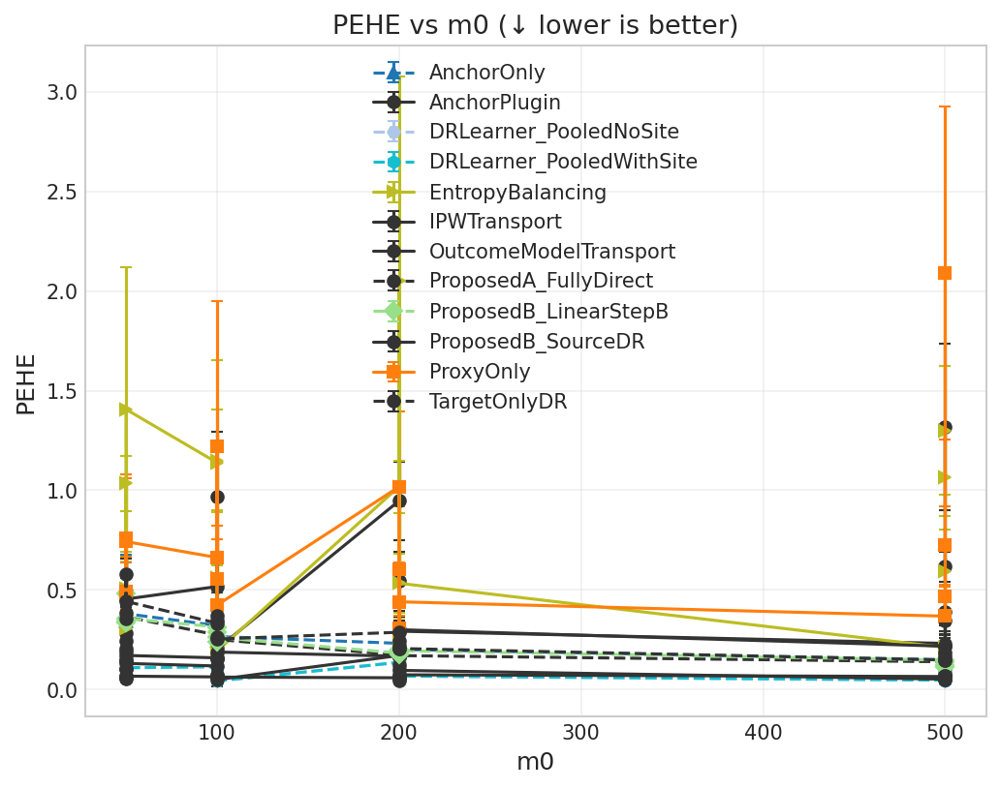
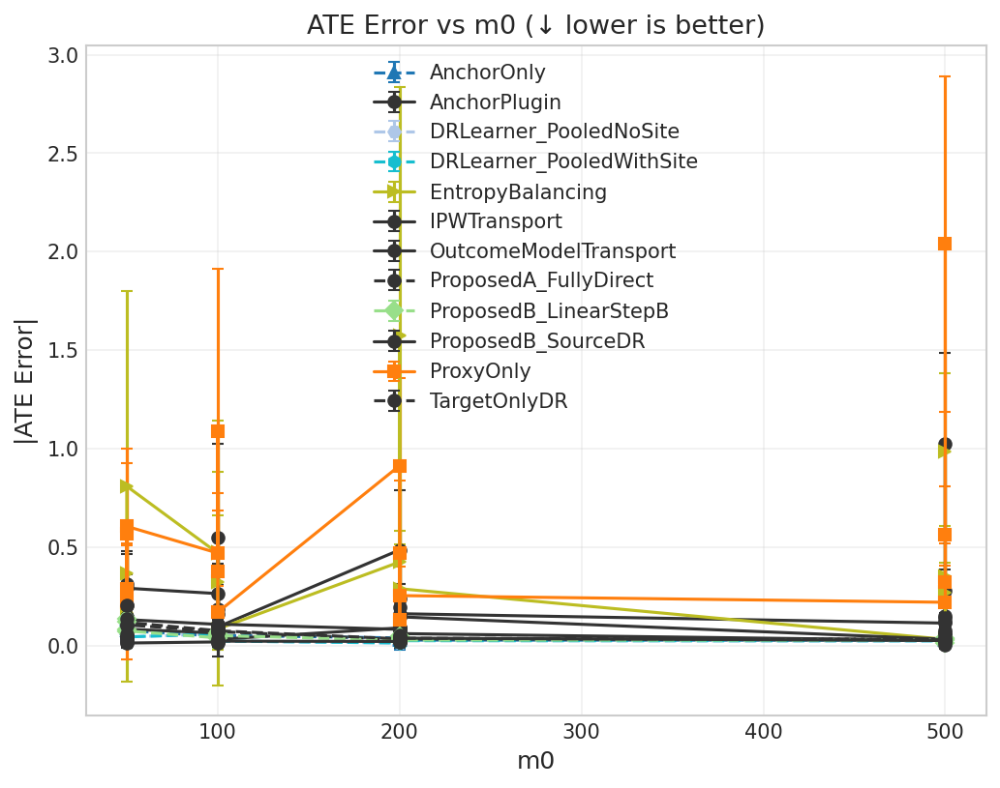
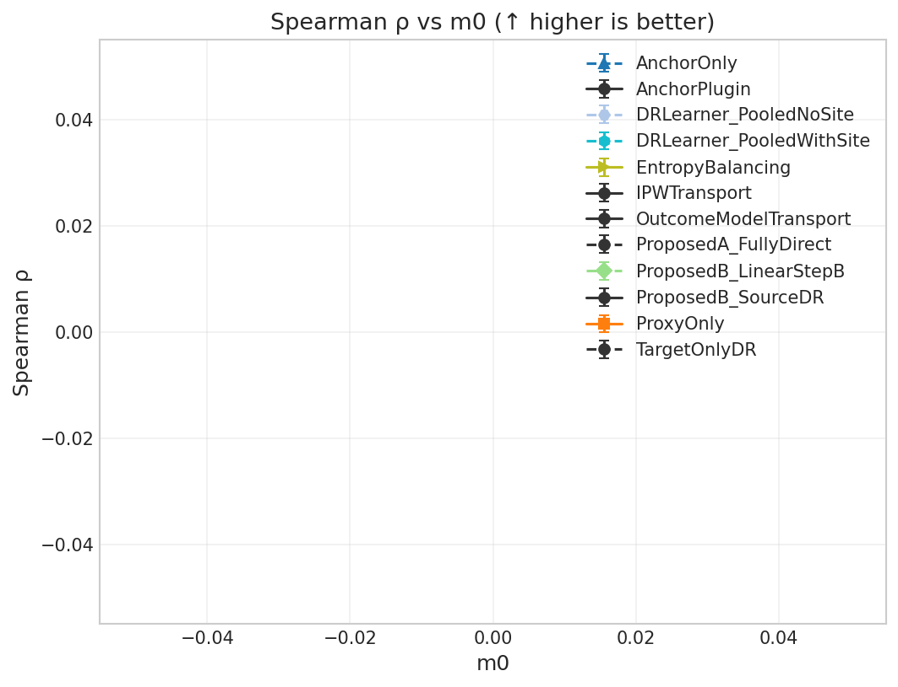

# L1-TCL Extended: Gold budget × Dimensionality grid (m0 × d)

**Benchmark ID:** `l1tcl_gold_dim_sweep`

**Generated:** 2026-02-06 02:03

---

## 1. Motivation

**Research Question:** How do target sample size and dimensionality jointly affect transfer learning?

**Why This Matters:**
This 2D grid explores the interaction between:
1. **Gold budget (m0)**: More target data → less need for transfer
2. **Dimensionality (d)**: Higher d → harder estimation, more benefit from source data

**Key Grid:**
- Target: m₀ = m₁ ∈ {50, 100, 200, 500}
- Dimension: d ∈ {10, 20, 50, 100}
- Total: 4 × 4 = 16 scenarios

**Critical Trade-offs:**
- Small m0 + low d: Transfer dominates (easy problem, limited target data)
- Small m0 + high d: Transfer critical (hard problem, limited target data)
- Large m0 + low d: Target-only competitive (easy problem, ample target data)
- Large m0 + high d: Interesting regime - does transfer still help?

---

## 2. Simulation Setup

**L1-TCL DGP (Extended)**:
- Covariates: X ~ N(0, I_d) with d ∈ {10, 20, 50, 100}
- Propensity: P(Z=1|X) = sigmoid(X^T β) 
- Source-target difference: Δβ is 10%-sparse
- Outcome: Y = τZ + α^T X + ε with constant τ = -0.067
- 10 source sites with 500 samples each (5000 total)

### Parameter Summary

| Parameter | Value | Description |
|-----------|-------|-------------|
| **Sweep param** | `m0` | [50, 100, 200, 500] |
| n_proxy_total | 5000 | Total source/proxy observations |
| C_sources | 10 | Number of source sites |
| a5_effective_sparsity | 0.1 | See documentation |
| use_l1tcl_dgp | True | See documentation |

---

## 3. Metrics & Interpretation

| Metric | Direction | Description |
|--------|-----------|-------------|
| **PEHE (Precision in Estimating Heterogeneous Effects)** | ↓ lower is better | Root mean squared error of CATE predictions. Measures how accurately the estimat... |
| **ATE Absolute Error** | ↓ lower is better | Absolute difference between estimated and true average treatment effect.... |
| **ATE Bias (Signed)** | ↑ closer to 0 is better | Signed bias in ATE estimate. Positive = overestimate, negative = underestimate.... |
| **Spearman Rank Correlation** | ↑ higher is better | Rank correlation between predicted and true treatment effects.... |
| **Kendall Rank Correlation** | ↑ higher is better | Kendall tau-b correlation. More robust to ties than Spearman.... |
| **Qini AUC (Oracle)** | ↑ higher is better | Area under the Qini curve. Measures ranking quality for treatment targeting.... |
| **Top-10% Uplift Capture Ratio** | ↑ higher is better | Fraction of maximum uplift captured when treating top 10% by predicted CATE.... |
| **Top-20% Uplift Capture Ratio** | ↑ higher is better | Fraction of maximum uplift captured when treating top 20% by predicted CATE.... |
| **Top-30% Uplift Capture Ratio** | ↑ higher is better | Fraction of maximum uplift captured when treating top 30%.... |
| **Calibration Slope** | ↑ closer to 1 is better | Slope of regression of true τ on predicted τ̂. Ideal = 1.0.... |
| **Calibration R²** | ↑ higher is better | Variance explained by predictions. Measures calibration quality.... |
| **CATE ECE (Expected Calibration Error)** | ↓ lower is better | Expected calibration error for CATE. Binned average miscalibration.... |
| **Policy Value (Treat if τ̂ > 0)** | ↑ higher is better | Expected outcome under threshold-based treatment policy.... |
| **Policy Regret vs Oracle** | ↓ lower is better | Gap between oracle policy value and estimated policy value.... |
| **Policy Value (Treat Top 20%)** | ↑ higher is better | Expected outcome when treating top 20% by predicted CATE.... |
| **Policy Regret (Top 20% Budget)** | ↓ lower is better | Regret compared to oracle top-20% policy.... |
| **μ₀ RMSE (Control Outcome)** | ↓ lower is better | RMSE of predicted control outcomes. Measures nuisance estimation quality.... |

### Detailed Metric Definitions

**PEHE (Precision in Estimating Heterogeneous Effects)**

- Formula: $\sqrt{\frac{1}{n}\sum_i (\hat{\tau}(x_i) - \tau(x_i))^2}$
- Direction: **lower is better**
- A PEHE of 0.5 means predictions are off by 0.5 units on average.

**ATE Absolute Error**

- Formula: $|\hat{\text{ATE}} - \text{ATE}|$
- Direction: **lower is better**
- Important for policy decisions about whether to adopt treatment broadly.

**ATE Bias (Signed)**

- Formula: $\hat{\text{ATE}} - \text{ATE}$
- Direction: **closer to 0 is better**
- Shows systematic over/under-estimation tendencies.

**Spearman Rank Correlation**

- Formula: $\rho(\text{rank}(\hat{\tau}), \text{rank}(\tau))$
- Direction: **higher is better**
- 1.0 = perfect ranking, 0.0 = random. Critical for targeting interventions.

**Kendall Rank Correlation**

- Formula: $\tau_K(\hat{\tau}, \tau)$
- Direction: **higher is better**
- Alternative ranking metric; useful when ties are common.

**Qini AUC (Oracle)**

- Formula: Normalized AUC of cumulative uplift curve
- Direction: **higher is better**
- 1.0 = oracle ranking, 0.0 = random. Simulation-only metric using true τ.

**Top-10% Uplift Capture Ratio**

- Formula: $\frac{\bar{\tau}_{top10\%\ by\ \hat{\tau}}}{\bar{\tau}_{top10\%\ by\ \tau}}$
- Direction: **higher is better**
- 1.0 = oracle selection. Measures targeting efficiency for top patients.

**Top-20% Uplift Capture Ratio**

- Formula: $\frac{\bar{\tau}_{top20\%\ by\ \hat{\tau}}}{\bar{\tau}_{top20\%\ by\ \tau}}$
- Direction: **higher is better**
- 1.0 = oracle selection. Less stringent than top-10%.

**Top-30% Uplift Capture Ratio**

- Formula: $\frac{\bar{\tau}_{top30\%\ by\ \hat{\tau}}}{\bar{\tau}_{top30\%\ by\ \tau}}$
- Direction: **higher is better**
- Less stringent targeting metric.

**Calibration Slope**

- Formula: $\beta$ in $\tau = \alpha + \beta \hat{\tau}$
- Direction: **closer to 1 is better**
- <1 = overconfident predictions, >1 = underconfident.

**Calibration R²**

- Formula: $R^2$ of calibration regression
- Direction: **higher is better**
- Higher R² means predictions track true effects well.

**CATE ECE (Expected Calibration Error)**

- Formula: $\sum_b \frac{n_b}{n} |E[\tau | \hat{\tau} \in b] - E[\hat{\tau} | \hat{\tau} \in b]|$
- Direction: **lower is better**
- Lower ECE means better calibration across prediction ranges.

**Policy Value (Treat if τ̂ > 0)**

- Formula: $E[\mu_0 + \pi(\hat{\tau}) \cdot \tau]$ where $\pi(\hat{\tau}) = 1\{\hat{\tau} > 0\}$
- Direction: **higher is better**
- Higher value = better treatment decisions based on predictions.

**Policy Regret vs Oracle**

- Formula: $V(\pi^*) - V(\hat{\pi})$
- Direction: **lower is better**
- Lower regret = closer to optimal treatment decisions.

**Policy Value (Treat Top 20%)**

- Formula: $E[\mu_0 + \pi_{top20\%}(\hat{\tau}) \cdot \tau]$
- Direction: **higher is better**
- Budget-constrained policy evaluation.

**Policy Regret (Top 20% Budget)**

- Formula: $V(\pi^*_{top20\%}) - V(\hat{\pi}_{top20\%})$
- Direction: **lower is better**
- Budget-constrained regret.

**μ₀ RMSE (Control Outcome)**

- Formula: $\sqrt{\frac{1}{n}\sum_i (\hat{\mu}_0(x_i) - \mu_0(x_i))^2}$
- Direction: **lower is better**
- Important diagnostic; poor μ₀ estimation can propagate to CATE errors.

---

## 4. Methods Compared

| Method | Uses Target Placebo | Uses Source Data | Description |
|--------|---------------------|------------------|-------------|
| **TargetOnlyDR** | ✗ | ✗ | See documentation |
| **ProxyOnly** | ✗ | ✓ | Uses only source data, ignores target |
| **AnchorOnly** | ✓ | ✗ | Uses only target placebo data |
| **AnchorPlugin** | ✗ | ✗ | See documentation |
| **ProposedA_FullyDirect** | ✗ | ✗ | Proposed: fully joint + direct fitting |
| **ProposedB_LinearStepB** | ✓ | ✓ | Proposed (Option B): placebo-anchored with linear Step B |
| **ProposedB_SourceDR** | ✗ | ✗ | Proposed (Option B): source-DR for placebo-only target |
| **IPWTransport** | ✗ | ✗ | See documentation |
| **EntropyBalancing** | ✗ | ✗ | See documentation |
| **OutcomeModelTransport** | ✗ | ✗ | See documentation |
| **DRLearner_PooledWithSite** | ✗ | ✗ | See documentation |
| **DRLearner_PooledNoSite** | ✗ | ✗ | See documentation |

---

## 5. Experiment Summary

- **Sweep parameter:** `m0` ∈ [50, 100, 200, 500]
- **Monte Carlo replicates:** 5 per scenario
- **Methods evaluated:** 12
- **Total runs:** 960

---

## 6. Results

### Best Methods (averaged across sweep)

| Metric | Best Method | Value | Direction |
|--------|-------------|-------|----------|
| PEHE | **OutcomeModelTransport** | 0.0437 | ↓ lower |
| ATE Error | **ProposedB_SourceDR** | 0.0071 | ↓ lower |
| Qini AUC | **AnchorOnly** | 0.0000 | ↑ higher |
| Calibration R² | **AnchorOnly** | 1.0000 | ↑ higher |
| CATE ECE | **OutcomeModelTransport** | 0.0355 | ↓ lower |
| Policy Value | **DRLearner_PooledNoSite** | 0.1874 | ↑ higher |
| Policy Regret | **DRLearner_PooledNoSite** | 0.0028 | ↓ lower |

### Core Metrics

| m0 | m1 | Method | PEHE (↓) | ATE Err (↓) | Spearman (↑) | Qini (↑) |
|---|---|---|---|---|---|
| 50 | 50 | AnchorOnly | 0.340 ± 0.043 | 0.087 ± 0.078 | N/A | 0.000 ± 0.000 |
| 50 | 50 | AnchorOnly | 0.503 ± 0.174 | 0.137 ± 0.080 | N/A | 0.000 ± 0.000 |
| 50 | 50 | AnchorOnly | 0.349 ± 0.036 | 0.133 ± 0.095 | N/A | 0.000 ± 0.000 |
| 50 | 50 | AnchorOnly | 0.381 ± 0.041 | 0.078 ± 0.087 | N/A | 0.000 ± 0.000 |
| 50 | 50 | AnchorPlugin | 0.246 ± 0.096 | 0.125 ± 0.108 | N/A | 0.000 ± 0.000 |
| 50 | 50 | AnchorPlugin | 0.476 ± 0.180 | 0.314 ± 0.166 | N/A | 0.000 ± 0.000 |
| 50 | 50 | AnchorPlugin | 0.281 ± 0.087 | 0.147 ± 0.123 | N/A | 0.000 ± 0.000 |
| 50 | 50 | AnchorPlugin | 0.455 ± 0.185 | 0.293 ± 0.172 | N/A | 0.000 ± 0.000 |
| 50 | 50 | DRLearner_PooledNoSite | 0.054 ± 0.011 | 0.028 ± 0.009 | N/A | 0.000 ± 0.000 |
| 50 | 50 | DRLearner_PooledNoSite | 0.144 ± 0.013 | 0.049 ± 0.027 | N/A | 0.000 ± 0.000 |
| 50 | 50 | DRLearner_PooledNoSite | 0.057 ± 0.008 | 0.033 ± 0.012 | N/A | 0.000 ± 0.000 |
| 50 | 50 | DRLearner_PooledNoSite | 0.110 ± 0.018 | 0.046 ± 0.034 | N/A | 0.000 ± 0.000 |
| 50 | 50 | DRLearner_PooledWithSite | 0.055 ± 0.010 | 0.029 ± 0.009 | N/A | 0.000 ± 0.000 |
| 50 | 50 | DRLearner_PooledWithSite | 0.142 ± 0.012 | 0.044 ± 0.027 | N/A | 0.000 ± 0.000 |
| 50 | 50 | DRLearner_PooledWithSite | 0.057 ± 0.008 | 0.032 ± 0.012 | N/A | 0.000 ± 0.000 |
| 50 | 50 | DRLearner_PooledWithSite | 0.110 ± 0.020 | 0.046 ± 0.034 | N/A | 0.000 ± 0.000 |
| 50 | 50 | EntropyBalancing | 0.310 ± 0.176 | 0.168 ± 0.154 | N/A | 0.000 ± 0.000 |
| 50 | 50 | EntropyBalancing | 1.034 ± 0.138 | 0.367 ± 0.237 | N/A | 0.000 ± 0.000 |
| 50 | 50 | EntropyBalancing | 0.505 ± 0.072 | 0.084 ± 0.067 | N/A | 0.000 ± 0.000 |
| 50 | 50 | EntropyBalancing | 1.406 ± 0.713 | 0.810 ± 0.989 | N/A | 0.000 ± 0.000 |
| 50 | 50 | IPWTransport | 0.205 ± 0.121 | 0.138 ± 0.127 | N/A | 0.000 ± 0.000 |
| 50 | 50 | IPWTransport | 0.147 ± 0.017 | 0.049 ± 0.044 | N/A | 0.000 ± 0.000 |
| 50 | 50 | IPWTransport | 0.192 ± 0.045 | 0.051 ± 0.039 | N/A | 0.000 ± 0.000 |
| 50 | 50 | IPWTransport | 0.172 ± 0.038 | 0.134 ± 0.043 | N/A | 0.000 ± 0.000 |
| 50 | 50 | OutcomeModelTransport | 0.066 ± 0.019 | 0.044 ± 0.021 | N/A | 0.000 ± 0.000 |
| 50 | 50 | OutcomeModelTransport | 0.146 ± 0.016 | 0.053 ± 0.038 | N/A | 0.000 ± 0.000 |
| 50 | 50 | OutcomeModelTransport | 0.058 ± 0.016 | 0.032 ± 0.024 | N/A | 0.000 ± 0.000 |
| 50 | 50 | OutcomeModelTransport | 0.132 ± 0.038 | 0.085 ± 0.047 | N/A | 0.000 ± 0.000 |
| 50 | 50 | ProposedA_FullyDirect | 0.356 ± 0.028 | 0.099 ± 0.080 | N/A | 0.000 ± 0.000 |
| 50 | 50 | ProposedA_FullyDirect | 0.490 ± 0.072 | 0.209 ± 0.153 | N/A | 0.000 ± 0.000 |
| 50 | 50 | ProposedA_FullyDirect | 0.349 ± 0.055 | 0.146 ± 0.078 | N/A | 0.000 ± 0.000 |
| 50 | 50 | ProposedA_FullyDirect | 0.365 ± 0.047 | 0.120 ± 0.091 | N/A | 0.000 ± 0.000 |
| 50 | 50 | ProposedB_LinearStepB | 0.337 ± 0.035 | 0.082 ± 0.080 | N/A | 0.000 ± 0.000 |
| 50 | 50 | ProposedB_LinearStepB | 0.482 ± 0.160 | 0.121 ± 0.075 | N/A | 0.000 ± 0.000 |
| 50 | 50 | ProposedB_LinearStepB | 0.342 ± 0.035 | 0.139 ± 0.093 | N/A | 0.000 ± 0.000 |
| 50 | 50 | ProposedB_LinearStepB | 0.357 ± 0.033 | 0.076 ± 0.085 | N/A | 0.000 ± 0.000 |
| 50 | 50 | ProposedB_SourceDR | 0.106 ± 0.046 | 0.059 ± 0.053 | N/A | 0.000 ± 0.000 |
| 50 | 50 | ProposedB_SourceDR | 0.102 ± 0.027 | 0.041 ± 0.039 | N/A | 0.000 ± 0.000 |
| 50 | 50 | ProposedB_SourceDR | 0.056 ± 0.009 | 0.022 ± 0.015 | N/A | 0.000 ± 0.000 |
| 50 | 50 | ProposedB_SourceDR | 0.068 ± 0.012 | 0.015 ± 0.007 | N/A | 0.000 ± 0.000 |
| 50 | 50 | ProxyOnly | 0.482 ± 0.186 | 0.222 ± 0.288 | N/A | 0.000 ± 0.000 |
| 50 | 50 | ProxyOnly | 0.759 ± 0.300 | 0.570 ± 0.359 | N/A | 0.000 ± 0.000 |
| 50 | 50 | ProxyOnly | 0.491 ± 0.148 | 0.289 ± 0.229 | N/A | 0.000 ± 0.000 |
| 50 | 50 | ProxyOnly | 0.743 ± 0.337 | 0.607 ± 0.396 | N/A | 0.000 ± 0.000 |
| 50 | 50 | TargetOnlyDR | 0.355 ± 0.037 | 0.102 ± 0.060 | N/A | 0.000 ± 0.000 |
| 50 | 50 | TargetOnlyDR | 0.581 ± 0.184 | 0.208 ± 0.116 | N/A | 0.000 ± 0.000 |
| 50 | 50 | TargetOnlyDR | 0.387 ± 0.010 | 0.139 ± 0.090 | N/A | 0.000 ± 0.000 |
| 50 | 50 | TargetOnlyDR | 0.443 ± 0.127 | 0.107 ± 0.118 | N/A | 0.000 ± 0.000 |
| 100 | 100 | AnchorOnly | 0.322 ± 0.083 | 0.050 ± 0.042 | N/A | 0.000 ± 0.000 |
| 100 | 100 | AnchorOnly | 0.334 ± 0.052 | 0.070 ± 0.090 | N/A | 0.000 ± 0.000 |
| 100 | 100 | AnchorOnly | 0.245 ± 0.024 | 0.051 ± 0.049 | N/A | 0.000 ± 0.000 |
| 100 | 100 | AnchorOnly | 0.267 ± 0.027 | 0.054 ± 0.049 | N/A | 0.000 ± 0.000 |
| 100 | 100 | AnchorPlugin | 0.517 ± 0.030 | 0.266 ± 0.152 | N/A | 0.000 ± 0.000 |
| 100 | 100 | AnchorPlugin | 0.969 ± 0.322 | 0.551 ± 0.476 | N/A | 0.000 ± 0.000 |
| 100 | 100 | AnchorPlugin | 0.346 ± 0.079 | 0.189 ± 0.121 | N/A | 0.000 ± 0.000 |
| 100 | 100 | AnchorPlugin | 0.204 ± 0.024 | 0.096 ± 0.059 | N/A | 0.000 ± 0.000 |
| 100 | 100 | DRLearner_PooledNoSite | 0.116 ± 0.020 | 0.062 ± 0.039 | N/A | 0.000 ± 0.000 |
| 100 | 100 | DRLearner_PooledNoSite | 0.143 ± 0.012 | 0.026 ± 0.026 | N/A | 0.000 ± 0.000 |
| 100 | 100 | DRLearner_PooledNoSite | 0.074 ± 0.013 | 0.036 ± 0.029 | N/A | 0.000 ± 0.000 |
| 100 | 100 | DRLearner_PooledNoSite | 0.044 ± 0.009 | 0.026 ± 0.009 | N/A | 0.000 ± 0.000 |
| 100 | 100 | DRLearner_PooledWithSite | 0.115 ± 0.019 | 0.061 ± 0.039 | N/A | 0.000 ± 0.000 |
| 100 | 100 | DRLearner_PooledWithSite | 0.144 ± 0.012 | 0.025 ± 0.028 | N/A | 0.000 ± 0.000 |
| 100 | 100 | DRLearner_PooledWithSite | 0.074 ± 0.014 | 0.036 ± 0.030 | N/A | 0.000 ± 0.000 |
| 100 | 100 | DRLearner_PooledWithSite | 0.044 ± 0.009 | 0.025 ± 0.009 | N/A | 0.000 ± 0.000 |
| 100 | 100 | EntropyBalancing | 1.139 ± 0.513 | 0.471 ± 0.671 | N/A | 0.000 ± 0.000 |
| 100 | 100 | EntropyBalancing | 1.147 ± 0.259 | 0.475 ± 0.408 | N/A | 0.000 ± 0.000 |
| 100 | 100 | EntropyBalancing | 0.559 ± 0.341 | 0.324 ± 0.339 | N/A | 0.000 ± 0.000 |
| 100 | 100 | EntropyBalancing | 0.193 ± 0.139 | 0.086 ± 0.107 | N/A | 0.000 ± 0.000 |
| 100 | 100 | IPWTransport | 0.160 ± 0.061 | 0.110 ± 0.078 | N/A | 0.000 ± 0.000 |
| 100 | 100 | IPWTransport | 0.156 ± 0.016 | 0.062 ± 0.027 | N/A | 0.000 ± 0.000 |
| 100 | 100 | IPWTransport | 0.269 ± 0.050 | 0.164 ± 0.102 | N/A | 0.000 ± 0.000 |
| 100 | 100 | IPWTransport | 0.189 ± 0.172 | 0.111 ± 0.163 | N/A | 0.000 ± 0.000 |
| 100 | 100 | OutcomeModelTransport | 0.119 ± 0.023 | 0.065 ± 0.044 | N/A | 0.000 ± 0.000 |
| 100 | 100 | OutcomeModelTransport | 0.155 ± 0.014 | 0.060 ± 0.021 | N/A | 0.000 ± 0.000 |
| 100 | 100 | OutcomeModelTransport | 0.069 ± 0.007 | 0.032 ± 0.014 | N/A | 0.000 ± 0.000 |
| 100 | 100 | OutcomeModelTransport | 0.050 ± 0.010 | 0.033 ± 0.011 | N/A | 0.000 ± 0.000 |
| 100 | 100 | ProposedA_FullyDirect | 0.275 ± 0.008 | 0.078 ± 0.065 | N/A | 0.000 ± 0.000 |
| 100 | 100 | ProposedA_FullyDirect | 0.294 ± 0.068 | 0.066 ± 0.076 | N/A | 0.000 ± 0.000 |
| 100 | 100 | ProposedA_FullyDirect | 0.235 ± 0.041 | 0.083 ± 0.063 | N/A | 0.000 ± 0.000 |
| 100 | 100 | ProposedA_FullyDirect | 0.252 ± 0.030 | 0.073 ± 0.033 | N/A | 0.000 ± 0.000 |
| 100 | 100 | ProposedB_LinearStepB | 0.315 ± 0.067 | 0.041 ± 0.034 | N/A | 0.000 ± 0.000 |
| 100 | 100 | ProposedB_LinearStepB | 0.288 ± 0.048 | 0.070 ± 0.082 | N/A | 0.000 ± 0.000 |
| 100 | 100 | ProposedB_LinearStepB | 0.241 ± 0.030 | 0.059 ± 0.051 | N/A | 0.000 ± 0.000 |
| 100 | 100 | ProposedB_LinearStepB | 0.262 ± 0.024 | 0.053 ± 0.049 | N/A | 0.000 ± 0.000 |
| 100 | 100 | ProposedB_SourceDR | 0.064 ± 0.019 | 0.021 ± 0.023 | N/A | 0.000 ± 0.000 |
| 100 | 100 | ProposedB_SourceDR | 0.074 ± 0.028 | 0.017 ± 0.016 | N/A | 0.000 ± 0.000 |
| 100 | 100 | ProposedB_SourceDR | 0.067 ± 0.016 | 0.037 ± 0.020 | N/A | 0.000 ± 0.000 |
| 100 | 100 | ProposedB_SourceDR | 0.063 ± 0.011 | 0.025 ± 0.020 | N/A | 0.000 ± 0.000 |
| 100 | 100 | ProxyOnly | 0.663 ± 0.161 | 0.471 ± 0.306 | N/A | 0.000 ± 0.000 |
| 100 | 100 | ProxyOnly | 1.221 ± 0.727 | 1.089 ± 0.826 | N/A | 0.000 ± 0.000 |
| 100 | 100 | ProxyOnly | 0.557 ± 0.196 | 0.380 ± 0.307 | N/A | 0.000 ± 0.000 |
| 100 | 100 | ProxyOnly | 0.424 ± 0.104 | 0.171 ± 0.132 | N/A | 0.000 ± 0.000 |
| 100 | 100 | TargetOnlyDR | 0.334 ± 0.034 | 0.075 ± 0.058 | N/A | 0.000 ± 0.000 |
| 100 | 100 | TargetOnlyDR | 0.369 ± 0.048 | 0.096 ± 0.082 | N/A | 0.000 ± 0.000 |
| 100 | 100 | TargetOnlyDR | 0.263 ± 0.020 | 0.071 ± 0.041 | N/A | 0.000 ± 0.000 |
| 100 | 100 | TargetOnlyDR | 0.254 ± 0.031 | 0.077 ± 0.057 | N/A | 0.000 ± 0.000 |
| 200 | 200 | AnchorOnly | 0.233 ± 0.033 | 0.041 ± 0.026 | N/A | 0.000 ± 0.000 |
| 200 | 200 | AnchorOnly | 0.203 ± 0.032 | 0.049 ± 0.031 | N/A | 0.000 ± 0.000 |
| 200 | 200 | AnchorOnly | 0.202 ± 0.029 | 0.035 ± 0.054 | N/A | 0.000 ± 0.000 |
| 200 | 200 | AnchorOnly | 0.202 ± 0.062 | 0.030 ± 0.027 | N/A | 0.000 ± 0.000 |
| 200 | 200 | AnchorPlugin | 0.947 ± 0.198 | 0.487 ± 0.305 | N/A | 0.000 ± 0.000 |
| 200 | 200 | AnchorPlugin | 0.162 ± 0.021 | 0.062 ± 0.035 | N/A | 0.000 ± 0.000 |
| 200 | 200 | AnchorPlugin | 0.545 ± 0.148 | 0.239 ± 0.226 | N/A | 0.000 ± 0.000 |
| 200 | 200 | AnchorPlugin | 0.293 ± 0.055 | 0.164 ± 0.055 | N/A | 0.000 ± 0.000 |
| 200 | 200 | DRLearner_PooledNoSite | 0.137 ± 0.015 | 0.015 ± 0.007 | N/A | 0.000 ± 0.000 |
| 200 | 200 | DRLearner_PooledNoSite | 0.049 ± 0.009 | 0.029 ± 0.019 | N/A | 0.000 ± 0.000 |
| 200 | 200 | DRLearner_PooledNoSite | 0.102 ± 0.011 | 0.030 ± 0.028 | N/A | 0.000 ± 0.000 |
| 200 | 200 | DRLearner_PooledNoSite | 0.068 ± 0.019 | 0.028 ± 0.035 | N/A | 0.000 ± 0.000 |
| 200 | 200 | DRLearner_PooledWithSite | 0.137 ± 0.015 | 0.015 ± 0.007 | N/A | 0.000 ± 0.000 |
| 200 | 200 | DRLearner_PooledWithSite | 0.049 ± 0.009 | 0.029 ± 0.019 | N/A | 0.000 ± 0.000 |
| 200 | 200 | DRLearner_PooledWithSite | 0.102 ± 0.011 | 0.029 ± 0.029 | N/A | 0.000 ± 0.000 |
| 200 | 200 | DRLearner_PooledWithSite | 0.068 ± 0.019 | 0.027 ± 0.036 | N/A | 0.000 ± 0.000 |
| 200 | 200 | EntropyBalancing | 1.019 ± 0.132 | 0.426 ± 0.158 | N/A | 0.000 ± 0.000 |
| 200 | 200 | EntropyBalancing | 0.252 ± 0.110 | 0.116 ± 0.050 | N/A | 0.000 ± 0.000 |
| 200 | 200 | EntropyBalancing | 2.052 ± 1.025 | 1.576 ± 1.262 | N/A | 0.000 ± 0.000 |
| 200 | 200 | EntropyBalancing | 0.534 ± 0.146 | 0.291 ± 0.225 | N/A | 0.000 ± 0.000 |
| 200 | 200 | IPWTransport | 0.168 ± 0.019 | 0.084 ± 0.036 | N/A | 0.000 ± 0.000 |
| 200 | 200 | IPWTransport | 0.207 ± 0.065 | 0.094 ± 0.054 | N/A | 0.000 ± 0.000 |
| 200 | 200 | IPWTransport | 0.244 ± 0.096 | 0.199 ± 0.114 | N/A | 0.000 ± 0.000 |
| 200 | 200 | IPWTransport | 0.301 ± 0.066 | 0.148 ± 0.098 | N/A | 0.000 ± 0.000 |
| 200 | 200 | OutcomeModelTransport | 0.172 ± 0.024 | 0.092 ± 0.038 | N/A | 0.000 ± 0.000 |
| 200 | 200 | OutcomeModelTransport | 0.044 ± 0.014 | 0.025 ± 0.014 | N/A | 0.000 ± 0.000 |
| 200 | 200 | OutcomeModelTransport | 0.126 ± 0.027 | 0.072 ± 0.041 | N/A | 0.000 ± 0.000 |
| 200 | 200 | OutcomeModelTransport | 0.097 ± 0.034 | 0.063 ± 0.054 | N/A | 0.000 ± 0.000 |
| 200 | 200 | ProposedA_FullyDirect | 0.173 ± 0.025 | 0.033 ± 0.018 | N/A | 0.000 ± 0.000 |
| 200 | 200 | ProposedA_FullyDirect | 0.195 ± 0.024 | 0.044 ± 0.026 | N/A | 0.000 ± 0.000 |
| 200 | 200 | ProposedA_FullyDirect | 0.170 ± 0.011 | 0.034 ± 0.038 | N/A | 0.000 ± 0.000 |
| 200 | 200 | ProposedA_FullyDirect | 0.171 ± 0.019 | 0.035 ± 0.024 | N/A | 0.000 ± 0.000 |
| 200 | 200 | ProposedB_LinearStepB | 0.184 ± 0.028 | 0.029 ± 0.027 | N/A | 0.000 ± 0.000 |
| 200 | 200 | ProposedB_LinearStepB | 0.203 ± 0.032 | 0.049 ± 0.030 | N/A | 0.000 ± 0.000 |
| 200 | 200 | ProposedB_LinearStepB | 0.179 ± 0.023 | 0.042 ± 0.047 | N/A | 0.000 ± 0.000 |
| 200 | 200 | ProposedB_LinearStepB | 0.195 ± 0.053 | 0.030 ± 0.029 | N/A | 0.000 ± 0.000 |
| 200 | 200 | ProposedB_SourceDR | 0.060 ± 0.006 | 0.023 ± 0.016 | N/A | 0.000 ± 0.000 |
| 200 | 200 | ProposedB_SourceDR | 0.065 ± 0.009 | 0.019 ± 0.014 | N/A | 0.000 ± 0.000 |
| 200 | 200 | ProposedB_SourceDR | 0.058 ± 0.015 | 0.019 ± 0.009 | N/A | 0.000 ± 0.000 |
| 200 | 200 | ProposedB_SourceDR | 0.075 ± 0.020 | 0.040 ± 0.031 | N/A | 0.000 ± 0.000 |
| 200 | 200 | ProxyOnly | 1.018 ± 0.380 | 0.915 ± 0.446 | N/A | 0.000 ± 0.000 |
| 200 | 200 | ProxyOnly | 0.309 ± 0.063 | 0.133 ± 0.085 | N/A | 0.000 ± 0.000 |
| 200 | 200 | ProxyOnly | 0.605 ± 0.314 | 0.471 ± 0.370 | N/A | 0.000 ± 0.000 |
| 200 | 200 | ProxyOnly | 0.441 ± 0.106 | 0.256 ± 0.146 | N/A | 0.000 ± 0.000 |
| 200 | 200 | TargetOnlyDR | 0.288 ± 0.034 | 0.036 ± 0.045 | N/A | 0.000 ± 0.000 |
| 200 | 200 | TargetOnlyDR | 0.207 ± 0.026 | 0.049 ± 0.034 | N/A | 0.000 ± 0.000 |
| 200 | 200 | TargetOnlyDR | 0.220 ± 0.021 | 0.056 ± 0.035 | N/A | 0.000 ± 0.000 |
| 200 | 200 | TargetOnlyDR | 0.207 ± 0.035 | 0.039 ± 0.020 | N/A | 0.000 ± 0.000 |
| 500 | 500 | AnchorOnly | 0.150 ± 0.009 | 0.029 ± 0.027 | N/A | 0.000 ± 0.000 |
| 500 | 500 | AnchorOnly | 0.139 ± 0.014 | 0.036 ± 0.039 | N/A | 0.000 ± 0.000 |
| 500 | 500 | AnchorOnly | 0.177 ± 0.030 | 0.033 ± 0.017 | N/A | 0.000 ± 0.000 |
| 500 | 500 | AnchorOnly | 0.141 ± 0.011 | 0.046 ± 0.018 | N/A | 0.000 ± 0.000 |
| 500 | 500 | AnchorPlugin | 0.232 ± 0.063 | 0.116 ± 0.091 | N/A | 0.000 ± 0.000 |
| 500 | 500 | AnchorPlugin | 0.346 ± 0.054 | 0.151 ± 0.104 | N/A | 0.000 ± 0.000 |
| 500 | 500 | AnchorPlugin | 1.319 ± 0.417 | 1.024 ± 0.460 | N/A | 0.000 ± 0.000 |
| 500 | 500 | AnchorPlugin | 0.617 ± 0.073 | 0.278 ± 0.111 | N/A | 0.000 ± 0.000 |
| 500 | 500 | DRLearner_PooledNoSite | 0.048 ± 0.017 | 0.026 ± 0.015 | N/A | 0.000 ± 0.000 |
| 500 | 500 | DRLearner_PooledNoSite | 0.064 ± 0.018 | 0.020 ± 0.029 | N/A | 0.000 ± 0.000 |
| 500 | 500 | DRLearner_PooledNoSite | 0.126 ± 0.004 | 0.021 ± 0.014 | N/A | 0.000 ± 0.000 |
| 500 | 500 | DRLearner_PooledNoSite | 0.096 ± 0.006 | 0.030 ± 0.015 | N/A | 0.000 ± 0.000 |
| 500 | 500 | DRLearner_PooledWithSite | 0.048 ± 0.017 | 0.026 ± 0.016 | N/A | 0.000 ± 0.000 |
| 500 | 500 | DRLearner_PooledWithSite | 0.064 ± 0.018 | 0.019 ± 0.029 | N/A | 0.000 ± 0.000 |
| 500 | 500 | DRLearner_PooledWithSite | 0.126 ± 0.003 | 0.021 ± 0.013 | N/A | 0.000 ± 0.000 |
| 500 | 500 | DRLearner_PooledWithSite | 0.096 ± 0.006 | 0.030 ± 0.015 | N/A | 0.000 ± 0.000 |
| 500 | 500 | EntropyBalancing | 0.212 ± 0.065 | 0.034 ± 0.042 | N/A | 0.000 ± 0.000 |
| 500 | 500 | EntropyBalancing | 0.593 ± 0.211 | 0.269 ± 0.154 | N/A | 0.000 ± 0.000 |
| 500 | 500 | EntropyBalancing | 1.063 ± 0.191 | 0.355 ± 0.251 | N/A | 0.000 ± 0.000 |
| 500 | 500 | EntropyBalancing | 1.300 ± 0.324 | 0.984 ± 0.398 | N/A | 0.000 ± 0.000 |
| 500 | 500 | IPWTransport | 0.218 ± 0.059 | 0.034 ± 0.033 | N/A | 0.000 ± 0.000 |
| 500 | 500 | IPWTransport | 0.390 ± 0.069 | 0.143 ± 0.091 | N/A | 0.000 ± 0.000 |
| 500 | 500 | IPWTransport | 0.145 ± 0.010 | 0.053 ± 0.031 | N/A | 0.000 ± 0.000 |
| 500 | 500 | IPWTransport | 0.187 ± 0.086 | 0.121 ± 0.098 | N/A | 0.000 ± 0.000 |
| 500 | 500 | OutcomeModelTransport | 0.053 ± 0.011 | 0.028 ± 0.015 | N/A | 0.000 ± 0.000 |
| 500 | 500 | OutcomeModelTransport | 0.082 ± 0.012 | 0.042 ± 0.032 | N/A | 0.000 ± 0.000 |
| 500 | 500 | OutcomeModelTransport | 0.147 ± 0.011 | 0.054 ± 0.038 | N/A | 0.000 ± 0.000 |
| 500 | 500 | OutcomeModelTransport | 0.129 ± 0.034 | 0.080 ± 0.045 | N/A | 0.000 ± 0.000 |
| 500 | 500 | ProposedA_FullyDirect | 0.140 ± 0.010 | 0.034 ± 0.030 | N/A | 0.000 ± 0.000 |
| 500 | 500 | ProposedA_FullyDirect | 0.135 ± 0.019 | 0.027 ± 0.030 | N/A | 0.000 ± 0.000 |
| 500 | 500 | ProposedA_FullyDirect | 0.110 ± 0.009 | 0.020 ± 0.013 | N/A | 0.000 ± 0.000 |
| 500 | 500 | ProposedA_FullyDirect | 0.120 ± 0.010 | 0.040 ± 0.021 | N/A | 0.000 ± 0.000 |
| 500 | 500 | ProposedB_LinearStepB | 0.148 ± 0.010 | 0.029 ± 0.027 | N/A | 0.000 ± 0.000 |
| 500 | 500 | ProposedB_LinearStepB | 0.139 ± 0.016 | 0.033 ± 0.030 | N/A | 0.000 ± 0.000 |
| 500 | 500 | ProposedB_LinearStepB | 0.114 ± 0.011 | 0.016 ± 0.013 | N/A | 0.000 ± 0.000 |
| 500 | 500 | ProposedB_LinearStepB | 0.122 ± 0.016 | 0.041 ± 0.018 | N/A | 0.000 ± 0.000 |
| 500 | 500 | ProposedB_SourceDR | 0.066 ± 0.030 | 0.028 ± 0.029 | N/A | 0.000 ± 0.000 |
| 500 | 500 | ProposedB_SourceDR | 0.068 ± 0.009 | 0.018 ± 0.018 | N/A | 0.000 ± 0.000 |
| 500 | 500 | ProposedB_SourceDR | 0.049 ± 0.006 | 0.007 ± 0.005 | N/A | 0.000 ± 0.000 |
| 500 | 500 | ProposedB_SourceDR | 0.068 ± 0.028 | 0.026 ± 0.040 | N/A | 0.000 ± 0.000 |
| 500 | 500 | ProxyOnly | 0.369 ± 0.146 | 0.222 ± 0.187 | N/A | 0.000 ± 0.000 |
| 500 | 500 | ProxyOnly | 0.467 ± 0.125 | 0.323 ± 0.196 | N/A | 0.000 ± 0.000 |
| 500 | 500 | ProxyOnly | 2.090 ± 0.834 | 2.039 ± 0.851 | N/A | 0.000 ± 0.000 |
| 500 | 500 | ProxyOnly | 0.725 ± 0.196 | 0.564 ± 0.245 | N/A | 0.000 ± 0.000 |
| 500 | 500 | TargetOnlyDR | 0.149 ± 0.012 | 0.033 ± 0.026 | N/A | 0.000 ± 0.000 |
| 500 | 500 | TargetOnlyDR | 0.148 ± 0.016 | 0.034 ± 0.048 | N/A | 0.000 ± 0.000 |
| 500 | 500 | TargetOnlyDR | 0.223 ± 0.035 | 0.071 ± 0.051 | N/A | 0.000 ± 0.000 |
| 500 | 500 | TargetOnlyDR | 0.168 ± 0.010 | 0.055 ± 0.026 | N/A | 0.000 ± 0.000 |

### Targeting / Ranking Metrics

| m0 | m1 | Method | Top-10% (↑) | Top-20% (↑) | Kendall (↑) |
|---|---|---|---|---|---|
| 50 | 50 | AnchorOnly | N/A | N/A | N/A |
| 50 | 50 | AnchorOnly | N/A | N/A | N/A |
| 50 | 50 | AnchorOnly | N/A | N/A | N/A |
| 50 | 50 | AnchorOnly | N/A | N/A | N/A |
| 50 | 50 | AnchorPlugin | N/A | N/A | N/A |
| 50 | 50 | AnchorPlugin | N/A | N/A | N/A |
| 50 | 50 | AnchorPlugin | N/A | N/A | N/A |
| 50 | 50 | AnchorPlugin | N/A | N/A | N/A |
| 50 | 50 | DRLearner_PooledNoSite | N/A | N/A | N/A |
| 50 | 50 | DRLearner_PooledNoSite | N/A | N/A | N/A |
| 50 | 50 | DRLearner_PooledNoSite | N/A | N/A | N/A |
| 50 | 50 | DRLearner_PooledNoSite | N/A | N/A | N/A |
| 50 | 50 | DRLearner_PooledWithSite | N/A | N/A | N/A |
| 50 | 50 | DRLearner_PooledWithSite | N/A | N/A | N/A |
| 50 | 50 | DRLearner_PooledWithSite | N/A | N/A | N/A |
| 50 | 50 | DRLearner_PooledWithSite | N/A | N/A | N/A |
| 50 | 50 | EntropyBalancing | N/A | N/A | N/A |
| 50 | 50 | EntropyBalancing | N/A | N/A | N/A |
| 50 | 50 | EntropyBalancing | N/A | N/A | N/A |
| 50 | 50 | EntropyBalancing | N/A | N/A | N/A |
| 50 | 50 | IPWTransport | N/A | N/A | N/A |
| 50 | 50 | IPWTransport | N/A | N/A | N/A |
| 50 | 50 | IPWTransport | N/A | N/A | N/A |
| 50 | 50 | IPWTransport | N/A | N/A | N/A |
| 50 | 50 | OutcomeModelTransport | N/A | N/A | N/A |
| 50 | 50 | OutcomeModelTransport | N/A | N/A | N/A |
| 50 | 50 | OutcomeModelTransport | N/A | N/A | N/A |
| 50 | 50 | OutcomeModelTransport | N/A | N/A | N/A |
| 50 | 50 | ProposedA_FullyDirect | N/A | N/A | N/A |
| 50 | 50 | ProposedA_FullyDirect | N/A | N/A | N/A |
| 50 | 50 | ProposedA_FullyDirect | N/A | N/A | N/A |
| 50 | 50 | ProposedA_FullyDirect | N/A | N/A | N/A |
| 50 | 50 | ProposedB_LinearStepB | N/A | N/A | N/A |
| 50 | 50 | ProposedB_LinearStepB | N/A | N/A | N/A |
| 50 | 50 | ProposedB_LinearStepB | N/A | N/A | N/A |
| 50 | 50 | ProposedB_LinearStepB | N/A | N/A | N/A |
| 50 | 50 | ProposedB_SourceDR | N/A | N/A | N/A |
| 50 | 50 | ProposedB_SourceDR | N/A | N/A | N/A |
| 50 | 50 | ProposedB_SourceDR | N/A | N/A | N/A |
| 50 | 50 | ProposedB_SourceDR | N/A | N/A | N/A |
| 50 | 50 | ProxyOnly | N/A | N/A | N/A |
| 50 | 50 | ProxyOnly | N/A | N/A | N/A |
| 50 | 50 | ProxyOnly | N/A | N/A | N/A |
| 50 | 50 | ProxyOnly | N/A | N/A | N/A |
| 50 | 50 | TargetOnlyDR | N/A | N/A | N/A |
| 50 | 50 | TargetOnlyDR | N/A | N/A | N/A |
| 50 | 50 | TargetOnlyDR | N/A | N/A | N/A |
| 50 | 50 | TargetOnlyDR | N/A | N/A | N/A |
| 100 | 100 | AnchorOnly | N/A | N/A | N/A |
| 100 | 100 | AnchorOnly | N/A | N/A | N/A |
| 100 | 100 | AnchorOnly | N/A | N/A | N/A |
| 100 | 100 | AnchorOnly | N/A | N/A | N/A |
| 100 | 100 | AnchorPlugin | N/A | N/A | N/A |
| 100 | 100 | AnchorPlugin | N/A | N/A | N/A |
| 100 | 100 | AnchorPlugin | N/A | N/A | N/A |
| 100 | 100 | AnchorPlugin | N/A | N/A | N/A |
| 100 | 100 | DRLearner_PooledNoSite | N/A | N/A | N/A |
| 100 | 100 | DRLearner_PooledNoSite | N/A | N/A | N/A |
| 100 | 100 | DRLearner_PooledNoSite | N/A | N/A | N/A |
| 100 | 100 | DRLearner_PooledNoSite | N/A | N/A | N/A |
| 100 | 100 | DRLearner_PooledWithSite | N/A | N/A | N/A |
| 100 | 100 | DRLearner_PooledWithSite | N/A | N/A | N/A |
| 100 | 100 | DRLearner_PooledWithSite | N/A | N/A | N/A |
| 100 | 100 | DRLearner_PooledWithSite | N/A | N/A | N/A |
| 100 | 100 | EntropyBalancing | N/A | N/A | N/A |
| 100 | 100 | EntropyBalancing | N/A | N/A | N/A |
| 100 | 100 | EntropyBalancing | N/A | N/A | N/A |
| 100 | 100 | EntropyBalancing | N/A | N/A | N/A |
| 100 | 100 | IPWTransport | N/A | N/A | N/A |
| 100 | 100 | IPWTransport | N/A | N/A | N/A |
| 100 | 100 | IPWTransport | N/A | N/A | N/A |
| 100 | 100 | IPWTransport | N/A | N/A | N/A |
| 100 | 100 | OutcomeModelTransport | N/A | N/A | N/A |
| 100 | 100 | OutcomeModelTransport | N/A | N/A | N/A |
| 100 | 100 | OutcomeModelTransport | N/A | N/A | N/A |
| 100 | 100 | OutcomeModelTransport | N/A | N/A | N/A |
| 100 | 100 | ProposedA_FullyDirect | N/A | N/A | N/A |
| 100 | 100 | ProposedA_FullyDirect | N/A | N/A | N/A |
| 100 | 100 | ProposedA_FullyDirect | N/A | N/A | N/A |
| 100 | 100 | ProposedA_FullyDirect | N/A | N/A | N/A |
| 100 | 100 | ProposedB_LinearStepB | N/A | N/A | N/A |
| 100 | 100 | ProposedB_LinearStepB | N/A | N/A | N/A |
| 100 | 100 | ProposedB_LinearStepB | N/A | N/A | N/A |
| 100 | 100 | ProposedB_LinearStepB | N/A | N/A | N/A |
| 100 | 100 | ProposedB_SourceDR | N/A | N/A | N/A |
| 100 | 100 | ProposedB_SourceDR | N/A | N/A | N/A |
| 100 | 100 | ProposedB_SourceDR | N/A | N/A | N/A |
| 100 | 100 | ProposedB_SourceDR | N/A | N/A | N/A |
| 100 | 100 | ProxyOnly | N/A | N/A | N/A |
| 100 | 100 | ProxyOnly | N/A | N/A | N/A |
| 100 | 100 | ProxyOnly | N/A | N/A | N/A |
| 100 | 100 | ProxyOnly | N/A | N/A | N/A |
| 100 | 100 | TargetOnlyDR | N/A | N/A | N/A |
| 100 | 100 | TargetOnlyDR | N/A | N/A | N/A |
| 100 | 100 | TargetOnlyDR | N/A | N/A | N/A |
| 100 | 100 | TargetOnlyDR | N/A | N/A | N/A |
| 200 | 200 | AnchorOnly | N/A | N/A | N/A |
| 200 | 200 | AnchorOnly | N/A | N/A | N/A |
| 200 | 200 | AnchorOnly | N/A | N/A | N/A |
| 200 | 200 | AnchorOnly | N/A | N/A | N/A |
| 200 | 200 | AnchorPlugin | N/A | N/A | N/A |
| 200 | 200 | AnchorPlugin | N/A | N/A | N/A |
| 200 | 200 | AnchorPlugin | N/A | N/A | N/A |
| 200 | 200 | AnchorPlugin | N/A | N/A | N/A |
| 200 | 200 | DRLearner_PooledNoSite | N/A | N/A | N/A |
| 200 | 200 | DRLearner_PooledNoSite | N/A | N/A | N/A |
| 200 | 200 | DRLearner_PooledNoSite | N/A | N/A | N/A |
| 200 | 200 | DRLearner_PooledNoSite | N/A | N/A | N/A |
| 200 | 200 | DRLearner_PooledWithSite | N/A | N/A | N/A |
| 200 | 200 | DRLearner_PooledWithSite | N/A | N/A | N/A |
| 200 | 200 | DRLearner_PooledWithSite | N/A | N/A | N/A |
| 200 | 200 | DRLearner_PooledWithSite | N/A | N/A | N/A |
| 200 | 200 | EntropyBalancing | N/A | N/A | N/A |
| 200 | 200 | EntropyBalancing | N/A | N/A | N/A |
| 200 | 200 | EntropyBalancing | N/A | N/A | N/A |
| 200 | 200 | EntropyBalancing | N/A | N/A | N/A |
| 200 | 200 | IPWTransport | N/A | N/A | N/A |
| 200 | 200 | IPWTransport | N/A | N/A | N/A |
| 200 | 200 | IPWTransport | N/A | N/A | N/A |
| 200 | 200 | IPWTransport | N/A | N/A | N/A |
| 200 | 200 | OutcomeModelTransport | N/A | N/A | N/A |
| 200 | 200 | OutcomeModelTransport | N/A | N/A | N/A |
| 200 | 200 | OutcomeModelTransport | N/A | N/A | N/A |
| 200 | 200 | OutcomeModelTransport | N/A | N/A | N/A |
| 200 | 200 | ProposedA_FullyDirect | N/A | N/A | N/A |
| 200 | 200 | ProposedA_FullyDirect | N/A | N/A | N/A |
| 200 | 200 | ProposedA_FullyDirect | N/A | N/A | N/A |
| 200 | 200 | ProposedA_FullyDirect | N/A | N/A | N/A |
| 200 | 200 | ProposedB_LinearStepB | N/A | N/A | N/A |
| 200 | 200 | ProposedB_LinearStepB | N/A | N/A | N/A |
| 200 | 200 | ProposedB_LinearStepB | N/A | N/A | N/A |
| 200 | 200 | ProposedB_LinearStepB | N/A | N/A | N/A |
| 200 | 200 | ProposedB_SourceDR | N/A | N/A | N/A |
| 200 | 200 | ProposedB_SourceDR | N/A | N/A | N/A |
| 200 | 200 | ProposedB_SourceDR | N/A | N/A | N/A |
| 200 | 200 | ProposedB_SourceDR | N/A | N/A | N/A |
| 200 | 200 | ProxyOnly | N/A | N/A | N/A |
| 200 | 200 | ProxyOnly | N/A | N/A | N/A |
| 200 | 200 | ProxyOnly | N/A | N/A | N/A |
| 200 | 200 | ProxyOnly | N/A | N/A | N/A |
| 200 | 200 | TargetOnlyDR | N/A | N/A | N/A |
| 200 | 200 | TargetOnlyDR | N/A | N/A | N/A |
| 200 | 200 | TargetOnlyDR | N/A | N/A | N/A |
| 200 | 200 | TargetOnlyDR | N/A | N/A | N/A |
| 500 | 500 | AnchorOnly | N/A | N/A | N/A |
| 500 | 500 | AnchorOnly | N/A | N/A | N/A |
| 500 | 500 | AnchorOnly | N/A | N/A | N/A |
| 500 | 500 | AnchorOnly | N/A | N/A | N/A |
| 500 | 500 | AnchorPlugin | N/A | N/A | N/A |
| 500 | 500 | AnchorPlugin | N/A | N/A | N/A |
| 500 | 500 | AnchorPlugin | N/A | N/A | N/A |
| 500 | 500 | AnchorPlugin | N/A | N/A | N/A |
| 500 | 500 | DRLearner_PooledNoSite | N/A | N/A | N/A |
| 500 | 500 | DRLearner_PooledNoSite | N/A | N/A | N/A |
| 500 | 500 | DRLearner_PooledNoSite | N/A | N/A | N/A |
| 500 | 500 | DRLearner_PooledNoSite | N/A | N/A | N/A |
| 500 | 500 | DRLearner_PooledWithSite | N/A | N/A | N/A |
| 500 | 500 | DRLearner_PooledWithSite | N/A | N/A | N/A |
| 500 | 500 | DRLearner_PooledWithSite | N/A | N/A | N/A |
| 500 | 500 | DRLearner_PooledWithSite | N/A | N/A | N/A |
| 500 | 500 | EntropyBalancing | N/A | N/A | N/A |
| 500 | 500 | EntropyBalancing | N/A | N/A | N/A |
| 500 | 500 | EntropyBalancing | N/A | N/A | N/A |
| 500 | 500 | EntropyBalancing | N/A | N/A | N/A |
| 500 | 500 | IPWTransport | N/A | N/A | N/A |
| 500 | 500 | IPWTransport | N/A | N/A | N/A |
| 500 | 500 | IPWTransport | N/A | N/A | N/A |
| 500 | 500 | IPWTransport | N/A | N/A | N/A |
| 500 | 500 | OutcomeModelTransport | N/A | N/A | N/A |
| 500 | 500 | OutcomeModelTransport | N/A | N/A | N/A |
| 500 | 500 | OutcomeModelTransport | N/A | N/A | N/A |
| 500 | 500 | OutcomeModelTransport | N/A | N/A | N/A |
| 500 | 500 | ProposedA_FullyDirect | N/A | N/A | N/A |
| 500 | 500 | ProposedA_FullyDirect | N/A | N/A | N/A |
| 500 | 500 | ProposedA_FullyDirect | N/A | N/A | N/A |
| 500 | 500 | ProposedA_FullyDirect | N/A | N/A | N/A |
| 500 | 500 | ProposedB_LinearStepB | N/A | N/A | N/A |
| 500 | 500 | ProposedB_LinearStepB | N/A | N/A | N/A |
| 500 | 500 | ProposedB_LinearStepB | N/A | N/A | N/A |
| 500 | 500 | ProposedB_LinearStepB | N/A | N/A | N/A |
| 500 | 500 | ProposedB_SourceDR | N/A | N/A | N/A |
| 500 | 500 | ProposedB_SourceDR | N/A | N/A | N/A |
| 500 | 500 | ProposedB_SourceDR | N/A | N/A | N/A |
| 500 | 500 | ProposedB_SourceDR | N/A | N/A | N/A |
| 500 | 500 | ProxyOnly | N/A | N/A | N/A |
| 500 | 500 | ProxyOnly | N/A | N/A | N/A |
| 500 | 500 | ProxyOnly | N/A | N/A | N/A |
| 500 | 500 | ProxyOnly | N/A | N/A | N/A |
| 500 | 500 | TargetOnlyDR | N/A | N/A | N/A |
| 500 | 500 | TargetOnlyDR | N/A | N/A | N/A |
| 500 | 500 | TargetOnlyDR | N/A | N/A | N/A |
| 500 | 500 | TargetOnlyDR | N/A | N/A | N/A |

### ATE Estimation

| m0 | m1 | Method | ATE Est | ATE Err (↓) | ATE Bias |
|---|---|---|---|---|---|
| 50 | 50 | AnchorOnly | -0.076 ± 0.124 | 0.087 ± 0.078 | -0.009 ± 0.124 |
| 50 | 50 | AnchorOnly | -0.154 ± 0.143 | 0.137 ± 0.080 | -0.087 ± 0.143 |
| 50 | 50 | AnchorOnly | -0.056 ± 0.176 | 0.133 ± 0.095 | 0.011 ± 0.176 |
| 50 | 50 | AnchorOnly | -0.047 ± 0.121 | 0.078 ± 0.087 | 0.020 ± 0.121 |
| 50 | 50 | AnchorPlugin | -0.163 ± 0.140 | 0.125 ± 0.108 | -0.096 ± 0.140 |
| 50 | 50 | AnchorPlugin | -0.128 ± 0.383 | 0.314 ± 0.166 | -0.061 ± 0.383 |
| 50 | 50 | AnchorPlugin | -0.125 ± 0.195 | 0.147 ± 0.123 | -0.058 ± 0.195 |
| 50 | 50 | AnchorPlugin | 0.141 ± 0.288 | 0.293 ± 0.172 | 0.208 ± 0.288 |
| 50 | 50 | DRLearner_PooledNoSite | -0.085 ± 0.025 | 0.028 ± 0.009 | -0.018 ± 0.025 |
| 50 | 50 | DRLearner_PooledNoSite | -0.080 ± 0.059 | 0.049 ± 0.027 | -0.013 ± 0.059 |
| 50 | 50 | DRLearner_PooledNoSite | -0.071 ± 0.038 | 0.033 ± 0.012 | -0.004 ± 0.038 |
| 50 | 50 | DRLearner_PooledNoSite | -0.112 ± 0.035 | 0.046 ± 0.034 | -0.045 ± 0.035 |
| 50 | 50 | DRLearner_PooledWithSite | -0.086 ± 0.027 | 0.029 ± 0.009 | -0.019 ± 0.027 |
| 50 | 50 | DRLearner_PooledWithSite | -0.080 ± 0.054 | 0.044 ± 0.027 | -0.013 ± 0.054 |
| 50 | 50 | DRLearner_PooledWithSite | -0.071 ± 0.038 | 0.032 ± 0.012 | -0.004 ± 0.038 |
| 50 | 50 | DRLearner_PooledWithSite | -0.112 ± 0.036 | 0.046 ± 0.034 | -0.045 ± 0.036 |
| 50 | 50 | EntropyBalancing | -0.037 ± 0.240 | 0.168 ± 0.154 | 0.030 ± 0.240 |
| 50 | 50 | EntropyBalancing | 0.236 ± 0.331 | 0.367 ± 0.237 | 0.303 ± 0.331 |
| 50 | 50 | EntropyBalancing | -0.045 ± 0.113 | 0.084 ± 0.067 | 0.022 ± 0.113 |
| 50 | 50 | EntropyBalancing | -0.157 ± 1.337 | 0.810 ± 0.989 | -0.090 ± 1.337 |
| 50 | 50 | IPWTransport | -0.053 ± 0.199 | 0.138 ± 0.127 | 0.014 ± 0.199 |
| 50 | 50 | IPWTransport | -0.054 ± 0.069 | 0.049 ± 0.044 | 0.013 ± 0.069 |
| 50 | 50 | IPWTransport | -0.057 ± 0.068 | 0.051 ± 0.039 | 0.010 ± 0.068 |
| 50 | 50 | IPWTransport | -0.083 ± 0.155 | 0.134 ± 0.043 | -0.016 ± 0.155 |
| 50 | 50 | OutcomeModelTransport | -0.082 ± 0.050 | 0.044 ± 0.021 | -0.015 ± 0.050 |
| 50 | 50 | OutcomeModelTransport | -0.050 ± 0.067 | 0.053 ± 0.038 | 0.017 ± 0.067 |
| 50 | 50 | OutcomeModelTransport | -0.074 ± 0.042 | 0.032 ± 0.024 | -0.007 ± 0.042 |
| 50 | 50 | OutcomeModelTransport | -0.128 ± 0.082 | 0.085 ± 0.047 | -0.061 ± 0.082 |
| 50 | 50 | ProposedA_FullyDirect | -0.109 ± 0.128 | 0.099 ± 0.080 | -0.042 ± 0.128 |
| 50 | 50 | ProposedA_FullyDirect | -0.215 ± 0.224 | 0.209 ± 0.153 | -0.148 ± 0.224 |
| 50 | 50 | ProposedA_FullyDirect | -0.059 ± 0.180 | 0.146 ± 0.078 | 0.008 ± 0.180 |
| 50 | 50 | ProposedA_FullyDirect | -0.070 ± 0.162 | 0.120 ± 0.091 | -0.003 ± 0.162 |
| 50 | 50 | ProposedB_LinearStepB | -0.084 ± 0.120 | 0.082 ± 0.080 | -0.017 ± 0.120 |
| 50 | 50 | ProposedB_LinearStepB | -0.145 ± 0.128 | 0.121 ± 0.075 | -0.078 ± 0.128 |
| 50 | 50 | ProposedB_LinearStepB | -0.064 ± 0.181 | 0.139 ± 0.093 | 0.003 ± 0.181 |
| 50 | 50 | ProposedB_LinearStepB | -0.057 ± 0.120 | 0.076 ± 0.085 | 0.010 ± 0.120 |
| 50 | 50 | ProposedB_SourceDR | -0.069 ± 0.084 | 0.059 ± 0.053 | -0.002 ± 0.084 |
| 50 | 50 | ProposedB_SourceDR | -0.074 ± 0.060 | 0.041 ± 0.039 | -0.007 ± 0.060 |
| 50 | 50 | ProposedB_SourceDR | -0.079 ± 0.026 | 0.022 ± 0.015 | -0.012 ± 0.026 |
| 50 | 50 | ProposedB_SourceDR | -0.082 ± 0.007 | 0.015 ± 0.007 | -0.015 ± 0.007 |
| 50 | 50 | ProxyOnly | -0.283 ± 0.294 | 0.222 ± 0.288 | -0.216 ± 0.294 |
| 50 | 50 | ProxyOnly | -0.197 ± 0.717 | 0.570 ± 0.359 | -0.130 ± 0.717 |
| 50 | 50 | ProxyOnly | -0.175 ± 0.377 | 0.289 ± 0.229 | -0.108 ± 0.377 |
| 50 | 50 | ProxyOnly | 0.389 ± 0.597 | 0.607 ± 0.396 | 0.456 ± 0.597 |
| 50 | 50 | TargetOnlyDR | -0.060 ± 0.129 | 0.102 ± 0.060 | 0.007 ± 0.129 |
| 50 | 50 | TargetOnlyDR | -0.194 ± 0.218 | 0.208 ± 0.116 | -0.127 ± 0.218 |
| 50 | 50 | TargetOnlyDR | -0.035 ± 0.176 | 0.139 ± 0.090 | 0.032 ± 0.176 |
| 50 | 50 | TargetOnlyDR | 0.004 ± 0.148 | 0.107 ± 0.118 | 0.071 ± 0.148 |
| 100 | 100 | AnchorOnly | -0.114 ± 0.047 | 0.050 ± 0.042 | -0.047 ± 0.047 |
| 100 | 100 | AnchorOnly | -0.001 ± 0.093 | 0.070 ± 0.090 | 0.066 ± 0.093 |
| 100 | 100 | AnchorOnly | -0.055 ± 0.074 | 0.051 ± 0.049 | 0.012 ± 0.074 |
| 100 | 100 | AnchorOnly | -0.091 ± 0.073 | 0.054 ± 0.049 | -0.024 ± 0.073 |
| 100 | 100 | AnchorPlugin | -0.108 ± 0.331 | 0.266 ± 0.152 | -0.041 ± 0.331 |
| 100 | 100 | AnchorPlugin | -0.140 ± 0.774 | 0.551 ± 0.476 | -0.073 ± 0.774 |
| 100 | 100 | AnchorPlugin | -0.003 ± 0.233 | 0.189 ± 0.121 | 0.064 ± 0.233 |
| 100 | 100 | AnchorPlugin | -0.133 ± 0.098 | 0.096 ± 0.059 | -0.066 ± 0.098 |
| 100 | 100 | DRLearner_PooledNoSite | -0.086 ± 0.077 | 0.062 ± 0.039 | -0.019 ± 0.077 |
| 100 | 100 | DRLearner_PooledNoSite | -0.084 ± 0.034 | 0.026 ± 0.026 | -0.017 ± 0.034 |
| 100 | 100 | DRLearner_PooledNoSite | -0.077 ± 0.049 | 0.036 ± 0.029 | -0.010 ± 0.049 |
| 100 | 100 | DRLearner_PooledNoSite | -0.082 ± 0.025 | 0.026 ± 0.009 | -0.015 ± 0.025 |
| 100 | 100 | DRLearner_PooledWithSite | -0.086 ± 0.075 | 0.061 ± 0.039 | -0.019 ± 0.075 |
| 100 | 100 | DRLearner_PooledWithSite | -0.087 ± 0.032 | 0.025 ± 0.028 | -0.020 ± 0.032 |
| 100 | 100 | DRLearner_PooledWithSite | -0.077 ± 0.049 | 0.036 ± 0.030 | -0.010 ± 0.049 |
| 100 | 100 | DRLearner_PooledWithSite | -0.082 ± 0.024 | 0.025 ± 0.009 | -0.015 ± 0.024 |
| 100 | 100 | EntropyBalancing | 0.404 ± 0.671 | 0.471 ± 0.671 | 0.471 ± 0.671 |
| 100 | 100 | EntropyBalancing | -0.494 ± 0.470 | 0.475 ± 0.408 | -0.427 ± 0.470 |
| 100 | 100 | EntropyBalancing | -0.221 ± 0.465 | 0.324 ± 0.339 | -0.154 ± 0.465 |
| 100 | 100 | EntropyBalancing | -0.046 ± 0.142 | 0.086 ± 0.107 | 0.021 ± 0.142 |
| 100 | 100 | IPWTransport | -0.010 ± 0.131 | 0.110 ± 0.078 | 0.057 ± 0.131 |
| 100 | 100 | IPWTransport | -0.114 ± 0.052 | 0.062 ± 0.027 | -0.047 ± 0.052 |
| 100 | 100 | IPWTransport | -0.117 ± 0.202 | 0.164 ± 0.102 | -0.050 ± 0.202 |
| 100 | 100 | IPWTransport | -0.019 ± 0.197 | 0.111 ± 0.163 | 0.048 ± 0.197 |
| 100 | 100 | OutcomeModelTransport | -0.059 ± 0.085 | 0.065 ± 0.044 | 0.008 ± 0.085 |
| 100 | 100 | OutcomeModelTransport | -0.108 ± 0.053 | 0.060 ± 0.021 | -0.041 ± 0.053 |
| 100 | 100 | OutcomeModelTransport | -0.080 ± 0.035 | 0.032 ± 0.014 | -0.013 ± 0.035 |
| 100 | 100 | OutcomeModelTransport | -0.083 ± 0.034 | 0.033 ± 0.011 | -0.016 ± 0.034 |
| 100 | 100 | ProposedA_FullyDirect | -0.081 ± 0.107 | 0.078 ± 0.065 | -0.014 ± 0.107 |
| 100 | 100 | ProposedA_FullyDirect | -0.005 ± 0.081 | 0.066 ± 0.076 | 0.062 ± 0.081 |
| 100 | 100 | ProposedA_FullyDirect | -0.063 ± 0.112 | 0.083 ± 0.063 | 0.004 ± 0.112 |
| 100 | 100 | ProposedA_FullyDirect | -0.086 ± 0.086 | 0.073 ± 0.033 | -0.019 ± 0.086 |
| 100 | 100 | ProposedB_LinearStepB | -0.096 ± 0.047 | 0.041 ± 0.034 | -0.029 ± 0.047 |
| 100 | 100 | ProposedB_LinearStepB | -0.015 ± 0.097 | 0.070 ± 0.082 | 0.052 ± 0.097 |
| 100 | 100 | ProposedB_LinearStepB | -0.055 ± 0.082 | 0.059 ± 0.051 | 0.012 ± 0.082 |
| 100 | 100 | ProposedB_LinearStepB | -0.097 ± 0.069 | 0.053 ± 0.049 | -0.030 ± 0.069 |
| 100 | 100 | ProposedB_SourceDR | -0.060 ± 0.032 | 0.021 ± 0.023 | 0.007 ± 0.032 |
| 100 | 100 | ProposedB_SourceDR | -0.056 ± 0.021 | 0.017 ± 0.016 | 0.011 ± 0.021 |
| 100 | 100 | ProposedB_SourceDR | -0.070 ± 0.045 | 0.037 ± 0.020 | -0.003 ± 0.045 |
| 100 | 100 | ProposedB_SourceDR | -0.086 ± 0.026 | 0.025 ± 0.020 | -0.019 ± 0.026 |
| 100 | 100 | ProxyOnly | -0.188 ± 0.594 | 0.471 ± 0.306 | -0.121 ± 0.594 |
| 100 | 100 | ProxyOnly | -0.108 ± 1.470 | 1.089 ± 0.826 | -0.041 ± 1.470 |
| 100 | 100 | ProxyOnly | 0.031 ± 0.512 | 0.380 ± 0.307 | 0.098 ± 0.512 |
| 100 | 100 | ProxyOnly | -0.182 ± 0.193 | 0.171 ± 0.132 | -0.115 ± 0.193 |
| 100 | 100 | TargetOnlyDR | -0.123 ± 0.080 | 0.075 ± 0.058 | -0.056 ± 0.080 |
| 100 | 100 | TargetOnlyDR | 0.015 ± 0.100 | 0.096 ± 0.082 | 0.082 ± 0.100 |
| 100 | 100 | TargetOnlyDR | -0.036 ± 0.082 | 0.071 ± 0.041 | 0.031 ± 0.082 |
| 100 | 100 | TargetOnlyDR | -0.102 ± 0.096 | 0.077 ± 0.057 | -0.035 ± 0.096 |
| 200 | 200 | AnchorOnly | -0.089 ± 0.046 | 0.041 ± 0.026 | -0.022 ± 0.046 |
| 200 | 200 | AnchorOnly | -0.044 ± 0.057 | 0.049 ± 0.031 | 0.023 ± 0.057 |
| 200 | 200 | AnchorOnly | -0.039 ± 0.058 | 0.035 ± 0.054 | 0.028 ± 0.058 |
| 200 | 200 | AnchorOnly | -0.066 ± 0.043 | 0.030 ± 0.027 | 0.001 ± 0.043 |
| 200 | 200 | AnchorPlugin | 0.030 ± 0.615 | 0.487 ± 0.305 | 0.097 ± 0.615 |
| 200 | 200 | AnchorPlugin | -0.111 ± 0.061 | 0.062 ± 0.035 | -0.044 ± 0.061 |
| 200 | 200 | AnchorPlugin | 0.172 ± 0.226 | 0.239 ± 0.226 | 0.239 ± 0.226 |
| 200 | 200 | AnchorPlugin | -0.167 ± 0.155 | 0.164 ± 0.055 | -0.100 ± 0.155 |
| 200 | 200 | DRLearner_PooledNoSite | -0.073 ± 0.017 | 0.015 ± 0.007 | -0.006 ± 0.017 |
| 200 | 200 | DRLearner_PooledNoSite | -0.048 ± 0.032 | 0.029 ± 0.019 | 0.019 ± 0.032 |
| 200 | 200 | DRLearner_PooledNoSite | -0.061 ± 0.043 | 0.030 ± 0.028 | 0.006 ± 0.043 |
| 200 | 200 | DRLearner_PooledNoSite | -0.087 ± 0.041 | 0.028 ± 0.035 | -0.020 ± 0.041 |
| 200 | 200 | DRLearner_PooledWithSite | -0.073 ± 0.017 | 0.015 ± 0.007 | -0.006 ± 0.017 |
| 200 | 200 | DRLearner_PooledWithSite | -0.049 ± 0.032 | 0.029 ± 0.019 | 0.018 ± 0.032 |
| 200 | 200 | DRLearner_PooledWithSite | -0.060 ± 0.043 | 0.029 ± 0.029 | 0.007 ± 0.043 |
| 200 | 200 | DRLearner_PooledWithSite | -0.087 ± 0.041 | 0.027 ± 0.036 | -0.020 ± 0.041 |
| 200 | 200 | EntropyBalancing | -0.173 ± 0.488 | 0.426 ± 0.158 | -0.106 ± 0.488 |
| 200 | 200 | EntropyBalancing | -0.108 ± 0.131 | 0.116 ± 0.050 | -0.041 ± 0.131 |
| 200 | 200 | EntropyBalancing | 0.379 ± 2.109 | 1.576 ± 1.262 | 0.446 ± 2.109 |
| 200 | 200 | EntropyBalancing | -0.354 ± 0.231 | 0.291 ± 0.225 | -0.287 ± 0.231 |
| 200 | 200 | IPWTransport | -0.031 ± 0.093 | 0.084 ± 0.036 | 0.036 ± 0.093 |
| 200 | 200 | IPWTransport | -0.072 ± 0.118 | 0.094 ± 0.054 | -0.005 ± 0.118 |
| 200 | 200 | IPWTransport | 0.111 ± 0.151 | 0.199 ± 0.114 | 0.178 ± 0.151 |
| 200 | 200 | IPWTransport | -0.215 ± 0.098 | 0.148 ± 0.098 | -0.148 ± 0.098 |
| 200 | 200 | OutcomeModelTransport | -0.022 ± 0.097 | 0.092 ± 0.038 | 0.045 ± 0.097 |
| 200 | 200 | OutcomeModelTransport | -0.046 ± 0.020 | 0.025 ± 0.014 | 0.021 ± 0.020 |
| 200 | 200 | OutcomeModelTransport | -0.083 ± 0.088 | 0.072 ± 0.041 | -0.016 ± 0.088 |
| 200 | 200 | OutcomeModelTransport | -0.099 ± 0.081 | 0.063 ± 0.054 | -0.032 ± 0.081 |
| 200 | 200 | ProposedA_FullyDirect | -0.090 ± 0.032 | 0.033 ± 0.018 | -0.023 ± 0.032 |
| 200 | 200 | ProposedA_FullyDirect | -0.053 ± 0.053 | 0.044 ± 0.026 | 0.014 ± 0.053 |
| 200 | 200 | ProposedA_FullyDirect | -0.046 ± 0.048 | 0.034 ± 0.038 | 0.021 ± 0.048 |
| 200 | 200 | ProposedA_FullyDirect | -0.080 ± 0.044 | 0.035 ± 0.024 | -0.013 ± 0.044 |
| 200 | 200 | ProposedB_LinearStepB | -0.085 ± 0.036 | 0.029 ± 0.027 | -0.018 ± 0.036 |
| 200 | 200 | ProposedB_LinearStepB | -0.045 ± 0.057 | 0.049 ± 0.030 | 0.022 ± 0.057 |
| 200 | 200 | ProposedB_LinearStepB | -0.039 ± 0.058 | 0.042 ± 0.047 | 0.028 ± 0.058 |
| 200 | 200 | ProposedB_LinearStepB | -0.065 ± 0.045 | 0.030 ± 0.029 | 0.002 ± 0.045 |
| 200 | 200 | ProposedB_SourceDR | -0.077 ± 0.028 | 0.023 ± 0.016 | -0.010 ± 0.028 |
| 200 | 200 | ProposedB_SourceDR | -0.053 ± 0.020 | 0.019 ± 0.014 | 0.014 ± 0.020 |
| 200 | 200 | ProposedB_SourceDR | -0.074 ± 0.022 | 0.019 ± 0.009 | -0.007 ± 0.022 |
| 200 | 200 | ProposedB_SourceDR | -0.075 ± 0.054 | 0.040 ± 0.031 | -0.008 ± 0.054 |
| 200 | 200 | ProxyOnly | 0.140 ± 1.092 | 0.915 ± 0.446 | 0.207 ± 1.092 |
| 200 | 200 | ProxyOnly | -0.169 ± 0.128 | 0.133 ± 0.085 | -0.102 ± 0.128 |
| 200 | 200 | ProxyOnly | 0.404 ± 0.370 | 0.471 ± 0.370 | 0.471 ± 0.370 |
| 200 | 200 | ProxyOnly | -0.209 ± 0.278 | 0.256 ± 0.146 | -0.142 ± 0.278 |
| 200 | 200 | TargetOnlyDR | -0.091 ± 0.055 | 0.036 ± 0.045 | -0.024 ± 0.055 |
| 200 | 200 | TargetOnlyDR | -0.044 ± 0.059 | 0.049 ± 0.034 | 0.023 ± 0.059 |
| 200 | 200 | TargetOnlyDR | -0.066 ± 0.072 | 0.056 ± 0.035 | 0.001 ± 0.072 |
| 200 | 200 | TargetOnlyDR | -0.079 ± 0.046 | 0.039 ± 0.020 | -0.012 ± 0.046 |
| 500 | 500 | AnchorOnly | -0.039 ± 0.029 | 0.029 ± 0.027 | 0.028 ± 0.029 |
| 500 | 500 | AnchorOnly | -0.084 ± 0.053 | 0.036 ± 0.039 | -0.017 ± 0.053 |
| 500 | 500 | AnchorOnly | -0.078 ± 0.038 | 0.033 ± 0.017 | -0.011 ± 0.038 |
| 500 | 500 | AnchorOnly | -0.079 ± 0.053 | 0.046 ± 0.018 | -0.012 ± 0.053 |
| 500 | 500 | AnchorPlugin | -0.093 ± 0.156 | 0.116 ± 0.091 | -0.026 ± 0.156 |
| 500 | 500 | AnchorPlugin | -0.074 ± 0.198 | 0.151 ± 0.104 | -0.007 ± 0.198 |
| 500 | 500 | AnchorPlugin | 0.457 ± 1.086 | 1.024 ± 0.460 | 0.524 ± 1.086 |
| 500 | 500 | AnchorPlugin | 0.125 ± 0.250 | 0.278 ± 0.111 | 0.192 ± 0.250 |
| 500 | 500 | DRLearner_PooledNoSite | -0.052 ± 0.028 | 0.026 ± 0.015 | 0.015 ± 0.028 |
| 500 | 500 | DRLearner_PooledNoSite | -0.081 ± 0.033 | 0.020 ± 0.029 | -0.014 ± 0.033 |
| 500 | 500 | DRLearner_PooledNoSite | -0.072 ± 0.026 | 0.021 ± 0.014 | -0.005 ± 0.026 |
| 500 | 500 | DRLearner_PooledNoSite | -0.078 ± 0.035 | 0.030 ± 0.015 | -0.011 ± 0.035 |
| 500 | 500 | DRLearner_PooledWithSite | -0.052 ± 0.029 | 0.026 ± 0.016 | 0.015 ± 0.029 |
| 500 | 500 | DRLearner_PooledWithSite | -0.080 ± 0.033 | 0.019 ± 0.029 | -0.013 ± 0.033 |
| 500 | 500 | DRLearner_PooledWithSite | -0.072 ± 0.027 | 0.021 ± 0.013 | -0.005 ± 0.027 |
| 500 | 500 | DRLearner_PooledWithSite | -0.079 ± 0.034 | 0.030 ± 0.015 | -0.012 ± 0.034 |
| 500 | 500 | EntropyBalancing | -0.092 ± 0.049 | 0.034 ± 0.042 | -0.025 ± 0.049 |
| 500 | 500 | EntropyBalancing | -0.313 ± 0.196 | 0.269 ± 0.154 | -0.246 ± 0.196 |
| 500 | 500 | EntropyBalancing | -0.100 ± 0.469 | 0.355 ± 0.251 | -0.033 ± 0.469 |
| 500 | 500 | EntropyBalancing | -0.081 ± 1.170 | 0.984 ± 0.398 | -0.014 ± 1.170 |
| 500 | 500 | IPWTransport | -0.070 ± 0.051 | 0.034 ± 0.033 | -0.003 ± 0.051 |
| 500 | 500 | IPWTransport | -0.183 ± 0.131 | 0.143 ± 0.091 | -0.116 ± 0.131 |
| 500 | 500 | IPWTransport | -0.051 ± 0.064 | 0.053 ± 0.031 | 0.016 ± 0.064 |
| 500 | 500 | IPWTransport | -0.083 ± 0.166 | 0.121 ± 0.098 | -0.016 ± 0.166 |
| 500 | 500 | OutcomeModelTransport | -0.071 ± 0.035 | 0.028 ± 0.015 | -0.004 ± 0.035 |
| 500 | 500 | OutcomeModelTransport | -0.088 ± 0.052 | 0.042 ± 0.032 | -0.021 ± 0.052 |
| 500 | 500 | OutcomeModelTransport | -0.065 ± 0.071 | 0.054 ± 0.038 | 0.002 ± 0.071 |
| 500 | 500 | OutcomeModelTransport | -0.044 ± 0.097 | 0.080 ± 0.045 | 0.023 ± 0.097 |
| 500 | 500 | ProposedA_FullyDirect | -0.033 ± 0.031 | 0.034 ± 0.030 | 0.034 ± 0.031 |
| 500 | 500 | ProposedA_FullyDirect | -0.085 ± 0.038 | 0.027 ± 0.030 | -0.018 ± 0.038 |
| 500 | 500 | ProposedA_FullyDirect | -0.072 ± 0.025 | 0.020 ± 0.013 | -0.005 ± 0.025 |
| 500 | 500 | ProposedA_FullyDirect | -0.089 ± 0.043 | 0.040 ± 0.021 | -0.022 ± 0.043 |
| 500 | 500 | ProposedB_LinearStepB | -0.039 ± 0.029 | 0.029 ± 0.027 | 0.028 ± 0.029 |
| 500 | 500 | ProposedB_LinearStepB | -0.082 ± 0.045 | 0.033 ± 0.030 | -0.015 ± 0.045 |
| 500 | 500 | ProposedB_LinearStepB | -0.065 ± 0.022 | 0.016 ± 0.013 | 0.002 ± 0.022 |
| 500 | 500 | ProposedB_LinearStepB | -0.083 ± 0.045 | 0.041 ± 0.018 | -0.016 ± 0.045 |
| 500 | 500 | ProposedB_SourceDR | -0.061 ± 0.042 | 0.028 ± 0.029 | 0.006 ± 0.042 |
| 500 | 500 | ProposedB_SourceDR | -0.069 ± 0.026 | 0.018 ± 0.018 | -0.002 ± 0.026 |
| 500 | 500 | ProposedB_SourceDR | -0.069 ± 0.009 | 0.007 ± 0.005 | -0.002 ± 0.009 |
| 500 | 500 | ProposedB_SourceDR | -0.087 ± 0.044 | 0.026 ± 0.040 | -0.020 ± 0.044 |
| 500 | 500 | ProxyOnly | -0.114 ± 0.306 | 0.222 ± 0.187 | -0.047 ± 0.306 |
| 500 | 500 | ProxyOnly | -0.102 ± 0.409 | 0.323 ± 0.196 | -0.035 ± 0.409 |
| 500 | 500 | ProxyOnly | 1.018 ± 2.110 | 2.039 ± 0.851 | 1.085 ± 2.110 |
| 500 | 500 | ProxyOnly | 0.298 ± 0.540 | 0.564 ± 0.245 | 0.365 ± 0.540 |
| 500 | 500 | TargetOnlyDR | -0.034 ± 0.026 | 0.033 ± 0.026 | 0.033 ± 0.026 |
| 500 | 500 | TargetOnlyDR | -0.088 ± 0.057 | 0.034 ± 0.048 | -0.021 ± 0.057 |
| 500 | 500 | TargetOnlyDR | -0.092 ± 0.089 | 0.071 ± 0.051 | -0.025 ± 0.089 |
| 500 | 500 | TargetOnlyDR | -0.068 ± 0.067 | 0.055 ± 0.026 | -0.001 ± 0.067 |

### Policy / Decision Metrics

| m0 | m1 | Method | Policy Value (↑) | Regret (↓) | Value Top20 (↑) | Regret Top20 (↓) |
|---|---|---|---|---|---|---|
| 50 | 50 | AnchorOnly | 0.164 ± 0.139 | 0.027 ± 0.010 | 0.178 ± 0.131 | 0.000 ± 0.000 |
| 50 | 50 | AnchorOnly | 0.069 ± 0.406 | 0.023 ± 0.007 | 0.079 ± 0.412 | 0.000 ± 0.000 |
| 50 | 50 | AnchorOnly | -0.098 ± 0.352 | 0.028 ± 0.015 | -0.083 ± 0.349 | -0.000 ± 0.000 |
| 50 | 50 | AnchorOnly | -0.209 ± 0.443 | 0.031 ± 0.008 | -0.192 ± 0.449 | -0.000 ± 0.000 |
| 50 | 50 | AnchorPlugin | 0.175 ± 0.136 | 0.016 ± 0.013 | 0.178 ± 0.131 | 0.000 ± 0.000 |
| 50 | 50 | AnchorPlugin | 0.063 ± 0.425 | 0.029 ± 0.022 | 0.079 ± 0.412 | 0.000 ± 0.000 |
| 50 | 50 | AnchorPlugin | -0.093 ± 0.363 | 0.024 ± 0.016 | -0.083 ± 0.349 | -0.000 ± 0.000 |
| 50 | 50 | AnchorPlugin | -0.217 ± 0.467 | 0.039 ± 0.022 | -0.192 ± 0.449 | 0.000 ± 0.000 |
| 50 | 50 | DRLearner_PooledNoSite | 0.187 ± 0.126 | 0.004 ± 0.006 | 0.178 ± 0.131 | 0.000 ± 0.000 |
| 50 | 50 | DRLearner_PooledNoSite | 0.073 ± 0.412 | 0.019 ± 0.009 | 0.079 ± 0.412 | 0.000 ± 0.000 |
| 50 | 50 | DRLearner_PooledNoSite | -0.077 ± 0.357 | 0.008 ± 0.009 | -0.083 ± 0.349 | 0.000 ± 0.000 |
| 50 | 50 | DRLearner_PooledNoSite | -0.188 ± 0.449 | 0.009 ± 0.005 | -0.192 ± 0.449 | -0.000 ± 0.000 |
| 50 | 50 | DRLearner_PooledWithSite | 0.187 ± 0.126 | 0.004 ± 0.006 | 0.178 ± 0.131 | 0.000 ± 0.000 |
| 50 | 50 | DRLearner_PooledWithSite | 0.073 ± 0.412 | 0.019 ± 0.009 | 0.079 ± 0.412 | 0.000 ± 0.000 |
| 50 | 50 | DRLearner_PooledWithSite | -0.077 ± 0.356 | 0.007 ± 0.009 | -0.083 ± 0.349 | -0.000 ± 0.000 |
| 50 | 50 | DRLearner_PooledWithSite | -0.188 ± 0.449 | 0.009 ± 0.005 | -0.192 ± 0.449 | -0.000 ± 0.000 |
| 50 | 50 | EntropyBalancing | 0.166 ± 0.113 | 0.025 ± 0.020 | 0.178 ± 0.131 | 0.000 ± 0.000 |
| 50 | 50 | EntropyBalancing | 0.052 ± 0.412 | 0.040 ± 0.009 | 0.079 ± 0.412 | 0.000 ± 0.000 |
| 50 | 50 | EntropyBalancing | -0.101 ± 0.353 | 0.031 ± 0.007 | -0.083 ± 0.349 | 0.000 ± 0.000 |
| 50 | 50 | EntropyBalancing | -0.212 ± 0.465 | 0.034 ± 0.022 | -0.192 ± 0.449 | -0.000 ± 0.000 |
| 50 | 50 | IPWTransport | 0.170 ± 0.108 | 0.021 ± 0.025 | 0.178 ± 0.131 | 0.000 ± 0.000 |
| 50 | 50 | IPWTransport | 0.068 ± 0.418 | 0.024 ± 0.012 | 0.079 ± 0.412 | 0.000 ± 0.000 |
| 50 | 50 | IPWTransport | -0.096 ± 0.349 | 0.027 ± 0.010 | -0.083 ± 0.349 | 0.000 ± 0.000 |
| 50 | 50 | IPWTransport | -0.200 ± 0.455 | 0.022 ± 0.027 | -0.192 ± 0.449 | -0.000 ± 0.000 |
| 50 | 50 | OutcomeModelTransport | 0.183 ± 0.118 | 0.008 ± 0.016 | 0.178 ± 0.131 | 0.000 ± 0.000 |
| 50 | 50 | OutcomeModelTransport | 0.067 ± 0.420 | 0.025 ± 0.012 | 0.079 ± 0.412 | 0.000 ± 0.000 |
| 50 | 50 | OutcomeModelTransport | -0.076 ± 0.355 | 0.006 ± 0.007 | -0.083 ± 0.349 | 0.000 ± 0.000 |
| 50 | 50 | OutcomeModelTransport | -0.189 ± 0.448 | 0.010 ± 0.013 | -0.192 ± 0.449 | -0.000 ± 0.000 |
| 50 | 50 | ProposedA_FullyDirect | 0.166 ± 0.139 | 0.025 ± 0.009 | 0.178 ± 0.131 | 0.000 ± 0.000 |
| 50 | 50 | ProposedA_FullyDirect | 0.071 ± 0.404 | 0.021 ± 0.013 | 0.079 ± 0.412 | 0.000 ± 0.000 |
| 50 | 50 | ProposedA_FullyDirect | -0.098 ± 0.351 | 0.029 ± 0.014 | -0.083 ± 0.349 | 0.000 ± 0.000 |
| 50 | 50 | ProposedA_FullyDirect | -0.206 ± 0.444 | 0.028 ± 0.012 | -0.192 ± 0.449 | 0.000 ± 0.000 |
| 50 | 50 | ProposedB_LinearStepB | 0.165 ± 0.140 | 0.026 ± 0.010 | 0.178 ± 0.131 | 0.000 ± 0.000 |
| 50 | 50 | ProposedB_LinearStepB | 0.069 ± 0.407 | 0.023 ± 0.006 | 0.079 ± 0.412 | 0.000 ± 0.000 |
| 50 | 50 | ProposedB_LinearStepB | -0.097 ± 0.352 | 0.028 ± 0.015 | -0.083 ± 0.349 | -0.000 ± 0.000 |
| 50 | 50 | ProposedB_LinearStepB | -0.207 ± 0.441 | 0.029 ± 0.009 | -0.192 ± 0.449 | -0.000 ± 0.000 |
| 50 | 50 | ProposedB_SourceDR | 0.178 ± 0.112 | 0.013 ± 0.022 | 0.178 ± 0.131 | 0.000 ± 0.000 |
| 50 | 50 | ProposedB_SourceDR | 0.078 ± 0.406 | 0.014 ± 0.009 | 0.079 ± 0.412 | 0.000 ± 0.000 |
| 50 | 50 | ProposedB_SourceDR | -0.073 ± 0.348 | 0.004 ± 0.003 | -0.083 ± 0.349 | 0.000 ± 0.000 |
| 50 | 50 | ProposedB_SourceDR | -0.184 ± 0.449 | 0.005 ± 0.002 | -0.192 ± 0.449 | 0.000 ± 0.000 |
| 50 | 50 | ProxyOnly | 0.173 ± 0.140 | 0.018 ± 0.013 | 0.178 ± 0.131 | 0.000 ± 0.000 |
| 50 | 50 | ProxyOnly | 0.060 ± 0.433 | 0.032 ± 0.026 | 0.079 ± 0.412 | 0.000 ± 0.000 |
| 50 | 50 | ProxyOnly | -0.096 ± 0.363 | 0.026 ± 0.019 | -0.083 ± 0.349 | -0.000 ± 0.000 |
| 50 | 50 | ProxyOnly | -0.223 ± 0.471 | 0.045 ± 0.028 | -0.192 ± 0.449 | 0.000 ± 0.000 |
| 50 | 50 | TargetOnlyDR | 0.162 ± 0.140 | 0.030 ± 0.010 | 0.178 ± 0.131 | 0.000 ± 0.000 |
| 50 | 50 | TargetOnlyDR | 0.072 ± 0.407 | 0.020 ± 0.008 | 0.079 ± 0.412 | 0.000 ± 0.000 |
| 50 | 50 | TargetOnlyDR | -0.101 ± 0.348 | 0.031 ± 0.013 | -0.083 ± 0.349 | 0.000 ± 0.000 |
| 50 | 50 | TargetOnlyDR | -0.214 ± 0.441 | 0.035 ± 0.010 | -0.192 ± 0.449 | -0.000 ± 0.000 |
| 100 | 100 | AnchorOnly | 0.153 ± 0.355 | 0.021 ± 0.006 | 0.161 ± 0.352 | 0.000 ± 0.000 |
| 100 | 100 | AnchorOnly | 0.043 ± 0.860 | 0.033 ± 0.008 | 0.062 ± 0.858 | 0.000 ± 0.000 |
| 100 | 100 | AnchorOnly | -0.142 ± 0.367 | 0.028 ± 0.008 | -0.127 ± 0.366 | 0.000 ± 0.000 |
| 100 | 100 | AnchorOnly | -0.072 ± 0.065 | 0.025 ± 0.010 | -0.060 ± 0.068 | -0.000 ± 0.000 |
| 100 | 100 | AnchorPlugin | 0.147 ± 0.372 | 0.027 ± 0.020 | 0.161 ± 0.352 | 0.000 ± 0.000 |
| 100 | 100 | AnchorPlugin | 0.043 ± 0.881 | 0.033 ± 0.023 | 0.062 ± 0.858 | 0.000 ± 0.000 |
| 100 | 100 | AnchorPlugin | -0.149 ± 0.383 | 0.035 ± 0.019 | -0.127 ± 0.366 | -0.000 ± 0.000 |
| 100 | 100 | AnchorPlugin | -0.062 ± 0.068 | 0.015 ± 0.013 | -0.060 ± 0.068 | 0.000 ± 0.000 |
| 100 | 100 | DRLearner_PooledNoSite | 0.159 ± 0.355 | 0.015 ± 0.016 | 0.161 ± 0.352 | -0.000 ± 0.000 |
| 100 | 100 | DRLearner_PooledNoSite | 0.057 ± 0.862 | 0.018 ± 0.004 | 0.062 ± 0.858 | 0.000 ± 0.000 |
| 100 | 100 | DRLearner_PooledNoSite | -0.125 ± 0.373 | 0.010 ± 0.009 | -0.127 ± 0.366 | -0.000 ± 0.000 |
| 100 | 100 | DRLearner_PooledNoSite | -0.050 ± 0.070 | 0.003 ± 0.006 | -0.060 ± 0.068 | -0.000 ± 0.000 |
| 100 | 100 | DRLearner_PooledWithSite | 0.159 ± 0.355 | 0.016 ± 0.015 | 0.161 ± 0.352 | 0.000 ± 0.000 |
| 100 | 100 | DRLearner_PooledWithSite | 0.058 ± 0.861 | 0.018 ± 0.004 | 0.062 ± 0.858 | 0.000 ± 0.000 |
| 100 | 100 | DRLearner_PooledWithSite | -0.125 ± 0.372 | 0.011 ± 0.009 | -0.127 ± 0.366 | -0.000 ± 0.000 |
| 100 | 100 | DRLearner_PooledWithSite | -0.050 ± 0.070 | 0.003 ± 0.006 | -0.060 ± 0.068 | 0.000 ± 0.000 |
| 100 | 100 | EntropyBalancing | 0.132 ± 0.354 | 0.042 ± 0.011 | 0.161 ± 0.352 | 0.000 ± 0.000 |
| 100 | 100 | EntropyBalancing | 0.053 ± 0.859 | 0.022 ± 0.010 | 0.062 ± 0.858 | 0.000 ± 0.000 |
| 100 | 100 | EntropyBalancing | -0.139 ± 0.375 | 0.025 ± 0.017 | -0.127 ± 0.366 | 0.000 ± 0.000 |
| 100 | 100 | EntropyBalancing | -0.067 ± 0.078 | 0.020 ± 0.017 | -0.060 ± 0.068 | 0.000 ± 0.000 |
| 100 | 100 | IPWTransport | 0.142 ± 0.355 | 0.032 ± 0.022 | 0.161 ± 0.352 | 0.000 ± 0.000 |
| 100 | 100 | IPWTransport | 0.061 ± 0.863 | 0.015 ± 0.007 | 0.062 ± 0.858 | 0.000 ± 0.000 |
| 100 | 100 | IPWTransport | -0.137 ± 0.378 | 0.022 ± 0.020 | -0.127 ± 0.366 | 0.000 ± 0.000 |
| 100 | 100 | IPWTransport | -0.067 ± 0.081 | 0.020 ± 0.022 | -0.060 ± 0.068 | 0.000 ± 0.000 |
| 100 | 100 | OutcomeModelTransport | 0.153 ± 0.344 | 0.021 ± 0.019 | 0.161 ± 0.352 | 0.000 ± 0.000 |
| 100 | 100 | OutcomeModelTransport | 0.060 ± 0.864 | 0.016 ± 0.008 | 0.062 ± 0.858 | 0.000 ± 0.000 |
| 100 | 100 | OutcomeModelTransport | -0.122 ± 0.373 | 0.008 ± 0.009 | -0.127 ± 0.366 | -0.000 ± 0.000 |
| 100 | 100 | OutcomeModelTransport | -0.051 ± 0.072 | 0.005 ± 0.009 | -0.060 ± 0.068 | 0.000 ± 0.000 |
| 100 | 100 | ProposedA_FullyDirect | 0.150 ± 0.359 | 0.024 ± 0.011 | 0.161 ± 0.352 | 0.000 ± 0.000 |
| 100 | 100 | ProposedA_FullyDirect | 0.041 ± 0.865 | 0.035 ± 0.011 | 0.062 ± 0.858 | 0.000 ± 0.000 |
| 100 | 100 | ProposedA_FullyDirect | -0.141 ± 0.374 | 0.027 ± 0.012 | -0.127 ± 0.366 | 0.000 ± 0.000 |
| 100 | 100 | ProposedA_FullyDirect | -0.071 ± 0.064 | 0.025 ± 0.010 | -0.060 ± 0.068 | -0.000 ± 0.000 |
| 100 | 100 | ProposedB_LinearStepB | 0.152 ± 0.356 | 0.023 ± 0.005 | 0.161 ± 0.352 | 0.000 ± 0.000 |
| 100 | 100 | ProposedB_LinearStepB | 0.044 ± 0.859 | 0.032 ± 0.009 | 0.062 ± 0.858 | 0.000 ± 0.000 |
| 100 | 100 | ProposedB_LinearStepB | -0.141 ± 0.368 | 0.027 ± 0.008 | -0.127 ± 0.366 | 0.000 ± 0.000 |
| 100 | 100 | ProposedB_LinearStepB | -0.071 ± 0.065 | 0.024 ± 0.010 | -0.060 ± 0.068 | 0.000 ± 0.000 |
| 100 | 100 | ProposedB_SourceDR | 0.164 ± 0.357 | 0.010 ± 0.012 | 0.161 ± 0.352 | 0.000 ± 0.000 |
| 100 | 100 | ProposedB_SourceDR | 0.064 ± 0.863 | 0.011 ± 0.006 | 0.062 ± 0.858 | 0.000 ± 0.000 |
| 100 | 100 | ProposedB_SourceDR | -0.122 ± 0.368 | 0.008 ± 0.007 | -0.127 ± 0.366 | 0.000 ± 0.000 |
| 100 | 100 | ProposedB_SourceDR | -0.051 ± 0.070 | 0.004 ± 0.002 | -0.060 ± 0.068 | 0.000 ± 0.000 |
| 100 | 100 | ProxyOnly | 0.147 ± 0.378 | 0.028 ± 0.026 | 0.161 ± 0.352 | 0.000 ± 0.000 |
| 100 | 100 | ProxyOnly | 0.042 ± 0.887 | 0.034 ± 0.030 | 0.062 ± 0.858 | 0.000 ± 0.000 |
| 100 | 100 | ProxyOnly | -0.152 ± 0.387 | 0.038 ± 0.025 | -0.127 ± 0.366 | -0.000 ± 0.000 |
| 100 | 100 | ProxyOnly | -0.068 ± 0.067 | 0.021 ± 0.012 | -0.060 ± 0.068 | 0.000 ± 0.000 |
| 100 | 100 | TargetOnlyDR | 0.150 ± 0.352 | 0.024 ± 0.006 | 0.161 ± 0.352 | 0.000 ± 0.000 |
| 100 | 100 | TargetOnlyDR | 0.042 ± 0.857 | 0.034 ± 0.007 | 0.062 ± 0.858 | 0.000 ± 0.000 |
| 100 | 100 | TargetOnlyDR | -0.145 ± 0.371 | 0.031 ± 0.008 | -0.127 ± 0.366 | 0.000 ± 0.000 |
| 100 | 100 | TargetOnlyDR | -0.069 ± 0.062 | 0.022 ± 0.011 | -0.060 ± 0.068 | 0.000 ± 0.000 |
| 200 | 200 | AnchorOnly | -0.213 ± 0.834 | 0.023 ± 0.005 | -0.204 ± 0.830 | 0.000 ± 0.000 |
| 200 | 200 | AnchorOnly | 0.120 ± 0.148 | 0.028 ± 0.010 | 0.134 ± 0.146 | 0.000 ± 0.000 |
| 200 | 200 | AnchorOnly | -0.269 ± 0.323 | 0.029 ± 0.009 | -0.254 ± 0.322 | 0.000 ± 0.000 |
| 200 | 200 | AnchorOnly | 0.105 ± 0.143 | 0.023 ± 0.008 | 0.114 ± 0.139 | 0.000 ± 0.000 |
| 200 | 200 | AnchorPlugin | -0.226 ± 0.848 | 0.036 ± 0.018 | -0.204 ± 0.830 | 0.000 ± 0.000 |
| 200 | 200 | AnchorPlugin | 0.131 ± 0.152 | 0.017 ± 0.009 | 0.134 ± 0.146 | 0.000 ± 0.000 |
| 200 | 200 | AnchorPlugin | -0.282 ± 0.331 | 0.042 ± 0.010 | -0.254 ± 0.322 | 0.000 ± 0.000 |
| 200 | 200 | AnchorPlugin | 0.110 ± 0.146 | 0.018 ± 0.015 | 0.114 ± 0.139 | 0.000 ± 0.000 |
| 200 | 200 | DRLearner_PooledNoSite | -0.210 ± 0.834 | 0.020 ± 0.004 | -0.204 ± 0.830 | 0.000 ± 0.000 |
| 200 | 200 | DRLearner_PooledNoSite | 0.137 ± 0.142 | 0.010 ± 0.009 | 0.134 ± 0.146 | 0.000 ± 0.000 |
| 200 | 200 | DRLearner_PooledNoSite | -0.258 ± 0.322 | 0.018 ± 0.011 | -0.254 ± 0.322 | 0.000 ± 0.000 |
| 200 | 200 | DRLearner_PooledNoSite | 0.121 ± 0.143 | 0.007 ± 0.005 | 0.114 ± 0.139 | 0.000 ± 0.000 |
| 200 | 200 | DRLearner_PooledWithSite | -0.210 ± 0.833 | 0.020 ± 0.004 | -0.204 ± 0.830 | 0.000 ± 0.000 |
| 200 | 200 | DRLearner_PooledWithSite | 0.137 ± 0.143 | 0.010 ± 0.009 | 0.134 ± 0.146 | 0.000 ± 0.000 |
| 200 | 200 | DRLearner_PooledWithSite | -0.258 ± 0.322 | 0.018 ± 0.011 | -0.254 ± 0.322 | 0.000 ± 0.000 |
| 200 | 200 | DRLearner_PooledWithSite | 0.121 ± 0.143 | 0.007 ± 0.005 | 0.114 ± 0.139 | 0.000 ± 0.000 |
| 200 | 200 | EntropyBalancing | -0.220 ± 0.824 | 0.029 ± 0.014 | -0.204 ± 0.830 | 0.000 ± 0.000 |
| 200 | 200 | EntropyBalancing | 0.126 ± 0.157 | 0.022 ± 0.014 | 0.134 ± 0.146 | 0.000 ± 0.000 |
| 200 | 200 | EntropyBalancing | -0.282 ± 0.330 | 0.042 ± 0.027 | -0.254 ± 0.322 | 0.000 ± 0.000 |
| 200 | 200 | EntropyBalancing | 0.113 ± 0.139 | 0.015 ± 0.010 | 0.114 ± 0.139 | 0.000 ± 0.000 |
| 200 | 200 | IPWTransport | -0.219 ± 0.839 | 0.029 ± 0.016 | -0.204 ± 0.830 | 0.000 ± 0.000 |
| 200 | 200 | IPWTransport | 0.125 ± 0.158 | 0.023 ± 0.015 | 0.134 ± 0.146 | 0.000 ± 0.000 |
| 200 | 200 | IPWTransport | -0.288 ± 0.334 | 0.048 ± 0.023 | -0.254 ± 0.322 | 0.000 ± 0.000 |
| 200 | 200 | IPWTransport | 0.115 ± 0.139 | 0.013 ± 0.009 | 0.114 ± 0.139 | -0.000 ± 0.000 |
| 200 | 200 | OutcomeModelTransport | -0.221 ± 0.838 | 0.031 ± 0.017 | -0.204 ± 0.830 | 0.000 ± 0.000 |
| 200 | 200 | OutcomeModelTransport | 0.140 ± 0.145 | 0.008 ± 0.007 | 0.134 ± 0.146 | 0.000 ± 0.000 |
| 200 | 200 | OutcomeModelTransport | -0.257 ± 0.334 | 0.017 ± 0.017 | -0.254 ± 0.322 | 0.000 ± 0.000 |
| 200 | 200 | OutcomeModelTransport | 0.117 ± 0.151 | 0.011 ± 0.015 | 0.114 ± 0.139 | 0.000 ± 0.000 |
| 200 | 200 | ProposedA_FullyDirect | -0.208 ± 0.833 | 0.018 ± 0.005 | -0.204 ± 0.830 | 0.000 ± 0.000 |
| 200 | 200 | ProposedA_FullyDirect | 0.121 ± 0.147 | 0.027 ± 0.010 | 0.134 ± 0.146 | 0.000 ± 0.000 |
| 200 | 200 | ProposedA_FullyDirect | -0.266 ± 0.320 | 0.026 ± 0.008 | -0.254 ± 0.322 | 0.000 ± 0.000 |
| 200 | 200 | ProposedA_FullyDirect | 0.107 ± 0.144 | 0.021 ± 0.009 | 0.114 ± 0.139 | 0.000 ± 0.000 |
| 200 | 200 | ProposedB_LinearStepB | -0.211 ± 0.834 | 0.020 ± 0.005 | -0.204 ± 0.830 | 0.000 ± 0.000 |
| 200 | 200 | ProposedB_LinearStepB | 0.120 ± 0.148 | 0.028 ± 0.010 | 0.134 ± 0.146 | 0.000 ± 0.000 |
| 200 | 200 | ProposedB_LinearStepB | -0.268 ± 0.323 | 0.027 ± 0.011 | -0.254 ± 0.322 | 0.000 ± 0.000 |
| 200 | 200 | ProposedB_LinearStepB | 0.105 ± 0.143 | 0.022 ± 0.008 | 0.114 ± 0.139 | 0.000 ± 0.000 |
| 200 | 200 | ProposedB_SourceDR | -0.196 ± 0.829 | 0.006 ± 0.006 | -0.204 ± 0.830 | 0.000 ± 0.000 |
| 200 | 200 | ProposedB_SourceDR | 0.139 ± 0.148 | 0.009 ± 0.006 | 0.134 ± 0.146 | 0.000 ± 0.000 |
| 200 | 200 | ProposedB_SourceDR | -0.246 ± 0.325 | 0.006 ± 0.005 | -0.254 ± 0.322 | 0.000 ± 0.000 |
| 200 | 200 | ProposedB_SourceDR | 0.120 ± 0.146 | 0.008 ± 0.009 | 0.114 ± 0.139 | 0.000 ± 0.000 |
| 200 | 200 | ProxyOnly | -0.233 ± 0.859 | 0.042 ± 0.033 | -0.204 ± 0.830 | 0.000 ± 0.000 |
| 200 | 200 | ProxyOnly | 0.128 ± 0.154 | 0.020 ± 0.010 | 0.134 ± 0.146 | 0.000 ± 0.000 |
| 200 | 200 | ProxyOnly | -0.294 ± 0.329 | 0.053 ± 0.012 | -0.254 ± 0.322 | 0.000 ± 0.000 |
| 200 | 200 | ProxyOnly | 0.110 ± 0.149 | 0.018 ± 0.017 | 0.114 ± 0.139 | 0.000 ± 0.000 |
| 200 | 200 | TargetOnlyDR | -0.215 ± 0.830 | 0.024 ± 0.004 | -0.204 ± 0.830 | 0.000 ± 0.000 |
| 200 | 200 | TargetOnlyDR | 0.120 ± 0.149 | 0.028 ± 0.010 | 0.134 ± 0.146 | 0.000 ± 0.000 |
| 200 | 200 | TargetOnlyDR | -0.265 ± 0.316 | 0.025 ± 0.009 | -0.254 ± 0.322 | 0.000 ± 0.000 |
| 200 | 200 | TargetOnlyDR | 0.106 ± 0.143 | 0.021 ± 0.009 | 0.114 ± 0.139 | 0.000 ± 0.000 |
| 500 | 500 | AnchorOnly | 0.007 ± 0.452 | 0.023 ± 0.008 | 0.017 ± 0.452 | 0.000 ± 0.000 |
| 500 | 500 | AnchorOnly | 0.146 ± 0.320 | 0.016 ± 0.009 | 0.149 ± 0.324 | 0.000 ± 0.000 |
| 500 | 500 | AnchorOnly | -0.676 ± 1.272 | 0.021 ± 0.006 | -0.668 ± 1.274 | -0.000 ± 0.000 |
| 500 | 500 | AnchorOnly | -0.203 ± 0.334 | 0.018 ± 0.009 | -0.199 ± 0.335 | 0.000 ± 0.000 |
| 500 | 500 | AnchorPlugin | 0.007 ± 0.466 | 0.023 ± 0.017 | 0.017 ± 0.452 | 0.000 ± 0.000 |
| 500 | 500 | AnchorPlugin | 0.134 ± 0.339 | 0.028 ± 0.016 | 0.149 ± 0.324 | 0.000 ± 0.000 |
| 500 | 500 | AnchorPlugin | -0.700 ± 1.297 | 0.046 ± 0.024 | -0.668 ± 1.274 | -0.000 ± 0.000 |
| 500 | 500 | AnchorPlugin | -0.224 ± 0.346 | 0.039 ± 0.012 | -0.199 ± 0.335 | 0.000 ± 0.000 |
| 500 | 500 | DRLearner_PooledNoSite | 0.020 ± 0.456 | 0.010 ± 0.011 | 0.017 ± 0.452 | -0.000 ± 0.000 |
| 500 | 500 | DRLearner_PooledNoSite | 0.155 ± 0.320 | 0.007 ± 0.005 | 0.149 ± 0.324 | 0.000 ± 0.000 |
| 500 | 500 | DRLearner_PooledNoSite | -0.673 ± 1.273 | 0.019 ± 0.005 | -0.668 ± 1.274 | -0.000 ± 0.000 |
| 500 | 500 | DRLearner_PooledNoSite | -0.199 ± 0.331 | 0.014 ± 0.008 | -0.199 ± 0.335 | 0.000 ± 0.000 |
| 500 | 500 | DRLearner_PooledWithSite | 0.020 ± 0.456 | 0.010 ± 0.011 | 0.017 ± 0.452 | 0.000 ± 0.000 |
| 500 | 500 | DRLearner_PooledWithSite | 0.155 ± 0.320 | 0.007 ± 0.005 | 0.149 ± 0.324 | 0.000 ± 0.000 |
| 500 | 500 | DRLearner_PooledWithSite | -0.673 ± 1.273 | 0.019 ± 0.005 | -0.668 ± 1.274 | -0.000 ± 0.000 |
| 500 | 500 | DRLearner_PooledWithSite | -0.199 ± 0.331 | 0.013 ± 0.008 | -0.199 ± 0.335 | 0.000 ± 0.000 |
| 500 | 500 | EntropyBalancing | 0.008 ± 0.454 | 0.022 ± 0.003 | 0.017 ± 0.452 | 0.000 ± 0.000 |
| 500 | 500 | EntropyBalancing | 0.143 ± 0.326 | 0.019 ± 0.008 | 0.149 ± 0.324 | 0.000 ± 0.000 |
| 500 | 500 | EntropyBalancing | -0.685 ± 1.276 | 0.031 ± 0.012 | -0.668 ± 1.274 | -0.000 ± 0.000 |
| 500 | 500 | EntropyBalancing | -0.215 ± 0.337 | 0.029 ± 0.028 | -0.199 ± 0.335 | 0.000 ± 0.000 |
| 500 | 500 | IPWTransport | 0.005 ± 0.456 | 0.025 ± 0.006 | 0.017 ± 0.452 | 0.000 ± 0.000 |
| 500 | 500 | IPWTransport | 0.141 ± 0.325 | 0.020 ± 0.009 | 0.149 ± 0.324 | 0.000 ± 0.000 |
| 500 | 500 | IPWTransport | -0.679 ± 1.275 | 0.025 ± 0.012 | -0.668 ± 1.274 | -0.000 ± 0.000 |
| 500 | 500 | IPWTransport | -0.209 ± 0.323 | 0.024 ± 0.022 | -0.199 ± 0.335 | 0.000 ± 0.000 |
| 500 | 500 | OutcomeModelTransport | 0.024 ± 0.447 | 0.007 ± 0.008 | 0.017 ± 0.452 | 0.000 ± 0.000 |
| 500 | 500 | OutcomeModelTransport | 0.152 ± 0.322 | 0.010 ± 0.010 | 0.149 ± 0.324 | 0.000 ± 0.000 |
| 500 | 500 | OutcomeModelTransport | -0.677 ± 1.274 | 0.023 ± 0.013 | -0.668 ± 1.274 | -0.000 ± 0.000 |
| 500 | 500 | OutcomeModelTransport | -0.211 ± 0.322 | 0.025 ± 0.020 | -0.199 ± 0.335 | 0.000 ± 0.000 |
| 500 | 500 | ProposedA_FullyDirect | 0.006 ± 0.451 | 0.024 ± 0.009 | 0.017 ± 0.452 | 0.000 ± 0.000 |
| 500 | 500 | ProposedA_FullyDirect | 0.146 ± 0.318 | 0.016 ± 0.009 | 0.149 ± 0.324 | -0.000 ± 0.000 |
| 500 | 500 | ProposedA_FullyDirect | -0.669 ± 1.274 | 0.015 ± 0.006 | -0.668 ± 1.274 | -0.000 ± 0.000 |
| 500 | 500 | ProposedA_FullyDirect | -0.199 ± 0.335 | 0.014 ± 0.009 | -0.199 ± 0.335 | 0.000 ± 0.000 |
| 500 | 500 | ProposedB_LinearStepB | 0.007 ± 0.452 | 0.023 ± 0.007 | 0.017 ± 0.452 | 0.000 ± 0.000 |
| 500 | 500 | ProposedB_LinearStepB | 0.145 ± 0.319 | 0.017 ± 0.009 | 0.149 ± 0.324 | 0.000 ± 0.000 |
| 500 | 500 | ProposedB_LinearStepB | -0.671 ± 1.274 | 0.017 ± 0.004 | -0.668 ± 1.274 | -0.000 ± 0.000 |
| 500 | 500 | ProposedB_LinearStepB | -0.200 ± 0.333 | 0.015 ± 0.009 | -0.199 ± 0.335 | 0.000 ± 0.000 |
| 500 | 500 | ProposedB_SourceDR | 0.021 ± 0.441 | 0.010 ± 0.013 | 0.017 ± 0.452 | 0.000 ± 0.000 |
| 500 | 500 | ProposedB_SourceDR | 0.153 ± 0.324 | 0.009 ± 0.005 | 0.149 ± 0.324 | 0.000 ± 0.000 |
| 500 | 500 | ProposedB_SourceDR | -0.659 ± 1.272 | 0.005 ± 0.002 | -0.668 ± 1.274 | -0.000 ± 0.000 |
| 500 | 500 | ProposedB_SourceDR | -0.191 ± 0.334 | 0.006 ± 0.005 | -0.199 ± 0.335 | -0.000 ± 0.000 |
| 500 | 500 | ProxyOnly | 0.004 ± 0.473 | 0.027 ± 0.023 | 0.017 ± 0.452 | 0.000 ± 0.000 |
| 500 | 500 | ProxyOnly | 0.135 ± 0.347 | 0.027 ± 0.026 | 0.149 ± 0.324 | 0.000 ± 0.000 |
| 500 | 500 | ProxyOnly | -0.708 ± 1.300 | 0.053 ± 0.030 | -0.668 ± 1.274 | -0.000 ± 0.000 |
| 500 | 500 | ProxyOnly | -0.232 ± 0.357 | 0.047 ± 0.026 | -0.199 ± 0.335 | 0.000 ± 0.000 |
| 500 | 500 | TargetOnlyDR | 0.006 ± 0.450 | 0.024 ± 0.009 | 0.017 ± 0.452 | 0.000 ± 0.000 |
| 500 | 500 | TargetOnlyDR | 0.145 ± 0.321 | 0.017 ± 0.008 | 0.149 ± 0.324 | -0.000 ± 0.000 |
| 500 | 500 | TargetOnlyDR | -0.676 ± 1.264 | 0.022 ± 0.012 | -0.668 ± 1.274 | -0.000 ± 0.000 |
| 500 | 500 | TargetOnlyDR | -0.207 ± 0.334 | 0.022 ± 0.012 | -0.199 ± 0.335 | 0.000 ± 0.000 |

### Calibration Metrics

| m0 | m1 | Method | Slope (→1) | Intercept (→0) | R² (↑) | ECE (↓) | MCE (↓) |
|---|---|---|---|---|---|---|---|
| 50 | 50 | AnchorOnly | -0.000 ± 0.000 | -0.067 ± 0.000 | 1.000 ± 0.000 | 0.263 ± 0.021 | 0.681 ± 0.152 |
| 50 | 50 | AnchorOnly | -0.000 ± 0.000 | -0.067 ± 0.000 | 1.000 ± 0.000 | 0.402 ± 0.158 | 1.001 ± 0.331 |
| 50 | 50 | AnchorOnly | -0.000 ± 0.000 | -0.067 ± 0.000 | 1.000 ± 0.000 | 0.279 ± 0.030 | 0.689 ± 0.113 |
| 50 | 50 | AnchorOnly | -0.000 ± 0.000 | -0.067 ± 0.000 | 1.000 ± 0.000 | 0.298 ± 0.029 | 0.762 ± 0.139 |
| 50 | 50 | AnchorPlugin | -0.000 ± 0.000 | -0.067 ± 0.000 | 1.000 ± 0.000 | 0.199 ± 0.081 | 0.473 ± 0.185 |
| 50 | 50 | AnchorPlugin | 0.000 ± 0.000 | -0.067 ± 0.000 | 1.000 ± 0.000 | 0.393 ± 0.154 | 0.923 ± 0.335 |
| 50 | 50 | AnchorPlugin | 0.000 ± 0.000 | -0.067 ± 0.000 | 1.000 ± 0.000 | 0.231 ± 0.080 | 0.531 ± 0.144 |
| 50 | 50 | AnchorPlugin | -0.000 ± 0.000 | -0.067 ± 0.000 | 1.000 ± 0.000 | 0.375 ± 0.154 | 0.879 ± 0.361 |
| 50 | 50 | DRLearner_PooledNoSite | -0.000 ± 0.000 | -0.067 ± 0.000 | 1.000 ± 0.000 | 0.044 ± 0.009 | 0.108 ± 0.021 |
| 50 | 50 | DRLearner_PooledNoSite | -0.000 ± 0.000 | -0.067 ± 0.000 | 1.000 ± 0.000 | 0.115 ± 0.011 | 0.285 ± 0.030 |
| 50 | 50 | DRLearner_PooledNoSite | 0.000 ± 0.000 | -0.067 ± 0.000 | 1.000 ± 0.000 | 0.046 ± 0.007 | 0.113 ± 0.015 |
| 50 | 50 | DRLearner_PooledNoSite | 0.000 ± 0.000 | -0.067 ± 0.000 | 1.000 ± 0.000 | 0.088 ± 0.016 | 0.216 ± 0.036 |
| 50 | 50 | DRLearner_PooledWithSite | -0.000 ± 0.000 | -0.067 ± 0.000 | 1.000 ± 0.000 | 0.044 ± 0.009 | 0.108 ± 0.020 |
| 50 | 50 | DRLearner_PooledWithSite | -0.000 ± 0.000 | -0.067 ± 0.000 | 1.000 ± 0.000 | 0.114 ± 0.010 | 0.281 ± 0.031 |
| 50 | 50 | DRLearner_PooledWithSite | 0.000 ± 0.000 | -0.067 ± 0.000 | 1.000 ± 0.000 | 0.046 ± 0.007 | 0.112 ± 0.015 |
| 50 | 50 | DRLearner_PooledWithSite | 0.000 ± 0.000 | -0.067 ± 0.000 | 1.000 ± 0.000 | 0.089 ± 0.018 | 0.217 ± 0.038 |
| 50 | 50 | EntropyBalancing | -0.000 ± 0.000 | -0.067 ± 0.000 | 1.000 ± 0.000 | 0.252 ± 0.148 | 0.599 ± 0.331 |
| 50 | 50 | EntropyBalancing | 0.000 ± 0.000 | -0.067 ± 0.000 | 1.000 ± 0.000 | 0.831 ± 0.108 | 2.015 ± 0.339 |
| 50 | 50 | EntropyBalancing | -0.000 ± 0.000 | -0.067 ± 0.000 | 1.000 ± 0.000 | 0.404 ± 0.056 | 0.942 ± 0.108 |
| 50 | 50 | EntropyBalancing | -0.000 ± 0.000 | -0.067 ± 0.000 | 1.000 ± 0.000 | 1.190 ± 0.676 | 2.517 ± 1.155 |
| 50 | 50 | IPWTransport | -0.000 ± 0.000 | -0.067 ± 0.000 | 1.000 ± 0.000 | 0.171 ± 0.110 | 0.381 ± 0.194 |
| 50 | 50 | IPWTransport | -0.000 ± 0.000 | -0.067 ± 0.000 | 1.000 ± 0.000 | 0.118 ± 0.014 | 0.284 ± 0.048 |
| 50 | 50 | IPWTransport | 0.000 ± 0.000 | -0.067 ± 0.000 | 1.000 ± 0.000 | 0.152 ± 0.034 | 0.368 ± 0.069 |
| 50 | 50 | IPWTransport | 0.000 ± 0.000 | -0.067 ± 0.000 | 1.000 ± 0.000 | 0.146 ± 0.035 | 0.318 ± 0.054 |
| 50 | 50 | OutcomeModelTransport | -0.000 ± 0.000 | -0.067 ± 0.000 | 1.000 ± 0.000 | 0.054 ± 0.017 | 0.126 ± 0.035 |
| 50 | 50 | OutcomeModelTransport | -0.000 ± 0.000 | -0.067 ± 0.000 | 1.000 ± 0.000 | 0.118 ± 0.013 | 0.287 ± 0.039 |
| 50 | 50 | OutcomeModelTransport | 0.000 ± 0.000 | -0.067 ± 0.000 | 1.000 ± 0.000 | 0.047 ± 0.015 | 0.112 ± 0.030 |
| 50 | 50 | OutcomeModelTransport | 0.000 ± 0.000 | -0.067 ± 0.000 | 1.000 ± 0.000 | 0.109 ± 0.035 | 0.255 ± 0.057 |
| 50 | 50 | ProposedA_FullyDirect | -0.000 ± 0.000 | -0.067 ± 0.000 | 1.000 ± 0.000 | 0.276 ± 0.018 | 0.713 ± 0.108 |
| 50 | 50 | ProposedA_FullyDirect | 0.000 ± 0.000 | -0.067 ± 0.000 | 1.000 ± 0.000 | 0.393 ± 0.064 | 0.942 ± 0.138 |
| 50 | 50 | ProposedA_FullyDirect | -0.000 ± 0.000 | -0.067 ± 0.000 | 1.000 ± 0.000 | 0.269 ± 0.046 | 0.737 ± 0.129 |
| 50 | 50 | ProposedA_FullyDirect | 0.000 ± 0.000 | -0.067 ± 0.000 | 1.000 ± 0.000 | 0.291 ± 0.036 | 0.720 ± 0.127 |
| 50 | 50 | ProposedB_LinearStepB | -0.000 ± 0.000 | -0.067 ± 0.000 | 1.000 ± 0.000 | 0.261 ± 0.017 | 0.668 ± 0.129 |
| 50 | 50 | ProposedB_LinearStepB | -0.000 ± 0.000 | -0.067 ± 0.000 | 1.000 ± 0.000 | 0.385 ± 0.138 | 0.957 ± 0.312 |
| 50 | 50 | ProposedB_LinearStepB | -0.000 ± 0.000 | -0.067 ± 0.000 | 1.000 ± 0.000 | 0.272 ± 0.026 | 0.685 ± 0.115 |
| 50 | 50 | ProposedB_LinearStepB | -0.000 ± 0.000 | -0.067 ± 0.000 | 1.000 ± 0.000 | 0.282 ± 0.031 | 0.693 ± 0.071 |
| 50 | 50 | ProposedB_SourceDR | -0.000 ± 0.000 | -0.067 ± 0.000 | 1.000 ± 0.000 | 0.080 ± 0.042 | 0.220 ± 0.091 |
| 50 | 50 | ProposedB_SourceDR | 0.000 ± 0.000 | -0.067 ± 0.000 | 1.000 ± 0.000 | 0.076 ± 0.022 | 0.216 ± 0.063 |
| 50 | 50 | ProposedB_SourceDR | 0.000 ± 0.000 | -0.067 ± 0.000 | 1.000 ± 0.000 | 0.041 ± 0.007 | 0.115 ± 0.020 |
| 50 | 50 | ProposedB_SourceDR | 0.000 ± 0.000 | -0.067 ± 0.000 | 1.000 ± 0.000 | 0.049 ± 0.005 | 0.130 ± 0.019 |
| 50 | 50 | ProxyOnly | 0.000 ± 0.000 | -0.067 ± 0.000 | 1.000 ± 0.000 | 0.397 ± 0.159 | 0.894 ± 0.368 |
| 50 | 50 | ProxyOnly | 0.000 ± 0.000 | -0.067 ± 0.000 | 1.000 ± 0.000 | 0.653 ± 0.298 | 1.355 ± 0.423 |
| 50 | 50 | ProxyOnly | 0.000 ± 0.000 | -0.067 ± 0.000 | 1.000 ± 0.000 | 0.413 ± 0.148 | 0.903 ± 0.198 |
| 50 | 50 | ProxyOnly | 0.000 ± 0.000 | -0.067 ± 0.000 | 1.000 ± 0.000 | 0.658 ± 0.323 | 1.245 ± 0.482 |
| 50 | 50 | TargetOnlyDR | -0.000 ± 0.000 | -0.067 ± 0.000 | 1.000 ± 0.000 | 0.281 ± 0.025 | 0.701 ± 0.133 |
| 50 | 50 | TargetOnlyDR | 0.000 ± 0.000 | -0.067 ± 0.000 | 1.000 ± 0.000 | 0.462 ± 0.155 | 1.172 ± 0.344 |
| 50 | 50 | TargetOnlyDR | -0.000 ± 0.000 | -0.067 ± 0.000 | 1.000 ± 0.000 | 0.305 ± 0.011 | 0.778 ± 0.038 |
| 50 | 50 | TargetOnlyDR | -0.000 ± 0.000 | -0.067 ± 0.000 | 1.000 ± 0.000 | 0.335 ± 0.066 | 0.913 ± 0.374 |
| 100 | 100 | AnchorOnly | -0.000 ± 0.000 | -0.067 ± 0.000 | 1.000 ± 0.000 | 0.247 ± 0.059 | 0.638 ± 0.210 |
| 100 | 100 | AnchorOnly | -0.000 ± 0.000 | -0.067 ± 0.000 | 1.000 ± 0.000 | 0.264 ± 0.038 | 0.647 ± 0.143 |
| 100 | 100 | AnchorOnly | 0.000 ± 0.000 | -0.067 ± 0.000 | 1.000 ± 0.000 | 0.189 ± 0.018 | 0.478 ± 0.052 |
| 100 | 100 | AnchorOnly | -0.000 ± 0.000 | -0.067 ± 0.000 | 1.000 ± 0.000 | 0.211 ± 0.023 | 0.487 ± 0.070 |
| 100 | 100 | AnchorPlugin | -0.000 ± 0.000 | -0.067 ± 0.000 | 1.000 ± 0.000 | 0.421 ± 0.015 | 0.992 ± 0.109 |
| 100 | 100 | AnchorPlugin | 0.000 ± 0.000 | -0.067 ± 0.000 | 1.000 ± 0.000 | 0.810 ± 0.296 | 1.778 ± 0.574 |
| 100 | 100 | AnchorPlugin | -0.000 ± 0.000 | -0.067 ± 0.000 | 1.000 ± 0.000 | 0.281 ± 0.068 | 0.678 ± 0.165 |
| 100 | 100 | AnchorPlugin | 0.000 ± 0.000 | -0.067 ± 0.000 | 1.000 ± 0.000 | 0.165 ± 0.018 | 0.393 ± 0.064 |
| 100 | 100 | DRLearner_PooledNoSite | 0.000 ± 0.000 | -0.067 ± 0.000 | 1.000 ± 0.000 | 0.094 ± 0.019 | 0.225 ± 0.036 |
| 100 | 100 | DRLearner_PooledNoSite | 0.000 ± 0.000 | -0.067 ± 0.000 | 1.000 ± 0.000 | 0.114 ± 0.009 | 0.275 ± 0.039 |
| 100 | 100 | DRLearner_PooledNoSite | -0.000 ± 0.000 | -0.067 ± 0.000 | 1.000 ± 0.000 | 0.060 ± 0.013 | 0.141 ± 0.022 |
| 100 | 100 | DRLearner_PooledNoSite | 0.000 ± 0.000 | -0.067 ± 0.000 | 1.000 ± 0.000 | 0.036 ± 0.007 | 0.088 ± 0.017 |
| 100 | 100 | DRLearner_PooledWithSite | 0.000 ± 0.000 | -0.067 ± 0.000 | 1.000 ± 0.000 | 0.093 ± 0.018 | 0.224 ± 0.035 |
| 100 | 100 | DRLearner_PooledWithSite | 0.000 ± 0.000 | -0.067 ± 0.000 | 1.000 ± 0.000 | 0.114 ± 0.009 | 0.274 ± 0.040 |
| 100 | 100 | DRLearner_PooledWithSite | -0.000 ± 0.000 | -0.067 ± 0.000 | 1.000 ± 0.000 | 0.060 ± 0.014 | 0.140 ± 0.022 |
| 100 | 100 | DRLearner_PooledWithSite | 0.000 ± 0.000 | -0.067 ± 0.000 | 1.000 ± 0.000 | 0.036 ± 0.008 | 0.087 ± 0.018 |
| 100 | 100 | EntropyBalancing | -0.000 ± 0.000 | -0.067 ± 0.000 | 1.000 ± 0.000 | 0.935 ± 0.460 | 2.106 ± 0.892 |
| 100 | 100 | EntropyBalancing | -0.000 ± 0.000 | -0.067 ± 0.000 | 1.000 ± 0.000 | 0.925 ± 0.223 | 2.242 ± 0.500 |
| 100 | 100 | EntropyBalancing | 0.000 ± 0.000 | -0.067 ± 0.000 | 1.000 ± 0.000 | 0.458 ± 0.292 | 1.076 ± 0.643 |
| 100 | 100 | EntropyBalancing | -0.000 ± 0.000 | -0.067 ± 0.000 | 1.000 ± 0.000 | 0.155 ± 0.113 | 0.381 ± 0.287 |
| 100 | 100 | IPWTransport | 0.000 ± 0.000 | -0.067 ± 0.000 | 1.000 ± 0.000 | 0.135 ± 0.060 | 0.297 ± 0.092 |
| 100 | 100 | IPWTransport | 0.000 ± 0.000 | -0.067 ± 0.000 | 1.000 ± 0.000 | 0.125 ± 0.012 | 0.312 ± 0.040 |
| 100 | 100 | IPWTransport | 0.000 ± 0.000 | -0.067 ± 0.000 | 1.000 ± 0.000 | 0.225 ± 0.054 | 0.503 ± 0.093 |
| 100 | 100 | IPWTransport | -0.000 ± 0.000 | -0.067 ± 0.000 | 1.000 ± 0.000 | 0.156 ± 0.149 | 0.359 ± 0.317 |
| 100 | 100 | OutcomeModelTransport | 0.000 ± 0.000 | -0.067 ± 0.000 | 1.000 ± 0.000 | 0.097 ± 0.022 | 0.228 ± 0.037 |
| 100 | 100 | OutcomeModelTransport | 0.000 ± 0.000 | -0.067 ± 0.000 | 1.000 ± 0.000 | 0.124 ± 0.011 | 0.310 ± 0.037 |
| 100 | 100 | OutcomeModelTransport | 0.000 ± 0.000 | -0.067 ± 0.000 | 1.000 ± 0.000 | 0.056 ± 0.006 | 0.136 ± 0.014 |
| 100 | 100 | OutcomeModelTransport | 0.000 ± 0.000 | -0.067 ± 0.000 | 1.000 ± 0.000 | 0.042 ± 0.008 | 0.097 ± 0.020 |
| 100 | 100 | ProposedA_FullyDirect | 0.000 ± 0.000 | -0.067 ± 0.000 | 1.000 ± 0.000 | 0.207 ± 0.013 | 0.585 ± 0.031 |
| 100 | 100 | ProposedA_FullyDirect | 0.000 ± 0.000 | -0.067 ± 0.000 | 1.000 ± 0.000 | 0.239 ± 0.062 | 0.535 ± 0.114 |
| 100 | 100 | ProposedA_FullyDirect | 0.000 ± 0.000 | -0.067 ± 0.000 | 1.000 ± 0.000 | 0.182 ± 0.029 | 0.479 ± 0.125 |
| 100 | 100 | ProposedA_FullyDirect | -0.000 ± 0.000 | -0.067 ± 0.000 | 1.000 ± 0.000 | 0.198 ± 0.022 | 0.489 ± 0.072 |
| 100 | 100 | ProposedB_LinearStepB | -0.000 ± 0.000 | -0.067 ± 0.000 | 1.000 ± 0.000 | 0.237 ± 0.053 | 0.653 ± 0.179 |
| 100 | 100 | ProposedB_LinearStepB | -0.000 ± 0.000 | -0.067 ± 0.000 | 1.000 ± 0.000 | 0.228 ± 0.037 | 0.561 ± 0.121 |
| 100 | 100 | ProposedB_LinearStepB | 0.000 ± 0.000 | -0.067 ± 0.000 | 1.000 ± 0.000 | 0.186 ± 0.022 | 0.483 ± 0.078 |
| 100 | 100 | ProposedB_LinearStepB | 0.000 ± 0.000 | -0.067 ± 0.000 | 1.000 ± 0.000 | 0.207 ± 0.020 | 0.492 ± 0.067 |
| 100 | 100 | ProposedB_SourceDR | -0.000 ± 0.000 | -0.067 ± 0.000 | 1.000 ± 0.000 | 0.048 ± 0.017 | 0.125 ± 0.037 |
| 100 | 100 | ProposedB_SourceDR | 0.000 ± 0.000 | -0.067 ± 0.000 | 1.000 ± 0.000 | 0.052 ± 0.008 | 0.148 ± 0.071 |
| 100 | 100 | ProposedB_SourceDR | 0.000 ± 0.000 | -0.067 ± 0.000 | 1.000 ± 0.000 | 0.051 ± 0.012 | 0.144 ± 0.047 |
| 100 | 100 | ProposedB_SourceDR | -0.000 ± 0.000 | -0.067 ± 0.000 | 1.000 ± 0.000 | 0.048 ± 0.012 | 0.121 ± 0.021 |
| 100 | 100 | ProxyOnly | 0.000 ± 0.000 | -0.067 ± 0.000 | 1.000 ± 0.000 | 0.576 ± 0.172 | 1.149 ± 0.207 |
| 100 | 100 | ProxyOnly | 0.000 ± 0.000 | -0.067 ± 0.000 | 1.000 ± 0.000 | 1.140 ± 0.772 | 1.842 ± 0.719 |
| 100 | 100 | ProxyOnly | 0.000 ± 0.000 | -0.067 ± 0.000 | 1.000 ± 0.000 | 0.478 ± 0.193 | 0.973 ± 0.302 |
| 100 | 100 | ProxyOnly | 0.000 ± 0.000 | -0.067 ± 0.000 | 1.000 ± 0.000 | 0.342 ± 0.090 | 0.823 ± 0.207 |
| 100 | 100 | TargetOnlyDR | 0.000 ± 0.000 | -0.067 ± 0.000 | 1.000 ± 0.000 | 0.266 ± 0.025 | 0.638 ± 0.092 |
| 100 | 100 | TargetOnlyDR | -0.000 ± 0.000 | -0.067 ± 0.000 | 1.000 ± 0.000 | 0.288 ± 0.041 | 0.737 ± 0.121 |
| 100 | 100 | TargetOnlyDR | 0.000 ± 0.000 | -0.067 ± 0.000 | 1.000 ± 0.000 | 0.201 ± 0.015 | 0.531 ± 0.055 |
| 100 | 100 | TargetOnlyDR | 0.000 ± 0.000 | -0.067 ± 0.000 | 1.000 ± 0.000 | 0.198 ± 0.026 | 0.493 ± 0.068 |
| 200 | 200 | AnchorOnly | -0.000 ± 0.000 | -0.067 ± 0.000 | 1.000 ± 0.000 | 0.183 ± 0.025 | 0.444 ± 0.072 |
| 200 | 200 | AnchorOnly | -0.000 ± 0.000 | -0.067 ± 0.000 | 1.000 ± 0.000 | 0.154 ± 0.028 | 0.387 ± 0.082 |
| 200 | 200 | AnchorOnly | -0.000 ± 0.000 | -0.067 ± 0.000 | 1.000 ± 0.000 | 0.156 ± 0.024 | 0.382 ± 0.076 |
| 200 | 200 | AnchorOnly | -0.000 ± 0.000 | -0.067 ± 0.000 | 1.000 ± 0.000 | 0.158 ± 0.059 | 0.362 ± 0.080 |
| 200 | 200 | AnchorPlugin | -0.000 ± 0.000 | -0.067 ± 0.000 | 1.000 ± 0.000 | 0.767 ± 0.172 | 1.849 ± 0.356 |
| 200 | 200 | AnchorPlugin | 0.000 ± 0.000 | -0.067 ± 0.000 | 1.000 ± 0.000 | 0.129 ± 0.016 | 0.321 ± 0.050 |
| 200 | 200 | AnchorPlugin | -0.000 ± 0.000 | -0.067 ± 0.000 | 1.000 ± 0.000 | 0.442 ± 0.134 | 1.061 ± 0.273 |
| 200 | 200 | AnchorPlugin | 0.000 ± 0.000 | -0.067 ± 0.000 | 1.000 ± 0.000 | 0.237 ± 0.045 | 0.577 ± 0.102 |
| 200 | 200 | DRLearner_PooledNoSite | -0.000 ± 0.000 | -0.067 ± 0.000 | 1.000 ± 0.000 | 0.109 ± 0.012 | 0.253 ± 0.024 |
| 200 | 200 | DRLearner_PooledNoSite | -0.000 ± 0.000 | -0.067 ± 0.000 | 1.000 ± 0.000 | 0.041 ± 0.009 | 0.092 ± 0.012 |
| 200 | 200 | DRLearner_PooledNoSite | -0.000 ± 0.000 | -0.067 ± 0.000 | 1.000 ± 0.000 | 0.081 ± 0.009 | 0.194 ± 0.024 |
| 200 | 200 | DRLearner_PooledNoSite | -0.000 ± 0.000 | -0.067 ± 0.000 | 1.000 ± 0.000 | 0.057 ± 0.019 | 0.125 ± 0.027 |
| 200 | 200 | DRLearner_PooledWithSite | -0.000 ± 0.000 | -0.067 ± 0.000 | 1.000 ± 0.000 | 0.109 ± 0.011 | 0.253 ± 0.025 |
| 200 | 200 | DRLearner_PooledWithSite | -0.000 ± 0.000 | -0.067 ± 0.000 | 1.000 ± 0.000 | 0.041 ± 0.009 | 0.092 ± 0.012 |
| 200 | 200 | DRLearner_PooledWithSite | -0.000 ± 0.000 | -0.067 ± 0.000 | 1.000 ± 0.000 | 0.081 ± 0.010 | 0.194 ± 0.026 |
| 200 | 200 | DRLearner_PooledWithSite | -0.000 ± 0.000 | -0.067 ± 0.000 | 1.000 ± 0.000 | 0.057 ± 0.019 | 0.125 ± 0.028 |
| 200 | 200 | EntropyBalancing | 0.000 ± 0.000 | -0.067 ± 0.000 | 1.000 ± 0.000 | 0.815 ± 0.108 | 2.034 ± 0.243 |
| 200 | 200 | EntropyBalancing | 0.000 ± 0.000 | -0.067 ± 0.000 | 1.000 ± 0.000 | 0.201 ± 0.087 | 0.504 ± 0.222 |
| 200 | 200 | EntropyBalancing | 0.000 ± 0.000 | -0.067 ± 0.000 | 1.000 ± 0.000 | 1.792 ± 0.972 | 3.524 ± 1.585 |
| 200 | 200 | EntropyBalancing | 0.000 ± 0.000 | -0.067 ± 0.000 | 1.000 ± 0.000 | 0.438 ± 0.133 | 1.027 ± 0.272 |
| 200 | 200 | IPWTransport | -0.000 ± 0.000 | -0.067 ± 0.000 | 1.000 ± 0.000 | 0.136 ± 0.016 | 0.333 ± 0.043 |
| 200 | 200 | IPWTransport | 0.000 ± 0.000 | -0.067 ± 0.000 | 1.000 ± 0.000 | 0.167 ± 0.052 | 0.413 ± 0.131 |
| 200 | 200 | IPWTransport | -0.000 ± 0.000 | -0.067 ± 0.000 | 1.000 ± 0.000 | 0.214 ± 0.094 | 0.424 ± 0.137 |
| 200 | 200 | IPWTransport | 0.000 ± 0.000 | -0.067 ± 0.000 | 1.000 ± 0.000 | 0.243 ± 0.055 | 0.585 ± 0.122 |
| 200 | 200 | OutcomeModelTransport | -0.000 ± 0.000 | -0.067 ± 0.000 | 1.000 ± 0.000 | 0.139 ± 0.021 | 0.340 ± 0.048 |
| 200 | 200 | OutcomeModelTransport | -0.000 ± 0.000 | -0.067 ± 0.000 | 1.000 ± 0.000 | 0.036 ± 0.011 | 0.085 ± 0.028 |
| 200 | 200 | OutcomeModelTransport | -0.000 ± 0.000 | -0.067 ± 0.000 | 1.000 ± 0.000 | 0.103 ± 0.026 | 0.246 ± 0.046 |
| 200 | 200 | OutcomeModelTransport | -0.000 ± 0.000 | -0.067 ± 0.000 | 1.000 ± 0.000 | 0.083 ± 0.036 | 0.174 ± 0.046 |
| 200 | 200 | ProposedA_FullyDirect | -0.000 ± 0.000 | -0.067 ± 0.000 | 1.000 ± 0.000 | 0.134 ± 0.016 | 0.331 ± 0.048 |
| 200 | 200 | ProposedA_FullyDirect | -0.000 ± 0.000 | -0.067 ± 0.000 | 1.000 ± 0.000 | 0.150 ± 0.023 | 0.367 ± 0.049 |
| 200 | 200 | ProposedA_FullyDirect | -0.000 ± 0.000 | -0.067 ± 0.000 | 1.000 ± 0.000 | 0.133 ± 0.010 | 0.324 ± 0.038 |
| 200 | 200 | ProposedA_FullyDirect | -0.000 ± 0.000 | -0.067 ± 0.000 | 1.000 ± 0.000 | 0.132 ± 0.019 | 0.321 ± 0.031 |
| 200 | 200 | ProposedB_LinearStepB | -0.000 ± 0.000 | -0.067 ± 0.000 | 1.000 ± 0.000 | 0.143 ± 0.022 | 0.349 ± 0.055 |
| 200 | 200 | ProposedB_LinearStepB | -0.000 ± 0.000 | -0.067 ± 0.000 | 1.000 ± 0.000 | 0.154 ± 0.028 | 0.384 ± 0.082 |
| 200 | 200 | ProposedB_LinearStepB | -0.000 ± 0.000 | -0.067 ± 0.000 | 1.000 ± 0.000 | 0.140 ± 0.020 | 0.331 ± 0.055 |
| 200 | 200 | ProposedB_LinearStepB | -0.000 ± 0.000 | -0.067 ± 0.000 | 1.000 ± 0.000 | 0.152 ± 0.051 | 0.354 ± 0.068 |
| 200 | 200 | ProposedB_SourceDR | 0.000 ± 0.000 | -0.067 ± 0.000 | 1.000 ± 0.000 | 0.046 ± 0.006 | 0.118 ± 0.020 |
| 200 | 200 | ProposedB_SourceDR | 0.000 ± 0.000 | -0.067 ± 0.000 | 1.000 ± 0.000 | 0.045 ± 0.006 | 0.140 ± 0.026 |
| 200 | 200 | ProposedB_SourceDR | 0.000 ± 0.000 | -0.067 ± 0.000 | 1.000 ± 0.000 | 0.043 ± 0.009 | 0.118 ± 0.033 |
| 200 | 200 | ProposedB_SourceDR | -0.000 ± 0.000 | -0.067 ± 0.000 | 1.000 ± 0.000 | 0.056 ± 0.019 | 0.160 ± 0.038 |
| 200 | 200 | ProxyOnly | -0.000 ± 0.000 | -0.067 ± 0.000 | 1.000 ± 0.000 | 0.942 ± 0.399 | 1.607 ± 0.431 |
| 200 | 200 | ProxyOnly | -0.000 ± 0.000 | -0.067 ± 0.000 | 1.000 ± 0.000 | 0.243 ± 0.059 | 0.601 ± 0.125 |
| 200 | 200 | ProxyOnly | -0.000 ± 0.000 | -0.067 ± 0.000 | 1.000 ± 0.000 | 0.528 ± 0.327 | 1.073 ± 0.398 |
| 200 | 200 | ProxyOnly | -0.000 ± 0.000 | -0.067 ± 0.000 | 1.000 ± 0.000 | 0.362 ± 0.094 | 0.845 ± 0.171 |
| 200 | 200 | TargetOnlyDR | 0.000 ± 0.000 | -0.067 ± 0.000 | 1.000 ± 0.000 | 0.224 ± 0.031 | 0.542 ± 0.057 |
| 200 | 200 | TargetOnlyDR | -0.000 ± 0.000 | -0.067 ± 0.000 | 1.000 ± 0.000 | 0.158 ± 0.024 | 0.392 ± 0.053 |
| 200 | 200 | TargetOnlyDR | -0.000 ± 0.000 | -0.067 ± 0.000 | 1.000 ± 0.000 | 0.170 ± 0.014 | 0.437 ± 0.061 |
| 200 | 200 | TargetOnlyDR | 0.000 ± 0.000 | -0.067 ± 0.000 | 1.000 ± 0.000 | 0.151 ± 0.026 | 0.376 ± 0.032 |
| 500 | 500 | AnchorOnly | 0.000 ± 0.000 | -0.067 ± 0.000 | 1.000 ± 0.000 | 0.109 ± 0.012 | 0.314 ± 0.037 |
| 500 | 500 | AnchorOnly | 0.000 ± 0.000 | -0.067 ± 0.000 | 1.000 ± 0.000 | 0.105 ± 0.012 | 0.264 ± 0.011 |
| 500 | 500 | AnchorOnly | 0.000 ± 0.000 | -0.067 ± 0.000 | 1.000 ± 0.000 | 0.136 ± 0.020 | 0.354 ± 0.081 |
| 500 | 500 | AnchorOnly | -0.000 ± 0.000 | -0.067 ± 0.000 | 1.000 ± 0.000 | 0.104 ± 0.008 | 0.294 ± 0.034 |
| 500 | 500 | AnchorPlugin | 0.000 ± 0.000 | -0.067 ± 0.000 | 1.000 ± 0.000 | 0.189 ± 0.058 | 0.457 ± 0.111 |
| 500 | 500 | AnchorPlugin | 0.000 ± 0.000 | -0.067 ± 0.000 | 1.000 ± 0.000 | 0.279 ± 0.044 | 0.672 ± 0.097 |
| 500 | 500 | AnchorPlugin | 0.000 ± 0.000 | -0.067 ± 0.000 | 1.000 ± 0.000 | 1.114 ± 0.386 | 2.424 ± 0.638 |
| 500 | 500 | AnchorPlugin | 0.000 ± 0.000 | -0.067 ± 0.000 | 1.000 ± 0.000 | 0.496 ± 0.061 | 1.219 ± 0.152 |
| 500 | 500 | DRLearner_PooledNoSite | -0.000 ± 0.000 | -0.067 ± 0.000 | 1.000 ± 0.000 | 0.038 ± 0.014 | 0.094 ± 0.032 |
| 500 | 500 | DRLearner_PooledNoSite | 0.000 ± 0.000 | -0.067 ± 0.000 | 1.000 ± 0.000 | 0.052 ± 0.016 | 0.119 ± 0.033 |
| 500 | 500 | DRLearner_PooledNoSite | -0.000 ± 0.000 | -0.067 ± 0.000 | 1.000 ± 0.000 | 0.100 ± 0.004 | 0.238 ± 0.012 |
| 500 | 500 | DRLearner_PooledNoSite | 0.000 ± 0.000 | -0.067 ± 0.000 | 1.000 ± 0.000 | 0.076 ± 0.005 | 0.189 ± 0.011 |
| 500 | 500 | DRLearner_PooledWithSite | -0.000 ± 0.000 | -0.067 ± 0.000 | 1.000 ± 0.000 | 0.039 ± 0.014 | 0.095 ± 0.032 |
| 500 | 500 | DRLearner_PooledWithSite | 0.000 ± 0.000 | -0.067 ± 0.000 | 1.000 ± 0.000 | 0.051 ± 0.016 | 0.118 ± 0.033 |
| 500 | 500 | DRLearner_PooledWithSite | -0.000 ± 0.000 | -0.067 ± 0.000 | 1.000 ± 0.000 | 0.100 ± 0.003 | 0.239 ± 0.011 |
| 500 | 500 | DRLearner_PooledWithSite | 0.000 ± 0.000 | -0.067 ± 0.000 | 1.000 ± 0.000 | 0.076 ± 0.005 | 0.189 ± 0.010 |
| 500 | 500 | EntropyBalancing | 0.000 ± 0.000 | -0.067 ± 0.000 | 1.000 ± 0.000 | 0.168 ± 0.052 | 0.397 ± 0.141 |
| 500 | 500 | EntropyBalancing | 0.000 ± 0.000 | -0.067 ± 0.000 | 1.000 ± 0.000 | 0.477 ± 0.169 | 1.171 ± 0.431 |
| 500 | 500 | EntropyBalancing | 0.000 ± 0.000 | -0.067 ± 0.000 | 1.000 ± 0.000 | 0.850 ± 0.157 | 2.073 ± 0.414 |
| 500 | 500 | EntropyBalancing | 0.000 ± 0.000 | -0.067 ± 0.000 | 1.000 ± 0.000 | 1.095 ± 0.298 | 2.451 ± 0.512 |
| 500 | 500 | IPWTransport | 0.000 ± 0.000 | -0.067 ± 0.000 | 1.000 ± 0.000 | 0.173 ± 0.047 | 0.413 ± 0.126 |
| 500 | 500 | IPWTransport | 0.000 ± 0.000 | -0.067 ± 0.000 | 1.000 ± 0.000 | 0.313 ± 0.057 | 0.759 ± 0.137 |
| 500 | 500 | IPWTransport | -0.000 ± 0.000 | -0.067 ± 0.000 | 1.000 ± 0.000 | 0.116 ± 0.010 | 0.282 ± 0.025 |
| 500 | 500 | IPWTransport | 0.000 ± 0.000 | -0.067 ± 0.000 | 1.000 ± 0.000 | 0.156 ± 0.077 | 0.352 ± 0.149 |
| 500 | 500 | OutcomeModelTransport | -0.000 ± 0.000 | -0.067 ± 0.000 | 1.000 ± 0.000 | 0.043 ± 0.010 | 0.103 ± 0.020 |
| 500 | 500 | OutcomeModelTransport | 0.000 ± 0.000 | -0.067 ± 0.000 | 1.000 ± 0.000 | 0.067 ± 0.012 | 0.154 ± 0.022 |
| 500 | 500 | OutcomeModelTransport | -0.000 ± 0.000 | -0.067 ± 0.000 | 1.000 ± 0.000 | 0.118 ± 0.010 | 0.286 ± 0.032 |
| 500 | 500 | OutcomeModelTransport | 0.000 ± 0.000 | -0.067 ± 0.000 | 1.000 ± 0.000 | 0.105 ± 0.031 | 0.250 ± 0.060 |
| 500 | 500 | ProposedA_FullyDirect | -0.000 ± 0.000 | -0.067 ± 0.000 | 1.000 ± 0.000 | 0.103 ± 0.005 | 0.290 ± 0.048 |
| 500 | 500 | ProposedA_FullyDirect | 0.000 ± 0.000 | -0.067 ± 0.000 | 1.000 ± 0.000 | 0.100 ± 0.005 | 0.265 ± 0.048 |
| 500 | 500 | ProposedA_FullyDirect | -0.000 ± 0.000 | -0.067 ± 0.000 | 1.000 ± 0.000 | 0.084 ± 0.007 | 0.211 ± 0.023 |
| 500 | 500 | ProposedA_FullyDirect | -0.000 ± 0.000 | -0.067 ± 0.000 | 1.000 ± 0.000 | 0.093 ± 0.006 | 0.233 ± 0.030 |
| 500 | 500 | ProposedB_LinearStepB | 0.000 ± 0.000 | -0.067 ± 0.000 | 1.000 ± 0.000 | 0.108 ± 0.012 | 0.311 ± 0.038 |
| 500 | 500 | ProposedB_LinearStepB | 0.000 ± 0.000 | -0.067 ± 0.000 | 1.000 ± 0.000 | 0.103 ± 0.006 | 0.276 ± 0.032 |
| 500 | 500 | ProposedB_LinearStepB | -0.000 ± 0.000 | -0.067 ± 0.000 | 1.000 ± 0.000 | 0.086 ± 0.007 | 0.219 ± 0.028 |
| 500 | 500 | ProposedB_LinearStepB | -0.000 ± 0.000 | -0.067 ± 0.000 | 1.000 ± 0.000 | 0.093 ± 0.009 | 0.233 ± 0.028 |
| 500 | 500 | ProposedB_SourceDR | -0.000 ± 0.000 | -0.067 ± 0.000 | 1.000 ± 0.000 | 0.051 ± 0.023 | 0.133 ± 0.064 |
| 500 | 500 | ProposedB_SourceDR | 0.000 ± 0.000 | -0.067 ± 0.000 | 1.000 ± 0.000 | 0.052 ± 0.007 | 0.140 ± 0.016 |
| 500 | 500 | ProposedB_SourceDR | 0.000 ± 0.000 | -0.067 ± 0.000 | 1.000 ± 0.000 | 0.038 ± 0.004 | 0.097 ± 0.018 |
| 500 | 500 | ProposedB_SourceDR | 0.000 ± 0.000 | -0.067 ± 0.000 | 1.000 ± 0.000 | 0.055 ± 0.027 | 0.125 ± 0.043 |
| 500 | 500 | ProxyOnly | 0.000 ± 0.000 | -0.067 ± 0.000 | 1.000 ± 0.000 | 0.296 ± 0.125 | 0.732 ± 0.328 |
| 500 | 500 | ProxyOnly | 0.000 ± 0.000 | -0.067 ± 0.000 | 1.000 ± 0.000 | 0.395 ± 0.121 | 0.859 ± 0.190 |
| 500 | 500 | ProxyOnly | 0.000 ± 0.000 | -0.067 ± 0.000 | 1.000 ± 0.000 | 2.039 ± 0.851 | 2.751 ± 0.880 |
| 500 | 500 | ProxyOnly | 0.000 ± 0.000 | -0.067 ± 0.000 | 1.000 ± 0.000 | 0.616 ± 0.185 | 1.346 ± 0.305 |
| 500 | 500 | TargetOnlyDR | -0.000 ± 0.000 | -0.067 ± 0.000 | 1.000 ± 0.000 | 0.106 ± 0.008 | 0.309 ± 0.046 |
| 500 | 500 | TargetOnlyDR | 0.000 ± 0.000 | -0.067 ± 0.000 | 1.000 ± 0.000 | 0.111 ± 0.020 | 0.283 ± 0.032 |
| 500 | 500 | TargetOnlyDR | 0.000 ± 0.000 | -0.067 ± 0.000 | 1.000 ± 0.000 | 0.171 ± 0.030 | 0.433 ± 0.091 |
| 500 | 500 | TargetOnlyDR | -0.000 ± 0.000 | -0.067 ± 0.000 | 1.000 ± 0.000 | 0.124 ± 0.010 | 0.354 ± 0.046 |

### Extended Targeting Metrics

| m0 | m1 | Method | Top-10% Captured | Top-20% Captured | Top-30% Ratio (↑) |
|---|---|---|---|---|---|
| 50 | 50 | AnchorOnly | -0.067 ± 0.000 | -0.067 ± 0.000 | N/A |
| 50 | 50 | AnchorOnly | -0.067 ± 0.000 | -0.067 ± 0.000 | N/A |
| 50 | 50 | AnchorOnly | -0.067 ± 0.000 | -0.067 ± 0.000 | N/A |
| 50 | 50 | AnchorOnly | -0.067 ± 0.000 | -0.067 ± 0.000 | N/A |
| 50 | 50 | AnchorPlugin | -0.067 ± 0.000 | -0.067 ± 0.000 | N/A |
| 50 | 50 | AnchorPlugin | -0.067 ± 0.000 | -0.067 ± 0.000 | N/A |
| 50 | 50 | AnchorPlugin | -0.067 ± 0.000 | -0.067 ± 0.000 | N/A |
| 50 | 50 | AnchorPlugin | -0.067 ± 0.000 | -0.067 ± 0.000 | N/A |
| 50 | 50 | DRLearner_PooledNoSite | -0.067 ± 0.000 | -0.067 ± 0.000 | N/A |
| 50 | 50 | DRLearner_PooledNoSite | -0.067 ± 0.000 | -0.067 ± 0.000 | N/A |
| 50 | 50 | DRLearner_PooledNoSite | -0.067 ± 0.000 | -0.067 ± 0.000 | N/A |
| 50 | 50 | DRLearner_PooledNoSite | -0.067 ± 0.000 | -0.067 ± 0.000 | N/A |
| 50 | 50 | DRLearner_PooledWithSite | -0.067 ± 0.000 | -0.067 ± 0.000 | N/A |
| 50 | 50 | DRLearner_PooledWithSite | -0.067 ± 0.000 | -0.067 ± 0.000 | N/A |
| 50 | 50 | DRLearner_PooledWithSite | -0.067 ± 0.000 | -0.067 ± 0.000 | N/A |
| 50 | 50 | DRLearner_PooledWithSite | -0.067 ± 0.000 | -0.067 ± 0.000 | N/A |
| 50 | 50 | EntropyBalancing | -0.067 ± 0.000 | -0.067 ± 0.000 | N/A |
| 50 | 50 | EntropyBalancing | -0.067 ± 0.000 | -0.067 ± 0.000 | N/A |
| 50 | 50 | EntropyBalancing | -0.067 ± 0.000 | -0.067 ± 0.000 | N/A |
| 50 | 50 | EntropyBalancing | -0.067 ± 0.000 | -0.067 ± 0.000 | N/A |
| 50 | 50 | IPWTransport | -0.067 ± 0.000 | -0.067 ± 0.000 | N/A |
| 50 | 50 | IPWTransport | -0.067 ± 0.000 | -0.067 ± 0.000 | N/A |
| 50 | 50 | IPWTransport | -0.067 ± 0.000 | -0.067 ± 0.000 | N/A |
| 50 | 50 | IPWTransport | -0.067 ± 0.000 | -0.067 ± 0.000 | N/A |
| 50 | 50 | OutcomeModelTransport | -0.067 ± 0.000 | -0.067 ± 0.000 | N/A |
| 50 | 50 | OutcomeModelTransport | -0.067 ± 0.000 | -0.067 ± 0.000 | N/A |
| 50 | 50 | OutcomeModelTransport | -0.067 ± 0.000 | -0.067 ± 0.000 | N/A |
| 50 | 50 | OutcomeModelTransport | -0.067 ± 0.000 | -0.067 ± 0.000 | N/A |
| 50 | 50 | ProposedA_FullyDirect | -0.067 ± 0.000 | -0.067 ± 0.000 | N/A |
| 50 | 50 | ProposedA_FullyDirect | -0.067 ± 0.000 | -0.067 ± 0.000 | N/A |
| 50 | 50 | ProposedA_FullyDirect | -0.067 ± 0.000 | -0.067 ± 0.000 | N/A |
| 50 | 50 | ProposedA_FullyDirect | -0.067 ± 0.000 | -0.067 ± 0.000 | N/A |
| 50 | 50 | ProposedB_LinearStepB | -0.067 ± 0.000 | -0.067 ± 0.000 | N/A |
| 50 | 50 | ProposedB_LinearStepB | -0.067 ± 0.000 | -0.067 ± 0.000 | N/A |
| 50 | 50 | ProposedB_LinearStepB | -0.067 ± 0.000 | -0.067 ± 0.000 | N/A |
| 50 | 50 | ProposedB_LinearStepB | -0.067 ± 0.000 | -0.067 ± 0.000 | N/A |
| 50 | 50 | ProposedB_SourceDR | -0.067 ± 0.000 | -0.067 ± 0.000 | N/A |
| 50 | 50 | ProposedB_SourceDR | -0.067 ± 0.000 | -0.067 ± 0.000 | N/A |
| 50 | 50 | ProposedB_SourceDR | -0.067 ± 0.000 | -0.067 ± 0.000 | N/A |
| 50 | 50 | ProposedB_SourceDR | -0.067 ± 0.000 | -0.067 ± 0.000 | N/A |
| 50 | 50 | ProxyOnly | -0.067 ± 0.000 | -0.067 ± 0.000 | N/A |
| 50 | 50 | ProxyOnly | -0.067 ± 0.000 | -0.067 ± 0.000 | N/A |
| 50 | 50 | ProxyOnly | -0.067 ± 0.000 | -0.067 ± 0.000 | N/A |
| 50 | 50 | ProxyOnly | -0.067 ± 0.000 | -0.067 ± 0.000 | N/A |
| 50 | 50 | TargetOnlyDR | -0.067 ± 0.000 | -0.067 ± 0.000 | N/A |
| 50 | 50 | TargetOnlyDR | -0.067 ± 0.000 | -0.067 ± 0.000 | N/A |
| 50 | 50 | TargetOnlyDR | -0.067 ± 0.000 | -0.067 ± 0.000 | N/A |
| 50 | 50 | TargetOnlyDR | -0.067 ± 0.000 | -0.067 ± 0.000 | N/A |
| 100 | 100 | AnchorOnly | -0.067 ± 0.000 | -0.067 ± 0.000 | N/A |
| 100 | 100 | AnchorOnly | -0.067 ± 0.000 | -0.067 ± 0.000 | N/A |
| 100 | 100 | AnchorOnly | -0.067 ± 0.000 | -0.067 ± 0.000 | N/A |
| 100 | 100 | AnchorOnly | -0.067 ± 0.000 | -0.067 ± 0.000 | N/A |
| 100 | 100 | AnchorPlugin | -0.067 ± 0.000 | -0.067 ± 0.000 | N/A |
| 100 | 100 | AnchorPlugin | -0.067 ± 0.000 | -0.067 ± 0.000 | N/A |
| 100 | 100 | AnchorPlugin | -0.067 ± 0.000 | -0.067 ± 0.000 | N/A |
| 100 | 100 | AnchorPlugin | -0.067 ± 0.000 | -0.067 ± 0.000 | N/A |
| 100 | 100 | DRLearner_PooledNoSite | -0.067 ± 0.000 | -0.067 ± 0.000 | N/A |
| 100 | 100 | DRLearner_PooledNoSite | -0.067 ± 0.000 | -0.067 ± 0.000 | N/A |
| 100 | 100 | DRLearner_PooledNoSite | -0.067 ± 0.000 | -0.067 ± 0.000 | N/A |
| 100 | 100 | DRLearner_PooledNoSite | -0.067 ± 0.000 | -0.067 ± 0.000 | N/A |
| 100 | 100 | DRLearner_PooledWithSite | -0.067 ± 0.000 | -0.067 ± 0.000 | N/A |
| 100 | 100 | DRLearner_PooledWithSite | -0.067 ± 0.000 | -0.067 ± 0.000 | N/A |
| 100 | 100 | DRLearner_PooledWithSite | -0.067 ± 0.000 | -0.067 ± 0.000 | N/A |
| 100 | 100 | DRLearner_PooledWithSite | -0.067 ± 0.000 | -0.067 ± 0.000 | N/A |
| 100 | 100 | EntropyBalancing | -0.067 ± 0.000 | -0.067 ± 0.000 | N/A |
| 100 | 100 | EntropyBalancing | -0.067 ± 0.000 | -0.067 ± 0.000 | N/A |
| 100 | 100 | EntropyBalancing | -0.067 ± 0.000 | -0.067 ± 0.000 | N/A |
| 100 | 100 | EntropyBalancing | -0.067 ± 0.000 | -0.067 ± 0.000 | N/A |
| 100 | 100 | IPWTransport | -0.067 ± 0.000 | -0.067 ± 0.000 | N/A |
| 100 | 100 | IPWTransport | -0.067 ± 0.000 | -0.067 ± 0.000 | N/A |
| 100 | 100 | IPWTransport | -0.067 ± 0.000 | -0.067 ± 0.000 | N/A |
| 100 | 100 | IPWTransport | -0.067 ± 0.000 | -0.067 ± 0.000 | N/A |
| 100 | 100 | OutcomeModelTransport | -0.067 ± 0.000 | -0.067 ± 0.000 | N/A |
| 100 | 100 | OutcomeModelTransport | -0.067 ± 0.000 | -0.067 ± 0.000 | N/A |
| 100 | 100 | OutcomeModelTransport | -0.067 ± 0.000 | -0.067 ± 0.000 | N/A |
| 100 | 100 | OutcomeModelTransport | -0.067 ± 0.000 | -0.067 ± 0.000 | N/A |
| 100 | 100 | ProposedA_FullyDirect | -0.067 ± 0.000 | -0.067 ± 0.000 | N/A |
| 100 | 100 | ProposedA_FullyDirect | -0.067 ± 0.000 | -0.067 ± 0.000 | N/A |
| 100 | 100 | ProposedA_FullyDirect | -0.067 ± 0.000 | -0.067 ± 0.000 | N/A |
| 100 | 100 | ProposedA_FullyDirect | -0.067 ± 0.000 | -0.067 ± 0.000 | N/A |
| 100 | 100 | ProposedB_LinearStepB | -0.067 ± 0.000 | -0.067 ± 0.000 | N/A |
| 100 | 100 | ProposedB_LinearStepB | -0.067 ± 0.000 | -0.067 ± 0.000 | N/A |
| 100 | 100 | ProposedB_LinearStepB | -0.067 ± 0.000 | -0.067 ± 0.000 | N/A |
| 100 | 100 | ProposedB_LinearStepB | -0.067 ± 0.000 | -0.067 ± 0.000 | N/A |
| 100 | 100 | ProposedB_SourceDR | -0.067 ± 0.000 | -0.067 ± 0.000 | N/A |
| 100 | 100 | ProposedB_SourceDR | -0.067 ± 0.000 | -0.067 ± 0.000 | N/A |
| 100 | 100 | ProposedB_SourceDR | -0.067 ± 0.000 | -0.067 ± 0.000 | N/A |
| 100 | 100 | ProposedB_SourceDR | -0.067 ± 0.000 | -0.067 ± 0.000 | N/A |
| 100 | 100 | ProxyOnly | -0.067 ± 0.000 | -0.067 ± 0.000 | N/A |
| 100 | 100 | ProxyOnly | -0.067 ± 0.000 | -0.067 ± 0.000 | N/A |
| 100 | 100 | ProxyOnly | -0.067 ± 0.000 | -0.067 ± 0.000 | N/A |
| 100 | 100 | ProxyOnly | -0.067 ± 0.000 | -0.067 ± 0.000 | N/A |
| 100 | 100 | TargetOnlyDR | -0.067 ± 0.000 | -0.067 ± 0.000 | N/A |
| 100 | 100 | TargetOnlyDR | -0.067 ± 0.000 | -0.067 ± 0.000 | N/A |
| 100 | 100 | TargetOnlyDR | -0.067 ± 0.000 | -0.067 ± 0.000 | N/A |
| 100 | 100 | TargetOnlyDR | -0.067 ± 0.000 | -0.067 ± 0.000 | N/A |
| 200 | 200 | AnchorOnly | -0.067 ± 0.000 | -0.067 ± 0.000 | N/A |
| 200 | 200 | AnchorOnly | -0.067 ± 0.000 | -0.067 ± 0.000 | N/A |
| 200 | 200 | AnchorOnly | -0.067 ± 0.000 | -0.067 ± 0.000 | N/A |
| 200 | 200 | AnchorOnly | -0.067 ± 0.000 | -0.067 ± 0.000 | N/A |
| 200 | 200 | AnchorPlugin | -0.067 ± 0.000 | -0.067 ± 0.000 | N/A |
| 200 | 200 | AnchorPlugin | -0.067 ± 0.000 | -0.067 ± 0.000 | N/A |
| 200 | 200 | AnchorPlugin | -0.067 ± 0.000 | -0.067 ± 0.000 | N/A |
| 200 | 200 | AnchorPlugin | -0.067 ± 0.000 | -0.067 ± 0.000 | N/A |
| 200 | 200 | DRLearner_PooledNoSite | -0.067 ± 0.000 | -0.067 ± 0.000 | N/A |
| 200 | 200 | DRLearner_PooledNoSite | -0.067 ± 0.000 | -0.067 ± 0.000 | N/A |
| 200 | 200 | DRLearner_PooledNoSite | -0.067 ± 0.000 | -0.067 ± 0.000 | N/A |
| 200 | 200 | DRLearner_PooledNoSite | -0.067 ± 0.000 | -0.067 ± 0.000 | N/A |
| 200 | 200 | DRLearner_PooledWithSite | -0.067 ± 0.000 | -0.067 ± 0.000 | N/A |
| 200 | 200 | DRLearner_PooledWithSite | -0.067 ± 0.000 | -0.067 ± 0.000 | N/A |
| 200 | 200 | DRLearner_PooledWithSite | -0.067 ± 0.000 | -0.067 ± 0.000 | N/A |
| 200 | 200 | DRLearner_PooledWithSite | -0.067 ± 0.000 | -0.067 ± 0.000 | N/A |
| 200 | 200 | EntropyBalancing | -0.067 ± 0.000 | -0.067 ± 0.000 | N/A |
| 200 | 200 | EntropyBalancing | -0.067 ± 0.000 | -0.067 ± 0.000 | N/A |
| 200 | 200 | EntropyBalancing | -0.067 ± 0.000 | -0.067 ± 0.000 | N/A |
| 200 | 200 | EntropyBalancing | -0.067 ± 0.000 | -0.067 ± 0.000 | N/A |
| 200 | 200 | IPWTransport | -0.067 ± 0.000 | -0.067 ± 0.000 | N/A |
| 200 | 200 | IPWTransport | -0.067 ± 0.000 | -0.067 ± 0.000 | N/A |
| 200 | 200 | IPWTransport | -0.067 ± 0.000 | -0.067 ± 0.000 | N/A |
| 200 | 200 | IPWTransport | -0.067 ± 0.000 | -0.067 ± 0.000 | N/A |
| 200 | 200 | OutcomeModelTransport | -0.067 ± 0.000 | -0.067 ± 0.000 | N/A |
| 200 | 200 | OutcomeModelTransport | -0.067 ± 0.000 | -0.067 ± 0.000 | N/A |
| 200 | 200 | OutcomeModelTransport | -0.067 ± 0.000 | -0.067 ± 0.000 | N/A |
| 200 | 200 | OutcomeModelTransport | -0.067 ± 0.000 | -0.067 ± 0.000 | N/A |
| 200 | 200 | ProposedA_FullyDirect | -0.067 ± 0.000 | -0.067 ± 0.000 | N/A |
| 200 | 200 | ProposedA_FullyDirect | -0.067 ± 0.000 | -0.067 ± 0.000 | N/A |
| 200 | 200 | ProposedA_FullyDirect | -0.067 ± 0.000 | -0.067 ± 0.000 | N/A |
| 200 | 200 | ProposedA_FullyDirect | -0.067 ± 0.000 | -0.067 ± 0.000 | N/A |
| 200 | 200 | ProposedB_LinearStepB | -0.067 ± 0.000 | -0.067 ± 0.000 | N/A |
| 200 | 200 | ProposedB_LinearStepB | -0.067 ± 0.000 | -0.067 ± 0.000 | N/A |
| 200 | 200 | ProposedB_LinearStepB | -0.067 ± 0.000 | -0.067 ± 0.000 | N/A |
| 200 | 200 | ProposedB_LinearStepB | -0.067 ± 0.000 | -0.067 ± 0.000 | N/A |
| 200 | 200 | ProposedB_SourceDR | -0.067 ± 0.000 | -0.067 ± 0.000 | N/A |
| 200 | 200 | ProposedB_SourceDR | -0.067 ± 0.000 | -0.067 ± 0.000 | N/A |
| 200 | 200 | ProposedB_SourceDR | -0.067 ± 0.000 | -0.067 ± 0.000 | N/A |
| 200 | 200 | ProposedB_SourceDR | -0.067 ± 0.000 | -0.067 ± 0.000 | N/A |
| 200 | 200 | ProxyOnly | -0.067 ± 0.000 | -0.067 ± 0.000 | N/A |
| 200 | 200 | ProxyOnly | -0.067 ± 0.000 | -0.067 ± 0.000 | N/A |
| 200 | 200 | ProxyOnly | -0.067 ± 0.000 | -0.067 ± 0.000 | N/A |
| 200 | 200 | ProxyOnly | -0.067 ± 0.000 | -0.067 ± 0.000 | N/A |
| 200 | 200 | TargetOnlyDR | -0.067 ± 0.000 | -0.067 ± 0.000 | N/A |
| 200 | 200 | TargetOnlyDR | -0.067 ± 0.000 | -0.067 ± 0.000 | N/A |
| 200 | 200 | TargetOnlyDR | -0.067 ± 0.000 | -0.067 ± 0.000 | N/A |
| 200 | 200 | TargetOnlyDR | -0.067 ± 0.000 | -0.067 ± 0.000 | N/A |
| 500 | 500 | AnchorOnly | -0.067 ± 0.000 | -0.067 ± 0.000 | N/A |
| 500 | 500 | AnchorOnly | -0.067 ± 0.000 | -0.067 ± 0.000 | N/A |
| 500 | 500 | AnchorOnly | -0.067 ± 0.000 | -0.067 ± 0.000 | N/A |
| 500 | 500 | AnchorOnly | -0.067 ± 0.000 | -0.067 ± 0.000 | N/A |
| 500 | 500 | AnchorPlugin | -0.067 ± 0.000 | -0.067 ± 0.000 | N/A |
| 500 | 500 | AnchorPlugin | -0.067 ± 0.000 | -0.067 ± 0.000 | N/A |
| 500 | 500 | AnchorPlugin | -0.067 ± 0.000 | -0.067 ± 0.000 | N/A |
| 500 | 500 | AnchorPlugin | -0.067 ± 0.000 | -0.067 ± 0.000 | N/A |
| 500 | 500 | DRLearner_PooledNoSite | -0.067 ± 0.000 | -0.067 ± 0.000 | N/A |
| 500 | 500 | DRLearner_PooledNoSite | -0.067 ± 0.000 | -0.067 ± 0.000 | N/A |
| 500 | 500 | DRLearner_PooledNoSite | -0.067 ± 0.000 | -0.067 ± 0.000 | N/A |
| 500 | 500 | DRLearner_PooledNoSite | -0.067 ± 0.000 | -0.067 ± 0.000 | N/A |
| 500 | 500 | DRLearner_PooledWithSite | -0.067 ± 0.000 | -0.067 ± 0.000 | N/A |
| 500 | 500 | DRLearner_PooledWithSite | -0.067 ± 0.000 | -0.067 ± 0.000 | N/A |
| 500 | 500 | DRLearner_PooledWithSite | -0.067 ± 0.000 | -0.067 ± 0.000 | N/A |
| 500 | 500 | DRLearner_PooledWithSite | -0.067 ± 0.000 | -0.067 ± 0.000 | N/A |
| 500 | 500 | EntropyBalancing | -0.067 ± 0.000 | -0.067 ± 0.000 | N/A |
| 500 | 500 | EntropyBalancing | -0.067 ± 0.000 | -0.067 ± 0.000 | N/A |
| 500 | 500 | EntropyBalancing | -0.067 ± 0.000 | -0.067 ± 0.000 | N/A |
| 500 | 500 | EntropyBalancing | -0.067 ± 0.000 | -0.067 ± 0.000 | N/A |
| 500 | 500 | IPWTransport | -0.067 ± 0.000 | -0.067 ± 0.000 | N/A |
| 500 | 500 | IPWTransport | -0.067 ± 0.000 | -0.067 ± 0.000 | N/A |
| 500 | 500 | IPWTransport | -0.067 ± 0.000 | -0.067 ± 0.000 | N/A |
| 500 | 500 | IPWTransport | -0.067 ± 0.000 | -0.067 ± 0.000 | N/A |
| 500 | 500 | OutcomeModelTransport | -0.067 ± 0.000 | -0.067 ± 0.000 | N/A |
| 500 | 500 | OutcomeModelTransport | -0.067 ± 0.000 | -0.067 ± 0.000 | N/A |
| 500 | 500 | OutcomeModelTransport | -0.067 ± 0.000 | -0.067 ± 0.000 | N/A |
| 500 | 500 | OutcomeModelTransport | -0.067 ± 0.000 | -0.067 ± 0.000 | N/A |
| 500 | 500 | ProposedA_FullyDirect | -0.067 ± 0.000 | -0.067 ± 0.000 | N/A |
| 500 | 500 | ProposedA_FullyDirect | -0.067 ± 0.000 | -0.067 ± 0.000 | N/A |
| 500 | 500 | ProposedA_FullyDirect | -0.067 ± 0.000 | -0.067 ± 0.000 | N/A |
| 500 | 500 | ProposedA_FullyDirect | -0.067 ± 0.000 | -0.067 ± 0.000 | N/A |
| 500 | 500 | ProposedB_LinearStepB | -0.067 ± 0.000 | -0.067 ± 0.000 | N/A |
| 500 | 500 | ProposedB_LinearStepB | -0.067 ± 0.000 | -0.067 ± 0.000 | N/A |
| 500 | 500 | ProposedB_LinearStepB | -0.067 ± 0.000 | -0.067 ± 0.000 | N/A |
| 500 | 500 | ProposedB_LinearStepB | -0.067 ± 0.000 | -0.067 ± 0.000 | N/A |
| 500 | 500 | ProposedB_SourceDR | -0.067 ± 0.000 | -0.067 ± 0.000 | N/A |
| 500 | 500 | ProposedB_SourceDR | -0.067 ± 0.000 | -0.067 ± 0.000 | N/A |
| 500 | 500 | ProposedB_SourceDR | -0.067 ± 0.000 | -0.067 ± 0.000 | N/A |
| 500 | 500 | ProposedB_SourceDR | -0.067 ± 0.000 | -0.067 ± 0.000 | N/A |
| 500 | 500 | ProxyOnly | -0.067 ± 0.000 | -0.067 ± 0.000 | N/A |
| 500 | 500 | ProxyOnly | -0.067 ± 0.000 | -0.067 ± 0.000 | N/A |
| 500 | 500 | ProxyOnly | -0.067 ± 0.000 | -0.067 ± 0.000 | N/A |
| 500 | 500 | ProxyOnly | -0.067 ± 0.000 | -0.067 ± 0.000 | N/A |
| 500 | 500 | TargetOnlyDR | -0.067 ± 0.000 | -0.067 ± 0.000 | N/A |
| 500 | 500 | TargetOnlyDR | -0.067 ± 0.000 | -0.067 ± 0.000 | N/A |
| 500 | 500 | TargetOnlyDR | -0.067 ± 0.000 | -0.067 ± 0.000 | N/A |
| 500 | 500 | TargetOnlyDR | -0.067 ± 0.000 | -0.067 ± 0.000 | N/A |

---

## 7. Plots

### PEHE vs Sweep Parameter (↓ lower is better)



### ATE Error vs Sweep Parameter (↓ lower is better)



### Spearman Correlation vs Sweep Parameter (↑ higher is better)



---

## 8. Key Findings

1. **Best overall PEHE:** OutcomeModelTransport achieves lowest average PEHE (0.044)
2. **Best overall ATE Error:** ProposedB_SourceDR achieves lowest average ATE error (0.0071)
3. **Proposed vs ProxyOnly:** Proposed reduces PEHE by 74.0% on average
4. **Lowest policy regret:** DRLearner_PooledNoSite (0.0028)
5. **Scaling:** ProposedB_SourceDR ATE error decreases with higher m0
6. **Note:** Ranking metrics (Spearman, Qini) are NaN for L1-TCL DGP due to constant τ

---

## Appendix: Configuration

```python
sweep_param = 'm0'
sweep_values = [50, 100, 200, 500]
base_scenario = {'n_proxy_total': 5000, 'C_sources': 10, 'a5_effective_sparsity': 0.1, 'use_l1tcl_dgp': True}
```

