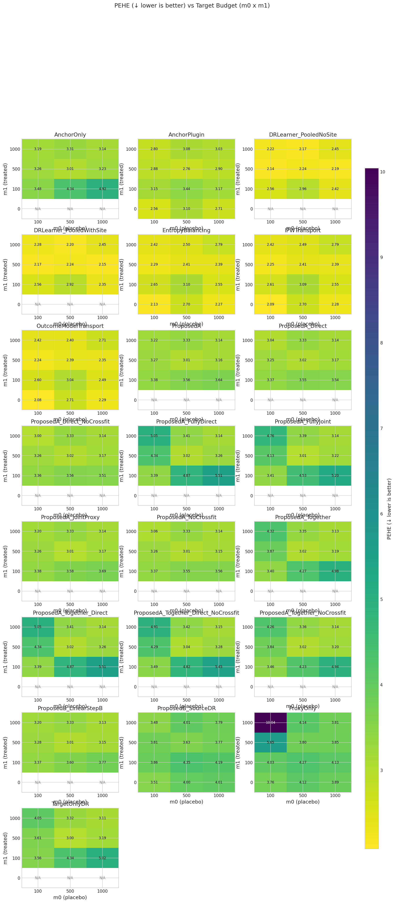

# Fair OptionB evaluation: m₀ × m₁ grid with controlled DGP

**Benchmark ID:** `gold_fair_sweep`

**Generated:** 2026-02-05 13:46

---

## 1. Motivation

**Research Question:** How does OptionB (ProposedB_SourceDR) perform when its assumptions are *approximately satisfied*?

**Why This Matters:**
- Previous sweeps used adversarial DGP settings (SNR < 1, AUC = 1.0, high drift)
- This led to "catastrophic failure" for OptionB that was structurally guaranteed
- This sweep uses **fair settings** where OptionB assumptions hold:
  - SNR ≥ 2 (cross-arm transfer signal present)
  - Overlap AUC ~ 0.75 (moderate, not degenerate)
  - Intercept drift controlled (σ_α = 0.5)

**Expected Behavior:**
- **ProposedB_SourceDR** should show moderate performance (not catastrophic failure)
- At m₁ = 0, ProposedB_SourceDR is the only Proposed variant that works
- As m₁ increases, ProposedA should outperform ProposedB variants
- The gap between ProposedA and ProposedB_SourceDR reflects the value of target treated data

---

## 2. Simulation Setup

**Fair DGP for OptionB Evaluation:**

Uses `FairSyntheticRCTConfig` with advisor-recommended settings:

**Cross-arm Transfer (A6):**
- `nontransfer_scale_target = 0.1` → SNR ≈ 3-4
- This means: ‖M*β₀‖ >> ‖ν‖ (transfer signal dominates)

**Covariate Overlap:**
- `overlap_lambda = 0.25` → AUC ≈ 0.75
- This means: Source models can generalize to target (not pure extrapolation)

**Intercept Drift:**
- `intercept_drift_scale = 0.5` → σ_α = 0.5
- This means: Arm means are stable across replications

**Outcome Model:**
$$\mu_{a,c}(x) = \alpha_{a,c} + x^\top b_a + x^\top \beta_{a,c} + \text{nonlin}(x)$$

where $\beta_{1,c} = M^* \beta_{0,c} + \nu_c$ with small $\nu_c$.

### Parameter Summary

| Parameter | Value | Description |
|-----------|-------|-------------|
| **Sweep param** | `m0` | [100, 500, 1000] |
| n_proxy_total | 20000 | Total source/proxy observations |
| C_sources | 10 | Number of source sites |
| nontransfer_scale | 0.1 | Scale of non-transferable component (σ) |
| use_fair_dgp | True | See documentation |
| overlap_lambda | 0.25 | See documentation |
| intercept_drift_scale | 0.5 | See documentation |

---

## 3. Metrics & Interpretation

| Metric | Direction | Description |
|--------|-----------|-------------|
| **PEHE (Precision in Estimating Heterogeneous Effects)** | ↓ lower is better | Root mean squared error of CATE predictions. Measures how accurately the estimat... |
| **ATE Absolute Error** | ↓ lower is better | Absolute difference between estimated and true average treatment effect.... |
| **ATE Bias (Signed)** | ↑ closer to 0 is better | Signed bias in ATE estimate. Positive = overestimate, negative = underestimate.... |
| **Spearman Rank Correlation** | ↑ higher is better | Rank correlation between predicted and true treatment effects.... |
| **Kendall Rank Correlation** | ↑ higher is better | Kendall tau-b correlation. More robust to ties than Spearman.... |
| **Qini AUC (Oracle)** | ↑ higher is better | Area under the Qini curve. Measures ranking quality for treatment targeting.... |
| **Top-10% Uplift Capture Ratio** | ↑ higher is better | Fraction of maximum uplift captured when treating top 10% by predicted CATE.... |
| **Top-20% Uplift Capture Ratio** | ↑ higher is better | Fraction of maximum uplift captured when treating top 20% by predicted CATE.... |
| **Top-30% Uplift Capture Ratio** | ↑ higher is better | Fraction of maximum uplift captured when treating top 30%.... |
| **Calibration Slope** | ↑ closer to 1 is better | Slope of regression of true τ on predicted τ̂. Ideal = 1.0.... |
| **Calibration R²** | ↑ higher is better | Variance explained by predictions. Measures calibration quality.... |
| **CATE ECE (Expected Calibration Error)** | ↓ lower is better | Expected calibration error for CATE. Binned average miscalibration.... |
| **Policy Value (Treat if τ̂ > 0)** | ↑ higher is better | Expected outcome under threshold-based treatment policy.... |
| **Policy Regret vs Oracle** | ↓ lower is better | Gap between oracle policy value and estimated policy value.... |
| **Policy Value (Treat Top 20%)** | ↑ higher is better | Expected outcome when treating top 20% by predicted CATE.... |
| **Policy Regret (Top 20% Budget)** | ↓ lower is better | Regret compared to oracle top-20% policy.... |
| **μ₀ RMSE (Control Outcome)** | ↓ lower is better | RMSE of predicted control outcomes. Measures nuisance estimation quality.... |

### Detailed Metric Definitions

**PEHE (Precision in Estimating Heterogeneous Effects)**

- Formula: $\sqrt{\frac{1}{n}\sum_i (\hat{\tau}(x_i) - \tau(x_i))^2}$
- Direction: **lower is better**
- A PEHE of 0.5 means predictions are off by 0.5 units on average.

**ATE Absolute Error**

- Formula: $|\hat{\text{ATE}} - \text{ATE}|$
- Direction: **lower is better**
- Important for policy decisions about whether to adopt treatment broadly.

**ATE Bias (Signed)**

- Formula: $\hat{\text{ATE}} - \text{ATE}$
- Direction: **closer to 0 is better**
- Shows systematic over/under-estimation tendencies.

**Spearman Rank Correlation**

- Formula: $\rho(\text{rank}(\hat{\tau}), \text{rank}(\tau))$
- Direction: **higher is better**
- 1.0 = perfect ranking, 0.0 = random. Critical for targeting interventions.

**Kendall Rank Correlation**

- Formula: $\tau_K(\hat{\tau}, \tau)$
- Direction: **higher is better**
- Alternative ranking metric; useful when ties are common.

**Qini AUC (Oracle)**

- Formula: Normalized AUC of cumulative uplift curve
- Direction: **higher is better**
- 1.0 = oracle ranking, 0.0 = random. Simulation-only metric using true τ.

**Top-10% Uplift Capture Ratio**

- Formula: $\frac{\bar{\tau}_{top10\%\ by\ \hat{\tau}}}{\bar{\tau}_{top10\%\ by\ \tau}}$
- Direction: **higher is better**
- 1.0 = oracle selection. Measures targeting efficiency for top patients.

**Top-20% Uplift Capture Ratio**

- Formula: $\frac{\bar{\tau}_{top20\%\ by\ \hat{\tau}}}{\bar{\tau}_{top20\%\ by\ \tau}}$
- Direction: **higher is better**
- 1.0 = oracle selection. Less stringent than top-10%.

**Top-30% Uplift Capture Ratio**

- Formula: $\frac{\bar{\tau}_{top30\%\ by\ \hat{\tau}}}{\bar{\tau}_{top30\%\ by\ \tau}}$
- Direction: **higher is better**
- Less stringent targeting metric.

**Calibration Slope**

- Formula: $\beta$ in $\tau = \alpha + \beta \hat{\tau}$
- Direction: **closer to 1 is better**
- <1 = overconfident predictions, >1 = underconfident.

**Calibration R²**

- Formula: $R^2$ of calibration regression
- Direction: **higher is better**
- Higher R² means predictions track true effects well.

**CATE ECE (Expected Calibration Error)**

- Formula: $\sum_b \frac{n_b}{n} |E[\tau | \hat{\tau} \in b] - E[\hat{\tau} | \hat{\tau} \in b]|$
- Direction: **lower is better**
- Lower ECE means better calibration across prediction ranges.

**Policy Value (Treat if τ̂ > 0)**

- Formula: $E[\mu_0 + \pi(\hat{\tau}) \cdot \tau]$ where $\pi(\hat{\tau}) = 1\{\hat{\tau} > 0\}$
- Direction: **higher is better**
- Higher value = better treatment decisions based on predictions.

**Policy Regret vs Oracle**

- Formula: $V(\pi^*) - V(\hat{\pi})$
- Direction: **lower is better**
- Lower regret = closer to optimal treatment decisions.

**Policy Value (Treat Top 20%)**

- Formula: $E[\mu_0 + \pi_{top20\%}(\hat{\tau}) \cdot \tau]$
- Direction: **higher is better**
- Budget-constrained policy evaluation.

**Policy Regret (Top 20% Budget)**

- Formula: $V(\pi^*_{top20\%}) - V(\hat{\pi}_{top20\%})$
- Direction: **lower is better**
- Budget-constrained regret.

**μ₀ RMSE (Control Outcome)**

- Formula: $\sqrt{\frac{1}{n}\sum_i (\hat{\mu}_0(x_i) - \mu_0(x_i))^2}$
- Direction: **lower is better**
- Important diagnostic; poor μ₀ estimation can propagate to CATE errors.

---

## 4. Methods Compared

| Method | Uses Target Placebo | Uses Source Data | Description |
|--------|---------------------|------------------|-------------|
| **TargetOnlyDR** | ✗ | ✗ | See documentation |
| **ProxyOnly** | ✗ | ✓ | Uses only source data, ignores target |
| **AnchorOnly** | ✓ | ✗ | Uses only target placebo data |
| **AnchorPlugin** | ✗ | ✗ | See documentation |
| **ProposedA** | ✓ | ✓ | Proposed: separate proxy + separate correction (residual) |
| **ProposedA_Together** | ✗ | ✗ | Proposed: separate proxy + joint correction (residual) |
| **ProposedA_JointProxy** | ✗ | ✗ | Proposed: joint proxy + separate correction (residual) |
| **ProposedA_FullyJoint** | ✗ | ✗ | Proposed: joint proxy + joint correction (residual) |
| **ProposedA_Direct** | ✗ | ✗ | Proposed: separate + direct fitting |
| **ProposedA_Together_Direct** | ✗ | ✗ | Proposed: joint correction + direct fitting |
| **ProposedA_FullyDirect** | ✗ | ✗ | Proposed: fully joint + direct fitting |
| **ProposedA_NoCrossfit** | ✗ | ✗ | Proposed: residual, no cross-fitting |
| **ProposedA_Direct_NoCrossfit** | ✗ | ✗ | Proposed: direct, no cross-fitting |
| **ProposedA_Together_NoCrossfit** | ✗ | ✗ | Proposed: joint + no cross-fitting |
| **ProposedA_Together_Direct_NoCrossfit** | ✗ | ✗ | Proposed: joint + direct + no cross-fitting |
| **ProposedB_LinearStepB** | ✓ | ✓ | Proposed (Option B): placebo-anchored with linear Step B |
| **ProposedB_SourceDR** | ✗ | ✗ | Proposed (Option B): source-DR for placebo-only target |
| **IPWTransport** | ✗ | ✗ | See documentation |
| **EntropyBalancing** | ✗ | ✗ | See documentation |
| **OutcomeModelTransport** | ✗ | ✗ | See documentation |
| **DRLearner_PooledWithSite** | ✗ | ✗ | See documentation |
| **DRLearner_PooledNoSite** | ✗ | ✗ | See documentation |

---

## 5. Experiment Summary

- **Sweep parameter:** `m0` ∈ [100, 500, 1000]
- **Monte Carlo replicates:** 10 per scenario
- **Methods evaluated:** 22
- **Total runs:** 2640

---

## 6. Results

### Best Methods (averaged across sweep)

| Metric | Best Method | Value | Direction |
|--------|-------------|-------|----------|
| PEHE | **OutcomeModelTransport** | 2.0790 | ↓ lower |
| ATE Error | **ProposedA_Together_NoCrossfit** | 0.0315 | ↓ lower |
| Spearman ρ | **ProxyOnly** | 0.3019 | ↑ higher |
| Kendall τ | **ProxyOnly** | 0.2059 | ↑ higher |
| Qini AUC | **ProxyOnly** | 0.3159 | ↑ higher |
| Top-10% Ratio | **ProxyOnly** | 0.3047 | ↑ higher |
| Top-20% Ratio | **ProxyOnly** | 0.2940 | ↑ higher |
| Calibration R² | **ProposedA_FullyDirect** | 0.0562 | ↑ higher |
| CATE ECE | **AnchorPlugin** | 0.4429 | ↓ lower |
| Policy Value | **ProxyOnly** | 0.6316 | ↑ higher |
| Policy Regret | **DRLearner_PooledNoSite** | 0.2244 | ↓ lower |

### Core Metrics

| m0 | m1 | Method | PEHE (↓) | ATE Err (↓) | Spearman (↑) | Qini (↑) |
|---|---|---|---|---|---|
| 100 | 0 | AnchorOnly | N/A | N/A | N/A | N/A |
| 100 | 0 | AnchorPlugin | 2.560 ± 0.478 | 0.637 ± 0.297 | 0.798 ± 0.077 | 0.810 ± 0.074 |
| 100 | 0 | DRLearner_PooledNoSite | N/A | N/A | N/A | N/A |
| 100 | 0 | DRLearner_PooledWithSite | N/A | N/A | N/A | N/A |
| 100 | 0 | EntropyBalancing | 2.132 ± 0.815 | 0.717 ± 0.650 | 0.862 ± 0.120 | 0.872 ± 0.114 |
| 100 | 0 | IPWTransport | 2.087 ± 0.826 | 0.716 ± 0.638 | 0.867 ± 0.119 | 0.877 ± 0.113 |
| 100 | 0 | OutcomeModelTransport | 2.079 ± 0.836 | 0.727 ± 0.643 | 0.869 ± 0.119 | 0.879 ± 0.114 |
| 100 | 0 | ProposedA | N/A | N/A | N/A | N/A |
| 100 | 0 | ProposedA_Direct | N/A | N/A | N/A | N/A |
| 100 | 0 | ProposedA_Direct_NoCrossfit | N/A | N/A | N/A | N/A |
| 100 | 0 | ProposedA_FullyDirect | N/A | N/A | N/A | N/A |
| 100 | 0 | ProposedA_FullyJoint | N/A | N/A | N/A | N/A |
| 100 | 0 | ProposedA_JointProxy | N/A | N/A | N/A | N/A |
| 100 | 0 | ProposedA_NoCrossfit | N/A | N/A | N/A | N/A |
| 100 | 0 | ProposedA_Together | N/A | N/A | N/A | N/A |
| 100 | 0 | ProposedA_Together_Direct | N/A | N/A | N/A | N/A |
| 100 | 0 | ProposedA_Together_Direct_NoCrossfit | N/A | N/A | N/A | N/A |
| 100 | 0 | ProposedA_Together_NoCrossfit | N/A | N/A | N/A | N/A |
| 100 | 0 | ProposedB_LinearStepB | N/A | N/A | N/A | N/A |
| 100 | 0 | ProposedB_SourceDR | 3.515 ± 0.351 | 0.976 ± 0.663 | 0.626 ± 0.081 | 0.642 ± 0.080 |
| 100 | 0 | ProxyOnly | 3.758 ± 0.386 | 0.704 ± 0.439 | 0.518 ± 0.083 | 0.535 ± 0.083 |
| 100 | 0 | TargetOnlyDR | N/A | N/A | N/A | N/A |
| 100 | 100 | AnchorOnly | 3.480 ± 0.487 | 0.438 ± 0.340 | 0.681 ± 0.076 | 0.697 ± 0.073 |
| 100 | 100 | AnchorPlugin | 3.145 ± 0.774 | 0.575 ± 0.344 | 0.699 ± 0.134 | 0.714 ± 0.131 |
| 100 | 100 | DRLearner_PooledNoSite | 2.564 ± 0.911 | 0.490 ± 0.559 | 0.802 ± 0.117 | 0.815 ± 0.112 |
| 100 | 100 | DRLearner_PooledWithSite | 2.557 ± 0.903 | 0.488 ± 0.556 | 0.804 ± 0.116 | 0.816 ± 0.111 |
| 100 | 100 | EntropyBalancing | 2.652 ± 0.951 | 0.507 ± 0.627 | 0.789 ± 0.124 | 0.802 ± 0.120 |
| 100 | 100 | IPWTransport | 2.614 ± 0.933 | 0.510 ± 0.595 | 0.795 ± 0.121 | 0.808 ± 0.116 |
| 100 | 100 | OutcomeModelTransport | 2.596 ± 0.926 | 0.505 ± 0.589 | 0.798 ± 0.120 | 0.810 ± 0.115 |
| 100 | 100 | ProposedA | 3.380 ± 0.449 | 0.327 ± 0.241 | 0.706 ± 0.062 | 0.722 ± 0.060 |
| 100 | 100 | ProposedA_Direct | 3.369 ± 0.482 | 0.326 ± 0.211 | 0.718 ± 0.068 | 0.733 ± 0.066 |
| 100 | 100 | ProposedA_Direct_NoCrossfit | 3.357 ± 0.467 | 0.307 ± 0.241 | 0.722 ± 0.068 | 0.736 ± 0.065 |
| 100 | 100 | ProposedA_FullyDirect | 3.393 ± 0.451 | 0.372 ± 0.218 | 0.720 ± 0.052 | 0.735 ± 0.048 |
| 100 | 100 | ProposedA_FullyJoint | 3.406 ± 0.448 | 0.374 ± 0.216 | 0.713 ± 0.062 | 0.728 ± 0.058 |
| 100 | 100 | ProposedA_JointProxy | 3.382 ± 0.485 | 0.318 ± 0.233 | 0.715 ± 0.075 | 0.729 ± 0.073 |
| 100 | 100 | ProposedA_NoCrossfit | 3.369 ± 0.458 | 0.313 ± 0.249 | 0.709 ± 0.066 | 0.724 ± 0.064 |
| 100 | 100 | ProposedA_Together | 3.396 ± 0.424 | 0.310 ± 0.248 | 0.709 ± 0.054 | 0.724 ± 0.051 |
| 100 | 100 | ProposedA_Together_Direct | 3.393 ± 0.451 | 0.372 ± 0.218 | 0.720 ± 0.052 | 0.735 ± 0.048 |
| 100 | 100 | ProposedA_Together_Direct_NoCrossfit | 3.493 ± 0.456 | 0.351 ± 0.234 | 0.714 ± 0.059 | 0.729 ± 0.056 |
| 100 | 100 | ProposedA_Together_NoCrossfit | 3.456 ± 0.451 | 0.328 ± 0.228 | 0.700 ± 0.056 | 0.715 ± 0.054 |
| 100 | 100 | ProposedB_LinearStepB | 3.369 ± 0.452 | 0.341 ± 0.313 | 0.714 ± 0.065 | 0.729 ± 0.063 |
| 100 | 100 | ProposedB_SourceDR | 3.860 ± 0.505 | 0.905 ± 0.721 | 0.573 ± 0.094 | 0.591 ± 0.094 |
| 100 | 100 | ProxyOnly | 4.030 ± 0.532 | 0.608 ± 0.363 | 0.477 ± 0.123 | 0.494 ± 0.126 |
| 100 | 100 | TargetOnlyDR | 3.558 ± 0.452 | 0.478 ± 0.266 | 0.647 ± 0.080 | 0.664 ± 0.077 |
| 100 | 500 | AnchorOnly | 3.260 ± 0.680 | 0.127 ± 0.078 | 0.721 ± 0.055 | 0.739 ± 0.052 |
| 100 | 500 | AnchorPlugin | 2.881 ± 0.614 | 0.622 ± 0.375 | 0.763 ± 0.079 | 0.777 ± 0.076 |
| 100 | 500 | DRLearner_PooledNoSite | 2.136 ± 0.829 | 0.541 ± 0.437 | 0.870 ± 0.093 | 0.880 ± 0.087 |
| 100 | 500 | DRLearner_PooledWithSite | 2.166 ± 0.844 | 0.557 ± 0.435 | 0.866 ± 0.096 | 0.876 ± 0.090 |
| 100 | 500 | EntropyBalancing | 2.292 ± 0.906 | 0.614 ± 0.415 | 0.847 ± 0.102 | 0.858 ± 0.097 |
| 100 | 500 | IPWTransport | 2.249 ± 0.886 | 0.627 ± 0.410 | 0.855 ± 0.101 | 0.865 ± 0.095 |
| 100 | 500 | OutcomeModelTransport | 2.240 ± 0.878 | 0.605 ± 0.465 | 0.857 ± 0.101 | 0.868 ± 0.096 |
| 100 | 500 | ProposedA | 3.268 ± 0.696 | 0.097 ± 0.075 | 0.716 ± 0.055 | 0.734 ± 0.052 |
| 100 | 500 | ProposedA_Direct | 3.249 ± 0.679 | 0.109 ± 0.080 | 0.722 ± 0.050 | 0.740 ± 0.048 |
| 100 | 500 | ProposedA_Direct_NoCrossfit | 3.256 ± 0.684 | 0.125 ± 0.074 | 0.718 ± 0.050 | 0.736 ± 0.047 |
| 100 | 500 | ProposedA_FullyDirect | 4.338 ± 1.031 | 0.355 ± 0.205 | 0.526 ± 0.043 | 0.546 ± 0.045 |
| 100 | 500 | ProposedA_FullyJoint | 4.134 ± 1.132 | 0.290 ± 0.181 | 0.559 ± 0.047 | 0.579 ± 0.046 |
| 100 | 500 | ProposedA_JointProxy | 3.265 ± 0.669 | 0.113 ± 0.066 | 0.714 ± 0.049 | 0.733 ± 0.047 |
| 100 | 500 | ProposedA_NoCrossfit | 3.262 ± 0.688 | 0.110 ± 0.077 | 0.711 ± 0.054 | 0.730 ± 0.051 |
| 100 | 500 | ProposedA_Together | 3.865 ± 0.960 | 0.217 ± 0.154 | 0.595 ± 0.047 | 0.615 ± 0.046 |
| 100 | 500 | ProposedA_Together_Direct | 4.338 ± 1.031 | 0.355 ± 0.205 | 0.526 ± 0.043 | 0.546 ± 0.045 |
| 100 | 500 | ProposedA_Together_Direct_NoCrossfit | 4.291 ± 0.971 | 0.347 ± 0.201 | 0.523 ± 0.047 | 0.543 ± 0.048 |
| 100 | 500 | ProposedA_Together_NoCrossfit | 3.843 ± 0.918 | 0.217 ± 0.166 | 0.591 ± 0.049 | 0.611 ± 0.048 |
| 100 | 500 | ProposedB_LinearStepB | 3.277 ± 0.688 | 0.116 ± 0.064 | 0.716 ± 0.056 | 0.734 ± 0.053 |
| 100 | 500 | ProposedB_SourceDR | 3.809 ± 0.705 | 0.843 ± 0.522 | 0.562 ± 0.104 | 0.581 ± 0.103 |
| 100 | 500 | ProxyOnly | 5.653 ± 1.246 | 2.357 ± 2.039 | 0.398 ± 0.079 | 0.415 ± 0.084 |
| 100 | 500 | TargetOnlyDR | 3.606 ± 0.743 | 0.175 ± 0.213 | 0.628 ± 0.071 | 0.648 ± 0.070 |
| 100 | 1000 | AnchorOnly | 3.190 ± 0.658 | 0.098 ± 0.078 | 0.696 ± 0.048 | 0.712 ± 0.048 |
| 100 | 1000 | AnchorPlugin | 2.801 ± 0.984 | 0.231 ± 0.389 | 0.726 ± 0.142 | 0.740 ± 0.142 |
| 100 | 1000 | DRLearner_PooledNoSite | 2.223 ± 1.080 | 0.429 ± 0.195 | 0.830 ± 0.142 | 0.841 ± 0.138 |
| 100 | 1000 | DRLearner_PooledWithSite | 2.280 ± 1.136 | 0.437 ± 0.230 | 0.820 ± 0.153 | 0.831 ± 0.149 |
| 100 | 1000 | EntropyBalancing | 2.416 ± 1.187 | 0.521 ± 0.252 | 0.803 ± 0.168 | 0.814 ± 0.165 |
| 100 | 1000 | IPWTransport | 2.416 ± 1.196 | 0.532 ± 0.255 | 0.802 ± 0.168 | 0.813 ± 0.164 |
| 100 | 1000 | OutcomeModelTransport | 2.423 ± 1.196 | 0.524 ± 0.271 | 0.800 ± 0.168 | 0.812 ± 0.164 |
| 100 | 1000 | ProposedA | 3.219 ± 0.639 | 0.122 ± 0.087 | 0.689 ± 0.047 | 0.706 ± 0.047 |
| 100 | 1000 | ProposedA_Direct | 3.038 ± 0.688 | 0.115 ± 0.103 | 0.736 ± 0.024 | 0.751 ± 0.023 |
| 100 | 1000 | ProposedA_Direct_NoCrossfit | 3.000 ± 0.698 | 0.131 ± 0.093 | 0.745 ± 0.027 | 0.760 ± 0.027 |
| 100 | 1000 | ProposedA_FullyDirect | 5.046 ± 0.985 | 0.486 ± 0.444 | 0.441 ± 0.065 | 0.454 ± 0.070 |
| 100 | 1000 | ProposedA_FullyJoint | 4.763 ± 0.920 | 0.447 ± 0.415 | 0.473 ± 0.074 | 0.488 ± 0.076 |
| 100 | 1000 | ProposedA_JointProxy | 3.195 ± 0.630 | 0.126 ± 0.110 | 0.697 ± 0.030 | 0.713 ± 0.032 |
| 100 | 1000 | ProposedA_NoCrossfit | 3.060 ± 0.667 | 0.127 ± 0.111 | 0.725 ± 0.034 | 0.741 ± 0.033 |
| 100 | 1000 | ProposedA_Together | 4.322 ± 0.841 | 0.394 ± 0.324 | 0.512 ± 0.055 | 0.528 ± 0.059 |
| 100 | 1000 | ProposedA_Together_Direct | 5.046 ± 0.985 | 0.486 ± 0.444 | 0.441 ± 0.065 | 0.454 ± 0.070 |
| 100 | 1000 | ProposedA_Together_Direct_NoCrossfit | 4.906 ± 0.955 | 0.472 ± 0.441 | 0.446 ± 0.064 | 0.462 ± 0.070 |
| 100 | 1000 | ProposedA_Together_NoCrossfit | 4.258 ± 0.810 | 0.383 ± 0.299 | 0.515 ± 0.061 | 0.532 ± 0.065 |
| 100 | 1000 | ProposedB_LinearStepB | 3.202 ± 0.641 | 0.121 ± 0.075 | 0.694 ± 0.044 | 0.710 ± 0.044 |
| 100 | 1000 | ProposedB_SourceDR | 3.478 ± 0.901 | 0.440 ± 0.324 | 0.581 ± 0.124 | 0.599 ± 0.126 |
| 100 | 1000 | ProxyOnly | 10.040 ± 3.480 | 4.172 ± 4.429 | 0.302 ± 0.137 | 0.316 ± 0.142 |
| 100 | 1000 | TargetOnlyDR | 4.054 ± 0.850 | 0.312 ± 0.281 | 0.551 ± 0.083 | 0.568 ± 0.085 |
| 500 | 0 | AnchorOnly | N/A | N/A | N/A | N/A |
| 500 | 0 | AnchorPlugin | 3.103 ± 0.541 | 1.026 ± 0.621 | 0.774 ± 0.066 | 0.788 ± 0.064 |
| 500 | 0 | DRLearner_PooledNoSite | N/A | N/A | N/A | N/A |
| 500 | 0 | DRLearner_PooledWithSite | N/A | N/A | N/A | N/A |
| 500 | 0 | EntropyBalancing | 2.698 ± 0.939 | 0.964 ± 0.751 | 0.830 ± 0.125 | 0.841 ± 0.122 |
| 500 | 0 | IPWTransport | 2.700 ± 0.934 | 0.971 ± 0.747 | 0.830 ± 0.124 | 0.841 ± 0.120 |
| 500 | 0 | OutcomeModelTransport | 2.709 ± 0.937 | 0.948 ± 0.768 | 0.829 ± 0.121 | 0.839 ± 0.118 |
| 500 | 0 | ProposedA | N/A | N/A | N/A | N/A |
| 500 | 0 | ProposedA_Direct | N/A | N/A | N/A | N/A |
| 500 | 0 | ProposedA_Direct_NoCrossfit | N/A | N/A | N/A | N/A |
| 500 | 0 | ProposedA_FullyDirect | N/A | N/A | N/A | N/A |
| 500 | 0 | ProposedA_FullyJoint | N/A | N/A | N/A | N/A |
| 500 | 0 | ProposedA_JointProxy | N/A | N/A | N/A | N/A |
| 500 | 0 | ProposedA_NoCrossfit | N/A | N/A | N/A | N/A |
| 500 | 0 | ProposedA_Together | N/A | N/A | N/A | N/A |
| 500 | 0 | ProposedA_Together_Direct | N/A | N/A | N/A | N/A |
| 500 | 0 | ProposedA_Together_Direct_NoCrossfit | N/A | N/A | N/A | N/A |
| 500 | 0 | ProposedA_Together_NoCrossfit | N/A | N/A | N/A | N/A |
| 500 | 0 | ProposedB_LinearStepB | N/A | N/A | N/A | N/A |
| 500 | 0 | ProposedB_SourceDR | 4.004 ± 0.681 | 1.106 ± 0.620 | 0.556 ± 0.134 | 0.572 ± 0.133 |
| 500 | 0 | ProxyOnly | 4.119 ± 0.613 | 1.419 ± 0.904 | 0.582 ± 0.080 | 0.599 ± 0.081 |
| 500 | 0 | TargetOnlyDR | N/A | N/A | N/A | N/A |
| 500 | 100 | AnchorOnly | 4.342 ± 1.223 | 0.352 ± 0.282 | 0.613 ± 0.076 | 0.629 ± 0.075 |
| 500 | 100 | AnchorPlugin | 3.445 ± 1.190 | 0.711 ± 0.669 | 0.734 ± 0.139 | 0.749 ± 0.135 |
| 500 | 100 | DRLearner_PooledNoSite | 2.964 ± 1.391 | 0.835 ± 0.639 | 0.811 ± 0.142 | 0.823 ± 0.136 |
| 500 | 100 | DRLearner_PooledWithSite | 2.921 ± 1.360 | 0.830 ± 0.614 | 0.817 ± 0.137 | 0.829 ± 0.131 |
| 500 | 100 | EntropyBalancing | 3.103 ± 1.373 | 0.903 ± 0.688 | 0.798 ± 0.146 | 0.811 ± 0.141 |
| 500 | 100 | IPWTransport | 3.094 ± 1.376 | 0.898 ± 0.688 | 0.799 ± 0.146 | 0.811 ± 0.141 |
| 500 | 100 | OutcomeModelTransport | 3.037 ± 1.404 | 0.918 ± 0.682 | 0.805 ± 0.145 | 0.817 ± 0.140 |
| 500 | 100 | ProposedA | 3.563 ± 0.811 | 0.196 ± 0.222 | 0.742 ± 0.035 | 0.757 ± 0.034 |
| 500 | 100 | ProposedA_Direct | 3.554 ± 0.822 | 0.187 ± 0.234 | 0.741 ± 0.029 | 0.756 ± 0.027 |
| 500 | 100 | ProposedA_Direct_NoCrossfit | 3.558 ± 0.830 | 0.185 ± 0.249 | 0.743 ± 0.029 | 0.758 ± 0.028 |
| 500 | 100 | ProposedA_FullyDirect | 4.866 ± 1.069 | 0.249 ± 0.247 | 0.528 ± 0.080 | 0.542 ± 0.078 |
| 500 | 100 | ProposedA_FullyJoint | 4.528 ± 1.050 | 0.245 ± 0.242 | 0.571 ± 0.064 | 0.585 ± 0.061 |
| 500 | 100 | ProposedA_JointProxy | 3.575 ± 0.817 | 0.185 ± 0.247 | 0.739 ± 0.030 | 0.753 ± 0.029 |
| 500 | 100 | ProposedA_NoCrossfit | 3.553 ± 0.827 | 0.208 ± 0.232 | 0.742 ± 0.031 | 0.757 ± 0.029 |
| 500 | 100 | ProposedA_Together | 4.268 ± 1.073 | 0.247 ± 0.227 | 0.606 ± 0.047 | 0.621 ± 0.045 |
| 500 | 100 | ProposedA_Together_Direct | 4.866 ± 1.069 | 0.249 ± 0.247 | 0.528 ± 0.080 | 0.542 ± 0.078 |
| 500 | 100 | ProposedA_Together_Direct_NoCrossfit | 4.816 ± 1.037 | 0.273 ± 0.231 | 0.537 ± 0.078 | 0.550 ± 0.075 |
| 500 | 100 | ProposedA_Together_NoCrossfit | 4.232 ± 1.091 | 0.262 ± 0.206 | 0.609 ± 0.050 | 0.624 ± 0.049 |
| 500 | 100 | ProposedB_LinearStepB | 3.596 ± 0.785 | 0.261 ± 0.216 | 0.736 ± 0.025 | 0.751 ± 0.025 |
| 500 | 100 | ProposedB_SourceDR | 4.348 ± 1.093 | 1.058 ± 0.687 | 0.564 ± 0.110 | 0.581 ± 0.108 |
| 500 | 100 | ProxyOnly | 4.266 ± 1.227 | 0.765 ± 0.730 | 0.589 ± 0.131 | 0.605 ± 0.130 |
| 500 | 100 | TargetOnlyDR | 4.344 ± 1.177 | 0.347 ± 0.274 | 0.611 ± 0.080 | 0.626 ± 0.079 |
| 500 | 500 | AnchorOnly | 3.014 ± 0.429 | 0.110 ± 0.087 | 0.754 ± 0.035 | 0.770 ± 0.030 |
| 500 | 500 | AnchorPlugin | 2.759 ± 0.730 | 0.642 ± 0.522 | 0.769 ± 0.140 | 0.783 ± 0.137 |
| 500 | 500 | DRLearner_PooledNoSite | 2.240 ± 0.675 | 0.749 ± 0.562 | 0.863 ± 0.096 | 0.874 ± 0.090 |
| 500 | 500 | DRLearner_PooledWithSite | 2.236 ± 0.676 | 0.747 ± 0.562 | 0.863 ± 0.096 | 0.874 ± 0.090 |
| 500 | 500 | EntropyBalancing | 2.410 ± 0.721 | 0.861 ± 0.631 | 0.843 ± 0.111 | 0.855 ± 0.105 |
| 500 | 500 | IPWTransport | 2.406 ± 0.724 | 0.869 ± 0.628 | 0.844 ± 0.111 | 0.856 ± 0.105 |
| 500 | 500 | OutcomeModelTransport | 2.385 ± 0.716 | 0.858 ± 0.642 | 0.848 ± 0.108 | 0.860 ± 0.103 |
| 500 | 500 | ProposedA | 3.013 ± 0.438 | 0.134 ± 0.096 | 0.755 ± 0.030 | 0.770 ± 0.026 |
| 500 | 500 | ProposedA_Direct | 3.020 ± 0.441 | 0.126 ± 0.084 | 0.751 ± 0.031 | 0.767 ± 0.027 |
| 500 | 500 | ProposedA_Direct_NoCrossfit | 3.021 ± 0.442 | 0.126 ± 0.084 | 0.750 ± 0.032 | 0.766 ± 0.027 |
| 500 | 500 | ProposedA_FullyDirect | 3.017 ± 0.437 | 0.125 ± 0.084 | 0.751 ± 0.029 | 0.768 ± 0.024 |
| 500 | 500 | ProposedA_FullyJoint | 3.010 ± 0.438 | 0.130 ± 0.087 | 0.755 ± 0.027 | 0.770 ± 0.024 |
| 500 | 500 | ProposedA_JointProxy | 3.012 ± 0.438 | 0.127 ± 0.090 | 0.754 ± 0.031 | 0.770 ± 0.027 |
| 500 | 500 | ProposedA_NoCrossfit | 3.013 ± 0.441 | 0.135 ± 0.092 | 0.755 ± 0.030 | 0.771 ± 0.026 |
| 500 | 500 | ProposedA_Together | 3.015 ± 0.436 | 0.136 ± 0.100 | 0.754 ± 0.028 | 0.770 ± 0.025 |
| 500 | 500 | ProposedA_Together_Direct | 3.017 ± 0.437 | 0.125 ± 0.084 | 0.751 ± 0.029 | 0.768 ± 0.024 |
| 500 | 500 | ProposedA_Together_Direct_NoCrossfit | 3.043 ± 0.448 | 0.128 ± 0.074 | 0.751 ± 0.029 | 0.768 ± 0.024 |
| 500 | 500 | ProposedA_Together_NoCrossfit | 3.023 ± 0.441 | 0.134 ± 0.094 | 0.755 ± 0.028 | 0.771 ± 0.025 |
| 500 | 500 | ProposedB_LinearStepB | 3.014 ± 0.452 | 0.128 ± 0.108 | 0.753 ± 0.031 | 0.770 ± 0.026 |
| 500 | 500 | ProposedB_SourceDR | 3.625 ± 0.543 | 0.660 ± 0.719 | 0.589 ± 0.098 | 0.605 ± 0.095 |
| 500 | 500 | ProxyOnly | 3.796 ± 0.677 | 1.101 ± 0.515 | 0.556 ± 0.174 | 0.570 ± 0.176 |
| 500 | 500 | TargetOnlyDR | 3.004 ± 0.431 | 0.119 ± 0.104 | 0.757 ± 0.028 | 0.773 ± 0.023 |
| 500 | 1000 | AnchorOnly | 3.313 ± 0.586 | 0.116 ± 0.059 | 0.728 ± 0.033 | 0.745 ± 0.032 |
| 500 | 1000 | AnchorPlugin | 3.078 ± 0.821 | 0.735 ± 0.683 | 0.746 ± 0.135 | 0.759 ± 0.134 |
| 500 | 1000 | DRLearner_PooledNoSite | 2.168 ± 1.032 | 0.590 ± 0.475 | 0.866 ± 0.119 | 0.875 ± 0.116 |
| 500 | 1000 | DRLearner_PooledWithSite | 2.200 ± 1.047 | 0.606 ± 0.491 | 0.863 ± 0.123 | 0.871 ± 0.120 |
| 500 | 1000 | EntropyBalancing | 2.496 ± 1.242 | 0.819 ± 0.690 | 0.828 ± 0.168 | 0.837 ± 0.166 |
| 500 | 1000 | IPWTransport | 2.488 ± 1.234 | 0.828 ± 0.696 | 0.830 ± 0.164 | 0.839 ± 0.162 |
| 500 | 1000 | OutcomeModelTransport | 2.404 ± 1.172 | 0.747 ± 0.639 | 0.839 ± 0.146 | 0.848 ± 0.144 |
| 500 | 1000 | ProposedA | 3.327 ± 0.601 | 0.125 ± 0.059 | 0.720 ± 0.032 | 0.737 ± 0.031 |
| 500 | 1000 | ProposedA_Direct | 3.334 ± 0.601 | 0.115 ± 0.070 | 0.717 ± 0.032 | 0.734 ± 0.031 |
| 500 | 1000 | ProposedA_Direct_NoCrossfit | 3.333 ± 0.601 | 0.115 ± 0.073 | 0.717 ± 0.032 | 0.734 ± 0.031 |
| 500 | 1000 | ProposedA_FullyDirect | 3.405 ± 0.603 | 0.164 ± 0.082 | 0.694 ± 0.030 | 0.712 ± 0.029 |
| 500 | 1000 | ProposedA_FullyJoint | 3.386 ± 0.600 | 0.161 ± 0.075 | 0.699 ± 0.036 | 0.717 ± 0.034 |
| 500 | 1000 | ProposedA_JointProxy | 3.328 ± 0.606 | 0.122 ± 0.063 | 0.719 ± 0.033 | 0.736 ± 0.033 |
| 500 | 1000 | ProposedA_NoCrossfit | 3.326 ± 0.600 | 0.123 ± 0.063 | 0.720 ± 0.032 | 0.737 ± 0.031 |
| 500 | 1000 | ProposedA_Together | 3.349 ± 0.607 | 0.161 ± 0.073 | 0.709 ± 0.034 | 0.727 ± 0.032 |
| 500 | 1000 | ProposedA_Together_Direct | 3.405 ± 0.603 | 0.164 ± 0.082 | 0.694 ± 0.030 | 0.712 ± 0.029 |
| 500 | 1000 | ProposedA_Together_Direct_NoCrossfit | 3.418 ± 0.611 | 0.163 ± 0.082 | 0.694 ± 0.032 | 0.712 ± 0.031 |
| 500 | 1000 | ProposedA_Together_NoCrossfit | 3.362 ± 0.605 | 0.162 ± 0.081 | 0.708 ± 0.036 | 0.725 ± 0.035 |
| 500 | 1000 | ProposedB_LinearStepB | 3.327 ± 0.603 | 0.113 ± 0.058 | 0.720 ± 0.032 | 0.736 ± 0.031 |
| 500 | 1000 | ProposedB_SourceDR | 4.009 ± 0.773 | 1.004 ± 0.824 | 0.548 ± 0.101 | 0.566 ± 0.103 |
| 500 | 1000 | ProxyOnly | 4.145 ± 0.768 | 1.001 ± 0.847 | 0.491 ± 0.123 | 0.506 ± 0.127 |
| 500 | 1000 | TargetOnlyDR | 3.320 ± 0.578 | 0.110 ± 0.072 | 0.726 ± 0.028 | 0.743 ± 0.027 |
| 1000 | 0 | AnchorOnly | N/A | N/A | N/A | N/A |
| 1000 | 0 | AnchorPlugin | 2.711 ± 0.663 | 0.749 ± 0.704 | 0.822 ± 0.067 | 0.833 ± 0.065 |
| 1000 | 0 | DRLearner_PooledNoSite | N/A | N/A | N/A | N/A |
| 1000 | 0 | DRLearner_PooledWithSite | N/A | N/A | N/A | N/A |
| 1000 | 0 | EntropyBalancing | 2.273 ± 0.736 | 0.806 ± 0.520 | 0.875 ± 0.068 | 0.884 ± 0.064 |
| 1000 | 0 | IPWTransport | 2.276 ± 0.739 | 0.803 ± 0.516 | 0.875 ± 0.069 | 0.883 ± 0.065 |
| 1000 | 0 | OutcomeModelTransport | 2.292 ± 0.769 | 0.824 ± 0.556 | 0.874 ± 0.071 | 0.882 ± 0.068 |
| 1000 | 0 | ProposedA | N/A | N/A | N/A | N/A |
| 1000 | 0 | ProposedA_Direct | N/A | N/A | N/A | N/A |
| 1000 | 0 | ProposedA_Direct_NoCrossfit | N/A | N/A | N/A | N/A |
| 1000 | 0 | ProposedA_FullyDirect | N/A | N/A | N/A | N/A |
| 1000 | 0 | ProposedA_FullyJoint | N/A | N/A | N/A | N/A |
| 1000 | 0 | ProposedA_JointProxy | N/A | N/A | N/A | N/A |
| 1000 | 0 | ProposedA_NoCrossfit | N/A | N/A | N/A | N/A |
| 1000 | 0 | ProposedA_Together | N/A | N/A | N/A | N/A |
| 1000 | 0 | ProposedA_Together_Direct | N/A | N/A | N/A | N/A |
| 1000 | 0 | ProposedA_Together_Direct_NoCrossfit | N/A | N/A | N/A | N/A |
| 1000 | 0 | ProposedA_Together_NoCrossfit | N/A | N/A | N/A | N/A |
| 1000 | 0 | ProposedB_LinearStepB | N/A | N/A | N/A | N/A |
| 1000 | 0 | ProposedB_SourceDR | 4.008 ± 0.494 | 1.207 ± 0.755 | 0.569 ± 0.059 | 0.585 ± 0.059 |
| 1000 | 0 | ProxyOnly | 3.893 ± 0.546 | 0.979 ± 0.758 | 0.608 ± 0.096 | 0.623 ± 0.096 |
| 1000 | 0 | TargetOnlyDR | N/A | N/A | N/A | N/A |
| 1000 | 100 | AnchorOnly | 4.920 ± 1.788 | 0.346 ± 0.498 | 0.569 ± 0.064 | 0.588 ± 0.066 |
| 1000 | 100 | AnchorPlugin | 3.172 ± 1.283 | 0.608 ± 0.334 | 0.777 ± 0.117 | 0.790 ± 0.113 |
| 1000 | 100 | DRLearner_PooledNoSite | 2.416 ± 1.572 | 0.443 ± 0.270 | 0.861 ± 0.124 | 0.871 ± 0.117 |
| 1000 | 100 | DRLearner_PooledWithSite | 2.352 ± 1.525 | 0.432 ± 0.319 | 0.871 ± 0.114 | 0.880 ± 0.107 |
| 1000 | 100 | EntropyBalancing | 2.546 ± 1.592 | 0.538 ± 0.372 | 0.849 ± 0.131 | 0.859 ± 0.124 |
| 1000 | 100 | IPWTransport | 2.554 ± 1.592 | 0.538 ± 0.373 | 0.848 ± 0.131 | 0.859 ± 0.124 |
| 1000 | 100 | OutcomeModelTransport | 2.489 ± 1.600 | 0.539 ± 0.372 | 0.855 ± 0.130 | 0.866 ± 0.122 |
| 1000 | 100 | ProposedA | 3.643 ± 0.912 | 0.133 ± 0.053 | 0.709 ± 0.047 | 0.725 ± 0.045 |
| 1000 | 100 | ProposedA_Direct | 3.538 ± 0.922 | 0.111 ± 0.083 | 0.731 ± 0.043 | 0.748 ± 0.041 |
| 1000 | 100 | ProposedA_Direct_NoCrossfit | 3.512 ± 0.925 | 0.105 ± 0.086 | 0.736 ± 0.042 | 0.752 ± 0.040 |
| 1000 | 100 | ProposedA_FullyDirect | 5.506 ± 1.615 | 0.553 ± 0.615 | 0.483 ± 0.047 | 0.499 ± 0.048 |
| 1000 | 100 | ProposedA_FullyJoint | 5.202 ± 1.593 | 0.401 ± 0.550 | 0.527 ± 0.060 | 0.544 ± 0.060 |
| 1000 | 100 | ProposedA_JointProxy | 3.689 ± 0.913 | 0.109 ± 0.077 | 0.700 ± 0.050 | 0.717 ± 0.047 |
| 1000 | 100 | ProposedA_NoCrossfit | 3.559 ± 0.900 | 0.116 ± 0.078 | 0.725 ± 0.041 | 0.741 ± 0.040 |
| 1000 | 100 | ProposedA_Together | 4.977 ± 1.731 | 0.352 ± 0.498 | 0.557 ± 0.071 | 0.573 ± 0.072 |
| 1000 | 100 | ProposedA_Together_Direct | 5.506 ± 1.615 | 0.553 ± 0.615 | 0.483 ± 0.047 | 0.499 ± 0.048 |
| 1000 | 100 | ProposedA_Together_Direct_NoCrossfit | 5.450 ± 1.592 | 0.558 ± 0.636 | 0.484 ± 0.041 | 0.500 ± 0.043 |
| 1000 | 100 | ProposedA_Together_NoCrossfit | 4.938 ± 1.705 | 0.350 ± 0.506 | 0.562 ± 0.071 | 0.578 ± 0.073 |
| 1000 | 100 | ProposedB_LinearStepB | 3.766 ± 1.018 | 0.167 ± 0.097 | 0.688 ± 0.042 | 0.706 ± 0.040 |
| 1000 | 100 | ProposedB_SourceDR | 4.194 ± 1.398 | 0.868 ± 0.578 | 0.602 ± 0.115 | 0.617 ± 0.115 |
| 1000 | 100 | ProxyOnly | 4.129 ± 1.284 | 0.682 ± 0.391 | 0.644 ± 0.086 | 0.659 ± 0.088 |
| 1000 | 100 | TargetOnlyDR | 5.016 ± 1.517 | 0.398 ± 0.450 | 0.547 ± 0.058 | 0.564 ± 0.058 |
| 1000 | 500 | AnchorOnly | 3.232 ± 0.537 | 0.078 ± 0.064 | 0.743 ± 0.041 | 0.755 ± 0.041 |
| 1000 | 500 | AnchorPlugin | 2.902 ± 0.693 | 0.722 ± 0.460 | 0.782 ± 0.086 | 0.795 ± 0.082 |
| 1000 | 500 | DRLearner_PooledNoSite | 2.192 ± 0.978 | 0.705 ± 0.340 | 0.880 ± 0.120 | 0.888 ± 0.114 |
| 1000 | 500 | DRLearner_PooledWithSite | 2.150 ± 0.964 | 0.675 ± 0.314 | 0.883 ± 0.117 | 0.891 ± 0.111 |
| 1000 | 500 | EntropyBalancing | 2.391 ± 1.049 | 0.848 ± 0.393 | 0.860 ± 0.130 | 0.869 ± 0.124 |
| 1000 | 500 | IPWTransport | 2.390 ± 1.047 | 0.845 ± 0.391 | 0.860 ± 0.129 | 0.870 ± 0.123 |
| 1000 | 500 | OutcomeModelTransport | 2.352 ± 1.047 | 0.858 ± 0.419 | 0.866 ± 0.131 | 0.875 ± 0.126 |
| 1000 | 500 | ProposedA | 3.158 ± 0.504 | 0.052 ± 0.057 | 0.758 ± 0.028 | 0.768 ± 0.028 |
| 1000 | 500 | ProposedA_Direct | 3.170 ± 0.510 | 0.039 ± 0.050 | 0.751 ± 0.030 | 0.763 ± 0.030 |
| 1000 | 500 | ProposedA_Direct_NoCrossfit | 3.171 ± 0.510 | 0.039 ± 0.048 | 0.751 ± 0.031 | 0.763 ± 0.030 |
| 1000 | 500 | ProposedA_FullyDirect | 3.262 ± 0.503 | 0.066 ± 0.053 | 0.733 ± 0.058 | 0.746 ± 0.057 |
| 1000 | 500 | ProposedA_FullyJoint | 3.224 ± 0.509 | 0.053 ± 0.049 | 0.743 ± 0.044 | 0.755 ± 0.043 |
| 1000 | 500 | ProposedA_JointProxy | 3.173 ± 0.504 | 0.056 ± 0.067 | 0.752 ± 0.025 | 0.763 ± 0.025 |
| 1000 | 500 | ProposedA_NoCrossfit | 3.154 ± 0.503 | 0.052 ± 0.058 | 0.757 ± 0.026 | 0.769 ± 0.027 |
| 1000 | 500 | ProposedA_Together | 3.195 ± 0.510 | 0.036 ± 0.033 | 0.750 ± 0.042 | 0.762 ± 0.041 |
| 1000 | 500 | ProposedA_Together_Direct | 3.262 ± 0.503 | 0.066 ± 0.053 | 0.733 ± 0.058 | 0.746 ± 0.057 |
| 1000 | 500 | ProposedA_Together_Direct_NoCrossfit | 3.275 ± 0.508 | 0.065 ± 0.053 | 0.734 ± 0.057 | 0.746 ± 0.056 |
| 1000 | 500 | ProposedA_Together_NoCrossfit | 3.201 ± 0.520 | 0.031 ± 0.032 | 0.751 ± 0.040 | 0.763 ± 0.039 |
| 1000 | 500 | ProposedB_LinearStepB | 3.152 ± 0.512 | 0.050 ± 0.042 | 0.759 ± 0.027 | 0.771 ± 0.026 |
| 1000 | 500 | ProposedB_SourceDR | 3.769 ± 0.777 | 0.928 ± 0.430 | 0.609 ± 0.108 | 0.623 ± 0.106 |
| 1000 | 500 | ProxyOnly | 3.846 ± 0.759 | 0.651 ± 0.565 | 0.580 ± 0.131 | 0.593 ± 0.131 |
| 1000 | 500 | TargetOnlyDR | 3.190 ± 0.507 | 0.087 ± 0.068 | 0.748 ± 0.047 | 0.761 ± 0.046 |
| 1000 | 1000 | AnchorOnly | 3.140 ± 0.768 | 0.127 ± 0.089 | 0.743 ± 0.022 | 0.758 ± 0.020 |
| 1000 | 1000 | AnchorPlugin | 3.026 ± 1.335 | 0.561 ± 0.363 | 0.731 ± 0.165 | 0.744 ± 0.167 |
| 1000 | 1000 | DRLearner_PooledNoSite | 2.448 ± 1.485 | 0.465 ± 0.251 | 0.823 ± 0.176 | 0.831 ± 0.174 |
| 1000 | 1000 | DRLearner_PooledWithSite | 2.452 ± 1.491 | 0.464 ± 0.251 | 0.822 ± 0.177 | 0.830 ± 0.176 |
| 1000 | 1000 | EntropyBalancing | 2.787 ± 1.645 | 0.609 ± 0.361 | 0.772 ± 0.221 | 0.781 ± 0.222 |
| 1000 | 1000 | IPWTransport | 2.792 ± 1.642 | 0.615 ± 0.360 | 0.771 ± 0.221 | 0.781 ± 0.222 |
| 1000 | 1000 | OutcomeModelTransport | 2.712 ± 1.641 | 0.593 ± 0.330 | 0.782 ± 0.219 | 0.791 ± 0.219 |
| 1000 | 1000 | ProposedA | 3.137 ± 0.775 | 0.102 ± 0.056 | 0.736 ± 0.034 | 0.751 ± 0.031 |
| 1000 | 1000 | ProposedA_Direct | 3.143 ± 0.775 | 0.108 ± 0.062 | 0.733 ± 0.031 | 0.749 ± 0.029 |
| 1000 | 1000 | ProposedA_Direct_NoCrossfit | 3.143 ± 0.773 | 0.107 ± 0.062 | 0.733 ± 0.031 | 0.749 ± 0.028 |
| 1000 | 1000 | ProposedA_FullyDirect | 3.141 ± 0.771 | 0.104 ± 0.061 | 0.734 ± 0.030 | 0.750 ± 0.028 |
| 1000 | 1000 | ProposedA_FullyJoint | 3.140 ± 0.776 | 0.114 ± 0.062 | 0.736 ± 0.034 | 0.751 ± 0.032 |
| 1000 | 1000 | ProposedA_JointProxy | 3.143 ± 0.778 | 0.110 ± 0.063 | 0.735 ± 0.033 | 0.750 ± 0.031 |
| 1000 | 1000 | ProposedA_NoCrossfit | 3.136 ± 0.775 | 0.100 ± 0.056 | 0.737 ± 0.034 | 0.752 ± 0.031 |
| 1000 | 1000 | ProposedA_Together | 3.131 ± 0.778 | 0.104 ± 0.063 | 0.737 ± 0.033 | 0.753 ± 0.031 |
| 1000 | 1000 | ProposedA_Together_Direct | 3.141 ± 0.771 | 0.104 ± 0.061 | 0.734 ± 0.030 | 0.750 ± 0.028 |
| 1000 | 1000 | ProposedA_Together_Direct_NoCrossfit | 3.152 ± 0.775 | 0.100 ± 0.063 | 0.734 ± 0.031 | 0.749 ± 0.029 |
| 1000 | 1000 | ProposedA_Together_NoCrossfit | 3.140 ± 0.779 | 0.103 ± 0.064 | 0.736 ± 0.033 | 0.752 ± 0.031 |
| 1000 | 1000 | ProposedB_LinearStepB | 3.126 ± 0.770 | 0.102 ± 0.060 | 0.742 ± 0.030 | 0.757 ± 0.028 |
| 1000 | 1000 | ProposedB_SourceDR | 3.793 ± 1.147 | 0.861 ± 0.292 | 0.568 ± 0.155 | 0.581 ± 0.163 |
| 1000 | 1000 | ProxyOnly | 3.810 ± 1.112 | 0.770 ± 0.556 | 0.547 ± 0.150 | 0.562 ± 0.155 |
| 1000 | 1000 | TargetOnlyDR | 3.113 ± 0.784 | 0.121 ± 0.081 | 0.745 ± 0.026 | 0.760 ± 0.025 |

### Targeting / Ranking Metrics

| m0 | m1 | Method | Top-10% (↑) | Top-20% (↑) | Kendall (↑) |
|---|---|---|---|---|---|
| 100 | 0 | AnchorOnly | N/A | N/A | N/A |
| 100 | 0 | AnchorPlugin | 0.801 ± 0.063 | 0.797 ± 0.063 | 0.608 ± 0.080 |
| 100 | 0 | DRLearner_PooledNoSite | N/A | N/A | N/A |
| 100 | 0 | DRLearner_PooledWithSite | N/A | N/A | N/A |
| 100 | 0 | EntropyBalancing | 0.879 ± 0.089 | 0.880 ± 0.087 | 0.699 ± 0.137 |
| 100 | 0 | IPWTransport | 0.886 ± 0.084 | 0.884 ± 0.086 | 0.706 ± 0.136 |
| 100 | 0 | OutcomeModelTransport | 0.883 ± 0.086 | 0.886 ± 0.085 | 0.708 ± 0.136 |
| 100 | 0 | ProposedA | N/A | N/A | N/A |
| 100 | 0 | ProposedA_Direct | N/A | N/A | N/A |
| 100 | 0 | ProposedA_Direct_NoCrossfit | N/A | N/A | N/A |
| 100 | 0 | ProposedA_FullyDirect | N/A | N/A | N/A |
| 100 | 0 | ProposedA_FullyJoint | N/A | N/A | N/A |
| 100 | 0 | ProposedA_JointProxy | N/A | N/A | N/A |
| 100 | 0 | ProposedA_NoCrossfit | N/A | N/A | N/A |
| 100 | 0 | ProposedA_Together | N/A | N/A | N/A |
| 100 | 0 | ProposedA_Together_Direct | N/A | N/A | N/A |
| 100 | 0 | ProposedA_Together_Direct_NoCrossfit | N/A | N/A | N/A |
| 100 | 0 | ProposedA_Together_NoCrossfit | N/A | N/A | N/A |
| 100 | 0 | ProposedB_LinearStepB | N/A | N/A | N/A |
| 100 | 0 | ProposedB_SourceDR | 0.617 ± 0.094 | 0.618 ± 0.121 | 0.447 ± 0.065 |
| 100 | 0 | ProxyOnly | 0.517 ± 0.118 | 0.490 ± 0.175 | 0.362 ± 0.061 |
| 100 | 0 | TargetOnlyDR | N/A | N/A | N/A |
| 100 | 100 | AnchorOnly | 0.683 ± 0.092 | 0.671 ± 0.137 | 0.495 ± 0.066 |
| 100 | 100 | AnchorPlugin | 0.698 ± 0.164 | 0.675 ± 0.207 | 0.519 ± 0.128 |
| 100 | 100 | DRLearner_PooledNoSite | 0.800 ± 0.162 | 0.794 ± 0.193 | 0.626 ± 0.136 |
| 100 | 100 | DRLearner_PooledWithSite | 0.801 ± 0.161 | 0.795 ± 0.190 | 0.627 ± 0.135 |
| 100 | 100 | EntropyBalancing | 0.782 ± 0.178 | 0.770 ± 0.222 | 0.612 ± 0.141 |
| 100 | 100 | IPWTransport | 0.786 ± 0.189 | 0.785 ± 0.201 | 0.618 ± 0.139 |
| 100 | 100 | OutcomeModelTransport | 0.793 ± 0.171 | 0.789 ± 0.195 | 0.621 ± 0.138 |
| 100 | 100 | ProposedA | 0.705 ± 0.104 | 0.707 ± 0.113 | 0.517 ± 0.057 |
| 100 | 100 | ProposedA_Direct | 0.702 ± 0.134 | 0.700 ± 0.131 | 0.529 ± 0.062 |
| 100 | 100 | ProposedA_Direct_NoCrossfit | 0.702 ± 0.126 | 0.701 ± 0.122 | 0.532 ± 0.063 |
| 100 | 100 | ProposedA_FullyDirect | 0.721 ± 0.089 | 0.724 ± 0.097 | 0.529 ± 0.048 |
| 100 | 100 | ProposedA_FullyJoint | 0.714 ± 0.105 | 0.704 ± 0.121 | 0.523 ± 0.056 |
| 100 | 100 | ProposedA_JointProxy | 0.697 ± 0.135 | 0.683 ± 0.154 | 0.527 ± 0.069 |
| 100 | 100 | ProposedA_NoCrossfit | 0.706 ± 0.121 | 0.703 ± 0.137 | 0.521 ± 0.060 |
| 100 | 100 | ProposedA_Together | 0.712 ± 0.117 | 0.703 ± 0.125 | 0.519 ± 0.050 |
| 100 | 100 | ProposedA_Together_Direct | 0.721 ± 0.089 | 0.724 ± 0.097 | 0.529 ± 0.048 |
| 100 | 100 | ProposedA_Together_Direct_NoCrossfit | 0.683 ± 0.122 | 0.707 ± 0.125 | 0.523 ± 0.053 |
| 100 | 100 | ProposedA_Together_NoCrossfit | 0.683 ± 0.125 | 0.679 ± 0.148 | 0.511 ± 0.050 |
| 100 | 100 | ProposedB_LinearStepB | 0.703 ± 0.117 | 0.689 ± 0.134 | 0.525 ± 0.059 |
| 100 | 100 | ProposedB_SourceDR | 0.564 ± 0.176 | 0.542 ± 0.253 | 0.405 ± 0.074 |
| 100 | 100 | ProxyOnly | 0.434 ± 0.322 | 0.414 ± 0.334 | 0.333 ± 0.093 |
| 100 | 100 | TargetOnlyDR | 0.674 ± 0.094 | 0.657 ± 0.135 | 0.467 ± 0.068 |
| 100 | 500 | AnchorOnly | 0.735 ± 0.077 | 0.705 ± 0.120 | 0.531 ± 0.048 |
| 100 | 500 | AnchorPlugin | 0.751 ± 0.100 | 0.755 ± 0.129 | 0.572 ± 0.078 |
| 100 | 500 | DRLearner_PooledNoSite | 0.878 ± 0.081 | 0.879 ± 0.083 | 0.705 ± 0.120 |
| 100 | 500 | DRLearner_PooledWithSite | 0.872 ± 0.084 | 0.874 ± 0.087 | 0.700 ± 0.122 |
| 100 | 500 | EntropyBalancing | 0.859 ± 0.099 | 0.856 ± 0.102 | 0.678 ± 0.130 |
| 100 | 500 | IPWTransport | 0.865 ± 0.090 | 0.864 ± 0.092 | 0.687 ± 0.128 |
| 100 | 500 | OutcomeModelTransport | 0.867 ± 0.089 | 0.869 ± 0.090 | 0.690 ± 0.127 |
| 100 | 500 | ProposedA | 0.730 ± 0.093 | 0.714 ± 0.105 | 0.526 ± 0.047 |
| 100 | 500 | ProposedA_Direct | 0.748 ± 0.074 | 0.706 ± 0.136 | 0.531 ± 0.044 |
| 100 | 500 | ProposedA_Direct_NoCrossfit | 0.756 ± 0.068 | 0.708 ± 0.112 | 0.528 ± 0.044 |
| 100 | 500 | ProposedA_FullyDirect | 0.411 ± 0.200 | 0.473 ± 0.217 | 0.369 ± 0.033 |
| 100 | 500 | ProposedA_FullyJoint | 0.487 ± 0.159 | 0.537 ± 0.182 | 0.395 ± 0.037 |
| 100 | 500 | ProposedA_JointProxy | 0.751 ± 0.065 | 0.703 ± 0.121 | 0.525 ± 0.042 |
| 100 | 500 | ProposedA_NoCrossfit | 0.749 ± 0.084 | 0.713 ± 0.109 | 0.522 ± 0.046 |
| 100 | 500 | ProposedA_Together | 0.539 ± 0.144 | 0.577 ± 0.161 | 0.423 ± 0.037 |
| 100 | 500 | ProposedA_Together_Direct | 0.411 ± 0.200 | 0.473 ± 0.217 | 0.369 ± 0.033 |
| 100 | 500 | ProposedA_Together_Direct_NoCrossfit | 0.421 ± 0.186 | 0.469 ± 0.214 | 0.367 ± 0.035 |
| 100 | 500 | ProposedA_Together_NoCrossfit | 0.554 ± 0.128 | 0.588 ± 0.157 | 0.420 ± 0.039 |
| 100 | 500 | ProposedB_LinearStepB | 0.739 ± 0.079 | 0.709 ± 0.103 | 0.526 ± 0.048 |
| 100 | 500 | ProposedB_SourceDR | 0.550 ± 0.087 | 0.548 ± 0.108 | 0.397 ± 0.082 |
| 100 | 500 | ProxyOnly | 0.336 ± 0.297 | 0.294 ± 0.373 | 0.273 ± 0.057 |
| 100 | 500 | TargetOnlyDR | 0.628 ± 0.122 | 0.605 ± 0.171 | 0.451 ± 0.058 |
| 100 | 1000 | AnchorOnly | 0.707 ± 0.074 | 0.708 ± 0.064 | 0.507 ± 0.041 |
| 100 | 1000 | AnchorPlugin | 0.736 ± 0.163 | 0.739 ± 0.158 | 0.545 ± 0.131 |
| 100 | 1000 | DRLearner_PooledNoSite | 0.837 ± 0.149 | 0.836 ± 0.151 | 0.662 ± 0.153 |
| 100 | 1000 | DRLearner_PooledWithSite | 0.825 ± 0.164 | 0.828 ± 0.161 | 0.652 ± 0.161 |
| 100 | 1000 | EntropyBalancing | 0.813 ± 0.176 | 0.814 ± 0.171 | 0.634 ± 0.169 |
| 100 | 1000 | IPWTransport | 0.805 ± 0.178 | 0.813 ± 0.173 | 0.633 ± 0.170 |
| 100 | 1000 | OutcomeModelTransport | 0.806 ± 0.178 | 0.811 ± 0.173 | 0.632 ± 0.170 |
| 100 | 1000 | ProposedA | 0.705 ± 0.079 | 0.703 ± 0.074 | 0.502 ± 0.040 |
| 100 | 1000 | ProposedA_Direct | 0.740 ± 0.041 | 0.739 ± 0.038 | 0.541 ± 0.022 |
| 100 | 1000 | ProposedA_Direct_NoCrossfit | 0.766 ± 0.057 | 0.759 ± 0.043 | 0.550 ± 0.025 |
| 100 | 1000 | ProposedA_FullyDirect | 0.332 ± 0.163 | 0.431 ± 0.152 | 0.307 ± 0.048 |
| 100 | 1000 | ProposedA_FullyJoint | 0.368 ± 0.142 | 0.471 ± 0.116 | 0.329 ± 0.055 |
| 100 | 1000 | ProposedA_JointProxy | 0.694 ± 0.060 | 0.706 ± 0.047 | 0.508 ± 0.026 |
| 100 | 1000 | ProposedA_NoCrossfit | 0.742 ± 0.063 | 0.734 ± 0.058 | 0.534 ± 0.029 |
| 100 | 1000 | ProposedA_Together | 0.449 ± 0.125 | 0.533 ± 0.097 | 0.358 ± 0.042 |
| 100 | 1000 | ProposedA_Together_Direct | 0.332 ± 0.163 | 0.431 ± 0.152 | 0.307 ± 0.048 |
| 100 | 1000 | ProposedA_Together_Direct_NoCrossfit | 0.342 ± 0.178 | 0.423 ± 0.158 | 0.311 ± 0.047 |
| 100 | 1000 | ProposedA_Together_NoCrossfit | 0.461 ± 0.114 | 0.550 ± 0.087 | 0.360 ± 0.046 |
| 100 | 1000 | ProposedB_LinearStepB | 0.712 ± 0.069 | 0.706 ± 0.068 | 0.505 ± 0.038 |
| 100 | 1000 | ProposedB_SourceDR | 0.598 ± 0.134 | 0.584 ± 0.135 | 0.413 ± 0.097 |
| 100 | 1000 | ProxyOnly | 0.305 ± 0.210 | 0.314 ± 0.217 | 0.206 ± 0.095 |
| 100 | 1000 | TargetOnlyDR | 0.522 ± 0.111 | 0.591 ± 0.102 | 0.389 ± 0.063 |
| 500 | 0 | AnchorOnly | N/A | N/A | N/A |
| 500 | 0 | AnchorPlugin | 0.785 ± 0.074 | 0.786 ± 0.076 | 0.582 ± 0.062 |
| 500 | 0 | DRLearner_PooledNoSite | N/A | N/A | N/A |
| 500 | 0 | DRLearner_PooledWithSite | N/A | N/A | N/A |
| 500 | 0 | EntropyBalancing | 0.831 ± 0.102 | 0.832 ± 0.102 | 0.655 ± 0.132 |
| 500 | 0 | IPWTransport | 0.832 ± 0.101 | 0.833 ± 0.101 | 0.655 ± 0.131 |
| 500 | 0 | OutcomeModelTransport | 0.829 ± 0.099 | 0.831 ± 0.103 | 0.653 ± 0.130 |
| 500 | 0 | ProposedA | N/A | N/A | N/A |
| 500 | 0 | ProposedA_Direct | N/A | N/A | N/A |
| 500 | 0 | ProposedA_Direct_NoCrossfit | N/A | N/A | N/A |
| 500 | 0 | ProposedA_FullyDirect | N/A | N/A | N/A |
| 500 | 0 | ProposedA_FullyJoint | N/A | N/A | N/A |
| 500 | 0 | ProposedA_JointProxy | N/A | N/A | N/A |
| 500 | 0 | ProposedA_NoCrossfit | N/A | N/A | N/A |
| 500 | 0 | ProposedA_Together | N/A | N/A | N/A |
| 500 | 0 | ProposedA_Together_Direct | N/A | N/A | N/A |
| 500 | 0 | ProposedA_Together_Direct_NoCrossfit | N/A | N/A | N/A |
| 500 | 0 | ProposedA_Together_NoCrossfit | N/A | N/A | N/A |
| 500 | 0 | ProposedB_LinearStepB | N/A | N/A | N/A |
| 500 | 0 | ProposedB_SourceDR | 0.592 ± 0.142 | 0.571 ± 0.130 | 0.393 ± 0.100 |
| 500 | 0 | ProxyOnly | 0.604 ± 0.136 | 0.598 ± 0.143 | 0.412 ± 0.064 |
| 500 | 0 | TargetOnlyDR | N/A | N/A | N/A |
| 500 | 100 | AnchorOnly | 0.577 ± 0.103 | 0.594 ± 0.122 | 0.438 ± 0.063 |
| 500 | 100 | AnchorPlugin | 0.718 ± 0.135 | 0.704 ± 0.153 | 0.550 ± 0.125 |
| 500 | 100 | DRLearner_PooledNoSite | 0.795 ± 0.153 | 0.793 ± 0.155 | 0.638 ± 0.151 |
| 500 | 100 | DRLearner_PooledWithSite | 0.802 ± 0.146 | 0.798 ± 0.152 | 0.644 ± 0.147 |
| 500 | 100 | EntropyBalancing | 0.776 ± 0.161 | 0.781 ± 0.154 | 0.622 ± 0.150 |
| 500 | 100 | IPWTransport | 0.779 ± 0.162 | 0.781 ± 0.154 | 0.623 ± 0.150 |
| 500 | 100 | OutcomeModelTransport | 0.788 ± 0.156 | 0.785 ± 0.158 | 0.632 ± 0.153 |
| 500 | 100 | ProposedA | 0.735 ± 0.080 | 0.729 ± 0.091 | 0.549 ± 0.033 |
| 500 | 100 | ProposedA_Direct | 0.754 ± 0.068 | 0.734 ± 0.105 | 0.548 ± 0.027 |
| 500 | 100 | ProposedA_Direct_NoCrossfit | 0.767 ± 0.060 | 0.740 ± 0.103 | 0.550 ± 0.027 |
| 500 | 100 | ProposedA_FullyDirect | 0.380 ± 0.215 | 0.460 ± 0.192 | 0.371 ± 0.061 |
| 500 | 100 | ProposedA_FullyJoint | 0.441 ± 0.155 | 0.515 ± 0.144 | 0.403 ± 0.049 |
| 500 | 100 | ProposedA_JointProxy | 0.749 ± 0.078 | 0.726 ± 0.097 | 0.545 ± 0.028 |
| 500 | 100 | ProposedA_NoCrossfit | 0.748 ± 0.075 | 0.733 ± 0.083 | 0.549 ± 0.029 |
| 500 | 100 | ProposedA_Together | 0.556 ± 0.094 | 0.572 ± 0.115 | 0.431 ± 0.039 |
| 500 | 100 | ProposedA_Together_Direct | 0.380 ± 0.215 | 0.460 ± 0.192 | 0.371 ± 0.061 |
| 500 | 100 | ProposedA_Together_Direct_NoCrossfit | 0.385 ± 0.201 | 0.463 ± 0.188 | 0.377 ± 0.060 |
| 500 | 100 | ProposedA_Together_NoCrossfit | 0.528 ± 0.108 | 0.580 ± 0.119 | 0.433 ± 0.042 |
| 500 | 100 | ProposedB_LinearStepB | 0.736 ± 0.057 | 0.736 ± 0.072 | 0.544 ± 0.023 |
| 500 | 100 | ProposedB_SourceDR | 0.512 ± 0.138 | 0.507 ± 0.142 | 0.397 ± 0.083 |
| 500 | 100 | ProxyOnly | 0.571 ± 0.145 | 0.567 ± 0.146 | 0.419 ± 0.101 |
| 500 | 100 | TargetOnlyDR | 0.536 ± 0.137 | 0.568 ± 0.131 | 0.437 ± 0.065 |
| 500 | 500 | AnchorOnly | 0.770 ± 0.074 | 0.747 ± 0.086 | 0.561 ± 0.031 |
| 500 | 500 | AnchorPlugin | 0.763 ± 0.164 | 0.764 ± 0.171 | 0.586 ± 0.128 |
| 500 | 500 | DRLearner_PooledNoSite | 0.858 ± 0.124 | 0.860 ± 0.125 | 0.690 ± 0.107 |
| 500 | 500 | DRLearner_PooledWithSite | 0.858 ± 0.125 | 0.860 ± 0.127 | 0.691 ± 0.107 |
| 500 | 500 | EntropyBalancing | 0.830 ± 0.139 | 0.843 ± 0.126 | 0.668 ± 0.119 |
| 500 | 500 | IPWTransport | 0.832 ± 0.139 | 0.844 ± 0.127 | 0.669 ± 0.118 |
| 500 | 500 | OutcomeModelTransport | 0.838 ± 0.143 | 0.845 ± 0.134 | 0.673 ± 0.116 |
| 500 | 500 | ProposedA | 0.766 ± 0.068 | 0.750 ± 0.065 | 0.561 ± 0.028 |
| 500 | 500 | ProposedA_Direct | 0.760 ± 0.068 | 0.747 ± 0.064 | 0.558 ± 0.029 |
| 500 | 500 | ProposedA_Direct_NoCrossfit | 0.761 ± 0.068 | 0.746 ± 0.068 | 0.557 ± 0.029 |
| 500 | 500 | ProposedA_FullyDirect | 0.774 ± 0.065 | 0.755 ± 0.068 | 0.558 ± 0.026 |
| 500 | 500 | ProposedA_FullyJoint | 0.759 ± 0.064 | 0.753 ± 0.054 | 0.561 ± 0.025 |
| 500 | 500 | ProposedA_JointProxy | 0.759 ± 0.067 | 0.749 ± 0.061 | 0.561 ± 0.029 |
| 500 | 500 | ProposedA_NoCrossfit | 0.762 ± 0.063 | 0.751 ± 0.062 | 0.562 ± 0.028 |
| 500 | 500 | ProposedA_Together | 0.771 ± 0.062 | 0.751 ± 0.066 | 0.560 ± 0.026 |
| 500 | 500 | ProposedA_Together_Direct | 0.774 ± 0.065 | 0.755 ± 0.068 | 0.558 ± 0.026 |
| 500 | 500 | ProposedA_Together_Direct_NoCrossfit | 0.767 ± 0.069 | 0.754 ± 0.063 | 0.558 ± 0.027 |
| 500 | 500 | ProposedA_Together_NoCrossfit | 0.774 ± 0.061 | 0.753 ± 0.072 | 0.562 ± 0.026 |
| 500 | 500 | ProposedB_LinearStepB | 0.763 ± 0.056 | 0.749 ± 0.062 | 0.560 ± 0.027 |
| 500 | 500 | ProposedB_SourceDR | 0.580 ± 0.127 | 0.582 ± 0.132 | 0.417 ± 0.076 |
| 500 | 500 | ProxyOnly | 0.520 ± 0.239 | 0.524 ± 0.229 | 0.396 ± 0.131 |
| 500 | 500 | TargetOnlyDR | 0.769 ± 0.063 | 0.756 ± 0.061 | 0.563 ± 0.025 |
| 500 | 1000 | AnchorOnly | 0.755 ± 0.057 | 0.758 ± 0.053 | 0.536 ± 0.030 |
| 500 | 1000 | AnchorPlugin | 0.779 ± 0.114 | 0.779 ± 0.123 | 0.560 ± 0.117 |
| 500 | 1000 | DRLearner_PooledNoSite | 0.885 ± 0.102 | 0.883 ± 0.099 | 0.704 ± 0.139 |
| 500 | 1000 | DRLearner_PooledWithSite | 0.882 ± 0.103 | 0.879 ± 0.101 | 0.699 ± 0.142 |
| 500 | 1000 | EntropyBalancing | 0.843 ± 0.136 | 0.852 ± 0.134 | 0.661 ± 0.165 |
| 500 | 1000 | IPWTransport | 0.846 ± 0.133 | 0.854 ± 0.135 | 0.663 ± 0.163 |
| 500 | 1000 | OutcomeModelTransport | 0.856 ± 0.123 | 0.856 ± 0.121 | 0.673 ± 0.157 |
| 500 | 1000 | ProposedA | 0.745 ± 0.051 | 0.757 ± 0.050 | 0.528 ± 0.029 |
| 500 | 1000 | ProposedA_Direct | 0.747 ± 0.048 | 0.759 ± 0.045 | 0.525 ± 0.029 |
| 500 | 1000 | ProposedA_Direct_NoCrossfit | 0.750 ± 0.051 | 0.756 ± 0.044 | 0.525 ± 0.029 |
| 500 | 1000 | ProposedA_FullyDirect | 0.748 ± 0.055 | 0.732 ± 0.051 | 0.506 ± 0.027 |
| 500 | 1000 | ProposedA_FullyJoint | 0.751 ± 0.072 | 0.732 ± 0.054 | 0.510 ± 0.033 |
| 500 | 1000 | ProposedA_JointProxy | 0.738 ± 0.052 | 0.752 ± 0.046 | 0.527 ± 0.030 |
| 500 | 1000 | ProposedA_NoCrossfit | 0.744 ± 0.057 | 0.753 ± 0.055 | 0.528 ± 0.030 |
| 500 | 1000 | ProposedA_Together | 0.754 ± 0.066 | 0.742 ± 0.060 | 0.519 ± 0.031 |
| 500 | 1000 | ProposedA_Together_Direct | 0.748 ± 0.055 | 0.732 ± 0.051 | 0.506 ± 0.027 |
| 500 | 1000 | ProposedA_Together_Direct_NoCrossfit | 0.738 ± 0.059 | 0.728 ± 0.050 | 0.506 ± 0.029 |
| 500 | 1000 | ProposedA_Together_NoCrossfit | 0.753 ± 0.062 | 0.743 ± 0.067 | 0.518 ± 0.033 |
| 500 | 1000 | ProposedB_LinearStepB | 0.741 ± 0.050 | 0.749 ± 0.049 | 0.528 ± 0.029 |
| 500 | 1000 | ProposedB_SourceDR | 0.594 ± 0.120 | 0.594 ± 0.132 | 0.385 ± 0.078 |
| 500 | 1000 | ProxyOnly | 0.544 ± 0.132 | 0.552 ± 0.151 | 0.344 ± 0.090 |
| 500 | 1000 | TargetOnlyDR | 0.752 ± 0.059 | 0.769 ± 0.046 | 0.534 ± 0.026 |
| 1000 | 0 | AnchorOnly | N/A | N/A | N/A |
| 1000 | 0 | AnchorPlugin | 0.845 ± 0.074 | 0.858 ± 0.068 | 0.634 ± 0.076 |
| 1000 | 0 | DRLearner_PooledNoSite | N/A | N/A | N/A |
| 1000 | 0 | DRLearner_PooledWithSite | N/A | N/A | N/A |
| 1000 | 0 | EntropyBalancing | 0.898 ± 0.056 | 0.905 ± 0.048 | 0.704 ± 0.093 |
| 1000 | 0 | IPWTransport | 0.896 ± 0.057 | 0.906 ± 0.048 | 0.703 ± 0.093 |
| 1000 | 0 | OutcomeModelTransport | 0.895 ± 0.062 | 0.900 ± 0.054 | 0.702 ± 0.097 |
| 1000 | 0 | ProposedA | N/A | N/A | N/A |
| 1000 | 0 | ProposedA_Direct | N/A | N/A | N/A |
| 1000 | 0 | ProposedA_Direct_NoCrossfit | N/A | N/A | N/A |
| 1000 | 0 | ProposedA_FullyDirect | N/A | N/A | N/A |
| 1000 | 0 | ProposedA_FullyJoint | N/A | N/A | N/A |
| 1000 | 0 | ProposedA_JointProxy | N/A | N/A | N/A |
| 1000 | 0 | ProposedA_NoCrossfit | N/A | N/A | N/A |
| 1000 | 0 | ProposedA_Together | N/A | N/A | N/A |
| 1000 | 0 | ProposedA_Together_Direct | N/A | N/A | N/A |
| 1000 | 0 | ProposedA_Together_Direct_NoCrossfit | N/A | N/A | N/A |
| 1000 | 0 | ProposedA_Together_NoCrossfit | N/A | N/A | N/A |
| 1000 | 0 | ProposedB_LinearStepB | N/A | N/A | N/A |
| 1000 | 0 | ProposedB_SourceDR | 0.645 ± 0.074 | 0.645 ± 0.108 | 0.401 ± 0.046 |
| 1000 | 0 | ProxyOnly | 0.660 ± 0.113 | 0.668 ± 0.111 | 0.433 ± 0.079 |
| 1000 | 0 | TargetOnlyDR | N/A | N/A | N/A |
| 1000 | 100 | AnchorOnly | 0.533 ± 0.136 | 0.572 ± 0.142 | 0.402 ± 0.051 |
| 1000 | 100 | AnchorPlugin | 0.780 ± 0.137 | 0.779 ± 0.152 | 0.592 ± 0.115 |
| 1000 | 100 | DRLearner_PooledNoSite | 0.865 ± 0.147 | 0.857 ± 0.153 | 0.707 ± 0.161 |
| 1000 | 100 | DRLearner_PooledWithSite | 0.877 ± 0.133 | 0.867 ± 0.142 | 0.718 ± 0.153 |
| 1000 | 100 | EntropyBalancing | 0.852 ± 0.166 | 0.844 ± 0.159 | 0.693 ± 0.168 |
| 1000 | 100 | IPWTransport | 0.852 ± 0.166 | 0.845 ± 0.159 | 0.692 ± 0.168 |
| 1000 | 100 | OutcomeModelTransport | 0.860 ± 0.157 | 0.852 ± 0.154 | 0.701 ± 0.166 |
| 1000 | 100 | ProposedA | 0.720 ± 0.071 | 0.721 ± 0.085 | 0.519 ± 0.043 |
| 1000 | 100 | ProposedA_Direct | 0.763 ± 0.055 | 0.743 ± 0.085 | 0.540 ± 0.041 |
| 1000 | 100 | ProposedA_Direct_NoCrossfit | 0.772 ± 0.064 | 0.756 ± 0.077 | 0.544 ± 0.040 |
| 1000 | 100 | ProposedA_FullyDirect | 0.429 ± 0.128 | 0.477 ± 0.150 | 0.338 ± 0.034 |
| 1000 | 100 | ProposedA_FullyJoint | 0.486 ± 0.129 | 0.532 ± 0.156 | 0.370 ± 0.046 |
| 1000 | 100 | ProposedA_JointProxy | 0.726 ± 0.080 | 0.720 ± 0.090 | 0.511 ± 0.046 |
| 1000 | 100 | ProposedA_NoCrossfit | 0.745 ± 0.081 | 0.742 ± 0.078 | 0.534 ± 0.039 |
| 1000 | 100 | ProposedA_Together | 0.533 ± 0.150 | 0.569 ± 0.151 | 0.393 ± 0.057 |
| 1000 | 100 | ProposedA_Together_Direct | 0.429 ± 0.128 | 0.477 ± 0.150 | 0.338 ± 0.034 |
| 1000 | 100 | ProposedA_Together_Direct_NoCrossfit | 0.424 ± 0.128 | 0.477 ± 0.126 | 0.338 ± 0.030 |
| 1000 | 100 | ProposedA_Together_NoCrossfit | 0.539 ± 0.141 | 0.581 ± 0.137 | 0.398 ± 0.056 |
| 1000 | 100 | ProposedB_LinearStepB | 0.707 ± 0.061 | 0.703 ± 0.069 | 0.501 ± 0.036 |
| 1000 | 100 | ProposedB_SourceDR | 0.607 ± 0.164 | 0.593 ± 0.196 | 0.428 ± 0.088 |
| 1000 | 100 | ProxyOnly | 0.656 ± 0.147 | 0.646 ± 0.163 | 0.463 ± 0.071 |
| 1000 | 100 | TargetOnlyDR | 0.490 ± 0.137 | 0.572 ± 0.131 | 0.387 ± 0.046 |
| 1000 | 500 | AnchorOnly | 0.769 ± 0.056 | 0.768 ± 0.061 | 0.549 ± 0.038 |
| 1000 | 500 | AnchorPlugin | 0.797 ± 0.104 | 0.797 ± 0.096 | 0.592 ± 0.084 |
| 1000 | 500 | DRLearner_PooledNoSite | 0.886 ± 0.105 | 0.893 ± 0.104 | 0.717 ± 0.129 |
| 1000 | 500 | DRLearner_PooledWithSite | 0.889 ± 0.100 | 0.897 ± 0.100 | 0.722 ± 0.127 |
| 1000 | 500 | EntropyBalancing | 0.873 ± 0.113 | 0.876 ± 0.114 | 0.693 ± 0.135 |
| 1000 | 500 | IPWTransport | 0.873 ± 0.113 | 0.877 ± 0.112 | 0.693 ± 0.134 |
| 1000 | 500 | OutcomeModelTransport | 0.875 ± 0.116 | 0.879 ± 0.115 | 0.701 ± 0.136 |
| 1000 | 500 | ProposedA | 0.761 ± 0.069 | 0.776 ± 0.057 | 0.562 ± 0.027 |
| 1000 | 500 | ProposedA_Direct | 0.763 ± 0.082 | 0.767 ± 0.067 | 0.556 ± 0.029 |
| 1000 | 500 | ProposedA_Direct_NoCrossfit | 0.764 ± 0.079 | 0.764 ± 0.070 | 0.556 ± 0.029 |
| 1000 | 500 | ProposedA_FullyDirect | 0.762 ± 0.050 | 0.753 ± 0.083 | 0.541 ± 0.051 |
| 1000 | 500 | ProposedA_FullyJoint | 0.758 ± 0.075 | 0.760 ± 0.084 | 0.549 ± 0.040 |
| 1000 | 500 | ProposedA_JointProxy | 0.763 ± 0.070 | 0.767 ± 0.058 | 0.556 ± 0.024 |
| 1000 | 500 | ProposedA_NoCrossfit | 0.769 ± 0.078 | 0.774 ± 0.062 | 0.562 ± 0.026 |
| 1000 | 500 | ProposedA_Together | 0.766 ± 0.075 | 0.769 ± 0.086 | 0.555 ± 0.039 |
| 1000 | 500 | ProposedA_Together_Direct | 0.762 ± 0.050 | 0.753 ± 0.083 | 0.541 ± 0.051 |
| 1000 | 500 | ProposedA_Together_Direct_NoCrossfit | 0.767 ± 0.057 | 0.757 ± 0.087 | 0.542 ± 0.051 |
| 1000 | 500 | ProposedA_Together_NoCrossfit | 0.768 ± 0.077 | 0.772 ± 0.082 | 0.556 ± 0.037 |
| 1000 | 500 | ProposedB_LinearStepB | 0.778 ± 0.043 | 0.775 ± 0.045 | 0.564 ± 0.027 |
| 1000 | 500 | ProposedB_SourceDR | 0.647 ± 0.121 | 0.635 ± 0.114 | 0.434 ± 0.082 |
| 1000 | 500 | ProxyOnly | 0.609 ± 0.147 | 0.603 ± 0.157 | 0.413 ± 0.103 |
| 1000 | 500 | TargetOnlyDR | 0.781 ± 0.058 | 0.772 ± 0.059 | 0.555 ± 0.043 |
| 1000 | 1000 | AnchorOnly | 0.748 ± 0.060 | 0.740 ± 0.035 | 0.549 ± 0.019 |
| 1000 | 1000 | AnchorPlugin | 0.736 ± 0.211 | 0.722 ± 0.205 | 0.550 ± 0.141 |
| 1000 | 1000 | DRLearner_PooledNoSite | 0.812 ± 0.206 | 0.804 ± 0.211 | 0.658 ± 0.176 |
| 1000 | 1000 | DRLearner_PooledWithSite | 0.811 ± 0.206 | 0.805 ± 0.211 | 0.657 ± 0.177 |
| 1000 | 1000 | EntropyBalancing | 0.747 ± 0.271 | 0.753 ± 0.268 | 0.607 ± 0.203 |
| 1000 | 1000 | IPWTransport | 0.746 ± 0.274 | 0.753 ± 0.267 | 0.606 ± 0.203 |
| 1000 | 1000 | OutcomeModelTransport | 0.764 ± 0.263 | 0.761 ± 0.260 | 0.619 ± 0.203 |
| 1000 | 1000 | ProposedA | 0.748 ± 0.047 | 0.738 ± 0.031 | 0.543 ± 0.030 |
| 1000 | 1000 | ProposedA_Direct | 0.752 ± 0.053 | 0.737 ± 0.032 | 0.540 ± 0.027 |
| 1000 | 1000 | ProposedA_Direct_NoCrossfit | 0.752 ± 0.058 | 0.740 ± 0.031 | 0.540 ± 0.027 |
| 1000 | 1000 | ProposedA_FullyDirect | 0.750 ± 0.050 | 0.742 ± 0.031 | 0.541 ± 0.026 |
| 1000 | 1000 | ProposedA_FullyJoint | 0.759 ± 0.053 | 0.735 ± 0.028 | 0.543 ± 0.030 |
| 1000 | 1000 | ProposedA_JointProxy | 0.755 ± 0.051 | 0.735 ± 0.029 | 0.542 ± 0.029 |
| 1000 | 1000 | ProposedA_NoCrossfit | 0.749 ± 0.047 | 0.738 ± 0.030 | 0.543 ± 0.030 |
| 1000 | 1000 | ProposedA_Together | 0.756 ± 0.054 | 0.742 ± 0.032 | 0.544 ± 0.029 |
| 1000 | 1000 | ProposedA_Together_Direct | 0.750 ± 0.050 | 0.742 ± 0.031 | 0.541 ± 0.026 |
| 1000 | 1000 | ProposedA_Together_Direct_NoCrossfit | 0.755 ± 0.053 | 0.742 ± 0.030 | 0.541 ± 0.027 |
| 1000 | 1000 | ProposedA_Together_NoCrossfit | 0.746 ± 0.057 | 0.739 ± 0.031 | 0.543 ± 0.029 |
| 1000 | 1000 | ProposedB_LinearStepB | 0.751 ± 0.058 | 0.742 ± 0.030 | 0.548 ± 0.027 |
| 1000 | 1000 | ProposedB_SourceDR | 0.555 ± 0.212 | 0.543 ± 0.206 | 0.404 ± 0.116 |
| 1000 | 1000 | ProxyOnly | 0.554 ± 0.191 | 0.532 ± 0.194 | 0.388 ± 0.114 |
| 1000 | 1000 | TargetOnlyDR | 0.763 ± 0.059 | 0.739 ± 0.043 | 0.552 ± 0.023 |

### ATE Estimation

| m0 | m1 | Method | ATE Est | ATE Err (↓) | ATE Bias |
|---|---|---|---|---|---|
| 100 | 0 | AnchorOnly | N/A | N/A | N/A |
| 100 | 0 | AnchorPlugin | -0.066 ± 0.995 | 0.637 ± 0.297 | -0.116 ± 0.724 |
| 100 | 0 | DRLearner_PooledNoSite | N/A | N/A | N/A |
| 100 | 0 | DRLearner_PooledWithSite | N/A | N/A | N/A |
| 100 | 0 | EntropyBalancing | -0.035 ± 0.757 | 0.717 ± 0.650 | -0.086 ± 0.993 |
| 100 | 0 | IPWTransport | -0.042 ± 0.742 | 0.716 ± 0.638 | -0.092 ± 0.983 |
| 100 | 0 | OutcomeModelTransport | -0.001 ± 0.738 | 0.727 ± 0.643 | -0.051 ± 0.999 |
| 100 | 0 | ProposedA | N/A | N/A | N/A |
| 100 | 0 | ProposedA_Direct | N/A | N/A | N/A |
| 100 | 0 | ProposedA_Direct_NoCrossfit | N/A | N/A | N/A |
| 100 | 0 | ProposedA_FullyDirect | N/A | N/A | N/A |
| 100 | 0 | ProposedA_FullyJoint | N/A | N/A | N/A |
| 100 | 0 | ProposedA_JointProxy | N/A | N/A | N/A |
| 100 | 0 | ProposedA_NoCrossfit | N/A | N/A | N/A |
| 100 | 0 | ProposedA_Together | N/A | N/A | N/A |
| 100 | 0 | ProposedA_Together_Direct | N/A | N/A | N/A |
| 100 | 0 | ProposedA_Together_Direct_NoCrossfit | N/A | N/A | N/A |
| 100 | 0 | ProposedA_Together_NoCrossfit | N/A | N/A | N/A |
| 100 | 0 | ProposedB_LinearStepB | N/A | N/A | N/A |
| 100 | 0 | ProposedB_SourceDR | 0.050 ± 0.383 | 0.976 ± 0.663 | 0.000 ± 1.224 |
| 100 | 0 | ProxyOnly | -0.056 ± 1.474 | 0.704 ± 0.439 | -0.106 ± 0.855 |
| 100 | 0 | TargetOnlyDR | N/A | N/A | N/A |
| 100 | 100 | AnchorOnly | -0.093 ± 1.984 | 0.438 ± 0.340 | 0.142 ± 0.554 |
| 100 | 100 | AnchorPlugin | 0.042 ± 1.111 | 0.575 ± 0.344 | 0.277 ± 0.633 |
| 100 | 100 | DRLearner_PooledNoSite | -0.020 ± 1.285 | 0.490 ± 0.559 | 0.215 ± 0.727 |
| 100 | 100 | DRLearner_PooledWithSite | -0.024 ± 1.285 | 0.488 ± 0.556 | 0.211 ± 0.724 |
| 100 | 100 | EntropyBalancing | -0.022 ± 1.243 | 0.507 ± 0.627 | 0.213 ± 0.793 |
| 100 | 100 | IPWTransport | -0.050 ± 1.282 | 0.510 ± 0.595 | 0.185 ± 0.777 |
| 100 | 100 | OutcomeModelTransport | -0.014 ± 1.271 | 0.505 ± 0.589 | 0.221 ± 0.759 |
| 100 | 100 | ProposedA | -0.100 ± 1.854 | 0.327 ± 0.241 | 0.135 ± 0.395 |
| 100 | 100 | ProposedA_Direct | -0.063 ± 1.790 | 0.326 ± 0.211 | 0.172 ± 0.361 |
| 100 | 100 | ProposedA_Direct_NoCrossfit | -0.054 ± 1.806 | 0.307 ± 0.241 | 0.181 ± 0.356 |
| 100 | 100 | ProposedA_FullyDirect | -0.013 ± 1.817 | 0.372 ± 0.218 | 0.221 ± 0.383 |
| 100 | 100 | ProposedA_FullyJoint | -0.020 ± 1.880 | 0.374 ± 0.216 | 0.215 ± 0.389 |
| 100 | 100 | ProposedA_JointProxy | -0.096 ± 1.845 | 0.318 ± 0.233 | 0.139 ± 0.381 |
| 100 | 100 | ProposedA_NoCrossfit | -0.076 ± 1.845 | 0.313 ± 0.249 | 0.159 ± 0.378 |
| 100 | 100 | ProposedA_Together | -0.063 ± 1.876 | 0.310 ± 0.248 | 0.171 ± 0.368 |
| 100 | 100 | ProposedA_Together_Direct | -0.013 ± 1.817 | 0.372 ± 0.218 | 0.221 ± 0.383 |
| 100 | 100 | ProposedA_Together_Direct_NoCrossfit | -0.010 ± 1.813 | 0.351 ± 0.234 | 0.225 ± 0.367 |
| 100 | 100 | ProposedA_Together_NoCrossfit | -0.056 ± 1.859 | 0.328 ± 0.228 | 0.179 ± 0.369 |
| 100 | 100 | ProposedB_LinearStepB | -0.016 ± 1.873 | 0.341 ± 0.313 | 0.219 ± 0.417 |
| 100 | 100 | ProposedB_SourceDR | -0.073 ± 0.571 | 0.905 ± 0.721 | 0.162 ± 1.184 |
| 100 | 100 | ProxyOnly | 0.194 ± 1.663 | 0.608 ± 0.363 | 0.429 ± 0.581 |
| 100 | 100 | TargetOnlyDR | -0.003 ± 1.895 | 0.478 ± 0.266 | 0.231 ± 0.515 |
| 100 | 500 | AnchorOnly | -0.032 ± 1.302 | 0.127 ± 0.078 | 0.026 ± 0.152 |
| 100 | 500 | AnchorPlugin | 0.028 ± 1.183 | 0.622 ± 0.375 | 0.086 ± 0.750 |
| 100 | 500 | DRLearner_PooledNoSite | 0.119 ± 1.017 | 0.541 ± 0.437 | 0.178 ± 0.694 |
| 100 | 500 | DRLearner_PooledWithSite | 0.121 ± 1.049 | 0.557 ± 0.435 | 0.180 ± 0.706 |
| 100 | 500 | EntropyBalancing | 0.148 ± 1.076 | 0.614 ± 0.415 | 0.207 ± 0.737 |
| 100 | 500 | IPWTransport | 0.172 ± 1.077 | 0.627 ± 0.410 | 0.230 ± 0.738 |
| 100 | 500 | OutcomeModelTransport | 0.141 ± 1.055 | 0.605 ± 0.465 | 0.199 ± 0.761 |
| 100 | 500 | ProposedA | -0.008 ± 1.327 | 0.097 ± 0.075 | 0.051 ± 0.115 |
| 100 | 500 | ProposedA_Direct | -0.030 ± 1.303 | 0.109 ± 0.080 | 0.029 ± 0.136 |
| 100 | 500 | ProposedA_Direct_NoCrossfit | -0.037 ± 1.305 | 0.125 ± 0.074 | 0.022 ± 0.149 |
| 100 | 500 | ProposedA_FullyDirect | 0.147 ± 1.418 | 0.355 ± 0.205 | 0.206 ± 0.367 |
| 100 | 500 | ProposedA_FullyJoint | 0.117 ± 1.404 | 0.290 ± 0.181 | 0.175 ± 0.303 |
| 100 | 500 | ProposedA_JointProxy | -0.034 ± 1.344 | 0.113 ± 0.066 | 0.024 ± 0.133 |
| 100 | 500 | ProposedA_NoCrossfit | -0.040 ± 1.310 | 0.110 ± 0.077 | 0.019 ± 0.138 |
| 100 | 500 | ProposedA_Together | 0.079 ± 1.346 | 0.217 ± 0.154 | 0.138 ± 0.235 |
| 100 | 500 | ProposedA_Together_Direct | 0.147 ± 1.418 | 0.355 ± 0.205 | 0.206 ± 0.367 |
| 100 | 500 | ProposedA_Together_Direct_NoCrossfit | 0.138 ± 1.426 | 0.347 ± 0.201 | 0.197 ± 0.362 |
| 100 | 500 | ProposedA_Together_NoCrossfit | 0.055 ± 1.346 | 0.217 ± 0.166 | 0.114 ± 0.256 |
| 100 | 500 | ProposedB_LinearStepB | -0.018 ± 1.326 | 0.116 ± 0.064 | 0.041 ± 0.131 |
| 100 | 500 | ProposedB_SourceDR | 0.205 ± 0.669 | 0.843 ± 0.522 | 0.264 ± 0.992 |
| 100 | 500 | ProxyOnly | -0.838 ± 4.131 | 2.357 ± 2.039 | -0.779 ± 3.107 |
| 100 | 500 | TargetOnlyDR | -0.094 ± 1.344 | 0.175 ± 0.213 | -0.035 ± 0.279 |
| 100 | 1000 | AnchorOnly | -0.121 ± 0.948 | 0.098 ± 0.078 | -0.032 ± 0.125 |
| 100 | 1000 | AnchorPlugin | -0.031 ± 0.875 | 0.231 ± 0.389 | 0.058 ± 0.455 |
| 100 | 1000 | DRLearner_PooledNoSite | 0.119 ± 0.867 | 0.429 ± 0.195 | 0.208 ± 0.441 |
| 100 | 1000 | DRLearner_PooledWithSite | 0.148 ± 0.891 | 0.437 ± 0.230 | 0.237 ± 0.450 |
| 100 | 1000 | EntropyBalancing | 0.164 ± 0.938 | 0.521 ± 0.252 | 0.253 ± 0.543 |
| 100 | 1000 | IPWTransport | 0.161 ± 0.915 | 0.532 ± 0.255 | 0.250 ± 0.557 |
| 100 | 1000 | OutcomeModelTransport | 0.190 ± 0.921 | 0.524 ± 0.271 | 0.279 ± 0.540 |
| 100 | 1000 | ProposedA | -0.122 ± 0.956 | 0.122 ± 0.087 | -0.033 ± 0.151 |
| 100 | 1000 | ProposedA_Direct | -0.114 ± 0.955 | 0.115 ± 0.103 | -0.024 ± 0.157 |
| 100 | 1000 | ProposedA_Direct_NoCrossfit | -0.113 ± 0.961 | 0.131 ± 0.093 | -0.024 ± 0.164 |
| 100 | 1000 | ProposedA_FullyDirect | -0.327 ± 1.287 | 0.486 ± 0.444 | -0.238 ± 0.630 |
| 100 | 1000 | ProposedA_FullyJoint | -0.302 ± 1.257 | 0.447 ± 0.415 | -0.212 ± 0.586 |
| 100 | 1000 | ProposedA_JointProxy | -0.112 ± 0.932 | 0.126 ± 0.110 | -0.023 ± 0.170 |
| 100 | 1000 | ProposedA_NoCrossfit | -0.138 ± 0.974 | 0.127 ± 0.111 | -0.049 ± 0.166 |
| 100 | 1000 | ProposedA_Together | -0.268 ± 1.185 | 0.394 ± 0.324 | -0.179 ± 0.492 |
| 100 | 1000 | ProposedA_Together_Direct | -0.327 ± 1.287 | 0.486 ± 0.444 | -0.238 ± 0.630 |
| 100 | 1000 | ProposedA_Together_Direct_NoCrossfit | -0.315 ± 1.274 | 0.472 ± 0.441 | -0.226 ± 0.621 |
| 100 | 1000 | ProposedA_Together_NoCrossfit | -0.248 ± 1.160 | 0.383 ± 0.299 | -0.159 ± 0.474 |
| 100 | 1000 | ProposedB_LinearStepB | -0.117 ± 0.961 | 0.121 ± 0.075 | -0.028 ± 0.145 |
| 100 | 1000 | ProposedB_SourceDR | 0.052 ± 0.574 | 0.440 ± 0.324 | 0.141 ± 0.546 |
| 100 | 1000 | ProxyOnly | -2.346 ± 6.247 | 4.172 ± 4.429 | -2.257 ± 5.770 |
| 100 | 1000 | TargetOnlyDR | -0.043 ± 1.124 | 0.312 ± 0.281 | 0.047 ± 0.429 |
| 500 | 0 | AnchorOnly | N/A | N/A | N/A |
| 500 | 0 | AnchorPlugin | 0.473 ± 1.052 | 1.026 ± 0.621 | 0.577 ± 1.089 |
| 500 | 0 | DRLearner_PooledNoSite | N/A | N/A | N/A |
| 500 | 0 | DRLearner_PooledWithSite | N/A | N/A | N/A |
| 500 | 0 | EntropyBalancing | 0.593 ± 0.829 | 0.964 ± 0.751 | 0.698 ± 1.027 |
| 500 | 0 | IPWTransport | 0.589 ± 0.829 | 0.971 ± 0.747 | 0.694 ± 1.035 |
| 500 | 0 | OutcomeModelTransport | 0.618 ± 0.838 | 0.948 ± 0.768 | 0.723 ± 1.004 |
| 500 | 0 | ProposedA | N/A | N/A | N/A |
| 500 | 0 | ProposedA_Direct | N/A | N/A | N/A |
| 500 | 0 | ProposedA_Direct_NoCrossfit | N/A | N/A | N/A |
| 500 | 0 | ProposedA_FullyDirect | N/A | N/A | N/A |
| 500 | 0 | ProposedA_FullyJoint | N/A | N/A | N/A |
| 500 | 0 | ProposedA_JointProxy | N/A | N/A | N/A |
| 500 | 0 | ProposedA_NoCrossfit | N/A | N/A | N/A |
| 500 | 0 | ProposedA_Together | N/A | N/A | N/A |
| 500 | 0 | ProposedA_Together_Direct | N/A | N/A | N/A |
| 500 | 0 | ProposedA_Together_Direct_NoCrossfit | N/A | N/A | N/A |
| 500 | 0 | ProposedA_Together_NoCrossfit | N/A | N/A | N/A |
| 500 | 0 | ProposedB_LinearStepB | N/A | N/A | N/A |
| 500 | 0 | ProposedB_SourceDR | 0.303 ± 0.445 | 1.106 ± 0.620 | 0.407 ± 1.249 |
| 500 | 0 | ProxyOnly | 0.474 ± 1.780 | 1.419 ± 0.904 | 0.578 ± 1.639 |
| 500 | 0 | TargetOnlyDR | N/A | N/A | N/A |
| 500 | 100 | AnchorOnly | -0.643 ± 1.382 | 0.352 ± 0.282 | -0.124 ± 0.448 |
| 500 | 100 | AnchorPlugin | -0.236 ± 1.430 | 0.711 ± 0.669 | 0.283 ± 0.960 |
| 500 | 100 | DRLearner_PooledNoSite | 0.205 ± 1.238 | 0.835 ± 0.639 | 0.724 ± 0.775 |
| 500 | 100 | DRLearner_PooledWithSite | 0.208 ± 1.217 | 0.830 ± 0.614 | 0.726 ± 0.745 |
| 500 | 100 | EntropyBalancing | 0.260 ± 1.236 | 0.903 ± 0.688 | 0.779 ± 0.839 |
| 500 | 100 | IPWTransport | 0.252 ± 1.232 | 0.898 ± 0.688 | 0.771 ± 0.843 |
| 500 | 100 | OutcomeModelTransport | 0.280 ± 1.248 | 0.918 ± 0.682 | 0.799 ± 0.832 |
| 500 | 100 | ProposedA | -0.583 ± 1.383 | 0.196 ± 0.222 | -0.064 ± 0.295 |
| 500 | 100 | ProposedA_Direct | -0.570 ± 1.353 | 0.187 ± 0.234 | -0.051 ± 0.301 |
| 500 | 100 | ProposedA_Direct_NoCrossfit | -0.585 ± 1.351 | 0.185 ± 0.249 | -0.066 ± 0.308 |
| 500 | 100 | ProposedA_FullyDirect | -0.568 ± 1.242 | 0.249 ± 0.247 | -0.049 ± 0.356 |
| 500 | 100 | ProposedA_FullyJoint | -0.619 ± 1.264 | 0.245 ± 0.242 | -0.100 ± 0.338 |
| 500 | 100 | ProposedA_JointProxy | -0.615 ± 1.372 | 0.185 ± 0.247 | -0.096 ± 0.298 |
| 500 | 100 | ProposedA_NoCrossfit | -0.597 ± 1.385 | 0.208 ± 0.232 | -0.078 ± 0.308 |
| 500 | 100 | ProposedA_Together | -0.610 ± 1.306 | 0.247 ± 0.227 | -0.092 ± 0.332 |
| 500 | 100 | ProposedA_Together_Direct | -0.568 ± 1.242 | 0.249 ± 0.247 | -0.049 ± 0.356 |
| 500 | 100 | ProposedA_Together_Direct_NoCrossfit | -0.542 ± 1.259 | 0.273 ± 0.231 | -0.023 ± 0.367 |
| 500 | 100 | ProposedA_Together_NoCrossfit | -0.591 ± 1.312 | 0.262 ± 0.206 | -0.072 ± 0.336 |
| 500 | 100 | ProposedB_LinearStepB | -0.554 ± 1.378 | 0.261 ± 0.216 | -0.035 ± 0.348 |
| 500 | 100 | ProposedB_SourceDR | 0.171 ± 0.721 | 1.058 ± 0.687 | 0.690 ± 1.090 |
| 500 | 100 | ProxyOnly | -0.369 ± 1.609 | 0.765 ± 0.730 | 0.149 ± 1.077 |
| 500 | 100 | TargetOnlyDR | -0.713 ± 1.311 | 0.347 ± 0.274 | -0.195 ± 0.408 |
| 500 | 500 | AnchorOnly | -0.168 ± 0.928 | 0.110 ± 0.087 | -0.000 ± 0.145 |
| 500 | 500 | AnchorPlugin | -0.332 ± 0.864 | 0.642 ± 0.522 | -0.164 ± 0.837 |
| 500 | 500 | DRLearner_PooledNoSite | -0.382 ± 0.944 | 0.749 ± 0.562 | -0.214 ± 0.942 |
| 500 | 500 | DRLearner_PooledWithSite | -0.382 ± 0.943 | 0.747 ± 0.562 | -0.215 ± 0.940 |
| 500 | 500 | EntropyBalancing | -0.423 ± 1.019 | 0.861 ± 0.631 | -0.256 ± 1.072 |
| 500 | 500 | IPWTransport | -0.434 ± 1.024 | 0.869 ± 0.628 | -0.267 ± 1.074 |
| 500 | 500 | OutcomeModelTransport | -0.404 ± 1.021 | 0.858 ± 0.642 | -0.237 ± 1.081 |
| 500 | 500 | ProposedA | -0.171 ± 0.978 | 0.134 ± 0.096 | -0.004 ± 0.171 |
| 500 | 500 | ProposedA_Direct | -0.180 ± 0.981 | 0.126 ± 0.084 | -0.013 ± 0.157 |
| 500 | 500 | ProposedA_Direct_NoCrossfit | -0.179 ± 0.977 | 0.126 ± 0.084 | -0.012 ± 0.156 |
| 500 | 500 | ProposedA_FullyDirect | -0.172 ± 0.976 | 0.125 ± 0.084 | -0.005 ± 0.157 |
| 500 | 500 | ProposedA_FullyJoint | -0.177 ± 0.979 | 0.130 ± 0.087 | -0.010 ± 0.162 |
| 500 | 500 | ProposedA_JointProxy | -0.181 ± 0.973 | 0.127 ± 0.090 | -0.014 ± 0.160 |
| 500 | 500 | ProposedA_NoCrossfit | -0.173 ± 0.979 | 0.135 ± 0.092 | -0.005 ± 0.169 |
| 500 | 500 | ProposedA_Together | -0.168 ± 0.981 | 0.136 ± 0.100 | -0.001 ± 0.175 |
| 500 | 500 | ProposedA_Together_Direct | -0.172 ± 0.976 | 0.125 ± 0.084 | -0.005 ± 0.157 |
| 500 | 500 | ProposedA_Together_Direct_NoCrossfit | -0.172 ± 0.976 | 0.128 ± 0.074 | -0.004 ± 0.154 |
| 500 | 500 | ProposedA_Together_NoCrossfit | -0.175 ± 0.981 | 0.134 ± 0.094 | -0.008 ± 0.169 |
| 500 | 500 | ProposedB_LinearStepB | -0.153 ± 0.962 | 0.128 ± 0.108 | 0.015 ± 0.172 |
| 500 | 500 | ProposedB_SourceDR | -0.147 ± 0.501 | 0.660 ± 0.719 | 0.020 ± 1.000 |
| 500 | 500 | ProxyOnly | -0.404 ± 1.522 | 1.101 ± 0.515 | -0.237 ± 1.244 |
| 500 | 500 | TargetOnlyDR | -0.187 ± 0.946 | 0.119 ± 0.104 | -0.020 ± 0.162 |
| 500 | 1000 | AnchorOnly | 0.667 ± 1.044 | 0.116 ± 0.059 | -0.002 ± 0.136 |
| 500 | 1000 | AnchorPlugin | 0.293 ± 0.751 | 0.735 ± 0.683 | -0.376 ± 0.954 |
| 500 | 1000 | DRLearner_PooledNoSite | 0.226 ± 0.823 | 0.590 ± 0.475 | -0.443 ± 0.628 |
| 500 | 1000 | DRLearner_PooledWithSite | 0.210 ± 0.808 | 0.606 ± 0.491 | -0.459 ± 0.644 |
| 500 | 1000 | EntropyBalancing | 0.016 ± 0.807 | 0.819 ± 0.690 | -0.653 ± 0.865 |
| 500 | 1000 | IPWTransport | 0.006 ± 0.812 | 0.828 ± 0.696 | -0.663 ± 0.871 |
| 500 | 1000 | OutcomeModelTransport | 0.094 ± 0.791 | 0.747 ± 0.639 | -0.575 ± 0.813 |
| 500 | 1000 | ProposedA | 0.701 ± 1.050 | 0.125 ± 0.059 | 0.032 ± 0.141 |
| 500 | 1000 | ProposedA_Direct | 0.710 ± 1.065 | 0.115 ± 0.070 | 0.041 ± 0.132 |
| 500 | 1000 | ProposedA_Direct_NoCrossfit | 0.712 ± 1.065 | 0.115 ± 0.073 | 0.043 ± 0.134 |
| 500 | 1000 | ProposedA_FullyDirect | 0.767 ± 1.054 | 0.164 ± 0.082 | 0.098 ± 0.161 |
| 500 | 1000 | ProposedA_FullyJoint | 0.755 ± 1.034 | 0.161 ± 0.075 | 0.086 ± 0.161 |
| 500 | 1000 | ProposedA_JointProxy | 0.705 ± 1.041 | 0.122 ± 0.063 | 0.036 ± 0.138 |
| 500 | 1000 | ProposedA_NoCrossfit | 0.704 ± 1.052 | 0.123 ± 0.063 | 0.035 ± 0.140 |
| 500 | 1000 | ProposedA_Together | 0.742 ± 1.042 | 0.161 ± 0.073 | 0.073 ± 0.168 |
| 500 | 1000 | ProposedA_Together_Direct | 0.767 ± 1.054 | 0.164 ± 0.082 | 0.098 ± 0.161 |
| 500 | 1000 | ProposedA_Together_Direct_NoCrossfit | 0.767 ± 1.053 | 0.163 ± 0.082 | 0.098 ± 0.159 |
| 500 | 1000 | ProposedA_Together_NoCrossfit | 0.746 ± 1.045 | 0.162 ± 0.081 | 0.077 ± 0.171 |
| 500 | 1000 | ProposedB_LinearStepB | 0.703 ± 1.058 | 0.113 ± 0.058 | 0.034 ± 0.128 |
| 500 | 1000 | ProposedB_SourceDR | -0.130 ± 0.525 | 1.004 ± 0.824 | -0.799 ± 1.043 |
| 500 | 1000 | ProxyOnly | 0.960 ± 1.265 | 1.001 ± 0.847 | 0.291 ± 1.318 |
| 500 | 1000 | TargetOnlyDR | 0.722 ± 1.036 | 0.110 ± 0.072 | 0.053 ± 0.124 |
| 1000 | 0 | AnchorOnly | N/A | N/A | N/A |
| 1000 | 0 | AnchorPlugin | 0.494 ± 0.803 | 0.749 ± 0.704 | -0.749 ± 0.704 |
| 1000 | 0 | DRLearner_PooledNoSite | N/A | N/A | N/A |
| 1000 | 0 | DRLearner_PooledWithSite | N/A | N/A | N/A |
| 1000 | 0 | EntropyBalancing | 0.633 ± 0.864 | 0.806 ± 0.520 | -0.609 ± 0.761 |
| 1000 | 0 | IPWTransport | 0.634 ± 0.862 | 0.803 ± 0.516 | -0.609 ± 0.755 |
| 1000 | 0 | OutcomeModelTransport | 0.631 ± 0.890 | 0.824 ± 0.556 | -0.612 ± 0.804 |
| 1000 | 0 | ProposedA | N/A | N/A | N/A |
| 1000 | 0 | ProposedA_Direct | N/A | N/A | N/A |
| 1000 | 0 | ProposedA_Direct_NoCrossfit | N/A | N/A | N/A |
| 1000 | 0 | ProposedA_FullyDirect | N/A | N/A | N/A |
| 1000 | 0 | ProposedA_FullyJoint | N/A | N/A | N/A |
| 1000 | 0 | ProposedA_JointProxy | N/A | N/A | N/A |
| 1000 | 0 | ProposedA_NoCrossfit | N/A | N/A | N/A |
| 1000 | 0 | ProposedA_Together | N/A | N/A | N/A |
| 1000 | 0 | ProposedA_Together_Direct | N/A | N/A | N/A |
| 1000 | 0 | ProposedA_Together_Direct_NoCrossfit | N/A | N/A | N/A |
| 1000 | 0 | ProposedA_Together_NoCrossfit | N/A | N/A | N/A |
| 1000 | 0 | ProposedB_LinearStepB | N/A | N/A | N/A |
| 1000 | 0 | ProposedB_SourceDR | 0.290 ± 0.551 | 1.207 ± 0.755 | -0.952 ± 1.087 |
| 1000 | 0 | ProxyOnly | 0.813 ± 1.668 | 0.979 ± 0.758 | -0.429 ± 1.198 |
| 1000 | 0 | TargetOnlyDR | N/A | N/A | N/A |
| 1000 | 100 | AnchorOnly | -0.200 ± 1.765 | 0.346 ± 0.498 | -0.238 ± 0.564 |
| 1000 | 100 | AnchorPlugin | -0.480 ± 1.223 | 0.608 ± 0.334 | -0.518 ± 0.474 |
| 1000 | 100 | DRLearner_PooledNoSite | -0.180 ± 0.980 | 0.443 ± 0.270 | -0.218 ± 0.488 |
| 1000 | 100 | DRLearner_PooledWithSite | -0.145 ± 1.023 | 0.432 ± 0.319 | -0.183 ± 0.521 |
| 1000 | 100 | EntropyBalancing | -0.171 ± 0.937 | 0.538 ± 0.372 | -0.209 ± 0.641 |
| 1000 | 100 | IPWTransport | -0.175 ± 0.937 | 0.538 ± 0.373 | -0.213 ± 0.641 |
| 1000 | 100 | OutcomeModelTransport | -0.146 ± 0.937 | 0.539 ± 0.372 | -0.184 ± 0.651 |
| 1000 | 100 | ProposedA | 0.027 ± 1.281 | 0.133 ± 0.053 | -0.011 ± 0.149 |
| 1000 | 100 | ProposedA_Direct | 0.023 ± 1.316 | 0.111 ± 0.083 | -0.016 ± 0.142 |
| 1000 | 100 | ProposedA_Direct_NoCrossfit | 0.017 ± 1.316 | 0.105 ± 0.086 | -0.021 ± 0.139 |
| 1000 | 100 | ProposedA_FullyDirect | -0.298 ± 1.947 | 0.553 ± 0.615 | -0.336 ± 0.769 |
| 1000 | 100 | ProposedA_FullyJoint | -0.301 ± 1.811 | 0.401 ± 0.550 | -0.340 ± 0.594 |
| 1000 | 100 | ProposedA_JointProxy | 0.010 ± 1.310 | 0.109 ± 0.077 | -0.028 ± 0.135 |
| 1000 | 100 | ProposedA_NoCrossfit | 0.016 ± 1.301 | 0.116 ± 0.078 | -0.022 ± 0.143 |
| 1000 | 100 | ProposedA_Together | -0.256 ± 1.750 | 0.352 ± 0.498 | -0.294 ± 0.538 |
| 1000 | 100 | ProposedA_Together_Direct | -0.298 ± 1.947 | 0.553 ± 0.615 | -0.336 ± 0.769 |
| 1000 | 100 | ProposedA_Together_Direct_NoCrossfit | -0.282 ± 1.967 | 0.558 ± 0.636 | -0.320 ± 0.798 |
| 1000 | 100 | ProposedA_Together_NoCrossfit | -0.260 ± 1.754 | 0.350 ± 0.506 | -0.298 ± 0.542 |
| 1000 | 100 | ProposedB_LinearStepB | -0.005 ± 1.401 | 0.167 ± 0.097 | -0.043 ± 0.196 |
| 1000 | 100 | ProposedB_SourceDR | -0.182 ± 0.638 | 0.868 ± 0.578 | -0.220 ± 1.057 |
| 1000 | 100 | ProxyOnly | -0.505 ± 1.304 | 0.682 ± 0.391 | -0.543 ± 0.586 |
| 1000 | 100 | TargetOnlyDR | -0.047 ± 1.736 | 0.398 ± 0.450 | -0.085 ± 0.609 |
| 1000 | 500 | AnchorOnly | 0.240 ± 1.015 | 0.078 ± 0.064 | -0.011 ± 0.103 |
| 1000 | 500 | AnchorPlugin | -0.000 ± 0.668 | 0.722 ± 0.460 | -0.251 ± 0.849 |
| 1000 | 500 | DRLearner_PooledNoSite | 0.171 ± 0.702 | 0.705 ± 0.340 | -0.079 ± 0.813 |
| 1000 | 500 | DRLearner_PooledWithSite | 0.193 ± 0.710 | 0.675 ± 0.314 | -0.057 ± 0.775 |
| 1000 | 500 | EntropyBalancing | 0.180 ± 0.749 | 0.848 ± 0.393 | -0.071 ± 0.974 |
| 1000 | 500 | IPWTransport | 0.180 ± 0.746 | 0.845 ± 0.391 | -0.071 ± 0.970 |
| 1000 | 500 | OutcomeModelTransport | 0.164 ± 0.773 | 0.858 ± 0.419 | -0.086 ± 0.993 |
| 1000 | 500 | ProposedA | 0.233 ± 0.937 | 0.052 ± 0.057 | -0.018 ± 0.077 |
| 1000 | 500 | ProposedA_Direct | 0.235 ± 0.947 | 0.039 ± 0.050 | -0.016 ± 0.062 |
| 1000 | 500 | ProposedA_Direct_NoCrossfit | 0.235 ± 0.948 | 0.039 ± 0.048 | -0.016 ± 0.061 |
| 1000 | 500 | ProposedA_FullyDirect | 0.262 ± 1.010 | 0.066 ± 0.053 | 0.011 ± 0.087 |
| 1000 | 500 | ProposedA_FullyJoint | 0.233 ± 0.986 | 0.053 ± 0.049 | -0.018 ± 0.071 |
| 1000 | 500 | ProposedA_JointProxy | 0.208 ± 0.938 | 0.056 ± 0.067 | -0.043 ± 0.077 |
| 1000 | 500 | ProposedA_NoCrossfit | 0.232 ± 0.942 | 0.052 ± 0.058 | -0.018 ± 0.077 |
| 1000 | 500 | ProposedA_Together | 0.250 ± 0.973 | 0.036 ± 0.033 | -0.001 ± 0.051 |
| 1000 | 500 | ProposedA_Together_Direct | 0.262 ± 1.010 | 0.066 ± 0.053 | 0.011 ± 0.087 |
| 1000 | 500 | ProposedA_Together_Direct_NoCrossfit | 0.263 ± 1.007 | 0.065 ± 0.053 | 0.012 ± 0.086 |
| 1000 | 500 | ProposedA_Together_NoCrossfit | 0.254 ± 0.976 | 0.031 ± 0.032 | 0.003 ± 0.046 |
| 1000 | 500 | ProposedB_LinearStepB | 0.223 ± 0.942 | 0.050 ± 0.042 | -0.028 ± 0.060 |
| 1000 | 500 | ProposedB_SourceDR | 0.173 ± 0.449 | 0.928 ± 0.430 | -0.078 ± 1.065 |
| 1000 | 500 | ProxyOnly | -0.075 ± 0.745 | 0.651 ± 0.565 | -0.326 ± 0.820 |
| 1000 | 500 | TargetOnlyDR | 0.266 ± 1.013 | 0.087 ± 0.068 | 0.016 ± 0.113 |
| 1000 | 1000 | AnchorOnly | -0.375 ± 0.884 | 0.127 ± 0.089 | 0.016 ± 0.160 |
| 1000 | 1000 | AnchorPlugin | 0.072 ± 1.016 | 0.561 ± 0.363 | 0.463 ± 0.493 |
| 1000 | 1000 | DRLearner_PooledNoSite | 0.052 ± 0.963 | 0.465 ± 0.251 | 0.443 ± 0.292 |
| 1000 | 1000 | DRLearner_PooledWithSite | 0.052 ± 0.961 | 0.464 ± 0.251 | 0.443 ± 0.291 |
| 1000 | 1000 | EntropyBalancing | 0.165 ± 1.077 | 0.609 ± 0.361 | 0.556 ± 0.446 |
| 1000 | 1000 | IPWTransport | 0.166 ± 1.082 | 0.615 ± 0.360 | 0.557 ± 0.453 |
| 1000 | 1000 | OutcomeModelTransport | 0.166 ± 1.017 | 0.593 ± 0.330 | 0.557 ± 0.393 |
| 1000 | 1000 | ProposedA | -0.374 ± 0.877 | 0.102 ± 0.056 | 0.017 ± 0.120 |
| 1000 | 1000 | ProposedA_Direct | -0.382 ± 0.888 | 0.108 ± 0.062 | 0.009 ± 0.130 |
| 1000 | 1000 | ProposedA_Direct_NoCrossfit | -0.381 ± 0.887 | 0.107 ± 0.062 | 0.010 ± 0.128 |
| 1000 | 1000 | ProposedA_FullyDirect | -0.378 ± 0.888 | 0.104 ± 0.061 | 0.013 ± 0.124 |
| 1000 | 1000 | ProposedA_FullyJoint | -0.375 ± 0.882 | 0.114 ± 0.062 | 0.016 ± 0.134 |
| 1000 | 1000 | ProposedA_JointProxy | -0.382 ± 0.883 | 0.110 ± 0.063 | 0.009 ± 0.132 |
| 1000 | 1000 | ProposedA_NoCrossfit | -0.375 ± 0.875 | 0.100 ± 0.056 | 0.016 ± 0.118 |
| 1000 | 1000 | ProposedA_Together | -0.368 ± 0.875 | 0.104 ± 0.063 | 0.023 ± 0.125 |
| 1000 | 1000 | ProposedA_Together_Direct | -0.378 ± 0.888 | 0.104 ± 0.061 | 0.013 ± 0.124 |
| 1000 | 1000 | ProposedA_Together_Direct_NoCrossfit | -0.374 ± 0.887 | 0.100 ± 0.063 | 0.017 ± 0.122 |
| 1000 | 1000 | ProposedA_Together_NoCrossfit | -0.367 ± 0.873 | 0.103 ± 0.064 | 0.024 ± 0.123 |
| 1000 | 1000 | ProposedB_LinearStepB | -0.383 ± 0.878 | 0.102 ± 0.060 | 0.009 ± 0.123 |
| 1000 | 1000 | ProposedB_SourceDR | 0.297 ± 0.418 | 0.861 ± 0.292 | 0.688 ± 0.618 |
| 1000 | 1000 | ProxyOnly | -0.124 ± 1.571 | 0.770 ± 0.556 | 0.267 ± 0.943 |
| 1000 | 1000 | TargetOnlyDR | -0.368 ± 0.894 | 0.121 ± 0.081 | 0.023 ± 0.149 |

### Policy / Decision Metrics

| m0 | m1 | Method | Policy Value (↑) | Regret (↓) | Value Top20 (↑) | Regret Top20 (↓) |
|---|---|---|---|---|---|---|
| 100 | 0 | AnchorOnly | N/A | N/A | N/A | N/A |
| 100 | 0 | AnchorPlugin | 1.564 ± 0.478 | 0.303 ± 0.120 | 1.017 ± 0.769 | 0.239 ± 0.099 |
| 100 | 0 | DRLearner_PooledNoSite | N/A | N/A | N/A | N/A |
| 100 | 0 | DRLearner_PooledWithSite | N/A | N/A | N/A | N/A |
| 100 | 0 | EntropyBalancing | 1.622 ± 0.527 | 0.244 ± 0.206 | 1.112 ± 0.773 | 0.144 ± 0.128 |
| 100 | 0 | IPWTransport | 1.631 ± 0.529 | 0.236 ± 0.206 | 1.116 ± 0.772 | 0.140 ± 0.128 |
| 100 | 0 | OutcomeModelTransport | 1.632 ± 0.524 | 0.234 ± 0.202 | 1.118 ± 0.773 | 0.138 ± 0.127 |
| 100 | 0 | ProposedA | N/A | N/A | N/A | N/A |
| 100 | 0 | ProposedA_Direct | N/A | N/A | N/A | N/A |
| 100 | 0 | ProposedA_Direct_NoCrossfit | N/A | N/A | N/A | N/A |
| 100 | 0 | ProposedA_FullyDirect | N/A | N/A | N/A | N/A |
| 100 | 0 | ProposedA_FullyJoint | N/A | N/A | N/A | N/A |
| 100 | 0 | ProposedA_JointProxy | N/A | N/A | N/A | N/A |
| 100 | 0 | ProposedA_NoCrossfit | N/A | N/A | N/A | N/A |
| 100 | 0 | ProposedA_Together | N/A | N/A | N/A | N/A |
| 100 | 0 | ProposedA_Together_Direct | N/A | N/A | N/A | N/A |
| 100 | 0 | ProposedA_Together_Direct_NoCrossfit | N/A | N/A | N/A | N/A |
| 100 | 0 | ProposedA_Together_NoCrossfit | N/A | N/A | N/A | N/A |
| 100 | 0 | ProposedB_LinearStepB | N/A | N/A | N/A | N/A |
| 100 | 0 | ProposedB_SourceDR | 1.239 ± 0.466 | 0.627 ± 0.127 | 0.829 ± 0.741 | 0.427 ± 0.107 |
| 100 | 0 | ProxyOnly | 1.074 ± 0.509 | 0.792 ± 0.212 | 0.687 ± 0.669 | 0.569 ± 0.124 |
| 100 | 0 | TargetOnlyDR | N/A | N/A | N/A | N/A |
| 100 | 100 | AnchorOnly | 1.176 ± 0.473 | 0.560 ± 0.198 | 0.772 ± 0.455 | 0.379 ± 0.135 |
| 100 | 100 | AnchorPlugin | 1.237 ± 0.512 | 0.499 ± 0.262 | 0.786 ± 0.467 | 0.364 ± 0.169 |
| 100 | 100 | DRLearner_PooledNoSite | 1.398 ± 0.513 | 0.339 ± 0.221 | 0.930 ± 0.489 | 0.220 ± 0.138 |
| 100 | 100 | DRLearner_PooledWithSite | 1.400 ± 0.516 | 0.336 ± 0.219 | 0.931 ± 0.489 | 0.220 ± 0.137 |
| 100 | 100 | EntropyBalancing | 1.363 ± 0.516 | 0.373 ± 0.247 | 0.907 ± 0.477 | 0.244 ± 0.155 |
| 100 | 100 | IPWTransport | 1.379 ± 0.515 | 0.358 ± 0.236 | 0.921 ± 0.484 | 0.229 ± 0.143 |
| 100 | 100 | OutcomeModelTransport | 1.386 ± 0.517 | 0.351 ± 0.232 | 0.925 ± 0.487 | 0.226 ± 0.142 |
| 100 | 100 | ProposedA | 1.215 ± 0.500 | 0.522 ± 0.166 | 0.803 ± 0.469 | 0.347 ± 0.138 |
| 100 | 100 | ProposedA_Direct | 1.213 ± 0.503 | 0.523 ± 0.193 | 0.798 ± 0.476 | 0.352 ± 0.154 |
| 100 | 100 | ProposedA_Direct_NoCrossfit | 1.215 ± 0.510 | 0.522 ± 0.180 | 0.800 ± 0.482 | 0.351 ± 0.136 |
| 100 | 100 | ProposedA_FullyDirect | 1.244 ± 0.498 | 0.492 ± 0.129 | 0.834 ± 0.494 | 0.317 ± 0.082 |
| 100 | 100 | ProposedA_FullyJoint | 1.217 ± 0.481 | 0.519 ± 0.151 | 0.806 ± 0.477 | 0.344 ± 0.133 |
| 100 | 100 | ProposedA_JointProxy | 1.208 ± 0.521 | 0.528 ± 0.225 | 0.779 ± 0.468 | 0.372 ± 0.185 |
| 100 | 100 | ProposedA_NoCrossfit | 1.215 ± 0.500 | 0.522 ± 0.179 | 0.798 ± 0.476 | 0.353 ± 0.170 |
| 100 | 100 | ProposedA_Together | 1.204 ± 0.510 | 0.532 ± 0.141 | 0.812 ± 0.480 | 0.339 ± 0.112 |
| 100 | 100 | ProposedA_Together_Direct | 1.244 ± 0.498 | 0.492 ± 0.129 | 0.834 ± 0.494 | 0.317 ± 0.082 |
| 100 | 100 | ProposedA_Together_Direct_NoCrossfit | 1.196 ± 0.502 | 0.541 ± 0.159 | 0.816 ± 0.474 | 0.335 ± 0.119 |
| 100 | 100 | ProposedA_Together_NoCrossfit | 1.173 ± 0.495 | 0.563 ± 0.169 | 0.780 ± 0.453 | 0.370 ± 0.159 |
| 100 | 100 | ProposedB_LinearStepB | 1.223 ± 0.485 | 0.514 ± 0.166 | 0.786 ± 0.461 | 0.365 ± 0.154 |
| 100 | 100 | ProposedB_SourceDR | 0.984 ± 0.544 | 0.752 ± 0.237 | 0.647 ± 0.445 | 0.503 ± 0.130 |
| 100 | 100 | ProxyOnly | 0.871 ± 0.594 | 0.865 ± 0.291 | 0.507 ± 0.425 | 0.643 ± 0.206 |
| 100 | 100 | TargetOnlyDR | 1.116 ± 0.501 | 0.620 ± 0.163 | 0.753 ± 0.460 | 0.398 ± 0.135 |
| 100 | 500 | AnchorOnly | 1.388 ± 0.845 | 0.483 ± 0.155 | 0.961 ± 0.872 | 0.325 ± 0.065 |
| 100 | 500 | AnchorPlugin | 1.483 ± 0.849 | 0.388 ± 0.130 | 1.012 ± 0.937 | 0.274 ± 0.102 |
| 100 | 500 | DRLearner_PooledNoSite | 1.646 ± 0.878 | 0.224 ± 0.139 | 1.142 ± 0.953 | 0.144 ± 0.106 |
| 100 | 500 | DRLearner_PooledWithSite | 1.639 ± 0.877 | 0.232 ± 0.147 | 1.136 ± 0.954 | 0.149 ± 0.112 |
| 100 | 500 | EntropyBalancing | 1.614 ± 0.867 | 0.257 ± 0.158 | 1.116 ± 0.957 | 0.170 ± 0.121 |
| 100 | 500 | IPWTransport | 1.623 ± 0.873 | 0.247 ± 0.155 | 1.122 ± 0.955 | 0.164 ± 0.119 |
| 100 | 500 | OutcomeModelTransport | 1.625 ± 0.875 | 0.245 ± 0.155 | 1.130 ± 0.953 | 0.156 ± 0.116 |
| 100 | 500 | ProposedA | 1.376 ± 0.848 | 0.495 ± 0.149 | 0.965 ± 0.873 | 0.321 ± 0.074 |
| 100 | 500 | ProposedA_Direct | 1.398 ± 0.844 | 0.473 ± 0.152 | 0.967 ± 0.876 | 0.319 ± 0.065 |
| 100 | 500 | ProposedA_Direct_NoCrossfit | 1.390 ± 0.835 | 0.481 ± 0.154 | 0.961 ± 0.864 | 0.324 ± 0.071 |
| 100 | 500 | ProposedA_FullyDirect | 1.024 ± 0.795 | 0.847 ± 0.297 | 0.706 ± 0.832 | 0.580 ± 0.130 |
| 100 | 500 | ProposedA_FullyJoint | 1.071 ± 0.739 | 0.800 ± 0.344 | 0.758 ± 0.820 | 0.528 ± 0.176 |
| 100 | 500 | ProposedA_JointProxy | 1.384 ± 0.830 | 0.487 ± 0.159 | 0.960 ± 0.878 | 0.326 ± 0.061 |
| 100 | 500 | ProposedA_NoCrossfit | 1.371 ± 0.852 | 0.500 ± 0.159 | 0.969 ± 0.877 | 0.317 ± 0.059 |
| 100 | 500 | ProposedA_Together | 1.173 ± 0.734 | 0.698 ± 0.243 | 0.811 ± 0.838 | 0.475 ± 0.119 |
| 100 | 500 | ProposedA_Together_Direct | 1.024 ± 0.795 | 0.847 ± 0.297 | 0.706 ± 0.832 | 0.580 ± 0.130 |
| 100 | 500 | ProposedA_Together_Direct_NoCrossfit | 1.021 ± 0.793 | 0.850 ± 0.303 | 0.702 ± 0.834 | 0.584 ± 0.128 |
| 100 | 500 | ProposedA_Together_NoCrossfit | 1.163 ± 0.730 | 0.707 ± 0.238 | 0.819 ± 0.828 | 0.467 ± 0.131 |
| 100 | 500 | ProposedB_LinearStepB | 1.376 ± 0.859 | 0.495 ± 0.150 | 0.961 ± 0.874 | 0.325 ± 0.070 |
| 100 | 500 | ProposedB_SourceDR | 1.093 ± 0.816 | 0.777 ± 0.256 | 0.749 ± 0.949 | 0.537 ± 0.181 |
| 100 | 500 | ProxyOnly | 0.876 ± 0.785 | 0.995 ± 0.240 | 0.539 ± 0.828 | 0.747 ± 0.136 |
| 100 | 500 | TargetOnlyDR | 1.219 ± 0.752 | 0.652 ± 0.248 | 0.852 ± 0.871 | 0.434 ± 0.117 |
| 100 | 1000 | AnchorOnly | 1.318 ± 0.493 | 0.490 ± 0.114 | 0.948 ± 0.555 | 0.339 ± 0.095 |
| 100 | 1000 | AnchorPlugin | 1.368 ± 0.502 | 0.440 ± 0.278 | 0.991 ± 0.534 | 0.297 ± 0.183 |
| 100 | 1000 | DRLearner_PooledNoSite | 1.517 ± 0.565 | 0.292 ± 0.262 | 1.095 ± 0.581 | 0.193 ± 0.184 |
| 100 | 1000 | DRLearner_PooledWithSite | 1.502 ± 0.575 | 0.307 ± 0.283 | 1.085 ± 0.579 | 0.202 ± 0.196 |
| 100 | 1000 | EntropyBalancing | 1.468 ± 0.587 | 0.341 ± 0.311 | 1.067 ± 0.584 | 0.221 ± 0.211 |
| 100 | 1000 | IPWTransport | 1.468 ± 0.578 | 0.340 ± 0.304 | 1.066 ± 0.583 | 0.222 ± 0.213 |
| 100 | 1000 | OutcomeModelTransport | 1.468 ± 0.580 | 0.340 ± 0.309 | 1.064 ± 0.584 | 0.224 ± 0.212 |
| 100 | 1000 | ProposedA | 1.309 ± 0.472 | 0.500 ± 0.107 | 0.944 ± 0.547 | 0.343 ± 0.099 |
| 100 | 1000 | ProposedA_Direct | 1.373 ± 0.504 | 0.435 ± 0.124 | 0.981 ± 0.562 | 0.306 ± 0.079 |
| 100 | 1000 | ProposedA_Direct_NoCrossfit | 1.391 ± 0.499 | 0.417 ± 0.136 | 1.006 ± 0.564 | 0.282 ± 0.072 |
| 100 | 1000 | ProposedA_FullyDirect | 0.684 ± 0.477 | 1.125 ± 0.300 | 0.623 ± 0.528 | 0.664 ± 0.208 |
| 100 | 1000 | ProposedA_FullyJoint | 0.753 ± 0.483 | 1.055 ± 0.314 | 0.669 ± 0.527 | 0.619 ± 0.185 |
| 100 | 1000 | ProposedA_JointProxy | 1.313 ± 0.506 | 0.495 ± 0.114 | 0.947 ± 0.568 | 0.340 ± 0.069 |
| 100 | 1000 | ProposedA_NoCrossfit | 1.365 ± 0.492 | 0.443 ± 0.110 | 0.979 ± 0.562 | 0.309 ± 0.089 |
| 100 | 1000 | ProposedA_Together | 0.899 ± 0.398 | 0.909 ± 0.315 | 0.744 ± 0.531 | 0.544 ± 0.141 |
| 100 | 1000 | ProposedA_Together_Direct | 0.684 ± 0.477 | 1.125 ± 0.300 | 0.623 ± 0.528 | 0.664 ± 0.208 |
| 100 | 1000 | ProposedA_Together_Direct_NoCrossfit | 0.712 ± 0.473 | 1.096 ± 0.295 | 0.617 ± 0.522 | 0.671 ± 0.206 |
| 100 | 1000 | ProposedA_Together_NoCrossfit | 0.912 ± 0.395 | 0.896 ± 0.305 | 0.761 ± 0.526 | 0.526 ± 0.143 |
| 100 | 1000 | ProposedB_LinearStepB | 1.321 ± 0.485 | 0.487 ± 0.112 | 0.948 ± 0.545 | 0.340 ± 0.094 |
| 100 | 1000 | ProposedB_SourceDR | 1.116 ± 0.495 | 0.693 ± 0.289 | 0.797 ± 0.548 | 0.491 ± 0.198 |
| 100 | 1000 | ProxyOnly | 0.632 ± 0.554 | 1.177 ± 0.343 | 0.504 ± 0.568 | 0.784 ± 0.233 |
| 100 | 1000 | TargetOnlyDR | 1.055 ± 0.423 | 0.753 ± 0.218 | 0.810 ± 0.521 | 0.478 ± 0.148 |
| 500 | 0 | AnchorOnly | N/A | N/A | N/A | N/A |
| 500 | 0 | AnchorPlugin | 1.353 ± 0.887 | 0.445 ± 0.156 | 0.935 ± 0.782 | 0.265 ± 0.081 |
| 500 | 0 | DRLearner_PooledNoSite | N/A | N/A | N/A | N/A |
| 500 | 0 | DRLearner_PooledWithSite | N/A | N/A | N/A | N/A |
| 500 | 0 | EntropyBalancing | 1.445 ± 0.843 | 0.352 ± 0.232 | 0.991 ± 0.780 | 0.209 ± 0.137 |
| 500 | 0 | IPWTransport | 1.444 ± 0.842 | 0.353 ± 0.234 | 0.992 ± 0.780 | 0.208 ± 0.136 |
| 500 | 0 | OutcomeModelTransport | 1.440 ± 0.847 | 0.357 ± 0.234 | 0.990 ± 0.778 | 0.209 ± 0.137 |
| 500 | 0 | ProposedA | N/A | N/A | N/A | N/A |
| 500 | 0 | ProposedA_Direct | N/A | N/A | N/A | N/A |
| 500 | 0 | ProposedA_Direct_NoCrossfit | N/A | N/A | N/A | N/A |
| 500 | 0 | ProposedA_FullyDirect | N/A | N/A | N/A | N/A |
| 500 | 0 | ProposedA_FullyJoint | N/A | N/A | N/A | N/A |
| 500 | 0 | ProposedA_JointProxy | N/A | N/A | N/A | N/A |
| 500 | 0 | ProposedA_NoCrossfit | N/A | N/A | N/A | N/A |
| 500 | 0 | ProposedA_Together | N/A | N/A | N/A | N/A |
| 500 | 0 | ProposedA_Together_Direct | N/A | N/A | N/A | N/A |
| 500 | 0 | ProposedA_Together_Direct_NoCrossfit | N/A | N/A | N/A | N/A |
| 500 | 0 | ProposedA_Together_NoCrossfit | N/A | N/A | N/A | N/A |
| 500 | 0 | ProposedB_LinearStepB | N/A | N/A | N/A | N/A |
| 500 | 0 | ProposedB_SourceDR | 0.950 ± 0.894 | 0.848 ± 0.341 | 0.663 ± 0.792 | 0.536 ± 0.160 |
| 500 | 0 | ProxyOnly | 0.878 ± 1.124 | 0.920 ± 0.359 | 0.707 ± 0.793 | 0.492 ± 0.119 |
| 500 | 0 | TargetOnlyDR | N/A | N/A | N/A | N/A |
| 500 | 100 | AnchorOnly | 1.198 ± 0.964 | 0.815 ± 0.382 | 1.009 ± 1.173 | 0.499 ± 0.181 |
| 500 | 100 | AnchorPlugin | 1.486 ± 1.138 | 0.527 ± 0.349 | 1.137 ± 1.188 | 0.372 ± 0.237 |
| 500 | 100 | DRLearner_PooledNoSite | 1.608 ± 1.125 | 0.404 ± 0.311 | 1.239 ± 1.184 | 0.269 ± 0.245 |
| 500 | 100 | DRLearner_PooledWithSite | 1.625 ± 1.126 | 0.388 ± 0.297 | 1.247 ± 1.196 | 0.261 ± 0.234 |
| 500 | 100 | EntropyBalancing | 1.582 ± 1.120 | 0.431 ± 0.336 | 1.224 ± 1.174 | 0.284 ± 0.248 |
| 500 | 100 | IPWTransport | 1.583 ± 1.129 | 0.429 ± 0.333 | 1.224 ± 1.177 | 0.284 ± 0.246 |
| 500 | 100 | OutcomeModelTransport | 1.587 ± 1.116 | 0.425 ± 0.329 | 1.230 ± 1.180 | 0.278 ± 0.251 |
| 500 | 100 | ProposedA | 1.510 ± 1.117 | 0.502 ± 0.157 | 1.183 ± 1.213 | 0.325 ± 0.085 |
| 500 | 100 | ProposedA_Direct | 1.527 ± 1.096 | 0.486 ± 0.164 | 1.192 ± 1.212 | 0.316 ± 0.082 |
| 500 | 100 | ProposedA_Direct_NoCrossfit | 1.517 ± 1.103 | 0.496 ± 0.164 | 1.200 ± 1.213 | 0.308 ± 0.080 |
| 500 | 100 | ProposedA_FullyDirect | 1.020 ± 0.991 | 0.993 ± 0.318 | 0.874 ± 1.193 | 0.634 ± 0.119 |
| 500 | 100 | ProposedA_FullyJoint | 1.113 ± 1.036 | 0.900 ± 0.259 | 0.927 ± 1.198 | 0.581 ± 0.128 |
| 500 | 100 | ProposedA_JointProxy | 1.507 ± 1.111 | 0.506 ± 0.164 | 1.178 ± 1.223 | 0.330 ± 0.090 |
| 500 | 100 | ProposedA_NoCrossfit | 1.517 ± 1.114 | 0.496 ± 0.157 | 1.185 ± 1.229 | 0.323 ± 0.079 |
| 500 | 100 | ProposedA_Together | 1.238 ± 1.041 | 0.775 ± 0.270 | 0.987 ± 1.197 | 0.521 ± 0.135 |
| 500 | 100 | ProposedA_Together_Direct | 1.020 ± 0.991 | 0.993 ± 0.318 | 0.874 ± 1.193 | 0.634 ± 0.119 |
| 500 | 100 | ProposedA_Together_Direct_NoCrossfit | 1.005 ± 0.985 | 1.007 ± 0.340 | 0.875 ± 1.189 | 0.633 ± 0.129 |
| 500 | 100 | ProposedA_Together_NoCrossfit | 1.241 ± 1.032 | 0.772 ± 0.275 | 0.997 ± 1.192 | 0.511 ± 0.132 |
| 500 | 100 | ProposedB_LinearStepB | 1.516 ± 1.127 | 0.496 ± 0.143 | 1.185 ± 1.217 | 0.323 ± 0.086 |
| 500 | 100 | ProposedB_SourceDR | 1.089 ± 1.050 | 0.924 ± 0.383 | 0.892 ± 1.134 | 0.616 ± 0.253 |
| 500 | 100 | ProxyOnly | 1.114 ± 1.163 | 0.899 ± 0.526 | 0.964 ± 1.129 | 0.544 ± 0.270 |
| 500 | 100 | TargetOnlyDR | 1.187 ± 0.993 | 0.825 ± 0.359 | 0.980 ± 1.177 | 0.528 ± 0.179 |
| 500 | 500 | AnchorOnly | 1.479 ± 0.742 | 0.412 ± 0.084 | 1.110 ± 0.677 | 0.279 ± 0.056 |
| 500 | 500 | AnchorPlugin | 1.485 ± 0.804 | 0.407 ± 0.246 | 1.122 ± 0.705 | 0.267 ± 0.181 |
| 500 | 500 | DRLearner_PooledNoSite | 1.637 ± 0.771 | 0.254 ± 0.152 | 1.232 ± 0.702 | 0.158 ± 0.140 |
| 500 | 500 | DRLearner_PooledWithSite | 1.638 ± 0.771 | 0.253 ± 0.153 | 1.231 ± 0.701 | 0.158 ± 0.141 |
| 500 | 500 | EntropyBalancing | 1.602 ± 0.767 | 0.289 ± 0.172 | 1.212 ± 0.691 | 0.177 ± 0.139 |
| 500 | 500 | IPWTransport | 1.603 ± 0.763 | 0.288 ± 0.172 | 1.213 ± 0.694 | 0.176 ± 0.141 |
| 500 | 500 | OutcomeModelTransport | 1.605 ± 0.766 | 0.286 ± 0.171 | 1.214 ± 0.703 | 0.175 ± 0.150 |
| 500 | 500 | ProposedA | 1.478 ± 0.732 | 0.413 ± 0.094 | 1.109 ± 0.681 | 0.280 ± 0.053 |
| 500 | 500 | ProposedA_Direct | 1.472 ± 0.725 | 0.420 ± 0.099 | 1.107 ± 0.675 | 0.282 ± 0.040 |
| 500 | 500 | ProposedA_Direct_NoCrossfit | 1.473 ± 0.719 | 0.419 ± 0.100 | 1.106 ± 0.676 | 0.283 ± 0.043 |
| 500 | 500 | ProposedA_FullyDirect | 1.470 ± 0.728 | 0.421 ± 0.093 | 1.117 ± 0.679 | 0.272 ± 0.042 |
| 500 | 500 | ProposedA_FullyJoint | 1.479 ± 0.723 | 0.412 ± 0.089 | 1.111 ± 0.677 | 0.278 ± 0.047 |
| 500 | 500 | ProposedA_JointProxy | 1.479 ± 0.743 | 0.413 ± 0.083 | 1.107 ± 0.676 | 0.282 ± 0.047 |
| 500 | 500 | ProposedA_NoCrossfit | 1.487 ± 0.729 | 0.404 ± 0.092 | 1.110 ± 0.677 | 0.279 ± 0.048 |
| 500 | 500 | ProposedA_Together | 1.477 ± 0.734 | 0.414 ± 0.088 | 1.110 ± 0.683 | 0.279 ± 0.055 |
| 500 | 500 | ProposedA_Together_Direct | 1.470 ± 0.728 | 0.421 ± 0.093 | 1.117 ± 0.679 | 0.272 ± 0.042 |
| 500 | 500 | ProposedA_Together_Direct_NoCrossfit | 1.470 ± 0.730 | 0.421 ± 0.092 | 1.114 ± 0.679 | 0.275 ± 0.045 |
| 500 | 500 | ProposedA_Together_NoCrossfit | 1.472 ± 0.726 | 0.419 ± 0.082 | 1.113 ± 0.677 | 0.276 ± 0.056 |
| 500 | 500 | ProposedB_LinearStepB | 1.490 ± 0.737 | 0.402 ± 0.098 | 1.107 ± 0.671 | 0.282 ± 0.050 |
| 500 | 500 | ProposedB_SourceDR | 1.156 ± 0.695 | 0.736 ± 0.186 | 0.911 ± 0.639 | 0.478 ± 0.146 |
| 500 | 500 | ProxyOnly | 1.030 ± 0.789 | 0.861 ± 0.267 | 0.852 ± 0.701 | 0.537 ± 0.237 |
| 500 | 500 | TargetOnlyDR | 1.502 ± 0.740 | 0.389 ± 0.080 | 1.112 ± 0.687 | 0.277 ± 0.069 |
| 500 | 1000 | AnchorOnly | 1.444 ± 0.548 | 0.451 ± 0.109 | 0.742 ± 0.509 | 0.338 ± 0.087 |
| 500 | 1000 | AnchorPlugin | 1.408 ± 0.523 | 0.487 ± 0.322 | 0.773 ± 0.519 | 0.306 ± 0.190 |
| 500 | 1000 | DRLearner_PooledNoSite | 1.647 ± 0.523 | 0.248 ± 0.238 | 0.914 ± 0.519 | 0.165 ± 0.167 |
| 500 | 1000 | DRLearner_PooledWithSite | 1.635 ± 0.522 | 0.260 ± 0.257 | 0.908 ± 0.516 | 0.172 ± 0.172 |
| 500 | 1000 | EntropyBalancing | 1.538 ± 0.548 | 0.357 ± 0.433 | 0.865 ± 0.540 | 0.214 ± 0.239 |
| 500 | 1000 | IPWTransport | 1.542 ± 0.545 | 0.353 ± 0.420 | 0.868 ± 0.544 | 0.212 ± 0.240 |
| 500 | 1000 | OutcomeModelTransport | 1.572 ± 0.532 | 0.323 ± 0.348 | 0.875 ± 0.524 | 0.205 ± 0.205 |
| 500 | 1000 | ProposedA | 1.409 ± 0.561 | 0.486 ± 0.121 | 0.739 ± 0.513 | 0.340 ± 0.086 |
| 500 | 1000 | ProposedA_Direct | 1.412 ± 0.574 | 0.483 ± 0.117 | 0.739 ± 0.520 | 0.340 ± 0.093 |
| 500 | 1000 | ProposedA_Direct_NoCrossfit | 1.407 ± 0.574 | 0.488 ± 0.120 | 0.735 ± 0.526 | 0.344 ± 0.095 |
| 500 | 1000 | ProposedA_FullyDirect | 1.368 ± 0.577 | 0.527 ± 0.131 | 0.705 ± 0.505 | 0.375 ± 0.082 |
| 500 | 1000 | ProposedA_FullyJoint | 1.385 ± 0.559 | 0.510 ± 0.128 | 0.706 ± 0.508 | 0.373 ± 0.086 |
| 500 | 1000 | ProposedA_JointProxy | 1.429 ± 0.562 | 0.466 ± 0.121 | 0.731 ± 0.525 | 0.349 ± 0.093 |
| 500 | 1000 | ProposedA_NoCrossfit | 1.419 ± 0.559 | 0.475 ± 0.118 | 0.734 ± 0.512 | 0.346 ± 0.092 |
| 500 | 1000 | ProposedA_Together | 1.384 ± 0.568 | 0.511 ± 0.134 | 0.720 ± 0.491 | 0.360 ± 0.088 |
| 500 | 1000 | ProposedA_Together_Direct | 1.368 ± 0.577 | 0.527 ± 0.131 | 0.705 ± 0.505 | 0.375 ± 0.082 |
| 500 | 1000 | ProposedA_Together_Direct_NoCrossfit | 1.366 ± 0.571 | 0.528 ± 0.134 | 0.700 ± 0.503 | 0.380 ± 0.079 |
| 500 | 1000 | ProposedA_Together_NoCrossfit | 1.381 ± 0.567 | 0.514 ± 0.133 | 0.722 ± 0.493 | 0.357 ± 0.091 |
| 500 | 1000 | ProposedB_LinearStepB | 1.425 ± 0.560 | 0.470 ± 0.121 | 0.728 ± 0.510 | 0.351 ± 0.086 |
| 500 | 1000 | ProposedB_SourceDR | 1.006 ± 0.592 | 0.888 ± 0.400 | 0.523 ± 0.538 | 0.556 ± 0.139 |
| 500 | 1000 | ProxyOnly | 0.903 ± 0.581 | 0.992 ± 0.259 | 0.462 ± 0.534 | 0.618 ± 0.190 |
| 500 | 1000 | TargetOnlyDR | 1.427 ± 0.550 | 0.468 ± 0.101 | 0.757 ± 0.500 | 0.322 ± 0.077 |
| 1000 | 0 | AnchorOnly | N/A | N/A | N/A | N/A |
| 1000 | 0 | AnchorPlugin | 1.606 ± 0.538 | 0.336 ± 0.120 | 0.705 ± 0.704 | 0.218 ± 0.112 |
| 1000 | 0 | DRLearner_PooledNoSite | N/A | N/A | N/A | N/A |
| 1000 | 0 | DRLearner_PooledWithSite | N/A | N/A | N/A | N/A |
| 1000 | 0 | EntropyBalancing | 1.701 ± 0.579 | 0.241 ± 0.139 | 0.775 ± 0.710 | 0.148 ± 0.092 |
| 1000 | 0 | IPWTransport | 1.700 ± 0.577 | 0.243 ± 0.139 | 0.775 ± 0.710 | 0.148 ± 0.092 |
| 1000 | 0 | OutcomeModelTransport | 1.701 ± 0.578 | 0.241 ± 0.141 | 0.765 ± 0.704 | 0.158 ± 0.102 |
| 1000 | 0 | ProposedA | N/A | N/A | N/A | N/A |
| 1000 | 0 | ProposedA_Direct | N/A | N/A | N/A | N/A |
| 1000 | 0 | ProposedA_Direct_NoCrossfit | N/A | N/A | N/A | N/A |
| 1000 | 0 | ProposedA_FullyDirect | N/A | N/A | N/A | N/A |
| 1000 | 0 | ProposedA_FullyJoint | N/A | N/A | N/A | N/A |
| 1000 | 0 | ProposedA_JointProxy | N/A | N/A | N/A | N/A |
| 1000 | 0 | ProposedA_NoCrossfit | N/A | N/A | N/A | N/A |
| 1000 | 0 | ProposedA_Together | N/A | N/A | N/A | N/A |
| 1000 | 0 | ProposedA_Together_Direct | N/A | N/A | N/A | N/A |
| 1000 | 0 | ProposedA_Together_Direct_NoCrossfit | N/A | N/A | N/A | N/A |
| 1000 | 0 | ProposedA_Together_NoCrossfit | N/A | N/A | N/A | N/A |
| 1000 | 0 | ProposedB_LinearStepB | N/A | N/A | N/A | N/A |
| 1000 | 0 | ProposedB_SourceDR | 1.130 ± 0.546 | 0.812 ± 0.124 | 0.395 ± 0.648 | 0.528 ± 0.110 |
| 1000 | 0 | ProxyOnly | 1.193 ± 0.555 | 0.750 ± 0.208 | 0.426 ± 0.678 | 0.497 ± 0.164 |
| 1000 | 0 | TargetOnlyDR | N/A | N/A | N/A | N/A |
| 1000 | 100 | AnchorOnly | 1.603 ± 0.535 | 0.914 ± 0.416 | 1.268 ± 0.740 | 0.601 ± 0.232 |
| 1000 | 100 | AnchorPlugin | 2.061 ± 0.631 | 0.456 ± 0.310 | 1.562 ± 0.738 | 0.308 ± 0.224 |
| 1000 | 100 | DRLearner_PooledNoSite | 2.233 ± 0.670 | 0.284 ± 0.282 | 1.668 ± 0.732 | 0.202 ± 0.222 |
| 1000 | 100 | DRLearner_PooledWithSite | 2.251 ± 0.690 | 0.266 ± 0.252 | 1.681 ± 0.747 | 0.189 ± 0.206 |
| 1000 | 100 | EntropyBalancing | 2.196 ± 0.665 | 0.321 ± 0.305 | 1.650 ± 0.730 | 0.220 ± 0.231 |
| 1000 | 100 | IPWTransport | 2.193 ± 0.661 | 0.324 ± 0.308 | 1.650 ± 0.731 | 0.220 ± 0.231 |
| 1000 | 100 | OutcomeModelTransport | 2.207 ± 0.657 | 0.310 ± 0.308 | 1.661 ± 0.733 | 0.209 ± 0.225 |
| 1000 | 100 | ProposedA | 1.967 ± 0.789 | 0.550 ± 0.151 | 1.488 ± 0.850 | 0.382 ± 0.123 |
| 1000 | 100 | ProposedA_Direct | 2.015 ± 0.773 | 0.503 ± 0.161 | 1.514 ± 0.874 | 0.356 ± 0.130 |
| 1000 | 100 | ProposedA_Direct_NoCrossfit | 2.017 ± 0.787 | 0.500 ± 0.162 | 1.532 ± 0.847 | 0.338 ± 0.115 |
| 1000 | 100 | ProposedA_FullyDirect | 1.355 ± 0.593 | 1.162 ± 0.391 | 1.140 ± 0.716 | 0.729 ± 0.246 |
| 1000 | 100 | ProposedA_FullyJoint | 1.444 ± 0.549 | 1.073 ± 0.412 | 1.213 ± 0.718 | 0.657 ± 0.251 |
| 1000 | 100 | ProposedA_JointProxy | 1.972 ± 0.761 | 0.546 ± 0.156 | 1.485 ± 0.871 | 0.385 ± 0.132 |
| 1000 | 100 | ProposedA_NoCrossfit | 1.983 ± 0.789 | 0.534 ± 0.141 | 1.517 ± 0.848 | 0.353 ± 0.113 |
| 1000 | 100 | ProposedA_Together | 1.555 ± 0.556 | 0.963 ± 0.400 | 1.265 ± 0.723 | 0.605 ± 0.243 |
| 1000 | 100 | ProposedA_Together_Direct | 1.355 ± 0.593 | 1.162 ± 0.391 | 1.140 ± 0.716 | 0.729 ± 0.246 |
| 1000 | 100 | ProposedA_Together_Direct_NoCrossfit | 1.364 ± 0.597 | 1.153 ± 0.380 | 1.137 ± 0.755 | 0.733 ± 0.226 |
| 1000 | 100 | ProposedA_Together_NoCrossfit | 1.566 ± 0.533 | 0.951 ± 0.412 | 1.281 ± 0.743 | 0.589 ± 0.225 |
| 1000 | 100 | ProposedB_LinearStepB | 1.919 ± 0.771 | 0.598 ± 0.171 | 1.456 ± 0.852 | 0.413 ± 0.122 |
| 1000 | 100 | ProposedB_SourceDR | 1.703 ± 0.644 | 0.814 ± 0.412 | 1.296 ± 0.717 | 0.573 ± 0.300 |
| 1000 | 100 | ProxyOnly | 1.720 ± 0.536 | 0.797 ± 0.432 | 1.375 ± 0.731 | 0.495 ± 0.243 |
| 1000 | 100 | TargetOnlyDR | 1.539 ± 0.557 | 0.978 ± 0.403 | 1.268 ± 0.764 | 0.602 ± 0.220 |
| 1000 | 500 | AnchorOnly | 1.503 ± 0.590 | 0.427 ± 0.077 | 0.966 ± 0.529 | 0.300 ± 0.051 |
| 1000 | 500 | AnchorPlugin | 1.515 ± 0.638 | 0.415 ± 0.172 | 1.002 ± 0.572 | 0.263 ± 0.115 |
| 1000 | 500 | DRLearner_PooledNoSite | 1.676 ± 0.680 | 0.254 ± 0.273 | 1.118 ± 0.588 | 0.147 ± 0.166 |
| 1000 | 500 | DRLearner_PooledWithSite | 1.690 ± 0.674 | 0.240 ± 0.256 | 1.125 ± 0.585 | 0.141 ± 0.160 |
| 1000 | 500 | EntropyBalancing | 1.628 ± 0.689 | 0.302 ± 0.302 | 1.094 ± 0.598 | 0.171 ± 0.183 |
| 1000 | 500 | IPWTransport | 1.630 ± 0.688 | 0.300 ± 0.298 | 1.096 ± 0.596 | 0.169 ± 0.181 |
| 1000 | 500 | OutcomeModelTransport | 1.642 ± 0.690 | 0.288 ± 0.301 | 1.100 ± 0.594 | 0.165 ± 0.183 |
| 1000 | 500 | ProposedA | 1.519 ± 0.576 | 0.411 ± 0.093 | 0.977 ± 0.538 | 0.288 ± 0.046 |
| 1000 | 500 | ProposedA_Direct | 1.503 ± 0.583 | 0.427 ± 0.106 | 0.967 ± 0.545 | 0.299 ± 0.046 |
| 1000 | 500 | ProposedA_Direct_NoCrossfit | 1.501 ± 0.577 | 0.429 ± 0.108 | 0.965 ± 0.541 | 0.301 ± 0.040 |
| 1000 | 500 | ProposedA_FullyDirect | 1.490 ± 0.613 | 0.440 ± 0.082 | 0.952 ± 0.535 | 0.313 ± 0.050 |
| 1000 | 500 | ProposedA_FullyJoint | 1.501 ± 0.603 | 0.429 ± 0.077 | 0.961 ± 0.557 | 0.305 ± 0.049 |
| 1000 | 500 | ProposedA_JointProxy | 1.510 ± 0.568 | 0.420 ± 0.105 | 0.965 ± 0.538 | 0.300 ± 0.051 |
| 1000 | 500 | ProposedA_NoCrossfit | 1.521 ± 0.572 | 0.409 ± 0.089 | 0.975 ± 0.543 | 0.290 ± 0.043 |
| 1000 | 500 | ProposedA_Together | 1.516 ± 0.597 | 0.414 ± 0.072 | 0.973 ± 0.552 | 0.293 ± 0.050 |
| 1000 | 500 | ProposedA_Together_Direct | 1.490 ± 0.613 | 0.440 ± 0.082 | 0.952 ± 0.535 | 0.313 ± 0.050 |
| 1000 | 500 | ProposedA_Together_Direct_NoCrossfit | 1.486 ± 0.608 | 0.444 ± 0.078 | 0.957 ± 0.537 | 0.309 ± 0.054 |
| 1000 | 500 | ProposedA_Together_NoCrossfit | 1.515 ± 0.599 | 0.415 ± 0.076 | 0.977 ± 0.548 | 0.288 ± 0.043 |
| 1000 | 500 | ProposedB_LinearStepB | 1.525 ± 0.582 | 0.405 ± 0.092 | 0.973 ± 0.532 | 0.293 ± 0.045 |
| 1000 | 500 | ProposedB_SourceDR | 1.167 ± 0.630 | 0.763 ± 0.314 | 0.779 ± 0.570 | 0.486 ± 0.196 |
| 1000 | 500 | ProxyOnly | 1.123 ± 0.654 | 0.807 ± 0.353 | 0.752 ± 0.585 | 0.514 ± 0.190 |
| 1000 | 500 | TargetOnlyDR | 1.513 ± 0.596 | 0.417 ± 0.092 | 0.973 ± 0.548 | 0.292 ± 0.038 |
| 1000 | 1000 | AnchorOnly | 1.428 ± 0.550 | 0.439 ± 0.106 | 1.116 ± 0.689 | 0.297 ± 0.059 |
| 1000 | 1000 | AnchorPlugin | 1.340 ± 0.368 | 0.527 ± 0.455 | 1.063 ± 0.543 | 0.349 ± 0.345 |
| 1000 | 1000 | DRLearner_PooledNoSite | 1.505 ± 0.378 | 0.362 ± 0.435 | 1.163 ± 0.543 | 0.249 ± 0.333 |
| 1000 | 1000 | DRLearner_PooledWithSite | 1.503 ± 0.379 | 0.364 ± 0.442 | 1.164 ± 0.542 | 0.249 ± 0.333 |
| 1000 | 1000 | EntropyBalancing | 1.398 ± 0.377 | 0.469 ± 0.541 | 1.096 ± 0.527 | 0.316 ± 0.426 |
| 1000 | 1000 | IPWTransport | 1.398 ± 0.373 | 0.469 ± 0.542 | 1.097 ± 0.527 | 0.315 ± 0.425 |
| 1000 | 1000 | OutcomeModelTransport | 1.411 ± 0.394 | 0.456 ± 0.556 | 1.107 ± 0.535 | 0.306 ± 0.413 |
| 1000 | 1000 | ProposedA | 1.416 ± 0.533 | 0.450 ± 0.147 | 1.108 ± 0.691 | 0.305 ± 0.087 |
| 1000 | 1000 | ProposedA_Direct | 1.422 ± 0.544 | 0.445 ± 0.126 | 1.109 ± 0.701 | 0.304 ± 0.078 |
| 1000 | 1000 | ProposedA_Direct_NoCrossfit | 1.422 ± 0.547 | 0.445 ± 0.119 | 1.112 ± 0.701 | 0.300 ± 0.077 |
| 1000 | 1000 | ProposedA_FullyDirect | 1.424 ± 0.553 | 0.443 ± 0.117 | 1.114 ± 0.702 | 0.299 ± 0.078 |
| 1000 | 1000 | ProposedA_FullyJoint | 1.424 ± 0.547 | 0.443 ± 0.142 | 1.107 ± 0.700 | 0.305 ± 0.073 |
| 1000 | 1000 | ProposedA_JointProxy | 1.424 ± 0.544 | 0.443 ± 0.136 | 1.106 ± 0.702 | 0.306 ± 0.076 |
| 1000 | 1000 | ProposedA_NoCrossfit | 1.426 ± 0.537 | 0.440 ± 0.133 | 1.109 ± 0.692 | 0.303 ± 0.080 |
| 1000 | 1000 | ProposedA_Together | 1.426 ± 0.547 | 0.441 ± 0.130 | 1.114 ± 0.698 | 0.298 ± 0.075 |
| 1000 | 1000 | ProposedA_Together_Direct | 1.424 ± 0.553 | 0.443 ± 0.117 | 1.114 ± 0.702 | 0.299 ± 0.078 |
| 1000 | 1000 | ProposedA_Together_Direct_NoCrossfit | 1.425 ± 0.552 | 0.442 ± 0.113 | 1.114 ± 0.699 | 0.299 ± 0.076 |
| 1000 | 1000 | ProposedA_Together_NoCrossfit | 1.425 ± 0.552 | 0.442 ± 0.122 | 1.111 ± 0.693 | 0.301 ± 0.074 |
| 1000 | 1000 | ProposedB_LinearStepB | 1.437 ± 0.533 | 0.430 ± 0.131 | 1.115 ± 0.687 | 0.297 ± 0.073 |
| 1000 | 1000 | ProposedB_SourceDR | 1.054 ± 0.426 | 0.812 ± 0.503 | 0.866 ± 0.579 | 0.546 ± 0.358 |
| 1000 | 1000 | ProxyOnly | 1.008 ± 0.485 | 0.859 ± 0.408 | 0.854 ± 0.585 | 0.558 ± 0.334 |
| 1000 | 1000 | TargetOnlyDR | 1.436 ± 0.549 | 0.431 ± 0.110 | 1.115 ± 0.685 | 0.298 ± 0.069 |

### Calibration Metrics

| m0 | m1 | Method | Slope (→1) | Intercept (→0) | R² (↑) | ECE (↓) | MCE (↓) |
|---|---|---|---|---|---|---|---|
| 100 | 0 | AnchorOnly | N/A | N/A | N/A | N/A | N/A |
| 100 | 0 | AnchorPlugin | 1.070 ± 0.156 | 0.169 ± 0.721 | 0.660 ± 0.117 | 0.714 ± 0.274 | 1.469 ± 0.524 |
| 100 | 0 | DRLearner_PooledNoSite | N/A | N/A | N/A | N/A | N/A |
| 100 | 0 | DRLearner_PooledWithSite | N/A | N/A | N/A | N/A | N/A |
| 100 | 0 | EntropyBalancing | 0.975 ± 0.173 | 0.083 ± 1.014 | 0.775 ± 0.182 | 0.849 ± 0.599 | 1.623 ± 0.971 |
| 100 | 0 | IPWTransport | 0.980 ± 0.169 | 0.097 ± 0.998 | 0.783 ± 0.181 | 0.825 ± 0.592 | 1.612 ± 0.980 |
| 100 | 0 | OutcomeModelTransport | 0.980 ± 0.168 | 0.064 ± 1.020 | 0.785 ± 0.182 | 0.836 ± 0.600 | 1.629 ± 0.987 |
| 100 | 0 | ProposedA | N/A | N/A | N/A | N/A | N/A |
| 100 | 0 | ProposedA_Direct | N/A | N/A | N/A | N/A | N/A |
| 100 | 0 | ProposedA_Direct_NoCrossfit | N/A | N/A | N/A | N/A | N/A |
| 100 | 0 | ProposedA_FullyDirect | N/A | N/A | N/A | N/A | N/A |
| 100 | 0 | ProposedA_FullyJoint | N/A | N/A | N/A | N/A | N/A |
| 100 | 0 | ProposedA_JointProxy | N/A | N/A | N/A | N/A | N/A |
| 100 | 0 | ProposedA_NoCrossfit | N/A | N/A | N/A | N/A | N/A |
| 100 | 0 | ProposedA_Together | N/A | N/A | N/A | N/A | N/A |
| 100 | 0 | ProposedA_Together_Direct | N/A | N/A | N/A | N/A | N/A |
| 100 | 0 | ProposedA_Together_Direct_NoCrossfit | N/A | N/A | N/A | N/A | N/A |
| 100 | 0 | ProposedA_Together_NoCrossfit | N/A | N/A | N/A | N/A | N/A |
| 100 | 0 | ProposedB_LinearStepB | N/A | N/A | N/A | N/A | N/A |
| 100 | 0 | ProposedB_SourceDR | 1.394 ± 0.263 | -0.006 ± 1.129 | 0.415 ± 0.095 | 1.188 ± 0.475 | 2.455 ± 0.828 |
| 100 | 0 | ProxyOnly | 1.203 ± 0.453 | -0.149 ± 0.968 | 0.275 ± 0.097 | 1.036 ± 0.434 | 2.170 ± 1.065 |
| 100 | 0 | TargetOnlyDR | N/A | N/A | N/A | N/A | N/A |
| 100 | 100 | AnchorOnly | 1.460 ± 0.280 | -0.016 ± 1.847 | 0.476 ± 0.108 | 1.034 ± 0.278 | 2.358 ± 0.764 |
| 100 | 100 | AnchorPlugin | 0.973 ± 0.167 | -0.240 ± 0.780 | 0.526 ± 0.191 | 0.690 ± 0.300 | 1.483 ± 0.527 |
| 100 | 100 | DRLearner_PooledNoSite | 0.961 ± 0.127 | -0.205 ± 0.837 | 0.678 ± 0.183 | 0.619 ± 0.477 | 1.195 ± 0.855 |
| 100 | 100 | DRLearner_PooledWithSite | 0.963 ± 0.128 | -0.201 ± 0.834 | 0.680 ± 0.181 | 0.619 ± 0.473 | 1.200 ± 0.866 |
| 100 | 100 | EntropyBalancing | 0.936 ± 0.130 | -0.188 ± 0.910 | 0.661 ± 0.191 | 0.641 ± 0.547 | 1.263 ± 1.063 |
| 100 | 100 | IPWTransport | 0.949 ± 0.128 | -0.165 ± 0.887 | 0.668 ± 0.188 | 0.627 ± 0.525 | 1.249 ± 1.028 |
| 100 | 100 | OutcomeModelTransport | 0.955 ± 0.129 | -0.209 ± 0.868 | 0.672 ± 0.186 | 0.636 ± 0.503 | 1.236 ± 0.921 |
| 100 | 100 | ProposedA | 1.529 ± 0.263 | 0.093 ± 1.529 | 0.514 ± 0.090 | 1.059 ± 0.299 | 2.514 ± 0.813 |
| 100 | 100 | ProposedA_Direct | 1.569 ± 0.332 | -0.035 ± 1.560 | 0.528 ± 0.107 | 1.080 ± 0.397 | 2.628 ± 0.962 |
| 100 | 100 | ProposedA_Direct_NoCrossfit | 1.584 ± 0.346 | -0.002 ± 1.630 | 0.535 ± 0.107 | 1.061 ± 0.414 | 2.723 ± 1.013 |
| 100 | 100 | ProposedA_FullyDirect | 1.649 ± 0.379 | -0.194 ± 1.828 | 0.532 ± 0.073 | 1.122 ± 0.475 | 2.625 ± 0.868 |
| 100 | 100 | ProposedA_FullyJoint | 1.612 ± 0.353 | -0.149 ± 1.804 | 0.521 ± 0.083 | 1.155 ± 0.433 | 2.605 ± 0.920 |
| 100 | 100 | ProposedA_JointProxy | 1.553 ± 0.371 | 0.059 ± 1.515 | 0.522 ± 0.118 | 1.105 ± 0.399 | 2.736 ± 1.097 |
| 100 | 100 | ProposedA_NoCrossfit | 1.534 ± 0.292 | 0.053 ± 1.590 | 0.520 ± 0.101 | 1.029 ± 0.337 | 2.691 ± 0.906 |
| 100 | 100 | ProposedA_Together | 1.588 ± 0.321 | -0.071 ± 1.609 | 0.518 ± 0.073 | 1.080 ± 0.384 | 2.503 ± 0.888 |
| 100 | 100 | ProposedA_Together_Direct | 1.649 ± 0.379 | -0.194 ± 1.828 | 0.532 ± 0.073 | 1.122 ± 0.475 | 2.625 ± 0.868 |
| 100 | 100 | ProposedA_Together_Direct_NoCrossfit | 1.833 ± 0.427 | -0.247 ± 2.174 | 0.522 ± 0.088 | 1.280 ± 0.412 | 3.075 ± 0.825 |
| 100 | 100 | ProposedA_Together_NoCrossfit | 1.645 ± 0.337 | -0.004 ± 1.976 | 0.505 ± 0.080 | 1.094 ± 0.322 | 2.745 ± 0.839 |
| 100 | 100 | ProposedB_LinearStepB | 1.533 ± 0.261 | 0.014 ± 1.482 | 0.521 ± 0.098 | 1.090 ± 0.278 | 2.715 ± 0.865 |
| 100 | 100 | ProposedB_SourceDR | 1.262 ± 0.241 | -0.113 ± 1.172 | 0.353 ± 0.106 | 1.148 ± 0.521 | 2.390 ± 0.694 |
| 100 | 100 | ProxyOnly | 1.153 ± 0.355 | -0.497 ± 0.699 | 0.247 ± 0.125 | 0.876 ± 0.265 | 2.134 ± 0.950 |
| 100 | 100 | TargetOnlyDR | 1.352 ± 0.315 | -0.128 ± 1.381 | 0.437 ± 0.105 | 1.000 ± 0.226 | 2.327 ± 0.652 |
| 100 | 500 | AnchorOnly | 1.571 ± 0.215 | -0.095 ± 0.665 | 0.542 ± 0.071 | 1.050 ± 0.393 | 2.557 ± 0.968 |
| 100 | 500 | AnchorPlugin | 1.060 ± 0.170 | -0.079 ± 0.710 | 0.607 ± 0.118 | 0.757 ± 0.348 | 1.555 ± 0.789 |
| 100 | 500 | DRLearner_PooledNoSite | 1.026 ± 0.171 | -0.189 ± 0.716 | 0.782 ± 0.149 | 0.751 ± 0.433 | 1.470 ± 0.946 |
| 100 | 500 | DRLearner_PooledWithSite | 1.022 ± 0.172 | -0.186 ± 0.725 | 0.775 ± 0.154 | 0.752 ± 0.442 | 1.493 ± 0.991 |
| 100 | 500 | EntropyBalancing | 0.994 ± 0.168 | -0.202 ± 0.769 | 0.746 ± 0.165 | 0.763 ± 0.452 | 1.534 ± 1.063 |
| 100 | 500 | IPWTransport | 1.008 ± 0.171 | -0.226 ± 0.761 | 0.758 ± 0.162 | 0.789 ± 0.446 | 1.563 ± 1.070 |
| 100 | 500 | OutcomeModelTransport | 1.014 ± 0.175 | -0.196 ± 0.782 | 0.762 ± 0.162 | 0.793 ± 0.475 | 1.559 ± 1.043 |
| 100 | 500 | ProposedA | 1.557 ± 0.214 | -0.117 ± 0.657 | 0.536 ± 0.071 | 1.011 ± 0.390 | 2.584 ± 0.927 |
| 100 | 500 | ProposedA_Direct | 1.574 ± 0.180 | -0.081 ± 0.651 | 0.545 ± 0.066 | 1.026 ± 0.314 | 2.590 ± 0.792 |
| 100 | 500 | ProposedA_Direct_NoCrossfit | 1.571 ± 0.184 | -0.064 ± 0.655 | 0.542 ± 0.066 | 1.009 ± 0.327 | 2.659 ± 0.836 |
| 100 | 500 | ProposedA_FullyDirect | 0.638 ± 0.235 | -0.074 ± 0.549 | 0.144 ± 0.061 | 1.200 ± 0.354 | 2.597 ± 0.824 |
| 100 | 500 | ProposedA_FullyJoint | 0.804 ± 0.280 | -0.009 ± 0.382 | 0.207 ± 0.089 | 1.076 ± 0.440 | 2.335 ± 0.880 |
| 100 | 500 | ProposedA_JointProxy | 1.570 ± 0.196 | -0.097 ± 0.659 | 0.538 ± 0.060 | 0.993 ± 0.382 | 2.613 ± 0.811 |
| 100 | 500 | ProposedA_NoCrossfit | 1.540 ± 0.179 | -0.064 ± 0.623 | 0.535 ± 0.070 | 0.964 ± 0.323 | 2.548 ± 0.775 |
| 100 | 500 | ProposedA_Together | 0.946 ± 0.214 | 0.032 ± 0.231 | 0.275 ± 0.098 | 0.905 ± 0.264 | 1.915 ± 0.781 |
| 100 | 500 | ProposedA_Together_Direct | 0.638 ± 0.235 | -0.074 ± 0.549 | 0.144 ± 0.061 | 1.200 ± 0.354 | 2.597 ± 0.824 |
| 100 | 500 | ProposedA_Together_Direct_NoCrossfit | 0.677 ± 0.238 | -0.100 ± 0.483 | 0.143 ± 0.056 | 1.165 ± 0.353 | 2.409 ± 0.732 |
| 100 | 500 | ProposedA_Together_NoCrossfit | 0.991 ± 0.204 | 0.018 ± 0.209 | 0.279 ± 0.097 | 0.895 ± 0.245 | 1.945 ± 0.705 |
| 100 | 500 | ProposedB_LinearStepB | 1.569 ± 0.234 | -0.086 ± 0.688 | 0.535 ± 0.072 | 1.041 ± 0.404 | 2.572 ± 0.910 |
| 100 | 500 | ProposedB_SourceDR | 1.337 ± 0.231 | -0.281 ± 0.981 | 0.347 ± 0.115 | 1.064 ± 0.398 | 2.340 ± 0.576 |
| 100 | 500 | ProxyOnly | 0.439 ± 0.139 | -0.015 ± 0.999 | 0.174 ± 0.067 | 3.210 ± 1.810 | 6.395 ± 2.578 |
| 100 | 500 | TargetOnlyDR | 1.278 ± 0.314 | -0.111 ± 0.539 | 0.380 ± 0.096 | 0.836 ± 0.352 | 1.946 ± 0.923 |
| 100 | 1000 | AnchorOnly | 1.341 ± 0.212 | 0.131 ± 0.472 | 0.474 ± 0.078 | 0.843 ± 0.302 | 2.023 ± 1.037 |
| 100 | 1000 | AnchorPlugin | 0.962 ± 0.151 | -0.115 ± 0.407 | 0.567 ± 0.196 | 0.443 ± 0.393 | 0.962 ± 0.822 |
| 100 | 1000 | DRLearner_PooledNoSite | 0.931 ± 0.128 | -0.204 ± 0.412 | 0.724 ± 0.211 | 0.553 ± 0.264 | 1.143 ± 0.773 |
| 100 | 1000 | DRLearner_PooledWithSite | 0.918 ± 0.143 | -0.235 ± 0.411 | 0.711 ± 0.223 | 0.579 ± 0.350 | 1.223 ± 0.936 |
| 100 | 1000 | EntropyBalancing | 0.896 ± 0.161 | -0.261 ± 0.497 | 0.689 ± 0.235 | 0.709 ± 0.384 | 1.404 ± 1.011 |
| 100 | 1000 | IPWTransport | 0.895 ± 0.160 | -0.254 ± 0.516 | 0.687 ± 0.237 | 0.708 ± 0.394 | 1.406 ± 1.020 |
| 100 | 1000 | OutcomeModelTransport | 0.892 ± 0.162 | -0.276 ± 0.492 | 0.684 ± 0.237 | 0.698 ± 0.413 | 1.405 ± 1.088 |
| 100 | 1000 | ProposedA | 1.318 ± 0.232 | 0.121 ± 0.486 | 0.460 ± 0.076 | 0.817 ± 0.328 | 2.046 ± 1.133 |
| 100 | 1000 | ProposedA_Direct | 1.507 ± 0.200 | 0.052 ± 0.587 | 0.558 ± 0.034 | 0.853 ± 0.288 | 2.282 ± 0.898 |
| 100 | 1000 | ProposedA_Direct_NoCrossfit | 1.526 ± 0.185 | 0.041 ± 0.598 | 0.577 ± 0.042 | 0.885 ± 0.304 | 2.457 ± 1.029 |
| 100 | 1000 | ProposedA_FullyDirect | 0.272 ± 0.151 | 0.014 ± 0.582 | 0.056 ± 0.047 | 1.440 ± 0.424 | 7.306 ± 11.735 |
| 100 | 1000 | ProposedA_FullyJoint | 0.341 ± 0.157 | 0.030 ± 0.558 | 0.075 ± 0.052 | 1.336 ± 0.364 | 3.013 ± 0.744 |
| 100 | 1000 | ProposedA_JointProxy | 1.345 ± 0.250 | 0.070 ± 0.509 | 0.473 ± 0.062 | 0.805 ± 0.338 | 2.021 ± 0.937 |
| 100 | 1000 | ProposedA_NoCrossfit | 1.452 ± 0.172 | 0.130 ± 0.561 | 0.540 ± 0.047 | 0.875 ± 0.315 | 2.344 ± 1.128 |
| 100 | 1000 | ProposedA_Together | 0.494 ± 0.182 | 0.122 ± 0.445 | 0.127 ± 0.076 | 1.072 ± 0.330 | 2.447 ± 0.668 |
| 100 | 1000 | ProposedA_Together_Direct | 0.272 ± 0.151 | 0.014 ± 0.582 | 0.056 ± 0.047 | 1.440 ± 0.424 | 7.306 ± 11.735 |
| 100 | 1000 | ProposedA_Together_Direct_NoCrossfit | 0.298 ± 0.167 | 0.011 ± 0.566 | 0.061 ± 0.054 | 1.482 ± 0.473 | 3.333 ± 0.966 |
| 100 | 1000 | ProposedA_Together_NoCrossfit | 0.524 ± 0.193 | 0.132 ± 0.456 | 0.136 ± 0.080 | 0.995 ± 0.270 | 2.239 ± 0.496 |
| 100 | 1000 | ProposedB_LinearStepB | 1.331 ± 0.218 | 0.118 ± 0.463 | 0.467 ± 0.070 | 0.848 ± 0.327 | 2.013 ± 1.064 |
| 100 | 1000 | ProposedB_SourceDR | 1.174 ± 0.243 | -0.167 ± 0.521 | 0.371 ± 0.138 | 0.651 ± 0.384 | 1.490 ± 0.775 |
| 100 | 1000 | ProxyOnly | 0.164 ± 0.083 | 0.263 ± 0.992 | 0.112 ± 0.075 | 7.433 ± 3.541 | 17.323 ± 6.652 |
| 100 | 1000 | TargetOnlyDR | 0.656 ± 0.245 | 0.011 ± 0.470 | 0.185 ± 0.105 | 0.900 ± 0.299 | 2.110 ± 0.614 |
| 500 | 0 | AnchorOnly | N/A | N/A | N/A | N/A | N/A |
| 500 | 0 | AnchorPlugin | 1.036 ± 0.110 | -0.588 ± 1.051 | 0.623 ± 0.094 | 1.064 ± 0.588 | 1.693 ± 0.633 |
| 500 | 0 | DRLearner_PooledNoSite | N/A | N/A | N/A | N/A | N/A |
| 500 | 0 | DRLearner_PooledWithSite | N/A | N/A | N/A | N/A | N/A |
| 500 | 0 | EntropyBalancing | 0.910 ± 0.104 | -0.672 ± 1.025 | 0.720 ± 0.178 | 1.095 ± 0.653 | 1.790 ± 0.888 |
| 500 | 0 | IPWTransport | 0.910 ± 0.101 | -0.667 ± 1.033 | 0.720 ± 0.177 | 1.095 ± 0.653 | 1.806 ± 0.889 |
| 500 | 0 | OutcomeModelTransport | 0.910 ± 0.097 | -0.690 ± 1.006 | 0.717 ± 0.174 | 1.080 ± 0.674 | 1.762 ± 0.895 |
| 500 | 0 | ProposedA | N/A | N/A | N/A | N/A | N/A |
| 500 | 0 | ProposedA_Direct | N/A | N/A | N/A | N/A | N/A |
| 500 | 0 | ProposedA_Direct_NoCrossfit | N/A | N/A | N/A | N/A | N/A |
| 500 | 0 | ProposedA_FullyDirect | N/A | N/A | N/A | N/A | N/A |
| 500 | 0 | ProposedA_FullyJoint | N/A | N/A | N/A | N/A | N/A |
| 500 | 0 | ProposedA_JointProxy | N/A | N/A | N/A | N/A | N/A |
| 500 | 0 | ProposedA_NoCrossfit | N/A | N/A | N/A | N/A | N/A |
| 500 | 0 | ProposedA_Together | N/A | N/A | N/A | N/A | N/A |
| 500 | 0 | ProposedA_Together_Direct | N/A | N/A | N/A | N/A | N/A |
| 500 | 0 | ProposedA_Together_Direct_NoCrossfit | N/A | N/A | N/A | N/A | N/A |
| 500 | 0 | ProposedA_Together_NoCrossfit | N/A | N/A | N/A | N/A | N/A |
| 500 | 0 | ProposedB_LinearStepB | N/A | N/A | N/A | N/A | N/A |
| 500 | 0 | ProposedB_SourceDR | 1.116 ± 0.208 | -0.455 ± 1.231 | 0.340 ± 0.127 | 1.161 ± 0.581 | 2.230 ± 0.862 |
| 500 | 0 | ProxyOnly | 1.245 ± 0.239 | -0.580 ± 1.828 | 0.361 ± 0.097 | 1.559 ± 0.791 | 2.830 ± 0.808 |
| 500 | 0 | TargetOnlyDR | N/A | N/A | N/A | N/A | N/A |
| 500 | 100 | AnchorOnly | 1.054 ± 0.369 | -0.152 ± 0.902 | 0.288 ± 0.114 | 1.191 ± 0.459 | 2.655 ± 0.998 |
| 500 | 100 | AnchorPlugin | 1.060 ± 0.216 | -0.265 ± 0.983 | 0.576 ± 0.181 | 0.957 ± 0.549 | 1.880 ± 0.744 |
| 500 | 100 | DRLearner_PooledNoSite | 0.972 ± 0.186 | -0.664 ± 0.721 | 0.694 ± 0.209 | 0.986 ± 0.571 | 2.017 ± 1.442 |
| 500 | 100 | DRLearner_PooledWithSite | 0.981 ± 0.190 | -0.670 ± 0.696 | 0.702 ± 0.202 | 0.981 ± 0.561 | 2.015 ± 1.402 |
| 500 | 100 | EntropyBalancing | 0.956 ± 0.186 | -0.717 ± 0.764 | 0.674 ± 0.211 | 1.029 ± 0.654 | 2.003 ± 1.544 |
| 500 | 100 | IPWTransport | 0.957 ± 0.185 | -0.707 ± 0.766 | 0.675 ± 0.211 | 1.019 ± 0.658 | 2.019 ± 1.535 |
| 500 | 100 | OutcomeModelTransport | 0.964 ± 0.188 | -0.732 ± 0.758 | 0.685 ± 0.212 | 1.047 ± 0.629 | 2.088 ± 1.523 |
| 500 | 100 | ProposedA | 1.546 ± 0.190 | 0.323 ± 1.019 | 0.565 ± 0.055 | 1.108 ± 0.308 | 2.949 ± 1.214 |
| 500 | 100 | ProposedA_Direct | 1.554 ± 0.146 | 0.311 ± 0.958 | 0.569 ± 0.036 | 1.090 ± 0.320 | 2.979 ± 1.022 |
| 500 | 100 | ProposedA_Direct_NoCrossfit | 1.576 ± 0.158 | 0.364 ± 0.971 | 0.572 ± 0.038 | 1.111 ± 0.301 | 3.149 ± 1.098 |
| 500 | 100 | ProposedA_FullyDirect | 0.665 ± 0.292 | -0.346 ± 0.517 | 0.135 ± 0.066 | 1.359 ± 0.442 | 2.817 ± 1.111 |
| 500 | 100 | ProposedA_FullyJoint | 0.907 ± 0.332 | -0.229 ± 0.524 | 0.212 ± 0.098 | 1.158 ± 0.381 | 2.528 ± 0.793 |
| 500 | 100 | ProposedA_JointProxy | 1.567 ± 0.183 | 0.374 ± 0.998 | 0.565 ± 0.049 | 1.124 ± 0.313 | 3.039 ± 1.138 |
| 500 | 100 | ProposedA_NoCrossfit | 1.554 ± 0.188 | 0.385 ± 1.043 | 0.570 ± 0.046 | 1.100 ± 0.346 | 2.997 ± 1.047 |
| 500 | 100 | ProposedA_Together | 1.079 ± 0.265 | -0.083 ± 0.619 | 0.290 ± 0.080 | 1.020 ± 0.361 | 2.091 ± 0.854 |
| 500 | 100 | ProposedA_Together_Direct | 0.665 ± 0.292 | -0.346 ± 0.517 | 0.135 ± 0.066 | 1.359 ± 0.442 | 2.817 ± 1.111 |
| 500 | 100 | ProposedA_Together_Direct_NoCrossfit | 0.713 ± 0.310 | -0.359 ± 0.529 | 0.136 ± 0.064 | 1.382 ± 0.480 | 2.740 ± 0.936 |
| 500 | 100 | ProposedA_Together_NoCrossfit | 1.133 ± 0.264 | -0.053 ± 0.682 | 0.304 ± 0.083 | 1.015 ± 0.384 | 2.179 ± 0.885 |
| 500 | 100 | ProposedB_LinearStepB | 1.542 ± 0.207 | 0.327 ± 1.077 | 0.553 ± 0.045 | 1.134 ± 0.293 | 2.908 ± 1.083 |
| 500 | 100 | ProposedB_SourceDR | 1.261 ± 0.256 | -0.709 ± 1.153 | 0.340 ± 0.110 | 1.249 ± 0.512 | 2.813 ± 0.799 |
| 500 | 100 | ProxyOnly | 1.556 ± 0.378 | 0.038 ± 1.628 | 0.378 ± 0.134 | 1.256 ± 0.501 | 3.036 ± 1.196 |
| 500 | 100 | TargetOnlyDR | 1.017 ± 0.380 | 0.009 ± 0.789 | 0.289 ± 0.136 | 1.165 ± 0.514 | 2.292 ± 0.876 |
| 500 | 500 | AnchorOnly | 1.515 ± 0.196 | 0.025 ± 0.528 | 0.583 ± 0.044 | 0.948 ± 0.282 | 2.432 ± 0.667 |
| 500 | 500 | AnchorPlugin | 1.020 ± 0.163 | 0.123 ± 0.872 | 0.626 ± 0.189 | 0.804 ± 0.422 | 1.374 ± 0.642 |
| 500 | 500 | DRLearner_PooledNoSite | 0.977 ± 0.086 | 0.200 ± 0.904 | 0.771 ± 0.148 | 0.834 ± 0.478 | 1.382 ± 0.444 |
| 500 | 500 | DRLearner_PooledWithSite | 0.977 ± 0.085 | 0.202 ± 0.903 | 0.771 ± 0.148 | 0.837 ± 0.475 | 1.387 ± 0.454 |
| 500 | 500 | EntropyBalancing | 0.941 ± 0.085 | 0.215 ± 1.016 | 0.741 ± 0.167 | 0.966 ± 0.530 | 1.515 ± 0.590 |
| 500 | 500 | IPWTransport | 0.942 ± 0.084 | 0.227 ± 1.019 | 0.742 ± 0.167 | 0.964 ± 0.538 | 1.503 ± 0.609 |
| 500 | 500 | OutcomeModelTransport | 0.957 ± 0.084 | 0.208 ± 1.024 | 0.748 ± 0.164 | 0.940 ± 0.562 | 1.463 ± 0.589 |
| 500 | 500 | ProposedA | 1.517 ± 0.261 | 0.051 ± 0.670 | 0.584 ± 0.038 | 0.934 ± 0.321 | 2.524 ± 0.738 |
| 500 | 500 | ProposedA_Direct | 1.505 ± 0.260 | 0.066 ± 0.648 | 0.579 ± 0.038 | 0.929 ± 0.316 | 2.418 ± 0.708 |
| 500 | 500 | ProposedA_Direct_NoCrossfit | 1.507 ± 0.264 | 0.063 ± 0.646 | 0.579 ± 0.039 | 0.918 ± 0.315 | 2.463 ± 0.700 |
| 500 | 500 | ProposedA_FullyDirect | 1.527 ± 0.257 | 0.055 ± 0.671 | 0.583 ± 0.034 | 0.922 ± 0.283 | 2.383 ± 0.758 |
| 500 | 500 | ProposedA_FullyJoint | 1.521 ± 0.252 | 0.077 ± 0.680 | 0.586 ± 0.034 | 0.932 ± 0.294 | 2.317 ± 0.717 |
| 500 | 500 | ProposedA_JointProxy | 1.511 ± 0.256 | 0.092 ± 0.640 | 0.583 ± 0.040 | 0.927 ± 0.310 | 2.412 ± 0.749 |
| 500 | 500 | ProposedA_NoCrossfit | 1.521 ± 0.261 | 0.054 ± 0.675 | 0.585 ± 0.038 | 0.926 ± 0.330 | 2.476 ± 0.740 |
| 500 | 500 | ProposedA_Together | 1.528 ± 0.272 | 0.047 ± 0.696 | 0.585 ± 0.037 | 0.922 ± 0.326 | 2.492 ± 0.698 |
| 500 | 500 | ProposedA_Together_Direct | 1.527 ± 0.257 | 0.055 ± 0.671 | 0.583 ± 0.034 | 0.922 ± 0.283 | 2.383 ± 0.758 |
| 500 | 500 | ProposedA_Together_Direct_NoCrossfit | 1.575 ± 0.273 | 0.065 ± 0.733 | 0.583 ± 0.035 | 0.979 ± 0.300 | 2.528 ± 0.723 |
| 500 | 500 | ProposedA_Together_NoCrossfit | 1.551 ± 0.271 | 0.057 ± 0.730 | 0.587 ± 0.037 | 0.945 ± 0.316 | 2.536 ± 0.734 |
| 500 | 500 | ProposedB_LinearStepB | 1.522 ± 0.248 | 0.020 ± 0.631 | 0.585 ± 0.038 | 0.921 ± 0.273 | 2.437 ± 0.647 |
| 500 | 500 | ProposedB_SourceDR | 1.284 ± 0.178 | 0.042 ± 1.072 | 0.369 ± 0.107 | 0.930 ± 0.569 | 1.849 ± 0.781 |
| 500 | 500 | ProxyOnly | 1.323 ± 0.450 | 0.145 ± 1.660 | 0.348 ± 0.164 | 1.294 ± 0.453 | 2.735 ± 0.810 |
| 500 | 500 | TargetOnlyDR | 1.544 ± 0.211 | 0.077 ± 0.598 | 0.592 ± 0.030 | 0.969 ± 0.250 | 2.424 ± 0.601 |
| 500 | 1000 | AnchorOnly | 1.585 ± 0.250 | -0.425 ± 0.710 | 0.555 ± 0.045 | 0.980 ± 0.326 | 2.570 ± 0.742 |
| 500 | 1000 | AnchorPlugin | 1.073 ± 0.187 | 0.283 ± 1.078 | 0.593 ± 0.175 | 0.897 ± 0.620 | 1.780 ± 1.098 |
| 500 | 1000 | DRLearner_PooledNoSite | 1.006 ± 0.102 | 0.439 ± 0.656 | 0.775 ± 0.185 | 0.648 ± 0.467 | 1.152 ± 0.717 |
| 500 | 1000 | DRLearner_PooledWithSite | 1.002 ± 0.106 | 0.454 ± 0.673 | 0.770 ± 0.190 | 0.666 ± 0.478 | 1.182 ± 0.777 |
| 500 | 1000 | EntropyBalancing | 0.958 ± 0.165 | 0.628 ± 0.826 | 0.724 ± 0.227 | 0.860 ± 0.683 | 1.518 ± 1.286 |
| 500 | 1000 | IPWTransport | 0.961 ± 0.158 | 0.638 ± 0.832 | 0.726 ± 0.225 | 0.868 ± 0.681 | 1.510 ± 1.256 |
| 500 | 1000 | OutcomeModelTransport | 0.973 ± 0.136 | 0.560 ± 0.811 | 0.736 ± 0.214 | 0.799 ± 0.627 | 1.416 ± 1.071 |
| 500 | 1000 | ProposedA | 1.544 ± 0.195 | -0.427 ± 0.618 | 0.542 ± 0.044 | 0.957 ± 0.278 | 2.336 ± 0.576 |
| 500 | 1000 | ProposedA_Direct | 1.534 ± 0.186 | -0.437 ± 0.620 | 0.538 ± 0.042 | 0.917 ± 0.276 | 2.386 ± 0.646 |
| 500 | 1000 | ProposedA_Direct_NoCrossfit | 1.532 ± 0.185 | -0.445 ± 0.629 | 0.538 ± 0.043 | 0.911 ± 0.289 | 2.398 ± 0.633 |
| 500 | 1000 | ProposedA_FullyDirect | 1.506 ± 0.192 | -0.491 ± 0.552 | 0.506 ± 0.040 | 0.930 ± 0.274 | 2.361 ± 0.447 |
| 500 | 1000 | ProposedA_FullyJoint | 1.512 ± 0.169 | -0.474 ± 0.532 | 0.514 ± 0.043 | 0.921 ± 0.257 | 2.518 ± 0.378 |
| 500 | 1000 | ProposedA_JointProxy | 1.532 ± 0.197 | -0.423 ± 0.589 | 0.540 ± 0.047 | 0.933 ± 0.269 | 2.383 ± 0.591 |
| 500 | 1000 | ProposedA_NoCrossfit | 1.543 ± 0.200 | -0.437 ± 0.629 | 0.542 ± 0.044 | 0.942 ± 0.287 | 2.359 ± 0.606 |
| 500 | 1000 | ProposedA_Together | 1.520 ± 0.144 | -0.477 ± 0.581 | 0.529 ± 0.046 | 0.927 ± 0.217 | 2.520 ± 0.543 |
| 500 | 1000 | ProposedA_Together_Direct | 1.506 ± 0.192 | -0.491 ± 0.552 | 0.506 ± 0.040 | 0.930 ± 0.274 | 2.361 ± 0.447 |
| 500 | 1000 | ProposedA_Together_Direct_NoCrossfit | 1.534 ± 0.171 | -0.516 ± 0.595 | 0.506 ± 0.043 | 0.954 ± 0.254 | 2.412 ± 0.376 |
| 500 | 1000 | ProposedA_Together_NoCrossfit | 1.535 ± 0.146 | -0.497 ± 0.616 | 0.528 ± 0.048 | 0.931 ± 0.239 | 2.586 ± 0.469 |
| 500 | 1000 | ProposedB_LinearStepB | 1.537 ± 0.199 | -0.417 ± 0.609 | 0.541 ± 0.044 | 0.947 ± 0.258 | 2.315 ± 0.645 |
| 500 | 1000 | ProposedB_SourceDR | 1.283 ± 0.209 | 0.783 ± 1.067 | 0.327 ± 0.108 | 1.197 ± 0.703 | 2.200 ± 0.757 |
| 500 | 1000 | ProxyOnly | 0.946 ± 0.308 | -0.403 ± 1.738 | 0.270 ± 0.110 | 1.151 ± 0.734 | 2.460 ± 1.194 |
| 500 | 1000 | TargetOnlyDR | 1.576 ± 0.261 | -0.475 ± 0.711 | 0.550 ± 0.037 | 0.977 ± 0.296 | 2.438 ± 0.558 |
| 1000 | 0 | AnchorOnly | N/A | N/A | N/A | N/A | N/A |
| 1000 | 0 | AnchorPlugin | 1.082 ± 0.125 | 0.716 ± 0.660 | 0.694 ± 0.106 | 0.807 ± 0.659 | 1.470 ± 1.136 |
| 1000 | 0 | DRLearner_PooledNoSite | N/A | N/A | N/A | N/A | N/A |
| 1000 | 0 | DRLearner_PooledWithSite | N/A | N/A | N/A | N/A | N/A |
| 1000 | 0 | EntropyBalancing | 0.969 ± 0.080 | 0.628 ± 0.753 | 0.784 ± 0.114 | 0.842 ± 0.479 | 1.424 ± 0.700 |
| 1000 | 0 | IPWTransport | 0.968 ± 0.081 | 0.628 ± 0.748 | 0.783 ± 0.115 | 0.841 ± 0.473 | 1.426 ± 0.697 |
| 1000 | 0 | OutcomeModelTransport | 0.963 ± 0.077 | 0.627 ± 0.794 | 0.781 ± 0.120 | 0.861 ± 0.510 | 1.410 ± 0.773 |
| 1000 | 0 | ProposedA | N/A | N/A | N/A | N/A | N/A |
| 1000 | 0 | ProposedA_Direct | N/A | N/A | N/A | N/A | N/A |
| 1000 | 0 | ProposedA_Direct_NoCrossfit | N/A | N/A | N/A | N/A | N/A |
| 1000 | 0 | ProposedA_FullyDirect | N/A | N/A | N/A | N/A | N/A |
| 1000 | 0 | ProposedA_FullyJoint | N/A | N/A | N/A | N/A | N/A |
| 1000 | 0 | ProposedA_JointProxy | N/A | N/A | N/A | N/A | N/A |
| 1000 | 0 | ProposedA_NoCrossfit | N/A | N/A | N/A | N/A | N/A |
| 1000 | 0 | ProposedA_Together | N/A | N/A | N/A | N/A | N/A |
| 1000 | 0 | ProposedA_Together_Direct | N/A | N/A | N/A | N/A | N/A |
| 1000 | 0 | ProposedA_Together_Direct_NoCrossfit | N/A | N/A | N/A | N/A | N/A |
| 1000 | 0 | ProposedA_Together_NoCrossfit | N/A | N/A | N/A | N/A | N/A |
| 1000 | 0 | ProposedB_LinearStepB | N/A | N/A | N/A | N/A | N/A |
| 1000 | 0 | ProposedB_SourceDR | 1.283 ± 0.151 | 0.866 ± 1.129 | 0.342 ± 0.065 | 1.290 ± 0.685 | 2.572 ± 0.966 |
| 1000 | 0 | ProxyOnly | 1.399 ± 0.406 | 0.070 ± 1.572 | 0.391 ± 0.118 | 1.274 ± 0.589 | 2.672 ± 1.356 |
| 1000 | 0 | TargetOnlyDR | N/A | N/A | N/A | N/A | N/A |
| 1000 | 100 | AnchorOnly | 0.673 ± 0.291 | -0.114 ± 0.523 | 0.193 ± 0.115 | 1.164 ± 0.705 | 2.738 ± 1.632 |
| 1000 | 100 | AnchorPlugin | 1.117 ± 0.132 | 0.607 ± 0.521 | 0.631 ± 0.169 | 0.762 ± 0.298 | 1.696 ± 0.699 |
| 1000 | 100 | DRLearner_PooledNoSite | 1.033 ± 0.098 | 0.235 ± 0.445 | 0.770 ± 0.197 | 0.548 ± 0.214 | 1.036 ± 0.557 |
| 1000 | 100 | DRLearner_PooledWithSite | 1.044 ± 0.107 | 0.211 ± 0.477 | 0.785 ± 0.182 | 0.561 ± 0.254 | 1.146 ± 0.661 |
| 1000 | 100 | EntropyBalancing | 1.022 ± 0.109 | 0.224 ± 0.612 | 0.751 ± 0.207 | 0.632 ± 0.302 | 1.148 ± 0.467 |
| 1000 | 100 | IPWTransport | 1.020 ± 0.111 | 0.229 ± 0.611 | 0.750 ± 0.207 | 0.631 ± 0.300 | 1.158 ± 0.477 |
| 1000 | 100 | OutcomeModelTransport | 1.028 ± 0.095 | 0.191 ± 0.627 | 0.762 ± 0.204 | 0.623 ± 0.293 | 1.123 ± 0.555 |
| 1000 | 100 | ProposedA | 1.422 ± 0.233 | -0.061 ± 0.687 | 0.515 ± 0.073 | 0.954 ± 0.346 | 2.459 ± 1.294 |
| 1000 | 100 | ProposedA_Direct | 1.470 ± 0.170 | 0.006 ± 0.824 | 0.555 ± 0.058 | 0.994 ± 0.404 | 2.732 ± 1.203 |
| 1000 | 100 | ProposedA_Direct_NoCrossfit | 1.483 ± 0.168 | 0.021 ± 0.858 | 0.566 ± 0.057 | 1.008 ± 0.411 | 2.810 ± 1.188 |
| 1000 | 100 | ProposedA_FullyDirect | 0.361 ± 0.125 | 0.080 ± 0.675 | 0.080 ± 0.056 | 1.522 ± 0.681 | 3.274 ± 1.569 |
| 1000 | 100 | ProposedA_FullyJoint | 0.475 ± 0.153 | 0.075 ± 0.603 | 0.111 ± 0.063 | 1.434 ± 0.647 | 3.013 ± 1.438 |
| 1000 | 100 | ProposedA_JointProxy | 1.384 ± 0.222 | 0.028 ± 0.706 | 0.494 ± 0.076 | 0.967 ± 0.435 | 2.415 ± 1.278 |
| 1000 | 100 | ProposedA_NoCrossfit | 1.454 ± 0.214 | -0.047 ± 0.789 | 0.545 ± 0.060 | 0.958 ± 0.382 | 2.719 ± 1.117 |
| 1000 | 100 | ProposedA_Together | 0.637 ± 0.236 | -0.032 ± 0.454 | 0.166 ± 0.100 | 1.311 ± 0.657 | 2.819 ± 1.309 |
| 1000 | 100 | ProposedA_Together_Direct | 0.361 ± 0.125 | 0.080 ± 0.675 | 0.080 ± 0.056 | 1.522 ± 0.681 | 3.274 ± 1.569 |
| 1000 | 100 | ProposedA_Together_Direct_NoCrossfit | 0.373 ± 0.124 | 0.086 ± 0.645 | 0.080 ± 0.054 | 1.488 ± 0.716 | 3.141 ± 1.533 |
| 1000 | 100 | ProposedA_Together_NoCrossfit | 0.653 ± 0.238 | -0.010 ± 0.421 | 0.169 ± 0.103 | 1.306 ± 0.620 | 2.671 ± 1.268 |
| 1000 | 100 | ProposedB_LinearStepB | 1.315 ± 0.227 | 0.006 ± 0.724 | 0.466 ± 0.086 | 0.915 ± 0.331 | 2.429 ± 1.042 |
| 1000 | 100 | ProposedB_SourceDR | 1.434 ± 0.266 | 0.307 ± 1.115 | 0.385 ± 0.121 | 1.144 ± 0.492 | 2.594 ± 1.065 |
| 1000 | 100 | ProxyOnly | 1.819 ± 0.384 | 1.153 ± 1.731 | 0.434 ± 0.106 | 1.338 ± 0.367 | 3.393 ± 1.305 |
| 1000 | 100 | TargetOnlyDR | 0.595 ± 0.252 | -0.064 ± 0.508 | 0.146 ± 0.066 | 1.261 ± 0.362 | 2.942 ± 1.051 |
| 1000 | 500 | AnchorOnly | 1.456 ± 0.225 | -0.082 ± 0.464 | 0.558 ± 0.058 | 0.971 ± 0.486 | 2.214 ± 0.791 |
| 1000 | 500 | AnchorPlugin | 1.015 ± 0.121 | 0.227 ± 0.854 | 0.636 ± 0.125 | 0.789 ± 0.444 | 1.341 ± 0.580 |
| 1000 | 500 | DRLearner_PooledNoSite | 0.990 ± 0.194 | 0.038 ± 0.814 | 0.799 ± 0.174 | 0.804 ± 0.420 | 1.647 ± 0.957 |
| 1000 | 500 | DRLearner_PooledWithSite | 0.993 ± 0.190 | 0.022 ± 0.773 | 0.804 ± 0.171 | 0.775 ± 0.395 | 1.567 ± 0.889 |
| 1000 | 500 | EntropyBalancing | 0.975 ± 0.212 | 0.014 ± 0.963 | 0.768 ± 0.185 | 0.948 ± 0.446 | 1.912 ± 1.053 |
| 1000 | 500 | IPWTransport | 0.976 ± 0.214 | 0.016 ± 0.957 | 0.768 ± 0.184 | 0.946 ± 0.443 | 1.901 ± 1.053 |
| 1000 | 500 | OutcomeModelTransport | 0.975 ± 0.204 | 0.020 ± 0.982 | 0.778 ± 0.186 | 0.945 ± 0.480 | 1.921 ± 1.086 |
| 1000 | 500 | ProposedA | 1.448 ± 0.195 | -0.065 ± 0.366 | 0.583 ± 0.044 | 0.918 ± 0.347 | 2.091 ± 0.817 |
| 1000 | 500 | ProposedA_Direct | 1.444 ± 0.185 | -0.079 ± 0.386 | 0.578 ± 0.044 | 0.894 ± 0.339 | 2.133 ± 0.762 |
| 1000 | 500 | ProposedA_Direct_NoCrossfit | 1.445 ± 0.187 | -0.079 ± 0.389 | 0.578 ± 0.045 | 0.920 ± 0.340 | 2.145 ± 0.785 |
| 1000 | 500 | ProposedA_FullyDirect | 1.461 ± 0.219 | -0.110 ± 0.506 | 0.548 ± 0.075 | 0.969 ± 0.448 | 2.095 ± 0.886 |
| 1000 | 500 | ProposedA_FullyJoint | 1.460 ± 0.206 | -0.077 ± 0.459 | 0.561 ± 0.060 | 0.951 ± 0.424 | 2.030 ± 0.872 |
| 1000 | 500 | ProposedA_JointProxy | 1.434 ± 0.181 | -0.019 ± 0.372 | 0.575 ± 0.041 | 0.916 ± 0.326 | 2.052 ± 0.721 |
| 1000 | 500 | ProposedA_NoCrossfit | 1.446 ± 0.194 | -0.067 ± 0.370 | 0.584 ± 0.042 | 0.913 ± 0.348 | 2.132 ± 0.809 |
| 1000 | 500 | ProposedA_Together | 1.466 ± 0.214 | -0.100 ± 0.423 | 0.573 ± 0.059 | 0.967 ± 0.426 | 2.134 ± 0.927 |
| 1000 | 500 | ProposedA_Together_Direct | 1.461 ± 0.219 | -0.110 ± 0.506 | 0.548 ± 0.075 | 0.969 ± 0.448 | 2.095 ± 0.886 |
| 1000 | 500 | ProposedA_Together_Direct_NoCrossfit | 1.494 ± 0.219 | -0.121 ± 0.522 | 0.549 ± 0.073 | 1.000 ± 0.452 | 2.220 ± 0.855 |
| 1000 | 500 | ProposedA_Together_NoCrossfit | 1.477 ± 0.220 | -0.110 ± 0.431 | 0.573 ± 0.056 | 0.991 ± 0.430 | 2.186 ± 0.895 |
| 1000 | 500 | ProposedB_LinearStepB | 1.460 ± 0.151 | -0.057 ± 0.397 | 0.586 ± 0.041 | 0.976 ± 0.329 | 2.230 ± 0.729 |
| 1000 | 500 | ProposedB_SourceDR | 1.267 ± 0.265 | -0.047 ± 1.160 | 0.397 ± 0.111 | 1.047 ± 0.391 | 2.248 ± 0.792 |
| 1000 | 500 | ProxyOnly | 1.245 ± 0.325 | 0.380 ± 0.813 | 0.362 ± 0.147 | 0.993 ± 0.391 | 2.151 ± 0.530 |
| 1000 | 500 | TargetOnlyDR | 1.441 ± 0.207 | -0.122 ± 0.460 | 0.570 ± 0.064 | 0.948 ± 0.415 | 2.266 ± 0.970 |
| 1000 | 1000 | AnchorOnly | 1.533 ± 0.222 | 0.176 ± 0.607 | 0.572 ± 0.032 | 0.960 ± 0.393 | 2.363 ± 0.969 |
| 1000 | 1000 | AnchorPlugin | 0.995 ± 0.171 | -0.506 ± 0.474 | 0.580 ± 0.201 | 0.667 ± 0.328 | 1.353 ± 0.788 |
| 1000 | 1000 | DRLearner_PooledNoSite | 1.004 ± 0.170 | -0.525 ± 0.259 | 0.718 ± 0.238 | 0.644 ± 0.259 | 1.325 ± 0.743 |
| 1000 | 1000 | DRLearner_PooledWithSite | 1.002 ± 0.172 | -0.526 ± 0.258 | 0.717 ± 0.239 | 0.656 ± 0.286 | 1.321 ± 0.745 |
| 1000 | 1000 | EntropyBalancing | 0.931 ± 0.252 | -0.688 ± 0.333 | 0.655 ± 0.266 | 0.923 ± 0.467 | 1.836 ± 1.357 |
| 1000 | 1000 | IPWTransport | 0.930 ± 0.252 | -0.690 ± 0.336 | 0.654 ± 0.266 | 0.925 ± 0.465 | 1.850 ± 1.349 |
| 1000 | 1000 | OutcomeModelTransport | 0.948 ± 0.244 | -0.681 ± 0.324 | 0.670 ± 0.265 | 0.874 ± 0.450 | 1.697 ± 1.288 |
| 1000 | 1000 | ProposedA | 1.483 ± 0.204 | 0.145 ± 0.525 | 0.564 ± 0.045 | 0.893 ± 0.320 | 2.130 ± 0.768 |
| 1000 | 1000 | ProposedA_Direct | 1.481 ± 0.191 | 0.147 ± 0.577 | 0.560 ± 0.043 | 0.860 ± 0.320 | 2.183 ± 0.766 |
| 1000 | 1000 | ProposedA_Direct_NoCrossfit | 1.482 ± 0.192 | 0.144 ± 0.575 | 0.561 ± 0.043 | 0.851 ± 0.315 | 2.189 ± 0.707 |
| 1000 | 1000 | ProposedA_FullyDirect | 1.483 ± 0.199 | 0.146 ± 0.570 | 0.562 ± 0.042 | 0.870 ± 0.307 | 2.187 ± 0.796 |
| 1000 | 1000 | ProposedA_FullyJoint | 1.493 ± 0.196 | 0.158 ± 0.541 | 0.564 ± 0.046 | 0.879 ± 0.303 | 2.191 ± 0.773 |
| 1000 | 1000 | ProposedA_JointProxy | 1.489 ± 0.196 | 0.164 ± 0.537 | 0.562 ± 0.046 | 0.870 ± 0.285 | 2.184 ± 0.778 |
| 1000 | 1000 | ProposedA_NoCrossfit | 1.484 ± 0.206 | 0.146 ± 0.523 | 0.564 ± 0.046 | 0.901 ± 0.309 | 2.097 ± 0.756 |
| 1000 | 1000 | ProposedA_Together | 1.484 ± 0.202 | 0.139 ± 0.515 | 0.566 ± 0.047 | 0.894 ± 0.302 | 2.165 ± 0.820 |
| 1000 | 1000 | ProposedA_Together_Direct | 1.483 ± 0.199 | 0.146 ± 0.570 | 0.562 ± 0.042 | 0.870 ± 0.307 | 2.187 ± 0.796 |
| 1000 | 1000 | ProposedA_Together_Direct_NoCrossfit | 1.503 ± 0.199 | 0.144 ± 0.589 | 0.561 ± 0.043 | 0.868 ± 0.296 | 2.289 ± 0.810 |
| 1000 | 1000 | ProposedA_Together_NoCrossfit | 1.494 ± 0.204 | 0.143 ± 0.517 | 0.565 ± 0.046 | 0.900 ± 0.328 | 2.083 ± 0.750 |
| 1000 | 1000 | ProposedB_LinearStepB | 1.509 ± 0.220 | 0.153 ± 0.594 | 0.572 ± 0.043 | 0.899 ± 0.337 | 2.178 ± 0.761 |
| 1000 | 1000 | ProposedB_SourceDR | 1.336 ± 0.371 | -0.844 ± 0.555 | 0.358 ± 0.147 | 1.021 ± 0.315 | 2.387 ± 1.039 |
| 1000 | 1000 | ProxyOnly | 1.064 ± 0.258 | -0.448 ± 1.040 | 0.338 ± 0.149 | 0.984 ± 0.379 | 1.998 ± 0.859 |
| 1000 | 1000 | TargetOnlyDR | 1.498 ± 0.199 | 0.134 ± 0.607 | 0.576 ± 0.043 | 0.906 ± 0.318 | 2.296 ± 0.849 |

### Extended Targeting Metrics

| m0 | m1 | Method | Top-10% Captured | Top-20% Captured | Top-30% Ratio (↑) |
|---|---|---|---|---|---|
| 100 | 0 | AnchorOnly | N/A | N/A | N/A |
| 100 | 0 | AnchorPlugin | 5.980 ± 1.493 | 4.769 ± 1.475 | 0.799 ± 0.070 |
| 100 | 0 | DRLearner_PooledNoSite | N/A | N/A | N/A |
| 100 | 0 | DRLearner_PooledWithSite | N/A | N/A | N/A |
| 100 | 0 | EntropyBalancing | 6.550 ± 1.724 | 5.243 ± 1.630 | 0.870 ± 0.095 |
| 100 | 0 | IPWTransport | 6.604 ± 1.688 | 5.263 ± 1.620 | 0.878 ± 0.090 |
| 100 | 0 | OutcomeModelTransport | 6.589 ± 1.720 | 5.274 ± 1.614 | 0.880 ± 0.089 |
| 100 | 0 | ProposedA | N/A | N/A | N/A |
| 100 | 0 | ProposedA_Direct | N/A | N/A | N/A |
| 100 | 0 | ProposedA_Direct_NoCrossfit | N/A | N/A | N/A |
| 100 | 0 | ProposedA_FullyDirect | N/A | N/A | N/A |
| 100 | 0 | ProposedA_FullyJoint | N/A | N/A | N/A |
| 100 | 0 | ProposedA_JointProxy | N/A | N/A | N/A |
| 100 | 0 | ProposedA_NoCrossfit | N/A | N/A | N/A |
| 100 | 0 | ProposedA_Together | N/A | N/A | N/A |
| 100 | 0 | ProposedA_Together_Direct | N/A | N/A | N/A |
| 100 | 0 | ProposedA_Together_Direct_NoCrossfit | N/A | N/A | N/A |
| 100 | 0 | ProposedA_Together_NoCrossfit | N/A | N/A | N/A |
| 100 | 0 | ProposedB_LinearStepB | N/A | N/A | N/A |
| 100 | 0 | ProposedB_SourceDR | 4.718 ± 1.776 | 3.829 ± 1.790 | 0.621 ± 0.132 |
| 100 | 0 | ProxyOnly | 3.982 ± 1.710 | 3.117 ± 1.825 | 0.482 ± 0.200 |
| 100 | 0 | TargetOnlyDR | N/A | N/A | N/A |
| 100 | 100 | AnchorOnly | 5.315 ± 1.345 | 4.207 ± 1.509 | 0.645 ± 0.182 |
| 100 | 100 | AnchorPlugin | 5.492 ± 1.705 | 4.280 ± 1.643 | 0.655 ± 0.279 |
| 100 | 100 | DRLearner_PooledNoSite | 6.302 ± 1.784 | 5.001 ± 1.698 | 0.769 ± 0.245 |
| 100 | 100 | DRLearner_PooledWithSite | 6.310 ± 1.787 | 5.003 ± 1.691 | 0.770 ± 0.243 |
| 100 | 100 | EntropyBalancing | 6.173 ± 1.843 | 4.884 ± 1.770 | 0.751 ± 0.271 |
| 100 | 100 | IPWTransport | 6.222 ± 1.903 | 4.955 ± 1.712 | 0.761 ± 0.254 |
| 100 | 100 | OutcomeModelTransport | 6.259 ± 1.826 | 4.973 ± 1.704 | 0.765 ± 0.246 |
| 100 | 100 | ProposedA | 5.478 ± 1.470 | 4.366 ± 1.432 | 0.698 ± 0.113 |
| 100 | 100 | ProposedA_Direct | 5.464 ± 1.628 | 4.342 ± 1.537 | 0.689 ± 0.130 |
| 100 | 100 | ProposedA_Direct_NoCrossfit | 5.461 ± 1.555 | 4.348 ± 1.506 | 0.695 ± 0.130 |
| 100 | 100 | ProposedA_FullyDirect | 5.632 ± 1.483 | 4.518 ± 1.462 | 0.702 ± 0.129 |
| 100 | 100 | ProposedA_FullyJoint | 5.568 ± 1.520 | 4.380 ± 1.492 | 0.695 ± 0.134 |
| 100 | 100 | ProposedA_JointProxy | 5.422 ± 1.635 | 4.243 ± 1.601 | 0.681 ± 0.144 |
| 100 | 100 | ProposedA_NoCrossfit | 5.466 ± 1.495 | 4.338 ± 1.515 | 0.694 ± 0.125 |
| 100 | 100 | ProposedA_Together | 5.584 ± 1.635 | 4.409 ± 1.551 | 0.685 ± 0.149 |
| 100 | 100 | ProposedA_Together_Direct | 5.632 ± 1.483 | 4.518 ± 1.462 | 0.702 ± 0.129 |
| 100 | 100 | ProposedA_Together_Direct_NoCrossfit | 5.353 ± 1.635 | 4.428 ± 1.582 | 0.690 ± 0.146 |
| 100 | 100 | ProposedA_Together_NoCrossfit | 5.343 ± 1.630 | 4.252 ± 1.618 | 0.679 ± 0.135 |
| 100 | 100 | ProposedB_LinearStepB | 5.445 ± 1.486 | 4.279 ± 1.537 | 0.696 ± 0.126 |
| 100 | 100 | ProposedB_SourceDR | 4.519 ± 1.800 | 3.586 ± 1.772 | 0.502 ± 0.326 |
| 100 | 100 | ProxyOnly | 3.666 ± 2.304 | 2.885 ± 2.001 | 0.391 ± 0.375 |
| 100 | 100 | TargetOnlyDR | 5.249 ± 1.335 | 4.113 ± 1.464 | 0.613 ± 0.171 |
| 100 | 500 | AnchorOnly | 5.850 ± 2.185 | 4.564 ± 2.038 | 0.678 ± 0.171 |
| 100 | 500 | AnchorPlugin | 5.946 ± 2.166 | 4.816 ± 1.973 | 0.738 ± 0.167 |
| 100 | 500 | DRLearner_PooledNoSite | 6.858 ± 2.264 | 5.466 ± 2.034 | 0.873 ± 0.097 |
| 100 | 500 | DRLearner_PooledWithSite | 6.821 ± 2.290 | 5.439 ± 2.022 | 0.868 ± 0.104 |
| 100 | 500 | EntropyBalancing | 6.739 ± 2.300 | 5.335 ± 1.993 | 0.838 ± 0.144 |
| 100 | 500 | IPWTransport | 6.763 ± 2.266 | 5.369 ± 1.983 | 0.855 ± 0.118 |
| 100 | 500 | OutcomeModelTransport | 6.778 ± 2.279 | 5.405 ± 2.002 | 0.860 ± 0.111 |
| 100 | 500 | ProposedA | 5.848 ± 2.277 | 4.583 ± 2.012 | 0.674 ± 0.165 |
| 100 | 500 | ProposedA_Direct | 5.942 ± 2.122 | 4.591 ± 2.029 | 0.684 ± 0.184 |
| 100 | 500 | ProposedA_Direct_NoCrossfit | 5.999 ± 2.147 | 4.565 ± 1.967 | 0.675 ± 0.169 |
| 100 | 500 | ProposedA_FullyDirect | 3.520 ± 1.900 | 3.286 ± 1.922 | 0.481 ± 0.263 |
| 100 | 500 | ProposedA_FullyJoint | 3.911 ± 1.567 | 3.548 ± 1.747 | 0.529 ± 0.249 |
| 100 | 500 | ProposedA_JointProxy | 5.951 ± 2.134 | 4.557 ± 2.049 | 0.675 ± 0.179 |
| 100 | 500 | ProposedA_NoCrossfit | 5.954 ± 2.158 | 4.600 ± 2.022 | 0.674 ± 0.162 |
| 100 | 500 | ProposedA_Together | 4.363 ± 1.810 | 3.811 ± 1.804 | 0.577 ± 0.196 |
| 100 | 500 | ProposedA_Together_Direct | 3.520 ± 1.900 | 3.286 ± 1.922 | 0.481 ± 0.263 |
| 100 | 500 | ProposedA_Together_Direct_NoCrossfit | 3.596 ± 1.897 | 3.266 ± 1.938 | 0.472 ± 0.281 |
| 100 | 500 | ProposedA_Together_NoCrossfit | 4.457 ± 1.824 | 3.853 ± 1.781 | 0.567 ± 0.204 |
| 100 | 500 | ProposedB_LinearStepB | 5.890 ± 2.187 | 4.561 ± 1.997 | 0.675 ± 0.170 |
| 100 | 500 | ProposedB_SourceDR | 4.341 ± 1.718 | 3.504 ± 1.482 | 0.523 ± 0.175 |
| 100 | 500 | ProxyOnly | 3.159 ± 2.415 | 2.454 ± 2.106 | 0.263 ± 0.484 |
| 100 | 500 | TargetOnlyDR | 5.096 ± 2.280 | 4.019 ± 2.067 | 0.575 ± 0.224 |
| 100 | 1000 | AnchorOnly | 5.307 ± 1.448 | 4.175 ± 1.007 | 0.704 ± 0.066 |
| 100 | 1000 | AnchorPlugin | 5.498 ± 1.745 | 4.386 ± 1.424 | 0.725 ± 0.165 |
| 100 | 1000 | DRLearner_PooledNoSite | 6.193 ± 1.685 | 4.908 ± 1.390 | 0.838 ± 0.141 |
| 100 | 1000 | DRLearner_PooledWithSite | 6.098 ± 1.754 | 4.859 ± 1.424 | 0.827 ± 0.153 |
| 100 | 1000 | EntropyBalancing | 5.998 ± 1.755 | 4.765 ± 1.408 | 0.814 ± 0.169 |
| 100 | 1000 | IPWTransport | 5.944 ± 1.763 | 4.763 ± 1.440 | 0.809 ± 0.178 |
| 100 | 1000 | OutcomeModelTransport | 5.945 ± 1.755 | 4.754 ± 1.447 | 0.806 ± 0.177 |
| 100 | 1000 | ProposedA | 5.292 ± 1.496 | 4.155 ± 1.053 | 0.693 ± 0.071 |
| 100 | 1000 | ProposedA_Direct | 5.484 ± 1.173 | 4.340 ± 0.913 | 0.732 ± 0.045 |
| 100 | 1000 | ProposedA_Direct_NoCrossfit | 5.680 ± 1.279 | 4.463 ± 0.982 | 0.745 ± 0.047 |
| 100 | 1000 | ProposedA_FullyDirect | 2.470 ± 1.246 | 2.549 ± 1.058 | 0.470 ± 0.137 |
| 100 | 1000 | ProposedA_FullyJoint | 2.732 ± 1.145 | 2.778 ± 0.914 | 0.507 ± 0.091 |
| 100 | 1000 | ProposedA_JointProxy | 5.176 ± 1.269 | 4.170 ± 1.011 | 0.689 ± 0.059 |
| 100 | 1000 | ProposedA_NoCrossfit | 5.544 ± 1.444 | 4.327 ± 1.015 | 0.725 ± 0.057 |
| 100 | 1000 | ProposedA_Together | 3.329 ± 1.133 | 3.151 ± 0.917 | 0.553 ± 0.089 |
| 100 | 1000 | ProposedA_Together_Direct | 2.470 ± 1.246 | 2.549 ± 1.058 | 0.470 ± 0.137 |
| 100 | 1000 | ProposedA_Together_Direct_NoCrossfit | 2.559 ± 1.399 | 2.517 ± 1.097 | 0.470 ± 0.117 |
| 100 | 1000 | ProposedA_Together_NoCrossfit | 3.442 ± 1.142 | 3.240 ± 0.868 | 0.557 ± 0.088 |
| 100 | 1000 | ProposedB_LinearStepB | 5.340 ± 1.436 | 4.172 ± 1.028 | 0.708 ± 0.066 |
| 100 | 1000 | ProposedB_SourceDR | 4.400 ± 1.248 | 3.417 ± 1.044 | 0.582 ± 0.130 |
| 100 | 1000 | ProxyOnly | 2.358 ± 1.707 | 1.952 ± 1.455 | 0.293 ± 0.235 |
| 100 | 1000 | TargetOnlyDR | 3.885 ± 1.114 | 3.481 ± 0.895 | 0.579 ± 0.104 |
| 500 | 0 | AnchorOnly | N/A | N/A | N/A |
| 500 | 0 | AnchorPlugin | 6.376 ± 1.272 | 5.068 ± 1.215 | 0.773 ± 0.094 |
| 500 | 0 | DRLearner_PooledNoSite | N/A | N/A | N/A |
| 500 | 0 | DRLearner_PooledWithSite | N/A | N/A | N/A |
| 500 | 0 | EntropyBalancing | 6.720 ± 1.318 | 5.345 ± 1.295 | 0.829 ± 0.111 |
| 500 | 0 | IPWTransport | 6.722 ± 1.316 | 5.353 ± 1.290 | 0.828 ± 0.110 |
| 500 | 0 | OutcomeModelTransport | 6.707 ± 1.312 | 5.344 ± 1.310 | 0.828 ± 0.108 |
| 500 | 0 | ProposedA | N/A | N/A | N/A |
| 500 | 0 | ProposedA_Direct | N/A | N/A | N/A |
| 500 | 0 | ProposedA_Direct_NoCrossfit | N/A | N/A | N/A |
| 500 | 0 | ProposedA_FullyDirect | N/A | N/A | N/A |
| 500 | 0 | ProposedA_FullyJoint | N/A | N/A | N/A |
| 500 | 0 | ProposedA_JointProxy | N/A | N/A | N/A |
| 500 | 0 | ProposedA_NoCrossfit | N/A | N/A | N/A |
| 500 | 0 | ProposedA_Together | N/A | N/A | N/A |
| 500 | 0 | ProposedA_Together_Direct | N/A | N/A | N/A |
| 500 | 0 | ProposedA_Together_Direct_NoCrossfit | N/A | N/A | N/A |
| 500 | 0 | ProposedA_Together_NoCrossfit | N/A | N/A | N/A |
| 500 | 0 | ProposedB_LinearStepB | N/A | N/A | N/A |
| 500 | 0 | ProposedB_SourceDR | 4.820 ± 1.540 | 3.709 ± 1.277 | 0.539 ± 0.161 |
| 500 | 0 | ProxyOnly | 4.974 ± 1.596 | 3.929 ± 1.428 | 0.571 ± 0.171 |
| 500 | 0 | TargetOnlyDR | N/A | N/A | N/A |
| 500 | 100 | AnchorOnly | 4.805 ± 1.823 | 3.949 ± 1.729 | 0.573 ± 0.167 |
| 500 | 100 | AnchorPlugin | 5.878 ± 2.048 | 4.588 ± 1.898 | 0.691 ± 0.171 |
| 500 | 100 | DRLearner_PooledNoSite | 6.491 ± 2.241 | 5.099 ± 1.901 | 0.781 ± 0.164 |
| 500 | 100 | DRLearner_PooledWithSite | 6.566 ± 2.255 | 5.141 ± 1.922 | 0.789 ± 0.157 |
| 500 | 100 | EntropyBalancing | 6.328 ± 2.202 | 5.024 ± 1.876 | 0.770 ± 0.172 |
| 500 | 100 | IPWTransport | 6.351 ± 2.214 | 5.025 ± 1.882 | 0.770 ± 0.169 |
| 500 | 100 | OutcomeModelTransport | 6.427 ± 2.231 | 5.053 ± 1.911 | 0.774 ± 0.171 |
| 500 | 100 | ProposedA | 6.162 ± 2.245 | 4.819 ± 1.884 | 0.713 ± 0.110 |
| 500 | 100 | ProposedA_Direct | 6.268 ± 2.103 | 4.866 ± 1.895 | 0.701 ± 0.139 |
| 500 | 100 | ProposedA_Direct_NoCrossfit | 6.367 ± 2.103 | 4.903 ± 1.922 | 0.712 ± 0.122 |
| 500 | 100 | ProposedA_FullyDirect | 3.487 ± 2.489 | 3.276 ± 2.079 | 0.480 ± 0.188 |
| 500 | 100 | ProposedA_FullyJoint | 3.866 ± 2.267 | 3.539 ± 1.936 | 0.545 ± 0.133 |
| 500 | 100 | ProposedA_JointProxy | 6.251 ± 2.197 | 4.798 ± 1.872 | 0.711 ± 0.103 |
| 500 | 100 | ProposedA_NoCrossfit | 6.227 ± 2.115 | 4.829 ± 1.841 | 0.711 ± 0.114 |
| 500 | 100 | ProposedA_Together | 4.662 ± 1.855 | 3.839 ± 1.748 | 0.563 ± 0.149 |
| 500 | 100 | ProposedA_Together_Direct | 3.487 ± 2.489 | 3.276 ± 2.079 | 0.480 ± 0.188 |
| 500 | 100 | ProposedA_Together_Direct_NoCrossfit | 3.498 ± 2.411 | 3.281 ± 2.038 | 0.496 ± 0.183 |
| 500 | 100 | ProposedA_Together_NoCrossfit | 4.476 ± 1.917 | 3.890 ± 1.748 | 0.566 ± 0.151 |
| 500 | 100 | ProposedB_LinearStepB | 6.122 ± 2.087 | 4.830 ± 1.789 | 0.713 ± 0.086 |
| 500 | 100 | ProposedB_SourceDR | 4.279 ± 1.898 | 3.367 ± 1.686 | 0.506 ± 0.160 |
| 500 | 100 | ProxyOnly | 4.701 ± 1.952 | 3.727 ± 1.755 | 0.534 ± 0.178 |
| 500 | 100 | TargetOnlyDR | 4.551 ± 2.109 | 3.805 ± 1.857 | 0.549 ± 0.157 |
| 500 | 500 | AnchorOnly | 5.778 ± 1.727 | 4.482 ± 1.572 | 0.740 ± 0.082 |
| 500 | 500 | AnchorPlugin | 5.699 ± 2.039 | 4.543 ± 1.796 | 0.754 ± 0.166 |
| 500 | 500 | DRLearner_PooledNoSite | 6.382 ± 1.892 | 5.088 ± 1.721 | 0.863 ± 0.105 |
| 500 | 500 | DRLearner_PooledWithSite | 6.383 ± 1.898 | 5.087 ± 1.723 | 0.863 ± 0.106 |
| 500 | 500 | EntropyBalancing | 6.182 ± 1.958 | 4.991 ± 1.710 | 0.843 ± 0.121 |
| 500 | 500 | IPWTransport | 6.193 ± 1.959 | 4.995 ± 1.715 | 0.845 ± 0.121 |
| 500 | 500 | OutcomeModelTransport | 6.228 ± 1.954 | 5.001 ± 1.725 | 0.847 ± 0.121 |
| 500 | 500 | ProposedA | 5.750 ± 1.698 | 4.474 ± 1.478 | 0.743 ± 0.075 |
| 500 | 500 | ProposedA_Direct | 5.715 ± 1.715 | 4.466 ± 1.482 | 0.734 ± 0.069 |
| 500 | 500 | ProposedA_Direct_NoCrossfit | 5.710 ± 1.682 | 4.460 ± 1.491 | 0.736 ± 0.069 |
| 500 | 500 | ProposedA_FullyDirect | 5.816 ± 1.710 | 4.518 ± 1.498 | 0.746 ± 0.066 |
| 500 | 500 | ProposedA_FullyJoint | 5.709 ± 1.692 | 4.486 ± 1.431 | 0.745 ± 0.065 |
| 500 | 500 | ProposedA_JointProxy | 5.700 ± 1.690 | 4.467 ± 1.464 | 0.745 ± 0.060 |
| 500 | 500 | ProposedA_NoCrossfit | 5.715 ± 1.647 | 4.483 ± 1.472 | 0.746 ± 0.065 |
| 500 | 500 | ProposedA_Together | 5.794 ± 1.711 | 4.482 ± 1.455 | 0.745 ± 0.069 |
| 500 | 500 | ProposedA_Together_Direct | 5.816 ± 1.710 | 4.518 ± 1.498 | 0.746 ± 0.066 |
| 500 | 500 | ProposedA_Together_Direct_NoCrossfit | 5.763 ± 1.707 | 4.500 ± 1.470 | 0.746 ± 0.066 |
| 500 | 500 | ProposedA_Together_NoCrossfit | 5.812 ± 1.689 | 4.497 ± 1.475 | 0.744 ± 0.067 |
| 500 | 500 | ProposedB_LinearStepB | 5.723 ± 1.637 | 4.466 ± 1.458 | 0.739 ± 0.075 |
| 500 | 500 | ProposedB_SourceDR | 4.383 ± 1.630 | 3.488 ± 1.387 | 0.571 ± 0.141 |
| 500 | 500 | ProxyOnly | 3.961 ± 2.327 | 3.190 ± 1.881 | 0.515 ± 0.226 |
| 500 | 500 | TargetOnlyDR | 5.762 ± 1.592 | 4.491 ± 1.396 | 0.746 ± 0.076 |
| 500 | 1000 | AnchorOnly | 6.580 ± 1.498 | 5.392 ± 1.278 | 0.763 ± 0.054 |
| 500 | 1000 | AnchorPlugin | 6.779 ± 1.626 | 5.549 ± 1.469 | 0.781 ± 0.128 |
| 500 | 1000 | DRLearner_PooledNoSite | 7.669 ± 1.585 | 6.254 ± 1.410 | 0.886 ± 0.098 |
| 500 | 1000 | DRLearner_PooledWithSite | 7.646 ± 1.582 | 6.222 ± 1.416 | 0.882 ± 0.100 |
| 500 | 1000 | EntropyBalancing | 7.275 ± 1.624 | 6.010 ± 1.457 | 0.851 ± 0.133 |
| 500 | 1000 | IPWTransport | 7.308 ± 1.625 | 6.022 ± 1.457 | 0.853 ± 0.128 |
| 500 | 1000 | OutcomeModelTransport | 7.408 ± 1.638 | 6.058 ± 1.461 | 0.863 ± 0.117 |
| 500 | 1000 | ProposedA | 6.488 ± 1.338 | 5.379 ± 1.225 | 0.753 ± 0.057 |
| 500 | 1000 | ProposedA_Direct | 6.503 ± 1.313 | 5.378 ± 1.162 | 0.747 ± 0.065 |
| 500 | 1000 | ProposedA_Direct_NoCrossfit | 6.522 ± 1.304 | 5.360 ± 1.158 | 0.747 ± 0.061 |
| 500 | 1000 | ProposedA_FullyDirect | 6.511 ± 1.313 | 5.207 ± 1.240 | 0.736 ± 0.057 |
| 500 | 1000 | ProposedA_FullyJoint | 6.549 ± 1.387 | 5.213 ± 1.255 | 0.737 ± 0.051 |
| 500 | 1000 | ProposedA_JointProxy | 6.426 ± 1.312 | 5.337 ± 1.171 | 0.759 ± 0.053 |
| 500 | 1000 | ProposedA_NoCrossfit | 6.482 ± 1.391 | 5.351 ± 1.224 | 0.752 ± 0.059 |
| 500 | 1000 | ProposedA_Together | 6.566 ± 1.367 | 5.282 ± 1.266 | 0.746 ± 0.058 |
| 500 | 1000 | ProposedA_Together_Direct | 6.511 ± 1.313 | 5.207 ± 1.240 | 0.736 ± 0.057 |
| 500 | 1000 | ProposedA_Together_Direct_NoCrossfit | 6.427 ± 1.295 | 5.181 ± 1.249 | 0.736 ± 0.054 |
| 500 | 1000 | ProposedA_Together_NoCrossfit | 6.561 ± 1.390 | 5.294 ± 1.306 | 0.741 ± 0.063 |
| 500 | 1000 | ProposedB_LinearStepB | 6.451 ± 1.332 | 5.324 ± 1.198 | 0.759 ± 0.055 |
| 500 | 1000 | ProposedB_SourceDR | 5.234 ± 1.514 | 4.299 ± 1.352 | 0.584 ± 0.169 |
| 500 | 1000 | ProxyOnly | 4.788 ± 1.549 | 3.992 ± 1.325 | 0.551 ± 0.169 |
| 500 | 1000 | TargetOnlyDR | 6.537 ± 1.357 | 5.469 ± 1.272 | 0.772 ± 0.051 |
| 1000 | 0 | AnchorOnly | N/A | N/A | N/A |
| 1000 | 0 | AnchorPlugin | 7.851 ± 1.322 | 6.579 ± 1.216 | 0.868 ± 0.060 |
| 1000 | 0 | DRLearner_PooledNoSite | N/A | N/A | N/A |
| 1000 | 0 | DRLearner_PooledWithSite | N/A | N/A | N/A |
| 1000 | 0 | EntropyBalancing | 8.334 ± 1.223 | 6.925 ± 1.103 | 0.908 ± 0.048 |
| 1000 | 0 | IPWTransport | 8.315 ± 1.206 | 6.925 ± 1.092 | 0.908 ± 0.048 |
| 1000 | 0 | OutcomeModelTransport | 8.296 ± 1.183 | 6.878 ± 1.098 | 0.907 ± 0.049 |
| 1000 | 0 | ProposedA | N/A | N/A | N/A |
| 1000 | 0 | ProposedA_Direct | N/A | N/A | N/A |
| 1000 | 0 | ProposedA_Direct_NoCrossfit | N/A | N/A | N/A |
| 1000 | 0 | ProposedA_FullyDirect | N/A | N/A | N/A |
| 1000 | 0 | ProposedA_FullyJoint | N/A | N/A | N/A |
| 1000 | 0 | ProposedA_JointProxy | N/A | N/A | N/A |
| 1000 | 0 | ProposedA_NoCrossfit | N/A | N/A | N/A |
| 1000 | 0 | ProposedA_Together | N/A | N/A | N/A |
| 1000 | 0 | ProposedA_Together_Direct | N/A | N/A | N/A |
| 1000 | 0 | ProposedA_Together_Direct_NoCrossfit | N/A | N/A | N/A |
| 1000 | 0 | ProposedA_Together_NoCrossfit | N/A | N/A | N/A |
| 1000 | 0 | ProposedB_LinearStepB | N/A | N/A | N/A |
| 1000 | 0 | ProposedB_SourceDR | 6.072 ± 1.453 | 5.026 ± 1.455 | 0.648 ± 0.105 |
| 1000 | 0 | ProxyOnly | 6.203 ± 1.663 | 5.184 ± 1.510 | 0.679 ± 0.105 |
| 1000 | 0 | TargetOnlyDR | N/A | N/A | N/A |
| 1000 | 100 | AnchorOnly | 4.657 ± 1.505 | 4.003 ± 1.402 | 0.587 ± 0.152 |
| 1000 | 100 | AnchorPlugin | 6.872 ± 2.000 | 5.471 ± 1.734 | 0.771 ± 0.168 |
| 1000 | 100 | DRLearner_PooledNoSite | 7.576 ± 2.008 | 5.999 ± 1.739 | 0.854 ± 0.160 |
| 1000 | 100 | DRLearner_PooledWithSite | 7.685 ± 1.946 | 6.067 ± 1.701 | 0.867 ± 0.143 |
| 1000 | 100 | EntropyBalancing | 7.449 ± 2.110 | 5.909 ± 1.753 | 0.843 ± 0.172 |
| 1000 | 100 | IPWTransport | 7.449 ± 2.118 | 5.911 ± 1.753 | 0.841 ± 0.174 |
| 1000 | 100 | OutcomeModelTransport | 7.523 ± 2.049 | 5.965 ± 1.735 | 0.846 ± 0.170 |
| 1000 | 100 | ProposedA | 6.356 ± 1.610 | 5.101 ± 1.518 | 0.708 ± 0.101 |
| 1000 | 100 | ProposedA_Direct | 6.704 ± 1.471 | 5.231 ± 1.469 | 0.737 ± 0.092 |
| 1000 | 100 | ProposedA_Direct_NoCrossfit | 6.776 ± 1.525 | 5.322 ± 1.461 | 0.740 ± 0.091 |
| 1000 | 100 | ProposedA_FullyDirect | 3.814 ± 1.604 | 3.363 ± 1.410 | 0.506 ± 0.160 |
| 1000 | 100 | ProposedA_FullyJoint | 4.255 ± 1.478 | 3.725 ± 1.459 | 0.557 ± 0.152 |
| 1000 | 100 | ProposedA_JointProxy | 6.440 ± 1.723 | 5.088 ± 1.487 | 0.709 ± 0.083 |
| 1000 | 100 | ProposedA_NoCrossfit | 6.583 ± 1.738 | 5.244 ± 1.499 | 0.726 ± 0.100 |
| 1000 | 100 | ProposedA_Together | 4.636 ± 1.572 | 3.987 ± 1.456 | 0.579 ± 0.151 |
| 1000 | 100 | ProposedA_Together_Direct | 3.814 ± 1.604 | 3.363 ± 1.410 | 0.506 ± 0.160 |
| 1000 | 100 | ProposedA_Together_Direct_NoCrossfit | 3.746 ± 1.524 | 3.346 ± 1.229 | 0.518 ± 0.133 |
| 1000 | 100 | ProposedA_Together_NoCrossfit | 4.685 ± 1.478 | 4.064 ± 1.374 | 0.585 ± 0.148 |
| 1000 | 100 | ProposedB_LinearStepB | 6.212 ± 1.440 | 4.943 ± 1.336 | 0.690 ± 0.099 |
| 1000 | 100 | ProposedB_SourceDR | 5.291 ± 1.770 | 4.143 ± 1.703 | 0.588 ± 0.239 |
| 1000 | 100 | ProxyOnly | 5.759 ± 1.876 | 4.537 ± 1.632 | 0.636 ± 0.183 |
| 1000 | 100 | TargetOnlyDR | 4.271 ± 1.466 | 4.002 ± 1.320 | 0.586 ± 0.161 |
| 1000 | 500 | AnchorOnly | 6.429 ± 1.491 | 5.183 ± 1.289 | 0.757 ± 0.076 |
| 1000 | 500 | AnchorPlugin | 6.630 ± 1.562 | 5.366 ± 1.358 | 0.800 ± 0.097 |
| 1000 | 500 | DRLearner_PooledNoSite | 7.321 ± 1.588 | 5.947 ± 1.375 | 0.889 ± 0.107 |
| 1000 | 500 | DRLearner_PooledWithSite | 7.344 ± 1.567 | 5.979 ± 1.371 | 0.893 ± 0.104 |
| 1000 | 500 | EntropyBalancing | 7.206 ± 1.578 | 5.826 ± 1.359 | 0.874 ± 0.113 |
| 1000 | 500 | IPWTransport | 7.199 ± 1.568 | 5.835 ± 1.360 | 0.873 ± 0.113 |
| 1000 | 500 | OutcomeModelTransport | 7.228 ± 1.634 | 5.855 ± 1.410 | 0.880 ± 0.111 |
| 1000 | 500 | ProposedA | 6.383 ± 1.574 | 5.239 ± 1.306 | 0.767 ± 0.066 |
| 1000 | 500 | ProposedA_Direct | 6.413 ± 1.648 | 5.189 ± 1.325 | 0.768 ± 0.070 |
| 1000 | 500 | ProposedA_Direct_NoCrossfit | 6.426 ± 1.637 | 5.179 ± 1.352 | 0.765 ± 0.069 |
| 1000 | 500 | ProposedA_FullyDirect | 6.362 ± 1.445 | 5.115 ± 1.375 | 0.734 ± 0.114 |
| 1000 | 500 | ProposedA_FullyJoint | 6.356 ± 1.563 | 5.157 ± 1.359 | 0.751 ± 0.091 |
| 1000 | 500 | ProposedA_JointProxy | 6.392 ± 1.520 | 5.179 ± 1.295 | 0.769 ± 0.057 |
| 1000 | 500 | ProposedA_NoCrossfit | 6.458 ± 1.629 | 5.232 ± 1.322 | 0.767 ± 0.060 |
| 1000 | 500 | ProposedA_Together | 6.418 ± 1.551 | 5.218 ± 1.387 | 0.757 ± 0.076 |
| 1000 | 500 | ProposedA_Together_Direct | 6.362 ± 1.445 | 5.115 ± 1.375 | 0.734 ± 0.114 |
| 1000 | 500 | ProposedA_Together_Direct_NoCrossfit | 6.409 ± 1.476 | 5.138 ± 1.389 | 0.738 ± 0.115 |
| 1000 | 500 | ProposedA_Together_NoCrossfit | 6.432 ± 1.560 | 5.239 ± 1.396 | 0.761 ± 0.080 |
| 1000 | 500 | ProposedB_LinearStepB | 6.484 ± 1.415 | 5.218 ± 1.246 | 0.770 ± 0.062 |
| 1000 | 500 | ProposedB_SourceDR | 5.378 ± 1.518 | 4.252 ± 1.229 | 0.635 ± 0.116 |
| 1000 | 500 | ProxyOnly | 5.072 ± 1.548 | 4.113 ± 1.432 | 0.589 ± 0.170 |
| 1000 | 500 | TargetOnlyDR | 6.539 ± 1.545 | 5.220 ± 1.306 | 0.756 ± 0.095 |
| 1000 | 1000 | AnchorOnly | 5.513 ± 1.369 | 4.307 ± 1.090 | 0.734 ± 0.046 |
| 1000 | 1000 | AnchorPlugin | 5.187 ± 1.574 | 4.046 ± 1.312 | 0.715 ± 0.209 |
| 1000 | 1000 | DRLearner_PooledNoSite | 5.778 ± 1.610 | 4.545 ± 1.434 | 0.801 ± 0.213 |
| 1000 | 1000 | DRLearner_PooledWithSite | 5.767 ± 1.607 | 4.548 ± 1.437 | 0.800 ± 0.214 |
| 1000 | 1000 | EntropyBalancing | 5.232 ± 2.109 | 4.211 ± 1.753 | 0.741 ± 0.274 |
| 1000 | 1000 | IPWTransport | 5.230 ± 2.134 | 4.215 ± 1.752 | 0.741 ± 0.274 |
| 1000 | 1000 | OutcomeModelTransport | 5.368 ± 2.050 | 4.263 ± 1.709 | 0.754 ± 0.268 |
| 1000 | 1000 | ProposedA | 5.503 ± 1.281 | 4.268 ± 0.938 | 0.728 ± 0.050 |
| 1000 | 1000 | ProposedA_Direct | 5.529 ± 1.298 | 4.273 ± 0.979 | 0.729 ± 0.045 |
| 1000 | 1000 | ProposedA_Direct_NoCrossfit | 5.529 ± 1.312 | 4.292 ± 0.988 | 0.726 ± 0.050 |
| 1000 | 1000 | ProposedA_FullyDirect | 5.519 ± 1.319 | 4.298 ± 0.967 | 0.728 ± 0.043 |
| 1000 | 1000 | ProposedA_FullyJoint | 5.592 ± 1.341 | 4.266 ± 0.997 | 0.720 ± 0.050 |
| 1000 | 1000 | ProposedA_JointProxy | 5.546 ± 1.269 | 4.261 ± 0.987 | 0.723 ± 0.045 |
| 1000 | 1000 | ProposedA_NoCrossfit | 5.508 ± 1.272 | 4.275 ± 0.965 | 0.729 ± 0.049 |
| 1000 | 1000 | ProposedA_Together | 5.557 ± 1.300 | 4.301 ± 0.990 | 0.728 ± 0.051 |
| 1000 | 1000 | ProposedA_Together_Direct | 5.519 ± 1.319 | 4.298 ± 0.967 | 0.728 ± 0.043 |
| 1000 | 1000 | ProposedA_Together_Direct_NoCrossfit | 5.560 ± 1.330 | 4.299 ± 0.988 | 0.727 ± 0.048 |
| 1000 | 1000 | ProposedA_Together_NoCrossfit | 5.481 ± 1.255 | 4.286 ± 0.983 | 0.727 ± 0.047 |
| 1000 | 1000 | ProposedB_LinearStepB | 5.526 ± 1.326 | 4.305 ± 1.016 | 0.730 ± 0.049 |
| 1000 | 1000 | ProposedB_SourceDR | 3.922 ± 1.771 | 3.061 ± 1.427 | 0.532 ± 0.211 |
| 1000 | 1000 | ProxyOnly | 3.901 ± 1.435 | 3.000 ± 1.279 | 0.515 ± 0.197 |
| 1000 | 1000 | TargetOnlyDR | 5.621 ± 1.368 | 4.303 ± 1.096 | 0.738 ± 0.045 |

---

## 7. Plots

### PEHE vs Sweep Parameter (↓ lower is better)



### ATE Error vs Sweep Parameter (↓ lower is better)


### Spearman Correlation vs Sweep Parameter (↑ higher is better)


---

## 8. Key Findings

1. **Best overall PEHE:** OutcomeModelTransport achieves lowest average PEHE (2.079)
2. **Proposed vs ProxyOnly:** Proposed reduces PEHE by 21.9% on average
3. **EntropyBalancing:** PEHE degrades as m0 increases
4. **IPWTransport:** PEHE degrades as m0 increases
5. **OutcomeModelTransport:** PEHE degrades as m0 increases
6. **Best ranking:** DRLearner_PooledWithSite achieves highest Spearman correlation (0.883)

---

## Appendix: Configuration

```python
sweep_param = 'm0'
sweep_values = [100, 500, 1000]
base_scenario = {'n_proxy_total': 20000, 'C_sources': 10, 'nontransfer_scale': 0.1, 'use_fair_dgp': True, 'overlap_lambda': 0.25, 'intercept_drift_scale': 0.5}
```

