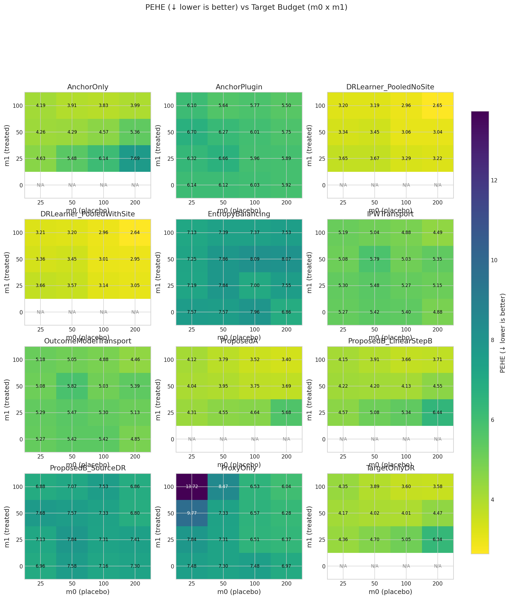

# Target budget 2D grid sweep (m₀ × m₁)

**Benchmark ID:** `gold_sweep`

**Generated:** 2026-02-03 04:33

---

## 1. Motivation

**Research Question:** How does the amount of target data (m₀ placebo, m₁ treated) jointly affect estimator performance?

**Why This Matters:**
- In clinical trials, placebo/control arms are expensive and ethically constrained
- The amount of treated data in target varies: from 0 (external control) to balanced RCT
- This 2D sweep shows the full landscape of performance vs data availability
- m₁ = 0 row shows "disconnected target" scenario (only Option B feasible)
- m₁ > 0 rows show "connected target" scenarios (Option A also feasible)

**Expected Behavior:**
- **ProxyOnly** should be insensitive to both m₀ and m₁ (uses only source data)
- **AnchorOnly/ProposedB** should improve with m₀ but be insensitive to m₁
- **ProposedA** should improve with both m₀ AND m₁
- At m₁ = 0, ProposedA is infeasible (NaN)
- At large m₁, ProposedA should outperform ProposedB

---

## 2. Simulation Setup

**Data Generating Process:**

The simulation generates data from a multi-site RCT setting where treatment effects
differ between source sites and the target population.

**Fixed Parameters:**
- **Covariates:** $X \in \mathbb{R}^{30}$
- **Source sites:** C = 10 sites with 2,000 total observations
- **Non-transfer component:** $\sigma_{\text{nontransfer}} = 0.3$ (moderate)

**What Varies (2D Grid):**
- **m₀** (target placebo): {25, 50, 100, 200}
- **m₁** (target treated): {0, 25, 50, 100}
- Total: 16 scenarios per method

### Parameter Summary

| Parameter | Value | Description |
|-----------|-------|-------------|
| **Sweep param** | `m0` | [25, 50, 100, 200] |
| n_proxy_total | 2000 | Total source/proxy observations |
| C_sources | 10 | Number of source sites |
| nontransfer_scale | 0.3 | Scale of non-transferable component (σ) |

---

## 3. Metrics & Interpretation

| Metric | Direction | Description |
|--------|-----------|-------------|
| **PEHE (Precision in Estimating Heterogeneous Effects)** | ↓ lower is better | Root mean squared error of CATE predictions. Measures how accurately the estimat... |
| **ATE Absolute Error** | ↓ lower is better | Absolute difference between estimated and true average treatment effect.... |
| **ATE Bias (Signed)** | ↑ closer to 0 is better | Signed bias in ATE estimate. Positive = overestimate, negative = underestimate.... |
| **Spearman Rank Correlation** | ↑ higher is better | Rank correlation between predicted and true treatment effects.... |
| **Kendall Rank Correlation** | ↑ higher is better | Kendall tau-b correlation. More robust to ties than Spearman.... |
| **Qini AUC (Oracle)** | ↑ higher is better | Area under the Qini curve. Measures ranking quality for treatment targeting.... |
| **Top-10% Uplift Capture Ratio** | ↑ higher is better | Fraction of maximum uplift captured when treating top 10% by predicted CATE.... |
| **Top-20% Uplift Capture Ratio** | ↑ higher is better | Fraction of maximum uplift captured when treating top 20% by predicted CATE.... |
| **Top-30% Uplift Capture Ratio** | ↑ higher is better | Fraction of maximum uplift captured when treating top 30%.... |
| **Calibration Slope** | ↑ closer to 1 is better | Slope of regression of true τ on predicted τ̂. Ideal = 1.0.... |
| **Calibration R²** | ↑ higher is better | Variance explained by predictions. Measures calibration quality.... |
| **CATE ECE (Expected Calibration Error)** | ↓ lower is better | Expected calibration error for CATE. Binned average miscalibration.... |
| **Policy Value (Treat if τ̂ > 0)** | ↑ higher is better | Expected outcome under threshold-based treatment policy.... |
| **Policy Regret vs Oracle** | ↓ lower is better | Gap between oracle policy value and estimated policy value.... |
| **Policy Value (Treat Top 20%)** | ↑ higher is better | Expected outcome when treating top 20% by predicted CATE.... |
| **Policy Regret (Top 20% Budget)** | ↓ lower is better | Regret compared to oracle top-20% policy.... |
| **μ₀ RMSE (Control Outcome)** | ↓ lower is better | RMSE of predicted control outcomes. Measures nuisance estimation quality.... |

### Detailed Metric Definitions

**PEHE (Precision in Estimating Heterogeneous Effects)**

- Formula: $\sqrt{\frac{1}{n}\sum_i (\hat{\tau}(x_i) - \tau(x_i))^2}$
- Direction: **lower is better**
- A PEHE of 0.5 means predictions are off by 0.5 units on average.

**ATE Absolute Error**

- Formula: $|\hat{\text{ATE}} - \text{ATE}|$
- Direction: **lower is better**
- Important for policy decisions about whether to adopt treatment broadly.

**ATE Bias (Signed)**

- Formula: $\hat{\text{ATE}} - \text{ATE}$
- Direction: **closer to 0 is better**
- Shows systematic over/under-estimation tendencies.

**Spearman Rank Correlation**

- Formula: $\rho(\text{rank}(\hat{\tau}), \text{rank}(\tau))$
- Direction: **higher is better**
- 1.0 = perfect ranking, 0.0 = random. Critical for targeting interventions.

**Kendall Rank Correlation**

- Formula: $\tau_K(\hat{\tau}, \tau)$
- Direction: **higher is better**
- Alternative ranking metric; useful when ties are common.

**Qini AUC (Oracle)**

- Formula: Normalized AUC of cumulative uplift curve
- Direction: **higher is better**
- 1.0 = oracle ranking, 0.0 = random. Simulation-only metric using true τ.

**Top-10% Uplift Capture Ratio**

- Formula: $\frac{\bar{\tau}_{top10\%\ by\ \hat{\tau}}}{\bar{\tau}_{top10\%\ by\ \tau}}$
- Direction: **higher is better**
- 1.0 = oracle selection. Measures targeting efficiency for top patients.

**Top-20% Uplift Capture Ratio**

- Formula: $\frac{\bar{\tau}_{top20\%\ by\ \hat{\tau}}}{\bar{\tau}_{top20\%\ by\ \tau}}$
- Direction: **higher is better**
- 1.0 = oracle selection. Less stringent than top-10%.

**Top-30% Uplift Capture Ratio**

- Formula: $\frac{\bar{\tau}_{top30\%\ by\ \hat{\tau}}}{\bar{\tau}_{top30\%\ by\ \tau}}$
- Direction: **higher is better**
- Less stringent targeting metric.

**Calibration Slope**

- Formula: $\beta$ in $\tau = \alpha + \beta \hat{\tau}$
- Direction: **closer to 1 is better**
- <1 = overconfident predictions, >1 = underconfident.

**Calibration R²**

- Formula: $R^2$ of calibration regression
- Direction: **higher is better**
- Higher R² means predictions track true effects well.

**CATE ECE (Expected Calibration Error)**

- Formula: $\sum_b \frac{n_b}{n} |E[\tau | \hat{\tau} \in b] - E[\hat{\tau} | \hat{\tau} \in b]|$
- Direction: **lower is better**
- Lower ECE means better calibration across prediction ranges.

**Policy Value (Treat if τ̂ > 0)**

- Formula: $E[\mu_0 + \pi(\hat{\tau}) \cdot \tau]$ where $\pi(\hat{\tau}) = 1\{\hat{\tau} > 0\}$
- Direction: **higher is better**
- Higher value = better treatment decisions based on predictions.

**Policy Regret vs Oracle**

- Formula: $V(\pi^*) - V(\hat{\pi})$
- Direction: **lower is better**
- Lower regret = closer to optimal treatment decisions.

**Policy Value (Treat Top 20%)**

- Formula: $E[\mu_0 + \pi_{top20\%}(\hat{\tau}) \cdot \tau]$
- Direction: **higher is better**
- Budget-constrained policy evaluation.

**Policy Regret (Top 20% Budget)**

- Formula: $V(\pi^*_{top20\%}) - V(\hat{\pi}_{top20\%})$
- Direction: **lower is better**
- Budget-constrained regret.

**μ₀ RMSE (Control Outcome)**

- Formula: $\sqrt{\frac{1}{n}\sum_i (\hat{\mu}_0(x_i) - \mu_0(x_i))^2}$
- Direction: **lower is better**
- Important diagnostic; poor μ₀ estimation can propagate to CATE errors.

---

## 4. Methods Compared

| Method | Uses Target Placebo | Uses Source Data | Description |
|--------|---------------------|------------------|-------------|
| **TargetOnlyDR** | ✗ | ✗ | See documentation |
| **ProxyOnly** | ✗ | ✓ | Uses only source data, ignores target |
| **AnchorOnly** | ✓ | ✗ | Uses only target placebo data |
| **AnchorPlugin** | ✗ | ✗ | See documentation |
| **ProposedA** | ✓ | ✓ | Proposed (Option A): requires target treated |
| **ProposedB_LinearStepB** | ✓ | ✓ | Proposed (Option B): placebo-anchored with linear Step B |
| **ProposedB_SourceDR** | ✗ | ✗ | See documentation |
| **IPWTransport** | ✗ | ✗ | See documentation |
| **EntropyBalancing** | ✗ | ✗ | See documentation |
| **OutcomeModelTransport** | ✗ | ✗ | See documentation |
| **DRLearner_PooledWithSite** | ✗ | ✗ | See documentation |
| **DRLearner_PooledNoSite** | ✗ | ✗ | See documentation |

---

## 5. Experiment Summary

- **Sweep parameter:** `m0` ∈ [25, 50, 100, 200]
- **Monte Carlo replicates:** 100 per scenario
- **Methods evaluated:** 12
- **Total runs:** 19200

---

## 6. Results

### Best Methods (averaged across sweep)

| Metric | Best Method | Value | Direction |
|--------|-------------|-------|----------|
| pehe | **DRLearner_PooledWithSite** | 2.6377 | ↓ lower is better |
| ate_abs_err | **ProposedA** | 0.2166 | ↓ lower is better |
| tau_corr | **ProxyOnly** | 0.2464 | ↑ higher is better |
| qini_auc | **ProxyOnly** | 0.2643 | ↑ higher is better |
| topk_20_ratio | **ProposedB_LinearStepB** | -75.1582 | ↑ higher is better |
| policy_regret | **DRLearner_PooledWithSite** | 0.1821 | ↓ lower is better |
| tau_ece | **DRLearner_PooledWithSite** | 0.6016 | ↓ lower is better |

### Core Metrics

| m0 | m1 | Method | PEHE (↓) | ATE Err (↓) | Spearman (↑) | Qini (↑) |
|---|---|---|---|---|---|
| 25 | 0 | AnchorOnly | N/A | N/A | N/A | N/A |
| 25 | 0 | AnchorPlugin | 6.140 ± 3.345 | 3.995 ± 3.733 | 0.525 ± 0.148 | 0.540 ± 0.150 |
| 25 | 0 | DRLearner_PooledNoSite | N/A | N/A | N/A | N/A |
| 25 | 0 | DRLearner_PooledWithSite | N/A | N/A | N/A | N/A |
| 25 | 0 | EntropyBalancing | 7.574 ± 3.723 | 5.476 ± 4.081 | 0.542 ± 0.185 | 0.556 ± 0.188 |
| 25 | 0 | IPWTransport | 5.271 ± 3.417 | 3.694 ± 3.626 | 0.730 ± 0.144 | 0.742 ± 0.144 |
| 25 | 0 | OutcomeModelTransport | 5.268 ± 3.421 | 3.686 ± 3.634 | 0.730 ± 0.144 | 0.742 ± 0.144 |
| 25 | 0 | ProposedA | N/A | N/A | N/A | N/A |
| 25 | 0 | ProposedB_LinearStepB | N/A | N/A | N/A | N/A |
| 25 | 0 | ProposedB_SourceDR | 6.957 ± 3.555 | 4.661 ± 4.163 | 0.392 ± 0.145 | 0.406 ± 0.147 |
| 25 | 0 | ProxyOnly | 7.481 ± 3.766 | 5.290 ± 4.364 | 0.299 ± 0.130 | 0.312 ± 0.128 |
| 25 | 0 | TargetOnlyDR | N/A | N/A | N/A | N/A |
| 25 | 25 | AnchorOnly | 4.626 ± 0.987 | 0.749 ± 0.539 | 0.423 ± 0.142 | 0.437 ± 0.145 |
| 25 | 25 | AnchorPlugin | 6.319 ± 2.939 | 4.203 ± 3.529 | 0.529 ± 0.144 | 0.545 ± 0.145 |
| 25 | 25 | DRLearner_PooledNoSite | 3.648 ± 1.384 | 1.619 ± 1.344 | 0.757 ± 0.128 | 0.770 ± 0.126 |
| 25 | 25 | DRLearner_PooledWithSite | 3.658 ± 1.380 | 1.639 ± 1.349 | 0.758 ± 0.128 | 0.771 ± 0.125 |
| 25 | 25 | EntropyBalancing | 7.192 ± 4.302 | 5.065 ± 4.804 | 0.561 ± 0.181 | 0.577 ± 0.183 |
| 25 | 25 | IPWTransport | 5.296 ± 2.954 | 3.846 ± 3.249 | 0.742 ± 0.136 | 0.755 ± 0.134 |
| 25 | 25 | OutcomeModelTransport | 5.294 ± 2.958 | 3.841 ± 3.253 | 0.742 ± 0.137 | 0.755 ± 0.134 |
| 25 | 25 | ProposedA | 4.311 ± 0.807 | 0.645 ± 0.493 | 0.499 ± 0.110 | 0.515 ± 0.110 |
| 25 | 25 | ProposedB_LinearStepB | 4.574 ± 0.960 | 0.740 ± 0.554 | 0.426 ± 0.140 | 0.440 ± 0.143 |
| 25 | 25 | ProposedB_SourceDR | 7.128 ± 3.340 | 4.824 ± 4.127 | 0.421 ± 0.129 | 0.434 ± 0.131 |
| 25 | 25 | ProxyOnly | 7.841 ± 4.152 | 5.650 ± 4.839 | 0.293 ± 0.145 | 0.305 ± 0.143 |
| 25 | 25 | TargetOnlyDR | 4.358 ± 0.836 | 0.657 ± 0.426 | 0.478 ± 0.113 | 0.494 ± 0.114 |
| 25 | 50 | AnchorOnly | 4.261 ± 0.853 | 0.516 ± 0.352 | 0.503 ± 0.105 | 0.519 ± 0.105 |
| 25 | 50 | AnchorPlugin | 6.704 ± 3.516 | 4.695 ± 4.110 | 0.504 ± 0.128 | 0.522 ± 0.129 |
| 25 | 50 | DRLearner_PooledNoSite | 3.342 ± 1.288 | 1.092 ± 1.134 | 0.760 ± 0.128 | 0.773 ± 0.125 |
| 25 | 50 | DRLearner_PooledWithSite | 3.359 ± 1.303 | 1.132 ± 1.162 | 0.760 ± 0.128 | 0.773 ± 0.125 |
| 25 | 50 | EntropyBalancing | 7.252 ± 4.287 | 5.239 ± 4.752 | 0.574 ± 0.200 | 0.589 ± 0.201 |
| 25 | 50 | IPWTransport | 5.078 ± 3.073 | 3.570 ± 3.360 | 0.739 ± 0.141 | 0.753 ± 0.138 |
| 25 | 50 | OutcomeModelTransport | 5.080 ± 3.081 | 3.579 ± 3.362 | 0.739 ± 0.141 | 0.753 ± 0.138 |
| 25 | 50 | ProposedA | 4.045 ± 0.779 | 0.470 ± 0.344 | 0.575 ± 0.073 | 0.593 ± 0.072 |
| 25 | 50 | ProposedB_LinearStepB | 4.222 ± 0.857 | 0.514 ± 0.362 | 0.514 ± 0.103 | 0.530 ± 0.103 |
| 25 | 50 | ProposedB_SourceDR | 7.675 ± 4.034 | 5.465 ± 4.901 | 0.401 ± 0.138 | 0.417 ± 0.136 |
| 25 | 50 | ProxyOnly | 9.770 ± 5.721 | 7.813 ± 6.535 | 0.276 ± 0.137 | 0.289 ± 0.134 |
| 25 | 50 | TargetOnlyDR | 4.167 ± 0.792 | 0.601 ± 0.468 | 0.534 ± 0.088 | 0.550 ± 0.088 |
| 25 | 100 | AnchorOnly | 4.190 ± 0.844 | 0.516 ± 0.414 | 0.563 ± 0.100 | 0.579 ± 0.101 |
| 25 | 100 | AnchorPlugin | 6.104 ± 3.144 | 3.868 ± 3.594 | 0.507 ± 0.159 | 0.524 ± 0.154 |
| 25 | 100 | DRLearner_PooledNoSite | 3.195 ± 1.378 | 0.811 ± 0.783 | 0.760 ± 0.163 | 0.772 ± 0.162 |
| 25 | 100 | DRLearner_PooledWithSite | 3.210 ± 1.384 | 0.833 ± 0.795 | 0.759 ± 0.164 | 0.770 ± 0.162 |
| 25 | 100 | EntropyBalancing | 7.133 ± 4.103 | 4.992 ± 4.424 | 0.544 ± 0.222 | 0.563 ± 0.212 |
| 25 | 100 | IPWTransport | 5.185 ± 3.675 | 3.704 ± 3.826 | 0.731 ± 0.186 | 0.743 ± 0.185 |
| 25 | 100 | OutcomeModelTransport | 5.181 ± 3.645 | 3.704 ± 3.792 | 0.731 ± 0.185 | 0.743 ± 0.185 |
| 25 | 100 | ProposedA | 4.124 ± 0.766 | 0.488 ± 0.385 | 0.589 ± 0.097 | 0.604 ± 0.097 |
| 25 | 100 | ProposedB_LinearStepB | 4.153 ± 0.783 | 0.524 ± 0.393 | 0.569 ± 0.093 | 0.584 ± 0.093 |
| 25 | 100 | ProposedB_SourceDR | 6.883 ± 3.572 | 4.571 ± 4.134 | 0.406 ± 0.145 | 0.420 ± 0.146 |
| 25 | 100 | ProxyOnly | 13.721 ± 8.661 | 11.479 ± 9.734 | 0.246 ± 0.168 | 0.264 ± 0.156 |
| 25 | 100 | TargetOnlyDR | 4.346 ± 0.869 | 0.617 ± 0.450 | 0.543 ± 0.098 | 0.559 ± 0.098 |
| 50 | 0 | AnchorOnly | N/A | N/A | N/A | N/A |
| 50 | 0 | AnchorPlugin | 6.124 ± 3.314 | 4.140 ± 3.766 | 0.584 ± 0.152 | 0.601 ± 0.153 |
| 50 | 0 | DRLearner_PooledNoSite | N/A | N/A | N/A | N/A |
| 50 | 0 | DRLearner_PooledWithSite | N/A | N/A | N/A | N/A |
| 50 | 0 | EntropyBalancing | 7.569 ± 4.595 | 5.591 ± 5.003 | 0.563 ± 0.194 | 0.580 ± 0.191 |
| 50 | 0 | IPWTransport | 5.422 ± 3.044 | 3.901 ± 3.303 | 0.735 ± 0.165 | 0.748 ± 0.165 |
| 50 | 0 | OutcomeModelTransport | 5.417 ± 3.041 | 3.892 ± 3.301 | 0.735 ± 0.165 | 0.748 ± 0.164 |
| 50 | 0 | ProposedA | N/A | N/A | N/A | N/A |
| 50 | 0 | ProposedB_LinearStepB | N/A | N/A | N/A | N/A |
| 50 | 0 | ProposedB_SourceDR | 7.579 ± 3.729 | 5.547 ± 4.322 | 0.418 ± 0.145 | 0.434 ± 0.143 |
| 50 | 0 | ProxyOnly | 7.303 ± 3.853 | 5.041 ± 4.497 | 0.370 ± 0.142 | 0.384 ± 0.145 |
| 50 | 0 | TargetOnlyDR | N/A | N/A | N/A | N/A |
| 50 | 25 | AnchorOnly | 5.479 ± 2.144 | 0.786 ± 0.700 | 0.367 ± 0.151 | 0.381 ± 0.156 |
| 50 | 25 | AnchorPlugin | 6.657 ± 4.109 | 4.841 ± 4.436 | 0.604 ± 0.136 | 0.621 ± 0.137 |
| 50 | 25 | DRLearner_PooledNoSite | 3.671 ± 2.096 | 1.484 ± 1.757 | 0.763 ± 0.147 | 0.776 ± 0.145 |
| 50 | 25 | DRLearner_PooledWithSite | 3.571 ± 1.948 | 1.323 ± 1.519 | 0.765 ± 0.146 | 0.777 ± 0.144 |
| 50 | 25 | EntropyBalancing | 7.841 ± 4.488 | 5.878 ± 4.972 | 0.575 ± 0.164 | 0.591 ± 0.164 |
| 50 | 25 | IPWTransport | 5.479 ± 4.065 | 3.956 ± 4.170 | 0.744 ± 0.161 | 0.757 ± 0.160 |
| 50 | 25 | OutcomeModelTransport | 5.466 ± 4.112 | 3.918 ± 4.234 | 0.744 ± 0.162 | 0.757 ± 0.161 |
| 50 | 25 | ProposedA | 4.546 ± 1.230 | 0.731 ± 0.501 | 0.515 ± 0.094 | 0.532 ± 0.093 |
| 50 | 25 | ProposedB_LinearStepB | 5.078 ± 1.874 | 0.672 ± 0.630 | 0.424 ± 0.143 | 0.438 ± 0.148 |
| 50 | 25 | ProposedB_SourceDR | 7.843 ± 4.044 | 5.750 ± 4.526 | 0.404 ± 0.153 | 0.421 ± 0.152 |
| 50 | 25 | ProxyOnly | 7.310 ± 4.065 | 5.066 ± 4.506 | 0.396 ± 0.138 | 0.412 ± 0.137 |
| 50 | 25 | TargetOnlyDR | 4.698 ± 1.316 | 0.741 ± 0.579 | 0.472 ± 0.104 | 0.488 ± 0.105 |
| 50 | 50 | AnchorOnly | 4.295 ± 0.946 | 0.502 ± 0.396 | 0.545 ± 0.112 | 0.561 ± 0.113 |
| 50 | 50 | AnchorPlugin | 6.270 ± 3.435 | 4.412 ± 3.948 | 0.607 ± 0.137 | 0.624 ± 0.137 |
| 50 | 50 | DRLearner_PooledNoSite | 3.446 ± 1.382 | 1.164 ± 1.020 | 0.757 ± 0.153 | 0.770 ± 0.151 |
| 50 | 50 | DRLearner_PooledWithSite | 3.445 ± 1.375 | 1.166 ± 1.018 | 0.757 ± 0.153 | 0.770 ± 0.152 |
| 50 | 50 | EntropyBalancing | 7.858 ± 4.584 | 5.941 ± 5.039 | 0.560 ± 0.192 | 0.577 ± 0.188 |
| 50 | 50 | IPWTransport | 5.792 ± 3.517 | 4.373 ± 3.784 | 0.731 ± 0.167 | 0.745 ± 0.166 |
| 50 | 50 | OutcomeModelTransport | 5.824 ± 3.527 | 4.417 ± 3.790 | 0.731 ± 0.167 | 0.745 ± 0.166 |
| 50 | 50 | ProposedA | 3.946 ± 0.668 | 0.381 ± 0.297 | 0.650 ± 0.065 | 0.666 ± 0.064 |
| 50 | 50 | ProposedB_LinearStepB | 4.195 ± 0.834 | 0.456 ± 0.372 | 0.566 ± 0.111 | 0.582 ± 0.113 |
| 50 | 50 | ProposedB_SourceDR | 7.570 ± 4.318 | 5.291 ± 5.096 | 0.405 ± 0.119 | 0.421 ± 0.122 |
| 50 | 50 | ProxyOnly | 7.331 ± 3.850 | 5.082 ± 4.616 | 0.415 ± 0.110 | 0.429 ± 0.113 |
| 50 | 50 | TargetOnlyDR | 4.023 ± 0.687 | 0.457 ± 0.341 | 0.614 ± 0.072 | 0.631 ± 0.072 |
| 50 | 100 | AnchorOnly | 3.914 ± 0.937 | 0.407 ± 0.317 | 0.639 ± 0.075 | 0.655 ± 0.075 |
| 50 | 100 | AnchorPlugin | 5.639 ± 2.484 | 3.524 ± 2.867 | 0.585 ± 0.141 | 0.602 ± 0.142 |
| 50 | 100 | DRLearner_PooledNoSite | 3.190 ± 1.487 | 0.652 ± 0.633 | 0.768 ± 0.136 | 0.780 ± 0.134 |
| 50 | 100 | DRLearner_PooledWithSite | 3.195 ± 1.492 | 0.676 ± 0.621 | 0.767 ± 0.137 | 0.780 ± 0.135 |
| 50 | 100 | EntropyBalancing | 7.395 ± 4.175 | 5.345 ± 4.434 | 0.558 ± 0.182 | 0.573 ± 0.184 |
| 50 | 100 | IPWTransport | 5.035 ± 3.214 | 3.343 ± 3.366 | 0.731 ± 0.162 | 0.744 ± 0.162 |
| 50 | 100 | OutcomeModelTransport | 5.051 ± 3.223 | 3.382 ± 3.359 | 0.731 ± 0.162 | 0.744 ± 0.162 |
| 50 | 100 | ProposedA | 3.794 ± 0.871 | 0.381 ± 0.225 | 0.685 ± 0.064 | 0.700 ± 0.063 |
| 50 | 100 | ProposedB_LinearStepB | 3.906 ± 0.952 | 0.396 ± 0.292 | 0.638 ± 0.089 | 0.653 ± 0.089 |
| 50 | 100 | ProposedB_SourceDR | 7.072 ± 3.031 | 4.818 ± 3.620 | 0.404 ± 0.131 | 0.419 ± 0.134 |
| 50 | 100 | ProxyOnly | 8.467 ± 4.487 | 6.275 ± 5.170 | 0.344 ± 0.130 | 0.357 ± 0.132 |
| 50 | 100 | TargetOnlyDR | 3.894 ± 0.858 | 0.444 ± 0.313 | 0.643 ± 0.068 | 0.659 ± 0.067 |
| 100 | 0 | AnchorOnly | N/A | N/A | N/A | N/A |
| 100 | 0 | AnchorPlugin | 6.029 ± 2.682 | 4.233 ± 3.136 | 0.619 ± 0.127 | 0.634 ± 0.127 |
| 100 | 0 | DRLearner_PooledNoSite | N/A | N/A | N/A | N/A |
| 100 | 0 | DRLearner_PooledWithSite | N/A | N/A | N/A | N/A |
| 100 | 0 | EntropyBalancing | 7.956 ± 4.173 | 6.015 ± 4.588 | 0.532 ± 0.186 | 0.548 ± 0.189 |
| 100 | 0 | IPWTransport | 5.402 ± 3.427 | 3.885 ± 3.523 | 0.713 ± 0.177 | 0.726 ± 0.176 |
| 100 | 0 | OutcomeModelTransport | 5.423 ± 3.445 | 3.913 ± 3.540 | 0.713 ± 0.177 | 0.726 ± 0.176 |
| 100 | 0 | ProposedA | N/A | N/A | N/A | N/A |
| 100 | 0 | ProposedB_LinearStepB | N/A | N/A | N/A | N/A |
| 100 | 0 | ProposedB_SourceDR | 7.159 ± 3.867 | 4.842 ± 4.497 | 0.397 ± 0.125 | 0.412 ± 0.128 |
| 100 | 0 | ProxyOnly | 7.484 ± 3.391 | 5.444 ± 4.170 | 0.447 ± 0.131 | 0.462 ± 0.133 |
| 100 | 0 | TargetOnlyDR | N/A | N/A | N/A | N/A |
| 100 | 25 | AnchorOnly | 6.144 ± 2.361 | 0.820 ± 0.758 | 0.319 ± 0.144 | 0.332 ± 0.145 |
| 100 | 25 | AnchorPlugin | 5.959 ± 3.085 | 4.179 ± 3.589 | 0.636 ± 0.132 | 0.653 ± 0.131 |
| 100 | 25 | DRLearner_PooledNoSite | 3.293 ± 1.228 | 1.175 ± 1.023 | 0.775 ± 0.114 | 0.788 ± 0.110 |
| 100 | 25 | DRLearner_PooledWithSite | 3.145 ± 1.094 | 0.886 ± 0.719 | 0.779 ± 0.113 | 0.792 ± 0.109 |
| 100 | 25 | EntropyBalancing | 6.998 ± 3.461 | 5.114 ± 3.983 | 0.583 ± 0.156 | 0.599 ± 0.156 |
| 100 | 25 | IPWTransport | 5.275 ± 2.820 | 3.915 ± 3.101 | 0.753 ± 0.129 | 0.766 ± 0.126 |
| 100 | 25 | OutcomeModelTransport | 5.301 ± 2.929 | 3.949 ± 3.200 | 0.753 ± 0.130 | 0.766 ± 0.127 |
| 100 | 25 | ProposedA | 4.645 ± 1.245 | 0.504 ± 0.430 | 0.498 ± 0.116 | 0.513 ± 0.118 |
| 100 | 25 | ProposedB_LinearStepB | 5.343 ± 1.860 | 0.671 ± 0.595 | 0.410 ± 0.170 | 0.424 ± 0.172 |
| 100 | 25 | ProposedB_SourceDR | 7.306 ± 3.633 | 5.104 ± 4.362 | 0.411 ± 0.126 | 0.425 ± 0.129 |
| 100 | 25 | ProxyOnly | 6.506 ± 2.935 | 4.316 ± 3.510 | 0.464 ± 0.140 | 0.478 ± 0.143 |
| 100 | 25 | TargetOnlyDR | 5.052 ± 1.280 | 0.654 ± 0.516 | 0.419 ± 0.118 | 0.433 ± 0.120 |
| 100 | 50 | AnchorOnly | 4.570 ± 1.022 | 0.484 ± 0.325 | 0.480 ± 0.134 | 0.495 ± 0.136 |
| 100 | 50 | AnchorPlugin | 6.013 ± 2.563 | 4.344 ± 3.066 | 0.640 ± 0.124 | 0.656 ± 0.124 |
| 100 | 50 | DRLearner_PooledNoSite | 3.063 ± 1.143 | 0.903 ± 0.769 | 0.788 ± 0.129 | 0.800 ± 0.127 |
| 100 | 50 | DRLearner_PooledWithSite | 3.012 ± 1.113 | 0.802 ± 0.691 | 0.791 ± 0.127 | 0.802 ± 0.125 |
| 100 | 50 | EntropyBalancing | 8.095 ± 4.241 | 6.356 ± 4.808 | 0.594 ± 0.187 | 0.610 ± 0.188 |
| 100 | 50 | IPWTransport | 5.033 ± 3.143 | 3.610 ± 3.439 | 0.761 ± 0.148 | 0.773 ± 0.146 |
| 100 | 50 | OutcomeModelTransport | 5.034 ± 3.151 | 3.612 ± 3.445 | 0.761 ± 0.148 | 0.773 ± 0.146 |
| 100 | 50 | ProposedA | 3.745 ± 0.678 | 0.282 ± 0.222 | 0.679 ± 0.061 | 0.693 ± 0.060 |
| 100 | 50 | ProposedB_LinearStepB | 4.133 ± 0.832 | 0.396 ± 0.243 | 0.566 ± 0.110 | 0.582 ± 0.111 |
| 100 | 50 | ProposedB_SourceDR | 7.329 ± 2.924 | 5.284 ± 3.685 | 0.435 ± 0.142 | 0.451 ± 0.141 |
| 100 | 50 | ProxyOnly | 6.574 ± 2.622 | 4.468 ± 3.269 | 0.464 ± 0.122 | 0.479 ± 0.124 |
| 100 | 50 | TargetOnlyDR | 4.008 ± 0.833 | 0.406 ± 0.303 | 0.601 ± 0.082 | 0.617 ± 0.082 |
| 100 | 100 | AnchorOnly | 3.826 ± 0.731 | 0.328 ± 0.311 | 0.626 ± 0.101 | 0.643 ± 0.100 |
| 100 | 100 | AnchorPlugin | 5.767 ± 2.603 | 4.015 ± 3.201 | 0.633 ± 0.113 | 0.650 ± 0.111 |
| 100 | 100 | DRLearner_PooledNoSite | 2.956 ± 0.956 | 0.570 ± 0.486 | 0.779 ± 0.120 | 0.791 ± 0.118 |
| 100 | 100 | DRLearner_PooledWithSite | 2.956 ± 0.961 | 0.576 ± 0.488 | 0.779 ± 0.120 | 0.792 ± 0.118 |
| 100 | 100 | EntropyBalancing | 7.371 ± 3.344 | 5.479 ± 3.905 | 0.560 ± 0.159 | 0.576 ± 0.159 |
| 100 | 100 | IPWTransport | 4.884 ± 2.710 | 3.349 ± 3.050 | 0.738 ± 0.144 | 0.752 ± 0.143 |
| 100 | 100 | OutcomeModelTransport | 4.877 ± 2.689 | 3.356 ± 3.028 | 0.740 ± 0.143 | 0.753 ± 0.141 |
| 100 | 100 | ProposedA | 3.518 ± 0.661 | 0.248 ± 0.195 | 0.726 ± 0.050 | 0.741 ± 0.048 |
| 100 | 100 | ProposedB_LinearStepB | 3.660 ± 0.697 | 0.293 ± 0.215 | 0.672 ± 0.078 | 0.688 ± 0.077 |
| 100 | 100 | ProposedB_SourceDR | 7.533 ± 3.433 | 5.581 ± 4.206 | 0.432 ± 0.119 | 0.447 ± 0.122 |
| 100 | 100 | ProxyOnly | 6.530 ± 2.727 | 4.391 ± 3.500 | 0.463 ± 0.113 | 0.478 ± 0.115 |
| 100 | 100 | TargetOnlyDR | 3.603 ± 0.664 | 0.322 ± 0.294 | 0.688 ± 0.057 | 0.703 ± 0.056 |
| 200 | 0 | AnchorOnly | N/A | N/A | N/A | N/A |
| 200 | 0 | AnchorPlugin | 5.916 ± 2.684 | 4.181 ± 3.108 | 0.639 ± 0.125 | 0.656 ± 0.123 |
| 200 | 0 | DRLearner_PooledNoSite | N/A | N/A | N/A | N/A |
| 200 | 0 | DRLearner_PooledWithSite | N/A | N/A | N/A | N/A |
| 200 | 0 | EntropyBalancing | 6.863 ± 3.499 | 4.745 ± 4.025 | 0.586 ± 0.182 | 0.602 ± 0.183 |
| 200 | 0 | IPWTransport | 4.881 ± 3.005 | 3.327 ± 3.247 | 0.757 ± 0.135 | 0.770 ± 0.132 |
| 200 | 0 | OutcomeModelTransport | 4.855 ± 3.016 | 3.304 ± 3.246 | 0.757 ± 0.135 | 0.770 ± 0.132 |
| 200 | 0 | ProposedA | N/A | N/A | N/A | N/A |
| 200 | 0 | ProposedB_LinearStepB | N/A | N/A | N/A | N/A |
| 200 | 0 | ProposedB_SourceDR | 7.301 ± 3.119 | 5.243 ± 3.732 | 0.422 ± 0.131 | 0.436 ± 0.134 |
| 200 | 0 | ProxyOnly | 6.966 ± 3.203 | 4.867 ± 3.932 | 0.491 ± 0.123 | 0.507 ± 0.124 |
| 200 | 0 | TargetOnlyDR | N/A | N/A | N/A | N/A |
| 200 | 25 | AnchorOnly | 7.691 ± 2.635 | 0.796 ± 0.588 | 0.265 ± 0.119 | 0.276 ± 0.122 |
| 200 | 25 | AnchorPlugin | 5.887 ± 2.934 | 4.107 ± 3.371 | 0.636 ± 0.125 | 0.652 ± 0.125 |
| 200 | 25 | DRLearner_PooledNoSite | 3.225 ± 1.310 | 0.953 ± 0.985 | 0.777 ± 0.137 | 0.789 ± 0.134 |
| 200 | 25 | DRLearner_PooledWithSite | 3.047 ± 1.179 | 0.606 ± 0.627 | 0.784 ± 0.132 | 0.796 ± 0.129 |
| 200 | 25 | EntropyBalancing | 7.546 ± 3.894 | 5.424 ± 4.499 | 0.566 ± 0.197 | 0.581 ± 0.197 |
| 200 | 25 | IPWTransport | 5.148 ± 3.726 | 3.613 ± 3.982 | 0.748 ± 0.159 | 0.761 ± 0.157 |
| 200 | 25 | OutcomeModelTransport | 5.135 ± 3.735 | 3.595 ± 3.993 | 0.748 ± 0.159 | 0.761 ± 0.157 |
| 200 | 25 | ProposedA | 5.677 ± 1.391 | 0.635 ± 0.442 | 0.440 ± 0.115 | 0.455 ± 0.116 |
| 200 | 25 | ProposedB_LinearStepB | 6.444 ± 2.107 | 0.584 ± 0.480 | 0.369 ± 0.149 | 0.382 ± 0.154 |
| 200 | 25 | ProposedB_SourceDR | 7.409 ± 3.684 | 5.347 ± 4.295 | 0.429 ± 0.133 | 0.444 ± 0.136 |
| 200 | 25 | ProxyOnly | 6.370 ± 2.771 | 4.096 ± 3.374 | 0.481 ± 0.124 | 0.498 ± 0.127 |
| 200 | 25 | TargetOnlyDR | 6.344 ± 1.291 | 0.657 ± 0.540 | 0.351 ± 0.098 | 0.364 ± 0.101 |
| 200 | 50 | AnchorOnly | 5.365 ± 1.843 | 0.437 ± 0.387 | 0.404 ± 0.145 | 0.417 ± 0.149 |
| 200 | 50 | AnchorPlugin | 5.754 ± 3.020 | 3.918 ± 3.557 | 0.636 ± 0.118 | 0.653 ± 0.117 |
| 200 | 50 | DRLearner_PooledNoSite | 3.036 ± 1.206 | 0.758 ± 0.635 | 0.779 ± 0.130 | 0.791 ± 0.127 |
| 200 | 50 | DRLearner_PooledWithSite | 2.954 ± 1.167 | 0.615 ± 0.493 | 0.784 ± 0.126 | 0.796 ± 0.123 |
| 200 | 50 | EntropyBalancing | 8.065 ± 5.231 | 6.320 ± 5.531 | 0.556 ± 0.176 | 0.571 ± 0.177 |
| 200 | 50 | IPWTransport | 5.352 ± 3.327 | 3.971 ± 3.542 | 0.737 ± 0.157 | 0.750 ± 0.155 |
| 200 | 50 | OutcomeModelTransport | 5.388 ± 3.366 | 4.027 ± 3.569 | 0.737 ± 0.157 | 0.750 ± 0.156 |
| 200 | 50 | ProposedA | 3.685 ± 0.738 | 0.277 ± 0.224 | 0.675 ± 0.071 | 0.691 ± 0.070 |
| 200 | 50 | ProposedB_LinearStepB | 4.549 ± 1.324 | 0.402 ± 0.294 | 0.503 ± 0.153 | 0.518 ± 0.155 |
| 200 | 50 | ProposedB_SourceDR | 6.803 ± 3.595 | 4.592 ± 4.201 | 0.420 ± 0.139 | 0.437 ± 0.135 |
| 200 | 50 | ProxyOnly | 6.279 ± 2.880 | 4.136 ± 3.499 | 0.499 ± 0.130 | 0.515 ± 0.132 |
| 200 | 50 | TargetOnlyDR | 4.469 ± 1.211 | 0.414 ± 0.290 | 0.526 ± 0.095 | 0.542 ± 0.094 |
| 200 | 100 | AnchorOnly | 3.991 ± 0.848 | 0.312 ± 0.234 | 0.588 ± 0.111 | 0.604 ± 0.111 |
| 200 | 100 | AnchorPlugin | 5.499 ± 2.300 | 3.804 ± 2.833 | 0.651 ± 0.111 | 0.667 ± 0.111 |
| 200 | 100 | DRLearner_PooledNoSite | 2.654 ± 0.803 | 0.368 ± 0.290 | 0.816 ± 0.097 | 0.828 ± 0.093 |
| 200 | 100 | DRLearner_PooledWithSite | 2.638 ± 0.801 | 0.350 ± 0.272 | 0.818 ± 0.096 | 0.830 ± 0.093 |
| 200 | 100 | EntropyBalancing | 7.527 ± 3.884 | 5.762 ± 4.354 | 0.589 ± 0.173 | 0.605 ± 0.174 |
| 200 | 100 | IPWTransport | 4.489 ± 2.229 | 3.048 ± 2.581 | 0.773 ± 0.120 | 0.786 ± 0.117 |
| 200 | 100 | OutcomeModelTransport | 4.464 ± 2.166 | 3.016 ± 2.523 | 0.774 ± 0.118 | 0.787 ± 0.116 |
| 200 | 100 | ProposedA | 3.398 ± 0.592 | 0.217 ± 0.149 | 0.740 ± 0.046 | 0.755 ± 0.044 |
| 200 | 100 | ProposedB_LinearStepB | 3.709 ± 0.723 | 0.271 ± 0.175 | 0.651 ± 0.104 | 0.667 ± 0.103 |
| 200 | 100 | ProposedB_SourceDR | 6.857 ± 3.013 | 4.794 ± 3.681 | 0.430 ± 0.124 | 0.446 ± 0.126 |
| 200 | 100 | ProxyOnly | 6.045 ± 2.240 | 3.937 ± 2.911 | 0.495 ± 0.123 | 0.510 ± 0.124 |
| 200 | 100 | TargetOnlyDR | 3.580 ± 0.660 | 0.283 ± 0.228 | 0.688 ± 0.060 | 0.704 ± 0.059 |

### Targeting / Ranking Metrics

| m0 | m1 | Method | Top-10% (↑) | Top-20% (↑) | Kendall (↑) |
|---|---|---|---|---|---|
| 25 | 0 | AnchorOnly | N/A | N/A | N/A |
| 25 | 0 | AnchorPlugin | 0.211 ± 1.566 | 0.476 ± 0.755 | 0.371 ± 0.112 |
| 25 | 0 | DRLearner_PooledNoSite | N/A | N/A | N/A |
| 25 | 0 | DRLearner_PooledWithSite | N/A | N/A | N/A |
| 25 | 0 | EntropyBalancing | 0.109 ± 2.913 | 0.523 ± 0.659 | 0.387 ± 0.141 |
| 25 | 0 | IPWTransport | 0.468 ± 1.921 | 0.740 ± 0.267 | 0.548 ± 0.126 |
| 25 | 0 | OutcomeModelTransport | 0.469 ± 1.921 | 0.740 ± 0.266 | 0.548 ± 0.127 |
| 25 | 0 | ProposedA | N/A | N/A | N/A |
| 25 | 0 | ProposedB_LinearStepB | N/A | N/A | N/A |
| 25 | 0 | ProposedB_SourceDR | 0.029 ± 1.957 | 0.317 ± 0.884 | 0.271 ± 0.105 |
| 25 | 0 | ProxyOnly | -0.038 ± 1.747 | 0.167 ± 1.209 | 0.204 ± 0.091 |
| 25 | 0 | TargetOnlyDR | N/A | N/A | N/A |
| 25 | 25 | AnchorOnly | -0.580 ± 5.929 | 0.309 ± 0.870 | 0.292 ± 0.103 |
| 25 | 25 | AnchorPlugin | -0.159 ± 3.696 | 0.392 ± 1.015 | 0.373 ± 0.110 |
| 25 | 25 | DRLearner_PooledNoSite | 0.571 ± 1.114 | 0.736 ± 0.282 | 0.574 ± 0.118 |
| 25 | 25 | DRLearner_PooledWithSite | 0.571 ± 1.122 | 0.736 ± 0.284 | 0.574 ± 0.118 |
| 25 | 25 | EntropyBalancing | -0.069 ± 3.624 | 0.493 ± 0.627 | 0.401 ± 0.139 |
| 25 | 25 | IPWTransport | 0.521 ± 1.333 | 0.720 ± 0.299 | 0.559 ± 0.123 |
| 25 | 25 | OutcomeModelTransport | 0.522 ± 1.325 | 0.721 ± 0.299 | 0.559 ± 0.123 |
| 25 | 25 | ProposedA | -0.430 ± 5.375 | 0.357 ± 1.014 | 0.349 ± 0.083 |
| 25 | 25 | ProposedB_LinearStepB | -0.600 ± 6.083 | 0.307 ± 0.960 | 0.294 ± 0.101 |
| 25 | 25 | ProposedB_SourceDR | -0.591 ± 5.992 | 0.316 ± 0.885 | 0.291 ± 0.093 |
| 25 | 25 | ProxyOnly | -1.031 ± 7.309 | 0.117 ± 1.180 | 0.199 ± 0.101 |
| 25 | 25 | TargetOnlyDR | -0.455 ± 5.455 | 0.368 ± 0.793 | 0.333 ± 0.085 |
| 25 | 50 | AnchorOnly | -0.358 ± 6.106 | -0.432 ± 6.439 | 0.351 ± 0.079 |
| 25 | 50 | AnchorPlugin | -0.379 ± 6.642 | -0.593 ± 7.977 | 0.354 ± 0.097 |
| 25 | 50 | DRLearner_PooledNoSite | 0.561 ± 1.511 | 0.427 ± 2.436 | 0.577 ± 0.121 |
| 25 | 50 | DRLearner_PooledWithSite | 0.559 ± 1.555 | 0.433 ± 2.407 | 0.577 ± 0.121 |
| 25 | 50 | EntropyBalancing | 0.052 ± 3.819 | -0.092 ± 4.053 | 0.414 ± 0.156 |
| 25 | 50 | IPWTransport | 0.530 ± 1.615 | 0.392 ± 2.593 | 0.558 ± 0.130 |
| 25 | 50 | OutcomeModelTransport | 0.535 ± 1.568 | 0.393 ± 2.593 | 0.558 ± 0.129 |
| 25 | 50 | ProposedA | -0.337 ± 6.616 | -0.409 ± 6.586 | 0.407 ± 0.058 |
| 25 | 50 | ProposedB_LinearStepB | -0.330 ± 6.225 | -0.260 ± 5.155 | 0.359 ± 0.078 |
| 25 | 50 | ProposedB_SourceDR | -0.597 ± 7.653 | -0.612 ± 6.275 | 0.277 ± 0.099 |
| 25 | 50 | ProxyOnly | -1.023 ± 9.567 | -1.260 ± 10.431 | 0.188 ± 0.095 |
| 25 | 50 | TargetOnlyDR | -0.320 ± 6.177 | -0.509 ± 7.008 | 0.375 ± 0.067 |
| 25 | 100 | AnchorOnly | 0.250 ± 1.399 | 0.130 ± 2.086 | 0.399 ± 0.079 |
| 25 | 100 | AnchorPlugin | 0.235 ± 1.360 | -0.144 ± 4.127 | 0.357 ± 0.119 |
| 25 | 100 | DRLearner_PooledNoSite | 0.676 ± 0.436 | 0.516 ± 1.111 | 0.583 ± 0.148 |
| 25 | 100 | DRLearner_PooledWithSite | 0.667 ± 0.460 | 0.513 ± 1.110 | 0.582 ± 0.148 |
| 25 | 100 | EntropyBalancing | 0.223 ± 2.145 | 0.059 ± 3.027 | 0.392 ± 0.171 |
| 25 | 100 | IPWTransport | 0.612 ± 0.582 | 0.442 ± 1.297 | 0.556 ± 0.161 |
| 25 | 100 | OutcomeModelTransport | 0.614 ± 0.574 | 0.442 ± 1.296 | 0.556 ± 0.161 |
| 25 | 100 | ProposedA | 0.253 ± 1.416 | 0.235 ± 1.517 | 0.420 ± 0.077 |
| 25 | 100 | ProposedB_LinearStepB | 0.259 ± 1.295 | 0.132 ± 2.058 | 0.403 ± 0.074 |
| 25 | 100 | ProposedB_SourceDR | 0.059 ± 1.742 | -0.273 ± 3.397 | 0.281 ± 0.105 |
| 25 | 100 | ProxyOnly | -0.109 ± 1.819 | -0.581 ± 4.944 | 0.168 ± 0.116 |
| 25 | 100 | TargetOnlyDR | 0.171 ± 1.591 | 0.125 ± 1.844 | 0.383 ± 0.075 |
| 50 | 0 | AnchorOnly | N/A | N/A | N/A |
| 50 | 0 | AnchorPlugin | 0.284 ± 2.068 | -2.066 ± 22.903 | 0.418 ± 0.119 |
| 50 | 0 | DRLearner_PooledNoSite | N/A | N/A | N/A |
| 50 | 0 | DRLearner_PooledWithSite | N/A | N/A | N/A |
| 50 | 0 | EntropyBalancing | 0.186 ± 2.319 | -3.005 ± 30.417 | 0.405 ± 0.150 |
| 50 | 0 | IPWTransport | 0.503 ± 1.606 | -2.655 ± 30.696 | 0.556 ± 0.142 |
| 50 | 0 | OutcomeModelTransport | 0.500 ± 1.625 | -2.654 ± 30.697 | 0.556 ± 0.142 |
| 50 | 0 | ProposedA | N/A | N/A | N/A |
| 50 | 0 | ProposedB_LinearStepB | N/A | N/A | N/A |
| 50 | 0 | ProposedB_SourceDR | 0.036 ± 2.266 | -2.742 ± 26.462 | 0.289 ± 0.103 |
| 50 | 0 | ProxyOnly | 0.037 ± 2.016 | -2.705 ± 25.307 | 0.254 ± 0.101 |
| 50 | 0 | TargetOnlyDR | N/A | N/A | N/A |
| 50 | 25 | AnchorOnly | -5.628 ± 46.412 | -0.378 ± 3.840 | 0.253 ± 0.107 |
| 50 | 25 | AnchorPlugin | -4.200 ± 39.783 | 0.257 ± 1.445 | 0.434 ± 0.107 |
| 50 | 25 | DRLearner_PooledNoSite | -2.385 ± 27.692 | 0.512 ± 1.203 | 0.582 ± 0.132 |
| 50 | 25 | DRLearner_PooledWithSite | -2.304 ± 26.997 | 0.515 ± 1.198 | 0.584 ± 0.131 |
| 50 | 25 | EntropyBalancing | -5.036 ± 47.294 | 0.089 ± 2.169 | 0.412 ± 0.131 |
| 50 | 25 | IPWTransport | -2.271 ± 26.288 | 0.484 ± 1.237 | 0.565 ± 0.141 |
| 50 | 25 | OutcomeModelTransport | -2.160 ± 25.230 | 0.483 ± 1.243 | 0.565 ± 0.142 |
| 50 | 25 | ProposedA | -6.549 ± 59.123 | 0.008 ± 2.300 | 0.361 ± 0.070 |
| 50 | 25 | ProposedB_LinearStepB | -5.350 ± 46.576 | -0.238 ± 3.283 | 0.294 ± 0.103 |
| 50 | 25 | ProposedB_SourceDR | -4.888 ± 40.195 | -0.210 ± 2.762 | 0.279 ± 0.108 |
| 50 | 25 | ProxyOnly | -6.810 ± 59.406 | -0.250 ± 3.035 | 0.273 ± 0.097 |
| 50 | 25 | TargetOnlyDR | -5.710 ± 50.513 | -0.029 ± 2.125 | 0.328 ± 0.077 |
| 50 | 50 | AnchorOnly | 0.339 ± 0.773 | 0.239 ± 1.138 | 0.384 ± 0.086 |
| 50 | 50 | AnchorPlugin | 0.401 ± 0.806 | 0.320 ± 0.987 | 0.437 ± 0.112 |
| 50 | 50 | DRLearner_PooledNoSite | 0.675 ± 0.461 | 0.620 ± 0.749 | 0.578 ± 0.139 |
| 50 | 50 | DRLearner_PooledWithSite | 0.675 ± 0.461 | 0.622 ± 0.744 | 0.578 ± 0.139 |
| 50 | 50 | EntropyBalancing | 0.346 ± 0.981 | 0.316 ± 0.961 | 0.402 ± 0.149 |
| 50 | 50 | IPWTransport | 0.638 ± 0.523 | 0.590 ± 0.768 | 0.554 ± 0.148 |
| 50 | 50 | OutcomeModelTransport | 0.637 ± 0.523 | 0.590 ± 0.773 | 0.554 ± 0.147 |
| 50 | 50 | ProposedA | 0.494 ± 0.542 | 0.397 ± 0.812 | 0.468 ± 0.055 |
| 50 | 50 | ProposedB_LinearStepB | 0.336 ± 0.842 | 0.248 ± 1.123 | 0.401 ± 0.086 |
| 50 | 50 | ProposedB_SourceDR | 0.165 ± 1.018 | 0.051 ± 1.208 | 0.280 ± 0.086 |
| 50 | 50 | ProxyOnly | 0.107 ± 1.112 | 0.048 ± 1.169 | 0.286 ± 0.080 |
| 50 | 50 | TargetOnlyDR | 0.415 ± 0.769 | 0.352 ± 0.853 | 0.439 ± 0.059 |
| 50 | 100 | AnchorOnly | 0.349 ± 1.432 | 0.366 ± 1.578 | 0.459 ± 0.062 |
| 50 | 100 | AnchorPlugin | 0.365 ± 0.882 | 0.192 ± 2.092 | 0.419 ± 0.112 |
| 50 | 100 | DRLearner_PooledNoSite | 0.671 ± 0.377 | 0.565 ± 1.009 | 0.586 ± 0.127 |
| 50 | 100 | DRLearner_PooledWithSite | 0.669 ± 0.382 | 0.565 ± 0.991 | 0.586 ± 0.128 |
| 50 | 100 | EntropyBalancing | 0.340 ± 0.941 | 0.297 ± 1.266 | 0.400 ± 0.144 |
| 50 | 100 | IPWTransport | 0.617 ± 0.449 | 0.488 ± 1.199 | 0.552 ± 0.143 |
| 50 | 100 | OutcomeModelTransport | 0.617 ± 0.448 | 0.487 ± 1.198 | 0.552 ± 0.143 |
| 50 | 100 | ProposedA | 0.409 ± 1.383 | 0.501 ± 1.001 | 0.498 ± 0.055 |
| 50 | 100 | ProposedB_LinearStepB | 0.305 ± 1.634 | 0.355 ± 1.596 | 0.458 ± 0.072 |
| 50 | 100 | ProposedB_SourceDR | -0.045 ± 2.132 | -0.188 ± 3.068 | 0.279 ± 0.094 |
| 50 | 100 | ProxyOnly | -0.138 ± 2.208 | -0.284 ± 3.330 | 0.235 ± 0.093 |
| 50 | 100 | TargetOnlyDR | 0.345 ± 1.385 | 0.373 ± 1.441 | 0.462 ± 0.058 |
| 100 | 0 | AnchorOnly | N/A | N/A | N/A |
| 100 | 0 | AnchorPlugin | 0.199 ± 2.628 | -0.660 ± 10.092 | 0.445 ± 0.103 |
| 100 | 0 | DRLearner_PooledNoSite | N/A | N/A | N/A |
| 100 | 0 | DRLearner_PooledWithSite | N/A | N/A | N/A |
| 100 | 0 | EntropyBalancing | -0.117 ± 4.721 | -1.267 ± 14.230 | 0.380 ± 0.142 |
| 100 | 0 | IPWTransport | 0.396 ± 2.419 | -0.166 ± 7.145 | 0.537 ± 0.154 |
| 100 | 0 | OutcomeModelTransport | 0.395 ± 2.419 | -0.169 ± 7.145 | 0.537 ± 0.154 |
| 100 | 0 | ProposedA | N/A | N/A | N/A |
| 100 | 0 | ProposedB_LinearStepB | N/A | N/A | N/A |
| 100 | 0 | ProposedB_SourceDR | -0.523 ± 6.059 | -2.841 ± 26.366 | 0.274 ± 0.089 |
| 100 | 0 | ProxyOnly | -0.226 ± 3.916 | -2.562 ± 24.348 | 0.311 ± 0.101 |
| 100 | 0 | TargetOnlyDR | N/A | N/A | N/A |
| 100 | 25 | AnchorOnly | -0.029 ± 1.431 | -0.578 ± 3.084 | 0.219 ± 0.102 |
| 100 | 25 | AnchorPlugin | 0.473 ± 0.555 | 0.082 ± 2.144 | 0.460 ± 0.106 |
| 100 | 25 | DRLearner_PooledNoSite | 0.709 ± 0.275 | 0.537 ± 0.894 | 0.592 ± 0.112 |
| 100 | 25 | DRLearner_PooledWithSite | 0.713 ± 0.273 | 0.550 ± 0.844 | 0.596 ± 0.111 |
| 100 | 25 | EntropyBalancing | 0.398 ± 0.785 | 0.113 ± 1.604 | 0.418 ± 0.125 |
| 100 | 25 | IPWTransport | 0.678 ± 0.311 | 0.501 ± 0.937 | 0.571 ± 0.121 |
| 100 | 25 | OutcomeModelTransport | 0.678 ± 0.314 | 0.499 ± 0.945 | 0.570 ± 0.122 |
| 100 | 25 | ProposedA | 0.157 ± 1.067 | -0.217 ± 2.472 | 0.350 ± 0.086 |
| 100 | 25 | ProposedB_LinearStepB | 0.086 ± 1.300 | -0.314 ± 2.539 | 0.286 ± 0.123 |
| 100 | 25 | ProposedB_SourceDR | 0.149 ± 1.057 | -0.333 ± 2.661 | 0.284 ± 0.090 |
| 100 | 25 | ProxyOnly | 0.235 ± 0.757 | -0.353 ± 3.124 | 0.323 ± 0.103 |
| 100 | 25 | TargetOnlyDR | 0.061 ± 0.997 | -0.397 ± 2.719 | 0.291 ± 0.086 |
| 100 | 50 | AnchorOnly | -0.915 ± 10.598 | 0.084 ± 2.010 | 0.336 ± 0.101 |
| 100 | 50 | AnchorPlugin | -0.094 ± 5.013 | 0.314 ± 1.506 | 0.463 ± 0.102 |
| 100 | 50 | DRLearner_PooledNoSite | 0.439 ± 2.204 | 0.672 ± 0.551 | 0.607 ± 0.125 |
| 100 | 50 | DRLearner_PooledWithSite | 0.426 ± 2.370 | 0.676 ± 0.543 | 0.610 ± 0.124 |
| 100 | 50 | EntropyBalancing | -0.141 ± 4.849 | 0.370 ± 0.856 | 0.431 ± 0.150 |
| 100 | 50 | IPWTransport | 0.359 ± 2.536 | 0.624 ± 0.682 | 0.581 ± 0.136 |
| 100 | 50 | OutcomeModelTransport | 0.358 ± 2.536 | 0.616 ± 0.734 | 0.581 ± 0.136 |
| 100 | 50 | ProposedA | 0.017 ± 4.655 | 0.433 ± 1.032 | 0.492 ± 0.053 |
| 100 | 50 | ProposedB_LinearStepB | -0.485 ± 7.670 | 0.281 ± 1.247 | 0.401 ± 0.086 |
| 100 | 50 | ProposedB_SourceDR | -0.593 ± 6.925 | 0.073 ± 1.680 | 0.302 ± 0.102 |
| 100 | 50 | ProxyOnly | -0.579 ± 7.158 | -0.013 ± 1.994 | 0.323 ± 0.091 |
| 100 | 50 | TargetOnlyDR | -0.213 ± 5.489 | 0.276 ± 1.429 | 0.429 ± 0.067 |
| 100 | 100 | AnchorOnly | 0.265 ± 1.531 | 0.031 ± 5.291 | 0.450 ± 0.081 |
| 100 | 100 | AnchorPlugin | 0.276 ± 1.499 | 0.028 ± 5.108 | 0.456 ± 0.093 |
| 100 | 100 | DRLearner_PooledNoSite | 0.586 ± 0.858 | 0.001 ± 6.679 | 0.597 ± 0.118 |
| 100 | 100 | DRLearner_PooledWithSite | 0.585 ± 0.867 | -0.014 ± 6.824 | 0.597 ± 0.118 |
| 100 | 100 | EntropyBalancing | 0.060 ± 2.154 | -0.840 ± 12.009 | 0.400 ± 0.127 |
| 100 | 100 | IPWTransport | 0.513 ± 1.027 | -0.132 ± 7.463 | 0.558 ± 0.133 |
| 100 | 100 | OutcomeModelTransport | 0.511 ± 1.068 | -0.131 ± 7.488 | 0.560 ± 0.132 |
| 100 | 100 | ProposedA | 0.504 ± 0.868 | 0.179 ± 4.777 | 0.534 ± 0.046 |
| 100 | 100 | ProposedB_LinearStepB | 0.387 ± 1.154 | 0.236 ± 3.878 | 0.488 ± 0.066 |
| 100 | 100 | ProposedB_SourceDR | -0.121 ± 2.145 | -1.252 ± 14.285 | 0.299 ± 0.086 |
| 100 | 100 | ProxyOnly | -0.101 ± 2.397 | -0.366 ± 6.924 | 0.321 ± 0.084 |
| 100 | 100 | TargetOnlyDR | 0.369 ± 1.337 | 0.195 ± 4.277 | 0.500 ± 0.049 |
| 200 | 0 | AnchorOnly | N/A | N/A | N/A |
| 200 | 0 | AnchorPlugin | 0.388 ± 1.288 | 0.278 ± 2.458 | 0.462 ± 0.103 |
| 200 | 0 | DRLearner_PooledNoSite | N/A | N/A | N/A |
| 200 | 0 | DRLearner_PooledWithSite | N/A | N/A | N/A |
| 200 | 0 | EntropyBalancing | 0.342 ± 1.368 | 0.240 ± 2.422 | 0.423 ± 0.145 |
| 200 | 0 | IPWTransport | 0.645 ± 0.844 | 0.586 ± 1.219 | 0.575 ± 0.126 |
| 200 | 0 | OutcomeModelTransport | 0.647 ± 0.835 | 0.588 ± 1.213 | 0.576 ± 0.126 |
| 200 | 0 | ProposedA | N/A | N/A | N/A |
| 200 | 0 | ProposedB_LinearStepB | N/A | N/A | N/A |
| 200 | 0 | ProposedB_SourceDR | 0.097 ± 1.453 | -0.036 ± 2.749 | 0.292 ± 0.095 |
| 200 | 0 | ProxyOnly | 0.128 ± 1.554 | -0.142 ± 3.873 | 0.343 ± 0.093 |
| 200 | 0 | TargetOnlyDR | N/A | N/A | N/A |
| 200 | 25 | AnchorOnly | -2.617 ± 23.494 | -74.523 ± 684.394 | 0.181 ± 0.083 |
| 200 | 25 | AnchorPlugin | -0.285 ± 7.050 | -16.017 ± 151.076 | 0.459 ± 0.103 |
| 200 | 25 | DRLearner_PooledNoSite | 0.244 ± 4.144 | -11.085 ± 108.120 | 0.597 ± 0.131 |
| 200 | 25 | DRLearner_PooledWithSite | 0.246 ± 4.182 | -10.305 ± 101.017 | 0.604 ± 0.129 |
| 200 | 25 | EntropyBalancing | -0.722 ± 10.794 | -31.996 ± 298.022 | 0.408 ± 0.154 |
| 200 | 25 | IPWTransport | 0.122 ± 4.913 | -12.347 ± 119.409 | 0.570 ± 0.145 |
| 200 | 25 | OutcomeModelTransport | 0.130 ± 4.860 | -12.348 ± 119.409 | 0.570 ± 0.145 |
| 200 | 25 | ProposedA | -1.629 ± 15.499 | -38.598 ± 355.377 | 0.307 ± 0.085 |
| 200 | 25 | ProposedB_LinearStepB | -1.585 ± 15.368 | -75.158 ± 692.762 | 0.256 ± 0.106 |
| 200 | 25 | ProposedB_SourceDR | -1.474 ± 15.242 | -37.336 ± 344.458 | 0.297 ± 0.097 |
| 200 | 25 | ProxyOnly | -1.623 ± 17.482 | -38.893 ± 359.762 | 0.336 ± 0.091 |
| 200 | 25 | TargetOnlyDR | -2.650 ± 23.745 | -33.732 ± 309.458 | 0.242 ± 0.070 |
| 200 | 50 | AnchorOnly | -0.511 ± 4.519 | 0.244 ± 1.255 | 0.280 ± 0.104 |
| 200 | 50 | AnchorPlugin | 0.130 ± 2.953 | 0.531 ± 0.818 | 0.460 ± 0.098 |
| 200 | 50 | DRLearner_PooledNoSite | 0.571 ± 1.316 | 0.743 ± 0.331 | 0.598 ± 0.126 |
| 200 | 50 | DRLearner_PooledWithSite | 0.581 ± 1.290 | 0.751 ± 0.315 | 0.603 ± 0.124 |
| 200 | 50 | EntropyBalancing | 0.026 ± 3.600 | 0.417 ± 0.934 | 0.397 ± 0.136 |
| 200 | 50 | IPWTransport | 0.514 ± 1.419 | 0.702 ± 0.378 | 0.559 ± 0.143 |
| 200 | 50 | OutcomeModelTransport | 0.513 ± 1.421 | 0.700 ± 0.382 | 0.559 ± 0.143 |
| 200 | 50 | ProposedA | 0.204 ± 2.716 | 0.574 ± 0.622 | 0.491 ± 0.061 |
| 200 | 50 | ProposedB_LinearStepB | -0.039 ± 2.848 | 0.383 ± 0.868 | 0.356 ± 0.115 |
| 200 | 50 | ProposedB_SourceDR | -0.395 ± 4.570 | 0.206 ± 1.374 | 0.291 ± 0.100 |
| 200 | 50 | ProxyOnly | -0.091 ± 3.154 | 0.322 ± 1.129 | 0.350 ± 0.097 |
| 200 | 50 | TargetOnlyDR | -0.311 ± 4.294 | 0.309 ± 1.328 | 0.371 ± 0.074 |
| 200 | 100 | AnchorOnly | -0.151 ± 3.969 | 0.302 ± 1.227 | 0.420 ± 0.087 |
| 200 | 100 | AnchorPlugin | -0.111 ± 5.067 | 0.467 ± 0.814 | 0.472 ± 0.094 |
| 200 | 100 | DRLearner_PooledNoSite | 0.471 ± 2.193 | 0.717 ± 0.462 | 0.634 ± 0.102 |
| 200 | 100 | DRLearner_PooledWithSite | 0.468 ± 2.264 | 0.718 ± 0.461 | 0.636 ± 0.102 |
| 200 | 100 | EntropyBalancing | -0.499 ± 7.395 | 0.311 ± 1.238 | 0.425 ± 0.139 |
| 200 | 100 | IPWTransport | 0.350 ± 2.770 | 0.655 ± 0.545 | 0.590 ± 0.116 |
| 200 | 100 | OutcomeModelTransport | 0.354 ± 2.763 | 0.657 ± 0.545 | 0.590 ± 0.115 |
| 200 | 100 | ProposedA | 0.224 ± 3.015 | 0.533 ± 0.893 | 0.548 ± 0.043 |
| 200 | 100 | ProposedB_LinearStepB | 0.093 ± 2.860 | 0.402 ± 1.093 | 0.471 ± 0.083 |
| 200 | 100 | ProposedB_SourceDR | -0.557 ± 5.643 | 0.015 ± 1.657 | 0.298 ± 0.089 |
| 200 | 100 | ProxyOnly | -0.597 ± 7.012 | 0.202 ± 1.203 | 0.346 ± 0.091 |
| 200 | 100 | TargetOnlyDR | 0.111 ± 2.924 | 0.474 ± 0.906 | 0.501 ± 0.052 |

### Decision & Calibration Metrics

| m0 | m1 | Method | Policy Regret (↓) | Calib Slope | ECE (↓) |
|---|---|---|---|---|---|
| 25 | 0 | AnchorOnly | N/A | N/A | N/A |
| 25 | 0 | AnchorPlugin | 1.247 ± 1.589 | 0.866 ± 0.271 | 4.068 ± 3.675 |
| 25 | 0 | DRLearner_PooledNoSite | N/A | N/A | N/A |
| 25 | 0 | DRLearner_PooledWithSite | N/A | N/A | N/A |
| 25 | 0 | EntropyBalancing | 1.656 ± 1.712 | 0.598 ± 0.259 | 5.748 ± 3.889 |
| 25 | 0 | IPWTransport | 0.903 ± 1.404 | 0.878 ± 0.181 | 3.743 ± 3.587 |
| 25 | 0 | OutcomeModelTransport | 0.899 ± 1.404 | 0.878 ± 0.182 | 3.741 ± 3.590 |
| 25 | 0 | ProposedA | N/A | N/A | N/A |
| 25 | 0 | ProposedB_LinearStepB | N/A | N/A | N/A |
| 25 | 0 | ProposedB_SourceDR | 1.649 ± 1.775 | 1.041 ± 0.523 | 4.765 ± 4.073 |
| 25 | 0 | ProxyOnly | 1.849 ± 2.321 | 0.894 ± 0.527 | 5.349 ± 4.302 |
| 25 | 0 | TargetOnlyDR | N/A | N/A | N/A |
| 25 | 25 | AnchorOnly | 0.542 ± 0.475 | 0.868 ± 0.402 | 1.258 ± 0.787 |
| 25 | 25 | AnchorPlugin | 1.389 ± 1.613 | 0.874 ± 0.319 | 4.287 ± 3.457 |
| 25 | 25 | DRLearner_PooledNoSite | 0.347 ± 0.376 | 0.928 ± 0.180 | 1.710 ± 1.286 |
| 25 | 25 | DRLearner_PooledWithSite | 0.347 ± 0.377 | 0.929 ± 0.178 | 1.731 ± 1.293 |
| 25 | 25 | EntropyBalancing | 1.512 ± 1.985 | 0.657 ± 0.280 | 5.328 ± 4.642 |
| 25 | 25 | IPWTransport | 0.962 ± 1.476 | 0.912 ± 0.186 | 3.883 ± 3.212 |
| 25 | 25 | OutcomeModelTransport | 0.960 ± 1.472 | 0.912 ± 0.186 | 3.874 ± 3.222 |
| 25 | 25 | ProposedA | 0.491 ± 0.425 | 1.122 ± 0.352 | 0.989 ± 0.463 |
| 25 | 25 | ProposedB_LinearStepB | 0.539 ± 0.478 | 0.882 ± 0.372 | 1.168 ± 0.676 |
| 25 | 25 | ProposedB_SourceDR | 1.982 ± 2.305 | 1.176 ± 0.707 | 4.951 ± 4.008 |
| 25 | 25 | ProxyOnly | 1.781 ± 2.146 | 0.792 ± 0.462 | 5.698 ± 4.794 |
| 25 | 25 | TargetOnlyDR | 0.498 ± 0.426 | 1.056 ± 0.334 | 0.967 ± 0.444 |
| 25 | 50 | AnchorOnly | 0.443 ± 0.351 | 0.994 ± 0.343 | 0.948 ± 0.488 |
| 25 | 50 | AnchorPlugin | 1.605 ± 2.361 | 0.866 ± 0.286 | 4.810 ± 4.025 |
| 25 | 50 | DRLearner_PooledNoSite | 0.302 ± 0.348 | 0.911 ± 0.177 | 1.271 ± 1.065 |
| 25 | 50 | DRLearner_PooledWithSite | 0.305 ± 0.348 | 0.911 ± 0.177 | 1.305 ± 1.093 |
| 25 | 50 | EntropyBalancing | 1.578 ± 2.651 | 0.651 ± 0.297 | 5.495 ± 4.608 |
| 25 | 50 | IPWTransport | 0.908 ± 1.638 | 0.892 ± 0.191 | 3.635 ± 3.311 |
| 25 | 50 | OutcomeModelTransport | 0.908 ± 1.640 | 0.892 ± 0.191 | 3.638 ± 3.317 |
| 25 | 50 | ProposedA | 0.410 ± 0.326 | 1.271 ± 0.305 | 0.964 ± 0.359 |
| 25 | 50 | ProposedB_LinearStepB | 0.443 ± 0.358 | 1.045 ± 0.339 | 0.954 ± 0.440 |
| 25 | 50 | ProposedB_SourceDR | 2.383 ± 2.818 | 1.024 ± 0.544 | 5.652 ± 4.756 |
| 25 | 50 | ProxyOnly | 1.767 ± 2.623 | 0.595 ± 0.383 | 7.944 ± 6.425 |
| 25 | 50 | TargetOnlyDR | 0.441 ± 0.354 | 1.112 ± 0.299 | 0.944 ± 0.428 |
| 25 | 100 | AnchorOnly | 0.468 ± 0.325 | 0.998 ± 0.325 | 1.006 ± 0.421 |
| 25 | 100 | AnchorPlugin | 1.402 ± 1.672 | 0.878 ± 0.346 | 3.977 ± 3.507 |
| 25 | 100 | DRLearner_PooledNoSite | 0.276 ± 0.271 | 0.923 ± 0.193 | 1.014 ± 0.741 |
| 25 | 100 | DRLearner_PooledWithSite | 0.280 ± 0.274 | 0.922 ± 0.194 | 1.033 ± 0.752 |
| 25 | 100 | EntropyBalancing | 1.588 ± 2.293 | 0.607 ± 0.290 | 5.237 ± 4.297 |
| 25 | 100 | IPWTransport | 1.085 ± 2.393 | 0.889 ± 0.221 | 3.769 ± 3.776 |
| 25 | 100 | OutcomeModelTransport | 1.081 ± 2.341 | 0.889 ± 0.221 | 3.766 ± 3.744 |
| 25 | 100 | ProposedA | 0.446 ± 0.311 | 1.091 ± 0.362 | 1.046 ± 0.399 |
| 25 | 100 | ProposedB_LinearStepB | 0.463 ± 0.324 | 1.029 ± 0.315 | 1.012 ± 0.388 |
| 25 | 100 | ProposedB_SourceDR | 1.995 ± 2.283 | 1.118 ± 0.675 | 4.723 ± 4.012 |
| 25 | 100 | ProxyOnly | 1.894 ± 2.329 | 0.287 ± 0.229 | 11.959 ± 9.294 |
| 25 | 100 | TargetOnlyDR | 0.482 ± 0.347 | 0.928 ± 0.343 | 1.048 ± 0.437 |
| 50 | 0 | AnchorOnly | N/A | N/A | N/A |
| 50 | 0 | AnchorPlugin | 1.177 ± 1.563 | 0.883 ± 0.275 | 4.210 ± 3.705 |
| 50 | 0 | DRLearner_PooledNoSite | N/A | N/A | N/A |
| 50 | 0 | DRLearner_PooledWithSite | N/A | N/A | N/A |
| 50 | 0 | EntropyBalancing | 1.556 ± 2.196 | 0.625 ± 0.272 | 5.852 ± 4.823 |
| 50 | 0 | IPWTransport | 0.901 ± 1.398 | 0.871 ± 0.214 | 3.961 ± 3.259 |
| 50 | 0 | OutcomeModelTransport | 0.899 ± 1.378 | 0.871 ± 0.213 | 3.954 ± 3.256 |
| 50 | 0 | ProposedA | N/A | N/A | N/A |
| 50 | 0 | ProposedB_LinearStepB | N/A | N/A | N/A |
| 50 | 0 | ProposedB_SourceDR | 1.900 ± 2.063 | 1.135 ± 0.614 | 5.635 ± 4.235 |
| 50 | 0 | ProxyOnly | 1.435 ± 1.957 | 0.913 ± 0.451 | 5.108 ± 4.436 |
| 50 | 0 | TargetOnlyDR | N/A | N/A | N/A |
| 50 | 25 | AnchorOnly | 0.560 ± 0.549 | 0.628 ± 0.416 | 2.017 ± 1.712 |
| 50 | 25 | AnchorPlugin | 1.720 ± 2.547 | 0.956 ± 0.251 | 4.883 ± 4.400 |
| 50 | 25 | DRLearner_PooledNoSite | 0.349 ± 0.545 | 0.932 ± 0.171 | 1.612 ± 1.711 |
| 50 | 25 | DRLearner_PooledWithSite | 0.312 ± 0.437 | 0.934 ± 0.169 | 1.455 ± 1.479 |
| 50 | 25 | EntropyBalancing | 1.724 ± 2.241 | 0.662 ± 0.247 | 6.080 ± 4.814 |
| 50 | 25 | IPWTransport | 1.041 ± 2.019 | 0.909 ± 0.180 | 4.026 ± 4.119 |
| 50 | 25 | OutcomeModelTransport | 1.042 ± 2.034 | 0.909 ± 0.181 | 4.000 ± 4.173 |
| 50 | 25 | ProposedA | 0.453 ± 0.378 | 1.059 ± 0.389 | 1.124 ± 0.452 |
| 50 | 25 | ProposedB_LinearStepB | 0.534 ± 0.539 | 0.777 ± 0.416 | 1.586 ± 1.465 |
| 50 | 25 | ProposedB_SourceDR | 2.413 ± 2.693 | 1.129 ± 0.567 | 5.799 ± 4.490 |
| 50 | 25 | ProxyOnly | 1.990 ± 2.931 | 1.284 ± 0.584 | 5.125 ± 4.454 |
| 50 | 25 | TargetOnlyDR | 0.502 ± 0.416 | 0.899 ± 0.356 | 1.138 ± 0.591 |
| 50 | 50 | AnchorOnly | 0.475 ± 0.343 | 1.060 ± 0.366 | 1.021 ± 0.528 |
| 50 | 50 | AnchorPlugin | 1.320 ± 1.623 | 0.938 ± 0.257 | 4.474 ± 3.896 |
| 50 | 50 | DRLearner_PooledNoSite | 0.317 ± 0.337 | 0.917 ± 0.185 | 1.320 ± 1.053 |
| 50 | 50 | DRLearner_PooledWithSite | 0.318 ± 0.340 | 0.917 ± 0.184 | 1.323 ± 1.049 |
| 50 | 50 | EntropyBalancing | 1.497 ± 1.393 | 0.667 ± 0.289 | 6.112 ± 4.890 |
| 50 | 50 | IPWTransport | 1.099 ± 1.598 | 0.890 ± 0.196 | 4.449 ± 3.742 |
| 50 | 50 | OutcomeModelTransport | 1.116 ± 1.599 | 0.890 ± 0.195 | 4.493 ± 3.748 |
| 50 | 50 | ProposedA | 0.428 ± 0.297 | 1.492 ± 0.342 | 1.117 ± 0.370 |
| 50 | 50 | ProposedB_LinearStepB | 0.468 ± 0.331 | 1.141 ± 0.378 | 0.980 ± 0.488 |
| 50 | 50 | ProposedB_SourceDR | 2.461 ± 2.871 | 1.078 ± 0.583 | 5.439 ± 4.971 |
| 50 | 50 | ProxyOnly | 1.609 ± 2.138 | 1.054 ± 0.438 | 5.141 ± 4.561 |
| 50 | 50 | TargetOnlyDR | 0.451 ± 0.322 | 1.313 ± 0.301 | 0.990 ± 0.358 |
| 50 | 100 | AnchorOnly | 0.389 ± 0.290 | 1.339 ± 0.343 | 1.018 ± 0.387 |
| 50 | 100 | AnchorPlugin | 1.082 ± 1.338 | 0.932 ± 0.268 | 3.592 ± 2.805 |
| 50 | 100 | DRLearner_PooledNoSite | 0.264 ± 0.293 | 0.951 ± 0.153 | 0.834 ± 0.599 |
| 50 | 100 | DRLearner_PooledWithSite | 0.264 ± 0.292 | 0.953 ± 0.154 | 0.846 ± 0.597 |
| 50 | 100 | EntropyBalancing | 1.554 ± 1.776 | 0.634 ± 0.255 | 5.550 ± 4.304 |
| 50 | 100 | IPWTransport | 0.986 ± 1.515 | 0.906 ± 0.170 | 3.418 ± 3.307 |
| 50 | 100 | OutcomeModelTransport | 1.002 ± 1.552 | 0.906 ± 0.170 | 3.449 ± 3.307 |
| 50 | 100 | ProposedA | 0.362 ± 0.260 | 1.561 ± 0.355 | 1.162 ± 0.428 |
| 50 | 100 | ProposedB_LinearStepB | 0.389 ± 0.289 | 1.352 ± 0.334 | 0.999 ± 0.357 |
| 50 | 100 | ProposedB_SourceDR | 1.945 ± 2.029 | 1.284 ± 0.661 | 4.942 ± 3.489 |
| 50 | 100 | ProxyOnly | 1.401 ± 1.824 | 0.618 ± 0.279 | 6.425 ± 5.099 |
| 50 | 100 | TargetOnlyDR | 0.388 ± 0.289 | 1.348 ± 0.305 | 1.001 ± 0.408 |
| 100 | 0 | AnchorOnly | N/A | N/A | N/A |
| 100 | 0 | AnchorPlugin | 1.144 ± 1.155 | 0.927 ± 0.230 | 4.269 ± 3.094 |
| 100 | 0 | DRLearner_PooledNoSite | N/A | N/A | N/A |
| 100 | 0 | DRLearner_PooledWithSite | N/A | N/A | N/A |
| 100 | 0 | EntropyBalancing | 1.829 ± 1.936 | 0.608 ± 0.261 | 6.224 ± 4.419 |
| 100 | 0 | IPWTransport | 1.014 ± 1.971 | 0.856 ± 0.199 | 3.941 ± 3.482 |
| 100 | 0 | OutcomeModelTransport | 1.026 ± 2.048 | 0.855 ± 0.201 | 3.970 ± 3.497 |
| 100 | 0 | ProposedA | N/A | N/A | N/A |
| 100 | 0 | ProposedB_LinearStepB | N/A | N/A | N/A |
| 100 | 0 | ProposedB_SourceDR | 2.016 ± 2.077 | 1.111 ± 0.598 | 4.922 ± 4.427 |
| 100 | 0 | ProxyOnly | 1.559 ± 1.822 | 1.019 ± 0.372 | 5.508 ± 4.101 |
| 100 | 0 | TargetOnlyDR | N/A | N/A | N/A |
| 100 | 25 | AnchorOnly | 0.568 ± 0.506 | 0.361 ± 0.249 | 2.541 ± 1.896 |
| 100 | 25 | AnchorPlugin | 1.092 ± 1.327 | 0.946 ± 0.245 | 4.250 ± 3.521 |
| 100 | 25 | DRLearner_PooledNoSite | 0.248 ± 0.246 | 0.958 ± 0.159 | 1.284 ± 0.966 |
| 100 | 25 | DRLearner_PooledWithSite | 0.235 ± 0.235 | 0.962 ± 0.158 | 1.028 ± 0.656 |
| 100 | 25 | EntropyBalancing | 1.471 ± 1.884 | 0.682 ± 0.225 | 5.247 ± 3.874 |
| 100 | 25 | IPWTransport | 0.758 ± 1.071 | 0.935 ± 0.171 | 3.949 ± 3.066 |
| 100 | 25 | OutcomeModelTransport | 0.779 ± 1.123 | 0.935 ± 0.173 | 3.978 ± 3.169 |
| 100 | 25 | ProposedA | 0.483 ± 0.383 | 0.750 ± 0.346 | 1.107 ± 0.622 |
| 100 | 25 | ProposedB_LinearStepB | 0.529 ± 0.425 | 0.559 ± 0.370 | 1.952 ± 1.521 |
| 100 | 25 | ProposedB_SourceDR | 1.873 ± 2.095 | 1.040 ± 0.498 | 5.211 ± 4.269 |
| 100 | 25 | ProxyOnly | 1.235 ± 1.679 | 1.428 ± 0.608 | 4.402 ± 3.433 |
| 100 | 25 | TargetOnlyDR | 0.558 ± 0.437 | 0.551 ± 0.308 | 1.386 ± 0.706 |
| 100 | 50 | AnchorOnly | 0.409 ± 0.371 | 0.760 ± 0.345 | 1.254 ± 0.726 |
| 100 | 50 | AnchorPlugin | 1.101 ± 1.237 | 0.948 ± 0.233 | 4.367 ± 3.042 |
| 100 | 50 | DRLearner_PooledNoSite | 0.252 ± 0.305 | 0.952 ± 0.159 | 1.039 ± 0.720 |
| 100 | 50 | DRLearner_PooledWithSite | 0.238 ± 0.275 | 0.957 ± 0.157 | 0.956 ± 0.645 |
| 100 | 50 | EntropyBalancing | 1.724 ± 1.606 | 0.680 ± 0.275 | 6.524 ± 4.657 |
| 100 | 50 | IPWTransport | 0.835 ± 1.400 | 0.924 ± 0.180 | 3.665 ± 3.393 |
| 100 | 50 | OutcomeModelTransport | 0.848 ± 1.424 | 0.925 ± 0.180 | 3.664 ± 3.401 |
| 100 | 50 | ProposedA | 0.333 ± 0.277 | 1.447 ± 0.318 | 1.039 ± 0.340 |
| 100 | 50 | ProposedB_LinearStepB | 0.362 ± 0.306 | 1.029 ± 0.348 | 0.949 ± 0.415 |
| 100 | 50 | ProposedB_SourceDR | 2.162 ± 2.308 | 1.186 ± 0.587 | 5.378 ± 3.582 |
| 100 | 50 | ProxyOnly | 1.250 ± 1.523 | 1.242 ± 0.469 | 4.515 ± 3.217 |
| 100 | 50 | TargetOnlyDR | 0.366 ± 0.305 | 1.131 ± 0.269 | 0.868 ± 0.344 |
| 100 | 100 | AnchorOnly | 0.313 ± 0.281 | 1.246 ± 0.381 | 0.976 ± 0.383 |
| 100 | 100 | AnchorPlugin | 0.924 ± 1.128 | 0.930 ± 0.217 | 4.072 ± 3.146 |
| 100 | 100 | DRLearner_PooledNoSite | 0.195 ± 0.220 | 0.929 ± 0.165 | 0.807 ± 0.455 |
| 100 | 100 | DRLearner_PooledWithSite | 0.194 ± 0.219 | 0.930 ± 0.165 | 0.809 ± 0.463 |
| 100 | 100 | EntropyBalancing | 1.375 ± 1.378 | 0.633 ± 0.245 | 5.679 ± 3.734 |
| 100 | 100 | IPWTransport | 0.795 ± 1.351 | 0.885 ± 0.187 | 3.439 ± 2.977 |
| 100 | 100 | OutcomeModelTransport | 0.784 ± 1.344 | 0.887 ± 0.183 | 3.440 ± 2.955 |
| 100 | 100 | ProposedA | 0.272 ± 0.248 | 1.614 ± 0.291 | 1.149 ± 0.353 |
| 100 | 100 | ProposedB_LinearStepB | 0.285 ± 0.256 | 1.383 ± 0.330 | 0.976 ± 0.383 |
| 100 | 100 | ProposedB_SourceDR | 1.949 ± 1.932 | 1.159 ± 0.599 | 5.688 ± 4.088 |
| 100 | 100 | ProxyOnly | 1.028 ± 1.459 | 1.059 ± 0.391 | 4.476 ± 3.420 |
| 100 | 100 | TargetOnlyDR | 0.285 ± 0.256 | 1.432 ± 0.258 | 1.011 ± 0.358 |
| 200 | 0 | AnchorOnly | N/A | N/A | N/A |
| 200 | 0 | AnchorPlugin | 1.156 ± 1.626 | 0.933 ± 0.224 | 4.251 ± 3.033 |
| 200 | 0 | DRLearner_PooledNoSite | N/A | N/A | N/A |
| 200 | 0 | DRLearner_PooledWithSite | N/A | N/A | N/A |
| 200 | 0 | EntropyBalancing | 1.589 ± 1.956 | 0.699 ± 0.286 | 5.010 ± 3.880 |
| 200 | 0 | IPWTransport | 0.737 ± 1.359 | 0.918 ± 0.175 | 3.392 ± 3.195 |
| 200 | 0 | OutcomeModelTransport | 0.724 ± 1.362 | 0.920 ± 0.174 | 3.365 ± 3.199 |
| 200 | 0 | ProposedA | N/A | N/A | N/A |
| 200 | 0 | ProposedB_LinearStepB | N/A | N/A | N/A |
| 200 | 0 | ProposedB_SourceDR | 2.002 ± 2.059 | 1.143 ± 0.574 | 5.338 ± 3.624 |
| 200 | 0 | ProxyOnly | 1.388 ± 2.143 | 1.031 ± 0.396 | 4.967 ± 3.841 |
| 200 | 0 | TargetOnlyDR | N/A | N/A | N/A |
| 200 | 25 | AnchorOnly | 0.719 ± 0.659 | 0.169 ± 0.135 | 3.302 ± 1.904 |
| 200 | 25 | AnchorPlugin | 1.139 ± 1.625 | 0.962 ± 0.234 | 4.137 ± 3.346 |
| 200 | 25 | DRLearner_PooledNoSite | 0.227 ± 0.255 | 0.940 ± 0.165 | 1.113 ± 0.951 |
| 200 | 25 | DRLearner_PooledWithSite | 0.198 ± 0.212 | 0.946 ± 0.161 | 0.808 ± 0.634 |
| 200 | 25 | EntropyBalancing | 1.596 ± 1.611 | 0.621 ± 0.262 | 5.769 ± 4.261 |
| 200 | 25 | IPWTransport | 0.921 ± 1.811 | 0.910 ± 0.189 | 3.670 ± 3.946 |
| 200 | 25 | OutcomeModelTransport | 0.915 ± 1.809 | 0.911 ± 0.189 | 3.648 ± 3.958 |
| 200 | 25 | ProposedA | 0.570 ± 0.367 | 0.428 ± 0.301 | 1.607 ± 0.627 |
| 200 | 25 | ProposedB_LinearStepB | 0.605 ± 0.509 | 0.340 ± 0.273 | 2.388 ± 1.483 |
| 200 | 25 | ProposedB_SourceDR | 2.082 ± 2.280 | 1.205 ± 0.700 | 5.412 ± 4.228 |
| 200 | 25 | ProxyOnly | 1.348 ± 1.888 | 1.476 ± 0.572 | 4.197 ± 3.280 |
| 200 | 25 | TargetOnlyDR | 0.643 ± 0.418 | 0.250 ± 0.160 | 2.021 ± 0.600 |
| 200 | 50 | AnchorOnly | 0.515 ± 0.465 | 0.499 ± 0.317 | 1.831 ± 1.227 |
| 200 | 50 | AnchorPlugin | 1.162 ± 1.601 | 0.911 ± 0.231 | 4.007 ± 3.477 |
| 200 | 50 | DRLearner_PooledNoSite | 0.234 ± 0.291 | 0.933 ± 0.166 | 0.945 ± 0.621 |
| 200 | 50 | DRLearner_PooledWithSite | 0.218 ± 0.252 | 0.941 ± 0.161 | 0.811 ± 0.513 |
| 200 | 50 | EntropyBalancing | 1.801 ± 1.892 | 0.620 ± 0.245 | 6.449 ± 5.435 |
| 200 | 50 | IPWTransport | 0.951 ± 1.210 | 0.887 ± 0.191 | 4.031 ± 3.493 |
| 200 | 50 | OutcomeModelTransport | 0.969 ± 1.242 | 0.887 ± 0.192 | 4.089 ± 3.515 |
| 200 | 50 | ProposedA | 0.334 ± 0.244 | 1.318 ± 0.342 | 0.969 ± 0.421 |
| 200 | 50 | ProposedB_LinearStepB | 0.451 ± 0.377 | 0.773 ± 0.394 | 1.341 ± 0.899 |
| 200 | 50 | ProposedB_SourceDR | 1.506 ± 1.735 | 1.049 ± 0.506 | 4.717 ± 4.099 |
| 200 | 50 | ProxyOnly | 1.344 ± 1.956 | 1.367 ± 0.533 | 4.250 ± 3.400 |
| 200 | 50 | TargetOnlyDR | 0.445 ± 0.346 | 0.732 ± 0.275 | 1.081 ± 0.469 |
| 200 | 100 | AnchorOnly | 0.352 ± 0.284 | 0.993 ± 0.339 | 0.997 ± 0.463 |
| 200 | 100 | AnchorPlugin | 1.050 ± 1.316 | 0.916 ± 0.208 | 3.844 ± 2.792 |
| 200 | 100 | DRLearner_PooledNoSite | 0.183 ± 0.174 | 0.960 ± 0.155 | 0.611 ± 0.332 |
| 200 | 100 | DRLearner_PooledWithSite | 0.182 ± 0.173 | 0.962 ± 0.153 | 0.602 ± 0.320 |
| 200 | 100 | EntropyBalancing | 1.662 ± 1.744 | 0.664 ± 0.271 | 5.891 ± 4.282 |
| 200 | 100 | IPWTransport | 0.719 ± 1.005 | 0.917 ± 0.166 | 3.102 ± 2.531 |
| 200 | 100 | OutcomeModelTransport | 0.703 ± 0.970 | 0.917 ± 0.166 | 3.079 ± 2.465 |
| 200 | 100 | ProposedA | 0.274 ± 0.195 | 1.573 ± 0.285 | 1.103 ± 0.332 |
| 200 | 100 | ProposedB_LinearStepB | 0.329 ± 0.253 | 1.230 ± 0.369 | 0.985 ± 0.432 |
| 200 | 100 | ProposedB_SourceDR | 1.738 ± 1.821 | 1.069 ± 0.506 | 4.873 ± 3.606 |
| 200 | 100 | ProxyOnly | 1.289 ± 1.607 | 1.171 ± 0.412 | 4.049 ± 2.799 |
| 200 | 100 | TargetOnlyDR | 0.300 ± 0.223 | 1.350 ± 0.275 | 0.961 ± 0.317 |

---

## 7. Plots

### PEHE vs Sweep Parameter (↓ lower is better)



### ATE Error vs Sweep Parameter (↓ lower is better)


### Spearman Correlation vs Sweep Parameter (↑ higher is better)


---

## 8. Key Findings

1. **Best overall PEHE:** DRLearner_PooledWithSite achieves lowest average PEHE (2.638)
2. **Proposed vs ProxyOnly:** Proposed reduces PEHE by 27.9% on average
3. **Best ranking:** DRLearner_PooledWithSite achieves highest Spearman correlation (0.818)

---

## Appendix: Configuration

```python
sweep_param = 'm0'
sweep_values = [25, 50, 100, 200]
base_scenario = {'n_proxy_total': 2000, 'C_sources': 10, 'nontransfer_scale': 0.3}
```

