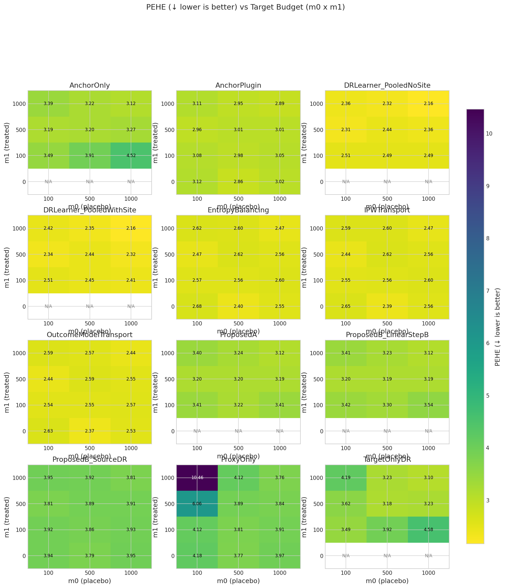

# Fair OptionB evaluation: m₀ × m₁ grid with controlled DGP

**Benchmark ID:** `gold_fair_sweep`

**Generated:** 2026-02-03 16:43

---

## 1. Motivation

**Research Question:** How does OptionB (ProposedB_SourceDR) perform when its assumptions are *approximately satisfied*?

**Why This Matters:**
- Previous sweeps used adversarial DGP settings (SNR < 1, AUC = 1.0, high drift)
- This led to "catastrophic failure" for OptionB that was structurally guaranteed
- This sweep uses **fair settings** where OptionB assumptions hold:
  - SNR ≥ 2 (cross-arm transfer signal present)
  - Overlap AUC ~ 0.75 (moderate, not degenerate)
  - Intercept drift controlled (σ_α = 0.5)

**Expected Behavior:**
- **ProposedB_SourceDR** should show moderate performance (not catastrophic failure)
- At m₁ = 0, ProposedB_SourceDR is the only Proposed variant that works
- As m₁ increases, ProposedA should outperform ProposedB variants
- The gap between ProposedA and ProposedB_SourceDR reflects the value of target treated data

---

## 2. Simulation Setup

**Fair DGP for OptionB Evaluation:**

Uses `FairSyntheticRCTConfig` with advisor-recommended settings:

**Cross-arm Transfer (A6):**
- `nontransfer_scale_target = 0.1` → SNR ≈ 3-4
- This means: ‖M*β₀‖ >> ‖ν‖ (transfer signal dominates)

**Covariate Overlap:**
- `overlap_lambda = 0.25` → AUC ≈ 0.75
- This means: Source models can generalize to target (not pure extrapolation)

**Intercept Drift:**
- `intercept_drift_scale = 0.5` → σ_α = 0.5
- This means: Arm means are stable across replications

**Outcome Model:**
$$\mu_{a,c}(x) = \alpha_{a,c} + x^\top b_a + x^\top \beta_{a,c} + \text{nonlin}(x)$$

where $\beta_{1,c} = M^* \beta_{0,c} + \nu_c$ with small $\nu_c$.

### Parameter Summary

| Parameter | Value | Description |
|-----------|-------|-------------|
| **Sweep param** | `m0` | [100, 500, 1000] |
| n_proxy_total | 20000 | Total source/proxy observations |
| C_sources | 10 | Number of source sites |
| nontransfer_scale | 0.1 | Scale of non-transferable component (σ) |
| use_fair_dgp | True | See documentation |
| overlap_lambda | 0.25 | See documentation |
| intercept_drift_scale | 0.5 | See documentation |

---

## 3. Metrics & Interpretation

| Metric | Direction | Description |
|--------|-----------|-------------|
| **PEHE (Precision in Estimating Heterogeneous Effects)** | ↓ lower is better | Root mean squared error of CATE predictions. Measures how accurately the estimat... |
| **ATE Absolute Error** | ↓ lower is better | Absolute difference between estimated and true average treatment effect.... |
| **ATE Bias (Signed)** | ↑ closer to 0 is better | Signed bias in ATE estimate. Positive = overestimate, negative = underestimate.... |
| **Spearman Rank Correlation** | ↑ higher is better | Rank correlation between predicted and true treatment effects.... |
| **Kendall Rank Correlation** | ↑ higher is better | Kendall tau-b correlation. More robust to ties than Spearman.... |
| **Qini AUC (Oracle)** | ↑ higher is better | Area under the Qini curve. Measures ranking quality for treatment targeting.... |
| **Top-10% Uplift Capture Ratio** | ↑ higher is better | Fraction of maximum uplift captured when treating top 10% by predicted CATE.... |
| **Top-20% Uplift Capture Ratio** | ↑ higher is better | Fraction of maximum uplift captured when treating top 20% by predicted CATE.... |
| **Top-30% Uplift Capture Ratio** | ↑ higher is better | Fraction of maximum uplift captured when treating top 30%.... |
| **Calibration Slope** | ↑ closer to 1 is better | Slope of regression of true τ on predicted τ̂. Ideal = 1.0.... |
| **Calibration R²** | ↑ higher is better | Variance explained by predictions. Measures calibration quality.... |
| **CATE ECE (Expected Calibration Error)** | ↓ lower is better | Expected calibration error for CATE. Binned average miscalibration.... |
| **Policy Value (Treat if τ̂ > 0)** | ↑ higher is better | Expected outcome under threshold-based treatment policy.... |
| **Policy Regret vs Oracle** | ↓ lower is better | Gap between oracle policy value and estimated policy value.... |
| **Policy Value (Treat Top 20%)** | ↑ higher is better | Expected outcome when treating top 20% by predicted CATE.... |
| **Policy Regret (Top 20% Budget)** | ↓ lower is better | Regret compared to oracle top-20% policy.... |
| **μ₀ RMSE (Control Outcome)** | ↓ lower is better | RMSE of predicted control outcomes. Measures nuisance estimation quality.... |

### Detailed Metric Definitions

**PEHE (Precision in Estimating Heterogeneous Effects)**

- Formula: $\sqrt{\frac{1}{n}\sum_i (\hat{\tau}(x_i) - \tau(x_i))^2}$
- Direction: **lower is better**
- A PEHE of 0.5 means predictions are off by 0.5 units on average.

**ATE Absolute Error**

- Formula: $|\hat{\text{ATE}} - \text{ATE}|$
- Direction: **lower is better**
- Important for policy decisions about whether to adopt treatment broadly.

**ATE Bias (Signed)**

- Formula: $\hat{\text{ATE}} - \text{ATE}$
- Direction: **closer to 0 is better**
- Shows systematic over/under-estimation tendencies.

**Spearman Rank Correlation**

- Formula: $\rho(\text{rank}(\hat{\tau}), \text{rank}(\tau))$
- Direction: **higher is better**
- 1.0 = perfect ranking, 0.0 = random. Critical for targeting interventions.

**Kendall Rank Correlation**

- Formula: $\tau_K(\hat{\tau}, \tau)$
- Direction: **higher is better**
- Alternative ranking metric; useful when ties are common.

**Qini AUC (Oracle)**

- Formula: Normalized AUC of cumulative uplift curve
- Direction: **higher is better**
- 1.0 = oracle ranking, 0.0 = random. Simulation-only metric using true τ.

**Top-10% Uplift Capture Ratio**

- Formula: $\frac{\bar{\tau}_{top10\%\ by\ \hat{\tau}}}{\bar{\tau}_{top10\%\ by\ \tau}}$
- Direction: **higher is better**
- 1.0 = oracle selection. Measures targeting efficiency for top patients.

**Top-20% Uplift Capture Ratio**

- Formula: $\frac{\bar{\tau}_{top20\%\ by\ \hat{\tau}}}{\bar{\tau}_{top20\%\ by\ \tau}}$
- Direction: **higher is better**
- 1.0 = oracle selection. Less stringent than top-10%.

**Top-30% Uplift Capture Ratio**

- Formula: $\frac{\bar{\tau}_{top30\%\ by\ \hat{\tau}}}{\bar{\tau}_{top30\%\ by\ \tau}}$
- Direction: **higher is better**
- Less stringent targeting metric.

**Calibration Slope**

- Formula: $\beta$ in $\tau = \alpha + \beta \hat{\tau}$
- Direction: **closer to 1 is better**
- <1 = overconfident predictions, >1 = underconfident.

**Calibration R²**

- Formula: $R^2$ of calibration regression
- Direction: **higher is better**
- Higher R² means predictions track true effects well.

**CATE ECE (Expected Calibration Error)**

- Formula: $\sum_b \frac{n_b}{n} |E[\tau | \hat{\tau} \in b] - E[\hat{\tau} | \hat{\tau} \in b]|$
- Direction: **lower is better**
- Lower ECE means better calibration across prediction ranges.

**Policy Value (Treat if τ̂ > 0)**

- Formula: $E[\mu_0 + \pi(\hat{\tau}) \cdot \tau]$ where $\pi(\hat{\tau}) = 1\{\hat{\tau} > 0\}$
- Direction: **higher is better**
- Higher value = better treatment decisions based on predictions.

**Policy Regret vs Oracle**

- Formula: $V(\pi^*) - V(\hat{\pi})$
- Direction: **lower is better**
- Lower regret = closer to optimal treatment decisions.

**Policy Value (Treat Top 20%)**

- Formula: $E[\mu_0 + \pi_{top20\%}(\hat{\tau}) \cdot \tau]$
- Direction: **higher is better**
- Budget-constrained policy evaluation.

**Policy Regret (Top 20% Budget)**

- Formula: $V(\pi^*_{top20\%}) - V(\hat{\pi}_{top20\%})$
- Direction: **lower is better**
- Budget-constrained regret.

**μ₀ RMSE (Control Outcome)**

- Formula: $\sqrt{\frac{1}{n}\sum_i (\hat{\mu}_0(x_i) - \mu_0(x_i))^2}$
- Direction: **lower is better**
- Important diagnostic; poor μ₀ estimation can propagate to CATE errors.

---

## 4. Methods Compared

| Method | Uses Target Placebo | Uses Source Data | Description |
|--------|---------------------|------------------|-------------|
| **TargetOnlyDR** | ✗ | ✗ | See documentation |
| **ProxyOnly** | ✗ | ✓ | Uses only source data, ignores target |
| **AnchorOnly** | ✓ | ✗ | Uses only target placebo data |
| **AnchorPlugin** | ✗ | ✗ | See documentation |
| **ProposedA** | ✓ | ✓ | Proposed (Option A): requires target treated |
| **ProposedB_LinearStepB** | ✓ | ✓ | Proposed (Option B): placebo-anchored with linear Step B |
| **ProposedB_SourceDR** | ✗ | ✗ | See documentation |
| **IPWTransport** | ✗ | ✗ | See documentation |
| **EntropyBalancing** | ✗ | ✗ | See documentation |
| **OutcomeModelTransport** | ✗ | ✗ | See documentation |
| **DRLearner_PooledWithSite** | ✗ | ✗ | See documentation |
| **DRLearner_PooledNoSite** | ✗ | ✗ | See documentation |

---

## 5. Experiment Summary

- **Sweep parameter:** `m0` ∈ [100, 500, 1000]
- **Monte Carlo replicates:** 100 per scenario
- **Methods evaluated:** 12
- **Total runs:** 14400

---

## 6. Results

### Best Methods (averaged across sweep)

| Metric | Best Method | Value | Direction |
|--------|-------------|-------|----------|
| PEHE | **DRLearner_PooledWithSite** | 2.1631 | ↓ lower |
| ATE Error | **ProposedB_LinearStepB** | 0.1009 | ↓ lower |
| Spearman ρ | **ProxyOnly** | 0.3624 | ↑ higher |
| Kendall τ | **ProxyOnly** | 0.2483 | ↑ higher |
| Qini AUC | **ProxyOnly** | 0.3768 | ↑ higher |
| Top-10% Ratio | **ProxyOnly** | 0.3615 | ↑ higher |
| Top-20% Ratio | **ProxyOnly** | 0.3430 | ↑ higher |
| Calibration R² | **TargetOnlyDR** | 0.1483 | ↑ higher |
| CATE ECE | **DRLearner_PooledWithSite** | 0.6998 | ↓ lower |
| Policy Value | **ProxyOnly** | 0.7006 | ↑ higher |
| Policy Regret | **DRLearner_PooledWithSite** | 0.2570 | ↓ lower |

### Core Metrics

| m0 | m1 | Method | PEHE (↓) | ATE Err (↓) | Spearman (↑) | Qini (↑) |
|---|---|---|---|---|---|
| 100 | 0 | AnchorOnly | N/A | N/A | N/A | N/A |
| 100 | 0 | AnchorPlugin | 3.119 ± 1.181 | 0.696 ± 0.474 | 0.749 ± 0.121 | 0.763 ± 0.119 |
| 100 | 0 | DRLearner_PooledNoSite | N/A | N/A | N/A | N/A |
| 100 | 0 | DRLearner_PooledWithSite | N/A | N/A | N/A | N/A |
| 100 | 0 | EntropyBalancing | 2.681 ± 1.385 | 0.693 ± 0.665 | 0.817 ± 0.141 | 0.828 ± 0.137 |
| 100 | 0 | IPWTransport | 2.646 ± 1.378 | 0.690 ± 0.661 | 0.822 ± 0.138 | 0.833 ± 0.134 |
| 100 | 0 | OutcomeModelTransport | 2.635 ± 1.371 | 0.680 ± 0.655 | 0.824 ± 0.137 | 0.835 ± 0.133 |
| 100 | 0 | ProposedA | N/A | N/A | N/A | N/A |
| 100 | 0 | ProposedB_LinearStepB | N/A | N/A | N/A | N/A |
| 100 | 0 | ProposedB_SourceDR | 3.938 ± 1.115 | 0.859 ± 0.651 | 0.585 ± 0.111 | 0.602 ± 0.111 |
| 100 | 0 | ProxyOnly | 4.182 ± 1.126 | 0.872 ± 0.664 | 0.502 ± 0.114 | 0.518 ± 0.115 |
| 100 | 0 | TargetOnlyDR | N/A | N/A | N/A | N/A |
| 100 | 100 | AnchorOnly | 3.489 ± 0.677 | 0.315 ± 0.249 | 0.700 ± 0.052 | 0.716 ± 0.050 |
| 100 | 100 | AnchorPlugin | 3.082 ± 0.935 | 0.708 ± 0.471 | 0.744 ± 0.127 | 0.757 ± 0.126 |
| 100 | 100 | DRLearner_PooledNoSite | 2.510 ± 1.221 | 0.732 ± 0.578 | 0.829 ± 0.154 | 0.839 ± 0.150 |
| 100 | 100 | DRLearner_PooledWithSite | 2.509 ± 1.220 | 0.731 ± 0.576 | 0.829 ± 0.154 | 0.839 ± 0.150 |
| 100 | 100 | EntropyBalancing | 2.575 ± 1.215 | 0.746 ± 0.599 | 0.821 ± 0.156 | 0.832 ± 0.152 |
| 100 | 100 | IPWTransport | 2.545 ± 1.229 | 0.744 ± 0.602 | 0.825 ± 0.157 | 0.835 ± 0.153 |
| 100 | 100 | OutcomeModelTransport | 2.543 ± 1.234 | 0.753 ± 0.597 | 0.825 ± 0.157 | 0.836 ± 0.154 |
| 100 | 100 | ProposedA | 3.414 ± 0.629 | 0.274 ± 0.200 | 0.721 ± 0.047 | 0.736 ± 0.045 |
| 100 | 100 | ProposedB_LinearStepB | 3.416 ± 0.628 | 0.285 ± 0.203 | 0.722 ± 0.048 | 0.737 ± 0.046 |
| 100 | 100 | ProposedB_SourceDR | 3.923 ± 0.844 | 0.934 ± 0.698 | 0.577 ± 0.109 | 0.594 ± 0.110 |
| 100 | 100 | ProxyOnly | 4.120 ± 0.819 | 0.882 ± 0.667 | 0.505 ± 0.123 | 0.520 ± 0.124 |
| 100 | 100 | TargetOnlyDR | 3.492 ± 0.643 | 0.344 ± 0.266 | 0.687 ± 0.055 | 0.703 ± 0.054 |
| 100 | 500 | AnchorOnly | 3.190 ± 0.575 | 0.152 ± 0.105 | 0.744 ± 0.036 | 0.759 ± 0.034 |
| 100 | 500 | AnchorPlugin | 2.960 ± 0.815 | 0.682 ± 0.519 | 0.758 ± 0.102 | 0.772 ± 0.099 |
| 100 | 500 | DRLearner_PooledNoSite | 2.315 ± 0.971 | 0.674 ± 0.547 | 0.856 ± 0.112 | 0.866 ± 0.107 |
| 100 | 500 | DRLearner_PooledWithSite | 2.343 ± 0.993 | 0.687 ± 0.552 | 0.852 ± 0.116 | 0.862 ± 0.111 |
| 100 | 500 | EntropyBalancing | 2.472 ± 1.031 | 0.754 ± 0.603 | 0.836 ± 0.126 | 0.846 ± 0.120 |
| 100 | 500 | IPWTransport | 2.440 ± 1.032 | 0.760 ± 0.595 | 0.841 ± 0.124 | 0.851 ± 0.119 |
| 100 | 500 | OutcomeModelTransport | 2.435 ± 1.026 | 0.750 ± 0.606 | 0.842 ± 0.123 | 0.852 ± 0.118 |
| 100 | 500 | ProposedA | 3.198 ± 0.572 | 0.145 ± 0.108 | 0.739 ± 0.037 | 0.755 ± 0.035 |
| 100 | 500 | ProposedB_LinearStepB | 3.200 ± 0.568 | 0.148 ± 0.109 | 0.740 ± 0.038 | 0.755 ± 0.036 |
| 100 | 500 | ProposedB_SourceDR | 3.814 ± 0.798 | 0.924 ± 0.711 | 0.583 ± 0.104 | 0.601 ± 0.104 |
| 100 | 500 | ProxyOnly | 6.065 ± 1.531 | 2.735 ± 2.095 | 0.384 ± 0.113 | 0.399 ± 0.117 |
| 100 | 500 | TargetOnlyDR | 3.615 ± 0.579 | 0.213 ± 0.173 | 0.646 ± 0.067 | 0.663 ± 0.066 |
| 100 | 1000 | AnchorOnly | 3.395 ± 0.725 | 0.151 ± 0.116 | 0.706 ± 0.045 | 0.722 ± 0.043 |
| 100 | 1000 | AnchorPlugin | 3.110 ± 1.234 | 0.699 ± 0.584 | 0.742 ± 0.139 | 0.756 ± 0.137 |
| 100 | 1000 | DRLearner_PooledNoSite | 2.361 ± 1.251 | 0.604 ± 0.519 | 0.856 ± 0.121 | 0.866 ± 0.116 |
| 100 | 1000 | DRLearner_PooledWithSite | 2.423 ± 1.301 | 0.614 ± 0.549 | 0.847 ± 0.131 | 0.857 ± 0.126 |
| 100 | 1000 | EntropyBalancing | 2.618 ± 1.381 | 0.721 ± 0.649 | 0.824 ± 0.148 | 0.834 ± 0.144 |
| 100 | 1000 | IPWTransport | 2.589 ± 1.384 | 0.718 ± 0.643 | 0.828 ± 0.148 | 0.838 ± 0.144 |
| 100 | 1000 | OutcomeModelTransport | 2.587 ± 1.392 | 0.721 ± 0.652 | 0.828 ± 0.149 | 0.838 ± 0.144 |
| 100 | 1000 | ProposedA | 3.405 ± 0.723 | 0.151 ± 0.114 | 0.705 ± 0.043 | 0.721 ± 0.041 |
| 100 | 1000 | ProposedB_LinearStepB | 3.406 ± 0.724 | 0.145 ± 0.117 | 0.704 ± 0.043 | 0.720 ± 0.042 |
| 100 | 1000 | ProposedB_SourceDR | 3.953 ± 1.140 | 0.945 ± 0.761 | 0.576 ± 0.117 | 0.592 ± 0.117 |
| 100 | 1000 | ProxyOnly | 10.460 ± 3.158 | 5.775 ± 4.147 | 0.362 ± 0.129 | 0.377 ± 0.132 |
| 100 | 1000 | TargetOnlyDR | 4.191 ± 0.769 | 0.253 ± 0.184 | 0.576 ± 0.073 | 0.593 ± 0.073 |
| 500 | 0 | AnchorOnly | N/A | N/A | N/A | N/A |
| 500 | 0 | AnchorPlugin | 2.862 ± 0.880 | 0.682 ± 0.478 | 0.773 ± 0.105 | 0.787 ± 0.102 |
| 500 | 0 | DRLearner_PooledNoSite | N/A | N/A | N/A | N/A |
| 500 | 0 | DRLearner_PooledWithSite | N/A | N/A | N/A | N/A |
| 500 | 0 | EntropyBalancing | 2.395 ± 1.135 | 0.761 ± 0.544 | 0.845 ± 0.139 | 0.855 ± 0.134 |
| 500 | 0 | IPWTransport | 2.393 ± 1.135 | 0.765 ± 0.542 | 0.845 ± 0.139 | 0.855 ± 0.134 |
| 500 | 0 | OutcomeModelTransport | 2.373 ± 1.139 | 0.750 ± 0.553 | 0.848 ± 0.137 | 0.858 ± 0.132 |
| 500 | 0 | ProposedA | N/A | N/A | N/A | N/A |
| 500 | 0 | ProposedB_LinearStepB | N/A | N/A | N/A | N/A |
| 500 | 0 | ProposedB_SourceDR | 3.786 ± 0.851 | 0.958 ± 0.602 | 0.579 ± 0.113 | 0.596 ± 0.113 |
| 500 | 0 | ProxyOnly | 3.773 ± 0.837 | 0.896 ± 0.652 | 0.592 ± 0.105 | 0.609 ± 0.105 |
| 500 | 0 | TargetOnlyDR | N/A | N/A | N/A | N/A |
| 500 | 100 | AnchorOnly | 3.915 ± 0.914 | 0.275 ± 0.193 | 0.616 ± 0.074 | 0.632 ± 0.073 |
| 500 | 100 | AnchorPlugin | 2.975 ± 0.903 | 0.644 ± 0.590 | 0.755 ± 0.116 | 0.769 ± 0.113 |
| 500 | 100 | DRLearner_PooledNoSite | 2.491 ± 1.070 | 0.711 ± 0.517 | 0.832 ± 0.125 | 0.843 ± 0.119 |
| 500 | 100 | DRLearner_PooledWithSite | 2.453 ± 1.045 | 0.694 ± 0.503 | 0.837 ± 0.121 | 0.848 ± 0.115 |
| 500 | 100 | EntropyBalancing | 2.565 ± 1.055 | 0.764 ± 0.561 | 0.826 ± 0.124 | 0.838 ± 0.119 |
| 500 | 100 | IPWTransport | 2.562 ± 1.058 | 0.765 ± 0.564 | 0.827 ± 0.124 | 0.838 ± 0.119 |
| 500 | 100 | OutcomeModelTransport | 2.546 ± 1.079 | 0.763 ± 0.554 | 0.827 ± 0.128 | 0.838 ± 0.123 |
| 500 | 100 | ProposedA | 3.223 ± 0.577 | 0.147 ± 0.116 | 0.739 ± 0.036 | 0.754 ± 0.033 |
| 500 | 100 | ProposedB_LinearStepB | 3.301 ± 0.591 | 0.175 ± 0.143 | 0.719 ± 0.043 | 0.734 ± 0.042 |
| 500 | 100 | ProposedB_SourceDR | 3.863 ± 0.819 | 0.989 ± 0.688 | 0.579 ± 0.105 | 0.596 ± 0.105 |
| 500 | 100 | ProxyOnly | 3.807 ± 0.828 | 0.668 ± 0.625 | 0.598 ± 0.115 | 0.614 ± 0.115 |
| 500 | 100 | TargetOnlyDR | 3.918 ± 0.861 | 0.237 ± 0.191 | 0.610 ± 0.067 | 0.626 ± 0.065 |
| 500 | 500 | AnchorOnly | 3.204 ± 0.749 | 0.134 ± 0.105 | 0.742 ± 0.031 | 0.758 ± 0.028 |
| 500 | 500 | AnchorPlugin | 3.010 ± 1.139 | 0.642 ± 0.442 | 0.756 ± 0.119 | 0.769 ± 0.116 |
| 500 | 500 | DRLearner_PooledNoSite | 2.444 ± 1.210 | 0.617 ± 0.493 | 0.843 ± 0.116 | 0.853 ± 0.111 |
| 500 | 500 | DRLearner_PooledWithSite | 2.442 ± 1.212 | 0.617 ± 0.492 | 0.843 ± 0.117 | 0.853 ± 0.112 |
| 500 | 500 | EntropyBalancing | 2.619 ± 1.282 | 0.718 ± 0.584 | 0.822 ± 0.130 | 0.833 ± 0.125 |
| 500 | 500 | IPWTransport | 2.618 ± 1.286 | 0.721 ± 0.586 | 0.822 ± 0.130 | 0.834 ± 0.125 |
| 500 | 500 | OutcomeModelTransport | 2.593 ± 1.279 | 0.718 ± 0.572 | 0.825 ± 0.130 | 0.836 ± 0.125 |
| 500 | 500 | ProposedA | 3.196 ± 0.735 | 0.109 ± 0.085 | 0.744 ± 0.031 | 0.759 ± 0.029 |
| 500 | 500 | ProposedB_LinearStepB | 3.193 ± 0.733 | 0.113 ± 0.088 | 0.744 ± 0.030 | 0.760 ± 0.028 |
| 500 | 500 | ProposedB_SourceDR | 3.895 ± 1.068 | 0.914 ± 0.642 | 0.580 ± 0.103 | 0.596 ± 0.103 |
| 500 | 500 | ProxyOnly | 3.893 ± 1.108 | 0.873 ± 0.673 | 0.584 ± 0.120 | 0.599 ± 0.120 |
| 500 | 500 | TargetOnlyDR | 3.183 ± 0.735 | 0.137 ± 0.109 | 0.745 ± 0.029 | 0.761 ± 0.027 |
| 500 | 1000 | AnchorOnly | 3.222 ± 0.626 | 0.117 ± 0.086 | 0.739 ± 0.029 | 0.755 ± 0.028 |
| 500 | 1000 | AnchorPlugin | 2.947 ± 0.925 | 0.649 ± 0.511 | 0.769 ± 0.108 | 0.782 ± 0.105 |
| 500 | 1000 | DRLearner_PooledNoSite | 2.323 ± 1.069 | 0.595 ± 0.473 | 0.857 ± 0.110 | 0.867 ± 0.106 |
| 500 | 1000 | DRLearner_PooledWithSite | 2.354 ± 1.092 | 0.603 ± 0.482 | 0.853 ± 0.114 | 0.863 ± 0.110 |
| 500 | 1000 | EntropyBalancing | 2.598 ± 1.201 | 0.751 ± 0.603 | 0.825 ± 0.137 | 0.835 ± 0.134 |
| 500 | 1000 | IPWTransport | 2.597 ± 1.201 | 0.753 ± 0.603 | 0.825 ± 0.137 | 0.836 ± 0.133 |
| 500 | 1000 | OutcomeModelTransport | 2.572 ± 1.194 | 0.744 ± 0.598 | 0.828 ± 0.135 | 0.839 ± 0.131 |
| 500 | 1000 | ProposedA | 3.237 ± 0.631 | 0.109 ± 0.077 | 0.734 ± 0.028 | 0.749 ± 0.027 |
| 500 | 1000 | ProposedB_LinearStepB | 3.234 ± 0.630 | 0.108 ± 0.080 | 0.735 ± 0.028 | 0.750 ± 0.027 |
| 500 | 1000 | ProposedB_SourceDR | 3.922 ± 0.911 | 0.908 ± 0.719 | 0.567 ± 0.108 | 0.583 ± 0.109 |
| 500 | 1000 | ProxyOnly | 4.116 ± 0.818 | 1.232 ± 0.883 | 0.546 ± 0.115 | 0.562 ± 0.116 |
| 500 | 1000 | TargetOnlyDR | 3.232 ± 0.614 | 0.125 ± 0.088 | 0.736 ± 0.031 | 0.752 ± 0.029 |
| 1000 | 0 | AnchorOnly | N/A | N/A | N/A | N/A |
| 1000 | 0 | AnchorPlugin | 3.023 ± 1.075 | 0.683 ± 0.559 | 0.770 ± 0.091 | 0.784 ± 0.088 |
| 1000 | 0 | DRLearner_PooledNoSite | N/A | N/A | N/A | N/A |
| 1000 | 0 | DRLearner_PooledWithSite | N/A | N/A | N/A | N/A |
| 1000 | 0 | EntropyBalancing | 2.553 ± 1.270 | 0.754 ± 0.589 | 0.840 ± 0.123 | 0.851 ± 0.118 |
| 1000 | 0 | IPWTransport | 2.557 ± 1.269 | 0.755 ± 0.590 | 0.840 ± 0.123 | 0.850 ± 0.118 |
| 1000 | 0 | OutcomeModelTransport | 2.531 ± 1.279 | 0.755 ± 0.593 | 0.843 ± 0.126 | 0.853 ± 0.121 |
| 1000 | 0 | ProposedA | N/A | N/A | N/A | N/A |
| 1000 | 0 | ProposedB_LinearStepB | N/A | N/A | N/A | N/A |
| 1000 | 0 | ProposedB_SourceDR | 3.949 ± 1.087 | 0.966 ± 0.668 | 0.583 ± 0.095 | 0.600 ± 0.095 |
| 1000 | 0 | ProxyOnly | 3.969 ± 1.050 | 0.996 ± 0.756 | 0.589 ± 0.087 | 0.606 ± 0.086 |
| 1000 | 0 | TargetOnlyDR | N/A | N/A | N/A | N/A |
| 1000 | 100 | AnchorOnly | 4.524 ± 1.221 | 0.294 ± 0.250 | 0.551 ± 0.066 | 0.568 ± 0.066 |
| 1000 | 100 | AnchorPlugin | 3.045 ± 1.048 | 0.698 ± 0.550 | 0.760 ± 0.118 | 0.773 ± 0.116 |
| 1000 | 100 | DRLearner_PooledNoSite | 2.489 ± 1.204 | 0.663 ± 0.532 | 0.838 ± 0.140 | 0.847 ± 0.137 |
| 1000 | 100 | DRLearner_PooledWithSite | 2.407 ± 1.150 | 0.634 ± 0.498 | 0.849 ± 0.130 | 0.858 ± 0.127 |
| 1000 | 100 | EntropyBalancing | 2.597 ± 1.230 | 0.754 ± 0.594 | 0.827 ± 0.148 | 0.837 ± 0.146 |
| 1000 | 100 | IPWTransport | 2.602 ± 1.229 | 0.755 ± 0.596 | 0.826 ± 0.148 | 0.836 ± 0.146 |
| 1000 | 100 | OutcomeModelTransport | 2.566 ± 1.220 | 0.745 ± 0.583 | 0.831 ± 0.144 | 0.841 ± 0.141 |
| 1000 | 100 | ProposedA | 3.409 ± 0.688 | 0.149 ± 0.106 | 0.703 ± 0.041 | 0.719 ± 0.040 |
| 1000 | 100 | ProposedB_LinearStepB | 3.540 ± 0.755 | 0.168 ± 0.121 | 0.680 ± 0.053 | 0.697 ± 0.052 |
| 1000 | 100 | ProposedB_SourceDR | 3.929 ± 1.012 | 0.920 ± 0.640 | 0.576 ± 0.116 | 0.592 ± 0.118 |
| 1000 | 100 | ProxyOnly | 3.906 ± 0.990 | 0.749 ± 0.569 | 0.594 ± 0.112 | 0.610 ± 0.113 |
| 1000 | 100 | TargetOnlyDR | 4.583 ± 1.137 | 0.299 ± 0.238 | 0.538 ± 0.065 | 0.554 ± 0.064 |
| 1000 | 500 | AnchorOnly | 3.273 ± 0.647 | 0.144 ± 0.114 | 0.724 ± 0.040 | 0.739 ± 0.038 |
| 1000 | 500 | AnchorPlugin | 3.012 ± 0.995 | 0.776 ± 0.594 | 0.759 ± 0.124 | 0.772 ± 0.123 |
| 1000 | 500 | DRLearner_PooledNoSite | 2.365 ± 1.163 | 0.700 ± 0.497 | 0.850 ± 0.138 | 0.859 ± 0.135 |
| 1000 | 500 | DRLearner_PooledWithSite | 2.325 ± 1.135 | 0.680 ± 0.481 | 0.855 ± 0.132 | 0.864 ± 0.129 |
| 1000 | 500 | EntropyBalancing | 2.557 ± 1.234 | 0.846 ± 0.610 | 0.830 ± 0.154 | 0.840 ± 0.151 |
| 1000 | 500 | IPWTransport | 2.560 ± 1.238 | 0.846 ± 0.611 | 0.829 ± 0.155 | 0.839 ± 0.152 |
| 1000 | 500 | OutcomeModelTransport | 2.548 ± 1.243 | 0.849 ± 0.610 | 0.830 ± 0.156 | 0.840 ± 0.153 |
| 1000 | 500 | ProposedA | 3.189 ± 0.585 | 0.107 ± 0.088 | 0.737 ± 0.031 | 0.752 ± 0.029 |
| 1000 | 500 | ProposedB_LinearStepB | 3.186 ± 0.587 | 0.114 ± 0.084 | 0.739 ± 0.032 | 0.754 ± 0.029 |
| 1000 | 500 | ProposedB_SourceDR | 3.908 ± 0.876 | 1.024 ± 0.687 | 0.571 ± 0.124 | 0.587 ± 0.126 |
| 1000 | 500 | ProxyOnly | 3.844 ± 0.868 | 0.838 ± 0.646 | 0.586 ± 0.118 | 0.603 ± 0.120 |
| 1000 | 500 | TargetOnlyDR | 3.230 ± 0.604 | 0.137 ± 0.115 | 0.731 ± 0.037 | 0.747 ± 0.035 |
| 1000 | 1000 | AnchorOnly | 3.119 ± 0.590 | 0.110 ± 0.081 | 0.738 ± 0.032 | 0.753 ± 0.030 |
| 1000 | 1000 | AnchorPlugin | 2.886 ± 0.958 | 0.712 ± 0.590 | 0.766 ± 0.127 | 0.778 ± 0.126 |
| 1000 | 1000 | DRLearner_PooledNoSite | 2.164 ± 1.096 | 0.595 ± 0.529 | 0.868 ± 0.123 | 0.876 ± 0.120 |
| 1000 | 1000 | DRLearner_PooledWithSite | 2.163 ± 1.095 | 0.595 ± 0.528 | 0.868 ± 0.122 | 0.877 ± 0.119 |
| 1000 | 1000 | EntropyBalancing | 2.470 ± 1.238 | 0.785 ± 0.701 | 0.834 ± 0.152 | 0.843 ± 0.150 |
| 1000 | 1000 | IPWTransport | 2.473 ± 1.237 | 0.786 ± 0.701 | 0.834 ± 0.152 | 0.843 ± 0.150 |
| 1000 | 1000 | OutcomeModelTransport | 2.438 ± 1.242 | 0.785 ± 0.701 | 0.838 ± 0.151 | 0.847 ± 0.149 |
| 1000 | 1000 | ProposedA | 3.124 ± 0.574 | 0.101 ± 0.070 | 0.733 ± 0.030 | 0.748 ± 0.028 |
| 1000 | 1000 | ProposedB_LinearStepB | 3.116 ± 0.574 | 0.101 ± 0.075 | 0.736 ± 0.031 | 0.751 ± 0.029 |
| 1000 | 1000 | ProposedB_SourceDR | 3.810 ± 0.871 | 0.996 ± 0.756 | 0.585 ± 0.117 | 0.601 ± 0.119 |
| 1000 | 1000 | ProxyOnly | 3.762 ± 0.862 | 0.888 ± 0.691 | 0.586 ± 0.126 | 0.602 ± 0.126 |
| 1000 | 1000 | TargetOnlyDR | 3.099 ± 0.583 | 0.115 ± 0.083 | 0.742 ± 0.030 | 0.758 ± 0.028 |

### Targeting / Ranking Metrics

| m0 | m1 | Method | Top-10% (↑) | Top-20% (↑) | Kendall (↑) |
|---|---|---|---|---|---|
| 100 | 0 | AnchorOnly | N/A | N/A | N/A |
| 100 | 0 | AnchorPlugin | 0.751 ± 0.139 | 0.753 ± 0.154 | 0.563 ± 0.110 |
| 100 | 0 | DRLearner_PooledNoSite | N/A | N/A | N/A |
| 100 | 0 | DRLearner_PooledWithSite | N/A | N/A | N/A |
| 100 | 0 | EntropyBalancing | 0.823 ± 0.155 | 0.814 ± 0.173 | 0.649 ± 0.151 |
| 100 | 0 | IPWTransport | 0.829 ± 0.154 | 0.820 ± 0.169 | 0.654 ± 0.150 |
| 100 | 0 | OutcomeModelTransport | 0.831 ± 0.151 | 0.823 ± 0.168 | 0.656 ± 0.149 |
| 100 | 0 | ProposedA | N/A | N/A | N/A |
| 100 | 0 | ProposedB_LinearStepB | N/A | N/A | N/A |
| 100 | 0 | ProposedB_SourceDR | 0.582 ± 0.142 | 0.576 ± 0.166 | 0.415 ± 0.085 |
| 100 | 0 | ProxyOnly | 0.506 ± 0.152 | 0.496 ± 0.199 | 0.351 ± 0.085 |
| 100 | 0 | TargetOnlyDR | N/A | N/A | N/A |
| 100 | 100 | AnchorOnly | 0.697 ± 0.092 | 0.698 ± 0.107 | 0.511 ± 0.046 |
| 100 | 100 | AnchorPlugin | 0.746 ± 0.149 | 0.741 ± 0.161 | 0.559 ± 0.115 |
| 100 | 100 | DRLearner_PooledNoSite | 0.834 ± 0.167 | 0.831 ± 0.170 | 0.666 ± 0.163 |
| 100 | 100 | DRLearner_PooledWithSite | 0.834 ± 0.166 | 0.831 ± 0.170 | 0.667 ± 0.163 |
| 100 | 100 | EntropyBalancing | 0.826 ± 0.172 | 0.819 ± 0.178 | 0.656 ± 0.162 |
| 100 | 100 | IPWTransport | 0.830 ± 0.171 | 0.826 ± 0.175 | 0.661 ± 0.164 |
| 100 | 100 | OutcomeModelTransport | 0.830 ± 0.170 | 0.827 ± 0.174 | 0.663 ± 0.165 |
| 100 | 100 | ProposedA | 0.726 ± 0.091 | 0.723 ± 0.110 | 0.530 ± 0.043 |
| 100 | 100 | ProposedB_LinearStepB | 0.729 ± 0.092 | 0.724 ± 0.104 | 0.531 ± 0.044 |
| 100 | 100 | ProposedB_SourceDR | 0.577 ± 0.157 | 0.569 ± 0.182 | 0.409 ± 0.084 |
| 100 | 100 | ProxyOnly | 0.492 ± 0.206 | 0.481 ± 0.243 | 0.353 ± 0.092 |
| 100 | 100 | TargetOnlyDR | 0.684 ± 0.106 | 0.690 ± 0.120 | 0.499 ± 0.048 |
| 100 | 500 | AnchorOnly | 0.742 ± 0.079 | 0.732 ± 0.095 | 0.551 ± 0.034 |
| 100 | 500 | AnchorPlugin | 0.758 ± 0.111 | 0.754 ± 0.121 | 0.571 ± 0.097 |
| 100 | 500 | DRLearner_PooledNoSite | 0.859 ± 0.115 | 0.856 ± 0.125 | 0.692 ± 0.135 |
| 100 | 500 | DRLearner_PooledWithSite | 0.855 ± 0.118 | 0.851 ± 0.130 | 0.687 ± 0.138 |
| 100 | 500 | EntropyBalancing | 0.838 ± 0.131 | 0.836 ± 0.139 | 0.669 ± 0.144 |
| 100 | 500 | IPWTransport | 0.843 ± 0.129 | 0.840 ± 0.139 | 0.675 ± 0.144 |
| 100 | 500 | OutcomeModelTransport | 0.845 ± 0.126 | 0.842 ± 0.138 | 0.676 ± 0.143 |
| 100 | 500 | ProposedA | 0.744 ± 0.075 | 0.729 ± 0.091 | 0.547 ± 0.034 |
| 100 | 500 | ProposedB_LinearStepB | 0.742 ± 0.073 | 0.731 ± 0.090 | 0.548 ± 0.035 |
| 100 | 500 | ProposedB_SourceDR | 0.574 ± 0.137 | 0.569 ± 0.142 | 0.414 ± 0.081 |
| 100 | 500 | ProxyOnly | 0.361 ± 0.183 | 0.343 ± 0.219 | 0.264 ± 0.080 |
| 100 | 500 | TargetOnlyDR | 0.622 ± 0.114 | 0.633 ± 0.121 | 0.466 ± 0.056 |
| 100 | 1000 | AnchorOnly | 0.726 ± 0.085 | 0.718 ± 0.095 | 0.516 ± 0.040 |
| 100 | 1000 | AnchorPlugin | 0.754 ± 0.151 | 0.751 ± 0.158 | 0.559 ± 0.125 |
| 100 | 1000 | DRLearner_PooledNoSite | 0.861 ± 0.124 | 0.861 ± 0.129 | 0.692 ± 0.137 |
| 100 | 1000 | DRLearner_PooledWithSite | 0.851 ± 0.136 | 0.852 ± 0.139 | 0.682 ± 0.144 |
| 100 | 1000 | EntropyBalancing | 0.831 ± 0.153 | 0.828 ± 0.163 | 0.657 ± 0.155 |
| 100 | 1000 | IPWTransport | 0.834 ± 0.153 | 0.832 ± 0.159 | 0.662 ± 0.156 |
| 100 | 1000 | OutcomeModelTransport | 0.832 ± 0.154 | 0.832 ± 0.160 | 0.662 ± 0.156 |
| 100 | 1000 | ProposedA | 0.727 ± 0.080 | 0.717 ± 0.094 | 0.515 ± 0.038 |
| 100 | 1000 | ProposedB_LinearStepB | 0.726 ± 0.084 | 0.717 ± 0.094 | 0.515 ± 0.038 |
| 100 | 1000 | ProposedB_SourceDR | 0.586 ± 0.149 | 0.580 ± 0.170 | 0.408 ± 0.090 |
| 100 | 1000 | ProxyOnly | 0.370 ± 0.202 | 0.364 ± 0.238 | 0.248 ± 0.091 |
| 100 | 1000 | TargetOnlyDR | 0.548 ± 0.117 | 0.589 ± 0.136 | 0.409 ± 0.058 |
| 500 | 0 | AnchorOnly | N/A | N/A | N/A |
| 500 | 0 | AnchorPlugin | 0.777 ± 0.109 | 0.775 ± 0.125 | 0.586 ± 0.098 |
| 500 | 0 | DRLearner_PooledNoSite | N/A | N/A | N/A |
| 500 | 0 | DRLearner_PooledWithSite | N/A | N/A | N/A |
| 500 | 0 | EntropyBalancing | 0.851 ± 0.141 | 0.850 ± 0.141 | 0.679 ± 0.144 |
| 500 | 0 | IPWTransport | 0.852 ± 0.140 | 0.852 ± 0.140 | 0.680 ± 0.144 |
| 500 | 0 | OutcomeModelTransport | 0.854 ± 0.137 | 0.852 ± 0.139 | 0.683 ± 0.145 |
| 500 | 0 | ProposedA | N/A | N/A | N/A |
| 500 | 0 | ProposedB_LinearStepB | N/A | N/A | N/A |
| 500 | 0 | ProposedB_SourceDR | 0.589 ± 0.153 | 0.577 ± 0.169 | 0.411 ± 0.085 |
| 500 | 0 | ProxyOnly | 0.596 ± 0.143 | 0.585 ± 0.159 | 0.421 ± 0.083 |
| 500 | 0 | TargetOnlyDR | N/A | N/A | N/A |
| 500 | 100 | AnchorOnly | 0.563 ± 0.129 | 0.591 ± 0.127 | 0.441 ± 0.059 |
| 500 | 100 | AnchorPlugin | 0.756 ± 0.111 | 0.749 ± 0.120 | 0.569 ± 0.107 |
| 500 | 100 | DRLearner_PooledNoSite | 0.835 ± 0.124 | 0.832 ± 0.128 | 0.663 ± 0.141 |
| 500 | 100 | DRLearner_PooledWithSite | 0.840 ± 0.120 | 0.838 ± 0.124 | 0.668 ± 0.138 |
| 500 | 100 | EntropyBalancing | 0.829 ± 0.125 | 0.827 ± 0.126 | 0.655 ± 0.138 |
| 500 | 100 | IPWTransport | 0.830 ± 0.125 | 0.828 ± 0.126 | 0.656 ± 0.138 |
| 500 | 100 | OutcomeModelTransport | 0.830 ± 0.127 | 0.827 ± 0.132 | 0.658 ± 0.143 |
| 500 | 100 | ProposedA | 0.734 ± 0.066 | 0.725 ± 0.087 | 0.546 ± 0.032 |
| 500 | 100 | ProposedB_LinearStepB | 0.703 ± 0.090 | 0.702 ± 0.097 | 0.528 ± 0.038 |
| 500 | 100 | ProposedB_SourceDR | 0.564 ± 0.135 | 0.551 ± 0.154 | 0.410 ± 0.082 |
| 500 | 100 | ProxyOnly | 0.590 ± 0.141 | 0.577 ± 0.153 | 0.427 ± 0.091 |
| 500 | 100 | TargetOnlyDR | 0.551 ± 0.136 | 0.582 ± 0.137 | 0.435 ± 0.053 |
| 500 | 500 | AnchorOnly | 0.757 ± 0.074 | 0.743 ± 0.081 | 0.549 ± 0.029 |
| 500 | 500 | AnchorPlugin | 0.755 ± 0.126 | 0.753 ± 0.136 | 0.571 ± 0.111 |
| 500 | 500 | DRLearner_PooledNoSite | 0.849 ± 0.120 | 0.848 ± 0.121 | 0.673 ± 0.132 |
| 500 | 500 | DRLearner_PooledWithSite | 0.849 ± 0.121 | 0.848 ± 0.121 | 0.674 ± 0.132 |
| 500 | 500 | EntropyBalancing | 0.828 ± 0.134 | 0.827 ± 0.136 | 0.650 ± 0.140 |
| 500 | 500 | IPWTransport | 0.827 ± 0.135 | 0.827 ± 0.136 | 0.651 ± 0.140 |
| 500 | 500 | OutcomeModelTransport | 0.831 ± 0.136 | 0.831 ± 0.136 | 0.655 ± 0.141 |
| 500 | 500 | ProposedA | 0.753 ± 0.071 | 0.744 ± 0.083 | 0.551 ± 0.029 |
| 500 | 500 | ProposedB_LinearStepB | 0.757 ± 0.067 | 0.746 ± 0.076 | 0.551 ± 0.028 |
| 500 | 500 | ProposedB_SourceDR | 0.577 ± 0.141 | 0.566 ± 0.149 | 0.411 ± 0.080 |
| 500 | 500 | ProxyOnly | 0.572 ± 0.160 | 0.566 ± 0.170 | 0.415 ± 0.093 |
| 500 | 500 | TargetOnlyDR | 0.756 ± 0.068 | 0.745 ± 0.076 | 0.552 ± 0.027 |
| 500 | 1000 | AnchorOnly | 0.749 ± 0.067 | 0.739 ± 0.087 | 0.546 ± 0.027 |
| 500 | 1000 | AnchorPlugin | 0.769 ± 0.130 | 0.768 ± 0.153 | 0.582 ± 0.101 |
| 500 | 1000 | DRLearner_PooledNoSite | 0.861 ± 0.132 | 0.858 ± 0.140 | 0.692 ± 0.130 |
| 500 | 1000 | DRLearner_PooledWithSite | 0.857 ± 0.133 | 0.853 ± 0.145 | 0.687 ± 0.133 |
| 500 | 1000 | EntropyBalancing | 0.827 ± 0.155 | 0.826 ± 0.169 | 0.656 ± 0.146 |
| 500 | 1000 | IPWTransport | 0.828 ± 0.155 | 0.826 ± 0.170 | 0.656 ± 0.146 |
| 500 | 1000 | OutcomeModelTransport | 0.832 ± 0.153 | 0.830 ± 0.165 | 0.660 ± 0.146 |
| 500 | 1000 | ProposedA | 0.741 ± 0.066 | 0.735 ± 0.084 | 0.541 ± 0.026 |
| 500 | 1000 | ProposedB_LinearStepB | 0.740 ± 0.069 | 0.735 ± 0.090 | 0.541 ± 0.026 |
| 500 | 1000 | ProposedB_SourceDR | 0.566 ± 0.152 | 0.564 ± 0.177 | 0.401 ± 0.084 |
| 500 | 1000 | ProxyOnly | 0.563 ± 0.155 | 0.546 ± 0.213 | 0.385 ± 0.088 |
| 500 | 1000 | TargetOnlyDR | 0.747 ± 0.068 | 0.741 ± 0.087 | 0.544 ± 0.029 |
| 1000 | 0 | AnchorOnly | N/A | N/A | N/A |
| 1000 | 0 | AnchorPlugin | 0.771 ± 0.103 | 0.772 ± 0.110 | 0.582 ± 0.087 |
| 1000 | 0 | DRLearner_PooledNoSite | N/A | N/A | N/A |
| 1000 | 0 | DRLearner_PooledWithSite | N/A | N/A | N/A |
| 1000 | 0 | EntropyBalancing | 0.845 ± 0.126 | 0.846 ± 0.129 | 0.670 ± 0.133 |
| 1000 | 0 | IPWTransport | 0.844 ± 0.127 | 0.845 ± 0.129 | 0.669 ± 0.132 |
| 1000 | 0 | OutcomeModelTransport | 0.847 ± 0.127 | 0.847 ± 0.136 | 0.674 ± 0.135 |
| 1000 | 0 | ProposedA | N/A | N/A | N/A |
| 1000 | 0 | ProposedB_LinearStepB | N/A | N/A | N/A |
| 1000 | 0 | ProposedB_SourceDR | 0.588 ± 0.144 | 0.571 ± 0.196 | 0.413 ± 0.074 |
| 1000 | 0 | ProxyOnly | 0.598 ± 0.121 | 0.585 ± 0.176 | 0.418 ± 0.069 |
| 1000 | 0 | TargetOnlyDR | N/A | N/A | N/A |
| 1000 | 100 | AnchorOnly | 0.511 ± 0.107 | 0.554 ± 0.112 | 0.389 ± 0.051 |
| 1000 | 100 | AnchorPlugin | 0.766 ± 0.125 | 0.767 ± 0.124 | 0.573 ± 0.108 |
| 1000 | 100 | DRLearner_PooledNoSite | 0.842 ± 0.144 | 0.843 ± 0.141 | 0.672 ± 0.149 |
| 1000 | 100 | DRLearner_PooledWithSite | 0.853 ± 0.130 | 0.853 ± 0.129 | 0.683 ± 0.142 |
| 1000 | 100 | EntropyBalancing | 0.832 ± 0.151 | 0.831 ± 0.150 | 0.659 ± 0.154 |
| 1000 | 100 | IPWTransport | 0.832 ± 0.152 | 0.831 ± 0.150 | 0.659 ± 0.154 |
| 1000 | 100 | OutcomeModelTransport | 0.836 ± 0.148 | 0.837 ± 0.145 | 0.664 ± 0.151 |
| 1000 | 100 | ProposedA | 0.710 ± 0.072 | 0.711 ± 0.077 | 0.514 ± 0.036 |
| 1000 | 100 | ProposedB_LinearStepB | 0.679 ± 0.101 | 0.682 ± 0.097 | 0.494 ± 0.045 |
| 1000 | 100 | ProposedB_SourceDR | 0.584 ± 0.145 | 0.577 ± 0.152 | 0.408 ± 0.088 |
| 1000 | 100 | ProxyOnly | 0.609 ± 0.134 | 0.598 ± 0.137 | 0.423 ± 0.087 |
| 1000 | 100 | TargetOnlyDR | 0.479 ± 0.124 | 0.536 ± 0.121 | 0.380 ± 0.050 |
| 1000 | 500 | AnchorOnly | 0.739 ± 0.085 | 0.729 ± 0.116 | 0.532 ± 0.036 |
| 1000 | 500 | AnchorPlugin | 0.769 ± 0.148 | 0.765 ± 0.155 | 0.573 ± 0.111 |
| 1000 | 500 | DRLearner_PooledNoSite | 0.857 ± 0.152 | 0.853 ± 0.164 | 0.686 ± 0.147 |
| 1000 | 500 | DRLearner_PooledWithSite | 0.863 ± 0.145 | 0.858 ± 0.159 | 0.692 ± 0.143 |
| 1000 | 500 | EntropyBalancing | 0.836 ± 0.173 | 0.836 ± 0.183 | 0.663 ± 0.155 |
| 1000 | 500 | IPWTransport | 0.835 ± 0.173 | 0.836 ± 0.183 | 0.663 ± 0.156 |
| 1000 | 500 | OutcomeModelTransport | 0.837 ± 0.174 | 0.835 ± 0.182 | 0.665 ± 0.159 |
| 1000 | 500 | ProposedA | 0.749 ± 0.071 | 0.744 ± 0.086 | 0.544 ± 0.029 |
| 1000 | 500 | ProposedB_LinearStepB | 0.749 ± 0.071 | 0.742 ± 0.093 | 0.546 ± 0.029 |
| 1000 | 500 | ProposedB_SourceDR | 0.575 ± 0.188 | 0.569 ± 0.212 | 0.404 ± 0.094 |
| 1000 | 500 | ProxyOnly | 0.609 ± 0.135 | 0.595 ± 0.178 | 0.418 ± 0.091 |
| 1000 | 500 | TargetOnlyDR | 0.751 ± 0.071 | 0.737 ± 0.113 | 0.539 ± 0.034 |
| 1000 | 1000 | AnchorOnly | 0.745 ± 0.067 | 0.736 ± 0.077 | 0.545 ± 0.030 |
| 1000 | 1000 | AnchorPlugin | 0.767 ± 0.145 | 0.762 ± 0.145 | 0.581 ± 0.115 |
| 1000 | 1000 | DRLearner_PooledNoSite | 0.872 ± 0.125 | 0.870 ± 0.125 | 0.708 ± 0.138 |
| 1000 | 1000 | DRLearner_PooledWithSite | 0.872 ± 0.124 | 0.871 ± 0.124 | 0.708 ± 0.138 |
| 1000 | 1000 | EntropyBalancing | 0.836 ± 0.160 | 0.835 ± 0.160 | 0.669 ± 0.156 |
| 1000 | 1000 | IPWTransport | 0.835 ± 0.161 | 0.834 ± 0.161 | 0.669 ± 0.156 |
| 1000 | 1000 | OutcomeModelTransport | 0.840 ± 0.157 | 0.839 ± 0.156 | 0.675 ± 0.158 |
| 1000 | 1000 | ProposedA | 0.739 ± 0.070 | 0.734 ± 0.075 | 0.540 ± 0.028 |
| 1000 | 1000 | ProposedB_LinearStepB | 0.738 ± 0.072 | 0.734 ± 0.074 | 0.543 ± 0.029 |
| 1000 | 1000 | ProposedB_SourceDR | 0.579 ± 0.145 | 0.577 ± 0.153 | 0.416 ± 0.089 |
| 1000 | 1000 | ProxyOnly | 0.588 ± 0.156 | 0.575 ± 0.167 | 0.417 ± 0.097 |
| 1000 | 1000 | TargetOnlyDR | 0.750 ± 0.069 | 0.744 ± 0.072 | 0.549 ± 0.028 |

### ATE Estimation

| m0 | m1 | Method | ATE Est | ATE Err (↓) | ATE Bias |
|---|---|---|---|---|---|
| 100 | 0 | AnchorOnly | N/A | N/A | N/A |
| 100 | 0 | AnchorPlugin | -0.037 ± 0.809 | 0.696 ± 0.474 | -0.090 ± 0.840 |
| 100 | 0 | DRLearner_PooledNoSite | N/A | N/A | N/A |
| 100 | 0 | DRLearner_PooledWithSite | N/A | N/A | N/A |
| 100 | 0 | EntropyBalancing | -0.132 ± 0.935 | 0.693 ± 0.665 | -0.185 ± 0.945 |
| 100 | 0 | IPWTransport | -0.134 ± 0.930 | 0.690 ± 0.661 | -0.187 ± 0.940 |
| 100 | 0 | OutcomeModelTransport | -0.130 ± 0.934 | 0.680 ± 0.655 | -0.183 ± 0.929 |
| 100 | 0 | ProposedA | N/A | N/A | N/A |
| 100 | 0 | ProposedB_LinearStepB | N/A | N/A | N/A |
| 100 | 0 | ProposedB_SourceDR | -0.056 ± 0.525 | 0.859 ± 0.651 | -0.109 ± 1.076 |
| 100 | 0 | ProxyOnly | -0.019 ± 1.324 | 0.872 ± 0.664 | -0.072 ± 1.097 |
| 100 | 0 | TargetOnlyDR | N/A | N/A | N/A |
| 100 | 100 | AnchorOnly | 0.098 ± 1.502 | 0.315 ± 0.249 | 0.010 ± 0.403 |
| 100 | 100 | AnchorPlugin | -0.117 ± 1.077 | 0.708 ± 0.471 | -0.205 ± 0.828 |
| 100 | 100 | DRLearner_PooledNoSite | -0.033 ± 1.071 | 0.732 ± 0.578 | -0.121 ± 0.928 |
| 100 | 100 | DRLearner_PooledWithSite | -0.033 ± 1.070 | 0.731 ± 0.576 | -0.121 ± 0.926 |
| 100 | 100 | EntropyBalancing | -0.027 ± 1.067 | 0.746 ± 0.599 | -0.116 ± 0.953 |
| 100 | 100 | IPWTransport | -0.029 ± 1.069 | 0.744 ± 0.602 | -0.118 ± 0.953 |
| 100 | 100 | OutcomeModelTransport | -0.035 ± 1.067 | 0.753 ± 0.597 | -0.123 ± 0.956 |
| 100 | 100 | ProposedA | 0.113 ± 1.475 | 0.274 ± 0.200 | 0.025 ± 0.339 |
| 100 | 100 | ProposedB_LinearStepB | 0.104 ± 1.474 | 0.285 ± 0.203 | 0.015 ± 0.351 |
| 100 | 100 | ProposedB_SourceDR | -0.065 ± 0.572 | 0.934 ± 0.698 | -0.153 ± 1.159 |
| 100 | 100 | ProxyOnly | -0.079 ± 1.719 | 0.882 ± 0.667 | -0.168 ± 1.097 |
| 100 | 100 | TargetOnlyDR | 0.122 ± 1.482 | 0.344 ± 0.266 | 0.033 ± 0.435 |
| 100 | 500 | AnchorOnly | -0.138 ± 1.338 | 0.152 ± 0.105 | 0.008 ± 0.186 |
| 100 | 500 | AnchorPlugin | -0.067 ± 0.967 | 0.682 ± 0.519 | 0.079 ± 0.856 |
| 100 | 500 | DRLearner_PooledNoSite | -0.115 ± 0.961 | 0.674 ± 0.547 | 0.031 ± 0.870 |
| 100 | 500 | DRLearner_PooledWithSite | -0.111 ± 0.959 | 0.687 ± 0.552 | 0.036 ± 0.883 |
| 100 | 500 | EntropyBalancing | -0.116 ± 0.956 | 0.754 ± 0.603 | 0.030 ± 0.968 |
| 100 | 500 | IPWTransport | -0.114 ± 0.948 | 0.760 ± 0.595 | 0.032 ± 0.968 |
| 100 | 500 | OutcomeModelTransport | -0.109 ± 0.961 | 0.750 ± 0.606 | 0.037 ± 0.967 |
| 100 | 500 | ProposedA | -0.132 ± 1.345 | 0.145 ± 0.108 | 0.014 ± 0.181 |
| 100 | 500 | ProposedB_LinearStepB | -0.130 ± 1.351 | 0.148 ± 0.109 | 0.016 ± 0.183 |
| 100 | 500 | ProposedB_SourceDR | -0.015 ± 0.565 | 0.924 ± 0.711 | 0.131 ± 1.162 |
| 100 | 500 | ProxyOnly | 0.006 ± 4.059 | 2.735 ± 2.095 | 0.152 ± 3.453 |
| 100 | 500 | TargetOnlyDR | -0.125 ± 1.353 | 0.213 ± 0.173 | 0.021 ± 0.274 |
| 100 | 1000 | AnchorOnly | 0.169 ± 1.413 | 0.151 ± 0.116 | -0.015 ± 0.190 |
| 100 | 1000 | AnchorPlugin | 0.102 ± 1.083 | 0.699 ± 0.584 | -0.082 ± 0.910 |
| 100 | 1000 | DRLearner_PooledNoSite | 0.092 ± 1.060 | 0.604 ± 0.519 | -0.092 ± 0.793 |
| 100 | 1000 | DRLearner_PooledWithSite | 0.098 ± 1.058 | 0.614 ± 0.549 | -0.087 ± 0.821 |
| 100 | 1000 | EntropyBalancing | 0.078 ± 1.035 | 0.721 ± 0.649 | -0.107 ± 0.967 |
| 100 | 1000 | IPWTransport | 0.081 ± 1.034 | 0.718 ± 0.643 | -0.103 ± 0.961 |
| 100 | 1000 | OutcomeModelTransport | 0.086 ± 1.038 | 0.721 ± 0.652 | -0.098 ± 0.970 |
| 100 | 1000 | ProposedA | 0.174 ± 1.416 | 0.151 ± 0.114 | -0.011 ± 0.189 |
| 100 | 1000 | ProposedB_LinearStepB | 0.173 ± 1.416 | 0.145 ± 0.117 | -0.011 ± 0.187 |
| 100 | 1000 | ProposedB_SourceDR | 0.017 ± 0.616 | 0.945 ± 0.761 | -0.168 ± 1.205 |
| 100 | 1000 | ProxyOnly | 0.365 ± 7.895 | 5.775 ± 4.147 | 0.181 ± 7.131 |
| 100 | 1000 | TargetOnlyDR | 0.143 ± 1.456 | 0.253 ± 0.184 | -0.041 ± 0.311 |
| 500 | 0 | AnchorOnly | N/A | N/A | N/A |
| 500 | 0 | AnchorPlugin | 0.163 ± 1.053 | 0.682 ± 0.478 | 0.120 ± 0.827 |
| 500 | 0 | DRLearner_PooledNoSite | N/A | N/A | N/A |
| 500 | 0 | DRLearner_PooledWithSite | N/A | N/A | N/A |
| 500 | 0 | EntropyBalancing | 0.131 ± 1.083 | 0.761 ± 0.544 | 0.088 ± 0.934 |
| 500 | 0 | IPWTransport | 0.130 ± 1.085 | 0.765 ± 0.542 | 0.087 ± 0.937 |
| 500 | 0 | OutcomeModelTransport | 0.132 ± 1.080 | 0.750 ± 0.553 | 0.089 ± 0.931 |
| 500 | 0 | ProposedA | N/A | N/A | N/A |
| 500 | 0 | ProposedB_LinearStepB | N/A | N/A | N/A |
| 500 | 0 | ProposedB_SourceDR | 0.123 ± 0.553 | 0.958 ± 0.602 | 0.080 ± 1.132 |
| 500 | 0 | ProxyOnly | 0.243 ± 1.649 | 0.896 ± 0.652 | 0.200 ± 1.094 |
| 500 | 0 | TargetOnlyDR | N/A | N/A | N/A |
| 500 | 100 | AnchorOnly | -0.242 ± 1.427 | 0.275 ± 0.193 | 0.001 ± 0.338 |
| 500 | 100 | AnchorPlugin | -0.118 ± 1.096 | 0.644 ± 0.590 | 0.125 ± 0.867 |
| 500 | 100 | DRLearner_PooledNoSite | -0.059 ± 1.126 | 0.711 ± 0.517 | 0.184 ± 0.862 |
| 500 | 100 | DRLearner_PooledWithSite | -0.064 ± 1.121 | 0.694 ± 0.503 | 0.178 ± 0.842 |
| 500 | 100 | EntropyBalancing | -0.051 ± 1.134 | 0.764 ± 0.561 | 0.192 ± 0.931 |
| 500 | 100 | IPWTransport | -0.053 ± 1.135 | 0.765 ± 0.564 | 0.190 ± 0.934 |
| 500 | 100 | OutcomeModelTransport | -0.043 ± 1.129 | 0.763 ± 0.554 | 0.199 ± 0.925 |
| 500 | 100 | ProposedA | -0.256 ± 1.400 | 0.147 ± 0.116 | -0.013 ± 0.188 |
| 500 | 100 | ProposedB_LinearStepB | -0.243 ± 1.386 | 0.175 ± 0.143 | -0.000 ± 0.227 |
| 500 | 100 | ProposedB_SourceDR | -0.055 ± 0.572 | 0.989 ± 0.688 | 0.188 ± 1.194 |
| 500 | 100 | ProxyOnly | -0.137 ± 1.220 | 0.668 ± 0.625 | 0.105 ± 0.911 |
| 500 | 100 | TargetOnlyDR | -0.274 ± 1.414 | 0.237 ± 0.191 | -0.031 ± 0.303 |
| 500 | 500 | AnchorOnly | -0.100 ± 1.321 | 0.134 ± 0.105 | 0.020 ± 0.170 |
| 500 | 500 | AnchorPlugin | -0.083 ± 0.974 | 0.642 ± 0.442 | 0.038 ± 0.781 |
| 500 | 500 | DRLearner_PooledNoSite | -0.108 ± 1.077 | 0.617 ± 0.493 | 0.013 ± 0.792 |
| 500 | 500 | DRLearner_PooledWithSite | -0.109 ± 1.077 | 0.617 ± 0.492 | 0.012 ± 0.791 |
| 500 | 500 | EntropyBalancing | -0.109 ± 1.089 | 0.718 ± 0.584 | 0.012 ± 0.928 |
| 500 | 500 | IPWTransport | -0.109 ± 1.089 | 0.721 ± 0.586 | 0.011 ± 0.932 |
| 500 | 500 | OutcomeModelTransport | -0.106 ± 1.092 | 0.718 ± 0.572 | 0.015 ± 0.920 |
| 500 | 500 | ProposedA | -0.105 ± 1.311 | 0.109 ± 0.085 | 0.015 ± 0.138 |
| 500 | 500 | ProposedB_LinearStepB | -0.099 ± 1.310 | 0.113 ± 0.088 | 0.022 ± 0.141 |
| 500 | 500 | ProposedB_SourceDR | -0.035 ± 0.517 | 0.914 ± 0.642 | 0.086 ± 1.117 |
| 500 | 500 | ProxyOnly | -0.139 ± 1.630 | 0.873 ± 0.673 | -0.018 ± 1.106 |
| 500 | 500 | TargetOnlyDR | -0.099 ± 1.325 | 0.137 ± 0.109 | 0.021 ± 0.174 |
| 500 | 1000 | AnchorOnly | 0.087 ± 1.291 | 0.117 ± 0.086 | 0.001 ± 0.146 |
| 500 | 1000 | AnchorPlugin | 0.089 ± 0.932 | 0.649 ± 0.511 | 0.003 ± 0.828 |
| 500 | 1000 | DRLearner_PooledNoSite | 0.001 ± 1.042 | 0.595 ± 0.473 | -0.085 ± 0.758 |
| 500 | 1000 | DRLearner_PooledWithSite | -0.001 ± 1.040 | 0.603 ± 0.482 | -0.087 ± 0.769 |
| 500 | 1000 | EntropyBalancing | -0.023 ± 1.062 | 0.751 ± 0.603 | -0.109 ± 0.960 |
| 500 | 1000 | IPWTransport | -0.024 ± 1.063 | 0.753 ± 0.603 | -0.110 ± 0.961 |
| 500 | 1000 | OutcomeModelTransport | -0.018 ± 1.062 | 0.744 ± 0.598 | -0.103 ± 0.951 |
| 500 | 1000 | ProposedA | 0.090 ± 1.291 | 0.109 ± 0.077 | 0.004 ± 0.134 |
| 500 | 1000 | ProposedB_LinearStepB | 0.095 ± 1.286 | 0.108 ± 0.080 | 0.009 ± 0.135 |
| 500 | 1000 | ProposedB_SourceDR | -0.050 ± 0.577 | 0.908 ± 0.719 | -0.136 ± 1.154 |
| 500 | 1000 | ProxyOnly | 0.311 ± 2.067 | 1.232 ± 0.883 | 0.225 ± 1.504 |
| 500 | 1000 | TargetOnlyDR | 0.086 ± 1.295 | 0.125 ± 0.088 | 0.000 ± 0.153 |
| 1000 | 0 | AnchorOnly | N/A | N/A | N/A |
| 1000 | 0 | AnchorPlugin | -0.042 ± 1.111 | 0.683 ± 0.559 | -0.114 ± 0.878 |
| 1000 | 0 | DRLearner_PooledNoSite | N/A | N/A | N/A |
| 1000 | 0 | DRLearner_PooledWithSite | N/A | N/A | N/A |
| 1000 | 0 | EntropyBalancing | 0.057 ± 1.150 | 0.754 ± 0.589 | -0.016 ± 0.960 |
| 1000 | 0 | IPWTransport | 0.056 ± 1.151 | 0.755 ± 0.590 | -0.016 ± 0.960 |
| 1000 | 0 | OutcomeModelTransport | 0.060 ± 1.146 | 0.755 ± 0.593 | -0.012 ± 0.963 |
| 1000 | 0 | ProposedA | N/A | N/A | N/A |
| 1000 | 0 | ProposedB_LinearStepB | N/A | N/A | N/A |
| 1000 | 0 | ProposedB_SourceDR | 0.033 ± 0.664 | 0.966 ± 0.668 | -0.039 ± 1.178 |
| 1000 | 0 | ProxyOnly | -0.100 ± 1.820 | 0.996 ± 0.756 | -0.173 ± 1.242 |
| 1000 | 0 | TargetOnlyDR | N/A | N/A | N/A |
| 1000 | 100 | AnchorOnly | -0.059 ± 1.307 | 0.294 ± 0.250 | -0.011 ± 0.387 |
| 1000 | 100 | AnchorPlugin | -0.084 ± 0.957 | 0.698 ± 0.550 | -0.035 ± 0.891 |
| 1000 | 100 | DRLearner_PooledNoSite | -0.132 ± 0.931 | 0.663 ± 0.532 | -0.084 ± 0.848 |
| 1000 | 100 | DRLearner_PooledWithSite | -0.135 ± 0.935 | 0.634 ± 0.498 | -0.087 ± 0.804 |
| 1000 | 100 | EntropyBalancing | -0.153 ± 0.943 | 0.754 ± 0.594 | -0.104 ± 0.957 |
| 1000 | 100 | IPWTransport | -0.154 ± 0.943 | 0.755 ± 0.596 | -0.105 ± 0.959 |
| 1000 | 100 | OutcomeModelTransport | -0.146 ± 0.945 | 0.745 ± 0.583 | -0.097 ± 0.944 |
| 1000 | 100 | ProposedA | -0.051 ± 1.206 | 0.149 ± 0.106 | -0.003 ± 0.183 |
| 1000 | 100 | ProposedB_LinearStepB | -0.037 ± 1.226 | 0.168 ± 0.121 | 0.012 ± 0.208 |
| 1000 | 100 | ProposedB_SourceDR | -0.047 ± 0.551 | 0.920 ± 0.640 | 0.001 ± 1.125 |
| 1000 | 100 | ProxyOnly | -0.096 ± 1.019 | 0.749 ± 0.569 | -0.047 ± 0.943 |
| 1000 | 100 | TargetOnlyDR | -0.050 ± 1.284 | 0.299 ± 0.238 | -0.002 ± 0.383 |
| 1000 | 500 | AnchorOnly | 0.210 ± 1.344 | 0.144 ± 0.114 | 0.014 ± 0.184 |
| 1000 | 500 | AnchorPlugin | 0.166 ± 1.013 | 0.776 ± 0.594 | -0.030 ± 0.980 |
| 1000 | 500 | DRLearner_PooledNoSite | 0.124 ± 1.011 | 0.700 ± 0.497 | -0.072 ± 0.859 |
| 1000 | 500 | DRLearner_PooledWithSite | 0.123 ± 1.004 | 0.680 ± 0.481 | -0.073 ± 0.833 |
| 1000 | 500 | EntropyBalancing | 0.115 ± 1.024 | 0.846 ± 0.610 | -0.081 ± 1.044 |
| 1000 | 500 | IPWTransport | 0.117 ± 1.024 | 0.846 ± 0.611 | -0.079 ± 1.044 |
| 1000 | 500 | OutcomeModelTransport | 0.100 ± 1.019 | 0.849 ± 0.610 | -0.096 ± 1.044 |
| 1000 | 500 | ProposedA | 0.189 ± 1.339 | 0.107 ± 0.088 | -0.007 ± 0.139 |
| 1000 | 500 | ProposedB_LinearStepB | 0.188 ± 1.340 | 0.114 ± 0.084 | -0.008 ± 0.142 |
| 1000 | 500 | ProposedB_SourceDR | 0.015 ± 0.569 | 1.024 ± 0.687 | -0.181 ± 1.224 |
| 1000 | 500 | ProxyOnly | 0.222 ± 1.310 | 0.838 ± 0.646 | 0.026 ± 1.061 |
| 1000 | 500 | TargetOnlyDR | 0.194 ± 1.348 | 0.137 ± 0.115 | -0.002 ± 0.179 |
| 1000 | 1000 | AnchorOnly | -0.105 ± 1.371 | 0.110 ± 0.081 | -0.012 ± 0.137 |
| 1000 | 1000 | AnchorPlugin | -0.049 ± 0.999 | 0.712 ± 0.590 | 0.044 ± 0.926 |
| 1000 | 1000 | DRLearner_PooledNoSite | -0.080 ± 1.034 | 0.595 ± 0.529 | 0.013 ± 0.798 |
| 1000 | 1000 | DRLearner_PooledWithSite | -0.080 ± 1.033 | 0.595 ± 0.528 | 0.013 ± 0.797 |
| 1000 | 1000 | EntropyBalancing | -0.071 ± 1.040 | 0.785 ± 0.701 | 0.022 ± 1.056 |
| 1000 | 1000 | IPWTransport | -0.070 ± 1.041 | 0.786 ± 0.701 | 0.023 ± 1.056 |
| 1000 | 1000 | OutcomeModelTransport | -0.075 ± 1.032 | 0.785 ± 0.701 | 0.019 ± 1.055 |
| 1000 | 1000 | ProposedA | -0.102 ± 1.369 | 0.101 ± 0.070 | -0.009 ± 0.123 |
| 1000 | 1000 | ProposedB_LinearStepB | -0.105 ± 1.375 | 0.101 ± 0.075 | -0.011 ± 0.126 |
| 1000 | 1000 | ProposedB_SourceDR | -0.065 ± 0.540 | 0.996 ± 0.756 | 0.028 ± 1.254 |
| 1000 | 1000 | ProxyOnly | -0.016 ± 1.599 | 0.888 ± 0.691 | 0.078 ± 1.126 |
| 1000 | 1000 | TargetOnlyDR | -0.108 ± 1.358 | 0.115 ± 0.083 | -0.015 ± 0.142 |

### Policy / Decision Metrics

| m0 | m1 | Method | Policy Value (↑) | Regret (↓) | Value Top20 (↑) | Regret Top20 (↓) |
|---|---|---|---|---|---|---|
| 100 | 0 | AnchorOnly | N/A | N/A | N/A | N/A |
| 100 | 0 | AnchorPlugin | 1.489 ± 0.649 | 0.482 ± 0.349 | 1.010 ± 0.639 | 0.324 ± 0.241 |
| 100 | 0 | DRLearner_PooledNoSite | N/A | N/A | N/A | N/A |
| 100 | 0 | DRLearner_PooledWithSite | N/A | N/A | N/A | N/A |
| 100 | 0 | EntropyBalancing | 1.593 ± 0.653 | 0.378 ± 0.367 | 1.086 ± 0.630 | 0.249 ± 0.247 |
| 100 | 0 | IPWTransport | 1.601 ± 0.658 | 0.370 ± 0.360 | 1.094 ± 0.633 | 0.240 ± 0.237 |
| 100 | 0 | OutcomeModelTransport | 1.604 ± 0.661 | 0.367 ± 0.357 | 1.098 ± 0.634 | 0.236 ± 0.235 |
| 100 | 0 | ProposedA | N/A | N/A | N/A | N/A |
| 100 | 0 | ProposedB_LinearStepB | N/A | N/A | N/A | N/A |
| 100 | 0 | ProposedB_SourceDR | 1.182 ± 0.663 | 0.789 ± 0.376 | 0.793 ± 0.627 | 0.541 ± 0.267 |
| 100 | 0 | ProxyOnly | 0.991 ± 0.674 | 0.980 ± 0.455 | 0.695 ± 0.645 | 0.639 ± 0.298 |
| 100 | 0 | TargetOnlyDR | N/A | N/A | N/A | N/A |
| 100 | 100 | AnchorOnly | 1.478 ± 0.710 | 0.533 ± 0.163 | 0.975 ± 0.768 | 0.368 ± 0.103 |
| 100 | 100 | AnchorPlugin | 1.543 ± 0.703 | 0.468 ± 0.298 | 1.022 ± 0.756 | 0.321 ± 0.204 |
| 100 | 100 | DRLearner_PooledNoSite | 1.670 ± 0.724 | 0.341 ± 0.357 | 1.126 ± 0.753 | 0.217 ± 0.240 |
| 100 | 100 | DRLearner_PooledWithSite | 1.670 ± 0.724 | 0.340 ± 0.358 | 1.126 ± 0.754 | 0.217 ± 0.240 |
| 100 | 100 | EntropyBalancing | 1.652 ± 0.730 | 0.358 ± 0.367 | 1.114 ± 0.754 | 0.230 ± 0.244 |
| 100 | 100 | IPWTransport | 1.659 ± 0.729 | 0.352 ± 0.369 | 1.120 ± 0.754 | 0.223 ± 0.246 |
| 100 | 100 | OutcomeModelTransport | 1.659 ± 0.727 | 0.352 ± 0.368 | 1.121 ± 0.754 | 0.222 ± 0.247 |
| 100 | 100 | ProposedA | 1.511 ± 0.728 | 0.500 ± 0.128 | 1.008 ± 0.776 | 0.336 ± 0.094 |
| 100 | 100 | ProposedB_LinearStepB | 1.513 ± 0.726 | 0.498 ± 0.130 | 1.009 ± 0.773 | 0.334 ± 0.089 |
| 100 | 100 | ProposedB_SourceDR | 1.225 ± 0.705 | 0.786 ± 0.320 | 0.812 ± 0.754 | 0.531 ± 0.209 |
| 100 | 100 | ProxyOnly | 1.083 ± 0.722 | 0.927 ± 0.362 | 0.714 ± 0.764 | 0.629 ± 0.240 |
| 100 | 100 | TargetOnlyDR | 1.466 ± 0.707 | 0.545 ± 0.157 | 0.968 ± 0.761 | 0.375 ± 0.100 |
| 100 | 500 | AnchorOnly | 1.397 ± 0.742 | 0.432 ± 0.102 | 0.955 ± 0.741 | 0.306 ± 0.076 |
| 100 | 500 | AnchorPlugin | 1.402 ± 0.759 | 0.427 ± 0.223 | 0.972 ± 0.740 | 0.288 ± 0.142 |
| 100 | 500 | DRLearner_PooledNoSite | 1.554 ± 0.762 | 0.275 ± 0.215 | 1.088 ± 0.743 | 0.173 ± 0.151 |
| 100 | 500 | DRLearner_PooledWithSite | 1.547 ± 0.763 | 0.282 ± 0.224 | 1.082 ± 0.743 | 0.178 ± 0.157 |
| 100 | 500 | EntropyBalancing | 1.512 ± 0.769 | 0.317 ± 0.246 | 1.064 ± 0.746 | 0.196 ± 0.165 |
| 100 | 500 | IPWTransport | 1.519 ± 0.767 | 0.310 ± 0.247 | 1.069 ± 0.744 | 0.191 ± 0.166 |
| 100 | 500 | OutcomeModelTransport | 1.522 ± 0.767 | 0.307 ± 0.244 | 1.071 ± 0.743 | 0.189 ± 0.167 |
| 100 | 500 | ProposedA | 1.390 ± 0.741 | 0.439 ± 0.103 | 0.951 ± 0.740 | 0.309 ± 0.073 |
| 100 | 500 | ProposedB_LinearStepB | 1.389 ± 0.747 | 0.440 ± 0.100 | 0.954 ± 0.744 | 0.307 ± 0.071 |
| 100 | 500 | ProposedB_SourceDR | 1.064 ± 0.754 | 0.765 ± 0.257 | 0.758 ± 0.734 | 0.502 ± 0.161 |
| 100 | 500 | ProxyOnly | 0.701 ± 0.830 | 1.128 ± 0.390 | 0.502 ± 0.751 | 0.758 ± 0.211 |
| 100 | 500 | TargetOnlyDR | 1.237 ± 0.746 | 0.592 ± 0.155 | 0.842 ± 0.733 | 0.418 ± 0.089 |
| 100 | 1000 | AnchorOnly | 1.426 ± 0.750 | 0.500 ± 0.124 | 0.879 ± 0.799 | 0.352 ± 0.092 |
| 100 | 1000 | AnchorPlugin | 1.440 ± 0.707 | 0.487 ± 0.381 | 0.901 ± 0.776 | 0.330 ± 0.265 |
| 100 | 1000 | DRLearner_PooledNoSite | 1.644 ± 0.713 | 0.283 ± 0.287 | 1.043 ± 0.780 | 0.188 ± 0.205 |
| 100 | 1000 | DRLearner_PooledWithSite | 1.624 ± 0.710 | 0.302 ± 0.316 | 1.030 ± 0.780 | 0.201 ± 0.225 |
| 100 | 1000 | EntropyBalancing | 1.564 ± 0.706 | 0.362 ± 0.381 | 0.998 ± 0.776 | 0.233 ± 0.261 |
| 100 | 1000 | IPWTransport | 1.571 ± 0.706 | 0.355 ± 0.376 | 1.002 ± 0.777 | 0.229 ± 0.258 |
| 100 | 1000 | OutcomeModelTransport | 1.570 ± 0.705 | 0.357 ± 0.384 | 1.002 ± 0.778 | 0.229 ± 0.260 |
| 100 | 1000 | ProposedA | 1.427 ± 0.751 | 0.499 ± 0.119 | 0.877 ± 0.797 | 0.354 ± 0.093 |
| 100 | 1000 | ProposedB_LinearStepB | 1.426 ± 0.751 | 0.500 ± 0.119 | 0.877 ± 0.798 | 0.354 ± 0.092 |
| 100 | 1000 | ProposedB_SourceDR | 1.123 ± 0.760 | 0.803 ± 0.434 | 0.689 ± 0.782 | 0.542 ± 0.274 |
| 100 | 1000 | ProxyOnly | 0.735 ± 0.734 | 1.191 ± 0.429 | 0.420 ± 0.773 | 0.811 ± 0.315 |
| 100 | 1000 | TargetOnlyDR | 1.186 ± 0.784 | 0.741 ± 0.183 | 0.719 ± 0.806 | 0.512 ± 0.122 |
| 500 | 0 | AnchorOnly | N/A | N/A | N/A | N/A |
| 500 | 0 | AnchorPlugin | 1.376 ± 0.711 | 0.403 ± 0.238 | 0.877 ± 0.747 | 0.275 ± 0.173 |
| 500 | 0 | DRLearner_PooledNoSite | N/A | N/A | N/A | N/A |
| 500 | 0 | DRLearner_PooledWithSite | N/A | N/A | N/A | N/A |
| 500 | 0 | EntropyBalancing | 1.475 ± 0.695 | 0.304 ± 0.307 | 0.963 ± 0.742 | 0.189 ± 0.199 |
| 500 | 0 | IPWTransport | 1.476 ± 0.696 | 0.303 ± 0.307 | 0.964 ± 0.742 | 0.188 ± 0.198 |
| 500 | 0 | OutcomeModelTransport | 1.480 ± 0.695 | 0.299 ± 0.302 | 0.966 ± 0.739 | 0.186 ± 0.196 |
| 500 | 0 | ProposedA | N/A | N/A | N/A | N/A |
| 500 | 0 | ProposedB_LinearStepB | N/A | N/A | N/A | N/A |
| 500 | 0 | ProposedB_SourceDR | 1.020 ± 0.684 | 0.758 ± 0.297 | 0.650 ± 0.730 | 0.502 ± 0.191 |
| 500 | 0 | ProxyOnly | 0.997 ± 0.795 | 0.782 ± 0.290 | 0.655 ± 0.740 | 0.498 ± 0.197 |
| 500 | 0 | TargetOnlyDR | N/A | N/A | N/A | N/A |
| 500 | 100 | AnchorOnly | 1.186 ± 0.768 | 0.670 ± 0.249 | 0.828 ± 0.806 | 0.477 ± 0.160 |
| 500 | 100 | AnchorPlugin | 1.415 ± 0.833 | 0.440 ± 0.274 | 1.006 ± 0.829 | 0.299 ± 0.169 |
| 500 | 100 | DRLearner_PooledNoSite | 1.531 ± 0.826 | 0.325 ± 0.263 | 1.099 ± 0.834 | 0.206 ± 0.178 |
| 500 | 100 | DRLearner_PooledWithSite | 1.544 ± 0.820 | 0.312 ± 0.247 | 1.106 ± 0.833 | 0.199 ± 0.171 |
| 500 | 100 | EntropyBalancing | 1.517 ± 0.822 | 0.339 ± 0.264 | 1.094 ± 0.828 | 0.211 ± 0.173 |
| 500 | 100 | IPWTransport | 1.517 ± 0.824 | 0.339 ± 0.266 | 1.095 ± 0.828 | 0.210 ± 0.173 |
| 500 | 100 | OutcomeModelTransport | 1.517 ± 0.827 | 0.339 ± 0.271 | 1.092 ± 0.835 | 0.213 ± 0.182 |
| 500 | 100 | ProposedA | 1.405 ± 0.749 | 0.451 ± 0.104 | 0.993 ± 0.794 | 0.313 ± 0.075 |
| 500 | 100 | ProposedB_LinearStepB | 1.379 ± 0.763 | 0.476 ± 0.121 | 0.966 ± 0.800 | 0.339 ± 0.088 |
| 500 | 100 | ProposedB_SourceDR | 1.069 ± 0.780 | 0.787 ± 0.282 | 0.783 ± 0.820 | 0.522 ± 0.191 |
| 500 | 100 | ProxyOnly | 1.113 ± 0.848 | 0.743 ± 0.343 | 0.811 ± 0.819 | 0.494 ± 0.196 |
| 500 | 100 | TargetOnlyDR | 1.181 ± 0.748 | 0.675 ± 0.227 | 0.825 ± 0.802 | 0.480 ± 0.142 |
| 500 | 500 | AnchorOnly | 1.422 ± 0.703 | 0.439 ± 0.121 | 0.973 ± 0.757 | 0.306 ± 0.085 |
| 500 | 500 | AnchorPlugin | 1.411 ± 0.710 | 0.450 ± 0.299 | 0.970 ± 0.766 | 0.309 ± 0.213 |
| 500 | 500 | DRLearner_PooledNoSite | 1.559 ± 0.714 | 0.302 ± 0.263 | 1.083 ± 0.773 | 0.196 ± 0.184 |
| 500 | 500 | DRLearner_PooledWithSite | 1.558 ± 0.713 | 0.303 ± 0.265 | 1.083 ± 0.773 | 0.196 ± 0.184 |
| 500 | 500 | EntropyBalancing | 1.510 ± 0.719 | 0.351 ± 0.311 | 1.054 ± 0.776 | 0.225 ± 0.211 |
| 500 | 500 | IPWTransport | 1.509 ± 0.717 | 0.352 ± 0.313 | 1.054 ± 0.775 | 0.225 ± 0.211 |
| 500 | 500 | OutcomeModelTransport | 1.516 ± 0.715 | 0.345 ± 0.311 | 1.060 ± 0.775 | 0.219 ± 0.209 |
| 500 | 500 | ProposedA | 1.424 ± 0.703 | 0.438 ± 0.132 | 0.975 ± 0.762 | 0.304 ± 0.088 |
| 500 | 500 | ProposedB_LinearStepB | 1.430 ± 0.700 | 0.432 ± 0.127 | 0.976 ± 0.760 | 0.303 ± 0.080 |
| 500 | 500 | ProposedB_SourceDR | 1.077 ± 0.672 | 0.785 ± 0.323 | 0.752 ± 0.744 | 0.527 ± 0.212 |
| 500 | 500 | ProxyOnly | 1.047 ± 0.740 | 0.814 ± 0.396 | 0.749 ± 0.763 | 0.530 ± 0.240 |
| 500 | 500 | TargetOnlyDR | 1.427 ± 0.702 | 0.434 ± 0.121 | 0.974 ± 0.763 | 0.305 ± 0.086 |
| 500 | 1000 | AnchorOnly | 1.370 ± 0.664 | 0.442 ± 0.108 | 0.854 ± 0.617 | 0.318 ± 0.080 |
| 500 | 1000 | AnchorPlugin | 1.385 ± 0.634 | 0.427 ± 0.260 | 0.885 ± 0.602 | 0.287 ± 0.177 |
| 500 | 1000 | DRLearner_PooledNoSite | 1.538 ± 0.642 | 0.274 ± 0.226 | 0.994 ± 0.603 | 0.178 ± 0.165 |
| 500 | 1000 | DRLearner_PooledWithSite | 1.528 ± 0.640 | 0.283 ± 0.239 | 0.987 ± 0.602 | 0.185 ± 0.174 |
| 500 | 1000 | EntropyBalancing | 1.457 ± 0.638 | 0.355 ± 0.316 | 0.951 ± 0.603 | 0.221 ± 0.214 |
| 500 | 1000 | IPWTransport | 1.457 ± 0.638 | 0.355 ± 0.316 | 0.951 ± 0.603 | 0.221 ± 0.214 |
| 500 | 1000 | OutcomeModelTransport | 1.467 ± 0.633 | 0.345 ± 0.302 | 0.956 ± 0.601 | 0.216 ± 0.205 |
| 500 | 1000 | ProposedA | 1.360 ± 0.667 | 0.452 ± 0.108 | 0.848 ± 0.620 | 0.324 ± 0.084 |
| 500 | 1000 | ProposedB_LinearStepB | 1.361 ± 0.665 | 0.450 ± 0.108 | 0.849 ± 0.618 | 0.323 ± 0.082 |
| 500 | 1000 | ProposedB_SourceDR | 0.989 ± 0.643 | 0.822 ± 0.343 | 0.632 ± 0.612 | 0.541 ± 0.215 |
| 500 | 1000 | ProxyOnly | 0.929 ± 0.682 | 0.883 ± 0.286 | 0.624 ± 0.613 | 0.548 ± 0.193 |
| 500 | 1000 | TargetOnlyDR | 1.367 ± 0.669 | 0.445 ± 0.113 | 0.856 ± 0.625 | 0.316 ± 0.078 |
| 1000 | 0 | AnchorOnly | N/A | N/A | N/A | N/A |
| 1000 | 0 | AnchorPlugin | 1.556 ± 0.736 | 0.432 ± 0.268 | 1.035 ± 0.794 | 0.290 ± 0.181 |
| 1000 | 0 | DRLearner_PooledNoSite | N/A | N/A | N/A | N/A |
| 1000 | 0 | DRLearner_PooledWithSite | N/A | N/A | N/A | N/A |
| 1000 | 0 | EntropyBalancing | 1.656 ± 0.750 | 0.332 ± 0.326 | 1.118 ± 0.799 | 0.208 ± 0.213 |
| 1000 | 0 | IPWTransport | 1.655 ± 0.750 | 0.333 ± 0.327 | 1.117 ± 0.799 | 0.208 ± 0.213 |
| 1000 | 0 | OutcomeModelTransport | 1.656 ± 0.749 | 0.332 ± 0.337 | 1.120 ± 0.798 | 0.205 ± 0.217 |
| 1000 | 0 | ProposedA | N/A | N/A | N/A | N/A |
| 1000 | 0 | ProposedB_LinearStepB | N/A | N/A | N/A | N/A |
| 1000 | 0 | ProposedB_SourceDR | 1.189 ± 0.725 | 0.799 ± 0.328 | 0.797 ± 0.788 | 0.528 ± 0.225 |
| 1000 | 0 | ProxyOnly | 1.172 ± 0.742 | 0.816 ± 0.323 | 0.812 ± 0.795 | 0.513 ± 0.212 |
| 1000 | 0 | TargetOnlyDR | N/A | N/A | N/A | N/A |
| 1000 | 100 | AnchorOnly | 1.143 ± 0.706 | 0.820 ± 0.298 | 0.809 ± 0.740 | 0.559 ± 0.180 |
| 1000 | 100 | AnchorPlugin | 1.505 ± 0.776 | 0.458 ± 0.309 | 1.066 ± 0.761 | 0.302 ± 0.205 |
| 1000 | 100 | DRLearner_PooledNoSite | 1.640 ± 0.785 | 0.322 ± 0.328 | 1.159 ± 0.768 | 0.209 ± 0.231 |
| 1000 | 100 | DRLearner_PooledWithSite | 1.664 ± 0.777 | 0.299 ± 0.300 | 1.174 ± 0.766 | 0.194 ± 0.212 |
| 1000 | 100 | EntropyBalancing | 1.607 ± 0.788 | 0.355 ± 0.347 | 1.144 ± 0.769 | 0.224 ± 0.245 |
| 1000 | 100 | IPWTransport | 1.606 ± 0.787 | 0.356 ± 0.348 | 1.144 ± 0.768 | 0.224 ± 0.245 |
| 1000 | 100 | OutcomeModelTransport | 1.619 ± 0.787 | 0.344 ± 0.342 | 1.151 ± 0.771 | 0.217 ± 0.239 |
| 1000 | 100 | ProposedA | 1.446 ± 0.728 | 0.516 ± 0.130 | 1.015 ± 0.746 | 0.353 ± 0.085 |
| 1000 | 100 | ProposedB_LinearStepB | 1.411 ± 0.726 | 0.552 ± 0.154 | 0.977 ± 0.747 | 0.391 ± 0.109 |
| 1000 | 100 | ProposedB_SourceDR | 1.142 ± 0.750 | 0.821 ± 0.369 | 0.833 ± 0.741 | 0.535 ± 0.252 |
| 1000 | 100 | ProxyOnly | 1.177 ± 0.744 | 0.786 ± 0.354 | 0.859 ± 0.749 | 0.509 ± 0.226 |
| 1000 | 100 | TargetOnlyDR | 1.092 ± 0.737 | 0.870 ± 0.282 | 0.793 ± 0.742 | 0.575 ± 0.163 |
| 1000 | 500 | AnchorOnly | 1.301 ± 0.742 | 0.473 ± 0.138 | 0.763 ± 0.740 | 0.332 ± 0.093 |
| 1000 | 500 | AnchorPlugin | 1.311 ± 0.777 | 0.463 ± 0.335 | 0.792 ± 0.767 | 0.302 ± 0.224 |
| 1000 | 500 | DRLearner_PooledNoSite | 1.472 ± 0.778 | 0.302 ± 0.332 | 0.901 ± 0.765 | 0.194 ± 0.227 |
| 1000 | 500 | DRLearner_PooledWithSite | 1.485 ± 0.772 | 0.289 ± 0.313 | 0.908 ± 0.762 | 0.187 ± 0.220 |
| 1000 | 500 | EntropyBalancing | 1.421 ± 0.796 | 0.354 ± 0.383 | 0.878 ± 0.774 | 0.217 ± 0.254 |
| 1000 | 500 | IPWTransport | 1.419 ± 0.797 | 0.355 ± 0.386 | 0.877 ± 0.774 | 0.218 ± 0.255 |
| 1000 | 500 | OutcomeModelTransport | 1.422 ± 0.792 | 0.352 ± 0.382 | 0.877 ± 0.771 | 0.218 ± 0.251 |
| 1000 | 500 | ProposedA | 1.334 ± 0.737 | 0.440 ± 0.111 | 0.779 ± 0.741 | 0.316 ± 0.080 |
| 1000 | 500 | ProposedB_LinearStepB | 1.335 ± 0.745 | 0.440 ± 0.110 | 0.778 ± 0.737 | 0.316 ± 0.079 |
| 1000 | 500 | ProposedB_SourceDR | 0.955 ± 0.783 | 0.819 ± 0.363 | 0.555 ± 0.786 | 0.539 ± 0.268 |
| 1000 | 500 | ProxyOnly | 0.990 ± 0.824 | 0.784 ± 0.380 | 0.585 ± 0.774 | 0.509 ± 0.221 |
| 1000 | 500 | TargetOnlyDR | 1.313 ± 0.742 | 0.461 ± 0.122 | 0.774 ± 0.737 | 0.321 ± 0.086 |
| 1000 | 1000 | AnchorOnly | 1.370 ± 0.662 | 0.435 ± 0.120 | 0.912 ± 0.725 | 0.307 ± 0.076 |
| 1000 | 1000 | AnchorPlugin | 1.374 ± 0.628 | 0.431 ± 0.314 | 0.933 ± 0.691 | 0.286 ± 0.205 |
| 1000 | 1000 | DRLearner_PooledNoSite | 1.548 ± 0.617 | 0.258 ± 0.282 | 1.056 ± 0.693 | 0.163 ± 0.190 |
| 1000 | 1000 | DRLearner_PooledWithSite | 1.548 ± 0.617 | 0.257 ± 0.280 | 1.057 ± 0.694 | 0.162 ± 0.188 |
| 1000 | 1000 | EntropyBalancing | 1.467 ± 0.614 | 0.338 ± 0.355 | 1.011 ± 0.684 | 0.209 ± 0.241 |
| 1000 | 1000 | IPWTransport | 1.467 ± 0.613 | 0.338 ± 0.355 | 1.010 ± 0.683 | 0.209 ± 0.240 |
| 1000 | 1000 | OutcomeModelTransport | 1.476 ± 0.620 | 0.329 ± 0.354 | 1.016 ± 0.686 | 0.203 ± 0.235 |
| 1000 | 1000 | ProposedA | 1.361 ± 0.664 | 0.444 ± 0.115 | 0.911 ± 0.730 | 0.308 ± 0.070 |
| 1000 | 1000 | ProposedB_LinearStepB | 1.366 ± 0.666 | 0.439 ± 0.112 | 0.912 ± 0.728 | 0.308 ± 0.067 |
| 1000 | 1000 | ProposedB_SourceDR | 1.028 ± 0.610 | 0.777 ± 0.346 | 0.719 ± 0.692 | 0.500 ± 0.216 |
| 1000 | 1000 | ProxyOnly | 1.035 ± 0.644 | 0.770 ± 0.356 | 0.715 ± 0.696 | 0.504 ± 0.230 |
| 1000 | 1000 | TargetOnlyDR | 1.380 ± 0.665 | 0.425 ± 0.113 | 0.923 ± 0.729 | 0.297 ± 0.068 |

### Calibration Metrics

| m0 | m1 | Method | Slope (→1) | Intercept (→0) | R² (↑) | ECE (↓) | MCE (↓) |
|---|---|---|---|---|---|---|---|
| 100 | 0 | AnchorOnly | N/A | N/A | N/A | N/A | N/A |
| 100 | 0 | AnchorPlugin | 1.044 ± 0.177 | 0.111 ± 0.854 | 0.594 ± 0.159 | 0.830 ± 0.431 | 1.600 ± 0.817 |
| 100 | 0 | DRLearner_PooledNoSite | N/A | N/A | N/A | N/A | N/A |
| 100 | 0 | DRLearner_PooledWithSite | N/A | N/A | N/A | N/A | N/A |
| 100 | 0 | EntropyBalancing | 0.960 ± 0.150 | 0.188 ± 0.968 | 0.705 ± 0.203 | 0.828 ± 0.633 | 1.577 ± 1.056 |
| 100 | 0 | IPWTransport | 0.971 ± 0.149 | 0.192 ± 0.967 | 0.713 ± 0.200 | 0.818 ± 0.631 | 1.568 ± 1.057 |
| 100 | 0 | OutcomeModelTransport | 0.974 ± 0.150 | 0.187 ± 0.959 | 0.715 ± 0.198 | 0.806 ± 0.627 | 1.552 ± 1.066 |
| 100 | 0 | ProposedA | N/A | N/A | N/A | N/A | N/A |
| 100 | 0 | ProposedB_LinearStepB | N/A | N/A | N/A | N/A | N/A |
| 100 | 0 | ProposedB_SourceDR | 1.328 ± 0.268 | 0.140 ± 1.068 | 0.370 ± 0.115 | 1.084 ± 0.575 | 2.310 ± 1.028 |
| 100 | 0 | ProxyOnly | 1.238 ± 0.362 | 0.050 ± 1.384 | 0.271 ± 0.109 | 1.144 ± 0.553 | 2.337 ± 1.078 |
| 100 | 0 | TargetOnlyDR | N/A | N/A | N/A | N/A | N/A |
| 100 | 100 | AnchorOnly | 1.573 ± 0.284 | -0.089 ± 1.169 | 0.495 ± 0.081 | 1.122 ± 0.332 | 2.673 ± 0.774 |
| 100 | 100 | AnchorPlugin | 1.048 ± 0.180 | 0.188 ± 0.832 | 0.587 ± 0.170 | 0.844 ± 0.421 | 1.621 ± 0.675 |
| 100 | 100 | DRLearner_PooledNoSite | 0.974 ± 0.156 | 0.104 ± 0.912 | 0.727 ± 0.214 | 0.882 ± 0.543 | 1.576 ± 0.956 |
| 100 | 100 | DRLearner_PooledWithSite | 0.974 ± 0.156 | 0.104 ± 0.911 | 0.728 ± 0.214 | 0.881 ± 0.539 | 1.578 ± 0.950 |
| 100 | 100 | EntropyBalancing | 0.962 ± 0.159 | 0.105 ± 0.938 | 0.715 ± 0.214 | 0.900 ± 0.563 | 1.621 ± 0.981 |
| 100 | 100 | IPWTransport | 0.968 ± 0.158 | 0.105 ± 0.937 | 0.721 ± 0.216 | 0.897 ± 0.563 | 1.600 ± 0.971 |
| 100 | 100 | OutcomeModelTransport | 0.969 ± 0.160 | 0.106 ± 0.938 | 0.722 ± 0.217 | 0.907 ± 0.565 | 1.619 ± 1.001 |
| 100 | 100 | ProposedA | 1.652 ± 0.298 | -0.133 ± 1.157 | 0.533 ± 0.069 | 1.147 ± 0.379 | 2.824 ± 0.839 |
| 100 | 100 | ProposedB_LinearStepB | 1.664 ± 0.310 | -0.105 ± 1.163 | 0.535 ± 0.070 | 1.163 ± 0.377 | 2.861 ± 0.852 |
| 100 | 100 | ProposedB_SourceDR | 1.318 ± 0.279 | 0.191 ± 1.097 | 0.361 ± 0.115 | 1.152 ± 0.590 | 2.364 ± 1.047 |
| 100 | 100 | ProxyOnly | 1.285 ± 0.396 | 0.227 ± 1.446 | 0.278 ± 0.120 | 1.178 ± 0.549 | 2.405 ± 0.935 |
| 100 | 100 | TargetOnlyDR | 1.473 ± 0.237 | -0.121 ± 0.987 | 0.479 ± 0.078 | 1.027 ± 0.313 | 2.397 ± 0.775 |
| 100 | 500 | AnchorOnly | 1.565 ± 0.228 | 0.075 ± 0.815 | 0.568 ± 0.051 | 1.039 ± 0.352 | 2.619 ± 0.880 |
| 100 | 500 | AnchorPlugin | 1.049 ± 0.171 | -0.058 ± 0.847 | 0.604 ± 0.143 | 0.830 ± 0.459 | 1.617 ± 0.747 |
| 100 | 500 | DRLearner_PooledNoSite | 0.994 ± 0.144 | -0.031 ± 0.865 | 0.761 ± 0.174 | 0.818 ± 0.484 | 1.479 ± 0.796 |
| 100 | 500 | DRLearner_PooledWithSite | 0.990 ± 0.146 | -0.035 ± 0.876 | 0.755 ± 0.179 | 0.827 ± 0.493 | 1.508 ± 0.832 |
| 100 | 500 | EntropyBalancing | 0.965 ± 0.150 | -0.026 ± 0.957 | 0.731 ± 0.191 | 0.893 ± 0.543 | 1.636 ± 0.912 |
| 100 | 500 | IPWTransport | 0.976 ± 0.150 | -0.031 ± 0.957 | 0.738 ± 0.189 | 0.893 ± 0.537 | 1.608 ± 0.892 |
| 100 | 500 | OutcomeModelTransport | 0.978 ± 0.151 | -0.039 ± 0.956 | 0.741 ± 0.188 | 0.891 ± 0.543 | 1.600 ± 0.888 |
| 100 | 500 | ProposedA | 1.551 ± 0.233 | 0.073 ± 0.791 | 0.562 ± 0.052 | 1.026 ± 0.343 | 2.590 ± 0.892 |
| 100 | 500 | ProposedB_LinearStepB | 1.556 ± 0.245 | 0.082 ± 0.810 | 0.563 ± 0.052 | 1.033 ± 0.363 | 2.578 ± 0.844 |
| 100 | 500 | ProposedB_SourceDR | 1.309 ± 0.260 | -0.118 ± 1.168 | 0.368 ± 0.111 | 1.138 ± 0.620 | 2.343 ± 1.006 |
| 100 | 500 | ProxyOnly | 0.396 ± 0.155 | -0.088 ± 1.322 | 0.168 ± 0.082 | 3.617 ± 1.736 | 8.032 ± 3.517 |
| 100 | 500 | TargetOnlyDR | 1.183 ± 0.316 | -0.057 ± 0.568 | 0.371 ± 0.118 | 0.894 ± 0.336 | 2.066 ± 0.796 |
| 100 | 1000 | AnchorOnly | 1.405 ± 0.209 | -0.026 ± 0.753 | 0.499 ± 0.077 | 0.901 ± 0.325 | 2.271 ± 0.861 |
| 100 | 1000 | AnchorPlugin | 1.019 ± 0.168 | 0.087 ± 0.904 | 0.589 ± 0.180 | 0.817 ± 0.548 | 1.557 ± 0.927 |
| 100 | 1000 | DRLearner_PooledNoSite | 1.008 ± 0.149 | 0.085 ± 0.788 | 0.763 ± 0.179 | 0.754 ± 0.477 | 1.410 ± 0.907 |
| 100 | 1000 | DRLearner_PooledWithSite | 0.996 ± 0.152 | 0.080 ± 0.817 | 0.750 ± 0.190 | 0.765 ± 0.505 | 1.450 ± 0.943 |
| 100 | 1000 | EntropyBalancing | 0.963 ± 0.160 | 0.087 ± 0.970 | 0.717 ± 0.208 | 0.888 ± 0.596 | 1.617 ± 1.022 |
| 100 | 1000 | IPWTransport | 0.971 ± 0.161 | 0.085 ± 0.963 | 0.722 ± 0.208 | 0.882 ± 0.593 | 1.616 ± 1.039 |
| 100 | 1000 | OutcomeModelTransport | 0.971 ± 0.162 | 0.081 ± 0.972 | 0.723 ± 0.208 | 0.880 ± 0.610 | 1.611 ± 1.072 |
| 100 | 1000 | ProposedA | 1.402 ± 0.209 | -0.018 ± 0.736 | 0.495 ± 0.076 | 0.904 ± 0.320 | 2.269 ± 0.873 |
| 100 | 1000 | ProposedB_LinearStepB | 1.397 ± 0.209 | -0.020 ± 0.727 | 0.494 ± 0.078 | 0.891 ± 0.313 | 2.273 ± 0.870 |
| 100 | 1000 | ProposedB_SourceDR | 1.309 ± 0.301 | 0.128 ± 1.177 | 0.361 ± 0.121 | 1.162 ± 0.675 | 2.306 ± 1.082 |
| 100 | 1000 | ProxyOnly | 0.209 ± 0.085 | 0.033 ± 1.500 | 0.154 ± 0.087 | 7.892 ± 3.153 | 17.704 ± 5.571 |
| 100 | 1000 | TargetOnlyDR | 0.790 ± 0.309 | 0.095 ± 0.601 | 0.217 ± 0.117 | 0.927 ± 0.271 | 2.139 ± 0.608 |
| 500 | 0 | AnchorOnly | N/A | N/A | N/A | N/A | N/A |
| 500 | 0 | AnchorPlugin | 1.026 ± 0.140 | -0.100 ± 0.816 | 0.628 ± 0.144 | 0.793 ± 0.420 | 1.446 ± 0.630 |
| 500 | 0 | DRLearner_PooledNoSite | N/A | N/A | N/A | N/A | N/A |
| 500 | 0 | DRLearner_PooledWithSite | N/A | N/A | N/A | N/A | N/A |
| 500 | 0 | EntropyBalancing | 0.950 ± 0.164 | -0.074 ± 0.932 | 0.749 ± 0.189 | 0.887 ± 0.552 | 1.601 ± 1.006 |
| 500 | 0 | IPWTransport | 0.951 ± 0.164 | -0.074 ± 0.934 | 0.750 ± 0.189 | 0.888 ± 0.552 | 1.600 ± 1.012 |
| 500 | 0 | OutcomeModelTransport | 0.955 ± 0.159 | -0.077 ± 0.930 | 0.753 ± 0.189 | 0.878 ± 0.556 | 1.568 ± 0.990 |
| 500 | 0 | ProposedA | N/A | N/A | N/A | N/A | N/A |
| 500 | 0 | ProposedB_LinearStepB | N/A | N/A | N/A | N/A | N/A |
| 500 | 0 | ProposedB_SourceDR | 1.251 ± 0.272 | -0.107 ± 1.095 | 0.365 ± 0.109 | 1.124 ± 0.524 | 2.326 ± 0.881 |
| 500 | 0 | ProxyOnly | 1.291 ± 0.312 | -0.258 ± 1.583 | 0.378 ± 0.117 | 1.145 ± 0.557 | 2.340 ± 0.910 |
| 500 | 0 | TargetOnlyDR | N/A | N/A | N/A | N/A | N/A |
| 500 | 100 | AnchorOnly | 0.990 ± 0.313 | -0.029 ± 0.590 | 0.290 ± 0.128 | 1.030 ± 0.338 | 2.380 ± 1.028 |
| 500 | 100 | AnchorPlugin | 1.017 ± 0.143 | -0.112 ± 0.878 | 0.602 ± 0.157 | 0.771 ± 0.542 | 1.396 ± 0.790 |
| 500 | 100 | DRLearner_PooledNoSite | 0.964 ± 0.129 | -0.180 ± 0.874 | 0.725 ± 0.188 | 0.819 ± 0.478 | 1.506 ± 0.840 |
| 500 | 100 | DRLearner_PooledWithSite | 0.971 ± 0.128 | -0.175 ± 0.855 | 0.732 ± 0.183 | 0.801 ± 0.465 | 1.471 ± 0.815 |
| 500 | 100 | EntropyBalancing | 0.956 ± 0.131 | -0.195 ± 0.932 | 0.716 ± 0.186 | 0.871 ± 0.518 | 1.578 ± 0.875 |
| 500 | 100 | IPWTransport | 0.957 ± 0.131 | -0.192 ± 0.934 | 0.717 ± 0.186 | 0.870 ± 0.521 | 1.584 ± 0.875 |
| 500 | 100 | OutcomeModelTransport | 0.958 ± 0.132 | -0.196 ± 0.931 | 0.718 ± 0.192 | 0.871 ± 0.514 | 1.579 ± 0.886 |
| 500 | 100 | ProposedA | 1.516 ± 0.236 | 0.107 ± 0.966 | 0.559 ± 0.052 | 0.990 ± 0.319 | 2.500 ± 0.860 |
| 500 | 100 | ProposedB_LinearStepB | 1.434 ± 0.245 | 0.084 ± 0.829 | 0.518 ± 0.078 | 0.950 ± 0.320 | 2.333 ± 0.785 |
| 500 | 100 | ProposedB_SourceDR | 1.281 ± 0.227 | -0.172 ± 1.199 | 0.362 ± 0.117 | 1.154 ± 0.591 | 2.270 ± 0.907 |
| 500 | 100 | ProxyOnly | 1.549 ± 0.366 | 0.023 ± 1.265 | 0.384 ± 0.127 | 1.152 ± 0.491 | 2.590 ± 1.029 |
| 500 | 100 | TargetOnlyDR | 0.974 ± 0.300 | 0.009 ± 0.464 | 0.284 ± 0.114 | 0.922 ± 0.303 | 2.070 ± 0.719 |
| 500 | 500 | AnchorOnly | 1.485 ± 0.197 | 0.031 ± 0.724 | 0.569 ± 0.043 | 0.943 ± 0.314 | 2.459 ± 0.838 |
| 500 | 500 | AnchorPlugin | 1.029 ± 0.152 | -0.036 ± 0.773 | 0.604 ± 0.163 | 0.775 ± 0.410 | 1.465 ± 0.723 |
| 500 | 500 | DRLearner_PooledNoSite | 0.979 ± 0.153 | 0.037 ± 0.801 | 0.740 ± 0.173 | 0.774 ± 0.504 | 1.456 ± 1.016 |
| 500 | 500 | DRLearner_PooledWithSite | 0.979 ± 0.153 | 0.038 ± 0.801 | 0.740 ± 0.174 | 0.773 ± 0.505 | 1.450 ± 1.020 |
| 500 | 500 | EntropyBalancing | 0.952 ± 0.157 | 0.037 ± 0.921 | 0.710 ± 0.188 | 0.880 ± 0.570 | 1.612 ± 1.060 |
| 500 | 500 | IPWTransport | 0.952 ± 0.158 | 0.037 ± 0.925 | 0.710 ± 0.189 | 0.881 ± 0.575 | 1.613 ± 1.068 |
| 500 | 500 | OutcomeModelTransport | 0.956 ± 0.160 | 0.035 ± 0.914 | 0.715 ± 0.189 | 0.873 ± 0.566 | 1.626 ± 1.097 |
| 500 | 500 | ProposedA | 1.490 ± 0.207 | 0.029 ± 0.702 | 0.572 ± 0.043 | 0.929 ± 0.276 | 2.423 ± 0.741 |
| 500 | 500 | ProposedB_LinearStepB | 1.485 ± 0.212 | 0.028 ± 0.695 | 0.572 ± 0.041 | 0.923 ± 0.281 | 2.407 ± 0.783 |
| 500 | 500 | ProposedB_SourceDR | 1.304 ± 0.267 | -0.048 ± 1.108 | 0.361 ± 0.113 | 1.123 ± 0.568 | 2.295 ± 1.107 |
| 500 | 500 | ProxyOnly | 1.301 ± 0.344 | 0.007 ± 1.524 | 0.368 ± 0.127 | 1.175 ± 0.542 | 2.490 ± 1.021 |
| 500 | 500 | TargetOnlyDR | 1.470 ± 0.190 | 0.035 ± 0.699 | 0.574 ± 0.040 | 0.926 ± 0.276 | 2.442 ± 0.788 |
| 500 | 1000 | AnchorOnly | 1.519 ± 0.211 | -0.050 ± 0.783 | 0.566 ± 0.041 | 0.953 ± 0.295 | 2.392 ± 0.759 |
| 500 | 1000 | AnchorPlugin | 1.043 ± 0.157 | -0.030 ± 0.847 | 0.621 ± 0.150 | 0.797 ± 0.451 | 1.540 ± 0.786 |
| 500 | 1000 | DRLearner_PooledNoSite | 0.979 ± 0.132 | 0.053 ± 0.768 | 0.763 ± 0.169 | 0.720 ± 0.453 | 1.393 ± 0.875 |
| 500 | 1000 | DRLearner_PooledWithSite | 0.974 ± 0.133 | 0.053 ± 0.780 | 0.756 ± 0.174 | 0.729 ± 0.463 | 1.403 ± 0.885 |
| 500 | 1000 | EntropyBalancing | 0.935 ± 0.144 | 0.076 ± 0.947 | 0.716 ± 0.197 | 0.872 ± 0.590 | 1.639 ± 1.124 |
| 500 | 1000 | IPWTransport | 0.936 ± 0.143 | 0.076 ± 0.948 | 0.716 ± 0.197 | 0.875 ± 0.586 | 1.633 ± 1.116 |
| 500 | 1000 | OutcomeModelTransport | 0.941 ± 0.144 | 0.066 ± 0.940 | 0.721 ± 0.197 | 0.868 ± 0.580 | 1.640 ± 1.106 |
| 500 | 1000 | ProposedA | 1.502 ± 0.198 | -0.053 ± 0.753 | 0.558 ± 0.040 | 0.915 ± 0.286 | 2.347 ± 0.715 |
| 500 | 1000 | ProposedB_LinearStepB | 1.501 ± 0.194 | -0.057 ± 0.757 | 0.559 ± 0.040 | 0.920 ± 0.282 | 2.337 ± 0.712 |
| 500 | 1000 | ProposedB_SourceDR | 1.257 ± 0.242 | 0.142 ± 1.132 | 0.348 ± 0.117 | 1.131 ± 0.587 | 2.168 ± 0.876 |
| 500 | 1000 | ProxyOnly | 0.968 ± 0.309 | -0.247 ± 1.588 | 0.326 ± 0.117 | 1.419 ± 0.791 | 2.675 ± 1.314 |
| 500 | 1000 | TargetOnlyDR | 1.516 ± 0.224 | -0.054 ± 0.816 | 0.561 ± 0.045 | 0.943 ± 0.305 | 2.407 ± 0.729 |
| 1000 | 0 | AnchorOnly | N/A | N/A | N/A | N/A | N/A |
| 1000 | 0 | AnchorPlugin | 1.069 ± 0.149 | 0.120 ± 0.862 | 0.621 ± 0.129 | 0.805 ± 0.514 | 1.525 ± 0.863 |
| 1000 | 0 | DRLearner_PooledNoSite | N/A | N/A | N/A | N/A | N/A |
| 1000 | 0 | DRLearner_PooledWithSite | N/A | N/A | N/A | N/A | N/A |
| 1000 | 0 | EntropyBalancing | 0.979 ± 0.121 | 0.028 ± 0.948 | 0.737 ± 0.178 | 0.850 ± 0.554 | 1.506 ± 0.857 |
| 1000 | 0 | IPWTransport | 0.978 ± 0.121 | 0.029 ± 0.949 | 0.736 ± 0.178 | 0.851 ± 0.554 | 1.517 ± 0.861 |
| 1000 | 0 | OutcomeModelTransport | 0.985 ± 0.117 | 0.017 ± 0.948 | 0.741 ± 0.180 | 0.844 ± 0.561 | 1.464 ± 0.856 |
| 1000 | 0 | ProposedA | N/A | N/A | N/A | N/A | N/A |
| 1000 | 0 | ProposedB_LinearStepB | N/A | N/A | N/A | N/A | N/A |
| 1000 | 0 | ProposedB_SourceDR | 1.320 ± 0.229 | 0.030 ± 1.150 | 0.366 ± 0.104 | 1.160 ± 0.566 | 2.375 ± 1.051 |
| 1000 | 0 | ProxyOnly | 1.298 ± 0.327 | 0.154 ± 1.630 | 0.370 ± 0.098 | 1.222 ± 0.641 | 2.491 ± 1.145 |
| 1000 | 0 | TargetOnlyDR | N/A | N/A | N/A | N/A | N/A |
| 1000 | 100 | AnchorOnly | 0.639 ± 0.256 | 0.009 ± 0.610 | 0.162 ± 0.087 | 1.088 ± 0.422 | 2.606 ± 1.138 |
| 1000 | 100 | AnchorPlugin | 1.039 ± 0.164 | 0.066 ± 0.882 | 0.609 ± 0.159 | 0.822 ± 0.509 | 1.638 ± 0.948 |
| 1000 | 100 | DRLearner_PooledNoSite | 0.969 ± 0.160 | 0.077 ± 0.837 | 0.736 ± 0.195 | 0.804 ± 0.535 | 1.549 ± 1.101 |
| 1000 | 100 | DRLearner_PooledWithSite | 0.983 ± 0.150 | 0.083 ± 0.798 | 0.752 ± 0.184 | 0.769 ± 0.495 | 1.463 ± 0.993 |
| 1000 | 100 | EntropyBalancing | 0.956 ± 0.170 | 0.091 ± 0.938 | 0.720 ± 0.201 | 0.893 ± 0.595 | 1.681 ± 1.175 |
| 1000 | 100 | IPWTransport | 0.955 ± 0.170 | 0.092 ± 0.940 | 0.720 ± 0.201 | 0.895 ± 0.598 | 1.684 ± 1.180 |
| 1000 | 100 | OutcomeModelTransport | 0.961 ± 0.164 | 0.085 ± 0.926 | 0.727 ± 0.198 | 0.883 ± 0.580 | 1.671 ± 1.169 |
| 1000 | 100 | ProposedA | 1.405 ± 0.213 | 0.025 ± 0.613 | 0.495 ± 0.070 | 0.904 ± 0.311 | 2.192 ± 0.786 |
| 1000 | 100 | ProposedB_LinearStepB | 1.316 ± 0.274 | 0.009 ± 0.590 | 0.444 ± 0.099 | 0.891 ± 0.296 | 2.211 ± 0.749 |
| 1000 | 100 | ProposedB_SourceDR | 1.276 ± 0.260 | 0.016 ± 1.149 | 0.359 ± 0.116 | 1.105 ± 0.558 | 2.291 ± 0.975 |
| 1000 | 100 | ProxyOnly | 1.543 ± 0.349 | 0.176 ± 1.333 | 0.380 ± 0.120 | 1.148 ± 0.514 | 2.638 ± 1.113 |
| 1000 | 100 | TargetOnlyDR | 0.599 ± 0.250 | -0.059 ± 0.639 | 0.148 ± 0.080 | 1.068 ± 0.354 | 2.900 ± 4.576 |
| 1000 | 500 | AnchorOnly | 1.475 ± 0.212 | -0.152 ± 0.721 | 0.537 ± 0.060 | 0.929 ± 0.317 | 2.328 ± 0.731 |
| 1000 | 500 | AnchorPlugin | 1.023 ± 0.154 | 0.027 ± 0.998 | 0.609 ± 0.161 | 0.882 ± 0.541 | 1.599 ± 0.856 |
| 1000 | 500 | DRLearner_PooledNoSite | 0.985 ± 0.153 | 0.073 ± 0.878 | 0.755 ± 0.194 | 0.809 ± 0.498 | 1.459 ± 0.913 |
| 1000 | 500 | DRLearner_PooledWithSite | 0.992 ± 0.149 | 0.071 ± 0.855 | 0.763 ± 0.188 | 0.789 ± 0.475 | 1.429 ± 0.866 |
| 1000 | 500 | EntropyBalancing | 0.958 ± 0.167 | 0.090 ± 1.038 | 0.728 ± 0.206 | 0.952 ± 0.621 | 1.676 ± 1.135 |
| 1000 | 500 | IPWTransport | 0.957 ± 0.168 | 0.088 ± 1.037 | 0.727 ± 0.207 | 0.952 ± 0.622 | 1.684 ± 1.153 |
| 1000 | 500 | OutcomeModelTransport | 0.960 ± 0.168 | 0.105 ± 1.042 | 0.729 ± 0.210 | 0.958 ± 0.621 | 1.671 ± 1.125 |
| 1000 | 500 | ProposedA | 1.472 ± 0.174 | -0.086 ± 0.726 | 0.562 ± 0.042 | 0.895 ± 0.294 | 2.255 ± 0.718 |
| 1000 | 500 | ProposedB_LinearStepB | 1.477 ± 0.183 | -0.087 ± 0.764 | 0.565 ± 0.042 | 0.908 ± 0.311 | 2.306 ± 0.734 |
| 1000 | 500 | ProposedB_SourceDR | 1.255 ± 0.292 | 0.162 ± 1.255 | 0.356 ± 0.119 | 1.202 ± 0.576 | 2.375 ± 1.007 |
| 1000 | 500 | ProxyOnly | 1.368 ± 0.335 | -0.138 ± 1.419 | 0.372 ± 0.123 | 1.137 ± 0.514 | 2.463 ± 0.950 |
| 1000 | 500 | TargetOnlyDR | 1.483 ± 0.204 | -0.135 ± 0.736 | 0.552 ± 0.051 | 0.924 ± 0.313 | 2.352 ± 0.700 |
| 1000 | 1000 | AnchorOnly | 1.461 ± 0.187 | 0.061 ± 0.710 | 0.564 ± 0.046 | 0.869 ± 0.263 | 2.241 ± 0.668 |
| 1000 | 1000 | AnchorPlugin | 1.019 ± 0.146 | -0.054 ± 0.900 | 0.621 ± 0.169 | 0.817 ± 0.547 | 1.521 ± 0.853 |
| 1000 | 1000 | DRLearner_PooledNoSite | 1.006 ± 0.140 | -0.016 ± 0.766 | 0.782 ± 0.178 | 0.700 ± 0.517 | 1.318 ± 0.988 |
| 1000 | 1000 | DRLearner_PooledWithSite | 1.006 ± 0.139 | -0.016 ± 0.765 | 0.782 ± 0.177 | 0.700 ± 0.517 | 1.311 ± 0.983 |
| 1000 | 1000 | EntropyBalancing | 0.961 ± 0.167 | -0.054 ± 0.975 | 0.734 ± 0.207 | 0.901 ± 0.687 | 1.629 ± 1.278 |
| 1000 | 1000 | IPWTransport | 0.960 ± 0.166 | -0.056 ± 0.976 | 0.733 ± 0.206 | 0.900 ± 0.686 | 1.633 ± 1.276 |
| 1000 | 1000 | OutcomeModelTransport | 0.969 ± 0.168 | -0.050 ± 0.972 | 0.740 ± 0.205 | 0.896 ± 0.692 | 1.624 ± 1.317 |
| 1000 | 1000 | ProposedA | 1.443 ± 0.172 | 0.063 ± 0.678 | 0.558 ± 0.042 | 0.827 ± 0.253 | 2.128 ± 0.632 |
| 1000 | 1000 | ProposedB_LinearStepB | 1.447 ± 0.176 | 0.067 ± 0.688 | 0.562 ± 0.043 | 0.834 ± 0.255 | 2.154 ± 0.662 |
| 1000 | 1000 | ProposedB_SourceDR | 1.299 ± 0.294 | -0.032 ± 1.197 | 0.371 ± 0.118 | 1.187 ± 0.666 | 2.410 ± 1.138 |
| 1000 | 1000 | ProxyOnly | 1.219 ± 0.314 | -0.092 ± 1.360 | 0.376 ± 0.130 | 1.132 ± 0.580 | 2.350 ± 0.937 |
| 1000 | 1000 | TargetOnlyDR | 1.468 ± 0.191 | 0.050 ± 0.703 | 0.572 ± 0.041 | 0.862 ± 0.262 | 2.290 ± 0.672 |

### Extended Targeting Metrics

| m0 | m1 | Method | Top-10% Captured | Top-20% Captured | Top-30% Ratio (↑) |
|---|---|---|---|---|---|
| 100 | 0 | AnchorOnly | N/A | N/A | N/A |
| 100 | 0 | AnchorPlugin | 6.119 ± 1.858 | 4.917 ± 1.653 | 0.741 ± 0.212 |
| 100 | 0 | DRLearner_PooledNoSite | N/A | N/A | N/A |
| 100 | 0 | DRLearner_PooledWithSite | N/A | N/A | N/A |
| 100 | 0 | EntropyBalancing | 6.671 ± 1.972 | 5.296 ± 1.775 | 0.806 ± 0.221 |
| 100 | 0 | IPWTransport | 6.721 ± 1.975 | 5.339 ± 1.779 | 0.810 ± 0.225 |
| 100 | 0 | OutcomeModelTransport | 6.734 ± 1.980 | 5.357 ± 1.783 | 0.812 ± 0.218 |
| 100 | 0 | ProposedA | N/A | N/A | N/A |
| 100 | 0 | ProposedB_LinearStepB | N/A | N/A | N/A |
| 100 | 0 | ProposedB_SourceDR | 4.758 ± 1.764 | 3.834 ± 1.662 | 0.569 ± 0.225 |
| 100 | 0 | ProxyOnly | 4.191 ± 1.625 | 3.344 ± 1.545 | 0.479 ± 0.298 |
| 100 | 0 | TargetOnlyDR | N/A | N/A | N/A |
| 100 | 100 | AnchorOnly | 5.718 ± 1.724 | 4.643 ± 1.626 | 0.683 ± 0.174 |
| 100 | 100 | AnchorPlugin | 6.074 ± 1.945 | 4.880 ± 1.779 | 0.729 ± 0.194 |
| 100 | 100 | DRLearner_PooledNoSite | 6.741 ± 2.091 | 5.400 ± 1.871 | 0.824 ± 0.183 |
| 100 | 100 | DRLearner_PooledWithSite | 6.739 ± 2.084 | 5.399 ± 1.871 | 0.824 ± 0.182 |
| 100 | 100 | EntropyBalancing | 6.678 ± 2.114 | 5.337 ± 1.891 | 0.815 ± 0.191 |
| 100 | 100 | IPWTransport | 6.707 ± 2.099 | 5.368 ± 1.885 | 0.818 ± 0.188 |
| 100 | 100 | OutcomeModelTransport | 6.706 ± 2.096 | 5.373 ± 1.881 | 0.819 ± 0.189 |
| 100 | 100 | ProposedA | 5.976 ± 1.854 | 4.807 ± 1.703 | 0.710 ± 0.158 |
| 100 | 100 | ProposedB_LinearStepB | 5.997 ± 1.870 | 4.812 ± 1.694 | 0.712 ± 0.162 |
| 100 | 100 | ProposedB_SourceDR | 4.757 ± 1.838 | 3.830 ± 1.654 | 0.546 ± 0.257 |
| 100 | 100 | ProxyOnly | 4.127 ± 1.897 | 3.341 ± 1.719 | 0.465 ± 0.318 |
| 100 | 100 | TargetOnlyDR | 5.663 ± 1.855 | 4.609 ± 1.675 | 0.672 ± 0.182 |
| 100 | 500 | AnchorOnly | 5.797 ± 1.841 | 4.590 ± 1.706 | 0.721 ± 0.118 |
| 100 | 500 | AnchorPlugin | 5.886 ± 1.804 | 4.677 ± 1.656 | 0.745 ± 0.135 |
| 100 | 500 | DRLearner_PooledNoSite | 6.623 ± 1.912 | 5.256 ± 1.755 | 0.851 ± 0.132 |
| 100 | 500 | DRLearner_PooledWithSite | 6.592 ± 1.915 | 5.227 ± 1.757 | 0.846 ± 0.137 |
| 100 | 500 | EntropyBalancing | 6.463 ± 1.932 | 5.137 ± 1.760 | 0.828 ± 0.151 |
| 100 | 500 | IPWTransport | 6.498 ± 1.924 | 5.162 ± 1.761 | 0.835 ± 0.147 |
| 100 | 500 | OutcomeModelTransport | 6.514 ± 1.925 | 5.172 ± 1.763 | 0.836 ± 0.145 |
| 100 | 500 | ProposedA | 5.815 ± 1.825 | 4.573 ± 1.700 | 0.713 ± 0.116 |
| 100 | 500 | ProposedB_LinearStepB | 5.795 ± 1.806 | 4.585 ± 1.693 | 0.719 ± 0.115 |
| 100 | 500 | ProposedB_SourceDR | 4.516 ± 1.800 | 3.609 ± 1.616 | 0.554 ± 0.170 |
| 100 | 500 | ProxyOnly | 2.951 ± 1.723 | 2.328 ± 1.570 | 0.323 ± 0.262 |
| 100 | 500 | TargetOnlyDR | 4.937 ± 1.914 | 4.028 ± 1.720 | 0.620 ± 0.148 |
| 100 | 1000 | AnchorOnly | 6.083 ± 1.989 | 4.867 ± 1.769 | 0.710 ± 0.108 |
| 100 | 1000 | AnchorPlugin | 6.175 ± 1.844 | 4.976 ± 1.711 | 0.745 ± 0.168 |
| 100 | 1000 | DRLearner_PooledNoSite | 7.057 ± 1.859 | 5.684 ± 1.699 | 0.859 ± 0.135 |
| 100 | 1000 | DRLearner_PooledWithSite | 6.966 ± 1.876 | 5.619 ± 1.708 | 0.849 ± 0.145 |
| 100 | 1000 | EntropyBalancing | 6.787 ± 1.903 | 5.458 ± 1.747 | 0.825 ± 0.169 |
| 100 | 1000 | IPWTransport | 6.806 ± 1.898 | 5.481 ± 1.737 | 0.829 ± 0.167 |
| 100 | 1000 | OutcomeModelTransport | 6.796 ± 1.909 | 5.481 ± 1.737 | 0.829 ± 0.166 |
| 100 | 1000 | ProposedA | 6.086 ± 1.972 | 4.858 ± 1.755 | 0.712 ± 0.108 |
| 100 | 1000 | ProposedB_LinearStepB | 6.086 ± 1.984 | 4.857 ± 1.752 | 0.710 ± 0.108 |
| 100 | 1000 | ProposedB_SourceDR | 4.846 ± 1.755 | 3.913 ± 1.658 | 0.572 ± 0.200 |
| 100 | 1000 | ProxyOnly | 3.144 ± 1.940 | 2.572 ± 1.811 | 0.345 ± 0.292 |
| 100 | 1000 | TargetOnlyDR | 4.671 ± 1.944 | 4.068 ± 1.774 | 0.591 ± 0.151 |
| 500 | 0 | AnchorOnly | N/A | N/A | N/A |
| 500 | 0 | AnchorPlugin | 6.121 ± 1.805 | 4.896 ± 1.650 | 0.771 ± 0.132 |
| 500 | 0 | DRLearner_PooledNoSite | N/A | N/A | N/A |
| 500 | 0 | DRLearner_PooledWithSite | N/A | N/A | N/A |
| 500 | 0 | EntropyBalancing | 6.665 ± 1.965 | 5.325 ± 1.760 | 0.847 ± 0.147 |
| 500 | 0 | IPWTransport | 6.674 ± 1.959 | 5.333 ± 1.756 | 0.847 ± 0.147 |
| 500 | 0 | OutcomeModelTransport | 6.693 ± 1.962 | 5.340 ± 1.768 | 0.849 ± 0.145 |
| 500 | 0 | ProposedA | N/A | N/A | N/A |
| 500 | 0 | ProposedB_LinearStepB | N/A | N/A | N/A |
| 500 | 0 | ProposedB_SourceDR | 4.735 ± 1.933 | 3.762 ± 1.761 | 0.558 ± 0.197 |
| 500 | 0 | ProxyOnly | 4.757 ± 1.796 | 3.784 ± 1.641 | 0.571 ± 0.193 |
| 500 | 0 | TargetOnlyDR | N/A | N/A | N/A |
| 500 | 100 | AnchorOnly | 4.371 ± 1.580 | 3.684 ± 1.491 | 0.588 ± 0.163 |
| 500 | 100 | AnchorPlugin | 5.810 ± 1.766 | 4.577 ± 1.648 | 0.740 ± 0.137 |
| 500 | 100 | DRLearner_PooledNoSite | 6.370 ± 1.790 | 5.039 ± 1.654 | 0.826 ± 0.136 |
| 500 | 100 | DRLearner_PooledWithSite | 6.412 ± 1.790 | 5.075 ± 1.655 | 0.832 ± 0.131 |
| 500 | 100 | EntropyBalancing | 6.330 ± 1.786 | 5.016 ± 1.650 | 0.819 ± 0.139 |
| 500 | 100 | IPWTransport | 6.335 ± 1.789 | 5.018 ± 1.650 | 0.819 ± 0.139 |
| 500 | 100 | OutcomeModelTransport | 6.328 ± 1.790 | 5.006 ± 1.660 | 0.820 ± 0.140 |
| 500 | 100 | ProposedA | 5.705 ± 1.774 | 4.507 ± 1.662 | 0.711 ± 0.118 |
| 500 | 100 | ProposedB_LinearStepB | 5.477 ± 1.772 | 4.374 ± 1.642 | 0.688 ± 0.132 |
| 500 | 100 | ProposedB_SourceDR | 4.383 ± 1.644 | 3.460 ± 1.560 | 0.532 ± 0.198 |
| 500 | 100 | ProxyOnly | 4.587 ± 1.766 | 3.600 ± 1.624 | 0.557 ± 0.191 |
| 500 | 100 | TargetOnlyDR | 4.348 ± 1.779 | 3.672 ± 1.616 | 0.577 ± 0.167 |
| 500 | 500 | AnchorOnly | 6.040 ± 2.009 | 4.738 ± 1.756 | 0.733 ± 0.096 |
| 500 | 500 | AnchorPlugin | 5.929 ± 1.821 | 4.720 ± 1.661 | 0.744 ± 0.147 |
| 500 | 500 | DRLearner_PooledNoSite | 6.637 ± 1.962 | 5.287 ± 1.738 | 0.845 ± 0.123 |
| 500 | 500 | DRLearner_PooledWithSite | 6.639 ± 1.963 | 5.287 ± 1.737 | 0.845 ± 0.123 |
| 500 | 500 | EntropyBalancing | 6.458 ± 1.922 | 5.143 ± 1.716 | 0.824 ± 0.135 |
| 500 | 500 | IPWTransport | 6.453 ± 1.923 | 5.143 ± 1.712 | 0.825 ± 0.135 |
| 500 | 500 | OutcomeModelTransport | 6.485 ± 1.956 | 5.172 ± 1.737 | 0.827 ± 0.138 |
| 500 | 500 | ProposedA | 6.000 ± 1.958 | 4.745 ± 1.744 | 0.738 ± 0.093 |
| 500 | 500 | ProposedB_LinearStepB | 6.029 ± 1.996 | 4.754 ± 1.752 | 0.739 ± 0.089 |
| 500 | 500 | ProposedB_SourceDR | 4.582 ± 1.791 | 3.631 ± 1.628 | 0.557 ± 0.169 |
| 500 | 500 | ProxyOnly | 4.555 ± 1.874 | 3.617 ± 1.628 | 0.559 ± 0.184 |
| 500 | 500 | TargetOnlyDR | 6.011 ± 1.925 | 4.742 ± 1.720 | 0.739 ± 0.090 |
| 500 | 1000 | AnchorOnly | 6.121 ± 1.881 | 4.867 ± 1.663 | 0.728 ± 0.148 |
| 500 | 1000 | AnchorPlugin | 6.237 ± 1.878 | 5.022 ± 1.704 | 0.761 ± 0.192 |
| 500 | 1000 | DRLearner_PooledNoSite | 6.952 ± 1.943 | 5.568 ± 1.734 | 0.851 ± 0.180 |
| 500 | 1000 | DRLearner_PooledWithSite | 6.921 ± 1.942 | 5.533 ± 1.738 | 0.847 ± 0.184 |
| 500 | 1000 | EntropyBalancing | 6.663 ± 1.935 | 5.352 ± 1.734 | 0.817 ± 0.217 |
| 500 | 1000 | IPWTransport | 6.669 ± 1.934 | 5.355 ± 1.738 | 0.817 ± 0.218 |
| 500 | 1000 | OutcomeModelTransport | 6.711 ± 1.946 | 5.379 ± 1.743 | 0.820 ± 0.217 |
| 500 | 1000 | ProposedA | 6.046 ± 1.828 | 4.837 ± 1.652 | 0.722 ± 0.138 |
| 500 | 1000 | ProposedB_LinearStepB | 6.046 ± 1.842 | 4.844 ± 1.658 | 0.723 ± 0.136 |
| 500 | 1000 | ProposedB_SourceDR | 4.639 ± 1.721 | 3.756 ± 1.585 | 0.543 ± 0.264 |
| 500 | 1000 | ProxyOnly | 4.667 ± 1.841 | 3.718 ± 1.720 | 0.517 ± 0.324 |
| 500 | 1000 | TargetOnlyDR | 6.099 ± 1.830 | 4.880 ± 1.679 | 0.726 ± 0.141 |
| 1000 | 0 | AnchorOnly | N/A | N/A | N/A |
| 1000 | 0 | AnchorPlugin | 6.281 ± 2.022 | 5.075 ± 1.890 | 0.757 ± 0.171 |
| 1000 | 0 | DRLearner_PooledNoSite | N/A | N/A | N/A |
| 1000 | 0 | DRLearner_PooledWithSite | N/A | N/A | N/A |
| 1000 | 0 | EntropyBalancing | 6.812 ± 2.138 | 5.489 ± 1.966 | 0.832 ± 0.164 |
| 1000 | 0 | IPWTransport | 6.804 ± 2.142 | 5.486 ± 1.965 | 0.832 ± 0.165 |
| 1000 | 0 | OutcomeModelTransport | 6.833 ± 2.149 | 5.501 ± 1.983 | 0.834 ± 0.170 |
| 1000 | 0 | ProposedA | N/A | N/A | N/A |
| 1000 | 0 | ProposedB_LinearStepB | N/A | N/A | N/A |
| 1000 | 0 | ProposedB_SourceDR | 4.864 ± 1.952 | 3.886 ± 1.820 | 0.526 ± 0.426 |
| 1000 | 0 | ProxyOnly | 4.930 ± 1.880 | 3.961 ± 1.764 | 0.545 ± 0.381 |
| 1000 | 0 | TargetOnlyDR | N/A | N/A | N/A |
| 1000 | 100 | AnchorOnly | 4.127 ± 1.333 | 3.607 ± 1.309 | 0.555 ± 0.133 |
| 1000 | 100 | AnchorPlugin | 6.117 ± 1.720 | 4.894 ± 1.509 | 0.761 ± 0.129 |
| 1000 | 100 | DRLearner_PooledNoSite | 6.713 ± 1.934 | 5.359 ± 1.669 | 0.839 ± 0.142 |
| 1000 | 100 | DRLearner_PooledWithSite | 6.811 ± 1.888 | 5.433 ± 1.648 | 0.850 ± 0.132 |
| 1000 | 100 | EntropyBalancing | 6.635 ± 1.962 | 5.285 ± 1.692 | 0.828 ± 0.150 |
| 1000 | 100 | IPWTransport | 6.635 ± 1.964 | 5.285 ± 1.694 | 0.827 ± 0.149 |
| 1000 | 100 | OutcomeModelTransport | 6.668 ± 1.951 | 5.320 ± 1.678 | 0.833 ± 0.146 |
| 1000 | 100 | ProposedA | 5.786 ± 1.741 | 4.638 ± 1.547 | 0.703 ± 0.092 |
| 1000 | 100 | ProposedB_LinearStepB | 5.521 ± 1.665 | 4.451 ± 1.500 | 0.673 ± 0.118 |
| 1000 | 100 | ProposedB_SourceDR | 4.699 ± 1.677 | 3.730 ± 1.473 | 0.566 ± 0.173 |
| 1000 | 100 | ProxyOnly | 4.893 ± 1.648 | 3.861 ± 1.461 | 0.586 ± 0.158 |
| 1000 | 100 | TargetOnlyDR | 3.934 ± 1.536 | 3.529 ± 1.417 | 0.539 ± 0.147 |
| 1000 | 500 | AnchorOnly | 6.074 ± 1.699 | 4.876 ± 1.629 | 0.713 ± 0.205 |
| 1000 | 500 | AnchorPlugin | 6.250 ± 1.814 | 5.025 ± 1.621 | 0.753 ± 0.213 |
| 1000 | 500 | DRLearner_PooledNoSite | 6.932 ± 1.866 | 5.566 ± 1.708 | 0.847 ± 0.187 |
| 1000 | 500 | DRLearner_PooledWithSite | 6.989 ± 1.853 | 5.602 ± 1.704 | 0.853 ± 0.181 |
| 1000 | 500 | EntropyBalancing | 6.751 ± 1.926 | 5.451 ± 1.736 | 0.827 ± 0.207 |
| 1000 | 500 | IPWTransport | 6.745 ± 1.928 | 5.449 ± 1.730 | 0.826 ± 0.207 |
| 1000 | 500 | OutcomeModelTransport | 6.757 ± 1.938 | 5.449 ± 1.743 | 0.829 ± 0.206 |
| 1000 | 500 | ProposedA | 6.171 ± 1.803 | 4.958 ± 1.619 | 0.728 ± 0.185 |
| 1000 | 500 | ProposedB_LinearStepB | 6.167 ± 1.811 | 4.954 ± 1.652 | 0.733 ± 0.170 |
| 1000 | 500 | ProposedB_SourceDR | 4.728 ± 1.939 | 3.840 ± 1.714 | 0.552 ± 0.320 |
| 1000 | 500 | ProxyOnly | 4.993 ± 1.631 | 3.990 ± 1.543 | 0.571 ± 0.298 |
| 1000 | 500 | TargetOnlyDR | 6.169 ± 1.746 | 4.934 ± 1.649 | 0.723 ± 0.178 |
| 1000 | 1000 | AnchorOnly | 5.776 ± 1.645 | 4.571 ± 1.507 | 0.726 ± 0.100 |
| 1000 | 1000 | AnchorPlugin | 5.872 ± 1.815 | 4.674 ± 1.631 | 0.758 ± 0.157 |
| 1000 | 1000 | DRLearner_PooledNoSite | 6.641 ± 1.759 | 5.289 ± 1.585 | 0.867 ± 0.126 |
| 1000 | 1000 | DRLearner_PooledWithSite | 6.640 ± 1.757 | 5.294 ± 1.585 | 0.867 ± 0.127 |
| 1000 | 1000 | EntropyBalancing | 6.348 ± 1.871 | 5.062 ± 1.661 | 0.831 ± 0.166 |
| 1000 | 1000 | IPWTransport | 6.342 ± 1.880 | 5.059 ± 1.661 | 0.830 ± 0.168 |
| 1000 | 1000 | OutcomeModelTransport | 6.381 ± 1.854 | 5.091 ± 1.649 | 0.835 ± 0.161 |
| 1000 | 1000 | ProposedA | 5.736 ± 1.684 | 4.565 ± 1.519 | 0.724 ± 0.095 |
| 1000 | 1000 | ProposedB_LinearStepB | 5.728 ± 1.681 | 4.567 ± 1.527 | 0.725 ± 0.097 |
| 1000 | 1000 | ProposedB_SourceDR | 4.478 ± 1.667 | 3.605 ± 1.520 | 0.561 ± 0.177 |
| 1000 | 1000 | ProxyOnly | 4.534 ± 1.750 | 3.584 ± 1.591 | 0.566 ± 0.187 |
| 1000 | 1000 | TargetOnlyDR | 5.819 ± 1.693 | 4.624 ± 1.524 | 0.733 ± 0.101 |

---

## 7. Plots

### PEHE vs Sweep Parameter (↓ lower is better)



### ATE Error vs Sweep Parameter (↓ lower is better)


### Spearman Correlation vs Sweep Parameter (↑ higher is better)


---

## 8. Key Findings

1. **Best overall PEHE:** DRLearner_PooledWithSite achieves lowest average PEHE (2.163)
2. **Proposed vs ProxyOnly:** Proposed reduces PEHE by 24.4% on average
3. **Best ranking:** DRLearner_PooledWithSite achieves highest Spearman correlation (0.868)

---

## Appendix: Configuration

```python
sweep_param = 'm0'
sweep_values = [100, 500, 1000]
base_scenario = {'n_proxy_total': 20000, 'C_sources': 10, 'nontransfer_scale': 0.1, 'use_fair_dgp': True, 'overlap_lambda': 0.25, 'intercept_drift_scale': 0.5}
```

